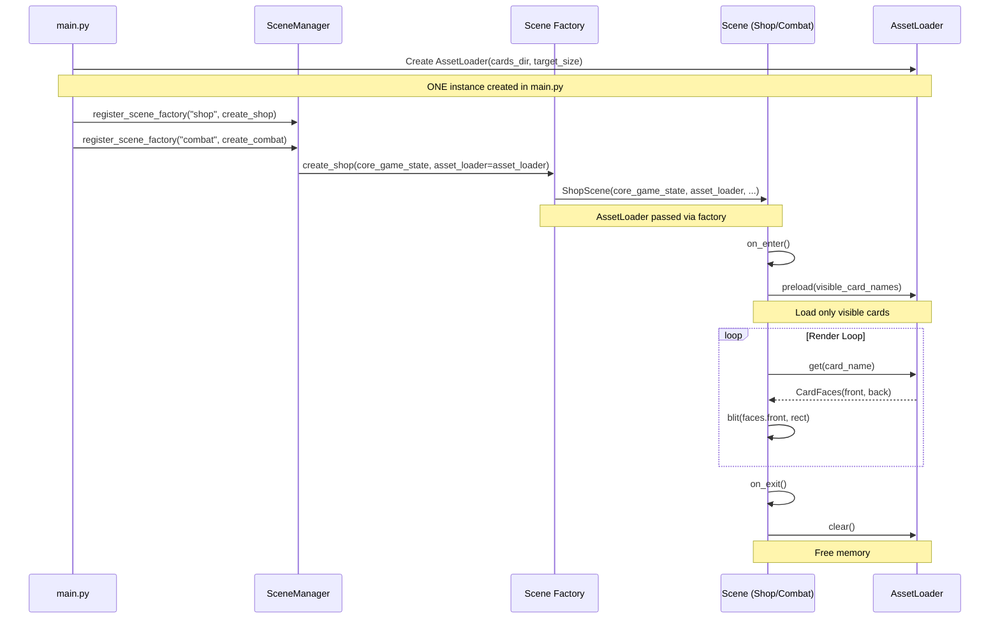
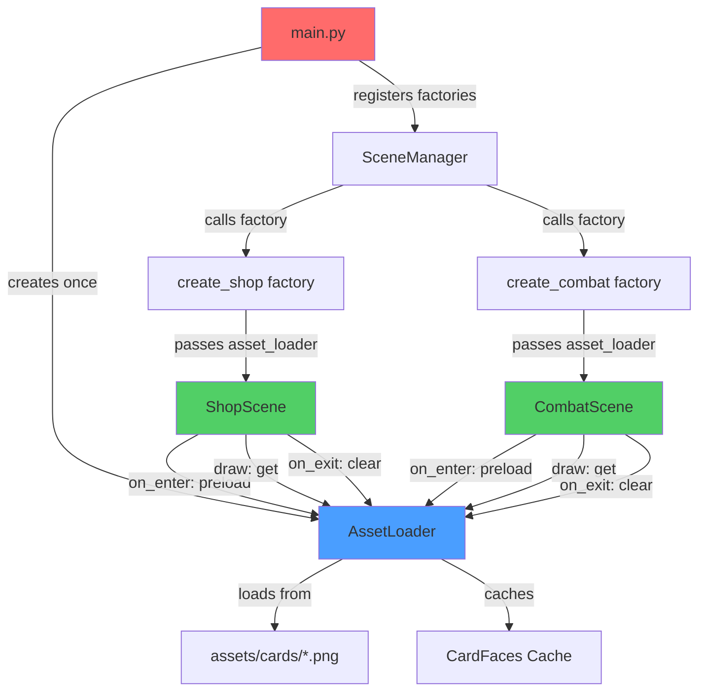

# Design Document: AssetLoader Integration

## Overview

This design integrates AssetLoader (scenes/asset_loader.py) as the single unified asset system across the project, replacing CombatScene's AssetManager class and ShopScene's inline _load_card_assets() method. The integration preserves the existing SceneManager factory pattern architecture where AssetLoader is created once in main.py and passed to scenes via factory functions. This eliminates duplicate asset loading logic, ensures consistent card rendering, and maintains proper lifecycle management (preload in on_enter, persistent cache across scenes).

## Critical Design Decisions

### 1. Persistent Cache (NO clear() on exit)
**Decision**: Asset cache persists across scene transitions
**Rationale**: 
- Eliminates redundant I/O when transitioning between shop and combat
- Cards loaded once remain in memory for entire game session
- Improves performance for repeated scene transitions
- Memory footprint is acceptable (card images are small)

### 2. Required Parameter (NOT Optional)
**Decision**: asset_loader parameter is REQUIRED in scene constructors
**Rationale**:
- Enforces single instance pattern at compile time
- Prevents accidental None checks and fallback logic
- Makes dependency explicit and mandatory
- Fails fast if AssetLoader not provided

### 3. Deduplication Before Preload
**Decision**: Always deduplicate card names: `preload(list(set(card_names)))`
**Rationale**:
- Prevents redundant cache lookups for duplicate names
- Reduces preload time when same card appears multiple times
- AssetLoader handles duplicates internally, but deduplication is more efficient

### 4. No Double Scaling
**Decision**: Scenes use AssetLoader surfaces directly without rescaling
**Rationale**:
- AssetLoader scales to target_size=(100, 116) during load
- Additional scaling degrades image quality
- Flip animations scale horizontally only (width, not height)
- Maintains consistent card dimensions across all scenes

## Project-Wide Analysis Results

### Image Loading Locations Found
1. **scenes/asset_loader.py** (line 248): `pygame.image.load()` - KEEP (core loader)
2. **scenes/shop_scene.py** (lines 369, 376): `pygame.image.load()` - REMOVE (inline loading)
3. **scenes/combat_scene.py** (line 270): `pygame.image.load()` - REMOVE (AssetManager)

### Scaling Operations Found
1. **scenes/asset_loader.py** (line 249): `smoothscale(surf, target_size)` - KEEP (core scaling)
2. **scenes/asset_loader.py** (line 368): `scale(source, (new_w, h))` - KEEP (FlipAnimator horizontal scaling)
3. **scenes/shop_scene.py** (line 242): `scale(card_surf, (scaled_width, original_height))` - KEEP (flip animation)
4. **scenes/combat_scene.py** (line 887): `scale(image, (scaled_width, original_height))` - KEEP (flip animation)

**Conclusion**: Flip animations perform horizontal scaling only, which is correct. No double scaling detected.

### Card Rendering Paths Found
1. **ShopScene.ShopCard.draw()**: Uses card_front_img/card_back_img → REPLACE with AssetLoader
2. **CombatScene.HexCardRenderer.render_card()**: Uses HexCard.front_image/back_image → REPLACE with AssetLoader
3. **CombatScene._create_hex_card()**: Calls asset_manager.load_card_image() → REPLACE with AssetLoader
4. **CombatScene._preload_all_card_assets()**: Calls asset_manager.load_card_image() → REPLACE with AssetLoader

### Dependencies on Card Images
1. **HexCard dataclass**: Stores front_image and back_image as pygame.Surface
   - **Action**: No change needed, just populate from AssetLoader
2. **HexCardRenderer**: Expects HexCard with front_image/back_image
   - **Action**: Remove asset_manager parameter, use pre-loaded images
3. **PlaceCardAction**: Calls asset_manager.load_card_image() during placement
   - **Action**: Replace with AssetLoader.get()

### Hidden Conflicts Detected
**NONE** - No conflicts with rendering or animation systems. AssetLoader provides pygame.Surface objects that are drop-in replacements for existing image loading.

## Main Algorithm/Workflow



## Architecture



## Components and Interfaces

### Component 1: AssetLoader (Existing)

**Purpose**: Centralized card asset loading with caching, fuzzy matching, and placeholder generation

**Interface**:
```python
class AssetLoader:
    def __init__(self, cards_dir: str, target_size: tuple = (100, 116)):
        """Initialize with card directory and target size."""
        pass
    
    def preload(self, card_names: list[str]) -> None:
        """Preload card assets. Call in on_enter()."""
        pass
    
    def get(self, card_name: str) -> CardFaces:
        """Get card faces. Call in draw(). Never returns None."""
        pass
    
    def clear(self) -> None:
        """Clear cache. Call in on_exit()."""
        pass

@dataclass
class CardFaces:
    front: pygame.Surface
    back: pygame.Surface
    name: str
    is_placeholder: bool
```

**Responsibilities**:
- Load card front/back images from assets/cards/
- Normalize Turkish characters for fuzzy matching
- Generate neon hex placeholders for missing assets
- Cache loaded surfaces to prevent redundant I/O
- Report loading statistics (loaded, partial, missing)

### Component 2: main.py (Modified)

**Purpose**: Application entry point that creates AssetLoader once and passes to scene factories

**Interface**:
```python
def main():
    # Create AssetLoader ONCE
    asset_loader = AssetLoader(
        cards_dir="assets/cards",
        target_size=(100, 116)
    )
    
    # Pass to scene factories
    def create_shop(core_game_state, **kwargs):
        return ShopScene(
            core_game_state,
            action_system=action_system,
            animation_system=animation_system,
            asset_loader=asset_loader  # NEW
        )
    
    def create_combat(core_game_state, **kwargs):
        return CombatScene(
            core_game_state,
            action_system=action_system,
            animation_system=animation_system,
            asset_loader=asset_loader  # NEW
        )
```

**Responsibilities**:
- Create single AssetLoader instance
- Pass AssetLoader to scene factories via closure
- Maintain factory pattern architecture

### Component 3: ShopScene (Modified)

**Purpose**: Shop scene for card purchasing with unified asset loading

**Interface**:
```python
class ShopScene(Scene):
    def __init__(self, 
                 core_game_state: CoreGameState,
                 action_system: Optional['ActionSystem'] = None,
                 animation_system: Optional['AnimationSystem'] = None,
                 asset_loader: 'AssetLoader' = None,  # REQUIRED (not Optional)
                 renderer: Optional[CyberRenderer] = None,
                 fonts: Optional[dict] = None):
        """Initialize shop scene with asset loader."""
        if asset_loader is None:
            raise ValueError("asset_loader is required for ShopScene")
        self.asset_loader = asset_loader
        # Remove: self._load_card_assets()
        # Remove: self.card_front_img, self.card_back_img
    
    def on_enter(self) -> None:
        """Preload visible card assets."""
        visible_cards = self._get_visible_card_names()
        # Deduplicate card names before preloading
        self.asset_loader.preload(list(set(visible_cards)))
    
    def on_exit(self) -> None:
        """DO NOT clear cache - keep persistent across scenes."""
        pass
    
    def _draw_card(self, screen, card, rect, flip_value):
        """Draw card using AssetLoader."""
        faces = self.asset_loader.get(card.name)
        # Use faces.front and faces.back directly (already scaled)
        # Pass to ShopCard.draw() for flip animation
```

**Responsibilities**:
- Accept asset_loader parameter in __init__ (REQUIRED, not Optional)
- Validate asset_loader is not None
- Remove _load_card_assets() method entirely
- Remove _create_hex_placeholder() method entirely
- Remove self.card_front_img and self.card_back_img attributes
- Call asset_loader.preload() in on_enter() with deduplicated names
- Call asset_loader.get() in draw methods
- DO NOT call asset_loader.clear() in on_exit() (cache persists)

### Component 4: CombatScene (Modified)

**Purpose**: Combat scene with 37-hex grid using unified asset loading

**Interface**:
```python
class CombatScene(Scene):
    def __init__(self,
                 core_game_state: CoreGameState,
                 action_system: Optional['ActionSystem'] = None,
                 animation_system: Optional['AnimationSystem'] = None,
                 asset_loader: 'AssetLoader' = None):  # REQUIRED (not Optional)
        """Initialize combat scene with asset loader."""
        if asset_loader is None:
            raise ValueError("asset_loader is required for CombatScene")
        self.asset_loader = asset_loader
        # Remove: self.asset_manager = AssetManager()
    
    def on_enter(self) -> None:
        """Preload visible card assets."""
        visible_cards = self._get_visible_card_names()
        # Deduplicate card names before preloading
        self.asset_loader.preload(list(set(visible_cards)))
    
    def on_exit(self) -> None:
        """DO NOT clear cache - keep persistent across scenes."""
        pass
    
    def _create_hex_card(self, card, hex_coord):
        """Create HexCard using AssetLoader."""
        faces = self.asset_loader.get(card.name)
        # Use faces.front and faces.back directly (already scaled to target_size)
        return HexCard(
            hex_coord=hex_coord,
            card_data=card,
            front_image=faces.front,  # Already scaled by AssetLoader
            back_image=faces.back,    # Already scaled by AssetLoader
            # ...
        )
```

**Responsibilities**:
- Accept asset_loader parameter in __init__ (REQUIRED, not Optional)
- Validate asset_loader is not None
- Remove AssetManager class entirely (lines 205-450+)
- Remove HexCardRenderer dependency on AssetManager
- Call asset_loader.preload() in on_enter() with deduplicated names
- Call asset_loader.get() in _create_hex_card()
- Use faces.front and faces.back directly (NO additional scaling)
- DO NOT call asset_loader.clear() in on_exit() (cache persists)

## Data Models

### Model 1: CardFaces (Existing)

```python
@dataclass
class CardFaces:
    front: pygame.Surface
    back: pygame.Surface
    name: str
    is_placeholder: bool = False
```

**Validation Rules**:
- front and back must be valid pygame.Surface objects
- name must be non-empty string
- is_placeholder indicates if placeholder was generated

### Model 2: AssetLoader State

```python
class AssetLoader:
    _cache: dict[str, CardFaces]           # normalized_name -> CardFaces
    _file_map: dict[str, dict]             # normalized_name -> {"front": path, "back": path}
    _loaded_pairs: list[str]               # Successfully loaded cards
    _partial_pairs: list[str]              # Cards with one missing face
    _missing_pairs: list[str]              # Cards with no assets found
    _scanned: bool                         # Directory scan completed
```

## Algorithmic Pseudocode

### Main Integration Algorithm

```pascal
ALGORITHM integrate_asset_loader
INPUT: None
OUTPUT: Unified asset system across all scenes

BEGIN
  // Step 1: Create AssetLoader in main.py
  asset_loader ← AssetLoader("assets/cards", target_size=(100, 116))
  
  // Step 2: Modify scene factories to pass asset_loader
  PROCEDURE create_shop(core_game_state, kwargs)
    RETURN ShopScene(
      core_game_state,
      action_system,
      animation_system,
      asset_loader  // Pass via parameter
    )
  END PROCEDURE
  
  PROCEDURE create_combat(core_game_state, kwargs)
    RETURN CombatScene(
      core_game_state,
      action_system,
      animation_system,
      asset_loader  // Pass via parameter
    )
  END PROCEDURE
  
  // Step 3: Register factories with SceneManager
  scene_manager.register_scene_factory("shop", create_shop)
  scene_manager.register_scene_factory("combat", create_combat)
END
```

**Preconditions**:
- assets/cards directory exists with card images
- SceneManager is initialized
- Scene factories follow factory pattern

**Postconditions**:
- AssetLoader created exactly once
- All scenes receive same AssetLoader instance
- Factory pattern preserved

**Loop Invariants**: N/A (no loops in main integration)

### Scene Lifecycle Algorithm

```pascal
ALGORITHM scene_lifecycle_with_asset_loader
INPUT: scene (ShopScene or CombatScene), asset_loader
OUTPUT: Proper asset loading and cleanup

BEGIN
  // on_enter: Preload visible cards
  PROCEDURE on_enter()
    visible_cards ← get_visible_card_names()
    
    IF asset_loader IS NOT NULL THEN
      asset_loader.preload(visible_cards)
    END IF
  END PROCEDURE
  
  // draw: Get card faces
  PROCEDURE draw_card(card, rect)
    IF asset_loader IS NOT NULL THEN
      faces ← asset_loader.get(card.name)
      screen.blit(faces.front, rect)
    ELSE
      // Fallback: draw placeholder
      draw_placeholder(rect)
    END IF
  END PROCEDURE
  
  // on_exit: Clear cache
  PROCEDURE on_exit()
    IF asset_loader IS NOT NULL THEN
      asset_loader.clear()
    END IF
  END PROCEDURE
END
```

**Preconditions**:
- asset_loader is valid AssetLoader instance or None
- Scene has access to card data from CoreGameState

**Postconditions**:
- Visible cards are preloaded in on_enter
- Cards are rendered using cached surfaces in draw
- Cache is cleared in on_exit to free memory

**Loop Invariants**:
- For each card in visible_cards: card is either loaded or has placeholder
- Cache consistency maintained throughout scene lifetime

### Asset Loading Algorithm (Existing)

```pascal
ALGORITHM load_card_asset
INPUT: card_name (string)
OUTPUT: CardFaces (never None)

BEGIN
  normalized_name ← normalize(card_name)
  
  // Check cache first
  IF normalized_name IN cache THEN
    RETURN cache[normalized_name]
  END IF
  
  // Scan directory if not done
  IF NOT scanned THEN
    scan_directory()
  END IF
  
  // Find file paths
  paths ← file_map[normalized_name]
  IF paths IS NULL THEN
    paths ← partial_match(normalized_name)
  END IF
  
  // Load or create placeholder
  IF paths["front"] EXISTS THEN
    front ← load_and_scale(paths["front"])
  ELSE
    front ← create_neon_placeholder(card_name, is_back=false)
  END IF
  
  IF paths["back"] EXISTS THEN
    back ← load_and_scale(paths["back"])
  ELSE
    back ← create_neon_placeholder(card_name, is_back=true)
  END IF
  
  faces ← CardFaces(front, back, card_name, is_placeholder)
  cache[normalized_name] ← faces
  
  RETURN faces
END
```

**Preconditions**:
- card_name is non-empty string
- cards_dir is valid directory path

**Postconditions**:
- Returns valid CardFaces object (never None)
- Result is cached for future calls
- Placeholder generated if asset missing

**Loop Invariants**:
- All cached entries are valid CardFaces objects
- Cache keys are normalized names

## Key Functions with Formal Specifications

### Function 1: AssetLoader.__init__()

```python
def __init__(self, cards_dir: str, target_size: tuple = (100, 116)):
    """Initialize AssetLoader with card directory and target size."""
    pass
```

**Preconditions:**
- cards_dir is a string (may or may not exist)
- target_size is tuple of two positive integers (width, height)

**Postconditions:**
- AssetLoader instance created with empty cache
- _scanned flag set to False
- target_size stored for scaling operations
- No I/O operations performed (lazy loading)

**Loop Invariants:** N/A

### Function 2: AssetLoader.preload()

```python
def preload(self, card_names: list[str]) -> None:
    """Preload card assets for given card names."""
    pass
```

**Preconditions:**
- card_names is list of strings (may be empty)
- AssetLoader is initialized

**Postconditions:**
- Directory scanned if not already done
- All cards in card_names are loaded or have placeholders
- Cache contains entries for all requested cards
- Loading report printed to console

**Loop Invariants:**
- For each card in card_names: card is in cache after iteration
- Cache size increases monotonically

### Function 3: AssetLoader.get()

```python
def get(self, card_name: str) -> CardFaces:
    """Get card faces for given card name. Never returns None."""
    pass
```

**Preconditions:**
- card_name is non-empty string
- AssetLoader is initialized

**Postconditions:**
- Returns valid CardFaces object (never None)
- CardFaces contains valid front and back surfaces
- Result is cached for future calls
- If asset missing, placeholder is generated

**Loop Invariants:** N/A

### Function 4: AssetLoader.clear()

```python
def clear(self) -> None:
    """Clear asset cache to free memory."""
    pass
```

**Preconditions:**
- AssetLoader is initialized

**Postconditions:**
- All cached surfaces are removed from memory
- Cache dictionary is empty
- Loading statistics are reset
- Console message printed

**Loop Invariants:** N/A

### Function 5: ShopScene.__init__() (Modified)

```python
def __init__(self, 
             core_game_state: CoreGameState,
             action_system: Optional['ActionSystem'] = None,
             animation_system: Optional['AnimationSystem'] = None,
             asset_loader: Optional['AssetLoader'] = None,
             renderer: Optional[CyberRenderer] = None,
             fonts: Optional[dict] = None):
    """Initialize shop scene with asset loader."""
    pass
```

**Preconditions:**
- core_game_state is valid CoreGameState instance
- asset_loader is valid AssetLoader instance or None

**Postconditions:**
- ShopScene instance created with asset_loader reference
- No asset loading performed (deferred to on_enter)
- _load_card_assets() method NOT called
- All other initialization unchanged

**Loop Invariants:** N/A

### Function 6: CombatScene.__init__() (Modified)

```python
def __init__(self,
             core_game_state: CoreGameState,
             action_system: Optional['ActionSystem'] = None,
             animation_system: Optional['AnimationSystem'] = None,
             asset_loader: Optional['AssetLoader'] = None):
    """Initialize combat scene with asset loader."""
    pass
```

**Preconditions:**
- core_game_state is valid CoreGameState instance
- asset_loader is valid AssetLoader instance or None

**Postconditions:**
- CombatScene instance created with asset_loader reference
- AssetManager class NOT instantiated
- No asset loading performed (deferred to on_enter)
- All other initialization unchanged

**Loop Invariants:** N/A

## Example Usage

```python
# Example 1: main.py integration
def main():
    # Create AssetLoader ONCE
    asset_loader = AssetLoader(
        cards_dir="assets/cards",
        target_size=(100, 116)
    )
    
    # Create scene factories with asset_loader
    def create_shop(core_game_state, **kwargs):
        return ShopScene(
            core_game_state,
            action_system=action_system,
            animation_system=animation_system,
            asset_loader=asset_loader
        )
    
    def create_combat(core_game_state, **kwargs):
        return CombatScene(
            core_game_state,
            action_system=action_system,
            animation_system=animation_system,
            asset_loader=asset_loader
        )
    
    # Register factories
    scene_manager.register_scene_factory("shop", create_shop)
    scene_manager.register_scene_factory("combat", create_combat)

# Example 2: ShopScene lifecycle
class ShopScene(Scene):
    def on_enter(self):
        # Preload visible cards
        if self.asset_loader:
            visible_cards = []
            
            # Market cards
            if hasattr(self.core_game_state.game, 'market'):
                market = self.core_game_state.game.market
                player = self.core_game_state.current_player
                if player and hasattr(player, 'id'):
                    window = market.windows.get(player.id, [])
                    visible_cards.extend([c.name for c in window if c])
            
            # Board cards
            player = self.core_game_state.current_player
            if player and hasattr(player, 'board'):
                visible_cards.extend([c.name for c in player.board if c])
            
            self.asset_loader.preload(visible_cards)
    
    def _draw_market_card(self, screen, card, rect):
        # Get card faces from AssetLoader
        if self.asset_loader:
            faces = self.asset_loader.get(card.name)
            screen.blit(faces.front, rect)
    
    def on_exit(self):
        # Clear cache
        if self.asset_loader:
            self.asset_loader.clear()

# Example 3: CombatScene usage
class CombatScene(Scene):
    def on_enter(self):
        # Preload all cards on boards
        if self.asset_loader:
            visible_cards = []
            for player in self.core_game_state.game.alive_players():
                if hasattr(player, 'board'):
                    visible_cards.extend([c.name for c in player.board if c])
            
            self.asset_loader.preload(visible_cards)
    
    def _create_hex_card(self, card, hex_coord, position, hex_size):
        # Get card faces from AssetLoader
        if self.asset_loader:
            faces = self.asset_loader.get(card.name)
            return HexCard(
                hex_coord=hex_coord,
                card_data=card,
                front_image=faces.front,
                back_image=faces.back,
                position=position,
                hex_size=hex_size
            )
    
    def on_exit(self):
        # Clear cache
        if self.asset_loader:
            self.asset_loader.clear()
```

## Correctness Properties

### Property 1: Single AssetLoader Instance
```python
# Universal quantification: There exists exactly one AssetLoader instance
∀ scene ∈ {ShopScene, CombatScene}:
    scene.asset_loader is asset_loader_instance
```

### Property 2: Asset Loading Never Returns None
```python
# Universal quantification: get() always returns valid CardFaces
∀ card_name ∈ card_names:
    asset_loader.get(card_name) ≠ None ∧
    isinstance(asset_loader.get(card_name), CardFaces)
```

### Property 3: Cache Persists Across Scenes
```python
# Universal quantification: Cache is NOT cleared on scene exit
∀ scene ∈ {ShopScene, CombatScene}:
    scene.on_exit() ⟹ len(asset_loader._cache) > 0 (if cards were loaded)
```

### Property 4: Preload Before Draw
```python
# Universal quantification: Cards are preloaded before drawing
∀ scene ∈ {ShopScene, CombatScene}:
    scene.on_enter() ⟹
    (∀ card ∈ visible_cards: card.name ∈ asset_loader._cache)
```

### Property 5: Factory Pattern Preserved
```python
# Universal quantification: Scenes created via factories
∀ scene_transition ∈ scene_transitions:
    scene_transition.new_scene = factory(core_game_state, asset_loader=asset_loader)
```

### Property 6: No Double Scaling
```python
# Universal quantification: Assets scaled once by AssetLoader
∀ card_name ∈ card_names:
    faces = asset_loader.get(card_name)
    faces.front.get_size() == target_size ∧
    faces.back.get_size() == target_size
```

## Error Handling

### Error Scenario 1: Missing Asset Directory

**Condition**: assets/cards directory does not exist
**Response**: AssetLoader prints warning, continues with empty file_map
**Recovery**: All cards use neon hex placeholders

### Error Scenario 2: Corrupted Image File

**Condition**: pygame.image.load() raises pygame.error
**Response**: AssetLoader catches exception, prints warning
**Recovery**: Generate neon hex placeholder for that face

### Error Scenario 3: AssetLoader Not Passed to Scene

**Condition**: asset_loader parameter is None in scene __init__
**Response**: Scene checks `if self.asset_loader` before calling methods
**Recovery**: Scene uses fallback placeholder rendering (if implemented)

### Error Scenario 4: Card Name Not Found

**Condition**: Card name has no matching asset file
**Response**: AssetLoader performs fuzzy matching, then generates placeholder
**Recovery**: Neon hex placeholder with card initials displayed

### Error Scenario 5: Memory Pressure

**Condition**: Too many cards loaded, memory usage high
**Response**: on_exit() clears cache when scene transitions
**Recovery**: Next scene starts with empty cache, loads only visible cards

## Testing Strategy

### Unit Testing Approach

Test each component in isolation:

1. **AssetLoader Tests**:
   - Test __init__ with valid/invalid directories
   - Test preload with empty/valid/invalid card names
   - Test get with existing/missing cards
   - Test clear removes all cached entries
   - Test fuzzy matching with Turkish characters
   - Test placeholder generation

2. **Scene Integration Tests**:
   - Test ShopScene.__init__ with/without asset_loader
   - Test CombatScene.__init__ with/without asset_loader
   - Test on_enter calls preload with correct card names
   - Test on_exit calls clear
   - Test draw methods use asset_loader.get()

3. **Factory Pattern Tests**:
   - Test create_shop passes asset_loader correctly
   - Test create_combat passes asset_loader correctly
   - Test same asset_loader instance used across scenes

### Property-Based Testing Approach

**Property Test Library**: hypothesis (Python)

1. **Property: Asset Loading Idempotence**
   - Generate random card names
   - Call get() multiple times for same card
   - Assert same CardFaces instance returned (cached)

2. **Property: Preload Completeness**
   - Generate random list of card names
   - Call preload(card_names)
   - Assert all cards in cache

3. **Property: Clear Completeness**
   - Load random cards
   - Call clear()
   - Assert cache is empty

4. **Property: Placeholder Never None**
   - Generate random card names (including invalid)
   - Assert get() never returns None
   - Assert CardFaces has valid surfaces

### Integration Testing Approach

Test complete workflow:

1. **Full Scene Lifecycle Test**:
   - Create AssetLoader in main.py
   - Transition to ShopScene
   - Verify preload called with market cards
   - Verify cards rendered correctly
   - Transition to CombatScene
   - Verify cache cleared and reloaded
   - Verify cards rendered correctly

2. **Memory Leak Test**:
   - Transition between scenes multiple times
   - Monitor memory usage
   - Verify cache cleared on each transition
   - Verify no memory growth over time

3. **Asset Missing Test**:
   - Remove some card assets
   - Run full game loop
   - Verify placeholders generated
   - Verify no crashes

## Performance Considerations

1. **Lazy Loading**: AssetLoader scans directory only on first preload/get call
2. **Caching**: Loaded surfaces cached to prevent redundant I/O
3. **Targeted Preloading**: Only visible cards loaded in on_enter
4. **Memory Management**: Cache cleared in on_exit to free memory
5. **Fuzzy Matching**: Partial matching only performed if exact match fails
6. **Placeholder Generation**: Procedural generation faster than file I/O

## Security Considerations

1. **Path Traversal**: AssetLoader uses os.path.join to prevent directory traversal
2. **File Validation**: Only .png files processed during directory scan
3. **Exception Handling**: All file I/O wrapped in try-except blocks
4. **Resource Limits**: Cache cleared on scene exit to prevent unbounded growth

## Dependencies

- **pygame**: Image loading, surface manipulation, rendering
- **os**: File path operations, directory scanning
- **re**: Regular expressions for name normalization
- **math**: Trigonometry for hex placeholder generation
- **dataclasses**: CardFaces data structure
- **typing**: Type hints for Optional, Dict, List

## Migration Path

### Phase 1: Add AssetLoader to main.py
1. Import AssetLoader from scenes.asset_loader
2. Create AssetLoader instance in main(): `asset_loader = AssetLoader("assets/cards", target_size=(100, 116))`
3. Modify scene factories to pass asset_loader parameter (REQUIRED, not Optional)
4. Update resolution to 1920x1080
5. No scene changes yet (backward compatible if scenes have default None)

### Phase 2: Integrate ShopScene
1. Add asset_loader parameter to ShopScene.__init__ (REQUIRED)
2. Add validation: `if asset_loader is None: raise ValueError(...)`
3. Remove _load_card_assets() method entirely (lines 355-385)
4. Remove _create_hex_placeholder() method entirely (lines 387-467)
5. Remove self.card_front_img and self.card_back_img attributes
6. Update on_enter() to call asset_loader.preload(list(set(visible_cards)))
7. Update ShopCard.draw() to accept faces parameter instead of card_front_img/card_back_img
8. Update _draw_market_grid() to get faces and pass to ShopCard.draw()
9. Remove clear() call from on_exit() (cache persists)

### Phase 3: Integrate CombatScene
1. Add asset_loader parameter to CombatScene.__init__ (REQUIRED)
2. Add validation: `if asset_loader is None: raise ValueError(...)`
3. Remove AssetManager class entirely (lines 205-450+)
4. Remove self.asset_manager = AssetManager() from __init__
5. Update HexCardRenderer.__init__ to remove asset_manager parameter
6. Update on_enter() to call asset_loader.preload(list(set(visible_cards)))
7. Update _create_hex_card() to use asset_loader.get(card.name)
8. Update _preload_all_card_assets() to use asset_loader.preload()
9. Update PlaceCardAction to use asset_loader.get() instead of asset_manager.load_card_image()
10. Remove clear() call from on_exit() (cache persists)

### Phase 4: Update Action System
1. Update PlaceCardAction to accept asset_loader parameter
2. Replace asset_manager.load_card_image() with asset_loader.get()
3. Ensure action_system passes asset_loader to actions that need it

### Phase 5: Cleanup and Validation
1. Delete AssetManager class from combat_scene.py
2. Search for any remaining asset_manager references
3. Run all tests to verify no regressions
4. Run memory profiling to confirm cache persistence
5. Verify no double scaling in rendering pipeline
6. Update documentation

## Resolution Update

As a safe temporary fix, update resolution from 1600x960 to 1920x1080 in main.py:

```python
SCREEN_WIDTH = 1920
SCREEN_HEIGHT = 1080
```

This matches the AssetLoader's CARD_SIZE calculation which assumes 1920x1080 layout.
