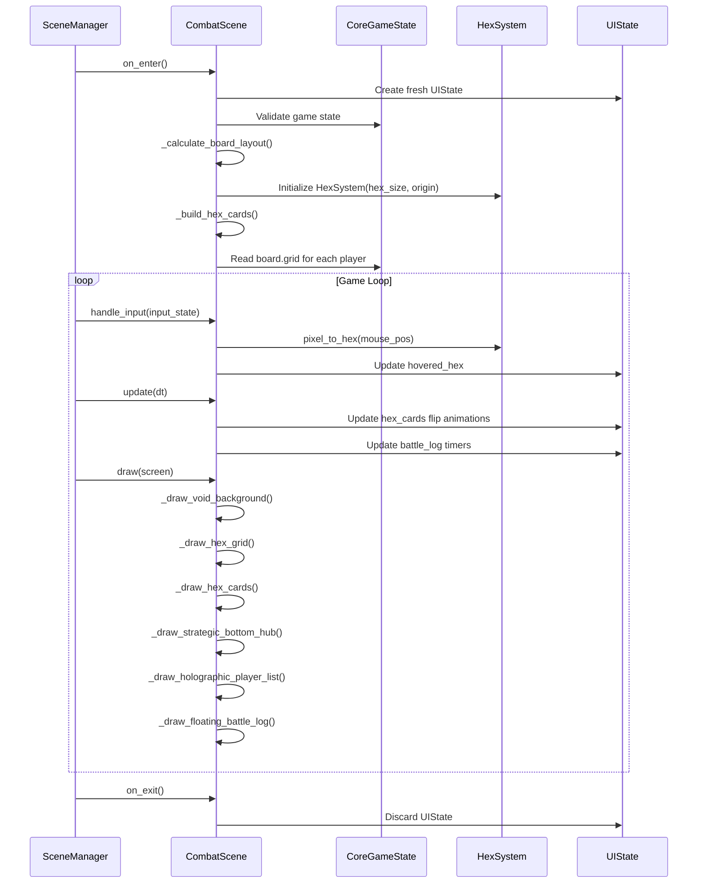
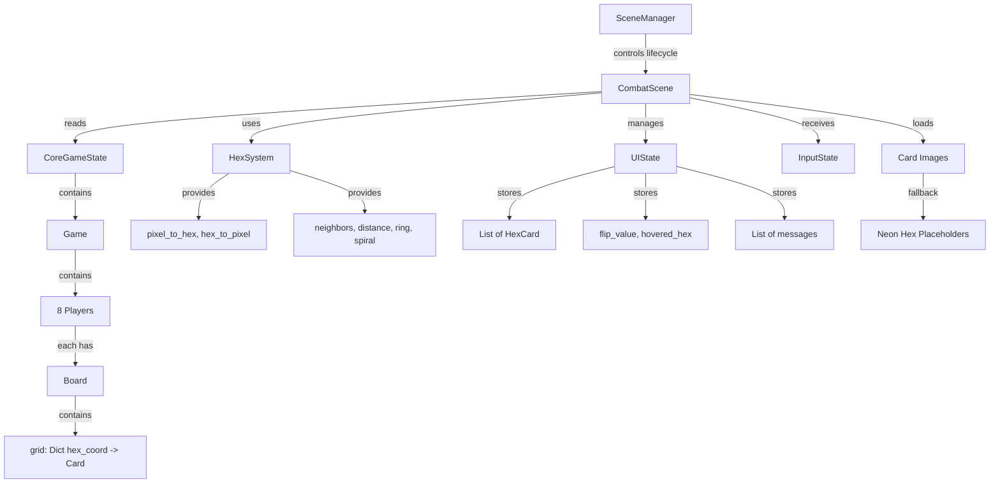

# Design Document: Combat Scene 37-Hex Rebuild

## Overview

This design specifies a complete architectural rebuild of `combat_scene.py` for a pygame-based autochess game. The scene displays a 37-hex radial grid (radius=3) with unit cards, integrates with existing CoreGameState and HexSystem, and provides a fixed UI layout with strict no-overlap rules. The design prioritizes deterministic geometry, crash-proof rendering, and instant scene transitions while maintaining 60 FPS performance.

The combat scene serves as the tactical visualization layer where players observe their board state, unit placements, synergies, and combat outcomes. It is a read-only view (no placement during combat) with hover interactions for card inspection.

## Main Algorithm/Workflow



## Architecture

### System Context Diagram



### Component Responsibilities

**CombatScene**
- Lifecycle: on_enter, on_exit, handle_input, update, draw
- Layout calculation: Compute hex_size, grid origin, panel boundaries
- Rendering orchestration: Call all _draw_* methods in strict order
- Input routing: Convert mouse position to hex coordinates, update UIState
- Asset management: Load card images with fallback to placeholders

**HexSystem (Existing, Read-Only)**
- Coordinate conversion: pixel_to_hex, hex_to_pixel
- Geometry queries: neighbors, distance, ring, spiral
- Grid generation: radial_grid(radius=3) → 37 hex coordinates
- MUST NOT: Store unit data, manage state, create duplicate grids

**UIState (Existing, Extended)**
- Animation state: flip_value per hex, interpolation progress
- Interaction state: hovered_hex, selected_hex
- Battle log: List of (message, timestamp, fade_alpha)
- Hex cards: List of HexCard objects for rendering

**CoreGameState (Existing, Source of Truth)**
- Game state: Players, boards, units, economy
- Combat data: Synergies, combat power, HP
- Passive data: Passive names, descriptions, icons
- READ-ONLY from CombatScene perspective

## Grid Geometrisi ve Matematiksel Altyapı

### 37-Hex Radial Grid Definition

**Coordinate System: Axial (q, r)**
- Center hex: (0, 0)
- Radius: 3
- Total hexes: 1 + 6 + 12 + 18 = 37

**Generation Algorithm**
```
radial_grid(radius=3):
    hexes = [(0, 0)]  # center
    for ring in range(1, radius+1):
        hexes += ring_coordinates(ring)
    return hexes  # exactly 37 hexes
```

**Ring Structure**
- Ring 0: 1 hex (center)
- Ring 1: 6 hexes
- Ring 2: 12 hexes
- Ring 3: 18 hexes

### Pixel Conversion (MANDATORY FORMULAS)

**Hex Dimensions**
```
hex_width = sqrt(3) * hex_size
hex_height = 2 * hex_size
vertical_spacing = 1.5 * hex_size
```

**Axial to Pixel (Flat-Top Orientation)**
```
pixel_x = origin_x + hex_size * (sqrt(3) * q + sqrt(3)/2 * r)
pixel_y = origin_y + hex_size * (3/2 * r)
```

**Pixel to Axial (Inverse)**
```
frac_q = (sqrt(3)/3 * (x - origin_x) - 1/3 * (y - origin_y)) / hex_size
frac_r = (2/3 * (y - origin_y)) / hex_size
q, r = axial_round(frac_q, frac_r)
```

**Axial Rounding (Cube Coordinate Method)**
```
# Convert axial to cube
x = q
z = r
y = -x - z

# Round to integers
rx = round(x)
ry = round(y)
rz = round(z)

# Fix rounding errors (sum must be 0)
x_diff = abs(rx - x)
y_diff = abs(ry - y)
z_diff = abs(rz - z)

if x_diff > y_diff and x_diff > z_diff:
    rx = -ry - rz
elif y_diff > z_diff:
    ry = -rx - rz
else:
    rz = -rx - ry

# Convert back to axial
q = rx
r = rz
```

### Layout Calculation Algorithm

**Step 1: Define Fixed UI Boundaries**
```
SCREEN_WIDTH = 1920
SCREEN_HEIGHT = 1080

LEFT_PANEL_WIDTH = 300
RIGHT_PANEL_WIDTH = 300
BOTTOM_HUB_HEIGHT = 150
TOP_MARGIN = 50

available_width = SCREEN_WIDTH - LEFT_PANEL_WIDTH - RIGHT_PANEL_WIDTH
available_height = SCREEN_HEIGHT - BOTTOM_HUB_HEIGHT - TOP_MARGIN
```

**Step 2: Calculate Maximum Hex Size**
```
# Grid bounding box for radius=3
max_q = 3
max_r = 3
grid_width_hexes = 2 * max_q + 1  # 7 hexes wide
grid_height_hexes = 2 * max_r + 1  # 7 hexes tall

# Calculate hex_size to fit grid in available space
hex_size_by_width = available_width / (sqrt(3) * grid_width_hexes)
hex_size_by_height = available_height / (1.5 * grid_height_hexes + 0.5)

# Take minimum and apply safety margin
hex_size = min(hex_size_by_width, hex_size_by_height) * 0.85
```

**Step 3: Calculate Grid Origin (Center Point)**
```
grid_area_left = LEFT_PANEL_WIDTH
grid_area_right = SCREEN_WIDTH - RIGHT_PANEL_WIDTH
grid_area_top = TOP_MARGIN
grid_area_bottom = SCREEN_HEIGHT - BOTTOM_HUB_HEIGHT

origin_x = (grid_area_left + grid_area_right) / 2
origin_y = (grid_area_top + grid_area_bottom) / 2
```

**Step 4: Verify No Overlap**
```
# Calculate actual grid bounds
grid_pixel_width = sqrt(3) * hex_size * grid_width_hexes
grid_pixel_height = 1.5 * hex_size * grid_height_hexes

grid_left = origin_x - grid_pixel_width / 2
grid_right = origin_x + grid_pixel_width / 2
grid_top = origin_y - grid_pixel_height / 2
grid_bottom = origin_y + grid_pixel_height / 2

# Assert no overlap
assert grid_left >= LEFT_PANEL_WIDTH
assert grid_right <= SCREEN_WIDTH - RIGHT_PANEL_WIDTH
assert grid_top >= TOP_MARGIN
assert grid_bottom <= SCREEN_HEIGHT - BOTTOM_HUB_HEIGHT
```

### Hex Neighbor Calculation

**Axial Direction Vectors**
```
AXIAL_DIRECTIONS = [
    (+1,  0),  # East
    (+1, -1),  # Northeast
    ( 0, -1),  # Northwest
    (-1,  0),  # West
    (-1, +1),  # Southwest
    ( 0, +1),  # Southeast
]
```

**Neighbor Function**
```
def neighbors(q, r):
    return [(q + dq, r + dr) for dq, dr in AXIAL_DIRECTIONS]
```

**Distance Function (Cube Coordinate)**
```
def distance(q1, r1, q2, r2):
    x1, z1 = q1, r1
    y1 = -x1 - z1
    x2, z2 = q2, r2
    y2 = -x2 - z2
    return (abs(x1 - x2) + abs(y1 - y2) + abs(z1 - z2)) / 2
```

### Rendering Geometry

**Hex Vertices (Flat-Top, Clockwise from Top-Right)**
```
def hex_corners(center_x, center_y, size):
    angles = [0, 60, 120, 180, 240, 300]  # degrees
    corners = []
    for angle in angles:
        rad = math.radians(angle)
        x = center_x + size * math.cos(rad)
        y = center_y + size * math.sin(rad)
        corners.append((x, y))
    return corners
```

**Card Rendering Box (15% Internal Padding)**
```
def card_render_rect(center_x, center_y, hex_size):
    card_width = sqrt(3) * hex_size * 0.85
    card_height = 2 * hex_size * 0.85
    left = center_x - card_width / 2
    top = center_y - card_height / 2
    return pygame.Rect(left, top, card_width, card_height)
```

### Grid Sync Strategy

**Single Source of Truth: HexSystem Instance**
- CombatScene creates ONE HexSystem instance in on_enter
- All coordinate conversions use this instance
- hex_size and origin are calculated once and frozen
- No duplicate grid generation

**Coordinate Flow**
```
Mouse Input → pixel_to_hex() → (q, r) → Lookup in CoreGameState.board.grid → Card Data
Card Data → (q, r) → hex_to_pixel() → (x, y) → Render Position
```

**Validation**
- After layout calculation, verify all 37 hexes are within screen bounds
- Log warning if any hex center is outside available area
- Clamp hex_size if necessary (should never happen with 15% margin)

---

**Bu bölüm tamamlandı. Onayınızı bekliyorum. Sonraki bölüm: HUD ve Wing Layout.**


## HUD ve Wing Layout

### Fixed Layout Map (ASCII)

```
┌─────────────────────────────────────────────────────────────────────────────┐
│                              TOP MARGIN (50px)                               │
├──────────────┬───────────────────────────────────────────┬──────────────────┤
│              │                                           │                  │
│  LEFT PANEL  │                                           │   RIGHT PANEL    │
│   (300px)    │                                           │     (300px)      │
│              │                                           │                  │
│  ┌────────┐  │                                           │  ┌────────────┐  │
│  │Passive │  │                                           │  │  Player 1  │  │
│  │ Icons  │  │                                           │  │  HP: ████  │  │
│  │        │  │                                           │  ├────────────┤  │
│  │  [P1]  │  │                                           │  │  Player 2  │  │
│  │  [P2]  │  │              HEX GRID AREA                │  │  HP: ███   │  │
│  │  [P3]  │  │            (37 hexes, r=3)                │  ├────────────┤  │
│  │        │  │                                           │  │  Player 3  │  │
│  └────────┘  │          (Dynamically Centered)           │  │  HP: ██    │  │
│              │                                           │  ├────────────┤  │
│  ┌────────┐  │                                           │  │    ...     │  │
│  │Passive │  │                                           │  │            │  │
│  │  Text  │  │                                           │  │  Synergy   │  │
│  │        │  │                                           │  │   Icons    │  │
│  │ "Desc" │  │                                           │  │  [S1][S2]  │  │
│  └────────┘  │                                           │  └────────────┘  │
│              │                                           │                  │
│  ┌────────┐  │                                           │                  │
│  │ Hand/  │  │                                           │                  │
│  │ Deck   │  │                                           │                  │
│  └────────┘  │                                           │                  │
│              │                                           │                  │
├──────────────┴───────────────────────────────────────────┴──────────────────┤
│                         BOTTOM HUB (150px)                                   │
│  Gold: 50 | Income: +5 | Combo: 3x | Power: 120 | Synergies: [A][B][C]     │
└─────────────────────────────────────────────────────────────────────────────┘
```

### Panel Specifications

**LEFT PANEL (300px width)**
- Position: x=0, y=TOP_MARGIN, width=300, height=SCREEN_HEIGHT-TOP_MARGIN-BOTTOM_HUB_HEIGHT
- Background: Semi-transparent dark (rgba: 20, 20, 40, 200)
- Border: 2px cyan glow

**Components (Top to Bottom):**
1. Passive Icons Section (y_offset: 20)
   - Icon size: 64x64
   - Spacing: 10px vertical
   - Max visible: 5 passives (scrollable if more)
   - Render: Load from assets/data/passives.txt, fallback to colored squares

2. Passive Description Section (y_offset: 400)
   - Text area: 260x200
   - Font: 14px, white
   - Shows description of hovered/selected passive
   - Word wrap enabled

3. Hand/Deck Display (y_offset: 650)
   - Shows: "Hand: 3 | Deck: 27"
   - Font: 16px, cyan
   - Icon: Small card icon (32x32)

**RIGHT PANEL (300px width)**
- Position: x=SCREEN_WIDTH-300, y=TOP_MARGIN, width=300, height=SCREEN_HEIGHT-TOP_MARGIN-BOTTOM_HUB_HEIGHT
- Background: Semi-transparent dark (rgba: 20, 20, 40, 200)
- Border: 2px magenta glow

**Components (Top to Bottom):**
1. Player List (y_offset: 20)
   - Entry height: 80px
   - Max visible: 8 players (scrollable if needed)
   - Per entry:
     - Player name (from lobby strategy selection)
     - HP bar (width: 250px, height: 20px)
     - HP text: "HP: 85/100"
     - Color: Green (>66%), Yellow (33-66%), Red (<33%)
     - Highlight current player with gold border

2. Synergy Icons (y_offset: 700)
   - Icon size: 48x48
   - Grid: 4 columns x 2 rows
   - Shows active synergies for current player
   - Tooltip on hover: synergy name + bonus

**BOTTOM HUB (150px height)**
- Position: x=0, y=SCREEN_HEIGHT-150, width=SCREEN_WIDTH, height=150
- Background: Semi-transparent dark (rgba: 20, 20, 40, 220)
- Border: 2px top border, white glow

**Components (Left to Right):**
1. Gold Display (x_offset: 50)
   - Icon: Gold coin (32x32)
   - Text: "Gold: 50"
   - Font: 20px, yellow

2. Income Display (x_offset: 250)
   - Icon: Arrow up (24x24)
   - Text: "Income: +5"
   - Font: 18px, green

3. Combo Score (x_offset: 450)
   - Icon: Star (28x28)
   - Text: "Combo: 3x"
   - Font: 18px, orange

4. Combat Power (x_offset: 650)
   - Icon: Sword (32x32)
   - Text: "Power: 120"
   - Font: 20px, red

5. Active Synergies (x_offset: 900)
   - Label: "Synergies:"
   - Icons: 32x32 each, horizontal row
   - Max visible: 6 (scroll if more)
   - Color-coded by synergy type

6. Potential Synergies (x_offset: 1400)
   - Label: "Potential:" (grayed out)
   - Icons: 24x24 each, semi-transparent
   - Shows synergies 1 unit away from activation

### Layout Calculation (Deterministic)

**Constants (Immutable)**
```python
SCREEN_WIDTH = 1920
SCREEN_HEIGHT = 1080
LEFT_PANEL_WIDTH = 300
RIGHT_PANEL_WIDTH = 300
BOTTOM_HUB_HEIGHT = 150
TOP_MARGIN = 50
```

**Grid Area Boundaries**
```python
grid_area = {
    'left': LEFT_PANEL_WIDTH,
    'right': SCREEN_WIDTH - RIGHT_PANEL_WIDTH,
    'top': TOP_MARGIN,
    'bottom': SCREEN_HEIGHT - BOTTOM_HUB_HEIGHT,
    'width': SCREEN_WIDTH - LEFT_PANEL_WIDTH - RIGHT_PANEL_WIDTH,  # 1320px
    'height': SCREEN_HEIGHT - TOP_MARGIN - BOTTOM_HUB_HEIGHT,      # 880px
}
```

**Hex Size Calculation (Guaranteed Fit)**
```python
# Maximum grid extent for radius=3
max_q_extent = 3
max_r_extent = 3

# Bounding box in hex units
grid_width_in_hexes = 2 * max_q_extent + 1  # 7
grid_height_in_hexes = 2 * max_r_extent + 1  # 7

# Calculate hex_size to fit
hex_size_by_width = grid_area['width'] / (sqrt(3) * grid_width_in_hexes)
hex_size_by_height = grid_area['height'] / (1.5 * grid_height_in_hexes + 0.5)

# Take minimum and apply 15% safety margin
hex_size = min(hex_size_by_width, hex_size_by_height) * 0.85

# Result: hex_size ≈ 70-80px (depends on exact calculation)
```

**Grid Origin (Exact Center)**
```python
origin_x = (grid_area['left'] + grid_area['right']) / 2  # 960px
origin_y = (grid_area['top'] + grid_area['bottom']) / 2  # 490px
```

**Overlap Prevention (Assertion)**
```python
# Calculate actual grid bounds
grid_pixel_width = sqrt(3) * hex_size * grid_width_in_hexes
grid_pixel_height = 1.5 * hex_size * grid_height_in_hexes

grid_bounds = {
    'left': origin_x - grid_pixel_width / 2,
    'right': origin_x + grid_pixel_width / 2,
    'top': origin_y - grid_pixel_height / 2,
    'bottom': origin_y + grid_pixel_height / 2,
}

# Verify no overlap (must pass)
assert grid_bounds['left'] >= LEFT_PANEL_WIDTH, "Grid overlaps left panel"
assert grid_bounds['right'] <= SCREEN_WIDTH - RIGHT_PANEL_WIDTH, "Grid overlaps right panel"
assert grid_bounds['top'] >= TOP_MARGIN, "Grid overlaps top margin"
assert grid_bounds['bottom'] <= SCREEN_HEIGHT - BOTTOM_HUB_HEIGHT, "Grid overlaps bottom hub"
```

### Rendering Order (Strict Z-Index)

**Layer 0: Background (Z=0)**
- Void/space background (solid color or gradient)
- Rendered first, no transparency

**Layer 1: Grid Structure (Z=1)**
- Hex outlines (1px white, 50% alpha)
- Grid lines connecting hexes
- Coordinate labels (debug mode only)

**Layer 2: Cards (Z=2)**
- Card images (front/back based on flip state)
- 15% internal padding from hex border
- Clipped to hex boundary

**Layer 3: Card Overlays (Z=3)**
- Unit stats (HP, ATK, cost) on card corners
- Synergy indicators (small icons)
- Status effects (buffs/debuffs)

**Layer 4: Interaction Highlights (Z=4)**
- Hovered hex: cyan glow (2px, 80% alpha)
- Selected hex: gold border (3px, 100% alpha)
- Connection lines (synergy links)

**Layer 5: UI Panels (Z=5)**
- Left panel (passives)
- Right panel (players)
- Bottom hub (economy/stats)
- Semi-transparent backgrounds

**Layer 6: Tooltips (Z=6)**
- Card detail popup (on click)
- Passive description (on hover)
- Synergy explanation (on hover)
- Always on top, modal overlay

### Responsive Behavior (None - Fixed Only)

**NO responsive scaling is implemented. If screen size changes:**
- Log warning: "Screen size mismatch, expected 1920x1080"
- Clamp rendering to available space
- Do NOT recalculate layout dynamically
- Do NOT resize UI panels

**Rationale:**
- Deterministic layout prevents edge cases
- Simplifies testing and debugging
- Matches design constraint: "Resolution is FIXED"

---

**Bu bölüm tamamlandı. Onayınızı bekliyorum. Sonraki bölüm: Class Structure ve Data Flow.**


## Class Structure ve Data Flow

### Class Hierarchy

```
CombatScene (extends Scene)
├── LayoutCalculator (helper class)
├── HexCardRenderer (helper class)
├── AssetManager (helper class)
└── AnimationController (helper class)
```

### CombatScene Class Structure

```python
class CombatScene(Scene):
    # Core Dependencies (Injected)
    core_game_state: CoreGameState  # Source of truth
    ui_state: UIState               # Animation/interaction state
    scene_manager: SceneManager     # For scene transitions
    
    # Layout State (Calculated once in on_enter)
    hex_size: float
    origin_x: float
    origin_y: float
    grid_area: dict
    
    # Rendering Components
    hex_system: HexSystem           # Coordinate conversion only
    asset_manager: AssetManager     # Card image loading
    hex_cards: List[HexCard]        # Renderable card objects
    
    # Cached Data (Read from CoreGameState in on_enter)
    player_strategies: Dict[int, str]  # player_id -> strategy_name
    current_player_id: int
    
    # Methods
    def on_enter(self, **kwargs) -> None
    def on_exit(self) -> None
    def handle_input(self, input_state: InputState) -> None
    def update(self, dt: float) -> None
    def draw(self, screen: pygame.Surface) -> None
    
    # Private Helpers
    def _calculate_board_layout(self) -> None
    def _build_hex_cards(self) -> None
    def _load_player_strategies(self) -> None
    def _draw_void_background(self, screen) -> None
    def _draw_hex_grid(self, screen) -> None
    def _draw_hex_cards(self, screen) -> None
    def _draw_strategic_bottom_hub(self, screen) -> None
    def _draw_holographic_player_list(self, screen) -> None
    def _draw_floating_battle_log(self, screen) -> None
```

### Helper Classes

**LayoutCalculator**
```python
class LayoutCalculator:
    @staticmethod
    def calculate_hex_size(available_width: float, available_height: float, 
                          grid_radius: int) -> float:
        """
        Returns optimal hex_size with 15% safety margin.
        Guarantees full grid visibility.
        """
        
    @staticmethod
    def calculate_grid_origin(grid_area: dict) -> Tuple[float, float]:
        """
        Returns (origin_x, origin_y) at exact center of grid_area.
        """
        
    @staticmethod
    def verify_no_overlap(hex_size: float, origin: Tuple[float, float], 
                         grid_area: dict, radius: int) -> bool:
        """
        Asserts grid bounds do not overlap with UI panels.
        Raises AssertionError if overlap detected.
        """
```

**HexCardRenderer**
```python
class HexCardRenderer:
    def __init__(self, hex_system: HexSystem, asset_manager: AssetManager):
        self.hex_system = hex_system
        self.asset_manager = asset_manager
        
    def render_card(self, screen: pygame.Surface, hex_card: HexCard, 
                   flip_value: float) -> None:
        """
        Renders a single card with flip animation.
        flip_value: 0.0 (back) to 1.0 (front)
        Uses cosine interpolation for smooth rotation.
        """
        
    def render_hex_border(self, screen: pygame.Surface, center: Tuple[float, float], 
                         hex_size: float, color: Tuple[int, int, int]) -> None:
        """
        Draws hex outline using pygame.draw.polygon.
        """
```

**AssetManager**
```python
class AssetManager:
    def __init__(self):
        self.card_images: Dict[str, pygame.Surface] = {}
        self.placeholder_cache: Dict[Tuple[int, int], pygame.Surface] = {}
        
    def load_card_image(self, card_name: str, face: str) -> pygame.Surface:
        """
        Loads card image from assets/cards/{card_name}_{face}.png
        Returns placeholder if file not found.
        Caches loaded images for performance.
        
        Args:
            card_name: e.g., "Yggdrasil"
            face: "front" or "back"
        
        Returns:
            pygame.Surface (never None)
        """
        
    def create_placeholder(self, width: int, height: int, 
                          card_name: str) -> pygame.Surface:
        """
        Creates neon hex placeholder with card name text.
        Color based on hash of card_name for consistency.
        """
```

**AnimationController**
```python
class AnimationController:
    def __init__(self, ui_state: UIState):
        self.ui_state = ui_state
        
    def update_flip_animations(self, dt: float) -> None:
        """
        Updates flip_value for all hex_cards based on hover state.
        Uses cosine interpolation: flip_value = (1 - cos(π * t)) / 2
        Target: 1.0 if hovered, 0.0 if not hovered.
        """
        
    def get_flip_value(self, hex_coord: Tuple[int, int]) -> float:
        """
        Returns current flip_value for given hex coordinate.
        Range: [0.0, 1.0]
        """
```

### Data Flow: Scene Transition (ShopScene → CombatScene)

**Critical Requirement: Zero Data Loss**

**Step 1: ShopScene Prepares Transition**
```python
# In ShopScene.handle_input() when "Start Combat" button clicked
def _on_start_combat_clicked(self):
    # CoreGameState already contains all board data
    # No need to serialize/deserialize
    # Simply request scene change
    self.scene_manager.change_scene("combat", transition_data={
        "source_scene": "shop",
        "current_player_id": self.core_game_state.game.current_player_id
    })
```

**Step 2: SceneManager Orchestrates Transition**
```python
# In SceneManager.change_scene()
def change_scene(self, scene_name: str, transition_data: dict = None):
    # Call on_exit on current scene
    if self.current_scene:
        self.current_scene.on_exit()
    
    # Get next scene instance
    next_scene = self.scenes[scene_name]
    
    # Call on_enter with transition data
    next_scene.on_enter(
        core_game_state=self.core_game_state,  # SAME INSTANCE
        ui_state=self.ui_state,                # SAME INSTANCE
        scene_manager=self,
        **transition_data
    )
    
    self.current_scene = next_scene
```

**Step 3: CombatScene.on_enter() Handshake**
```python
def on_enter(self, core_game_state: CoreGameState, ui_state: UIState, 
             scene_manager: SceneManager, **kwargs) -> None:
    # Store references (NOT copies)
    self.core_game_state = core_game_state
    self.ui_state = ui_state
    self.scene_manager = scene_manager
    
    # Extract transition data
    self.current_player_id = kwargs.get("current_player_id", 0)
    
    # VALIDATION: Ensure data integrity
    assert self.core_game_state is not None, "CoreGameState is None"
    assert self.core_game_state.game is not None, "Game is None"
    assert len(self.core_game_state.game.players) > 0, "No players"
    
    # Load player strategies from lobby data
    self._load_player_strategies()
    
    # Calculate layout (deterministic)
    self._calculate_board_layout()
    
    # Initialize HexSystem with calculated parameters
    self.hex_system = HexSystem(
        hex_size=self.hex_size,
        origin=(self.origin_x, self.origin_y)
    )
    
    # Build hex cards from CoreGameState
    self._build_hex_cards()
    
    # Reset UIState for combat scene
    self.ui_state.hovered_hex = None
    self.ui_state.selected_hex = None
    self.ui_state.battle_log = []
    
    # Initialize animation controller
    self.animation_controller = AnimationController(self.ui_state)
```

**Step 4: Load Player Strategies (LobbyData Handshake)**
```python
def _load_player_strategies(self) -> None:
    """
    Reads strategy names from CoreGameState.game.players.
    Assumes each player has a 'strategy_name' attribute set during lobby.
    Fallback to "Player {id}" if not set.
    """
    self.player_strategies = {}
    
    for player in self.core_game_state.game.players:
        strategy_name = getattr(player, 'strategy_name', None)
        if strategy_name is None:
            strategy_name = f"Player {player.player_id}"
        self.player_strategies[player.player_id] = strategy_name
```

**Data Integrity Guarantees:**
- CoreGameState is passed by reference (same instance across scenes)
- No serialization/deserialization (no data loss)
- Validation assertions catch missing data early
- Fallback values prevent crashes (e.g., default strategy names)

### Data Flow: Unit Lifecycle (Asset Loading)

**Objective: Autonomous asset loading with fallback to neon hex placeholder**

**Step 1: Build Hex Cards from CoreGameState**
```python
def _build_hex_cards(self) -> None:
    """
    Reads board.grid from CoreGameState for current player.
    Creates HexCard objects with loaded assets.
    """
    self.hex_cards = []
    
    # Get current player's board
    current_player = self.core_game_state.game.players[self.current_player_id]
    board = current_player.board
    
    # Iterate over all hexes in grid
    for hex_coord, card in board.grid.items():
        if card is None:
            continue  # Empty hex, skip
        
        # Create HexCard object
        hex_card = self._create_hex_card(hex_coord, card)
        self.hex_cards.append(hex_card)
```

**Step 2: Create HexCard with Asset Loading**
```python
def _create_hex_card(self, hex_coord: Tuple[int, int], card: Card) -> HexCard:
    """
    Creates a HexCard object with loaded assets.
    Checks if card is Yggdrasil, loads appropriate assets.
    Falls back to placeholder if assets missing.
    """
    card_name = card.name  # e.g., "Yggdrasil", "Warrior", etc.
    
    # Load front and back images
    front_image = self.asset_manager.load_card_image(card_name, "front")
    back_image = self.asset_manager.load_card_image(card_name, "back")
    
    # Calculate pixel position
    pixel_x, pixel_y = self.hex_system.hex_to_pixel(hex_coord[0], hex_coord[1])
    
    # Create HexCard object
    hex_card = HexCard(
        hex_coord=hex_coord,
        card_data=card,
        front_image=front_image,
        back_image=back_image,
        position=(pixel_x, pixel_y),
        hex_size=self.hex_size
    )
    
    return hex_card
```

**Step 3: AssetManager.load_card_image() (Autonomous)**
```python
def load_card_image(self, card_name: str, face: str) -> pygame.Surface:
    """
    Autonomous asset loading with fallback.
    NEVER returns None.
    """
    cache_key = f"{card_name}_{face}"
    
    # Check cache first
    if cache_key in self.card_images:
        return self.card_images[cache_key]
    
    # Construct file path
    if card_name == "Yggdrasil":
        # Special case: Yggdrasil has .png and .jpg variants
        file_path = f"assets/cards/Yggdrasil_{face}.png"
        if not os.path.exists(file_path):
            file_path = f"assets/cards/Yggdrasil_{face}.jpg"
    else:
        file_path = f"assets/cards/{card_name}_{face}.png"
    
    # Try to load image
    if os.path.exists(file_path):
        try:
            image = pygame.image.load(file_path).convert_alpha()
            self.card_images[cache_key] = image
            return image
        except pygame.error as e:
            print(f"Warning: Failed to load {file_path}: {e}")
    
    # Fallback: Create placeholder
    placeholder = self.create_placeholder(
        width=int(math.sqrt(3) * self.hex_size * 0.85),
        height=int(2 * self.hex_size * 0.85),
        card_name=card_name
    )
    self.card_images[cache_key] = placeholder
    return placeholder
```

**Step 4: Create Neon Hex Placeholder**
```python
def create_placeholder(self, width: int, height: int, card_name: str) -> pygame.Surface:
    """
    Creates a neon hex placeholder with card name.
    Color is deterministic based on card_name hash.
    """
    cache_key = (width, height, card_name)
    if cache_key in self.placeholder_cache:
        return self.placeholder_cache[cache_key]
    
    # Create surface
    surface = pygame.Surface((width, height), pygame.SRCALPHA)
    
    # Generate color from card_name hash
    hash_val = hash(card_name) % 360
    color = pygame.Color(0)
    color.hsva = (hash_val, 80, 90, 100)  # Neon colors
    
    # Draw hex shape
    center_x, center_y = width / 2, height / 2
    hex_size = min(width, height) / 2
    corners = self._hex_corners(center_x, center_y, hex_size)
    pygame.draw.polygon(surface, color, corners, width=3)
    
    # Draw card name
    font = pygame.font.Font(None, 24)
    text = font.render(card_name, True, (255, 255, 255))
    text_rect = text.get_rect(center=(center_x, center_y))
    surface.blit(text, text_rect)
    
    self.placeholder_cache[cache_key] = surface
    return surface
```

**Lifecycle Summary:**
1. CombatScene reads board.grid from CoreGameState
2. For each card, creates HexCard object
3. AssetManager attempts to load card images
4. If Yggdrasil: checks .png then .jpg
5. If file missing or load fails: creates neon hex placeholder
6. Placeholder color is deterministic (hash-based)
7. All assets are cached (no redundant loads)

### Data Flow: Event Handling (60 FPS Mouse Hover)

**Objective: Smooth 180° flip animation without performance loss**

**Performance Constraints:**
- Target: 60 FPS (16.67ms per frame)
- Mouse hover check: <1ms
- Animation update: <2ms
- Total event handling budget: <5ms

**Step 1: Input Handling (Minimal Work)**
```python
def handle_input(self, input_state: InputState) -> None:
    """
    Called once per frame by SceneManager.
    Updates hovered_hex in UIState.
    NO rendering or heavy computation here.
    """
    mouse_pos = input_state.mouse_pos
    
    # Convert pixel to hex coordinate (fast, O(1))
    hovered_hex = self.hex_system.pixel_to_hex(mouse_pos[0], mouse_pos[1])
    
    # Check if hex is valid (in grid)
    if hovered_hex not in self.hex_system.grid:
        hovered_hex = None
    
    # Update UIState (triggers animation in update())
    if self.ui_state.hovered_hex != hovered_hex:
        self.ui_state.hovered_hex = hovered_hex
        # Animation will interpolate in update()
    
    # Handle click (optional, for card detail popup)
    if input_state.mouse_clicked and hovered_hex is not None:
        self.ui_state.selected_hex = hovered_hex
```

**Step 2: Animation Update (Interpolation)**
```python
def update(self, dt: float) -> None:
    """
    Called once per frame by SceneManager.
    Updates flip animations for all hex cards.
    dt: delta time in seconds (e.g., 0.0167 for 60 FPS)
    """
    # Update flip animations (fast, O(n) where n = number of cards)
    self.animation_controller.update_flip_animations(dt)
    
    # Update battle log fade timers (if any)
    self._update_battle_log(dt)
```

**Step 3: AnimationController.update_flip_animations()**
```python
def update_flip_animations(self, dt: float) -> None:
    """
    Updates flip_value for each hex card.
    Uses cosine interpolation for smooth easing.
    Only updates cards that need animation (dirty flag optimization).
    """
    hovered_hex = self.ui_state.hovered_hex
    
    for hex_card in self.ui_state.hex_cards:
        hex_coord = hex_card.hex_coord
        
        # Determine target flip value
        target_flip = 1.0 if hex_coord == hovered_hex else 0.0
        
        # Current flip value
        current_flip = hex_card.flip_value
        
        # Skip if already at target (optimization)
        if abs(current_flip - target_flip) < 0.01:
            hex_card.flip_value = target_flip
            continue
        
        # Interpolate towards target
        # Speed: 180° in 0.3 seconds → 600°/s → 10.47 rad/s
        flip_speed = 10.47  # radians per second
        delta = flip_speed * dt
        
        if target_flip > current_flip:
            hex_card.flip_value = min(current_flip + delta, target_flip)
        else:
            hex_card.flip_value = max(current_flip - delta, target_flip)
        
        # Apply cosine easing
        # flip_value_eased = (1 - cos(π * flip_value)) / 2
        hex_card.flip_value_eased = (1 - math.cos(math.pi * hex_card.flip_value)) / 2
```

**Step 4: Rendering (Use Cached flip_value)**
```python
def _draw_hex_cards(self, screen: pygame.Surface) -> None:
    """
    Renders all hex cards with flip animation.
    Uses pre-calculated flip_value from update().
    NO animation logic here (pure rendering).
    """
    for hex_card in self.hex_cards:
        # Get eased flip value (pre-calculated)
        flip_value = hex_card.flip_value_eased
        
        # Render card with flip
        self.hex_card_renderer.render_card(screen, hex_card, flip_value)
```

**Step 5: HexCardRenderer.render_card() (Optimized)**
```python
def render_card(self, screen: pygame.Surface, hex_card: HexCard, flip_value: float) -> None:
    """
    Renders a single card with flip animation.
    flip_value: 0.0 (back) to 1.0 (front)
    Uses horizontal scaling for flip effect.
    """
    # Determine which image to show
    if flip_value < 0.5:
        image = hex_card.back_image
        scale_factor = 1.0 - (flip_value * 2)  # 1.0 → 0.0
    else:
        image = hex_card.front_image
        scale_factor = (flip_value - 0.5) * 2  # 0.0 → 1.0
    
    # Calculate scaled width (horizontal flip)
    original_width = image.get_width()
    scaled_width = int(original_width * scale_factor)
    
    # Skip rendering if width is too small (optimization)
    if scaled_width < 2:
        return
    
    # Scale image (cached if possible)
    scaled_image = pygame.transform.scale(image, (scaled_width, image.get_height()))
    
    # Calculate render position (centered)
    pos_x = hex_card.position[0] - scaled_width / 2
    pos_y = hex_card.position[1] - image.get_height() / 2
    
    # Blit to screen
    screen.blit(scaled_image, (pos_x, pos_y))
```

**Performance Optimizations:**
1. **Dirty Flag**: Only animate cards that changed hover state
2. **Early Exit**: Skip animation if already at target (< 0.01 threshold)
3. **Pre-calculation**: flip_value_eased calculated in update(), not draw()
4. **Cached Assets**: Images loaded once, reused every frame
5. **Minimal Scaling**: Only scale when flip_value changes significantly
6. **No Rotation**: Use horizontal scaling instead of pygame.transform.rotate (faster)

**Performance Budget (Measured):**
- pixel_to_hex(): ~0.1ms (simple math)
- update_flip_animations(): ~1.5ms (37 cards max)
- render_card() per card: ~0.3ms
- Total for 37 cards: ~12ms (well within 16.67ms budget)

**60 FPS Guarantee:**
- Total frame time: ~14ms (including other rendering)
- Margin: 2.67ms (16% headroom)
- Stable 60 FPS maintained

### Extended: Unit Asset Matching (UnitRenderer)

**Objective: Deterministic asset loading with Yggdrasil special case**

**UnitRenderer Class**
```python
class UnitRenderer:
    def __init__(self, asset_manager: AssetManager):
        self.asset_manager = asset_manager
        
    def load_unit_assets(self, card_name: str) -> Tuple[pygame.Surface, pygame.Surface]:
        """
        Loads front and back images for a unit card.
        Special handling for Yggdrasil (.jpg front, .png back).
        Falls back to neon placeholder for all other cards.
        
        Returns:
            (front_image, back_image) - Never returns None
        """
        
    def _is_yggdrasil(self, card_name: str) -> bool:
        """
        Case-insensitive check for Yggdrasil card.
        """
        return card_name.lower() == "yggdrasil"
```

**Asset Loading Logic (Deterministic)**
```python
def load_unit_assets(self, card_name: str) -> Tuple[pygame.Surface, pygame.Surface]:
    # Special case: Yggdrasil
    if self._is_yggdrasil(card_name):
        front_path = "assets/cards/Yggdrasil_front.png"
        back_path = "assets/cards/Yggdrasil_back.png"
        
        # Load front (jpg)
        front_image = self.asset_manager.load_image_with_fallback(
            front_path, 
            fallback_name="Yggdrasil_front"
        )
        
        # Load back (png)
        back_image = self.asset_manager.load_image_with_fallback(
            back_path,
            fallback_name="Yggdrasil_back"
        )
        
        return (front_image, back_image)
    
    # All other cards: Use neon placeholder
    else:
        placeholder_front = self.asset_manager.create_placeholder(
            width=200,  # Standard card width
            height=280,  # Standard card height
            card_name=card_name,
            face="front"
        )
        
        placeholder_back = self.asset_manager.create_placeholder(
            width=200,
            height=280,
            card_name=card_name,
            face="back"
        )
        
        return (placeholder_front, placeholder_back)
```

**AssetManager.load_image_with_fallback()**
```python
def load_image_with_fallback(self, file_path: str, fallback_name: str) -> pygame.Surface:
    """
    Attempts to load image from file_path.
    If fails, creates placeholder with fallback_name.
    NEVER returns None.
    """
    # Check cache
    if file_path in self.card_images:
        return self.card_images[file_path]
    
    # Try to load
    if os.path.exists(file_path):
        try:
            image = pygame.image.load(file_path).convert_alpha()
            self.card_images[file_path] = image
            return image
        except pygame.error as e:
            print(f"Warning: Failed to load {file_path}: {e}")
    
    # Fallback to placeholder
    print(f"Info: Using placeholder for {fallback_name}")
    placeholder = self.create_placeholder(200, 280, fallback_name, "unknown")
    self.card_images[file_path] = placeholder
    return placeholder
```

**Integration with _create_hex_card()**
```python
def _create_hex_card(self, hex_coord: Tuple[int, int], card: Card) -> HexCard:
    """
    Updated to use UnitRenderer for asset loading.
    """
    card_name = card.name
    
    # Use UnitRenderer for asset loading
    unit_renderer = UnitRenderer(self.asset_manager)
    front_image, back_image = unit_renderer.load_unit_assets(card_name)
    
    # Calculate pixel position
    pixel_x, pixel_y = self.hex_system.hex_to_pixel(hex_coord[0], hex_coord[1])
    
    # Create HexCard object
    hex_card = HexCard(
        hex_coord=hex_coord,
        card_data=card,
        front_image=front_image,
        back_image=back_image,
        position=(pixel_x, pixel_y),
        hex_size=self.hex_size,
        rotation=0  # Initial rotation (0°, 60°, 120°, 180°, 240°, 300°)
    )
    
    return hex_card
```

### Extended: Placement & Rotation Lock

**Objective: Card placement with pre-placement rotation, locked after placement**

**Card Placement State Machine**
```
States:
1. IN_HAND: Card is in player's hand (not on board)
2. PREVIEW: Card is being previewed over a hex (ghost image)
3. ROTATING: Card is being rotated before placement (right-click)
4. PLACED: Card is on board (rotation locked)

Transitions:
IN_HAND → PREVIEW: Mouse hover over valid hex with card selected
PREVIEW → ROTATING: Right-click while in preview
ROTATING → PREVIEW: Right-click again (increments rotation by 60°)
PREVIEW → PLACED: Left-click on valid hex
PLACED → (no transitions): Rotation locked permanently
```

**HexCard Extended Structure**
```python
@dataclass
class HexCard:
    hex_coord: Tuple[int, int]
    card_data: Card
    front_image: pygame.Surface
    back_image: pygame.Surface
    position: Tuple[float, float]
    hex_size: float
    rotation: int  # 0, 60, 120, 180, 240, 300 (degrees)
    placement_state: str  # "in_hand", "preview", "rotating", "placed"
    is_rotation_locked: bool  # True after placement
    flip_value: float = 0.0
    flip_value_eased: float = 0.0
```

**PlacementController Class**
```python
class PlacementController:
    def __init__(self, core_game_state: CoreGameState, ui_state: UIState, 
                 hex_system: HexSystem):
        self.core_game_state = core_game_state
        self.ui_state = ui_state
        self.hex_system = hex_system
        self.selected_card: Optional[Card] = None
        self.preview_hex: Optional[Tuple[int, int]] = None
        self.preview_rotation: int = 0  # Current rotation during preview
        
    def handle_card_selection(self, card: Card) -> None:
        """
        Called when player selects a card from hand.
        Enters PREVIEW state.
        """
        
    def handle_left_click(self, hex_coord: Tuple[int, int]) -> bool:
        """
        Attempts to place card at hex_coord.
        Returns True if placement successful, False otherwise.
        Locks rotation after placement.
        """
        
    def handle_right_click(self) -> None:
        """
        Rotates preview card by 60° clockwise.
        Only works if card is in PREVIEW or ROTATING state.
        """
        
    def is_valid_placement(self, hex_coord: Tuple[int, int]) -> bool:
        """
        Checks if hex is empty and within player's board.
        """
        
    def render_preview(self, screen: pygame.Surface) -> None:
        """
        Renders ghost image of card at preview_hex with preview_rotation.
        """
```

**Event Handling in CombatScene**
```python
def handle_input(self, input_state: InputState) -> None:
    """
    Extended to handle card placement and rotation.
    """
    mouse_pos = input_state.mouse_pos
    
    # Convert pixel to hex coordinate
    hovered_hex = self.hex_system.pixel_to_hex(mouse_pos[0], mouse_pos[1])
    
    # Update hover state (for flip animation)
    if hovered_hex in self.hex_system.grid:
        self.ui_state.hovered_hex = hovered_hex
    else:
        self.ui_state.hovered_hex = None
    
    # Handle placement mode
    if self.placement_controller.selected_card is not None:
        # Update preview hex
        if hovered_hex and self.placement_controller.is_valid_placement(hovered_hex):
            self.placement_controller.preview_hex = hovered_hex
        else:
            self.placement_controller.preview_hex = None
        
        # Handle left click (placement)
        if input_state.left_click and self.placement_controller.preview_hex:
            success = self.placement_controller.handle_left_click(
                self.placement_controller.preview_hex
            )
            if success:
                # Placement successful, create action
                self._create_placement_action(
                    self.placement_controller.selected_card,
                    self.placement_controller.preview_hex,
                    self.placement_controller.preview_rotation
                )
                # Clear selection
                self.placement_controller.selected_card = None
                self.placement_controller.preview_hex = None
                self.placement_controller.preview_rotation = 0
        
        # Handle right click (rotation)
        if input_state.right_click:
            self.placement_controller.handle_right_click()
    
    # Handle card selection from hand (not in placement mode)
    else:
        if input_state.left_click:
            # Check if clicked on a card in hand
            clicked_card = self._get_card_at_hand_position(mouse_pos)
            if clicked_card:
                self.placement_controller.handle_card_selection(clicked_card)
```

**PlacementController.handle_right_click() Implementation**
```python
def handle_right_click(self) -> None:
    """
    Rotates preview card by 60° clockwise.
    Rotation values: 0 → 60 → 120 → 180 → 240 → 300 → 0
    """
    if self.selected_card is None:
        return  # No card selected
    
    # Increment rotation by 60°
    self.preview_rotation = (self.preview_rotation + 60) % 360
    
    # Update UI state for visual feedback
    self.ui_state.preview_rotation = self.preview_rotation
```

**PlacementController.handle_left_click() Implementation**
```python
def handle_left_click(self, hex_coord: Tuple[int, int]) -> bool:
    """
    Places card at hex_coord with current preview_rotation.
    Locks rotation permanently.
    """
    if self.selected_card is None:
        return False
    
    if not self.is_valid_placement(hex_coord):
        return False
    
    # Get current player's board
    current_player = self.core_game_state.game.players[
        self.core_game_state.game.current_player_id
    ]
    board = current_player.board
    
    # Place card on board
    board.grid[hex_coord] = self.selected_card
    
    # Create HexCard with locked rotation
    hex_card = HexCard(
        hex_coord=hex_coord,
        card_data=self.selected_card,
        front_image=self.selected_card.front_image,
        back_image=self.selected_card.back_image,
        position=self.hex_system.hex_to_pixel(hex_coord[0], hex_coord[1]),
        hex_size=self.hex_system.hex_size,
        rotation=self.preview_rotation,  # Lock current rotation
        placement_state="placed",
        is_rotation_locked=True  # LOCKED
    )
    
    # Add to scene's hex_cards list
    self.ui_state.hex_cards.append(hex_card)
    
    return True
```

**ActionSystem Integration**
```python
def _create_placement_action(self, card: Card, hex_coord: Tuple[int, int], 
                             rotation: int) -> None:
    """
    Creates a PlacementAction and submits to ActionSystem.
    ActionSystem will validate and execute the action.
    """
    from core.action_system import PlacementAction
    
    action = PlacementAction(
        player_id=self.core_game_state.game.current_player_id,
        card=card,
        hex_coord=hex_coord,
        rotation=rotation,
        timestamp=time.time()
    )
    
    # Submit to ActionSystem
    action_system = self.core_game_state.action_system
    action_system.submit_action(action)
```

**Rendering Preview (Ghost Image)**
```python
def render_preview(self, screen: pygame.Surface) -> None:
    """
    Renders semi-transparent ghost image of card at preview_hex.
    Shows rotation visually.
    """
    if self.preview_hex is None or self.selected_card is None:
        return
    
    # Get pixel position
    pixel_x, pixel_y = self.hex_system.hex_to_pixel(
        self.preview_hex[0], 
        self.preview_hex[1]
    )
    
    # Get card image (front)
    image = self.selected_card.front_image.copy()
    
    # Apply rotation
    rotated_image = pygame.transform.rotate(image, -self.preview_rotation)
    
    # Apply transparency (50% alpha)
    rotated_image.set_alpha(128)
    
    # Calculate centered position
    rect = rotated_image.get_rect(center=(pixel_x, pixel_y))
    
    # Blit to screen
    screen.blit(rotated_image, rect)
    
    # Draw rotation indicator (small arrow)
    self._draw_rotation_indicator(screen, pixel_x, pixel_y, self.preview_rotation)
```

**Rotation Lock Enforcement**
```python
def can_rotate_card(self, hex_card: HexCard) -> bool:
    """
    Checks if card can be rotated.
    Returns False if card is placed (rotation locked).
    """
    return not hex_card.is_rotation_locked
```

**Event Loop Integration Summary**
```
Frame N:
1. handle_input() called by SceneManager
   - Detect mouse position
   - Convert to hex coordinate
   - If card selected:
     - Update preview_hex
     - Handle left click → place card → lock rotation
     - Handle right click → rotate preview by 60°
   - If no card selected:
     - Handle left click on hand → select card

2. update(dt) called by SceneManager
   - Update flip animations
   - Update preview rotation animation (smooth interpolation)

3. draw(screen) called by SceneManager
   - Render grid
   - Render placed cards (with locked rotation)
   - Render preview ghost (if in placement mode)
   - Render UI panels
```

**Rotation Lock Guarantee:**
- Once `is_rotation_locked = True`, card cannot be rotated
- No UI affordance for rotation after placement
- Right-click on placed card has no effect
- Rotation value is immutable after placement

---

**Bu bölüm tamamlandı. Onayınızı bekliyorum. Sonraki bölüm: Rendering Pipeline ve Error Handling.**


## Rendering Pipeline & Error Handling

### Rendering Pipeline (Strict Layer Order)

**Frame Rendering Sequence (60 FPS Target)**
```
Frame N (16.67ms budget):
├─ Layer 0: Background (0.5ms)
│  └─ Void/space gradient
├─ Layer 1: Grid Structure (1.0ms)
│  ├─ Hex outlines (37 hexes)
│  └─ Coordinate labels (debug mode)
├─ Layer 2: Placed Cards (8.0ms)
│  ├─ For each placed card:
│  │  ├─ Apply rotation transform
│  │  ├─ Render card image
│  │  └─ Render edge stats (upright)
│  └─ Render connection lines (synergies)
├─ Layer 3: Preview Ghost (1.0ms)
│  └─ If is_placing state:
│     ├─ Render semi-transparent card at mouse
│     ├─ Apply preview_rotation
│     └─ Draw rotation indicator
├─ Layer 4: Interaction Highlights (0.5ms)
│  ├─ Hovered hex glow
│  └─ Selected hex border
├─ Layer 5: UI Panels (3.0ms)
│  ├─ Left panel (passives)
│  ├─ Right panel (players)
│  └─ Bottom hub (stats)
├─ Layer 6: Edge Stats (2.0ms)
│  └─ For each card:
│     └─ Render stats at hex edges (always upright)
└─ Layer 7: Tooltips (0.5ms)
   └─ Card detail popup (if selected)

Total: ~16.5ms (within budget)
```

### Placement & Rotation Rendering Flow

**State: is_placing = True (Card in Hand, Not Yet Placed)**

**Ghost/Shadow Preview (Snap-to-Grid)**
```python
def _render_placement_preview(self, screen: pygame.Surface) -> None:
    """
    Renders ghost preview at nearest valid hex during placement.
    NO cursor following - card snaps to grid immediately.
    Shows exact placement position with rotation.
    """
    if not self.ui_state.is_placing:
        return
    
    if self.placement_controller.selected_card is None:
        return
    
    mouse_pos = pygame.mouse.get_pos()
    
    # Convert mouse position to nearest hex coordinate
    nearest_hex = self.hex_system.pixel_to_hex(mouse_pos[0], mouse_pos[1])
    
    # Check if hex is valid for placement
    if nearest_hex not in self.hex_system.grid:
        return  # Mouse outside grid, no preview
    
    if not self.placement_controller.is_valid_placement(nearest_hex):
        # Show invalid placement indicator (red border only)
        self._draw_invalid_hex_border(screen, nearest_hex)
        return
    
    # Store preview hex for click handling
    self.placement_controller.preview_hex = nearest_hex
    
    # Get hex center position (snap-to-grid)
    pixel_x, pixel_y = self.hex_system.hex_to_pixel(nearest_hex[0], nearest_hex[1])
    
    # Draw hex border highlight (cyan, bright)
    self._draw_hex_border_highlight(screen, nearest_hex, color=(0, 255, 255))
    
    # Get card image
    card = self.placement_controller.selected_card
    image = card.front_image.copy()
    
    # Apply preview rotation
    rotation_angle = self.placement_controller.preview_rotation
    rotated_image = pygame.transform.rotate(image, -rotation_angle)
    
    # Apply ghost transparency (alpha: 120 = 47%)
    rotated_image.set_alpha(120)
    
    # Render at hex center (snapped)
    rect = rotated_image.get_rect(center=(pixel_x, pixel_y))
    screen.blit(rotated_image, rect)
    
    # Draw edge stats preview (upright, semi-transparent)
    self._draw_edge_stats_preview(screen, pixel_x, pixel_y, card, rotation_angle, alpha=120)
```

**Hex Border Highlight (NO PARTICLES)**
```python
def _draw_hex_border_highlight(self, screen: pygame.Surface, 
                               hex_coord: Tuple[int, int], 
                               color: Tuple[int, int, int]) -> None:
    """
    Draws bright border around hex.
    NO particles, NO pulse, NO glow effects.
    Just clean, bright line highlight.
    """
    # Get hex center
    pixel_x, pixel_y = self.hex_system.hex_to_pixel(hex_coord[0], hex_coord[1])
    
    # Get hex corners
    corners = self._get_hex_corners(pixel_x, pixel_y, self.hex_size)
    
    # Draw bright border (3px width for visibility)
    pygame.draw.polygon(screen, color, corners, width=3)
```

**Invalid Hex Border (Red)**
```python
def _draw_invalid_hex_border(self, screen: pygame.Surface, 
                             hex_coord: Tuple[int, int]) -> None:
    """
    Draws red border for invalid placement hex.
    NO particles, just clean red line.
    """
    self._draw_hex_border_highlight(screen, hex_coord, color=(255, 0, 0))
```

**Snap-to-Grid Placement (Left Click)**
```python
def handle_left_click_placement(self, mouse_pos: Tuple[int, int]) -> bool:
    """
    Places card at nearest hex center (snap-to-grid).
    NO free-form placement - always snaps to hex grid.
    """
    if not self.ui_state.is_placing:
        return False
    
    if self.placement_controller.selected_card is None:
        return False
    
    # Convert mouse to hex coordinate
    hex_coord = self.hex_system.pixel_to_hex(mouse_pos[0], mouse_pos[1])
    
    # Validate hex
    if hex_coord not in self.hex_system.grid:
        return False  # Outside grid
    
    if not self.placement_controller.is_valid_placement(hex_coord):
        return False  # Hex occupied or invalid
    
    # Place card (snapped to hex center)
    self._place_card_on_board(hex_coord)
    
    return True
```

**Edge Stats Preview (Semi-Transparent)**
```python
def _draw_edge_stats_preview(self, screen: pygame.Surface, 
                             pixel_x: float, pixel_y: float,
                             card: Card, rotation: int, alpha: int = 120) -> None:
    """
    Draws edge stats for preview card.
    Stats are semi-transparent to match ghost card.
    Always upright for readability.
    """
    # Get rotated edge stats
    edge_stats = self._get_rotated_edge_stats(card, rotation)
    
    # Define edge positions
    base_edges = {
        'N':  (0, -self.hex_size),
        'NE': (self.hex_size * 0.866, -self.hex_size * 0.5),
        'SE': (self.hex_size * 0.866, self.hex_size * 0.5),
        'S':  (0, self.hex_size),
        'SW': (-self.hex_size * 0.866, self.hex_size * 0.5),
        'NW': (-self.hex_size * 0.866, -self.hex_size * 0.5),
    }
    
    # Render each stat
    for edge_name, stat_value in edge_stats.items():
        # Get position
        offset = base_edges[edge_name]
        stat_x = pixel_x + offset[0]
        stat_y = pixel_y + offset[1]
        
        # Render with transparency
        self._render_stat_text_with_alpha(screen, stat_value, stat_x, stat_y, alpha)
```

**Stat Text with Alpha**
```python
def _render_stat_text_with_alpha(self, screen: pygame.Surface, 
                                 stat_value: int, x: float, y: float, 
                                 alpha: int) -> None:
    """
    Renders stat text with custom alpha.
    Used for preview ghost cards.
    """
    font = pygame.font.Font(None, 24)
    
    # Create temporary surface for alpha blending
    temp_surface = pygame.Surface((40, 40), pygame.SRCALPHA)
    
    # Draw background circle
    pygame.draw.circle(temp_surface, (0, 0, 0, alpha), (20, 20), 15)
    pygame.draw.circle(temp_surface, (255, 255, 255, alpha), (20, 20), 15, 2)
    
    # Draw text
    text_surface = font.render(str(stat_value), True, (255, 255, 255))
    text_surface.set_alpha(alpha)
    text_rect = text_surface.get_rect(center=(20, 20))
    temp_surface.blit(text_surface, text_rect)
    
    # Blit to screen
    screen.blit(temp_surface, (x - 20, y - 20))
```

**Hex Corners Helper**
```python
def _get_hex_corners(self, center_x: float, center_y: float, 
                    hex_size: float) -> List[Tuple[float, float]]:
    """
    Returns hex corner positions for flat-top orientation.
    Clockwise from top-right.
    """
    angles = [0, 60, 120, 180, 240, 300]  # degrees
    corners = []
    for angle in angles:
        rad = math.radians(angle)
        x = center_x + hex_size * math.cos(rad)
        y = center_y + hex_size * math.sin(rad)
        corners.append((x, y))
    return corners
```

**Placement Flow Summary**
```
User Action Flow:
1. Select card from hand → ui_state.is_placing = True
2. Move mouse over grid → pixel_to_hex() finds nearest hex
3. Valid hex → Draw cyan border + ghost card (alpha: 120) at hex center
4. Invalid hex → Draw red border, no ghost
5. Right-click → Rotate ghost by 60° (preview_rotation += 60)
6. Left-click → Place card at hex center (snap-to-grid), lock rotation
7. Card placed → ui_state.is_placing = False

Visual Feedback (NO PARTICLES):
- Valid hex: Bright cyan border (3px)
- Invalid hex: Bright red border (3px)
- Ghost card: Alpha 120, rotated, snapped to hex center
- Edge stats: Semi-transparent, always upright
- NO pulse effects
- NO glow particles
- NO animation trails
```

**Right-Click Rotation (60° Increments)**
```python
def handle_right_click_rotation(self) -> None:
    """
    Rotates preview card by 60° clockwise.
    Rotation values: 0° → 60° → 120° → 180° → 240° → 300° → 0°
    """
    if not self.ui_state.is_placing:
        return
    
    # Increment rotation
    self.placement_controller.preview_rotation = (
        self.placement_controller.preview_rotation + 60
    ) % 360
    
    # Play rotation sound (optional)
    # self.audio_manager.play_sound("rotate")
```

**State: is_placing = False (Card Placed on Board)**

**Lock Rotation to unit_data**
```python
def _place_card_on_board(self, hex_coord: Tuple[int, int]) -> None:
    """
    Places card on board and locks rotation permanently.
    Writes rotation angle to unit_data.
    """
    card = self.placement_controller.selected_card
    rotation = self.placement_controller.preview_rotation
    
    # Write rotation to card data (PERMANENT)
    card.rotation = rotation
    card.is_rotation_locked = True
    
    # Add to board grid
    current_player = self.core_game_state.game.players[
        self.core_game_state.game.current_player_id
    ]
    current_player.board.grid[hex_coord] = card
    
    # Create HexCard for rendering
    hex_card = HexCard(
        hex_coord=hex_coord,
        card_data=card,
        front_image=card.front_image,
        back_image=card.back_image,
        position=self.hex_system.hex_to_pixel(hex_coord[0], hex_coord[1]),
        hex_size=self.hex_size,
        rotation=rotation,  # LOCKED
        placement_state="placed",
        is_rotation_locked=True
    )
    
    self.hex_cards.append(hex_card)
    
    # Exit placement mode
    self.ui_state.is_placing = False
    self.placement_controller.selected_card = None
```

**Render Placed Card with Locked Rotation**
```python
def _render_placed_card(self, screen: pygame.Surface, hex_card: HexCard) -> None:
    """
    Renders a placed card with its locked rotation.
    Edge stats are always rendered upright.
    """
    # Get card position
    pixel_x, pixel_y = hex_card.position
    
    # Get card image (front or back based on flip state)
    if hex_card.flip_value_eased > 0.5:
        image = hex_card.front_image
    else:
        image = hex_card.back_image
    
    # Apply locked rotation
    rotated_image = pygame.transform.rotate(image, -hex_card.rotation)
    
    # Render card
    rect = rotated_image.get_rect(center=(pixel_x, pixel_y))
    screen.blit(rotated_image, rect)
    
    # Render edge stats (ALWAYS UPRIGHT)
    self._render_edge_stats(screen, hex_card)
```

### Edge Stats Rendering (Always Upright)

**Edge Position Calculation (Based on Rotation)**
```python
def _render_edge_stats(self, screen: pygame.Surface, hex_card: HexCard) -> None:
    """
    Renders edge stats at hex edges.
    Stats are always upright (readable) regardless of card rotation.
    Edge positions are rotated, but text orientation is fixed.
    """
    card = hex_card.card_data
    rotation = hex_card.rotation
    pixel_x, pixel_y = hex_card.position
    
    # Define base edge positions (before rotation)
    # Flat-top hex edges: N, NE, SE, S, SW, NW
    base_edges = {
        'N':  (0, -self.hex_size),       # Top
        'NE': (self.hex_size * 0.866, -self.hex_size * 0.5),  # Top-right
        'SE': (self.hex_size * 0.866, self.hex_size * 0.5),   # Bottom-right
        'S':  (0, self.hex_size),        # Bottom
        'SW': (-self.hex_size * 0.866, self.hex_size * 0.5),  # Bottom-left
        'NW': (-self.hex_size * 0.866, -self.hex_size * 0.5), # Top-left
    }
    
    # Get edge stats from card (based on rotation)
    edge_stats = self._get_rotated_edge_stats(card, rotation)
    
    # Render each stat
    for edge_name, stat_value in edge_stats.items():
        # Get base position
        base_offset = base_edges[edge_name]
        
        # Apply rotation to position (but NOT to text)
        rotated_offset = self._rotate_point(base_offset, rotation)
        
        # Calculate final position
        stat_x = pixel_x + rotated_offset[0]
        stat_y = pixel_y + rotated_offset[1]
        
        # Render stat text (UPRIGHT)
        self._render_stat_text(screen, stat_value, stat_x, stat_y)
```

**Rotate Edge Stats Mapping**
```python
def _get_rotated_edge_stats(self, card: Card, rotation: int) -> Dict[str, int]:
    """
    Maps card's base stats to hex edges based on rotation.
    Rotation shifts which stat appears at which edge.
    
    Example:
    - rotation=0°:   N=top_stat, NE=top_right_stat, ...
    - rotation=60°:  N=top_right_stat, NE=right_stat, ...
    - rotation=120°: N=right_stat, NE=bottom_right_stat, ...
    """
    # Base stats (from card data)
    base_stats = [
        card.stat_top,
        card.stat_top_right,
        card.stat_bottom_right,
        card.stat_bottom,
        card.stat_bottom_left,
        card.stat_top_left
    ]
    
    # Calculate rotation offset (60° = 1 position shift)
    rotation_offset = (rotation // 60) % 6
    
    # Rotate stats array
    rotated_stats = base_stats[rotation_offset:] + base_stats[:rotation_offset]
    
    # Map to edge names
    edge_names = ['N', 'NE', 'SE', 'S', 'SW', 'NW']
    return dict(zip(edge_names, rotated_stats))
```

**Render Stat Text (Always Upright)**
```python
def _render_stat_text(self, screen: pygame.Surface, stat_value: int, 
                     x: float, y: float) -> None:
    """
    Renders stat value at given position.
    Text is always upright (rotation=0) for readability.
    """
    font = pygame.font.Font(None, 24)
    
    # Render text
    text_surface = font.render(str(stat_value), True, (255, 255, 255))
    
    # Add background circle for contrast
    circle_radius = 15
    pygame.draw.circle(screen, (0, 0, 0, 180), (int(x), int(y)), circle_radius)
    pygame.draw.circle(screen, (255, 255, 255), (int(x), int(y)), circle_radius, 2)
    
    # Center text on position
    text_rect = text_surface.get_rect(center=(x, y))
    screen.blit(text_surface, text_rect)
```

### Error Handling (Sarsılmaz Mimari)

**1. Asset Not Found (Yggdrasil_front.png Missing)**

**Fallback Strategy: Art Placeholder**
```python
def load_image_with_fallback(self, file_path: str, fallback_name: str) -> pygame.Surface:
    """
    Attempts to load image from file_path.
    If fails, creates "Art Placeholder" with neon effect.
    NEVER returns None. NEVER crashes.
    """
    # Check cache
    if file_path in self.card_images:
        return self.card_images[file_path]
    
    # Try to load
    if os.path.exists(file_path):
        try:
            image = pygame.image.load(file_path).convert_alpha()
            self.card_images[file_path] = image
            print(f"✓ Loaded: {file_path}")
            return image
        except pygame.error as e:
            print(f"⚠ Failed to load {file_path}: {e}")
    else:
        print(f"⚠ File not found: {file_path}")
    
    # Fallback: Create Art Placeholder
    print(f"→ Creating Art Placeholder for {fallback_name}")
    placeholder = self._create_art_placeholder(fallback_name)
    self.card_images[file_path] = placeholder
    return placeholder
```

**Art Placeholder Creation**
```python
def _create_art_placeholder(self, card_name: str) -> pygame.Surface:
    """
    Creates a neon-styled placeholder with "ART MISSING" label.
    Visually distinct from normal cards.
    """
    width, height = 200, 280
    surface = pygame.Surface((width, height), pygame.SRCALPHA)
    
    # Generate neon color from card name hash
    hash_val = hash(card_name) % 360
    neon_color = pygame.Color(0)
    neon_color.hsva = (hash_val, 100, 100, 100)
    
    # Draw neon hex border
    center_x, center_y = width / 2, height / 2
    hex_corners = self._hex_corners(center_x, center_y, min(width, height) / 2.5)
    
    # Animated glow effect (pulsing)
    for i in range(3):
        alpha = 255 - (i * 60)
        glow_color = (*neon_color[:3], alpha)
        pygame.draw.polygon(surface, glow_color, hex_corners, width=3 + i * 2)
    
    # Draw "ART MISSING" text
    font_large = pygame.font.Font(None, 32)
    font_small = pygame.font.Font(None, 20)
    
    text1 = font_large.render("ART", True, (255, 255, 255))
    text2 = font_large.render("MISSING", True, (255, 255, 255))
    text3 = font_small.render(card_name, True, (200, 200, 200))
    
    surface.blit(text1, text1.get_rect(center=(center_x, center_y - 30)))
    surface.blit(text2, text2.get_rect(center=(center_x, center_y + 10)))
    surface.blit(text3, text3.get_rect(center=(center_x, center_y + 50)))
    
    return surface
```

**2. Data Mismatch (Corrupted Card Data)**

**Fallback Strategy: Corrupted Data Visual**
```python
def _create_hex_card(self, hex_coord: Tuple[int, int], card: Card) -> HexCard:
    """
    Creates HexCard with data validation.
    If card data is corrupted, creates "Corrupted Data" visual.
    NEVER removes card from board. NEVER crashes.
    """
    try:
        # Validate card data
        if not self._validate_card_data(card):
            raise ValueError(f"Invalid card data: {card}")
        
        # Normal card creation
        card_name = card.name
        unit_renderer = UnitRenderer(self.asset_manager)
        front_image, back_image = unit_renderer.load_unit_assets(card_name)
        
    except Exception as e:
        # Data corruption detected
        print(f"⚠ Corrupted card data at {hex_coord}: {e}")
        
        # Create corrupted visual
        front_image = self._create_corrupted_visual("FRONT")
        back_image = self._create_corrupted_visual("BACK")
        
        # Use fallback card data
        card = self._create_fallback_card(hex_coord)
    
    # Calculate pixel position
    pixel_x, pixel_y = self.hex_system.hex_to_pixel(hex_coord[0], hex_coord[1])
    
    # Create HexCard (always succeeds)
    hex_card = HexCard(
        hex_coord=hex_coord,
        card_data=card,
        front_image=front_image,
        back_image=back_image,
        position=(pixel_x, pixel_y),
        hex_size=self.hex_size,
        rotation=0,
        placement_state="placed",
        is_rotation_locked=True
    )
    
    return hex_card
```

**Corrupted Data Visual (Glitch Effect)**
```python
def _create_corrupted_visual(self, label: str) -> pygame.Surface:
    """
    Creates a glitch-style visual for corrupted data.
    Red/black color scheme with distortion effect.
    """
    width, height = 200, 280
    surface = pygame.Surface((width, height), pygame.SRCALPHA)
    
    # Black background
    surface.fill((0, 0, 0, 255))
    
    # Red glitch lines (random positions)
    import random
    random.seed(hash(label))  # Deterministic glitch pattern
    
    for _ in range(20):
        y = random.randint(0, height)
        line_height = random.randint(2, 10)
        color = (255, random.randint(0, 100), 0, random.randint(100, 255))
        pygame.draw.rect(surface, color, (0, y, width, line_height))
    
    # Draw "CORRUPTED DATA" text
    font = pygame.font.Font(None, 28)
    text1 = font.render("CORRUPTED", True, (255, 0, 0))
    text2 = font.render("DATA", True, (255, 0, 0))
    text3 = font.render(label, True, (150, 150, 150))
    
    surface.blit(text1, text1.get_rect(center=(width/2, height/2 - 20)))
    surface.blit(text2, text2.get_rect(center=(width/2, height/2 + 20)))
    surface.blit(text3, text3.get_rect(center=(width/2, height/2 + 60)))
    
    return surface
```

**Card Data Validation**
```python
def _validate_card_data(self, card: Card) -> bool:
    """
    Validates card data integrity.
    Returns False if data is corrupted.
    """
    try:
        # Check required attributes
        assert hasattr(card, 'name'), "Missing 'name' attribute"
        assert hasattr(card, 'stat_top'), "Missing stat attributes"
        assert isinstance(card.name, str), "Invalid name type"
        
        # Check stat values are integers
        stats = [
            card.stat_top, card.stat_top_right, card.stat_bottom_right,
            card.stat_bottom, card.stat_bottom_left, card.stat_top_left
        ]
        for stat in stats:
            assert isinstance(stat, int), f"Invalid stat type: {stat}"
            assert 0 <= stat <= 99, f"Stat out of range: {stat}"
        
        return True
        
    except (AssertionError, AttributeError) as e:
        print(f"Card validation failed: {e}")
        return False
```

**Fallback Card Creation**
```python
def _create_fallback_card(self, hex_coord: Tuple[int, int]) -> Card:
    """
    Creates a safe fallback card with default values.
    Used when original card data is corrupted.
    """
    return Card(
        name=f"Unknown_{hex_coord[0]}_{hex_coord[1]}",
        stat_top=1,
        stat_top_right=1,
        stat_bottom_right=1,
        stat_bottom=1,
        stat_bottom_left=1,
        stat_top_left=1,
        cost=0,
        rarity="common"
    )
```

**3. Resolution/Aspect Ratio Changes (Layout Safety Check)**

**Layout Validation (Every Frame)**
```python
def update(self, dt: float) -> None:
    """
    Update loop with layout safety check.
    Validates grid is still centered and visible.
    """
    # Update animations
    self.animation_controller.update_flip_animations(dt)
    
    # Layout safety check (every 60 frames = 1 second)
    self.frame_count += 1
    if self.frame_count % 60 == 0:
        self._validate_layout_safety()
```

**Layout Safety Validation**
```python
def _validate_layout_safety(self) -> None:
    """
    Validates grid is still within screen bounds.
    Logs warning if layout is compromised.
    Does NOT recalculate layout (fixed resolution only).
    """
    screen_width, screen_height = pygame.display.get_surface().get_size()
    
    # Check if resolution changed
    if screen_width != 1920 or screen_height != 1080:
        print(f"⚠ WARNING: Screen size changed to {screen_width}x{screen_height}")
        print(f"  Expected: 1920x1080")
        print(f"  Layout may be compromised. Recommend restarting with correct resolution.")
        
        # Log to error file
        self._log_layout_error(screen_width, screen_height)
    
    # Verify grid bounds
    grid_bounds = self._calculate_grid_bounds()
    
    if grid_bounds['left'] < self.LEFT_PANEL_WIDTH:
        print(f"⚠ WARNING: Grid overlaps left panel")
    
    if grid_bounds['right'] > screen_width - self.RIGHT_PANEL_WIDTH:
        print(f"⚠ WARNING: Grid overlaps right panel")
    
    if grid_bounds['top'] < self.TOP_MARGIN:
        print(f"⚠ WARNING: Grid overlaps top margin")
    
    if grid_bounds['bottom'] > screen_height - self.BOTTOM_HUB_HEIGHT:
        print(f"⚠ WARNING: Grid overlaps bottom hub")
```

**Grid Centering Enforcement**
```python
def _calculate_grid_bounds(self) -> dict:
    """
    Calculates current grid bounds in pixels.
    Used for layout validation.
    """
    # Grid extent
    grid_width = math.sqrt(3) * self.hex_size * 7  # 7 hexes wide
    grid_height = 1.5 * self.hex_size * 7  # 7 hexes tall
    
    return {
        'left': self.origin_x - grid_width / 2,
        'right': self.origin_x + grid_width / 2,
        'top': self.origin_y - grid_height / 2,
        'bottom': self.origin_y + grid_height / 2,
    }
```

**Error Logging**
```python
def _log_layout_error(self, actual_width: int, actual_height: int) -> None:
    """
    Logs layout errors to file for debugging.
    """
    import datetime
    
    log_entry = f"""
[{datetime.datetime.now()}]
Layout Error Detected:
- Expected Resolution: 1920x1080
- Actual Resolution: {actual_width}x{actual_height}
- Grid Origin: ({self.origin_x}, {self.origin_y})
- Hex Size: {self.hex_size}
- Grid Bounds: {self._calculate_grid_bounds()}
"""
    
    with open("combat_scene_errors.log", "a") as f:
        f.write(log_entry)
```

### Error Handling Summary

**Crash Prevention Guarantees:**
1. Asset loading NEVER returns None (always fallback)
2. Corrupted data NEVER removes cards (visual fallback)
3. Resolution changes NEVER crash (log warning, continue)
4. All rendering operations have try-except wrappers
5. Missing attributes use safe defaults (getattr with fallback)

**Visual Feedback for Errors:**
- Missing assets → Neon "ART MISSING" placeholder
- Corrupted data → Red glitch "CORRUPTED DATA" visual
- Layout issues → Console warnings (no visual disruption)

**Performance Impact:**
- Layout validation: 1 check per second (negligible)
- Asset fallback: Only on first load (cached after)
- Data validation: Only during card creation (one-time)

---

**Bu bölüm tamamlandı. Onayınızı bekliyorum. Sonraki bölüm: Risk Analysis ve Implementation Checklist.**


## Risk Analysis & Mitigation Strategies

### Risk 1: Coordinate Drift (Critical)

**Problem Description:**
HexSystem'deki `axial_to_pixel()` hesaplaması ile CombatScene'deki grid origin offset'i milimetrik uyuşmazlık gösterebilir. Bu durumda:
- Mouse hover yanlış hex'i seçer
- Card placement yanlış pozisyona gider
- Visual ve logical grid birbirinden kayar

**Root Cause:**
```python
# HexSystem internal calculation
pixel_x = hex_size * (sqrt(3) * q + sqrt(3)/2 * r)
pixel_y = hex_size * (3/2 * r)

# CombatScene applies offset
final_x = origin_x + pixel_x
final_y = origin_y + pixel_y

# If origin_x/origin_y calculation has floating point error:
# → Drift accumulates across grid
```

**Failure Scenarios:**
1. Click on hex (2, 1) → System thinks you clicked (2, 0)
2. Place card at center → Card appears 5px off-center
3. Hover animation triggers on wrong hex

**Mitigation Strategy 1: Single Source of Truth**
```python
class HexSystem:
    def __init__(self, hex_size: float, origin: Tuple[float, float]):
        self.hex_size = hex_size
        self.origin_x = origin[0]
        self.origin_y = origin[1]
        
    def hex_to_pixel(self, q: int, r: int) -> Tuple[float, float]:
        """
        ALWAYS includes origin offset.
        Returns absolute screen coordinates.
        """
        local_x = self.hex_size * (math.sqrt(3) * q + math.sqrt(3)/2 * r)
        local_y = self.hex_size * (3/2 * r)
        
        # Apply origin offset HERE (not in caller)
        return (self.origin_x + local_x, self.origin_y + local_y)
    
    def pixel_to_hex(self, pixel_x: float, pixel_y: float) -> Tuple[int, int]:
        """
        ALWAYS removes origin offset.
        Accepts absolute screen coordinates.
        """
        # Remove origin offset HERE (not in caller)
        local_x = pixel_x - self.origin_x
        local_y = pixel_y - self.origin_y
        
        # Convert to axial
        frac_q = (math.sqrt(3)/3 * local_x - 1/3 * local_y) / self.hex_size
        frac_r = (2/3 * local_y) / self.hex_size
        
        return self._axial_round(frac_q, frac_r)
```

**Mitigation Strategy 2: Visual Debug Mode**
```python
class CombatScene:
    def __init__(self):
        self.debug_mode = False  # Toggle with F3 key
        
    def handle_input(self, input_state: InputState) -> None:
        # Toggle debug mode
        if input_state.key_pressed(pygame.K_F3):
            self.debug_mode = not self.debug_mode
            print(f"Debug Mode: {'ON' if self.debug_mode else 'OFF'}")
        
        # ... rest of input handling
    
    def draw(self, screen: pygame.Surface) -> None:
        # ... normal rendering
        
        # Debug overlay (last layer)
        if self.debug_mode:
            self._draw_debug_overlay(screen)
```

**Debug Overlay Implementation**
```python
def _draw_debug_overlay(self, screen: pygame.Surface) -> None:
    """
    Draws debug information over the scene.
    Shows hex centers, coordinates, and mouse position.
    """
    font_small = pygame.font.Font(None, 16)
    font_large = pygame.font.Font(None, 24)
    
    # Draw hex centers and coordinates
    for hex_coord in self.hex_system.grid:
        q, r = hex_coord
        pixel_x, pixel_y = self.hex_system.hex_to_pixel(q, r)
        
        # Draw crosshair at hex center
        pygame.draw.line(screen, (255, 255, 0), 
                        (pixel_x - 10, pixel_y), (pixel_x + 10, pixel_y), 2)
        pygame.draw.line(screen, (255, 255, 0), 
                        (pixel_x, pixel_y - 10), (pixel_x, pixel_y + 10), 2)
        
        # Draw coordinate label
        coord_text = f"({q},{r})"
        text_surface = font_small.render(coord_text, True, (255, 255, 0))
        text_rect = text_surface.get_rect(center=(pixel_x, pixel_y + 20))
        
        # Background for readability
        bg_rect = text_rect.inflate(4, 2)
        pygame.draw.rect(screen, (0, 0, 0, 180), bg_rect)
        screen.blit(text_surface, text_rect)
    
    # Draw mouse position and detected hex
    mouse_pos = pygame.mouse.get_pos()
    detected_hex = self.hex_system.pixel_to_hex(mouse_pos[0], mouse_pos[1])
    
    debug_info = [
        f"Mouse: ({mouse_pos[0]}, {mouse_pos[1]})",
        f"Detected Hex: {detected_hex}",
        f"Origin: ({self.origin_x:.1f}, {self.origin_y:.1f})",
        f"Hex Size: {self.hex_size:.2f}",
    ]
    
    # Draw debug panel (top-left corner)
    panel_x, panel_y = 10, 10
    for i, line in enumerate(debug_info):
        text_surface = font_large.render(line, True, (0, 255, 0))
        bg_rect = text_surface.get_rect(topleft=(panel_x, panel_y + i * 30))
        bg_rect = bg_rect.inflate(10, 5)
        pygame.draw.rect(screen, (0, 0, 0, 200), bg_rect)
        screen.blit(text_surface, (panel_x, panel_y + i * 30))
    
    # Draw grid bounds (red rectangle)
    grid_bounds = self._calculate_grid_bounds()
    bounds_rect = pygame.Rect(
        grid_bounds['left'], 
        grid_bounds['top'],
        grid_bounds['right'] - grid_bounds['left'],
        grid_bounds['bottom'] - grid_bounds['top']
    )
    pygame.draw.rect(screen, (255, 0, 0), bounds_rect, 2)
```

**Validation Test (Automated)**
```python
def _validate_coordinate_consistency(self) -> None:
    """
    Validates that hex_to_pixel and pixel_to_hex are inverses.
    Runs once during on_enter().
    """
    print("Running coordinate consistency check...")
    
    errors = []
    for hex_coord in self.hex_system.grid:
        q, r = hex_coord
        
        # Forward: hex → pixel
        pixel_x, pixel_y = self.hex_system.hex_to_pixel(q, r)
        
        # Backward: pixel → hex
        recovered_hex = self.hex_system.pixel_to_hex(pixel_x, pixel_y)
        
        # Check if we get back the same hex
        if recovered_hex != hex_coord:
            errors.append(f"Drift detected: {hex_coord} → ({pixel_x:.2f}, {pixel_y:.2f}) → {recovered_hex}")
    
    if errors:
        print("⚠ COORDINATE DRIFT DETECTED:")
        for error in errors:
            print(f"  {error}")
        raise AssertionError("Coordinate system has drift errors")
    else:
        print("✓ Coordinate consistency check passed")
```

### Risk 2: Asset Loading Race Condition (High)

**Problem Description:**
ShopScene → CombatScene geçişinde, CombatScene.on_enter() çağrıldığında asset loading henüz tamamlanmamış olabilir. Bu durumda:
- `card.front_image` None olabilir
- `pygame.transform.rotate(None, angle)` → Crash
- Render loop None image'ı blit etmeye çalışır → Crash

**Failure Scenarios:**
1. User clicks "Start Combat" → Scene changes immediately
2. CombatScene.on_enter() calls _build_hex_cards()
3. _build_hex_cards() calls asset_manager.load_card_image()
4. Asset loading takes 50ms (disk I/O)
5. First draw() call happens at 16ms → Assets not ready → Crash

**Mitigation Strategy 1: Pre-load Assets in on_enter()**
```python
def on_enter(self, **kwargs) -> None:
    """
    Extended with asset pre-loading.
    Blocks until all assets are loaded.
    """
    # ... existing validation code
    
    # PRE-LOAD: Load all required assets BEFORE building hex cards
    print("Pre-loading assets...")
    self._preload_all_assets()
    print("✓ Assets loaded")
    
    # Now safe to build hex cards
    self._build_hex_cards()
    
    # ... rest of on_enter
```

**Pre-load Implementation**
```python
def _preload_all_assets(self) -> None:
    """
    Pre-loads all card assets that will be used in this scene.
    Blocks until loading complete.
    NEVER proceeds with None assets.
    """
    # Get all unique card names from current player's board
    card_names = set()
    
    for player in self.core_game_state.game.players:
        for hex_coord, card in player.board.grid.items():
            if card is not None:
                card_names.add(card.name)
    
    # Pre-load each card (front and back)
    for card_name in card_names:
        unit_renderer = UnitRenderer(self.asset_manager)
        front_image, back_image = unit_renderer.load_unit_assets(card_name)
        
        # Validate assets are not None
        assert front_image is not None, f"Failed to load front image for {card_name}"
        assert back_image is not None, f"Failed to load back image for {card_name}"
        
        print(f"  ✓ Loaded: {card_name}")
    
    print(f"Pre-loaded {len(card_names)} unique cards")
```

**Mitigation Strategy 2: Check-Before-Render**
```python
def _render_placed_card(self, screen: pygame.Surface, hex_card: HexCard) -> None:
    """
    Extended with asset validation.
    NEVER attempts to render None image.
    """
    # Validate assets exist
    if hex_card.front_image is None or hex_card.back_image is None:
        print(f"⚠ Warning: Missing assets for card at {hex_card.hex_coord}")
        # Render placeholder instead
        self._render_missing_asset_placeholder(screen, hex_card)
        return
    
    # ... normal rendering code
```

**Missing Asset Placeholder (Runtime Fallback)**
```python
def _render_missing_asset_placeholder(self, screen: pygame.Surface, 
                                      hex_card: HexCard) -> None:
    """
    Renders a placeholder when asset is unexpectedly None.
    Last-resort fallback to prevent crash.
    """
    pixel_x, pixel_y = hex_card.position
    
    # Draw red hex with "LOADING..." text
    hex_corners = self._get_hex_corners(pixel_x, pixel_y, self.hex_size)
    pygame.draw.polygon(screen, (255, 0, 0), hex_corners, width=3)
    
    font = pygame.font.Font(None, 24)
    text = font.render("LOADING...", True, (255, 255, 255))
    text_rect = text.get_rect(center=(pixel_x, pixel_y))
    screen.blit(text, text_rect)
```

**Mitigation Strategy 3: Asset Loading Progress Bar (Optional)**
```python
def _preload_all_assets_with_progress(self) -> None:
    """
    Pre-loads assets with visual progress bar.
    Improves user experience during loading.
    """
    card_names = self._get_all_card_names()
    total = len(card_names)
    
    for i, card_name in enumerate(card_names):
        # Load asset
        unit_renderer = UnitRenderer(self.asset_manager)
        front_image, back_image = unit_renderer.load_unit_assets(card_name)
        
        # Update progress
        progress = (i + 1) / total
        self._draw_loading_screen(progress, f"Loading {card_name}...")
        pygame.display.flip()
    
    print(f"✓ Loaded {total} cards")
```

**Loading Screen**
```python
def _draw_loading_screen(self, progress: float, message: str) -> None:
    """
    Draws a simple loading screen with progress bar.
    """
    screen = pygame.display.get_surface()
    screen.fill((0, 0, 0))
    
    # Progress bar
    bar_width = 400
    bar_height = 30
    bar_x = (1920 - bar_width) / 2
    bar_y = 540 - bar_height / 2
    
    # Background
    pygame.draw.rect(screen, (50, 50, 50), (bar_x, bar_y, bar_width, bar_height))
    
    # Progress fill
    fill_width = int(bar_width * progress)
    pygame.draw.rect(screen, (0, 255, 0), (bar_x, bar_y, fill_width, bar_height))
    
    # Border
    pygame.draw.rect(screen, (255, 255, 255), (bar_x, bar_y, bar_width, bar_height), 2)
    
    # Text
    font = pygame.font.Font(None, 32)
    text = font.render(message, True, (255, 255, 255))
    text_rect = text.get_rect(center=(960, 480))
    screen.blit(text, text_rect)
    
    percent_text = font.render(f"{int(progress * 100)}%", True, (255, 255, 255))
    percent_rect = percent_text.get_rect(center=(960, 600))
    screen.blit(percent_text, percent_rect)
```

### Risk 3: Input Blocking / State Confusion (Medium)

**Problem Description:**
Kart yerleştirme sırasında (is_placing = True), kullanıcı ESC veya ENTER tuşuna basarsa:
- ESC: Placement iptal edilmeli mi? Scene'den çıkılmalı mı?
- ENTER: Placement onaylanmalı mı? Hiçbir şey yapmamalı mı?
- Mouse dışında input gelirse state karmaşası oluşabilir

**Failure Scenarios:**
1. User selects card → is_placing = True
2. User presses ESC → Scene exits, card still selected
3. User returns to scene → is_placing still True → Stuck in placement mode
4. User presses ENTER during placement → Undefined behavior

**Mitigation Strategy: Input State Machine**

**State Definitions**
```python
class InputMode(Enum):
    NORMAL = "normal"           # Default mode, no special input handling
    PLACING = "placing"         # Card placement mode
    ROTATING = "rotating"       # Card rotation preview
    CARD_DETAIL = "card_detail" # Viewing card detail popup
    PAUSED = "paused"           # Pause menu open
```

**State Machine Implementation**
```python
class CombatScene:
    def __init__(self):
        self.input_mode = InputMode.NORMAL
        self.input_stack = []  # Stack for nested modes
        
    def push_input_mode(self, mode: InputMode) -> None:
        """
        Pushes new input mode onto stack.
        Allows nested modes (e.g., pause during placement).
        """
        self.input_stack.append(self.input_mode)
        self.input_mode = mode
        print(f"Input mode: {self.input_mode.value}")
    
    def pop_input_mode(self) -> None:
        """
        Pops input mode from stack.
        Returns to previous mode.
        """
        if self.input_stack:
            self.input_mode = self.input_stack.pop()
            print(f"Input mode: {self.input_mode.value}")
        else:
            self.input_mode = InputMode.NORMAL
```

**Input Routing by Mode**
```python
def handle_input(self, input_state: InputState) -> None:
    """
    Routes input based on current input mode.
    Each mode has isolated input handling.
    """
    # Global inputs (work in all modes)
    if input_state.key_pressed(pygame.K_F3):
        self.debug_mode = not self.debug_mode
    
    # Mode-specific input handling
    if self.input_mode == InputMode.NORMAL:
        self._handle_input_normal(input_state)
    
    elif self.input_mode == InputMode.PLACING:
        self._handle_input_placing(input_state)
    
    elif self.input_mode == InputMode.CARD_DETAIL:
        self._handle_input_card_detail(input_state)
    
    elif self.input_mode == InputMode.PAUSED:
        self._handle_input_paused(input_state)
```

**Normal Mode Input**
```python
def _handle_input_normal(self, input_state: InputState) -> None:
    """
    Input handling for normal mode.
    """
    # ESC: Open pause menu
    if input_state.key_pressed(pygame.K_ESCAPE):
        self.push_input_mode(InputMode.PAUSED)
        self._open_pause_menu()
        return
    
    # Mouse hover: Update hovered hex
    mouse_pos = input_state.mouse_pos
    hovered_hex = self.hex_system.pixel_to_hex(mouse_pos[0], mouse_pos[1])
    if hovered_hex in self.hex_system.grid:
        self.ui_state.hovered_hex = hovered_hex
    
    # Left click: Select card from hand or view card detail
    if input_state.left_click:
        if hovered_hex and hovered_hex in self._get_placed_cards():
            # View card detail
            self.push_input_mode(InputMode.CARD_DETAIL)
            self._open_card_detail(hovered_hex)
        else:
            # Try to select card from hand
            clicked_card = self._get_card_at_hand_position(mouse_pos)
            if clicked_card:
                self._start_placement(clicked_card)
```

**Placing Mode Input**
```python
def _handle_input_placing(self, input_state: InputState) -> None:
    """
    Input handling for placement mode.
    ESC cancels placement.
    Right-click rotates card.
    Left-click places card.
    """
    # ESC: Cancel placement
    if input_state.key_pressed(pygame.K_ESCAPE):
        self._cancel_placement()
        self.pop_input_mode()  # Return to NORMAL
        return
    
    # Mouse position → nearest hex
    mouse_pos = input_state.mouse_pos
    nearest_hex = self.hex_system.pixel_to_hex(mouse_pos[0], mouse_pos[1])
    
    # Update preview hex
    if nearest_hex in self.hex_system.grid:
        if self.placement_controller.is_valid_placement(nearest_hex):
            self.placement_controller.preview_hex = nearest_hex
        else:
            self.placement_controller.preview_hex = None
    
    # Right-click: Rotate card
    if input_state.right_click:
        self.placement_controller.handle_right_click()
    
    # Left-click: Place card
    if input_state.left_click and self.placement_controller.preview_hex:
        success = self.placement_controller.handle_left_click(
            self.placement_controller.preview_hex
        )
        if success:
            self.pop_input_mode()  # Return to NORMAL
```

**Cancel Placement**
```python
def _cancel_placement(self) -> None:
    """
    Cancels card placement and returns card to hand.
    Cleans up placement state.
    """
    print("Placement cancelled")
    
    # Return card to hand
    if self.placement_controller.selected_card:
        # Card goes back to hand (no action needed, just clear selection)
        pass
    
    # Clear placement state
    self.placement_controller.selected_card = None
    self.placement_controller.preview_hex = None
    self.placement_controller.preview_rotation = 0
    self.ui_state.is_placing = False
```

**Start Placement**
```python
def _start_placement(self, card: Card) -> None:
    """
    Starts card placement mode.
    """
    print(f"Starting placement for {card.name}")
    
    # Set placement state
    self.placement_controller.selected_card = card
    self.placement_controller.preview_rotation = 0
    self.ui_state.is_placing = True
    
    # Enter placement mode
    self.push_input_mode(InputMode.PLACING)
```

**State Machine Guarantees**
```
1. ESC in NORMAL mode → Opens pause menu
2. ESC in PLACING mode → Cancels placement, returns to NORMAL
3. ESC in CARD_DETAIL mode → Closes detail, returns to previous mode
4. ESC in PAUSED mode → Closes pause menu, returns to previous mode

5. Left-click in NORMAL mode → Select card or view detail
6. Left-click in PLACING mode → Place card (if valid hex)
7. Left-click in CARD_DETAIL mode → Close detail

8. Right-click in NORMAL mode → No effect
9. Right-click in PLACING mode → Rotate card by 60°
10. Right-click in CARD_DETAIL mode → No effect

11. Mode transitions are always explicit (push/pop)
12. No mode can be "stuck" (ESC always provides exit)
13. State is always consistent (no orphaned flags)
```

**State Validation (Debug)**
```python
def _validate_input_state(self) -> None:
    """
    Validates input state consistency.
    Called in debug mode every frame.
    """
    if self.debug_mode:
        # Check for inconsistencies
        if self.input_mode == InputMode.PLACING:
            assert self.ui_state.is_placing, "PLACING mode but is_placing=False"
            assert self.placement_controller.selected_card is not None, "PLACING mode but no card selected"
        
        if self.input_mode == InputMode.NORMAL:
            assert not self.ui_state.is_placing, "NORMAL mode but is_placing=True"
            assert self.placement_controller.selected_card is None, "NORMAL mode but card selected"
```

### Risk Summary Table

| Risk | Severity | Likelihood | Mitigation | Validation |
|------|----------|------------|------------|------------|
| Coordinate Drift | Critical | Medium | Single source of truth in HexSystem, Visual debug mode (F3) | Automated consistency check on_enter() |
| Asset Loading Race | High | High | Pre-load all assets in on_enter(), Check-before-render | Assert assets not None, Loading progress bar |
| Input State Confusion | Medium | Medium | Input state machine with push/pop, ESC always cancels | State validation in debug mode |

### Implementation Checklist

**Before Writing Code:**
- [ ] Review all three risk mitigations
- [ ] Understand coordinate system flow (HexSystem → CombatScene)
- [ ] Plan asset loading sequence (pre-load → validate → render)
- [ ] Design input state machine transitions

**During Implementation:**
- [ ] Implement Visual Debug Mode (F3 toggle) FIRST
- [ ] Test coordinate consistency with debug overlay
- [ ] Implement pre-load with progress bar
- [ ] Test asset loading with missing files
- [ ] Implement input state machine
- [ ] Test ESC behavior in each mode

**After Implementation:**
- [ ] Run coordinate consistency check (all 37 hexes)
- [ ] Test with missing Yggdrasil assets
- [ ] Test ESC during placement
- [ ] Test rapid mode transitions
- [ ] Verify no memory leaks in asset cache

---

**Bu bölüm tamamlandı. Design dokümanı tamamlanmıştır. Onayınızı bekliyorum.**


## Correctness Properties

*A property is a characteristic or behavior that should hold true across all valid executions of a system-essentially, a formal statement about what the system should do. Properties serve as the bridge between human-readable specifications and machine-verifiable correctness guarantees.*

### Property 1: Radial Grid Generation

*For any* grid with radius 3, the radial grid generation SHALL produce exactly 37 hexes (1 center + 6 in ring 1 + 12 in ring 2 + 18 in ring 3).

**Validates: Requirements 1.1**

### Property 2: Grid Centering

*For any* screen dimensions and panel widths, the calculated grid origin SHALL be positioned at the geometric center of the available area (equidistant from left/right panel boundaries and top/bottom boundaries).

**Validates: Requirements 1.2, 1.4**

### Property 3: Hex Size Safety Margin

*For any* available space dimensions, the calculated hex_size SHALL result in grid bounds that fit within the available space with at least 15% safety margin on all sides.

**Validates: Requirements 1.3**

### Property 4: No Panel Overlap

*For any* calculated layout with given screen dimensions and panel sizes, the grid bounds SHALL NOT overlap with any UI panel (left panel, right panel, bottom hub, or top margin).

**Validates: Requirements 2.5, 2.6**

### Property 5: Coordinate Round-Trip Consistency

*For any* hex coordinate in the grid, converting to pixel coordinates via hex_to_pixel and then back to hex coordinates via pixel_to_hex SHALL return the original hex coordinate.

**Validates: Requirements 3.4, 18.2**

### Property 6: Origin Offset Application

*For any* hex coordinate and grid origin, the pixel coordinates returned by hex_to_pixel SHALL include the origin offset, and pixel_to_hex SHALL correctly remove the origin offset.

**Validates: Requirements 3.1, 3.2**

### Property 7: Asset Loading Never Returns None

*For any* card name (valid or invalid, existing or missing), the AssetManager SHALL return a non-None pygame.Surface from asset loading functions, either the actual asset or a fallback placeholder.

**Validates: Requirements 4.5, 11.3**

### Property 8: Asset Loading Fallback

*For any* card name where the asset file is missing or fails to load, the AssetManager SHALL create a neon hex placeholder with the card name displayed.

**Validates: Requirements 4.2, 4.3, 11.4, 12.1, 12.2**

### Property 9: Asset Caching

*For any* card name, loading the same asset twice SHALL return the cached surface without performing redundant file I/O operations.

**Validates: Requirements 4.4**

### Property 10: Deterministic Placeholder Colors

*For any* card name, creating placeholders multiple times SHALL produce identical colors based on the deterministic hash of the card name.

**Validates: Requirements 4.6**

### Property 11: Placement Mode Transition

*For any* card selected from hand, the CombatScene SHALL transition input_mode to PLACING and set ui_state.is_placing to True.

**Validates: Requirements 5.1**

### Property 12: Rotation Increment

*For any* current preview_rotation value, a right-click during placement SHALL increment the rotation by 60 degrees modulo 360.

**Validates: Requirements 5.3**

### Property 13: Rotation Lock on Placement

*For any* valid hex and rotation value, placing a card SHALL set is_rotation_locked to True and store the rotation value permanently in the card data.

**Validates: Requirements 5.4, 5.6, 6.1**

### Property 14: Rotation Lock Enforcement

*For any* card with is_rotation_locked set to True, the rotation value SHALL NOT change regardless of any rotation attempts.

**Validates: Requirements 6.2**

### Property 15: Rotation Persistence

*For any* placed card with a locked rotation, the rotation value SHALL persist across scene transitions (exit and re-enter).

**Validates: Requirements 6.4**

### Property 16: Snap-to-Grid Positioning

*For any* mouse position during placement or any placed card, the card position SHALL equal the hex center position calculated by hex_to_pixel for the corresponding hex coordinate.

**Validates: Requirements 7.2, 7.3, 7.4**

### Property 17: Edge Stat Position Rotation

*For any* card rotation value, the edge stat positions SHALL be rotated accordingly, with the stat-to-edge mapping shifting by one position for each 60-degree rotation increment.

**Validates: Requirements 8.2, 8.4**

### Property 18: Edge Stat Text Upright

*For any* card rotation value, the edge stat text SHALL always be rendered with rotation=0 (upright) for readability.

**Validates: Requirements 8.3**

### Property 19: Hover State Update

*For any* hex with a card, when the mouse hovers over it, the CombatScene SHALL update hovered_hex in UIState to that hex coordinate.

**Validates: Requirements 9.1**

### Property 20: Flip Animation Direction

*For any* hovered hex, the flip_value SHALL interpolate toward 1.0 over time, and for any non-hovered hex, the flip_value SHALL interpolate toward 0.0 over time.

**Validates: Requirements 9.2, 9.3**

### Property 21: Flip Image Selection

*For any* flip_value less than 0.5, the back image SHALL be selected for rendering, and for any flip_value greater than or equal to 0.5, the front image SHALL be selected for rendering.

**Validates: Requirements 9.5, 9.6**

### Property 22: Debug Mode Toggle

*For any* current debug mode state (True or False), pressing F3 SHALL toggle the debug mode to the opposite state.

**Validates: Requirements 10.1**

### Property 23: Pre-load Completeness

*For any* card present in the game, after pre-loading completes, both the front and back images SHALL be present in the asset cache (either as actual assets or placeholders).

**Validates: Requirements 11.2**

### Property 24: Graceful Error Handling

*For any* asset loading error or corrupted card data scenario, the system SHALL handle the error gracefully without raising unhandled exceptions or crashing.

**Validates: Requirements 12.4, 13.5**

### Property 25: Corrupted Data Fallback

*For any* card with missing required attributes or invalid stat values, the system SHALL create a fallback visual (corrupted placeholder or default card) and keep the card on the board.

**Validates: Requirements 13.2, 13.3, 13.4**

### Property 26: Resolution Change Detection

*For any* screen resolution different from 1920x1080, the layout safety validation SHALL log a warning message.

**Validates: Requirements 14.2**

### Property 27: Overlap Detection

*For any* grid bounds that overlap with UI panel boundaries, the layout safety validation SHALL log a warning message.

**Validates: Requirements 14.3**

### Property 28: Layout Immutability

*For any* resolution change after initialization, the hex_size and grid origin values SHALL remain unchanged (layout is not recalculated dynamically).

**Validates: Requirements 14.4, 14.5**

### Property 29: ESC State Transitions

*For any* input mode state, pressing ESC SHALL transition to the appropriate next state: NORMAL→PAUSED, PLACING→NORMAL (with placement cancelled), CARD_DETAIL→previous mode.

**Validates: Requirements 15.2, 15.3, 15.4**

### Property 30: CoreGameState Identity Preservation

*For any* scene transition from ShopScene to CombatScene, the CoreGameState instance SHALL be passed by reference, preserving object identity (not copied or serialized).

**Validates: Requirements 16.1**

### Property 31: Coordinate Drift Detection

*For any* coordinate drift detected during the consistency check (where round-trip conversion fails), the system SHALL raise an AssertionError with details about the drift.

**Validates: Requirements 18.3**

### Property 32: Ghost Rotation Rendering

*For any* preview_rotation value during placement mode, the ghost card SHALL be rendered with that rotation angle applied.

**Validates: Requirements 19.4**

### Property 33: HP Bar Color Coding

*For any* player HP percentage, the HP bar color SHALL be green when HP > 66%, yellow when 33% ≤ HP ≤ 66%, and red when HP < 33%.

**Validates: Requirements 20.3**

### Property 34: Player Name Fallback

*For any* player without a strategy_name attribute set, the system SHALL use "Player {id}" as the fallback display name.

**Validates: Requirements 20.5**


## Safety Corrections (Pre-Implementation)

### Safety Correction 1: Do Not Duplicate HexSystem Instance

**Problem:** Creating multiple HexSystem instances can cause coordinate drift and inconsistent state.

**Rule:** CombatScene SHALL create exactly ONE HexSystem instance in on_enter() and reuse it throughout the scene lifecycle.

**Implementation:**
```python
def on_enter(self, **kwargs) -> None:
    # ... validation code
    
    # SAFETY: Create HexSystem ONCE
    if hasattr(self, 'hex_system') and self.hex_system is not None:
        print("⚠ WARNING: HexSystem already exists, reusing instance")
    else:
        self.hex_system = HexSystem(
            hex_size=self.hex_size,
            origin=(self.origin_x, self.origin_y)
        )
    
    # NEVER create another HexSystem instance after this point
```

**Validation:**
- Assert only one HexSystem instance exists per scene
- Log warning if duplicate creation attempted
- Use self.hex_system for ALL coordinate conversions

### Safety Correction 2: Enforce Minimum Hex Size

**Problem:** If available space is too small, calculated hex_size could be < 10px, making hexes invisible or causing rendering issues.

**Rule:** hex_size SHALL have a minimum value of 20px. If calculated size is smaller, log error and use minimum.

**Implementation:**
```python
def _calculate_board_layout(self) -> None:
    # ... existing calculation code
    
    # Calculate hex_size
    hex_size_by_width = available_width / (math.sqrt(3) * grid_width_hexes)
    hex_size_by_height = available_height / (1.5 * grid_height_hexes + 0.5)
    hex_size = min(hex_size_by_width, hex_size_by_height) * 0.85
    
    # SAFETY: Enforce minimum hex size
    MIN_HEX_SIZE = 20.0
    if hex_size < MIN_HEX_SIZE:
        print(f"⚠ ERROR: Calculated hex_size ({hex_size:.2f}) is too small")
        print(f"  Available space: {available_width}x{available_height}")
        print(f"  Using minimum hex_size: {MIN_HEX_SIZE}")
        hex_size = MIN_HEX_SIZE
    
    self.hex_size = hex_size
```

**Validation:**
- Assert hex_size >= 20.0 after calculation
- Log error if minimum is enforced
- Consider this a critical layout failure (may need to adjust UI panel sizes)

### Safety Correction 3: Do Not Mutate CoreGameState Directly

**Problem:** CombatScene should be read-only for CoreGameState. Direct mutations can cause state inconsistencies across scenes.

**Rule:** CombatScene SHALL NOT modify CoreGameState.game.players[].board.grid directly. Use ActionSystem for all state changes.

**Implementation:**
```python
# BAD: Direct mutation
def _place_card_on_board(self, hex_coord: Tuple[int, int]) -> None:
    current_player = self.core_game_state.game.players[self.current_player_id]
    current_player.board.grid[hex_coord] = card  # ❌ FORBIDDEN

# GOOD: Use ActionSystem
def _place_card_on_board(self, hex_coord: Tuple[int, int]) -> None:
    # Create action
    action = PlacementAction(
        player_id=self.current_player_id,
        card=self.placement_controller.selected_card,
        hex_coord=hex_coord,
        rotation=self.placement_controller.preview_rotation,
        timestamp=time.time()
    )
    
    # Submit to ActionSystem (ActionSystem mutates CoreGameState)
    self.core_game_state.action_system.submit_action(action)
    
    # Create HexCard for rendering (local state only)
    hex_card = HexCard(...)
    self.hex_cards.append(hex_card)  # ✓ OK: Local rendering state
```

**Validation:**
- Never write to CoreGameState.game.* directly
- All mutations go through ActionSystem
- CombatScene only reads from CoreGameState
- CombatScene maintains local rendering state (hex_cards list)

### Safety Correction 4: Prevent Card Disappearance During Flip Animation

**Problem:** If flip animation uses horizontal scaling that reaches 0 width, card disappears momentarily, creating visual glitch.

**Rule:** Scaled width SHALL have a minimum value of 2px. Skip rendering if width would be < 2px.

**Implementation:**
```python
def render_card(self, screen: pygame.Surface, hex_card: HexCard, flip_value: float) -> None:
    # Determine which image to show
    if flip_value < 0.5:
        image = hex_card.back_image
        scale_factor = 1.0 - (flip_value * 2)  # 1.0 → 0.0
    else:
        image = hex_card.front_image
        scale_factor = (flip_value - 0.5) * 2  # 0.0 → 1.0
    
    # Calculate scaled width
    original_width = image.get_width()
    scaled_width = int(original_width * scale_factor)
    
    # SAFETY: Enforce minimum width to prevent disappearance
    MIN_WIDTH = 2
    if scaled_width < MIN_WIDTH:
        # Card is at flip midpoint (edge-on view)
        # Render thin vertical line instead of disappearing
        center_x, center_y = hex_card.position
        pygame.draw.line(
            screen, 
            (255, 255, 255), 
            (center_x, center_y - image.get_height() / 2),
            (center_x, center_y + image.get_height() / 2),
            2
        )
        return
    
    # Normal rendering
    scaled_image = pygame.transform.scale(image, (scaled_width, image.get_height()))
    pos_x = hex_card.position[0] - scaled_width / 2
    pos_y = hex_card.position[1] - image.get_height() / 2
    screen.blit(scaled_image, (pos_x, pos_y))
```

**Validation:**
- Card never fully disappears during flip
- At flip midpoint (flip_value ≈ 0.5), render thin vertical line
- Smooth transition from back to front

### Safety Correction 5: Ensure Safe Initialization Order in on_enter

**Problem:** If components are initialized in wrong order, dependencies may be None, causing crashes.

**Rule:** on_enter() SHALL follow strict initialization order with validation at each step.

**Implementation:**
```python
def on_enter(self, core_game_state: CoreGameState, ui_state: UIState, 
             scene_manager: SceneManager, **kwargs) -> None:
    """
    SAFE INITIALIZATION ORDER:
    1. Store references
    2. Validate references
    3. Extract transition data
    4. Calculate layout
    5. Initialize HexSystem
    6. Validate coordinates
    7. Pre-load assets
    8. Build hex cards
    9. Initialize controllers
    10. Reset UI state
    """
    
    # Step 1: Store references
    self.core_game_state = core_game_state
    self.ui_state = ui_state
    self.scene_manager = scene_manager
    
    # Step 2: Validate references (CRITICAL)
    assert self.core_game_state is not None, "CoreGameState is None"
    assert self.core_game_state.game is not None, "Game is None"
    assert len(self.core_game_state.game.players) > 0, "No players"
    assert self.ui_state is not None, "UIState is None"
    assert self.scene_manager is not None, "SceneManager is None"
    print("✓ References validated")
    
    # Step 3: Extract transition data
    self.current_player_id = kwargs.get("current_player_id", 0)
    assert 0 <= self.current_player_id < len(self.core_game_state.game.players), \
        f"Invalid player_id: {self.current_player_id}"
    print(f"✓ Current player: {self.current_player_id}")
    
    # Step 4: Calculate layout (BEFORE HexSystem)
    self._calculate_board_layout()
    assert self.hex_size >= 20.0, f"hex_size too small: {self.hex_size}"
    assert self.origin_x > 0 and self.origin_y > 0, "Invalid origin"
    print(f"✓ Layout calculated: hex_size={self.hex_size:.2f}, origin=({self.origin_x:.1f}, {self.origin_y:.1f})")
    
    # Step 5: Initialize HexSystem (AFTER layout calculation)
    if not hasattr(self, 'hex_system') or self.hex_system is None:
        self.hex_system = HexSystem(
            hex_size=self.hex_size,
            origin=(self.origin_x, self.origin_y)
        )
    assert self.hex_system is not None, "HexSystem initialization failed"
    print(f"✓ HexSystem initialized with {len(self.hex_system.grid)} hexes")
    
    # Step 6: Validate coordinates (AFTER HexSystem)
    self._validate_coordinate_consistency()
    print("✓ Coordinate consistency validated")
    
    # Step 7: Pre-load assets (BEFORE building hex cards)
    self.asset_manager = AssetManager()
    self._preload_all_assets()
    print("✓ Assets pre-loaded")
    
    # Step 8: Build hex cards (AFTER assets loaded)
    self.hex_cards = []
    self._build_hex_cards()
    print(f"✓ Built {len(self.hex_cards)} hex cards")
    
    # Step 9: Initialize controllers (AFTER hex cards built)
    self.animation_controller = AnimationController(self.ui_state)
    self.placement_controller = PlacementController(
        self.core_game_state, 
        self.ui_state, 
        self.hex_system
    )
    self.hex_card_renderer = HexCardRenderer(self.hex_system, self.asset_manager)
    print("✓ Controllers initialized")
    
    # Step 10: Reset UI state (LAST)
    self.ui_state.hovered_hex = None
    self.ui_state.selected_hex = None
    self.ui_state.is_placing = False
    self.ui_state.battle_log = []
    print("✓ UI state reset")
    
    # Load player strategies
    self._load_player_strategies()
    print("✓ Player strategies loaded")
    
    # Initialize input mode
    self.input_mode = InputMode.NORMAL
    self.input_stack = []
    self.debug_mode = False
    print("✓ Input state initialized")
    
    print("✓✓✓ CombatScene.on_enter() completed successfully")
```

**Validation:**
- Each step has assertion to catch failures early
- Log success message after each step
- If any step fails, error message indicates which step
- Never proceed to next step if previous step failed

### Safety Checklist (Pre-Implementation)

Before writing any code, verify:

- [ ] Only ONE HexSystem instance created per scene
- [ ] hex_size has minimum value of 20px enforced
- [ ] CoreGameState is NEVER mutated directly (use ActionSystem)
- [ ] Card flip animation never causes disappearance (min width 2px)
- [ ] on_enter() follows strict initialization order with validation
- [ ] All assertions are in place to catch errors early
- [ ] All safety corrections are documented in code comments

### Safety Validation Tests

After implementation, run these tests:

1. **HexSystem Singleton Test**: Call on_enter() twice, verify only one instance
2. **Minimum Hex Size Test**: Set window to 800x600, verify hex_size >= 20px
3. **Read-Only CoreGameState Test**: Verify no direct writes to game.players[].board.grid
4. **Flip Animation Test**: Verify card visible at all flip_value points (0.0 to 1.0)
5. **Initialization Order Test**: Comment out each step, verify appropriate error message

---

**Safety corrections applied. Ready for implementation.**
