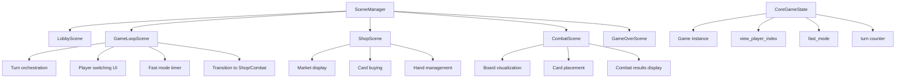
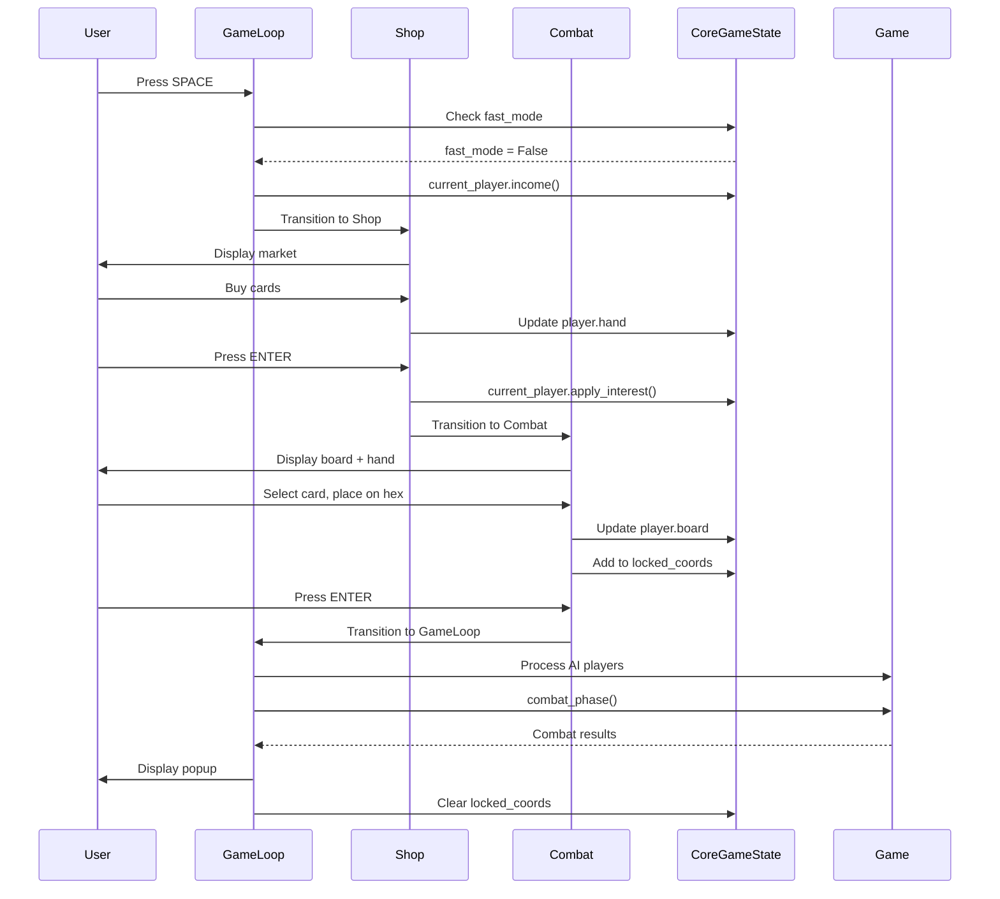
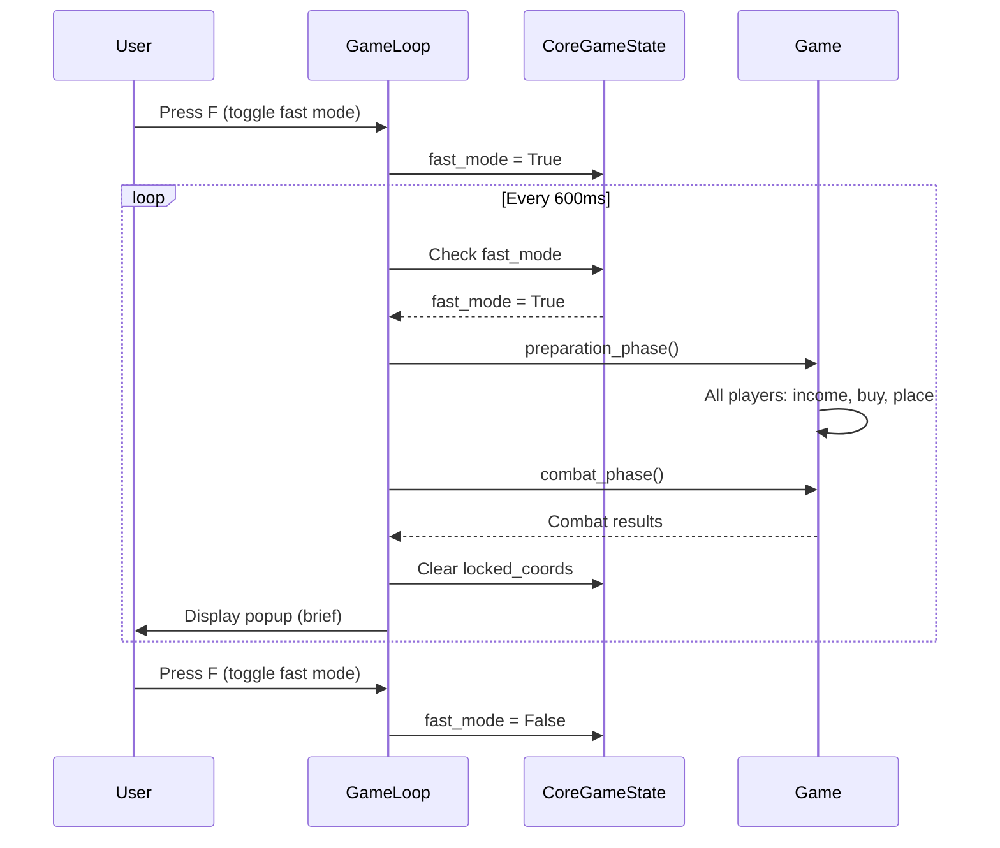
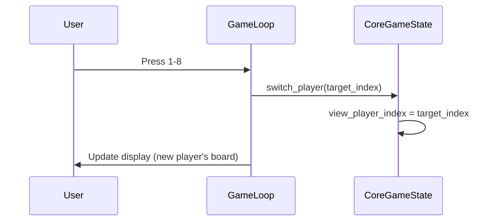

# Design Document: run-game-scene-integration

## Overview

This design document analyzes the monolithic `run_game.py` (730+ lines) and proposes a safe migration plan to integrate its responsibilities into the Scene-based architecture. The goal is to decompose the monolithic game loop into modular scenes while preserving all existing functionality and avoiding state duplication or timing conflicts.

## Architecture Analysis

### Current State: run_game.py Monolith

The `run_game.py` file currently handles ALL game responsibilities in a single while loop:

```mermaid
graph TD
    A[main loop] --> B[Event Handling]
    A --> C[Game State Management]
    A --> D[Turn Flow]
    A --> E[UI Rendering]
    
    B --> B1[Keyboard: SPACE/S/F/R/ESC/1-8]
    B --> B2[Mouse: Click/Hover/Right-click]
    
    C --> C1[view_player switching]
    C --> C2[fast_mode toggle]
    C --> C3[selected_hand_idx]
    C --> C4[pending_rotation]
    C --> C5[placed_this_turn]
    C --> C6[locked_coords_per_player]
    C --> C7[popup_timer/popup_data]
    
    D --> D1[step_turn with_shop]
    D --> D2[open_shop_for_player]
    D --> D3[game.combat_phase]
    D --> D4[AI player turns]
    
    E --> E1[_draw_cv_hud]
    E --> E2[_draw_hand_panel]
    E --> E3[_draw_synergy_hud]
    E --> E4[_draw_player_panel]
    E --> E5[_draw_combat_breakdown]
    E --> E6[_draw_turn_popup]
    E --> E7[BoardRenderer.draw]
```



### Target State: Scene-Based Architecture



## Responsibility Extraction from run_game.py

### 1. Game Initialization (build_game function)
- **Current Location**: `build_game()` function (lines 186-192)
- **Responsibilities**:
  - Create random number generator
  - Load card pool via `get_card_pool()`
  - Shuffle strategies if not provided
  - Create Player instances with strategies
  - Create Game instance with dependencies (trigger_passive_fn, combat_phase_fn)
- **Dependencies**: LobbyScreen for strategy selection

### 2. Player Creation & Strategy Selection
- **Current Location**: `main()` function (line 349)
- **Responsibilities**:
  - Launch LobbyScreen to select strategies
  - Pass selected strategies to `build_game()`
- **State**: `game.players` list

### 3. Economy System
- **Current Location**: Distributed across multiple locations
- **Responsibilities**:
  - Gold tracking: `player.gold`
  - Income calculation: `player.income()` (called in step_turn)
  - Interest application: `player.apply_interest()` (called in step_turn)
  - Gold display: `_draw_cv_hud()` (line 81)
- **State**: `player.gold`, `player.stats["gold_earned"]`, `player.stats["gold_spent"]`

### 4. Turn Flow Management
- **Current Location**: `step_turn()` function (lines 408-476)
- **Responsibilities**:
  - Check game over conditions (alive players <= 1 or turn >= 50)
  - Clear passive trigger log
  - Handle shop phase (if with_shop and not fast_mode)
  - Increment turn counter
  - Process AI player turns (income, buy, place, strengthen)
  - Trigger combat phase
  - Reset locked coordinates
  - Update popup state
- **State**: `game.turn`, `game_over`, `winner`, `popup_timer`, `popup_data`

### 5. Card Placement System
- **Current Location**: Mouse click handler (lines 598-653)
- **Responsibilities**:
  - Track selected hand card: `selected_hand_idx`
  - Track pending rotation: `pending_rotation` (0-5, representing 0-300 degrees)
  - Track cards placed this turn: `placed_this_turn` (limit: PLACE_PER_TURN)
  - Track locked coordinates: `locked_coords_per_player[pid]`
  - Handle hand card selection (toggle on/off)
  - Handle hex click for placement
  - Validate placement (empty hex, within limit)
  - Lock card after placement (immutable)
- **State**: `selected_hand_idx`, `pending_rotation`, `placed_this_turn`, `locked_coords_per_player`

### 6. Shop Integration
- **Current Location**: `open_shop_for_player()` function (lines 395-406)
- **Responsibilities**:
  - Clear card selection state
  - Deal market window
  - Launch ShopScreen (blocking while loop)
  - Handle refresh requests (deduct gold, re-deal window)
  - Return unsold cards to market
- **State**: Clears `selected_hand_idx`, `pending_rotation`

### 7. Combat Triggering
- **Current Location**: `step_turn()` function (line 467)
- **Responsibilities**:
  - Call `game.combat_phase()` after all players complete preparation
  - Store combat results in `game.last_combat_results`
- **State**: `game.last_combat_results`, `last_breakdown`

### 8. Player Switching
- **Current Location**: Keyboard handler (lines 577-587)
- **Responsibilities**:
  - Handle keys 1-8 to switch viewed player
  - Update `view_player` index
  - Clear card selection state
  - Update renderer strategy
  - Update combat breakdown for new player
- **State**: `view_player`

### 9. Fast Mode
- **Current Location**: Multiple locations
- **Responsibilities**:
  - Toggle fast mode: K_f handler (lines 571-575)
  - Fast mode timer: Update loop (lines 656-660)
  - Skip shop when fast mode active: `step_turn(with_shop=False)`
  - Display fast mode indicator: `_draw_cv_hud()`
- **State**: `fast_mode`, `fast_timer`, `FAST_DELAY` (600ms)

### 10. Game Over Detection
- **Current Location**: `step_turn()` function (lines 415-420)
- **Responsibilities**:
  - Check if alive players <= 1
  - Check if turn >= 50 (infinite loop guard)
  - Determine winner (max HP)
  - Set game_over flag
  - Update status message
- **State**: `game_over`, `winner`

### 11. UI Rendering
- **Current Location**: Render loop (lines 662-727)
- **Responsibilities**:
  - Background: `screen.fill(COLOR_BG)`, `cyber.draw_vfx_base()`
  - Board: `renderer.draw()` with locked_coords
  - Card placement preview: Hex highlight + rotation preview
  - Title: `_draw_text()`
  - Player panel: `_draw_player_panel()` (right side, all players)
  - Player info: `_draw_player_info()` (left side, current player details)
  - Hand panel: `_draw_hand_panel()` (left side, hand cards)
  - Synergy HUD: `_draw_synergy_hud()` (bottom, active synergies)
  - Passive buff log: `_draw_passive_buff_panel()` (below hand)
  - Hover popup: `cyber.draw_priority_popup()` (card details)
  - Main HUD: `_draw_cv_hud()` (top-left corner + bottom bar)
  - Combat breakdown: `_draw_combat_breakdown()` (if last_breakdown exists)
  - Turn popup: `_draw_turn_popup()` (if popup_timer > 0)
  - Game over: `_draw_game_over()` (if game_over)
- **Helper Functions**: 14 drawing functions (_draw_*)

### 12. Input Handling
- **Current Location**: Event loop (lines 488-653)
- **Responsibilities**:
  - Keyboard: SPACE (step turn), S (shop), F (fast mode), R (rotate/restart), ESC (cancel/quit), 1-8 (player switch)
  - Mouse motion: Update hover state via `renderer.update_hover()`
  - Right-click: Rotate selected card
  - Left-click: Select hand card OR place card on hex
- **State**: `selected_hand_idx`, `pending_rotation`, `status_msg`

## Architecture Mapping

### CoreGameState (SAVEABLE)
**Should Own**:
- `game: Game` - Game instance (already exists)
- `view_player_index: int` - Which player we're viewing (already exists)
- `fast_mode: bool` - Game speed setting (already exists)
- `turn: int` - Current turn number (accessible via `game.turn`)

**Should NOT Own** (UI state):
- `selected_hand_idx` - Belongs to CombatScene UIState
- `pending_rotation` - Belongs to CombatScene UIState
- `placed_this_turn` - Belongs to CombatScene UIState
- `locked_coords_per_player` - Belongs to CombatScene UIState
- `popup_timer` - Belongs to GameLoopScene UIState
- `popup_data` - Belongs to GameLoopScene UIState

### SceneManager
**Should Own**:
- Scene transition logic (already exists)
- Scene lifecycle management (already exists)
- Scene factory registry (already exists)

**Transitions**:
- Lobby → GameLoop (after strategy selection)
- GameLoop → Shop (on SPACE or S key)
- Shop → Combat (on ENTER or done button)
- Combat → GameLoop (after placement complete)
- GameLoop → GameOver (when game_over condition met)
- GameOver → Lobby (on restart)

### ShopScene (Already Exists)
**Should Own**:
- Market card display (already exists)
- Card buying logic (already exists)
- Hand buffer display (already exists)
- Refresh button (already exists)

**Missing**:
- Integration with GameLoopScene turn flow
- Proper transition back to Combat/GameLoop

### CombatScene (Already Exists)
**Should Own**:
- 37-hex board visualization (already exists)
- Card placement mechanics (already exists)
- Hover/selection state (already exists in UIState)
- Rotation preview (already exists)

**Missing**:
- Hand panel display (currently in run_game.py)
- Card selection from hand (currently in run_game.py)
- Locked coordinates tracking (currently in run_game.py)
- Placement limit enforcement (currently in run_game.py)

### NEW COMPONENT: GameLoopScene
**Should Own**:
- Turn orchestration (call step_turn logic)
- Player switching UI (1-8 keys)
- Fast mode timer and toggle
- Combat results popup display
- Game over detection
- Transition to Shop/Combat/GameOver

**Responsibilities**:
1. Display current game state (turn, players, HP)
2. Handle player switching (1-8 keys)
3. Handle fast mode toggle (F key)
4. Handle turn advancement (SPACE key)
5. Orchestrate turn flow:
   - If fast_mode: Skip shop, auto-advance
   - If not fast_mode: Transition to Shop
6. Display combat results popup after combat
7. Detect game over and transition to GameOverScene

### NEW COMPONENT: GameOverScene
**Should Own**:
- Winner display
- Final stats display
- Restart button (transition to Lobby)
- Quit button

## Missing Components Analysis

### 1. GameLoopScene (CRITICAL)
**Purpose**: Central hub for turn orchestration and game flow control

**Why Missing**: Current architecture has Lobby → Shop → Combat, but no scene to orchestrate the turn loop and handle transitions between turns.

**What It Needs**:
- Turn counter display
- Player list with HP/status
- Fast mode toggle and timer
- Turn advancement button (SPACE)
- Player switching (1-8 keys)
- Combat results popup
- Game over detection

### 2. Hand Panel in CombatScene (HIGH PRIORITY)
**Purpose**: Display player's hand cards for selection and placement

**Why Missing**: CombatScene currently only shows the board, not the hand. Hand display is in run_game.py.

**What It Needs**:
- Hand card list display (left panel)
- Card selection on click
- Selected card highlight
- Rotation indicator
- Integration with placement system

### 3. Player Switching UI (MEDIUM PRIORITY)
**Purpose**: Allow viewing different players' boards

**Why Missing**: No UI for player switching in any scene. Currently only keyboard shortcuts (1-8).

**What It Needs**:
- Player list panel (right side)
- Click to switch player
- Current player highlight
- HP/gold/strategy display per player

### 4. Fast Mode Integration (MEDIUM PRIORITY)
**Purpose**: Auto-advance turns without shop interaction

**Why Missing**: Fast mode logic is in run_game.py main loop, not in any scene.

**What It Needs**:
- Fast mode toggle button/indicator
- Timer to auto-advance turns
- Skip shop scene when active
- Visual indicator (lightning bolt icon)

### 5. Combat Results Popup (MEDIUM PRIORITY)
**Purpose**: Show combat results after each turn

**Why Missing**: Popup display is in run_game.py render loop, not in any scene.

**What It Needs**:
- Popup overlay with combat results
- Fade-in/fade-out animation
- Auto-dismiss after 3 seconds
- Show: winner, damage, kills, combos, synergies

### 6. Game Over Scene (LOW PRIORITY)
**Purpose**: Display winner and final stats

**Why Missing**: Game over display is in run_game.py render loop, not a separate scene.

**What It Needs**:
- Winner announcement
- Final stats (HP, kills, gold, etc.)
- Restart button
- Quit button

### 7. Placement Limit Enforcement (HIGH PRIORITY)
**Purpose**: Enforce PLACE_PER_TURN limit (1 card per turn)

**Why Missing**: Placement limit tracking is in run_game.py, not in CombatScene.

**What It Needs**:
- `placed_this_turn` counter in UIState
- Reset counter on turn start
- Validate placement against limit
- Display remaining placements

### 8. Locked Coordinates Tracking (HIGH PRIORITY)
**Purpose**: Prevent moving/removing placed cards

**Why Missing**: Locked coordinates are tracked in run_game.py, not in CombatScene.

**What It Needs**:
- `locked_coords` set in UIState
- Add coord to set on placement
- Clear set on turn end
- Visual indicator (locked icon/color)

## Migration Plan (3 Phases)

### Phase 1: Game Bootstrap (Minimum Playable)
**Goal**: Create GameLoopScene and establish basic turn flow

**Tasks**:
1. **[G2] Add locked_coords_per_player to CoreGameState**
   - Add `locked_coords_per_player: Dict[int, Set[Tuple[int, int]]]` field to CoreGameState.__init__()
   - Add `clear_locked_coords(player_id: int)` method as specified in Data Models section
   - Initialize with `{p.pid: set() for p in game.players}` when CoreGameState is created
   - **Dependency**: Must complete before any scene uses locked coordinates
   - **Test**: Verify field exists and clear_locked_coords() works for all player IDs

2. **[G4] Extract drawing functions to ui/hud_renderer.py**
   - Create new file `ui/hud_renderer.py`
   - Extract these functions from run_game.py:
     - `_draw_cv_hud()` → `draw_cyber_victorian_hud()`
     - `_draw_player_panel()` → `draw_player_panel()`
     - `_draw_player_info()` → `draw_player_info()`
     - `_draw_combat_breakdown()` → `draw_combat_breakdown()`
     - `_draw_turn_popup()` → `draw_turn_popup()`
     - `_draw_game_over()` → `draw_game_over()`
     - `_draw_passive_buff_panel()` → `draw_passive_buff_panel()`
     - `_draw_synergy_hud()` → `draw_synergy_hud()`
     - `_active_synergy_counts()` → helper function
     - `hp_color()` → helper function
   - Keep function signatures compatible with existing calls
   - Add HUDRenderer class to encapsulate state (fonts, colors)
   - **Dependency**: Must complete before GameLoopScene or CombatScene can render HUD
   - **Test**: Import and call each function, verify visual output matches run_game.py

3. **[G5] Resolve render system conflict (BoardRenderer vs HexSystem)**
   - **Architectural Decision**: CombatScene will use its existing HexSystem for board rendering
   - **Rationale**: HexSystem provides better layout control and is already integrated with AssetLoader
   - BoardRendererV3 from run_game.py will be deprecated for board display
   - CyberRenderer effects (draw_vfx_base, draw_priority_popup) will be preserved and integrated
   - **Task**: Create adapter layer in CombatScene to use CyberRenderer for effects while keeping HexSystem for board
   - **Dependency**: Must decide before implementing hand panel in CombatScene
   - **Test**: Verify visual consistency between old and new render paths

4. **[G3] Define Lobby → GameLoop strategy handoff protocol**
   - **Protocol Decision**: Use scene transition kwargs for strategy passing
   - LobbyScene.on_exit() stores selected strategies in transition kwargs: `{"strategies": selected_strategies}`
   - SceneManager passes kwargs to GameLoopScene factory
   - GameLoopScene factory calls `build_game(strategies)` and creates CoreGameState
   - **Alternative Rejected**: Storing strategies in CoreGameState before game creation (circular dependency)
   - **Task**: Implement strategy passing in LobbyScene and GameLoopScene factory
   - **Dependency**: Must complete before LobbyScene can transition to GameLoopScene
   - **Test**: Verify strategies flow from Lobby → build_game() → GameLoopScene

5. Create GameLoopScene class extending Scene
   - Implement `__init__(core_game_state, **kwargs)` constructor
   - Create GameLoopUIState dataclass with fields: fast_timer, popup_timer, popup_data, last_breakdown, game_over, winner, status_msg
   - Implement on_enter() and on_exit() lifecycle methods
   - **Dependency**: Requires tasks 1-4 to be complete
   - **Test**: Verify scene can be instantiated and entered

6. **[G9] Implement game_over detection and winner tracking**
   - Add game_over detection logic to GameLoopScene.update():
     - Check if `len(core_game_state.alive_players) <= 1`
     - Check if `core_game_state.turn >= 50` (infinite loop guard)
   - Store winner in `ui_state.winner = max(players, key=lambda p: p.hp)`
   - Set `ui_state.game_over = True` when condition met
   - Transition to "game_over" scene when game_over is True
   - **Dependency**: Requires task 5 (GameLoopScene exists)
   - **Test**: Simulate game over conditions, verify transition to GameOverScene

7. Move turn orchestration logic from step_turn() to GameLoopScene
   - Extract turn advancement logic from run_game.py step_turn() function
   - Implement in GameLoopScene.advance_turn() method
   - Handle: clear passive log, increment turn, reset placement counters
   - **Dependency**: Requires task 5 (GameLoopScene exists)
   - **Test**: Verify turn counter increments correctly

8. Implement basic UI: turn counter, player list, turn button
   - Use HUDRenderer functions from task 2
   - Display turn counter at top
   - Display player list with HP/status (reuse draw_player_panel)
   - Add "ADVANCE TURN" button or SPACE key prompt
   - **Dependency**: Requires tasks 2 (HUDRenderer) and 5 (GameLoopScene)
   - **Test**: Verify UI elements render correctly

9. **[G1] Register GameLoopScene and GameOverScene factories in main.py**
   - Add factory registration: `scene_manager.register_scene_factory("game_loop", create_game_loop_scene)`
   - Add factory registration: `scene_manager.register_scene_factory("game_over", create_game_over_scene)`
   - Implement `create_game_loop_scene(core_game_state, **kwargs)` factory function
   - Implement `create_game_over_scene(core_game_state, **kwargs)` factory function
   - **Dependency**: Requires task 5 (GameLoopScene class exists)
   - **Test**: Verify factories are registered and can create scenes

10. **[G8] Wire scene transition chain: Lobby → GameLoop → Shop → Combat → GameLoop**
    - Update LobbyScene to transition to "game_loop" (not "shop")
    - GameLoopScene transitions to "shop" on SPACE key (if not fast_mode)
    - ShopScene transitions to "combat" on done
    - CombatScene transitions to "game_loop" on placement complete
    - GameLoopScene transitions to "game_over" when game over detected
    - **Dependency**: Requires task 9 (factories registered)
    - **Test**: Verify full cycle works: Lobby → GameLoop → Shop → Combat → GameLoop

11. Test: Can complete one full turn cycle (Lobby → GameLoop → Shop → Combat → GameLoop)
    - Manual test: Start game, select strategies, advance turn, buy cards, place cards, return to GameLoop
    - Automated test: Simulate full cycle, assert all scenes visited in correct order
    - **Dependency**: Requires task 10 (transition chain wired)

**State Migration**:
- Move `game_over`, `winner` to GameLoopScene UIState (task 6)
- Add `locked_coords_per_player` to CoreGameState (task 1)
- Keep `game.turn` in CoreGameState (already there)
- Keep `view_player_index` in CoreGameState (already there)

**Risks**:
- Scene transition timing: When to show shop vs combat?
- State synchronization: Ensure CoreGameState is updated before transitions
- Render system conflict: HexSystem vs BoardRendererV3 (mitigated by task 3)

### Phase 2: Turn System Integration
**Goal**: Integrate fast mode, player switching, and combat results

**Tasks**:
1. **[G7] Extend InputState with named intent mappings**
   - Add intent constants to InputState:
     - `INTENT_TOGGLE_FAST_MODE` for K_F
     - `INTENT_OPEN_SHOP` for K_S
     - `INTENT_SWITCH_PLAYER_1` through `INTENT_SWITCH_PLAYER_8` for K_1 to K_8
   - Add methods: `is_fast_mode_toggled()`, `is_shop_requested()`, `get_player_switch_request() -> Optional[int]`
   - Update InputState.update() to populate these intents from raw key presses
   - **Dependency**: Must complete before scenes use these inputs
   - **Test**: Verify each intent is correctly detected from key presses

2. Add fast mode toggle and timer to GameLoopScene
   - Handle INTENT_TOGGLE_FAST_MODE in handle_input()
   - Toggle `core_game_state.fast_mode` on/off
   - Add `ui_state.fast_timer` counter (increments by dt)
   - When fast_timer >= FAST_DELAY (600ms) and fast_mode is True:
     - Call advance_turn() automatically
     - Skip shop scene (transition directly to combat or run AI turns)
     - Reset fast_timer to 0
   - Display fast mode indicator using HUDRenderer
   - **Dependency**: Requires task 1 (InputState intents)
   - **Test**: Verify fast mode auto-advances turns every 600ms, shop is skipped

3. Add player switching UI (1-8 keys + click)
   - Handle INTENT_SWITCH_PLAYER_1 through INTENT_SWITCH_PLAYER_8 in handle_input()
   - Call `core_game_state.switch_player(target_index)` when key pressed
   - Add clickable player list panel (reuse draw_player_panel from HUDRenderer)
   - Highlight currently viewed player
   - Clear any card selection state when switching players
   - **Dependency**: Requires task 1 (InputState intents)
   - **Test**: Verify switching between all 8 players works, UI updates correctly

4. Add combat results popup to GameLoopScene
   - Store combat results in `ui_state.popup_data` after combat_phase()
   - Set `ui_state.popup_timer = POPUP_DURATION` (3000ms)
   - Decrement popup_timer by dt in update()
   - Render popup using `draw_turn_popup()` from HUDRenderer when popup_timer > 0
   - Calculate fade alpha: `min(255, int(popup_timer / POPUP_DURATION * 510))`
   - Extract `ui_state.last_breakdown` for current player from popup_data
   - Render breakdown using `draw_combat_breakdown()` from HUDRenderer
   - **Dependency**: Requires Phase 1 task 2 (HUDRenderer exists)
   - **Test**: Verify popup appears after combat, fades out after 3 seconds

5. **[G6] Move AI player turn logic to GameLoopScene**
   - Extract AI turn loop from run_game.py step_turn() (lines 447-467):
     - For each AI player (not current viewed player):
       - Deal market window
       - Call player.income()
       - Call AI.buy_cards()
       - Return unsold cards to market
       - Call player.apply_interest()
       - Call player.check_evolution()
       - Call AI.place_cards()
       - Call player.check_copy_strengthening()
   - Implement as GameLoopScene.process_ai_turns() method
   - Call after human player completes shop/combat phases
   - **Dependency**: Requires Phase 1 task 7 (turn orchestration exists)
   - **Test**: Verify AI players buy cards, place cards, and strengthen correctly

6. Implement conditional shop skip for fast mode
   - In GameLoopScene.advance_turn():
     - If `core_game_state.fast_mode == True`:
       - Skip shop scene transition
       - Call `game.preparation_phase()` directly (handles all players' shop phase via AI)
       - Transition directly to combat or run combat immediately
     - If `core_game_state.fast_mode == False`:
       - Transition to "shop" scene for human player
   - **Dependency**: Requires task 2 (fast mode toggle) and task 5 (AI logic)
   - **Test**: Verify shop is skipped in fast mode, shown in normal mode

7. Test: Fast mode auto-advances turns, player switching works
   - Manual test: Toggle fast mode, verify turns advance automatically every 600ms
   - Manual test: Press 1-8 keys, verify player view switches
   - Automated test: Simulate fast mode for 10 turns, assert turn counter increments
   - Automated test: Simulate player switching, assert view_player_index changes
   - **Dependency**: Requires tasks 2, 3, 6

**State Migration**:
- Move `fast_mode` to CoreGameState (already there)
- Move `fast_timer` to GameLoopScene UIState (task 2)
- Move `popup_timer`, `popup_data`, `last_breakdown` to GameLoopScene UIState (task 4)

**Risks**:
- Fast mode bypassing shop: Ensure shop scene is skipped correctly (mitigated by task 6)
- Player switching during shop: Handle gracefully (cancel shop?) - **DECISION NEEDED**: Should player switching be disabled during shop, or should it cancel shop and return to GameLoop?

### Phase 3: Combat Loop Integration
**Goal**: Integrate card placement, hand panel, and locked coordinates

**Tasks**:
1. **[G10] Assign PassiveBuffPanel and SynergyHUD ownership**
   - **Architectural Decision**: Both panels belong to CombatScene
   - **Rationale**: Both display information about cards on the board, which is CombatScene's domain
   - PassiveBuffPanel shows passive buffs from placed cards
   - SynergyHUD shows active synergies from board composition
   - **Task**: Add both panels to CombatScene.draw() using HUDRenderer functions
   - **Dependency**: Requires Phase 1 task 2 (HUDRenderer exists)
   - **Test**: Verify panels render correctly in CombatScene

2. Add hand panel to CombatScene
   - Extract hand panel rendering from run_game.py `_draw_hand_panel()` (lines 249-314)
   - Integrate with CombatScene.draw() using HUDRenderer
   - Position on left side of screen (HAND_PANEL_X=20, HAND_PANEL_Y=430)
   - Display: hand cards, rarity, group color, power, rotation, passive indicator
   - Calculate hand card rects using `_hand_card_rects()` helper
   - **Dependency**: Requires Phase 1 task 2 (HUDRenderer exists) and task 1 (panel ownership decision)
   - **Test**: Verify hand panel renders, shows all cards, updates when hand changes

3. Move card selection logic to CombatScene
   - Add `selected_hand_idx: Optional[int]` to CombatScene UIState
   - Add `pending_rotation: int` to CombatScene UIState (0-5 range)
   - Handle left-click on hand card in handle_input():
     - If same card clicked: deselect (set to None)
     - If different card clicked: select (set index, copy card.rotation to pending_rotation)
   - Handle R key or right-click: increment pending_rotation (mod 6)
   - Display selected card with highlight border (C_SELECT color)
   - Show rotation indicator and placement hint
   - **Dependency**: Requires task 2 (hand panel exists)
   - **Test**: Verify card selection, deselection, rotation works

4. Move placement limit enforcement to CombatScene
   - Add `placed_this_turn: int` to CombatScene UIState
   - Initialize to 0 in on_enter()
   - Increment when card is placed on board
   - Validate placement: if `placed_this_turn >= PLACE_PER_TURN`, reject placement
   - Display remaining placements in status message
   - Reset counter when transitioning back to GameLoopScene (on_exit)
   - **Dependency**: Requires task 3 (card selection exists)
   - **Test**: Verify placement limit enforced, counter resets on turn start

5. Move locked coordinates tracking to CombatScene
   - Read `locked_coords` from `core_game_state.locked_coords_per_player[current_player.pid]`
   - When card is placed: add coord to locked set via `core_game_state.locked_coords_per_player[pid].add(coord)`
   - Prevent placement on locked coords: check if coord in locked set before allowing placement
   - Prevent removal of locked cards: disable click-to-remove on locked coords
   - Display locked indicator: render locked border color (C_LOCKED) on locked hexes
   - **Dependency**: Requires Phase 1 task 1 (locked_coords_per_player in CoreGameState) and task 4 (placement logic)
   - **Test**: Verify locked coords persist across scene transitions, cannot be moved

6. Integrate placement preview with existing HexSystem
   - CombatScene already has placement preview via HexCardRenderer
   - Extend to show rotation preview for selected hand card
   - When hovering over valid hex with selected card:
     - Highlight hex with C_SELECT color
     - Render card preview with pending_rotation applied
     - Show edge stats rotated to match pending_rotation
   - Reuse existing `_render_placement_preview()` method
   - **Dependency**: Requires task 3 (card selection exists)
   - **Test**: Verify preview shows correct rotation, updates on hover

7. **[G11] Remove run_game.py import from main.py**
   - Remove `from run_game import build_game` import
   - Move `build_game()` function to `engine_core/game_factory.py` or `core/game_builder.py`
   - Update all references to use new import path
   - **Dependency**: Must complete before backward compatibility flag can work
   - **Test**: Verify main.py runs without importing run_game.py

8. **[G12] Implement restart flow in GameOverScene**
   - Create GameOverScene class extending Scene
   - Display winner using `draw_game_over()` from HUDRenderer
   - Show final stats: HP, wins, losses, total points, win streak
   - Add "RESTART" button (R key or click)
   - Add "QUIT" button (ESC key or click)
   - On restart:
     - Transition to "lobby" scene
     - LobbyScene will handle strategy selection
     - New game will be built via Lobby → GameLoop handoff protocol (Phase 1 task 4)
   - On quit: call `pygame.quit()` and `sys.exit()`
   - **Dependency**: Requires Phase 1 task 9 (GameOverScene factory registered)
   - **Test**: Verify restart returns to lobby, quit exits cleanly

9. Test: Can select card from hand, rotate, place on board
   - Manual test: Click hand card, press R to rotate, click hex to place
   - Manual test: Verify locked card cannot be moved
   - Manual test: Verify placement limit enforced
   - Automated test: Simulate card selection, rotation, placement
   - Automated test: Verify locked coords persist after scene transition
   - **Dependency**: Requires tasks 2-6

**State Migration**:
- Move `selected_hand_idx` to CombatScene UIState (task 3)
- Move `pending_rotation` to CombatScene UIState (task 3)
- Move `placed_this_turn` to CombatScene UIState (task 4)
- `locked_coords_per_player` stays in CoreGameState (Phase 1 task 1) - accessed by CombatScene (task 5)

**Risks**:
- Locked coordinates across scenes: Need to persist between Combat and GameLoop (mitigated by storing in CoreGameState, task 5)
- Placement limit reset: Ensure counter resets on turn start (mitigated by on_exit reset, task 4)
- Hand panel layout: Avoid overlap with board (mitigated by fixed positioning, task 2)

## Gap Analysis Summary

The following critical gaps were identified and addressed in the migration plan:

### Critical Gaps (Addressed)
- **[G1]** main.py missing "game_loop" and "game_over" factory registrations → Added in Phase 1 task 9
- **[G2]** CoreGameState missing locked_coords_per_player → Added in Phase 1 task 1
- **[G3]** Lobby → GameLoop strategy handoff protocol undefined → Defined in Phase 1 task 4

### High Priority Gaps (Addressed)
- **[G4]** ui/hud_renderer.py extraction mentioned but not tasked → Added in Phase 1 task 2
- **[G5]** CombatScene render system conflict (HexSystem vs BoardRendererV3) → Resolved in Phase 1 task 3
- **[G6]** AI turn logic migration under-specified → Detailed in Phase 2 task 5

### Medium Priority Gaps (Addressed)
- **[G7]** InputState missing intent mappings for F/S/1-8 keys → Added in Phase 2 task 1
- **[G8]** Scene transition chain wired in spec but not in factories → Added in Phase 1 task 10
- **[G9]** game_over/winner state placement described but not tasked → Added in Phase 1 task 6
- **[G10]** PassiveBuffPanel and SynergyHUD have no scene assignment → Assigned to CombatScene in Phase 3 task 1

### Minor Gaps (Addressed)
- **[G11]** Backward compatibility flag blocked by run_game.py import → Added in Phase 3 task 7
- **[G12]** Restart flow (R key → new game) has no scene owner → Added in Phase 3 task 8

## Risk Analysis

### 1. State Duplication
**Risk**: CoreGameState and UIState may duplicate state (e.g., turn counter, player index)

**Mitigation**:
- Use CoreGameState as single source of truth for SAVEABLE state
- Use UIState only for THROWAWAY state (animations, selections, hovers)
- Document clearly which state belongs where
- Add assertions to detect duplication

**Example**:
```python
# CORRECT: CoreGameState owns turn
turn = self.core_game_state.game.turn

# WRONG: UIState duplicates turn
self.ui_state.turn = turn  # DON'T DO THIS
```

### 2. Scene vs Logic Conflicts
**Risk**: Game logic (e.g., combat_phase) may conflict with scene transitions

**Mitigation**:
- Separate game logic (Game.combat_phase) from scene logic (CombatScene.draw)
- Use SceneManager.request_transition() to defer transitions until safe
- Ensure transitions happen BEFORE scene.update() (already implemented)
- Add transition guards to prevent invalid transitions

**Example**:
```python
# CORRECT: Request transition, execute later
self.scene_manager.request_transition("combat")

# WRONG: Immediate transition during update
self.scene_manager._execute_transition()  # DON'T DO THIS
```

### 3. Timing Issues
**Risk**: Scene transitions may happen at wrong time (e.g., during combat resolution)

**Mitigation**:
- Use explicit transition points (e.g., after combat_phase completes)
- Add transition flags to prevent premature transitions
- Test transition timing thoroughly
- Add logging to track transition sequence

**Example**:
```python
# CORRECT: Transition after combat completes
game.combat_phase()
self.scene_manager.request_transition("game_loop")

# WRONG: Transition during combat
self.scene_manager.request_transition("game_loop")
game.combat_phase()  # Combat happens in wrong scene!
```

### 4. Locked Coordinates Across Scenes
**Risk**: Locked coordinates need to persist from Combat to GameLoop and back

**Mitigation**:
- Store locked_coords in CoreGameState (not UIState) - **Implemented in Phase 1 task 1**
- Clear locked_coords at turn start (in GameLoopScene) - **Implemented in Phase 1 task 7**
- CombatScene reads/writes locked_coords from CoreGameState - **Implemented in Phase 3 task 5**
- Add validation to ensure locked_coords are respected - **Tested in Phase 3 task 9**

**Example**:
```python
# CORRECT: Store in CoreGameState (Phase 1 task 1)
class CoreGameState:
    def __init__(self, game):
        self.game = game
        self.locked_coords_per_player = {p.pid: set() for p in game.players}

# WRONG: Store in UIState (lost on scene transition)
class UIState:
    def __init__(self):
        self.locked_coords = set()  # DON'T DO THIS
```

**Implementation Status**: Fully addressed in migration plan.

### 5. Fast Mode Bypassing Shop
**Risk**: Fast mode should skip shop, but scene architecture expects Shop → Combat flow

**Mitigation**:
- Add conditional transition in GameLoopScene:
  - If fast_mode: GameLoop → Combat (skip shop)
  - If not fast_mode: GameLoop → Shop → Combat
- Ensure AI players still get shop phase (call AI.buy_cards directly)
- Test fast mode thoroughly

**Example**:
```python
# CORRECT: Conditional transition
if self.core_game_state.fast_mode:
    self.scene_manager.request_transition("combat")
else:
    self.scene_manager.request_transition("shop")

# WRONG: Always go to shop
self.scene_manager.request_transition("shop")  # Breaks fast mode!
```

### 6. Input Handling Conflicts
**Risk**: Multiple scenes may handle same input (e.g., ESC key)

**Mitigation**:
- Use InputState for intent-based input (already implemented)
- Define clear input priority (scene-specific > global)
- Document input handling per scene
- Add input mode state machine (already in CombatScene)

**Example**:
```python
# CORRECT: Scene-specific input handling
def handle_input(self, input_state: InputState):
    if input_state.was_key_pressed_this_frame(pygame.K_ESCAPE):
        if self.ui_state.selected_card:
            self.ui_state.selected_card = None  # Cancel selection
        else:
            self.scene_manager.request_transition("game_loop")  # Exit scene

# WRONG: Global input handling (conflicts with other scenes)
if input_state.was_key_pressed_this_frame(pygame.K_ESCAPE):
    sys.exit()  # DON'T DO THIS
```

## Correctness Properties

### Property 1: State Consistency
**Universal Quantification**: For all scenes S and all state variables V in CoreGameState, V must have the same value across all scenes at any given time.

**Formal Statement**:
```
∀ scene ∈ Scenes, ∀ var ∈ CoreGameState:
  scene.core_game_state.var = CoreGameState.var
```

**Test Strategy**: Assert CoreGameState identity (same object reference) across scenes.

### Property 2: Turn Monotonicity
**Universal Quantification**: For all turn transitions T, the turn counter must increase by exactly 1.

**Formal Statement**:
```
∀ transition ∈ TurnTransitions:
  turn_after = turn_before + 1
```

**Test Strategy**: Track turn counter before/after step_turn(), assert increment.

### Property 3: Placement Limit
**Universal Quantification**: For all players P and all turns T, the number of cards placed must not exceed PLACE_PER_TURN.

**Formal Statement**:
```
∀ player ∈ Players, ∀ turn ∈ Turns:
  placed_this_turn[player] ≤ PLACE_PER_TURN
```

**Test Strategy**: Track placements per turn, assert limit not exceeded.

### Property 4: Locked Coordinate Immutability
**Universal Quantification**: For all locked coordinates C, once locked, the card at C cannot be moved or removed until turn end.

**Formal Statement**:
```
∀ coord ∈ LockedCoords, ∀ time ∈ [lock_time, turn_end]:
  board.grid[coord] = card_at_lock_time
```

**Test Strategy**: Attempt to move locked card, assert operation fails.

### Property 5: Scene Transition Validity
**Universal Quantification**: For all scene transitions (S1 → S2), the transition must be valid according to the transition graph.

**Formal Statement**:
```
∀ transition ∈ SceneTransitions:
  (source, target) ∈ ValidTransitions
```

**Test Strategy**: Track all transitions, assert against valid transition set.

### Property 6: Fast Mode Shop Skip
**Universal Quantification**: For all turns T when fast_mode is True, the shop scene must be skipped.

**Formal Statement**:
```
∀ turn ∈ Turns:
  fast_mode = True ⟹ ShopScene not visited
```

**Test Strategy**: Enable fast mode, track scene sequence, assert shop not visited.

### Property 7: Game Over Detection
**Universal Quantification**: For all game states G, if alive_players ≤ 1 OR turn ≥ 50, then game_over must be True.

**Formal Statement**:
```
∀ game_state ∈ GameStates:
  (alive_players ≤ 1 ∨ turn ≥ 50) ⟹ game_over = True
```

**Test Strategy**: Simulate game over conditions, assert game_over flag set.

## Data Models

### CoreGameState (SAVEABLE)
```python
class CoreGameState:
    game: Game                    # Game instance (players, market, turn)
    view_player_index: int        # Which player we're viewing (0-7)
    fast_mode: bool               # Game speed setting
    locked_coords_per_player: Dict[int, Set[Tuple[int, int]]]  # Locked hexes per player
    
    @property
    def current_player(self) -> Player:
        return self.game.players[self.view_player_index]
    
    @property
    def turn(self) -> int:
        return self.game.turn
    
    @property
    def alive_players(self) -> List[Player]:
        return self.game.alive_players()
    
    def switch_player(self, direction: int = 1) -> None:
        num_players = len(self.game.players)
        self.view_player_index = (self.view_player_index + direction) % num_players
    
    def clear_locked_coords(self, player_id: int) -> None:
        """Clear locked coordinates for a player (called at turn start)."""
        self.locked_coords_per_player[player_id] = set()
```

### GameLoopScene.UIState (THROWAWAY)
```python
class GameLoopUIState(UIState):
    fast_timer: int = 0           # Fast mode timer (ms)
    popup_timer: int = 0          # Combat results popup timer (ms)
    popup_data: List[dict] = []   # Combat results for all matches
    last_breakdown: dict = None   # Combat breakdown for current player
    game_over: bool = False       # Game over flag
    winner: Player = None         # Winner (if game over)
    status_msg: str = ""          # Status message to display
```

### CombatScene.UIState (THROWAWAY)
```python
class CombatUIState(UIState):
    selected_hand_idx: int = None     # Selected hand card index
    pending_rotation: int = 0         # Pending rotation (0-5)
    placed_this_turn: int = 0         # Cards placed this turn
    hovered_hex: Tuple[int, int] = None  # Hovered hex coordinate
    hovered_card: Card = None         # Hovered card (for tooltip)
```

### ShopScene.UIState (Already Exists)
```python
class ShopUIState(UIState):
    time: float = 0.0                 # Animation timer
    fade_alpha: int = 0               # Fade-in alpha
    hover_refresh: bool = False       # Refresh button hover
    hover_done: bool = False          # Done button hover
    hovered_market_card: Card = None  # Hovered market card
    hovered_card_idx: int = None      # Hovered card index
    particles: List[dict] = []        # Particle effects
    shop_cards: List[ShopCard] = []   # Shop card wrappers
    card_flip_states: List[float] = []  # Flip animation states
```

## Sequence Diagrams

### Turn Flow (Normal Mode)


### Turn Flow (Fast Mode)


### Player Switching


## Testing Strategy

### Unit Testing
- Test CoreGameState.switch_player() with all player indices
- Test CoreGameState.clear_locked_coords() clears correct player's coords
- Test GameLoopScene.step_turn() increments turn counter
- Test CombatScene placement limit enforcement
- Test locked coordinate immutability

### Integration Testing
- Test full turn cycle: GameLoop → Shop → Combat → GameLoop
- Test fast mode: GameLoop → Combat → GameLoop (skip shop)
- Test player switching during different scenes
- Test game over detection and transition to GameOverScene
- Test locked coordinates persist across scenes

### Property-Based Testing
- Generate random turn sequences, assert turn monotonicity
- Generate random placement sequences, assert placement limit
- Generate random player switches, assert view_player_index valid
- Generate random fast mode toggles, assert shop skip behavior

## Performance Considerations

### Rendering Optimization
- Reuse drawing functions from run_game.py (_draw_* functions)
- Avoid re-creating surfaces every frame
- Use dirty rectangle optimization for partial updates
- Cache font renders for static text

### State Management
- Minimize state copying between scenes
- Use references to CoreGameState (not copies)
- Clear UIState on scene exit to free memory
- Avoid deep copying of game state

### Scene Transitions
- Defer transitions until safe points (before update)
- Batch state updates before transition
- Minimize work in on_enter/on_exit
- Preload assets before transition

## Security Considerations

N/A - Single-player game, no network or persistence yet.

## Dependencies

### Existing Dependencies
- pygame: Window management, rendering, input
- engine_core: Game, Player, Card, Board, Market
- ui: BoardRenderer, CyberRenderer, ShopScreen, LobbyScreen
- core: Scene, SceneManager, CoreGameState, UIState, InputState

### New Dependencies
- None (all functionality exists in run_game.py, just needs refactoring)

## Implementation Notes

### Phase 1 Priority
1. Create GameLoopScene skeleton
2. Move turn orchestration logic
3. Implement basic UI (turn counter, player list)
4. Test one full turn cycle

### Phase 2 Priority
1. Add fast mode toggle and timer
2. Add player switching UI
3. Add combat results popup
4. Test fast mode and player switching

### Phase 3 Priority
1. Add hand panel to CombatScene
2. Move card selection logic
3. Move placement limit enforcement
4. Test card placement flow

### Code Reuse Strategy
- Extract drawing functions from run_game.py into ui/hud_renderer.py (Phase 1 task 2)
- Reuse BoardRenderer for board display (deprecated in favor of HexSystem per Phase 1 task 3)
- Reuse CyberRenderer for effects and popups (integrated with HexSystem)
- Reuse ShopScreen logic (already scene-based)

### Backward Compatibility
- Keep run_game.py functional during migration
- Add feature flag to switch between old/new architecture
  - **Prerequisite**: Complete Phase 3 task 7 (remove run_game.py import from main.py)
  - Add `USE_SCENE_ARCHITECTURE = True` flag in main.py
  - If True: use SceneManager with GameLoopScene
  - If False: call run_game.main() directly
- Test both paths in parallel
- Deprecate run_game.py only after full migration

## Conclusion

This design provides a comprehensive plan to migrate run_game.py into the Scene-based architecture. The migration is divided into 3 phases to minimize risk and ensure each phase is testable. The key challenges are state management (SAVEABLE vs THROWAWAY), scene transition timing, and locked coordinate persistence. By following this plan, we can safely decompose the monolithic game loop while preserving all existing functionality.

### Gap Analysis Integration

All 12 identified gaps have been addressed in the migration plan:
- **3 Critical gaps** resolved in Phase 1 (CoreGameState fields, factory registrations, strategy handoff)
- **3 High priority gaps** resolved across Phase 1-2 (HUDRenderer extraction, render system conflict, AI logic)
- **4 Medium priority gaps** resolved across Phase 1-3 (InputState intents, transition wiring, game over state, panel ownership)
- **2 Minor gaps** resolved in Phase 3 (backward compatibility prerequisite, restart flow)

The revised migration plan now contains **31 concrete tasks** (up from 15) with clear dependencies, test criteria, and architectural decisions. Each gap is traceable to specific tasks that resolve it.

## Conclusion

This design provides a comprehensive plan to migrate run_game.py into the Scene-based architecture. The migration is divided into 3 phases to minimize risk and ensure each phase is testable. The key challenges are state management (SAVEABLE vs THROWAWAY), scene transition timing, and locked coordinate persistence. By following this plan, we can safely decompose the monolithic game loop while preserving all existing functionality.
