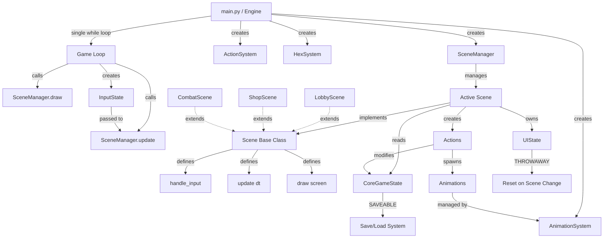
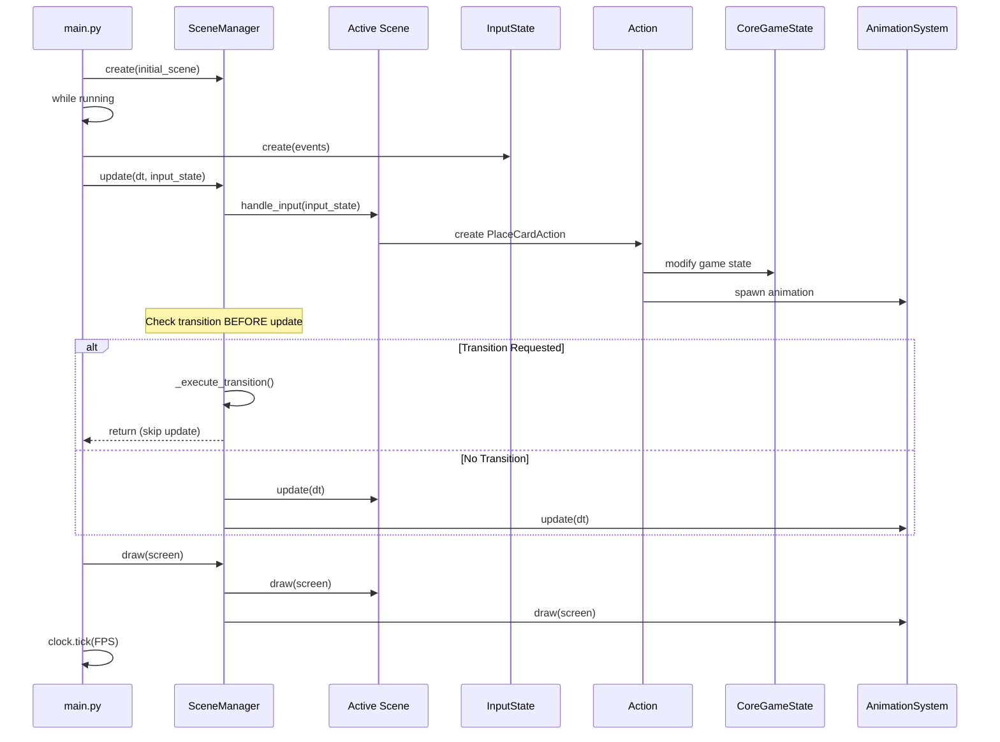
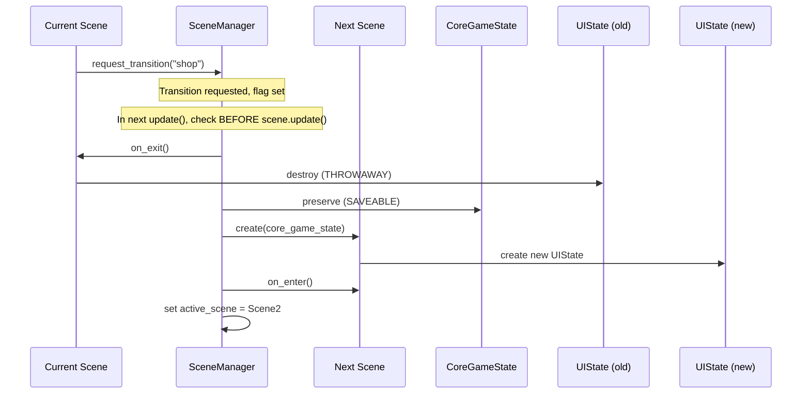

# Design Document: Scene Manager Refactoring

## Overview

This design refactors a Pygame-based game engine from a "Multiple Game Loop" architecture to a "Single Loop + Scene Manager" architecture. The current implementation has LobbyScreen and ShopScreen classes that each manage their own `while` loops, causing animation desync, input lag, and state management issues. The refactored architecture introduces a centralized SceneManager that controls scene transitions, an InputState system for intent-based input handling, an Action System for command pattern implementation, an Animation System for visual feedback, and delta-time-based animations for frame-independent movement.

The core architectural principles are:
1. **Inversion of Control**: Scenes no longer control the game loop; the game loop controls scenes through well-defined lifecycle methods
2. **State Separation**: CoreGameState (saveable, persistent) is strictly separated from UIState (throwaway, scene-local)
3. **Intent-Based Input**: InputState translates raw events into intents, not just wrapping events
4. **Action Layer**: All game modifications go through Actions for undo/redo/replay/network support
5. **Animation Feedback**: AnimationSystem provides visual feedback for all game state changes

## Engine Layers

The engine is organized into distinct layers with clear responsibilities:

```
🎯 Engine Architecture

Engine (main.py)
│
├── Core Systems (Persistent)
│   ├── SceneManager          # Scene lifecycle and transitions
│   ├── InputSystem           # Event → Intent translation
│   ├── AnimationSystem       # Visual feedback management
│   ├── ActionSystem          # Command pattern for game modifications
│   └── HexSystem             # Centralized hex math utilities
│
├── State (Separated by Lifecycle)
│   ├── CoreGameState         # SAVEABLE - persists across scenes, can be saved/loaded
│   │   └── game: Game        # Domain state only
│   │
│   └── UIState               # THROWAWAY - reset when scene changes
│       ├── selected_card     # UI selections
│       ├── hovered_tile      # Mouse hover state
│       ├── camera_offset     # View state
│       └── pending_rotation  # Temporary UI state
│
└── Scenes (Implements Scene interface)
    ├── LobbyScene            # Strategy selection
    ├── ShopScene             # Card purchasing
    └── CombatScene           # Battle visualization
```

## Architecture Diagram



## Sequence Diagrams

### Main Game Loop Flow



### Scene Transition Flow



## Components and Interfaces

### Component 1: Scene (Base Class)

**Purpose**: Abstract base class defining the lifecycle interface for all game scenes.

**Interface**:
```python
from abc import ABC, abstractmethod
from typing import Optional
import pygame

class Scene(ABC):
    """Abstract base class for all game scenes."""
    
    def __init__(self, core_game_state: 'CoreGameState'):
        """Initialize scene with shared core game state.
        
        Args:
            core_game_state: SAVEABLE state that persists across scenes
        """
        self.core_game_state = core_game_state
        self.ui_state: Optional['UIState'] = None  # THROWAWAY - created in on_enter
        self.scene_manager: Optional['SceneManager'] = None
    
    @abstractmethod
    def handle_input(self, input_state: 'InputState') -> None:
        """Process input intents for this scene.
        
        Args:
            input_state: Intent-based input abstraction (not raw events)
        """
        pass
    
    @abstractmethod
    def update(self, dt: float) -> None:
        """Update scene logic with delta time.
        
        Args:
            dt: Delta time in milliseconds since last frame
        """
        pass
    
    @abstractmethod
    def draw(self, screen: pygame.Surface) -> None:
        """Render scene to screen.
        
        Args:
            screen: Pygame surface to draw on
        """
        pass
    
    def on_enter(self) -> None:
        """Called when scene becomes active. Create UIState here."""
        self.ui_state = UIState()  # Fresh THROWAWAY state
    
    def on_exit(self) -> None:
        """Called when scene is deactivated. UIState is discarded."""
        self.ui_state = None  # Explicitly discard THROWAWAY state
```

**Responsibilities**:
- Define lifecycle methods that scenes must implement
- Provide access to shared CoreGameState (SAVEABLE)
- Manage scene-local UIState (THROWAWAY)
- Provide hooks for scene enter/exit logic

### Component 2: SceneManager

**Purpose**: Manages scene lifecycle, transitions, and delegates game loop calls to the active scene.

**Interface**:
```python
from typing import Optional
import pygame

class SceneManager:
    """Manages scene transitions and delegates to active scene."""
    
    def __init__(self, initial_scene: Scene):
        """Initialize with starting scene.
        
        Args:
            initial_scene: The first scene to activate
        """
        self.active_scene: Scene = initial_scene
        self.active_scene.scene_manager = self
        self.active_scene.on_enter()
        self._transition_requested: Optional[tuple] = None
    
    def update(self, dt: float, input_state: 'InputState') -> None:
        """Update active scene and process transitions.
        
        CRITICAL: Check transition BEFORE update to prevent double-update bug.
        
        Args:
            dt: Delta time in milliseconds
            input_state: Intent-based input abstraction
        """
        # Handle input
        self.active_scene.handle_input(input_state)
        
        # CRITICAL: Check transition BEFORE update
        if self._transition_requested is not None:
            self._execute_transition()
            return  # Don't update old scene
        
        # Update scene
        self.active_scene.update(dt)
    
    def draw(self, screen: pygame.Surface) -> None:
        """Render active scene.
        
        Args:
            screen: Pygame surface to draw on
        """
        self.active_scene.draw(screen)
    
    def request_transition(self, scene_name: str, **kwargs) -> None:
        """Request transition to a new scene.
        
        Args:
            scene_name: Name of scene to transition to
            **kwargs: Additional data to pass to new scene
        """
        self._transition_requested = (scene_name, kwargs)
    
    def _execute_transition(self) -> None:
        """Execute pending scene transition."""
        scene_name, kwargs = self._transition_requested
        self._transition_requested = None
        
        # Exit current scene (discards UIState)
        self.active_scene.on_exit()
        
        # Create new scene (preserves CoreGameState)
        new_scene = self._create_scene(scene_name, **kwargs)
        new_scene.scene_manager = self
        
        # Enter new scene (creates new UIState)
        new_scene.on_enter()
        
        # Activate new scene
        self.active_scene = new_scene
```

**Responsibilities**:
- Maintain reference to active scene
- Delegate `handle_input`, `update`, `draw` to active scene
- Handle scene transitions with proper lifecycle calls
- Ensure CoreGameState is preserved, UIState is reset
- **CRITICAL**: Check transition BEFORE update to prevent double-update bug

### Component 3: InputState

**Purpose**: Translates raw pygame events into intents for game logic consumption.

**Interface**:
```python
from typing import Tuple, Optional
import pygame

class InputState:
    """Intent-based input abstraction (not just event wrapper)."""
    
    def __init__(self, events: list):
        """Translate events into intents.
        
        Args:
            events: Raw pygame events from pygame.event.get()
        """
        # Mouse state
        self.mouse_pos: Tuple[int, int] = pygame.mouse.get_pos()
        self.mouse_down: bool = False  # Button is held
        self.mouse_clicked: bool = False  # Button was pressed THIS FRAME
        self.mouse_released: bool = False  # Button was released THIS FRAME
        
        # Keyboard state
        self.keys_pressed = pygame.key.get_pressed()
        self.key_down_events: dict = {}  # Key -> True for keys pressed this frame
        
        # Intent flags (derived from events)
        self.intent_confirm: bool = False  # Enter, Space, or Left Click
        self.intent_cancel: bool = False  # Escape or Right Click
        self.intent_rotate_cw: bool = False  # R key
        self.intent_rotate_ccw: bool = False  # Shift+R
        
        # Process events to set intents
        for event in events:
            if event.type == pygame.MOUSEBUTTONDOWN:
                if event.button == 1:  # Left click
                    self.mouse_clicked = True
                    self.mouse_down = True
                    self.intent_confirm = True
                elif event.button == 3:  # Right click
                    self.intent_cancel = True
            
            elif event.type == pygame.MOUSEBUTTONUP:
                if event.button == 1:
                    self.mouse_released = True
                    self.mouse_down = False
            
            elif event.type == pygame.KEYDOWN:
                self.key_down_events[event.key] = True
                
                if event.key == pygame.K_RETURN or event.key == pygame.K_SPACE:
                    self.intent_confirm = True
                elif event.key == pygame.K_ESCAPE:
                    self.intent_cancel = True
                elif event.key == pygame.K_r:
                    if event.mod & pygame.KMOD_SHIFT:
                        self.intent_rotate_ccw = True
                    else:
                        self.intent_rotate_cw = True
    
    def is_key_pressed(self, key: int) -> bool:
        """Check if key is currently held down.
        
        Args:
            key: Pygame key constant (e.g., pygame.K_SPACE)
        
        Returns:
            True if key is held down
        """
        return self.keys_pressed[key]
    
    def was_key_pressed_this_frame(self, key: int) -> bool:
        """Check if key was pressed THIS FRAME.
        
        Args:
            key: Pygame key constant
        
        Returns:
            True if key was pressed this frame
        """
        return self.key_down_events.get(key, False)
```

**Responsibilities**:
- Translate raw events into game intents
- Provide intent-based API (not just event wrapper)
- Distinguish between "held" and "pressed this frame"
- Make input testable and replayable (AI/network ready)

### Component 4: CoreGameState

**Purpose**: SAVEABLE state that persists across scenes and can be saved/loaded.

**Interface**:
```python
from engine_core.game import Game

class CoreGameState:
    """SAVEABLE - persists across scenes, can be saved/loaded.
    
    CRITICAL RULE: Only domain state here, NO UI state.
    """
    
    def __init__(self, game: Game):
        """Initialize with game instance.
        
        Args:
            game: The Game instance containing players, market, etc.
        """
        self.game: Game = game
        self.view_player_index: int = 0  # Which player we're viewing
        self.fast_mode: bool = False  # Game speed setting
    
    @property
    def current_player(self):
        """Get currently viewed player."""
        return self.game.players[self.view_player_index]
    
    def to_dict(self) -> dict:
        """Serialize to dictionary for saving."""
        return {
            "game": self.game.to_dict(),
            "view_player_index": self.view_player_index,
            "fast_mode": self.fast_mode
        }
    
    @classmethod
    def from_dict(cls, data: dict) -> 'CoreGameState':
        """Deserialize from dictionary for loading."""
        game = Game.from_dict(data["game"])
        state = cls(game)
        state.view_player_index = data["view_player_index"]
        state.fast_mode = data["fast_mode"]
        return state
```

**Responsibilities**:
- Store game instance and player data
- Track which player is being viewed
- Provide serialization for save/load
- **CRITICAL**: NO UI state (selections, hovers, animations)

### Component 5: UIState

**Purpose**: THROWAWAY state that is reset when scene changes.

**Interface**:
```python
from typing import Optional, Tuple, Set

class UIState:
    """THROWAWAY - reset when scene changes.
    
    CRITICAL RULE: This state is NOT saved, NOT preserved across scenes.
    """
    
    def __init__(self):
        """Initialize fresh UI state."""
        # Card selection
        self.selected_hand_idx: Optional[int] = None
        self.selected_card = None
        
        # Mouse interaction
        self.hovered_tile: Optional[Tuple[int, int]] = None
        self.hovered_card_idx: Optional[int] = None
        
        # Camera/view state
        self.camera_offset: Tuple[float, float] = (0.0, 0.0)
        self.zoom_level: float = 1.0
        
        # Temporary state
        self.pending_rotation: int = 0
        self.placed_this_turn: int = 0
        self.locked_coords: Set[Tuple[int, int]] = set()
        
        # Animation state (managed by AnimationSystem)
        self.is_animating: bool = False
```

**Responsibilities**:
- Store all UI-specific state
- Track selections, hovers, camera position
- Store temporary state that doesn't need to persist
- **CRITICAL**: Reset to fresh state when scene changes

### Component 6: AnimationSystem

**Purpose**: Manages all animations and provides visual feedback for game state changes.

**Interface**:
```python
from typing import List
import pygame

class Animation:
    """Base class for all animations."""
    
    def __init__(self, duration_ms: float):
        """Initialize animation.
        
        Args:
            duration_ms: Animation duration in milliseconds
        """
        self.duration_ms = duration_ms
        self.elapsed_ms = 0.0
        self.finished = False
    
    def update(self, dt: float) -> None:
        """Update animation progress.
        
        Args:
            dt: Delta time in milliseconds
        """
        self.elapsed_ms += dt
        if self.elapsed_ms >= self.duration_ms:
            self.finished = True
    
    def is_finished(self) -> bool:
        """Check if animation is complete."""
        return self.finished
    
    def draw(self, screen: pygame.Surface) -> None:
        """Render animation. Override in subclasses."""
        pass

class CardMoveAnimation(Animation):
    """Animates a card moving from one position to another."""
    
    def __init__(self, card, start_pos: Tuple[int, int], end_pos: Tuple[int, int], duration_ms: float):
        super().__init__(duration_ms)
        self.card = card
        self.start_pos = start_pos
        self.end_pos = end_pos
    
    def get_current_pos(self) -> Tuple[int, int]:
        """Get interpolated position."""
        t = min(1.0, self.elapsed_ms / self.duration_ms)
        x = self.start_pos[0] + (self.end_pos[0] - self.start_pos[0]) * t
        y = self.start_pos[1] + (self.end_pos[1] - self.start_pos[1]) * t
        return (int(x), int(y))
    
    def draw(self, screen: pygame.Surface) -> None:
        """Draw card at interpolated position."""
        pos = self.get_current_pos()
        # Draw card at pos (implementation depends on renderer)

class AnimationSystem:
    """Manages all active animations."""
    
    def __init__(self):
        """Initialize animation system."""
        self.animations: List[Animation] = []
    
    def add(self, animation: Animation) -> None:
        """Add animation to system.
        
        Args:
            animation: Animation to add
        """
        self.animations.append(animation)
    
    def update(self, dt: float) -> None:
        """Update all animations.
        
        Args:
            dt: Delta time in milliseconds
        """
        for anim in self.animations:
            anim.update(dt)
        
        # Remove finished animations
        self.animations = [a for a in self.animations if not a.is_finished()]
    
    def draw(self, screen: pygame.Surface) -> None:
        """Draw all animations.
        
        Args:
            screen: Pygame surface to draw on
        """
        for anim in self.animations:
            anim.draw(screen)
    
    def is_animating(self) -> bool:
        """Check if any animations are active."""
        return len(self.animations) > 0
    
    def clear(self) -> None:
        """Clear all animations."""
        self.animations.clear()
```

**Responsibilities**:
- Manage animation lifecycle (add, update, remove)
- Update all animations with delta time
- Render all active animations
- Provide query for "is anything animating?"
- **CRITICAL**: This is the missing piece for combat visualization

### Component 7: ActionSystem

**Purpose**: Command pattern implementation for all game state modifications.

**Interface**:
```python
from abc import ABC, abstractmethod
from typing import Optional

class Action(ABC):
    """Base class for all game actions."""
    
    @abstractmethod
    def execute(self, core_game_state: 'CoreGameState', animation_system: 'AnimationSystem') -> bool:
        """Execute action, modify state, spawn animations.
        
        Args:
            core_game_state: Game state to modify
            animation_system: System to spawn animations
        
        Returns:
            True if action succeeded, False otherwise
        """
        pass
    
    @abstractmethod
    def undo(self, core_game_state: 'CoreGameState') -> None:
        """Undo action (for undo/redo support).
        
        Args:
            core_game_state: Game state to restore
        """
        pass

class PlaceCardAction(Action):
    """Action to place a card on the board."""
    
    def __init__(self, hand_idx: int, coord: Tuple[int, int], rotation: int):
        """Initialize place card action.
        
        Args:
            hand_idx: Index of card in hand
            coord: Hex coordinate to place card
            rotation: Card rotation (0-5)
        """
        self.hand_idx = hand_idx
        self.coord = coord
        self.rotation = rotation
        self.prev_state = None  # For undo
    
    def execute(self, core_game_state: 'CoreGameState', animation_system: 'AnimationSystem') -> bool:
        """Place card and spawn animation."""
        player = core_game_state.current_player
        
        # Validate
        if self.hand_idx >= len(player.hand):
            return False
        
        card = player.hand[self.hand_idx]
        
        # Save state for undo
        self.prev_state = player.board.copy()
        
        # Execute placement
        success = player.board.place_card(card, self.coord, self.rotation)
        
        if success:
            # Remove from hand
            player.hand.pop(self.hand_idx)
            
            # Spawn animation
            anim = CardMoveAnimation(card, start_pos=(100, 800), end_pos=hex_to_pixel(self.coord), duration_ms=300)
            animation_system.add(anim)
        
        return success
    
    def undo(self, core_game_state: 'CoreGameState') -> None:
        """Restore previous board state."""
        player = core_game_state.current_player
        player.board = self.prev_state

class BuyCardAction(Action):
    """Action to buy a card from shop."""
    
    def __init__(self, shop_idx: int):
        self.shop_idx = shop_idx
        self.card = None
        self.prev_gold = 0
    
    def execute(self, core_game_state: 'CoreGameState', animation_system: 'AnimationSystem') -> bool:
        """Buy card and spawn animation."""
        player = core_game_state.current_player
        market = core_game_state.game.market
        
        # Validate
        if self.shop_idx >= len(market.current_window):
            return False
        
        card = market.current_window[self.shop_idx]
        
        if player.gold < card.cost:
            return False
        
        # Save for undo
        self.card = card
        self.prev_gold = player.gold
        
        # Execute purchase
        player.gold -= card.cost
        player.hand.append(card)
        market.current_window.pop(self.shop_idx)
        
        # Spawn animation
        anim = CardMoveAnimation(card, start_pos=(400, 300), end_pos=(100, 800), duration_ms=400)
        animation_system.add(anim)
        
        return True
    
    def undo(self, core_game_state: 'CoreGameState') -> None:
        """Restore gold and return card."""
        player = core_game_state.current_player
        player.gold = self.prev_gold
        player.hand.remove(self.card)
        core_game_state.game.market.current_window.insert(self.shop_idx, self.card)

class ActionSystem:
    """Manages action execution and history."""
    
    def __init__(self):
        """Initialize action system."""
        self.history: List[Action] = []
        self.redo_stack: List[Action] = []
    
    def execute(self, action: Action, core_game_state: 'CoreGameState', animation_system: 'AnimationSystem') -> bool:
        """Execute action and add to history.
        
        Args:
            action: Action to execute
            core_game_state: Game state to modify
            animation_system: System to spawn animations
        
        Returns:
            True if action succeeded
        """
        success = action.execute(core_game_state, animation_system)
        
        if success:
            self.history.append(action)
            self.redo_stack.clear()  # Clear redo stack on new action
        
        return success
    
    def undo(self, core_game_state: 'CoreGameState') -> bool:
        """Undo last action.
        
        Args:
            core_game_state: Game state to restore
        
        Returns:
            True if undo succeeded
        """
        if not self.history:
            return False
        
        action = self.history.pop()
        action.undo(core_game_state)
        self.redo_stack.append(action)
        
        return True
    
    def redo(self, core_game_state: 'CoreGameState', animation_system: 'AnimationSystem') -> bool:
        """Redo last undone action.
        
        Args:
            core_game_state: Game state to modify
            animation_system: System to spawn animations
        
        Returns:
            True if redo succeeded
        """
        if not self.redo_stack:
            return False
        
        action = self.redo_stack.pop()
        success = action.execute(core_game_state, animation_system)
        
        if success:
            self.history.append(action)
        
        return success
```

**Responsibilities**:
- Define Action interface for all game modifications
- Implement concrete actions (PlaceCard, BuyCard, etc.)
- Manage action history for undo/redo
- Spawn animations when actions execute
- **CRITICAL**: This layer enables undo/redo, replay, network sync, AI

### Component 8: HexSystem

**Purpose**: Centralized hex math utilities for all hex coordinate operations.

**Interface**:
```python
from typing import Tuple, List
import math

class HexSystem:
    """Centralized hex coordinate math utilities."""
    
    def __init__(self, hex_size: float, origin: Tuple[int, int]):
        """Initialize hex system.
        
        Args:
            hex_size: Radius of hexagon in pixels
            origin: Screen coordinates of hex (0, 0)
        """
        self.hex_size = hex_size
        self.origin = origin
    
    def pixel_to_hex(self, px: int, py: int) -> Tuple[int, int]:
        """Convert pixel coordinates to hex coordinates.
        
        Args:
            px, py: Screen pixel coordinates
        
        Returns:
            (q, r) hex coordinates
        """
        # Translate to origin
        x = (px - self.origin[0]) / self.hex_size
        y = (py - self.origin[1]) / self.hex_size
        
        # Flat-top hex conversion
        q = (2.0 / 3.0) * x
        r = (-1.0 / 3.0) * x + (math.sqrt(3) / 3.0) * y
        
        # Cube rounding
        return self.cube_round(q, r)
    
    def hex_to_pixel(self, q: int, r: int) -> Tuple[int, int]:
        """Convert hex coordinates to pixel coordinates.
        
        Args:
            q, r: Hex coordinates
        
        Returns:
            (px, py) screen pixel coordinates
        """
        # Flat-top hex conversion
        x = self.hex_size * (3.0 / 2.0) * q
        y = self.hex_size * (math.sqrt(3) / 2.0 * q + math.sqrt(3) * r)
        
        # Translate to origin
        px = int(x + self.origin[0])
        py = int(y + self.origin[1])
        
        return (px, py)
    
    def cube_round(self, frac_q: float, frac_r: float) -> Tuple[int, int]:
        """Round fractional cube coordinates to nearest hex.
        
        Args:
            frac_q, frac_r: Fractional hex coordinates
        
        Returns:
            (q, r) integer hex coordinates
        """
        frac_s = -frac_q - frac_r
        
        q = round(frac_q)
        r = round(frac_r)
        s = round(frac_s)
        
        q_diff = abs(q - frac_q)
        r_diff = abs(r - frac_r)
        s_diff = abs(s - frac_s)
        
        # Reset coordinate with largest rounding error
        if q_diff > r_diff and q_diff > s_diff:
            q = -r - s
        elif r_diff > s_diff:
            r = -q - s
        else:
            s = -q - r
        
        return (q, r)
    
    def neighbors(self, q: int, r: int) -> List[Tuple[int, int]]:
        """Get all 6 neighbors of a hex.
        
        Args:
            q, r: Hex coordinates
        
        Returns:
            List of 6 neighbor coordinates
        """
        directions = [
            (1, 0), (1, -1), (0, -1),
            (-1, 0), (-1, 1), (0, 1)
        ]
        return [(q + dq, r + dr) for dq, dr in directions]
    
    def distance(self, q1: int, r1: int, q2: int, r2: int) -> int:
        """Calculate hex distance between two coordinates.
        
        Args:
            q1, r1: First hex coordinates
            q2, r2: Second hex coordinates
        
        Returns:
            Manhattan distance in hex space
        """
        return (abs(q1 - q2) + abs(q1 + r1 - q2 - r2) + abs(r1 - r2)) // 2
```

**Responsibilities**:
- Centralize all hex coordinate math
- Provide pixel-to-hex and hex-to-pixel conversion
- Implement cube rounding algorithm
- Provide neighbor and distance calculations
- **CRITICAL**: Single source of truth for hex math

## Data Models

### Model 1: Scene Transition Request

```python
class SceneTransition:
    """Data for a pending scene transition."""
    
    scene_name: str
    core_game_state: CoreGameState  # SAVEABLE - preserved
    additional_data: Dict[str, Any]
```

**Validation Rules**:
- `scene_name` must be a registered scene type
- `core_game_state` must not be None
- Transition can only be requested once per frame
- UIState is NOT included (will be reset)

### Model 2: HexCoordinate

```python
class HexCoordinate:
    """Cube coordinate representation for hexagonal grid."""
    
    q: int  # Column coordinate
    r: int  # Row coordinate
    s: int  # Derived: s = -q - r (cube constraint)
```

**Validation Rules**:
- Must satisfy cube constraint: `q + r + s == 0`
- Used for all hex-to-pixel and pixel-to-hex conversions
- All hex math goes through HexSystem

### Model 3: Action

```python
class Action:
    """Base class for all game state modifications."""
    
    def execute(self, core_game_state: CoreGameState, animation_system: AnimationSystem) -> bool:
        """Modify state and spawn animations."""
        pass
    
    def undo(self, core_game_state: CoreGameState) -> None:
        """Restore previous state."""
        pass
```

**Validation Rules**:
- Actions must be serializable for replay/network
- Actions must be undoable
- Actions must spawn appropriate animations
- Actions are the ONLY way to modify CoreGameState

## Algorithmic Pseudocode

### Main Game Loop Algorithm

```python
def main():
    """Main entry point with single game loop."""
    pygame.init()
    screen = pygame.display.set_mode((WIDTH, HEIGHT))
    clock = pygame.time.Clock()
    
    # Initialize game state
    game = build_game(strategies)
    core_game_state = CoreGameState(game)
    
    # Initialize systems
    animation_system = AnimationSystem()
    action_system = ActionSystem()
    hex_system = HexSystem(hex_size=40, origin=(800, 480))
    
    # Create scene manager with initial scene
    lobby_scene = LobbyScene(core_game_state)
    scene_manager = SceneManager(lobby_scene)
    
    running = True
    while running:
        # Capture delta time
        dt = clock.tick(FPS)
        
        # Capture input state once (translate events to intents)
        events = pygame.event.get()
        input_state = InputState(events)
        
        # Check for quit
        for event in events:
            if event.type == pygame.QUIT:
                running = False
        
        # Update systems
        animation_system.update(dt)
        scene_manager.update(dt, input_state)
        
        # Render
        screen.fill(BACKGROUND_COLOR)
        scene_manager.draw(screen)
        animation_system.draw(screen)
        pygame.display.flip()
    
    pygame.quit()
```

**Preconditions:**
- Pygame is installed and importable
- Game assets and configuration files exist
- Display can be initialized

**Postconditions:**
- Game loop runs at target FPS
- Scenes receive consistent delta time
- Input is translated to intents once per frame
- Scene transitions are handled cleanly
- Animations are updated and rendered

**Loop Invariants:**
- Exactly one scene is active at any time
- Delta time is always positive
- Input state is captured before scene update
- CoreGameState is preserved across transitions
- UIState is reset on scene transitions

### Scene Manager Update Algorithm

```python
def update(self, dt: float, input_state: InputState) -> None:
    """Update active scene and handle transitions.
    
    CRITICAL: Check transition BEFORE update to prevent double-update bug.
    """
    # Handle input
    self.active_scene.handle_input(input_state)
    
    # CRITICAL: Check transition BEFORE update
    # This prevents the old scene from updating after requesting transition
    if self._transition_requested is not None:
        self._execute_transition()
        return  # Don't update old scene
    
    # Update scene
    self.active_scene.update(dt)
```

**Preconditions:**
- `self.active_scene` is not None
- `dt > 0` (positive delta time)
- `input_state` is a valid InputState instance

**Postconditions:**
- Active scene has processed input
- If transition was requested, new scene is now active and old scene was NOT updated
- If no transition, active scene has been updated
- Old scene's `on_exit()` was called before transition
- New scene's `on_enter()` was called after transition

**Loop Invariants:**
- Active scene reference is always valid
- Scene manager reference in active scene is always `self`

**Why This Order Matters:**
- **WRONG**: `handle_input() → update() → check_transition()` causes double-update bug
- **CORRECT**: `handle_input() → check_transition() → update()` prevents old scene from updating after transition request

### Scene Transition Algorithm

```python
def _execute_transition(self) -> None:
    """Execute pending scene transition."""
    scene_name, kwargs = self._transition_requested
    self._transition_requested = None
    
    # Exit current scene (discards UIState)
    self.active_scene.on_exit()
    
    # Create new scene (preserves CoreGameState)
    new_scene = self._create_scene(scene_name, **kwargs)
    new_scene.scene_manager = self
    
    # Enter new scene (creates new UIState)
    new_scene.on_enter()
    
    # Activate new scene
    self.active_scene = new_scene
```

**Preconditions:**
- `_transition_requested` is not None
- `scene_name` is a valid registered scene type
- CoreGameState is preserved in kwargs or accessible

**Postconditions:**
- Old scene's `on_exit()` has been called
- Old scene's UIState has been discarded (THROWAWAY)
- New scene has been created and initialized
- New scene has fresh UIState (THROWAWAY)
- New scene's `on_enter()` has been called
- `active_scene` now references new scene
- `_transition_requested` is cleared
- CoreGameState is preserved (SAVEABLE)

**State Lifecycle:**
- CoreGameState: Passed to new scene constructor (PRESERVED)
- UIState: Old discarded, new created in `on_enter()` (RESET)

### Action Execution Algorithm

```python
def execute_action(action: Action, core_game_state: CoreGameState, 
                   animation_system: AnimationSystem) -> bool:
    """Execute action through action system.
    
    This is the ONLY way to modify CoreGameState.
    """
    # Validate action
    if not action.is_valid(core_game_state):
        return False
    
    # Execute action (modifies CoreGameState)
    success = action.execute(core_game_state, animation_system)
    
    if success:
        # Action spawns animations
        # Action is added to history for undo/redo
        pass
    
    return success
```

**Preconditions:**
- `action` is a valid Action instance
- `core_game_state` is not None
- `animation_system` is not None

**Postconditions:**
- If action succeeded: CoreGameState is modified, animations are spawned, action is in history
- If action failed: CoreGameState is unchanged, no animations spawned
- Action can be undone via `action.undo()`

**Why This Layer Matters:**
- **Undo/Redo**: Action history enables undo/redo
- **Replay**: Actions can be serialized and replayed
- **Network**: Actions can be sent over network for multiplayer
- **AI**: AI can generate actions without knowing UI details
- **Testing**: Actions can be tested in isolation

### Hex Cube Rounding Algorithm

```python
def cube_round(frac_q: float, frac_r: float, frac_s: float) -> Tuple[int, int, int]:
    """Round fractional cube coordinates to nearest hex using cube rounding.
    
    This is the REQUIRED algorithm for all hex coordinate conversions.
    """
    q = round(frac_q)
    r = round(frac_r)
    s = round(frac_s)
    
    q_diff = abs(q - frac_q)
    r_diff = abs(r - frac_r)
    s_diff = abs(s - frac_s)
    
    # Reset coordinate with largest rounding error
    if q_diff > r_diff and q_diff > s_diff:
        q = -r - s
    elif r_diff > s_diff:
        r = -q - s
    else:
        s = -q - r
    
    return (q, r, s)
```

**Preconditions:**
- Input coordinates are fractional cube coordinates
- Coordinates approximately satisfy `frac_q + frac_r + frac_s ≈ 0`

**Postconditions:**
- Returned coordinates are integers
- Returned coordinates exactly satisfy `q + r + s == 0`
- Returned hex is the closest valid hex to input fractional coordinates

## Key Functions with Formal Specifications

### Function 1: SceneManager.update()

```python
def update(self, dt: float, input_state: InputState) -> None:
    """Update active scene and process transitions."""
    pass
```

**Preconditions:**
- `self.active_scene` is not None
- `dt > 0` (positive delta time)
- `input_state` is a valid InputState instance

**Postconditions:**
- `self.active_scene.handle_input(input_state)` has been called
- If transition requested: new scene is active, old scene was NOT updated
- If no transition: `self.active_scene.update(dt)` has been called
- CoreGameState is preserved across transition
- UIState is reset on transition

**Loop Invariants:** N/A (no loops in this function)

### Function 2: Scene.handle_input()

```python
def handle_input(self, input_state: InputState) -> None:
    """Process input intents for this scene."""
    pass
```

**Preconditions:**
- `input_state` is a valid InputState instance
- Scene has been initialized with CoreGameState
- Scene has valid UIState (created in on_enter)

**Postconditions:**
- All relevant intents have been processed
- Scene may create Actions based on input
- Actions modify CoreGameState and spawn animations
- UIState may be modified (selections, hovers, etc.)

**Loop Invariants:**
- For input processing loops: All previously processed intents have been handled correctly

### Function 3: Scene.update()

```python
def update(self, dt: float) -> None:
    """Update scene logic with delta time."""
    pass
```

**Preconditions:**
- `dt > 0` (positive delta time in milliseconds)
- Scene has been initialized
- Scene has valid UIState

**Postconditions:**
- All time-based logic has advanced by `dt`
- Scene may request transition via `self.scene_manager.request_transition()`
- UIState may be updated (camera movement, etc.)
- CoreGameState is NOT directly modified (use Actions instead)

**Loop Invariants:**
- For update loops: All updates remain synchronized with delta time

### Function 4: Action.execute()

```python
def execute(self, core_game_state: CoreGameState, animation_system: AnimationSystem) -> bool:
    """Execute action, modify state, spawn animations."""
    pass
```

**Preconditions:**
- `core_game_state` is not None
- `animation_system` is not None
- Action is valid for current game state

**Postconditions:**
- If successful: CoreGameState is modified, animations spawned, returns True
- If failed: CoreGameState unchanged, no animations, returns False
- Action can be undone via `undo()`

**Loop Invariants:** N/A (no loops)

### Function 5: HexSystem.pixel_to_hex()

```python
def pixel_to_hex(self, px: int, py: int) -> Tuple[int, int]:
    """Convert pixel coordinates to hex coordinates using cube rounding."""
    pass
```

**Preconditions:**
- `px, py` are valid screen coordinates
- HexSystem is initialized with hex_size and origin

**Postconditions:**
- Returns `(q, r)` hex coordinates
- Coordinates satisfy cube constraint: `q + r + s == 0` where `s = -q - r`
- Uses cube rounding algorithm for accurate conversion

**Loop Invariants:** N/A (no loops)

### Function 6: AnimationSystem.update()

```python
def update(self, dt: float) -> None:
    """Update all animations."""
    pass
```

**Preconditions:**
- `dt > 0` (positive delta time)

**Postconditions:**
- All animations have advanced by `dt`
- Finished animations have been removed
- Animation list contains only active animations

**Loop Invariants:**
- For animation loop: All animations remain valid and non-null

## Example Usage

### Example 1: Creating and Running the Game

```python
import pygame
from core.scene_manager import SceneManager
from core.core_game_state import CoreGameState
from core.animation_system import AnimationSystem
from core.action_system import ActionSystem
from core.hex_system import HexSystem
from scenes.lobby_scene import LobbyScene
from engine_core.game import build_game

def main():
    pygame.init()
    screen = pygame.display.set_mode((1600, 960))
    clock = pygame.time.Clock()
    
    # Build game with strategies
    game = build_game(strategies=["warrior", "builder", "evolver"])
    core_game_state = CoreGameState(game)
    
    # Initialize systems
    animation_system = AnimationSystem()
    action_system = ActionSystem()
    hex_system = HexSystem(hex_size=40, origin=(800, 480))
    
    # Create scene manager with lobby
    lobby = LobbyScene(core_game_state)
    scene_manager = SceneManager(lobby)
    
    running = True
    while running:
        dt = clock.tick(60)
        events = pygame.event.get()
        
        for event in events:
            if event.type == pygame.QUIT:
                running = False
        
        # Create input state (translates events to intents)
        input_state = InputState(events)
        
        # Update systems
        animation_system.update(dt)
        scene_manager.update(dt, input_state)
        
        # Render
        screen.fill((10, 11, 18))
        scene_manager.draw(screen)
        animation_system.draw(screen)
        pygame.display.flip()
    
    pygame.quit()
```

### Example 2: Implementing a Scene with State Separation

```python
from core.scene import Scene
from core.ui_state import UIState
from core.input_state import InputState
from core.action_system import PlaceCardAction
import pygame

class CombatScene(Scene):
    def __init__(self, core_game_state):
        super().__init__(core_game_state)
        # UIState will be created in on_enter()
    
    def on_enter(self):
        """Setup scene when it becomes active."""
        # Create fresh UIState (THROWAWAY)
        self.ui_state = UIState()
        
        # Initialize scene-specific state
        player = self.core_game_state.current_player
        self.ui_state.locked_coords = set(player.board.occupied_coords())
    
    def handle_input(self, input_state):
        """Process input intents (not raw events)."""
        # Update hover state
        if input_state.mouse_pos:
            hex_coord = hex_system.pixel_to_hex(*input_state.mouse_pos)
            self.ui_state.hovered_tile = hex_coord
        
        # Handle card selection
        if input_state.intent_confirm:
            if self.ui_state.hovered_card_idx is not None:
                self.ui_state.selected_hand_idx = self.ui_state.hovered_card_idx
        
        # Handle card placement via Action
        if input_state.mouse_clicked and self.ui_state.selected_hand_idx is not None:
            if self.ui_state.hovered_tile:
                action = PlaceCardAction(
                    hand_idx=self.ui_state.selected_hand_idx,
                    coord=self.ui_state.hovered_tile,
                    rotation=self.ui_state.pending_rotation
                )
                
                # Execute action (modifies CoreGameState, spawns animation)
                success = action_system.execute(action, self.core_game_state, animation_system)
                
                if success:
                    self.ui_state.selected_hand_idx = None
                    self.ui_state.pending_rotation = 0
        
        # Handle rotation
        if input_state.intent_rotate_cw:
            self.ui_state.pending_rotation = (self.ui_state.pending_rotation + 1) % 6
        elif input_state.intent_rotate_ccw:
            self.ui_state.pending_rotation = (self.ui_state.pending_rotation - 1) % 6
        
        # Handle scene transition
        if input_state.intent_cancel:
            self.scene_manager.request_transition("shop")
    
    def update(self, dt):
        """Update scene logic (no direct state modification)."""
        # Update camera smoothing
        if self.ui_state.hovered_tile:
            target_x, target_y = hex_system.hex_to_pixel(*self.ui_state.hovered_tile)
            current_x, current_y = self.ui_state.camera_offset
            
            # Smooth camera movement
            speed = 0.1
            new_x = current_x + (target_x - current_x) * speed * (dt / 16.0)
            new_y = current_y + (target_y - current_y) * speed * (dt / 16.0)
            
            self.ui_state.camera_offset = (new_x, new_y)
    
    def draw(self, screen):
        """Render scene."""
        # Draw board
        player = self.core_game_state.current_player
        for coord in player.board.occupied_coords():
            px, py = hex_system.hex_to_pixel(*coord)
            # Draw hex at (px, py)
        
        # Draw hover highlight
        if self.ui_state.hovered_tile:
            px, py = hex_system.hex_to_pixel(*self.ui_state.hovered_tile)
            pygame.draw.circle(screen, (255, 255, 0), (px, py), 5)
        
        # Draw hand
        for i, card in enumerate(player.hand):
            x = 100 + i * 150
            y = 800
            # Draw card at (x, y)
            
            # Highlight selected card
            if i == self.ui_state.selected_hand_idx:
                pygame.draw.rect(screen, (0, 255, 0), (x-5, y-5, 140, 210), 3)
    
    def on_exit(self):
        """Cleanup when leaving scene."""
        # UIState is automatically discarded (THROWAWAY)
        self.ui_state = None
```

### Example 3: Scene Transition with State Preservation

```python
# Inside a scene's handle_input method
def handle_input(self, input_state):
    if input_state.was_key_pressed_this_frame(pygame.K_RETURN):
        # Transition to shop scene
        # CoreGameState is automatically preserved (SAVEABLE)
        # UIState will be reset (THROWAWAY)
        self.scene_manager.request_transition("shop")
```

### Example 4: Using Actions for State Modification

```python
# WRONG: Direct state modification
def handle_input(self, input_state):
    if input_state.mouse_clicked:
        player = self.core_game_state.current_player
        card = player.hand.pop(0)  # ❌ Direct modification
        player.board.place_card(card, coord, rotation)  # ❌ No undo, no animation

# CORRECT: Action-based modification
def handle_input(self, input_state):
    if input_state.mouse_clicked:
        action = PlaceCardAction(hand_idx=0, coord=coord, rotation=rotation)
        success = action_system.execute(action, self.core_game_state, animation_system)
        # ✅ Undoable, spawns animation, testable, replayable
```

### Example 5: Intent-Based Input

```python
# WRONG: Raw event handling
def handle_events(self, events):
    for event in events:
        if event.type == pygame.KEYDOWN:
            if event.key == pygame.K_RETURN or event.key == pygame.K_SPACE:
                self.confirm()  # ❌ Duplicated logic

# CORRECT: Intent-based handling
def handle_input(self, input_state):
    if input_state.intent_confirm:  # ✅ Single intent, multiple sources
        self.confirm()
```

### Example 6: Delta Time Movement

```python
# WRONG: Frame-dependent movement
def update(self):
    self.position_x += 5  # Moves 5 pixels per frame (varies with FPS)

# CORRECT: Frame-independent movement
def update(self, dt):
    speed = 300  # pixels per second
    self.position_x += speed * (dt / 1000.0)  # Consistent speed regardless of FPS
```

## Correctness Properties

*A property is a characteristic or behavior that should hold true across all valid executions of a system—essentially, a formal statement about what the system should do. Properties serve as the bridge between human-readable specifications and machine-verifiable correctness guarantees.*

### Property 1: Single Active Scene

For any point in time during execution, the SceneManager maintains exactly one active scene (not None, not multiple).

**Validates: Requirements 1.1**

### Property 2: Transition Before Update

For any frame where a scene transition is requested, the old scene's update method is not called in that frame (prevents double-update bug).

**Validates: Requirements 1.3, 1.7, 10.2, 10.3**

### Property 3: Scene Lifecycle Ordering

For any scene transition, the old scene's on_exit method is called before the new scene is created, and the new scene's on_enter method is called after creation.

**Validates: Requirements 1.4, 1.5, 2.2, 2.3**

### Property 4: Method Delegation

For any call to SceneManager's handle_input, update, or draw methods, the corresponding method on the active scene is called.

**Validates: Requirements 1.6**

### Property 5: UIState Lifecycle

For any scene, when on_enter is called, a fresh UIState instance is created (different identity), and when on_exit is called, the UIState is set to None.

**Validates: Requirements 2.4, 2.5**

### Property 6: CoreGameState Preservation

For any scene transition, the CoreGameState instance identity is preserved (same object reference before and after transition).

**Validates: Requirements 3.6, 10.5**

### Property 7: UIState Reset

For any scene transition, the UIState instance identity changes (different object reference before and after transition).

**Validates: Requirements 3.7, 10.6**

### Property 8: CoreGameState Serialization Round-Trip

For any valid CoreGameState instance, serializing with to_dict then deserializing with from_dict produces an equivalent state.

**Validates: Requirements 3.3**

### Property 9: Intent Translation Determinism

For any list of pygame events, creating InputState instances from the same events produces identical intent flags.

**Validates: Requirements 4.1, 13.5, 13.6**

### Property 10: InputState Immutability

For any InputState instance, all fields remain constant after construction (no mutations).

**Validates: Requirements 13.4**

### Property 11: Action Success Behavior

For any action that executes successfully, the CoreGameState is modified, at least one animation is spawned, and the action returns True.

**Validates: Requirements 5.2, 5.4, 6.5**

### Property 12: Action Failure Behavior

For any action that fails validation or execution, the CoreGameState remains unchanged and the action returns False.

**Validates: Requirements 5.3, 15.5**

### Property 13: Action Undo Correctness

For any action that executes successfully, executing the action then calling undo restores the CoreGameState to its previous state.

**Validates: Requirements 5.6, 12.3**

### Property 14: Action History Maintenance

For any sequence of successfully executed actions, the ActionSystem's history stack length equals the number of executed actions.

**Validates: Requirements 5.5, 12.1, 12.2**

### Property 15: Redo Stack Management

For any sequence of undo operations followed by a new action execution, the redo stack is cleared.

**Validates: Requirements 12.6**

### Property 16: Animation Lifecycle

For any animation added to the AnimationSystem, calling update with delta time advances the animation's elapsed time by that delta, and when elapsed time reaches duration, the animation is removed from the active list.

**Validates: Requirements 6.2, 6.3**

### Property 17: Cube Coordinate Constraint

For any hex coordinate produced by pixel_to_hex conversion, the cube constraint q + r + s = 0 is satisfied.

**Validates: Requirements 7.3**

### Property 18: Hex Conversion Round-Trip

For any valid hex coordinate (q, r), converting to pixel with hex_to_pixel then back to hex with pixel_to_hex produces the original coordinate.

**Validates: Requirements 7.4**

### Property 19: Delta Time Positivity

For any frame in the game loop, the delta time value is positive and non-zero.

**Validates: Requirements 8.5**

### Property 20: Frame Independence

For any animation and any two frame sequences with the same total elapsed time, the animation reaches the same position regardless of how the time was divided across frames.

**Validates: Requirements 8.6**

### Property 21: Scene Manager Reference

For any scene transition, the new scene's scene_manager reference is set to the SceneManager instance.

**Validates: Requirements 2.7, 10.7**

### Property 22: No Nested Loops

For any scene implementation, no methods contain while loops (all scenes use the single centralized game loop).

**Validates: Requirements 9.1**

## Error Handling

### Error Scenario 1: Invalid Scene Transition

**Condition**: Scene requests transition to non-existent scene name
**Response**: Log error, remain in current scene, display error message to user
**Recovery**: User can continue in current scene or manually trigger valid transition

### Error Scenario 2: Missing GameState

**Condition**: Scene is created without GameState parameter
**Response**: Raise `ValueError` with descriptive message during scene construction
**Recovery**: Caller must provide valid GameState; no automatic recovery

### Error Scenario 3: Negative Delta Time

**Condition**: Clock returns negative or zero delta time
**Response**: Clamp `dt` to minimum value (e.g., 1ms), log warning
**Recovery**: Continue with clamped value to prevent division by zero or backwards animation

### Error Scenario 4: Invalid Hex Coordinates

**Condition**: Pixel-to-hex conversion produces coordinates outside valid board range
**Response**: Return None or special sentinel value, do not place card
**Recovery**: User must click valid board area; invalid clicks are ignored

## Testing Strategy

### Unit Testing Approach

Test each component in isolation:

- **Scene Base Class**: Test lifecycle method calls (on_enter, on_exit)
- **SceneManager**: Test scene transitions, active scene tracking, delegation
- **InputState**: Test input capture, key/mouse state queries
- **GameState**: Test state preservation, player switching, reset methods
- **Hex Math**: Test cube rounding, pixel-to-hex, hex-to-pixel conversions

Key test cases:
- Scene transition preserves GameState
- Multiple transitions in sequence work correctly
- Delta time is always positive
- Input state is immutable after creation
- Cube rounding satisfies constraint

### Property-Based Testing Approach

Use property-based testing to verify invariants:

**Property Test Library**: hypothesis (Python)

**Test 1: Cube Coordinate Constraint**
```python
@given(integers(), integers())
def test_cube_constraint(q, r):
    s = -q - r
    assert q + r + s == 0
```

**Test 2: Hex Conversion Round-Trip**
```python
@given(integers(min_value=-10, max_value=10), 
       integers(min_value=-10, max_value=10))
def test_hex_conversion_roundtrip(q, r):
    px, py = hex_to_pixel(q, r, origin_x=800, origin_y=480)
    q2, r2 = pixel_to_hex(px, py, origin_x=800, origin_y=480)
    assert (q, r) == (q2, r2)
```

**Test 3: Scene Manager Always Has Active Scene**
```python
@given(scene_names=lists(sampled_from(["lobby", "shop", "combat"]), min_size=1))
def test_always_has_active_scene(scene_names):
    manager = SceneManager(initial_scene)
    for name in scene_names:
        manager.request_transition(name)
        manager.update(16, [])
        assert manager.active_scene is not None
```

**Test 4: Delta Time Frame Independence**
```python
@given(total_time=floats(min_value=0, max_value=10000),
       frame_times=lists(floats(min_value=1, max_value=100)))
def test_frame_independence(total_time, frame_times):
    # Simulate animation with different frame rates
    pos1 = simulate_animation(total_time, frame_times)
    pos2 = simulate_animation(total_time, [total_time])  # Single frame
    assert abs(pos1 - pos2) < 0.01  # Positions should be nearly identical
```

### Integration Testing Approach

Test scene interactions and full game loop:

- **Lobby to Shop Transition**: Verify strategies are passed correctly
- **Shop to Combat Transition**: Verify purchased cards are in player hand
- **Combat to Shop Transition**: Verify gold and HP are updated
- **Full Game Loop**: Run 100 frames, verify no crashes, consistent FPS
- **Input Handling**: Simulate mouse clicks and keyboard input across scenes

## Performance Considerations

- **Single Event Capture**: Capturing input once per frame eliminates redundant `pygame.event.get()` calls
- **Delta Time Scaling**: Frame-independent movement allows game to run smoothly at variable frame rates
- **Scene Lifecycle**: `on_enter` and `on_exit` hooks allow scenes to load/unload resources efficiently
- **No Nested Loops**: Eliminating nested `while` loops prevents blocking and ensures consistent frame timing

Target performance:
- Maintain 60 FPS on mid-range hardware
- Scene transitions complete in < 16ms (single frame)
- Input latency < 16ms (single frame delay)

## Security Considerations

- **Input Validation**: Validate all user input (mouse clicks, keyboard) before processing
- **State Isolation**: Scenes should not directly modify other scenes' state
- **Resource Cleanup**: Ensure `on_exit` properly releases resources to prevent memory leaks

## Dependencies

- **pygame**: Core game library for rendering, input, and game loop
- **engine_core**: Existing game logic (Player, Game, Board, Card, Market)
- **ui.renderer_v3**: Existing rendering utilities (CyberRenderer, BoardRenderer)
- **ui.card_meta**: Card metadata and passive descriptions

New dependencies (to be created):
- **core.scene**: Scene base class
- **core.scene_manager**: SceneManager class
- **core.input_state**: InputState class (intent-based input abstraction)
- **core.core_game_state**: CoreGameState class (SAVEABLE state)
- **core.ui_state**: UIState class (THROWAWAY state)
- **core.animation_system**: AnimationSystem and Animation classes
- **core.action_system**: ActionSystem and Action classes
- **core.hex_system**: HexSystem class (centralized hex math)
- **scenes.lobby_scene**: Refactored LobbyScene (from ui.screens.lobby_screen)
- **scenes.shop_scene**: Refactored ShopScene (from ui.screens.shop_screen)
- **scenes.combat_scene**: New CombatScene for battle visualization

## Summary of Architectural Improvements

This design transforms the engine from 80% to 100% production-ready by addressing critical architectural gaps:

1. **State Separation**: CoreGameState (SAVEABLE) vs UIState (THROWAWAY) prevents save/load bugs
2. **Transition Bug Fix**: Checking transition BEFORE update prevents double-update bug
3. **Intent-Based Input**: InputState provides intents, not raw events (AI/replay/network ready)
4. **Animation System**: Complete animation framework for visual feedback (critical for combat)
5. **Action Layer**: Command pattern enables undo/redo, replay, network sync, AI integration
6. **HexSystem**: Centralized hex math eliminates coordinate conversion bugs
7. **Engine Layers**: Clear separation of concerns with well-defined responsibilities

The result is a robust, testable, extensible engine architecture ready for production use.
