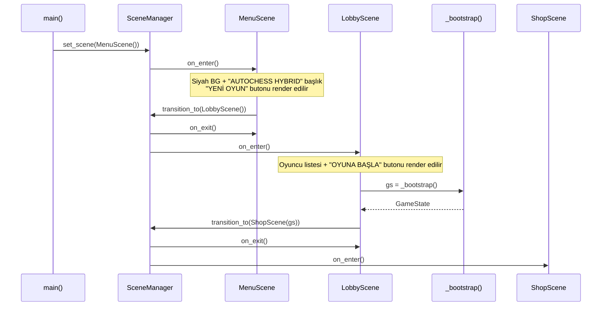

# Design Document: menu-lobby-flow

## Overview

`main()` → `MenuScene` → `LobbyScene` → `_bootstrap()` → `ShopScene` akışını uygular. Mevcut `_bootstrap()` fonksiyonu `v2/main.py`'de module-level olarak kalır; `main()` içinden çağrılmaz, `LobbyScene` tarafından lazy olarak import edilip çağrılır.

---

## Main Algorithm / Workflow



---

## Core Interfaces / Types

```pascal
(* v2/core/scene_manager.py — mevcut, değişmez *)
CLASS Scene
  PROCEDURE on_enter()
  PROCEDURE on_exit()
  PROCEDURE handle_event(event: pygame.Event)
  PROCEDURE update(dt_ms: float)
  PROCEDURE draw(surface: pygame.Surface)
END CLASS

CLASS SceneManager
  CLASS METHOD get() → SceneManager          (* singleton *)
  PROCEDURE set_scene(scene: Scene)          (* fade yok, ilk yükleme *)
  PROCEDURE transition_to(scene: Scene, fade_ms: int = 200)
END CLASS
```

```pascal
(* v2/scenes/menu.py — YENİ *)
CLASS MenuScene EXTENDS Scene
  FIELDS
    _font_title  : pygame.font.Font | None   (* lazy init *)
    _font_button : pygame.font.Font | None   (* lazy init *)
    _btn_rect    : pygame.Rect | None        (* lazy init *)
  END FIELDS

  PROCEDURE _init_fonts()
  PROCEDURE on_enter()
  PROCEDURE draw(surface: pygame.Surface)
  PROCEDURE handle_event(event: pygame.Event)
END CLASS
```

```pascal
(* v2/scenes/lobby.py — YENİDEN YAZILIR *)
CLASS LobbyScene EXTENDS Scene
  FIELDS
    _strategies   : list[str]                (* 7 AI stratejisi *)
    _human_name   : str                      (* "HUMAN" *)
    _font_title   : pygame.font.Font | None  (* lazy init *)
    _font_row     : pygame.font.Font | None  (* lazy init *)
    _font_button  : pygame.font.Font | None  (* lazy init *)
    _btn_rect     : pygame.Rect | None       (* lazy init *)
    _audio_loader : AssetLoader | None       (* mevcut audio temizliği korunur *)
  END FIELDS

  PROCEDURE _init_fonts()
  PROCEDURE on_enter()
  PROCEDURE on_exit()
  PROCEDURE draw(surface: pygame.Surface)
  PROCEDURE handle_event(event: pygame.Event)
END CLASS
```

---

## Key Functions with Formal Specifications

### `v2/main.py` — `_bootstrap()`

```pascal
FUNCTION _bootstrap() → GameState
```

**Preconditions:**
- `pygame.init()` çağrılmış olmalı (ekran başlatılmış)
- `v2/assets/` dizini erişilebilir olmalı
- `assets/data/cards.json` mevcut olmalı

**Postconditions:**
- `AssetLoader` singleton initialize edilmiş
- `CardDatabase` singleton initialize edilmiş
- `build_game(strategies=[...])` çağrılmış, `Game` nesnesi oluşturulmuş
- `GameState` nesnesi `game`'e hook edilmiş ve döndürülmüş
- `main()` içinden artık çağrılmaz; module-level fonksiyon olarak import edilebilir

**Loop Invariants:** Yok (döngü içermez)

---

### `v2/main.py` — `main()`

```pascal
PROCEDURE main()
```

**Preconditions:** Yok

**Postconditions:**
- `pygame.init()` çağrılmış
- `SceneManager` singleton oluşturulmuş
- İlk sahne `MenuScene()` olarak set edilmiş (`ShopScene` değil)
- `_bootstrap()` bu fonksiyon içinde çağrılmaz

**Değişiklik özeti:**
```pascal
(* SİLİNECEK SATIRLAR *)
gs = _bootstrap()
sm.set_scene(ShopScene(gs))

(* YENİ SATIRLAR *)
from v2.scenes.menu import MenuScene
sm.set_scene(MenuScene())
```

---

### `MenuScene._init_fonts()`

```pascal
PROCEDURE _init_fonts()
  (* Lazy init — pygame başladıktan sonra çağrılır *)
  IF self._font_title IS None THEN
    self._font_title  ← pygame.font.SysFont("Arial", 72)
    self._font_button ← pygame.font.SysFont("Arial", 36)
  END IF
END PROCEDURE
```

**Preconditions:** `pygame.init()` çağrılmış olmalı  
**Postconditions:** `_font_title` ve `_font_button` None değil

---

### `MenuScene.draw()`

```pascal
PROCEDURE draw(surface: pygame.Surface)
  self._init_fonts()

  (* Arka plan *)
  surface.fill(BLACK)                                    (* (0, 0, 0) *)

  (* Başlık: "AUTOCHESS HYBRID" — ekran ortası üst bölge *)
  title_surf ← self._font_title.render("AUTOCHESS HYBRID", True, WHITE)
  title_rect ← title_surf.get_rect(center=(W/2, H/3))
  surface.blit(title_surf, title_rect)

  (* Buton: "YENİ OYUN" — başlığın 120px altında *)
  btn_text_surf ← self._font_button.render("YENİ OYUN", True, BLACK)
  self._btn_rect ← pygame.Rect(W/2 - 120, H/3 + 120, 240, 60)
  pygame.draw.rect(surface, WHITE, self._btn_rect, border_radius=8)
  btn_text_rect ← btn_text_surf.get_rect(center=self._btn_rect.center)
  surface.blit(btn_text_surf, btn_text_rect)
END PROCEDURE
```

**Preconditions:** `surface` geçerli bir `pygame.Surface`  
**Postconditions:** `_btn_rect` set edilmiş; ekranda başlık ve buton görünür

---

### `MenuScene.handle_event()`

```pascal
PROCEDURE handle_event(event: pygame.Event)
  IF event.type = MOUSEBUTTONDOWN AND event.button = 1 THEN
    IF self._btn_rect IS NOT None AND self._btn_rect.collidepoint(event.pos) THEN
      from v2.scenes.lobby import LobbyScene
      SceneManager.get().transition_to(LobbyScene())
    END IF
  END IF
END PROCEDURE
```

**Preconditions:** `_btn_rect` en az bir kez `draw()` çağrısıyla set edilmiş olmalı  
**Postconditions:** Tıklama geçerliyse `SceneManager` fade geçişi başlatır

---

### `LobbyScene._init_fonts()`

```pascal
PROCEDURE _init_fonts()
  IF self._font_title IS None THEN
    self._font_title  ← pygame.font.SysFont("Arial", 48)
    self._font_row    ← pygame.font.SysFont("Arial", 28)
    self._font_button ← pygame.font.SysFont("Arial", 32)
  END IF
END PROCEDURE
```

**Preconditions:** `pygame.init()` çağrılmış  
**Postconditions:** Üç font nesnesi None değil

---

### `LobbyScene.draw()`

```pascal
PROCEDURE draw(surface: pygame.Surface)
  self._init_fonts()
  surface.fill(BLACK)

  (* Sol üst başlık *)
  title_surf ← self._font_title.render("LOBİ", True, WHITE)
  surface.blit(title_surf, (40, 30))

  (* 8 oyuncu satırı — her biri 160px yükseklikte *)
  FOR i FROM 0 TO 6 DO                                   (* AI satırları 1–7 *)
    label ← f"AI {i+1} — {self._strategies[i]}"
    row_surf ← self._font_row.render(label, True, GRAY)  (* (160, 160, 160) *)
    surface.blit(row_surf, (80, 120 + i * 60))
  END FOR

  (* Satır 8: İnsan oyuncu *)
  human_surf ← self._font_row.render(
    f"► SEN — {self._human_name}", True, CYAN)            (* (0, 255, 255) *)
  surface.blit(human_surf, (80, 120 + 7 * 60))

  (* Sağ alt "OYUNA BAŞLA" butonu *)
  self._btn_rect ← pygame.Rect(W - 280, H - 100, 240, 60)
  pygame.draw.rect(surface, WHITE, self._btn_rect, border_radius=8)
  btn_text ← self._font_button.render("OYUNA BAŞLA", True, BLACK)
  btn_rect_center ← btn_text.get_rect(center=self._btn_rect.center)
  surface.blit(btn_text, btn_rect_center)
END PROCEDURE
```

**Preconditions:** `surface` geçerli; `_strategies` 7 elemanlı liste  
**Postconditions:** 8 oyuncu satırı ve buton ekranda görünür; `_btn_rect` set edilmiş

---

### `LobbyScene.handle_event()`

```pascal
PROCEDURE handle_event(event: pygame.Event)
  IF event.type = MOUSEBUTTONDOWN AND event.button = 1 THEN
    IF self._btn_rect IS NOT None AND self._btn_rect.collidepoint(event.pos) THEN
      from v2.main import _bootstrap
      gs ← _bootstrap()
      from v2.scenes.shop import ShopScene
      SceneManager.get().transition_to(ShopScene(gs))
    END IF
  END IF
END PROCEDURE
```

**Preconditions:** `_btn_rect` set edilmiş; `_bootstrap()` import edilebilir  
**Postconditions:** `GameState` oluşturulmuş; `ShopScene` geçişi başlatılmış

**Loop Invariants:** Yok

---

### `LobbyScene.on_exit()`

```pascal
PROCEDURE on_exit()
  self._audio_loader ← None    (* mevcut davranış korunur *)
END PROCEDURE
```

**Postconditions:** `_audio_loader` referansı serbest bırakılmış (GC için)

---

## Algorithmic Pseudocode — Tam Akış

```pascal
ALGORITHM menu_lobby_flow
INPUT:  Kullanıcı pygame penceresi açar
OUTPUT: ShopScene aktif, GameState hazır

BEGIN
  (* main() *)
  pygame.init()
  screen ← pygame.display.set_mode((W, H))
  sm ← SceneManager.get()
  sm.set_scene(MenuScene())                  (* _bootstrap() ÇAĞRILMAZ *)

  LOOP WHILE running DO
    dt_ms ← clock.tick(60)

    FOR each event IN pygame.event.get() DO
      IF event = QUIT THEN running ← false
      ELSE sm.handle_event(event)
    END FOR

    sm.update(dt_ms)
    sm.draw(screen)
    pygame.display.flip()
  END LOOP

  (* MenuScene.handle_event() — "YENİ OYUN" tıklandığında *)
  sm.transition_to(LobbyScene())

  (* LobbyScene.handle_event() — "OYUNA BAŞLA" tıklandığında *)
  gs ← _bootstrap()                          (* lazy, burada çağrılır *)
  sm.transition_to(ShopScene(gs))

END
```

---

## Example Usage

```pascal
(* Senaryo 1: Normal akış *)
main()
  → MenuScene render edilir
  → Kullanıcı "YENİ OYUN" tıklar
  → LobbyScene render edilir (7 AI + 1 insan)
  → Kullanıcı "OYUNA BAŞLA" tıklar
  → _bootstrap() çağrılır → GameState oluşur
  → ShopScene(gs) aktif olur

(* Senaryo 2: _bootstrap() dışarıdan import *)
from v2.main import _bootstrap
gs = _bootstrap()                            (* test veya başka modülden *)
```

---

## Correctness Properties

*Bir property (özellik), sistemin tüm geçerli çalıştırmalarında doğru olması gereken bir karakteristik veya davranıştır - esasen, sistemin ne yapması gerektiği hakkında formal bir ifadedir. Property'ler, insan tarafından okunabilir spesifikasyonlar ile makine tarafından doğrulanabilir doğruluk garantileri arasında köprü görevi görür.*

### Property 1: draw() çağrısı buton rect'i initialize eder

*Herhangi bir* MenuScene veya LobbyScene için, draw() metodu çağrıldıktan sonra _btn_rect alanı None olmamalıdır.

**Doğrular: Gereksinim 2.4**

### Property 2: Buton içi tıklama sahne geçişi tetikler

*Herhangi bir* MenuScene veya LobbyScene için ve _btn_rect içindeki herhangi bir koordinat için, sol fare butonu (button=1) ile tıklama yapıldığında SceneManager.transition_to() tam bir kez çağrılmalıdır.

**Doğrular: Gereksinim 3.1, 5.1**

### Property 3: Buton dışı tıklama sahne geçişi tetiklemez

*Herhangi bir* MenuScene veya LobbyScene için ve _btn_rect dışındaki herhangi bir koordinat için, tıklama yapıldığında SceneManager.transition_to() çağrılmamalıdır.

**Doğrular: Gereksinim 3.2, 5.5**

### Property 4: Lazy font initialization

*Herhangi bir* Scene (MenuScene veya LobbyScene) için, constructor çağrısı sonrası tüm font alanları None olmalı ve draw() veya _init_fonts() çağrısı sonrası None olmamalıdır.

**Doğrular: Gereksinim 2.5, 4.7, 7.1, 7.2**

### Property 5: Font initialization idempotence

*Herhangi bir* Scene için, _init_fonts() metodu N kez çağrılsa da font nesneleri aynı kalmalıdır (tekrar oluşturulmamalıdır).

**Doğrular: Gereksinim 7.3**

### Property 6: AI oyuncu format doğruluğu

*Herhangi bir* strateji listesi için, LobbyScene.draw() tarafından render edilen AI oyuncu satırları "AI {numara} — {strateji}" formatında olmalıdır.

**Doğrular: Gereksinim 4.4**

### Property 7: İnsan oyuncu format doğruluğu

*Herhangi bir* oyuncu ismi için, LobbyScene.draw() tarafından render edilen insan oyuncu satırı "► SEN — {isim}" formatında olmalıdır.

**Doğrular: Gereksinim 4.5**

### Property 8: Güvenli buton tıklama işleme

*Herhangi bir* Scene için, _btn_rect None iken handle_event() çağrıldığında hiçbir exception fırlatılmamalı ve hiçbir sahne geçişi tetiklenmemelidir.

**Doğrular: Gereksinim 10.3, 11.1, 11.2, 11.3**

### Property 9: Sadece sol fare butonu yanıt verir

*Herhangi bir* Scene için ve herhangi bir buton türü (button != 1) için, buton rect içinde tıklama yapılsa bile sahne geçişi tetiklenmemelidir.

**Doğrular: Gereksinim 11.4**

### Property 10: LobbyScene kaynak temizliği

*Herhangi bir* LobbyScene için, on_exit() metodu çağrıldıktan sonra _audio_loader alanı None olmalıdır.

**Doğrular: Gereksinim 9.1**

---

## Error Handling

### Senaryo 1: `_bootstrap()` içinde AssetLoader hatası

**Koşul:** `v2/assets/` dizini eksik veya `cards.json` bozuk  
**Yanıt:** `AutochessException` fırlatılır, `LobbyScene.handle_event()` içinde yakalanmaz — üst katmana iletilir  
**Kurtarma:** Kullanıcı hata mesajı görür; oyun kapanır

### Senaryo 2: Font yüklenemez

**Koşul:** `pygame.font.SysFont("Arial", ...)` sistemde Arial bulamazsa fallback font döner  
**Yanıt:** pygame varsayılan font kullanılır; uygulama çalışmaya devam eder  
**Kurtarma:** Görsel bozulma olabilir, işlevsellik korunur

### Senaryo 3: `_btn_rect` None iken tıklama

**Koşul:** `handle_event()`, `draw()` çağrılmadan önce tetiklenirse  
**Yanıt:** `_btn_rect IS NOT None` guard'ı tıklamayı yoksayar  
**Kurtarma:** Sessiz başarısızlık; bir sonraki `draw()` sonrası buton çalışır

---

## Testing Strategy

### Unit Testing

- `MenuScene.draw()` çağrısı sonrası `_btn_rect` None değil
- `MenuScene.handle_event()` buton dışı tıklamada `transition_to` çağrılmaz
- `LobbyScene.draw()` 8 satır render eder (7 AI + 1 insan)
- `LobbyScene.on_exit()` sonrası `_audio_loader = None`
- `main()` içinde `_bootstrap()` çağrısı yok (AST analizi ile)

### Property-Based Testing

**Kütüphane:** `hypothesis`

- `∀ pos ∉ btn_rect.collidepoint` → `transition_to` çağrılmaz
- `∀ pos ∈ btn_rect.collidepoint` → `transition_to` tam bir kez çağrılır
- `draw()` N kez çağrılsa da `_btn_rect` aynı konumda kalır (idempotent)

### Integration Testing

- `main()` başlatıldığında `SceneManager.current_scene_name == "MenuScene"`
- "YENİ OYUN" simüle edildiğinde `current_scene_name == "LobbyScene"`
- "OYUNA BAŞLA" simüle edildiğinde `current_scene_name == "ShopScene"`

---

## Dependencies

| Modül | Kullanım |
|---|---|
| `pygame` | Render, event, font |
| `v2.core.scene_manager` | `Scene`, `SceneManager` |
| `v2.main._bootstrap` | `GameState` oluşturma (lazy import) |
| `v2.scenes.shop.ShopScene` | Son hedef sahne (lazy import) |
| `v2.assets.loader.AssetLoader` | Audio preload (LobbyScene, mevcut) |
| `engine_core.game_factory.build_game` | `strategies` parametresi destekleniyor ✓ |
