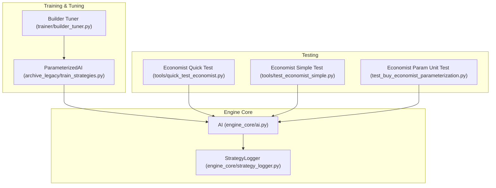
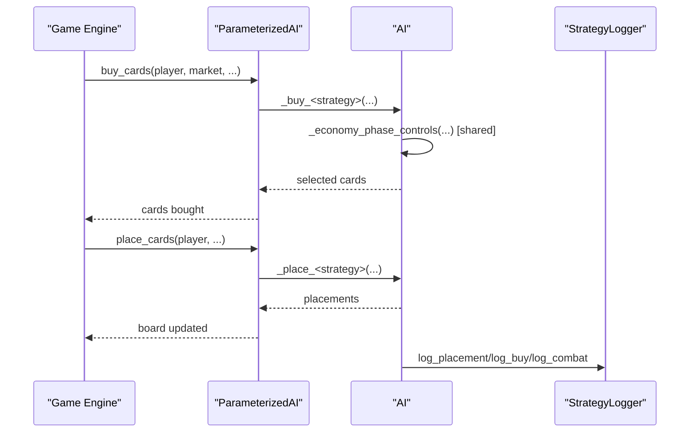
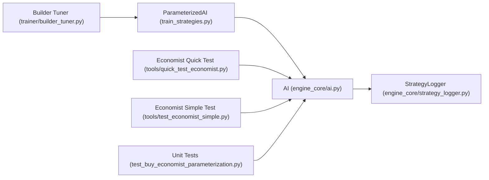
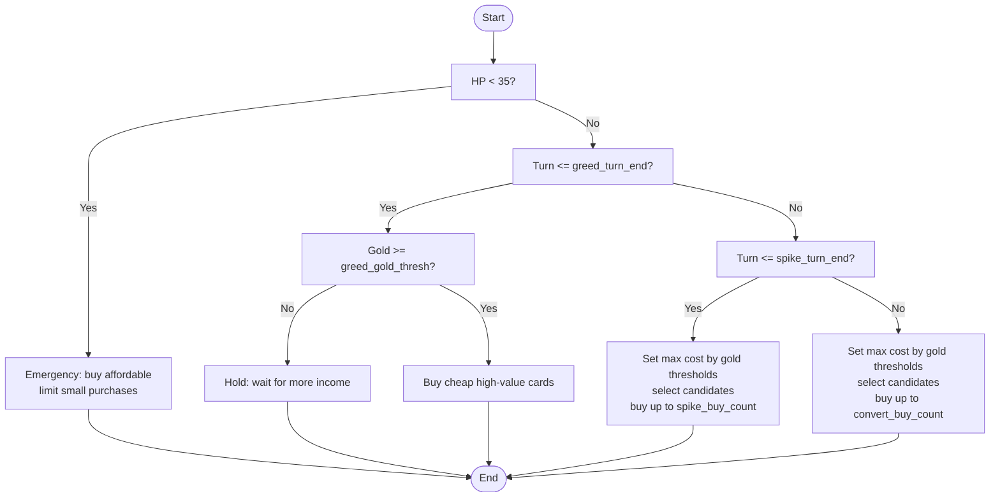
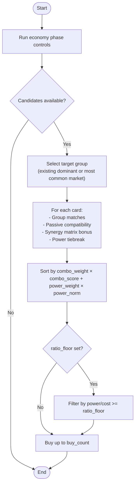
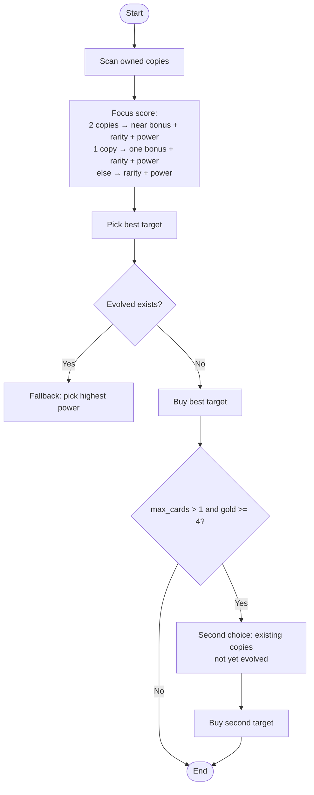
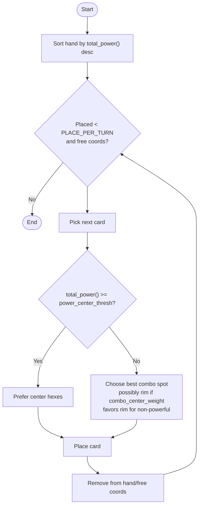

# AI Strategy Implementations

<cite>
**Referenced Files in This Document**
- [ai.py](file://engine_core/ai.py)
- [strategy_logger.py](file://engine_core/strategy_logger.py)
- [train_strategies.py](file://archive_legacy/train_strategies.py)
- [builder_tuner.py](file://trainer/builder_tuner.py)
- [quick_test_economist.py](file://tools/quick_test_economist.py)
- [test_economist_simple.py](file://tools/test_economist_simple.py)
- [test_buy_economist_parameterization.py](file://_archive/old_dirs/tests/unit/test_buy_economist_parameterization.py)
</cite>

## Table of Contents
1. [Introduction](#introduction)
2. [Project Structure](#project-structure)
3. [Core Components](#core-components)
4. [Architecture Overview](#architecture-overview)
5. [Detailed Component Analysis](#detailed-component-analysis)
6. [Dependency Analysis](#dependency-analysis)
7. [Performance Considerations](#performance-considerations)
8. [Troubleshooting Guide](#troubleshooting-guide)
9. [Conclusion](#conclusion)
10. [Appendices](#appendices)

## Introduction
This document explains the AI Strategy Implementations in detail, focusing on how each strategy decides what to buy and where to place cards. It covers:
- Economist’s three-phase economy system (GREED, SPIKE, CONVERT)
- Warrior’s power-focused card selection
- Builder’s combo-first approach with synergy matrix
- Evolver’s evolution prioritization
- Balancer’s group coverage optimization
- Rare Hunter’s high-rarity chasing mechanism
- Tempo’s aggressive positioning

It also documents parameter configuration, ranges, inheritance, performance characteristics, and practical tuning techniques. Examples are grounded in the actual codebase and include references to specific files and line ranges.

## Project Structure
The AI strategies live primarily in the engine core and are supported by training, tuning, and testing utilities:
- Strategy logic and parameter loading: engine_core/ai.py
- Parameterized AI training and genetic algorithm: archive_legacy/train_strategies.py
- Strategy analytics and logging: engine_core/strategy_logger.py
- Builder parameter sweep and tuning: trainer/builder_tuner.py
- Quick tests for Economist logic: tools/quick_test_economist.py and tools/test_economist_simple.py
- Unit tests for parameterization: _archive/old_dirs/tests/unit/test_buy_economist_parameterization.py

**Diagram sources**
- [ai.py:78-114](file://engine_core/ai.py#L78-L114)
- [strategy_logger.py:52-125](file://engine_core/strategy_logger.py#L52-L125)
- [train_strategies.py:74-117](file://archive_legacy/train_strategies.py#L74-L117)
- [builder_tuner.py:1-120](file://trainer/builder_tuner.py#L1-L120)
- [quick_test_economist.py:1-40](file://tools/quick_test_economist.py#L1-L40)
- [test_economist_simple.py:1-45](file://tools/test_economist_simple.py#L1-L45)
- [test_buy_economist_parameterization.py:1-48](file://_archive/old_dirs/tests/unit/test_buy_economist_parameterization.py#L1-L48)

**Section sources**
- [ai.py:78-114](file://engine_core/ai.py#L78-L114)
- [strategy_logger.py:52-125](file://engine_core/strategy_logger.py#L52-L125)
- [train_strategies.py:74-117](file://archive_legacy/train_strategies.py#L74-L117)
- [builder_tuner.py:1-120](file://trainer/builder_tuner.py#L1-L120)
- [quick_test_economist.py:1-40](file://tools/quick_test_economist.py#L1-L40)
- [test_economist_simple.py:1-45](file://tools/test_economist_simple.py#L1-L45)
- [test_buy_economist_parameterization.py:1-48](file://_archive/old_dirs/tests/unit/test_buy_economist_parameterization.py#L1-L48)

## Core Components
- ParameterizedAI: Provides strategy-specific parameter access and dispatches buying/placement decisions. It reads parameters from trained_params.json and supports dynamic weighting and thresholds.
- AI: Implements concrete strategies, including economy phase controls, card scoring, and placement heuristics. It integrates with StrategyLogger for analytics.
- StrategyLogger: Logs placement events, combat outcomes, buying actions, passive triggers, and KPIs for strategy analytics and training feedback.
- Trainer utilities: Define parameter spaces, defaults, and evolutionary tuning for strategies, including a dedicated builder tuner.

Key responsibilities:
- Parameter access and fallback resolution
- Phase-aware economy logic (Economist)
- Scoring functions for cards (Warrior, Builder, Evolver, Balancer, Rare Hunter)
- Placement heuristics (smart default, combo-optimized, aggressive)
- Logging and reporting for performance analysis

**Section sources**
- [ai.py:214-233](file://engine_core/ai.py#L214-L233)
- [ai.py:350-380](file://engine_core/ai.py#L350-L380)
- [ai.py:688-700](file://engine_core/ai.py#L688-L700)
- [strategy_logger.py:52-125](file://engine_core/strategy_logger.py#L52-L125)
- [train_strategies.py:74-117](file://archive_legacy/train_strategies.py#L74-L117)

## Architecture Overview
The AI system separates strategy logic from parameterization and training:
- ParameterizedAI encapsulates strategy parameters and dispatches to AI methods.
- AI implements strategy-specific algorithms and uses shared helpers (economy phase controls).
- StrategyLogger captures runtime behavior for analytics and KPI aggregation.
- Trainer utilities define parameter ranges and evolve parameters via genetic algorithms.

**Diagram sources**
- [train_strategies.py:84-117](file://archive_legacy/train_strategies.py#L84-L117)
- [ai.py:350-380](file://engine_core/ai.py#L350-L380)
- [ai.py:688-700](file://engine_core/ai.py#L688-L700)
- [strategy_logger.py:140-183](file://engine_core/strategy_logger.py#L140-L183)

**Section sources**
- [train_strategies.py:84-117](file://archive_legacy/train_strategies.py#L84-L117)
- [ai.py:350-380](file://engine_core/ai.py#L350-L380)
- [ai.py:688-700](file://engine_core/ai.py#L688-L700)
- [strategy_logger.py:140-183](file://engine_core/strategy_logger.py#L140-L183)

## Detailed Component Analysis

### Economist Strategy: Three-Phase Economy
Behavioral pattern:
- Emergency: when health is low, prioritize affordable cards and small purchases.
- GREED: early turns hoard gold, only buy cheap cards when thresholds are met.
- SPIKE: mid-game builds power with increasing rarity budgets and controlled purchase counts.
- CONVERT: late-game hard spend on legendaries and higher rarities.

Decision logic highlights:
- Uses shared economy phase controls with parameters for turn/end thresholds, gold thresholds, and buy counts.
- Applies ratio floors and candidate filtering during spikes and converts.
- Falls back to hardcoded defaults when ai_instance is None (backward compatibility).

Concrete examples from code:
- Economy phase controls and thresholds: [ai.py:235-348](file://engine_core/ai.py#L235-L348)
- GREED/SPIKE/CONVERT branches and candidate selection: [ai.py:576-616](file://engine_core/ai.py#L576-L616)
- Parameter fallback helper: [ai.py:216-233](file://engine_core/ai.py#L216-L233)
- Legacy parameterization unit tests: [test_buy_economist_parameterization.py:22-48](file://_archive/old_dirs/tests/unit/test_buy_economist_parameterization.py#L22-L48)
- Quick tests validating phase logic: [quick_test_economist.py:32-63](file://tools/quick_test_economist.py#L32-L63), [test_economist_simple.py:22-54](file://tools/test_economist_simple.py#L22-L54)

Parameters and ranges:
- greed_turn_end: integer threshold for ending greed phase
- greed_gold_thresh: minimum gold to activate greed purchases
- spike_turn_end: integer threshold for ending spike phase
- spike_r4_thresh: gold threshold to consider rarity-4
- thresh_high: gold threshold to consider rarity-3
- buy_2_thresh: gold threshold to consider rarity-2
- spike_buy_count: number of cards to buy during spike
- convert_r5_thresh: gold threshold to consider rarity-5
- convert_buy_count: number of cards to buy during convert

Performance characteristics:
- Zero-cost fallback when ai_instance is None
- Ratio floor filtering reduces low-signal purchases during spikes
- Candidate pruning based on turn and gold thresholds

Relationships and inheritance:
- Builder reuses economist’s economy phase controls and parameters for consistent spending behavior.

**Section sources**
- [ai.py:235-348](file://engine_core/ai.py#L235-L348)
- [ai.py:576-616](file://engine_core/ai.py#L576-L616)
- [ai.py:216-233](file://engine_core/ai.py#L216-L233)
- [test_buy_economist_parameterization.py:22-48](file://_archive/old_dirs/tests/unit/test_buy_economist_parameterization.py#L22-L48)
- [quick_test_economist.py:32-63](file://tools/quick_test_economist.py#L32-L63)
- [test_economist_simple.py:22-54](file://tools/test_economist_simple.py#L22-L54)

### Warrior Strategy: Power-Focused Card Selection
Behavioral pattern:
- Prioritizes cards by total power, optionally weighted by rarity.
- Uses power_weight and rarity_weight parameters from ai_instance.

Decision logic highlights:
- Sorts affordable cards by power-weighted score.
- Respects max_cards and gold constraints.

Concrete examples from code:
- Power/rarity scoring and selection: [ai.py:394-413](file://engine_core/ai.py#L394-L413)
- Parameter access via get_param: [ai.py:402-404](file://engine_core/ai.py#L402-L404)
- ParameterizedAI legacy implementation: [train_strategies.py:126-136](file://archive_legacy/train_strategies.py#L126-L136)

Parameters and ranges:
- power_weight: float weight for total_power()
- rarity_weight: float weight for card rarity

Performance characteristics:
- Linear-time sorting over affordable cards
- Minimal branching; deterministic under fixed RNG

**Section sources**
- [ai.py:394-413](file://engine_core/ai.py#L394-L413)
- [ai.py:402-404](file://engine_core/ai.py#L402-L404)
- [train_strategies.py:126-136](file://archive_legacy/train_strategies.py#L126-L136)

### Builder Strategy: Combo-First with Synergy Matrix
Behavioral pattern:
- Reuses economist’s economy phases for consistent spending.
- Scores cards by combo potential (group matches, passive compatibility, synergy matrix), with optional power tiebreak.
- Builds toward a target dominant group inferred from board or market.

Decision logic highlights:
- Target group selection from existing dominant groups or most common market group.
- Synergy matrix augments combo score with learned pairwise bonuses.
- Ratio floor filtering applied post-scoring.

Concrete examples from code:
- Economy reuse and candidate filtering: [ai.py:439-445](file://engine_core/ai.py#L439-L445)
- Group match, passive compatibility, synergy matrix scoring: [ai.py:482-504](file://engine_core/ai.py#L482-L504)
- Target group inference: [ai.py:459-474](file://engine_core/ai.py#L459-L474)
- Synergy matrix class and updates: [ai.py:135-208](file://engine_core/ai.py#L135-L208)
- Builder tuner grid sweep and fitness: [builder_tuner.py:72-77](file://trainer/builder_tuner.py#L72-L77), [builder_tuner.py:173-204](file://trainer/builder_tuner.py#L173-L204)

Parameters and ranges:
- combo_weight: float weight for combo score
- power_weight: float power tiebreak weight
- greed_turn_end, greed_gold_thresh, spike_buy_count, convert_buy_count: inherited from economist

Performance characteristics:
- Scoring complexity proportional to cards × board neighbors
- Optional synergy matrix adds O(N^2) memory footprint per session
- Ratio floor reduces noise during spikes

**Section sources**
- [ai.py:439-520](file://engine_core/ai.py#L439-L520)
- [ai.py:135-208](file://engine_core/ai.py#L135-L208)
- [builder_tuner.py:72-77](file://trainer/builder_tuner.py#L72-L77)
- [builder_tuner.py:173-204](file://trainer/builder_tuner.py#L173-L204)

### Evolver Strategy: Evolution Prioritization
Behavioral pattern:
- Focuses on cards close to evolving (2 copies = “near”, 1 copy = “one”).
- Chooses highest-priority targets first; second purchase considers existing copies.
- Falls back to power-only selection if no evolution targets remain.

Decision logic highlights:
- Prioritization: near-evolution > one-copy > new cards (by rarity).
- Rarity weighting and power tiebreak configurable.

Concrete examples from code:
- Focus scoring and selection: [ai.py:548-564](file://engine_core/ai.py#L548-L564)
- Second-purchase logic: [ai.py:566-573](file://engine_core/ai.py#L566-L573)
- ParameterizedAI legacy scoring: [train_strategies.py:199-218](file://archive_legacy/train_strategies.py#L199-L218)

Parameters and ranges:
- evo_near_bonus: bonus for two-copy targets
- evo_one_bonus: bonus for one-copy targets
- rarity_weight_mult: multiplier for rarity contribution
- power_weight: power tiebreak weight

Performance characteristics:
- Single-pass selection with minimal overhead
- Adaptive to evolving state

**Section sources**
- [ai.py:548-573](file://engine_core/ai.py#L548-L573)
- [train_strategies.py:199-218](file://archive_legacy/train_strategies.py#L199-L218)

### Balancer Strategy: Group Coverage Optimization
Behavioral pattern:
- Balances power with group diversity.
- Awards bonus for groups below a configured threshold.

Decision logic highlights:
- Counts existing dominant groups on board.
- Scores cards by power plus group bonus if below threshold.

Concrete examples from code:
- Group counting and scoring: [ai.py:630-636](file://engine_core/ai.py#L630-L636)
- ParameterizedAI legacy scoring: [train_strategies.py:323-337](file://archive_legacy/train_strategies.py#L323-L337)

Parameters and ranges:
- group_bonus: bonus amount for under-represented groups
- group_thresh: threshold for “under-represented”
- power_weight: power tiebreak weight

Performance characteristics:
- O(B) scan over board cards for group counts
- Deterministic under fixed RNG

**Section sources**
- [ai.py:630-643](file://engine_core/ai.py#L630-L643)
- [train_strategies.py:323-337](file://archive_legacy/train_strategies.py#L323-L337)

### Rare Hunter Strategy: High-Rarity Chasing
Behavioral pattern:
- Prefers 5-star cards when affordable.
- Otherwise prefers 4-star cards.
- Falls back to a parameterized rarity when below thresholds.

Decision logic highlights:
- Tries 5-star first, then 4-star, then fallback rarity.
- Rounds fallback rarity to integer bounds.

Concrete examples from code:
- Rarity preference and fallback: [ai.py:661-685](file://engine_core/ai.py#L661-L685)
- ParameterizedAI legacy fallback: [train_strategies.py:339-360](file://archive_legacy/train_strategies.py#L339-L360)

Parameters and ranges:
- fallback_rarity: integer rarity floor (clamped to 1–4)

Performance characteristics:
- Early exits reduce unnecessary scans
- Prevents stalls in early turns

**Section sources**
- [ai.py:661-685](file://engine_core/ai.py#L661-L685)
- [train_strategies.py:339-360](file://archive_legacy/train_strategies.py#L339-L360)

### Tempo Strategy: Aggressive Positioning
Behavioral pattern:
- Aggressively places powerful cards in center positions.
- Uses power_center_thresh to decide when a card qualifies as “powerful.”
- Uses combo_center_weight to bias rim vs center placement for less powerful cards.

Decision logic highlights:
- Powerful cards (≥ threshold) prefer center hexes.
- Less powerful cards choose best combo spot, potentially preferring rim if combo is weak and combo_center_weight is high.

Concrete examples from code:
- Aggressive placement logic: [ai.py:394-446](file://engine_core/ai.py#L394-L446)
- ParameterizedAI legacy placement: [train_strategies.py:394-446](file://archive_legacy/train_strategies.py#L394-L446)

Parameters and ranges:
- power_center_thresh: power threshold for center preference
- combo_center_weight: weight to favor rim placement for non-powerful cards

Performance characteristics:
- Greedy placement over free coordinates
- Heuristic favors central control and combo synergy

**Section sources**
- [ai.py:394-446](file://engine_core/ai.py#L394-L446)
- [train_strategies.py:394-446](file://archive_legacy/train_strategies.py#L394-L446)

### Placement Strategies
Default smart placement:
- Computes combo score per coordinate and selects best.
- Applies slight center bias for powerful cards (warrior/rare_hunter).
- Random strategy mixes deterministic combo placement with random coordinate selection.

Aggressive placement (Tempo):
- See Tempo section above.

Combo-optimized placement (Builder):
- Computes edge-group matches across neighbors and maximizes combo score.

Concrete examples from code:
- Smart default placement: [ai.py:702-798](file://engine_core/ai.py#L702-L798)
- Aggressive placement: [ai.py:394-446](file://engine_core/ai.py#L394-L446)
- Combo-optimized placement: [train_strategies.py:364-393](file://archive_legacy/train_strategies.py#L364-L393)

**Section sources**
- [ai.py:702-798](file://engine_core/ai.py#L702-L798)
- [ai.py:394-446](file://engine_core/ai.py#L394-L446)
- [train_strategies.py:364-393](file://archive_legacy/train_strategies.py#L364-L393)

## Dependency Analysis
Key dependencies and relationships:
- AI._economy_phase_controls is reused by both Economist and Builder, ensuring consistent spending behavior across strategies.
- ParameterizedAI provides unified parameter access and dispatch to strategy methods.
- StrategyLogger is integrated across placement and buying to capture KPIs for training and analysis.
- Trainer utilities define parameter spaces and evolve parameters via genetic algorithms.

**Diagram sources**
- [train_strategies.py:84-117](file://archive_legacy/train_strategies.py#L84-L117)
- [ai.py:350-380](file://engine_core/ai.py#L350-L380)
- [strategy_logger.py:140-183](file://engine_core/strategy_logger.py#L140-L183)
- [builder_tuner.py:1-120](file://trainer/builder_tuner.py#L1-L120)
- [quick_test_economist.py:1-40](file://tools/quick_test_economist.py#L1-L40)
- [test_economist_simple.py:1-45](file://tools/test_economist_simple.py#L1-L45)
- [test_buy_economist_parameterization.py:1-48](file://_archive/old_dirs/tests/unit/test_buy_economist_parameterization.py#L1-L48)

**Section sources**
- [train_strategies.py:84-117](file://archive_legacy/train_strategies.py#L84-L117)
- [ai.py:350-380](file://engine_core/ai.py#L350-L380)
- [strategy_logger.py:140-183](file://engine_core/strategy_logger.py#L140-L183)
- [builder_tuner.py:1-120](file://trainer/builder_tuner.py#L1-L120)
- [quick_test_economist.py:1-40](file://tools/quick_test_economist.py#L1-L40)
- [test_economist_simple.py:1-45](file://tools/test_economist_simple.py#L1-L45)
- [test_buy_economist_parameterization.py:1-48](file://_archive/old_dirs/tests/unit/test_buy_economist_parameterization.py#L1-L48)

## Performance Considerations
- Parameter access cost: load_all_strategy_params reads trained_params.json once at initialization; subsequent access is zero-cost dictionary lookup.
- Economy phase controls: O(M) scan over market; minimal branching logic.
- Card scoring: O(C log C) for sorting, where C is number of affordable cards; Builder adds neighbor scanning per card.
- Placement: O(F × C) over free coordinates F and hand size C; Tempo/Builder use greedy selection.
- Logging overhead: StrategyLogger buffers and flushes periodically; can be disabled for performance-sensitive runs.

[No sources needed since this section provides general guidance]

## Troubleshooting Guide
Common issues and remedies:
- Missing trained_params.json: load_all_strategy_params returns empty dict; strategies fall back to defaults. Ensure the file exists and is valid JSON.
- Parameter ranges: If tuned parameters are outside expected ranges, clamp them using parameter spaces defined in the trainer.
- Economy phase stalls: Verify thresholds (e.g., greed_gold_thresh, spike_r4_thresh) are not too high for early turns.
- Builder synergy matrix: If combo performance degrades, decay the matrix or reset it between sessions.
- Placement randomness: For reproducibility, seed the RNG passed to placement routines.

Relevant code references:
- Parameter loading and fallback: [ai.py:78-114](file://engine_core/ai.py#L78-L114)
- Economy phase controls: [ai.py:235-348](file://engine_core/ai.py#L235-L348)
- Placement routines: [ai.py:702-798](file://engine_core/ai.py#L702-L798)
- StrategyLogger flushing and summaries: [strategy_logger.py:343-354](file://engine_core/strategy_logger.py#L343-L354)

**Section sources**
- [ai.py:78-114](file://engine_core/ai.py#L78-L114)
- [ai.py:235-348](file://engine_core/ai.py#L235-L348)
- [ai.py:702-798](file://engine_core/ai.py#L702-L798)
- [strategy_logger.py:343-354](file://engine_core/strategy_logger.py#L343-L354)

## Conclusion
The AI Strategy Implementations combine robust parameterization, phase-aware economy logic, and strategy-specific scoring/placement heuristics. The system supports both immediate tuning via trained_params.json and long-term evolution via genetic algorithms. By understanding each strategy’s decision tree, parameters, and performance trade-offs, developers can effectively customize and optimize behavior for diverse playstyles.

[No sources needed since this section summarizes without analyzing specific files]

## Appendices

### Strategy Parameter Reference
- Economist: greed_turn_end, greed_gold_thresh, spike_turn_end, spike_r4_thresh, thresh_high, buy_2_thresh, spike_buy_count, convert_r5_thresh, convert_buy_count
- Warrior: power_weight, rarity_weight
- Builder: combo_weight, power_weight, inherited economist thresholds
- Evolver: evo_near_bonus, evo_one_bonus, rarity_weight_mult, power_weight
- Balancer: group_bonus, group_thresh, power_weight
- Rare Hunter: fallback_rarity
- Tempo: power_center_thresh, combo_center_weight

**Section sources**
- [ai.py:9-61](file://engine_core/ai.py#L9-L61)
- [train_strategies.py:453-487](file://archive_legacy/train_strategies.py#L453-L487)

### Decision Tree Diagrams

#### Economist Phase Controls

**Diagram sources**
- [ai.py:235-348](file://engine_core/ai.py#L235-L348)

#### Builder Card Scoring

**Diagram sources**
- [ai.py:439-520](file://engine_core/ai.py#L439-L520)
- [ai.py:135-208](file://engine_core/ai.py#L135-L208)

#### Evolver Evolution Prioritization

**Diagram sources**
- [ai.py:548-573](file://engine_core/ai.py#L548-L573)

#### Tempo Aggressive Placement

**Diagram sources**
- [ai.py:394-446](file://engine_core/ai.py#L394-L446)