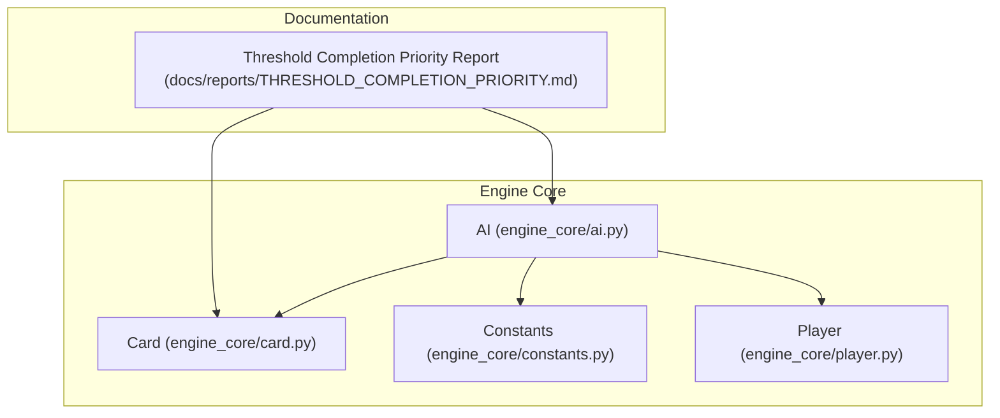
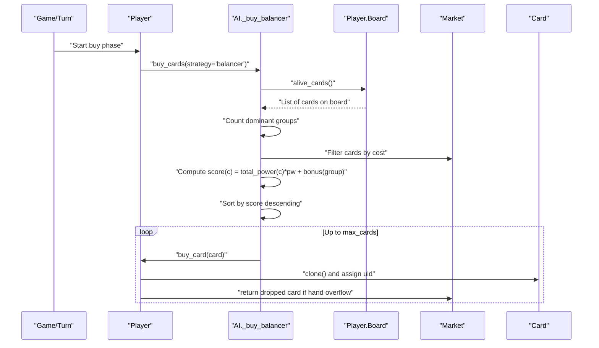
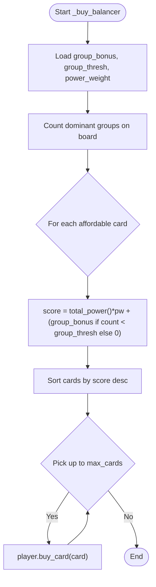
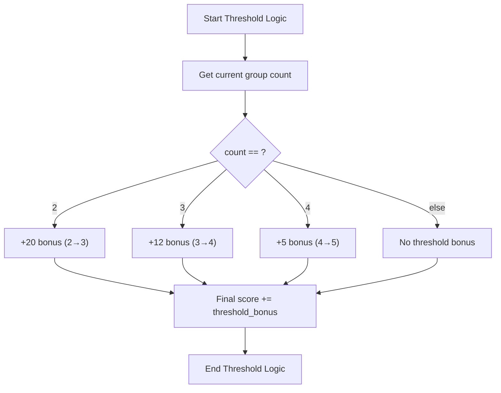
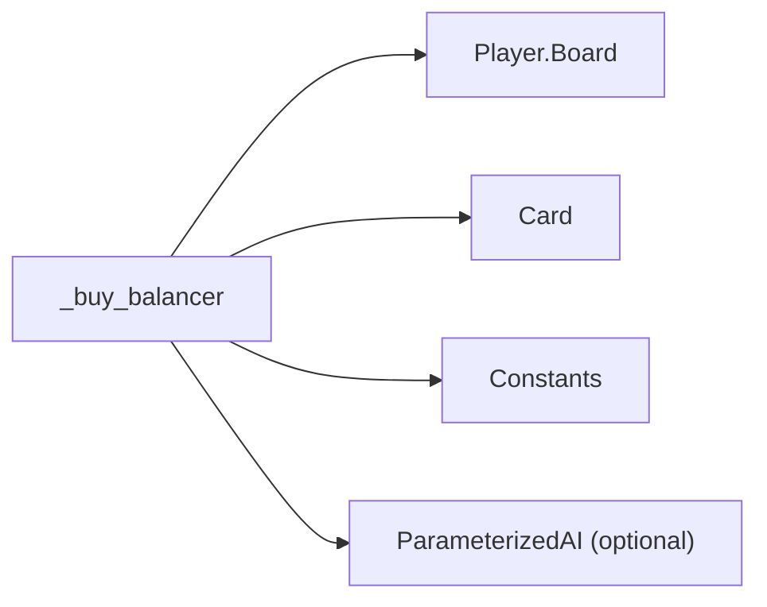

# Balancer Strategy

<cite>
**Referenced Files in This Document**
- [engine_core/ai.py](file://engine_core/ai.py)
- [engine_core/card.py](file://engine_core/card.py)
- [engine_core/constants.py](file://engine_core/constants.py)
- [engine_core/player.py](file://engine_core/player.py)
- [docs/reports/THRESHOLD_COMPLETION_PRIORITY.md](file://docs/reports/THRESHOLD_COMPLETION_PRIORITY.md)
</cite>

## Table of Contents
1. [Introduction](#introduction)
2. [Project Structure](#project-structure)
3. [Core Components](#core-components)
4. [Architecture Overview](#architecture-overview)
5. [Detailed Component Analysis](#detailed-component-analysis)
6. [Dependency Analysis](#dependency-analysis)
7. [Performance Considerations](#performance-considerations)
8. [Troubleshooting Guide](#troubleshooting-guide)
9. [Conclusion](#conclusion)

## Introduction
This document explains the Balancer Strategy implementation that dual-objectively optimizes two goals:
- Power maximization: prefer cards with high total power.
- Group coverage diversity: avoid mono-group compositions by rewarding cards that introduce or deepen underrepresented groups.

The strategy combines:
- A power-weighted score based on total_power().
- A group bonus controlled by group_bonus and group_thresh parameters.
- Threshold completion priority to accelerate synergy and passive activation when close to key thresholds (2→3, 3→4, 4→5).

It also documents how the strategy identifies missing groups on the board, applies group bonuses, and maintains power efficiency. Finally, it provides tuning scenarios to balance power and diversity objectives.

## Project Structure
The Balancer Strategy lives in the AI module and interacts with the Card model, constants, and Player state. The Threshold Completion Priority report augments the scoring logic with threshold-aware incentives.

**Diagram sources**
- [engine_core/ai.py](file://engine_core/ai.py)
- [engine_core/card.py](file://engine_core/card.py)
- [engine_core/constants.py](file://engine_core/constants.py)
- [engine_core/player.py](file://engine_core/player.py)
- [docs/reports/THRESHOLD_COMPLETION_PRIORITY.md](file://docs/reports/THRESHOLD_COMPLETION_PRIORITY.md)

**Section sources**
- [engine_core/ai.py](file://engine_core/ai.py)
- [engine_core/card.py](file://engine_core/card.py)
- [engine_core/constants.py](file://engine_core/constants.py)
- [engine_core/player.py](file://engine_core/player.py)
- [docs/reports/THRESHOLD_COMPLETION_PRIORITY.md](file://docs/reports/THRESHOLD_COMPLETION_PRIORITY.md)

## Core Components
- Balancer buy function: Implements dual-objective scoring using total_power(), group_bonus, and group_thresh. It builds a group histogram from the board, computes a per-card score, sorts affordable cards, and purchases up to max_cards.
- Card model: Provides total_power() and dominant_group() used by the strategy.
- Constants: Supplies CARD_COSTS for affordability filtering and group mappings.
- Player: Supplies the market and current gold; the strategy filters by cost and buys cards.

Key parameters:
- group_bonus: Fixed bonus applied when a card’s dominant group count is below group_thresh.
- group_thresh: Threshold count that triggers the group_bonus.
- power_weight: Weight applied to total_power() in the score.

Optional threshold completion priority (from the report):
- Additional incentives when the current group count is 2, 3, or 4, encouraging threshold completion for synergy and passive activation.

**Section sources**
- [engine_core/ai.py](file://engine_core/ai.py)
- [engine_core/card.py](file://engine_core/card.py)
- [engine_core/constants.py](file://engine_core/constants.py)
- [engine_core/player.py](file://engine_core/player.py)
- [docs/reports/THRESHOLD_COMPLETION_PRIORITY.md](file://docs/reports/THRESHOLD_COMPLETION_PRIORITY.md)

## Architecture Overview
The Balancer Strategy sits inside the AI module’s buy_cards dispatcher. It reads parameters from an optional ParameterizedAI instance, inspects the board to compute group counts, and selects cards from the market.

**Diagram sources**
- [engine_core/ai.py](file://engine_core/ai.py)
- [engine_core/player.py](file://engine_core/player.py)

## Detailed Component Analysis

### Balancer Scoring Function
The Balancer scoring function computes a per-card score combining:
- Base power: total_power() scaled by power_weight.
- Group bonus: group_bonus if the card’s dominant group count is below group_thresh.
- Optional threshold completion bonus: extra incentives when the current group count is 2, 3, or 4 (see Threshold Completion Priority report).

**Diagram sources**
- [engine_core/ai.py](file://engine_core/ai.py)
- [engine_core/card.py](file://engine_core/card.py)
- [engine_core/constants.py](file://engine_core/constants.py)

**Section sources**
- [engine_core/ai.py](file://engine_core/ai.py)

### Card Model Integration
- total_power(): Sum of all card stats; used as the core power signal.
- dominant_group(): Determines the group with the most contributing stats; used to compute group counts and bonuses.

These methods enable the strategy to:
- Rank cards by raw power.
- Detect underrepresented groups and apply bonuses accordingly.
- Optionally add threshold completion incentives.

**Section sources**
- [engine_core/card.py](file://engine_core/card.py)

### Threshold Completion Priority (Optional Enhancement)
The Threshold Completion Priority report augments the Balancer scoring with explicit incentives to complete synergy thresholds:
- 2 → 3: Strong jump in synergy; +20 bonus.
- 3 → 4: Secondary threshold; +12 bonus.
- 4 → 5: Diminishing returns; +5 bonus.

This encourages timely threshold completion to activate passives and boost synergy.

**Diagram sources**
- [docs/reports/THRESHOLD_COMPLETION_PRIORITY.md](file://docs/reports/THRESHOLD_COMPLETION_PRIORITY.md)

**Section sources**
- [docs/reports/THRESHOLD_COMPLETION_PRIORITY.md](file://docs/reports/THRESHOLD_COMPLETION_PRIORITY.md)

### Concrete Examples

#### Example 1: Group Coverage Assessment and Bonus Application
- Board groups: 2 Mythology, 1 Science, 1 MIND.
- Market: Poseidon (Mythology, 40 power), Tesla (Science, 42 power).
- Parameters: group_bonus = 5, group_thresh = 3, power_weight = 1.
- Group counts: Poseidon’s group (Mythology) count = 2.
- Poseidon bonus: 5 because 2 < 3.
- Tesla bonus: 0 because Science already exists on board.
- Scores: Poseidon = 40*1 + 5 = 45; Tesla = 42*1 + 0 = 42.
- Selection: Buy Poseidon.

Outcome: Introduces diversity by targeting an underrepresented group.

**Section sources**
- [engine_core/ai.py](file://engine_core/ai.py)
- [engine_core/card.py](file://engine_core/card.py)

#### Example 2: Threshold Completion Priority
- Board groups: 2 Mythology, 1 Science, 1 MIND.
- Market: Poseidon (Mythology, 40 power), Tesla (Science, 42 power).
- With threshold logic: Poseidon’s group count = 2; add +20.
- Scores: Poseidon = 40 + 0 + 20 = 60; Tesla = 42 + 5 + 0 = 47.
- Selection: Buy Poseidon to complete threshold and activate synergies/passives.

Outcome: Prioritizes threshold completion when close.

**Section sources**
- [docs/reports/THRESHOLD_COMPLETION_PRIORITY.md](file://docs/reports/THRESHOLD_COMPLETION_PRIORITY.md)

#### Example 3: Deep Investment (3 → 4)
- Board groups: 3 Science, 1 Mythology.
- Market: Marie Curie (Science, 35 power), Zeus (Mythology, 40 power).
- With threshold logic: Science count = 3; add +12.
- Scores: Marie Curie = 35 + 0 + 12 = 47; Zeus = 40 + 5 + 0 = 45.
- Selection: Buy Marie Curie to deepen the group.

Outcome: Encourages deeper investment in a strong group when appropriate.

**Section sources**
- [docs/reports/THRESHOLD_COMPLETION_PRIORITY.md](file://docs/reports/THRESHOLD_COMPLETION_PRIORITY.md)

#### Example 4: Diminishing Returns (4 → 5)
- Board groups: 4 Science, 1 Mythology.
- Market: Darwin (Science, 33 power), Zeus (Mythology, 40 power).
- With threshold logic: Science count = 4; add +5.
- Scores: Darwin = 33 + 0 + 5 = 38; Zeus = 40 + 5 + 0 = 45.
- Selection: Buy Zeus (power dominates small threshold bonus).

Outcome: Prevents over-investment by balancing power and threshold incentives.

**Section sources**
- [docs/reports/THRESHOLD_COMPLETION_PRIORITY.md](file://docs/reports/THRESHOLD_COMPLETION_PRIORITY.md)

### Card Selection Process
- Filter market by cost using CARD_COSTS.
- Compute score per card using total_power(), group_bonus, and group_thresh.
- Sort descending and purchase up to max_cards.

Optional threshold completion logic adds extra incentives when the current group count is 2, 3, or 4.

**Section sources**
- [engine_core/ai.py](file://engine_core/ai.py)
- [engine_core/constants.py](file://engine_core/constants.py)
- [docs/reports/THRESHOLD_COMPLETION_PRIORITY.md](file://docs/reports/THRESHOLD_COMPLETION_PRIORITY.md)

## Dependency Analysis
- AI._buy_balancer depends on:
  - Player.board.alive_cards() for group counts.
  - Card.dominant_group() and Card.total_power() for scoring.
  - Constants.CARD_COSTS for affordability filtering.
  - Optional ParameterizedAI for parameter access (group_bonus, group_thresh, power_weight).

**Diagram sources**
- [engine_core/ai.py](file://engine_core/ai.py)
- [engine_core/player.py](file://engine_core/player.py)
- [engine_core/card.py](file://engine_core/card.py)
- [engine_core/constants.py](file://engine_core/constants.py)

**Section sources**
- [engine_core/ai.py](file://engine_core/ai.py)
- [engine_core/player.py](file://engine_core/player.py)
- [engine_core/card.py](file://engine_core/card.py)
- [engine_core/constants.py](file://engine_core/constants.py)

## Performance Considerations
- Scoring complexity: O(B + M log M), where B is number of board cards (for group counting) and M is number of affordable market cards (sorting).
- Memory: Group histogram uses O(G) space, where G is number of distinct groups.
- Tuning: Keep group_thresh moderate to avoid excessive mono-group bias; adjust group_bonus to balance diversity without overriding power.

[No sources needed since this section provides general guidance]

## Troubleshooting Guide
Common issues and checks:
- No cards purchased:
  - Verify market affordability using CARD_COSTS and player gold.
  - Confirm group_thresh is not too high for the current board.
- Unexpected group bias:
  - Lower group_bonus or increase group_thresh to reduce diversity pressure.
  - Ensure dominant_group() reflects intended grouping by checking STAT_TO_GROUP mappings.
- Threshold logic not triggering:
  - Confirm the optional threshold completion logic is enabled in the strategy.
  - Validate that current group counts are correctly computed before applying bonuses.

**Section sources**
- [engine_core/ai.py](file://engine_core/ai.py)
- [engine_core/constants.py](file://engine_core/constants.py)
- [engine_core/card.py](file://engine_core/card.py)
- [docs/reports/THRESHOLD_COMPLETION_PRIORITY.md](file://docs/reports/THRESHOLD_COMPLETION_PRIORITY.md)

## Conclusion
The Balancer Strategy achieves dual-objective optimization by blending power maximization with group coverage diversity. Its scoring function uses total_power(), group_bonus, and group_thresh to steer selections toward varied, efficient compositions. Optional threshold completion logic further improves synergy activation and passive utilization by incentivizing near-threshold picks. Tuning group_bonus and group_thresh allows iterative optimization to balance power and diversity across different meta conditions.