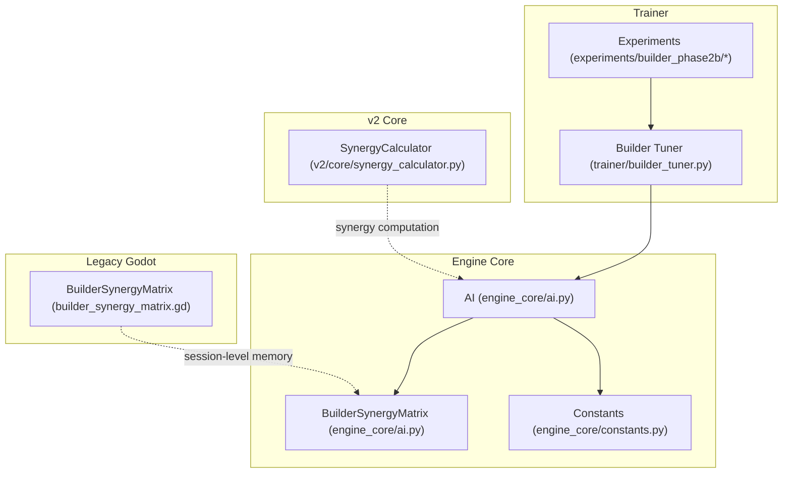
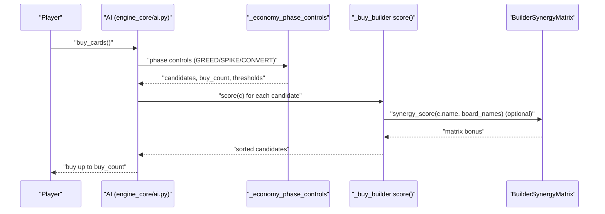
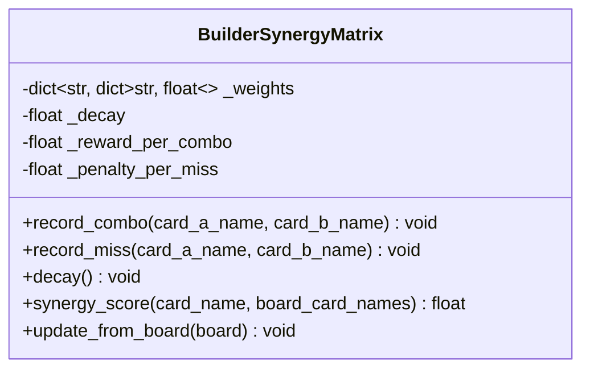
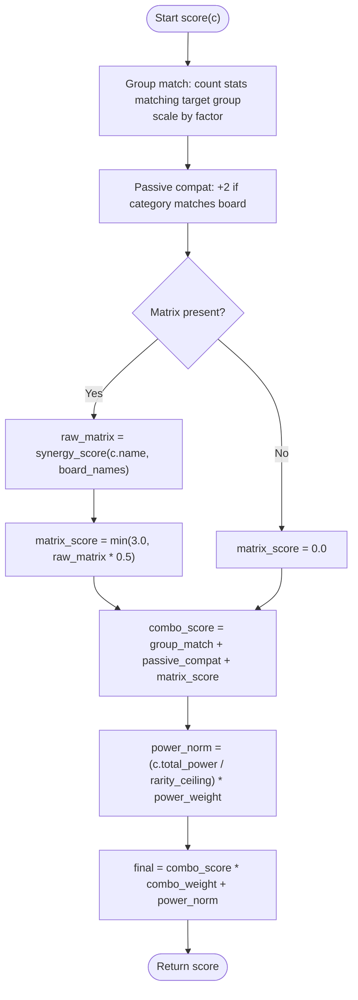
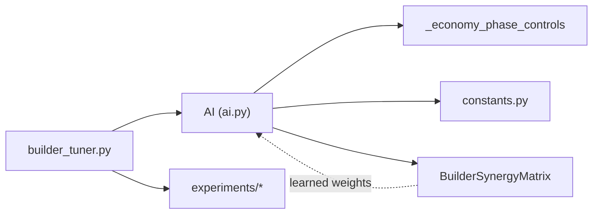

# Builder Strategy

<cite>
**Referenced Files in This Document**
- [ai.py](file://engine_core/ai.py)
- [builder_tuner.py](file://trainer/builder_tuner.py)
- [builder_synergy_matrix.gd](file://_archive/old_dirs/godot_project/scripts/builder_synergy_matrix.gd)
- [synergy_calculator.py](file://v2/core/synergy_calculator.py)
- [params.json](file://experiments/builder_phase2b/best/params.json)
- [combo.json](file://experiments/builder_phase2b/best/combo.json)
- [params.json](file://experiments/builder_phase2b/runs/b2b_001_combo_0p40_conver2p00_greed_12p00_spike_1p00_043434/params.json)
- [constants.py](file://engine_core/constants.py)
</cite>

## Table of Contents
1. [Introduction](#introduction)
2. [Project Structure](#project-structure)
3. [Core Components](#core-components)
4. [Architecture Overview](#architecture-overview)
5. [Detailed Component Analysis](#detailed-component-analysis)
6. [Dependency Analysis](#dependency-analysis)
7. [Performance Considerations](#performance-considerations)
8. [Troubleshooting Guide](#troubleshooting-guide)
9. [Conclusion](#conclusion)

## Introduction
This document explains the Builder Strategy implementation with a combo-first approach that prioritizes cards with high synergy potential over raw power. It documents the BuilderSynergyMatrix system for session-level synergy learning, the combo scoring algorithm that combines group matching, passive compatibility, and matrix bonuses, and the parameter configuration used to tune the strategy. It also covers target group selection logic, integration with the economy phase, migration from legacy group_weight to the new combo_weight system, performance optimization techniques, and tuning strategies for different board compositions.

## Project Structure
The Builder Strategy spans Python engine logic, training and tuning utilities, and a legacy Godot counterpart for synergy memory. Key areas:
- Engine core: AI strategy implementation, scoring, and economy integration
- Trainer: Automated parameter sweep for the Builder strategy
- Legacy Godot: BuilderSynergyMatrix GDScript implementation
- v2 core: Synergy computation utilities used by UI and engine logic
- Experiments: Tuning results and parameter sets

**Diagram sources**
- [ai.py:135-208](file://engine_core/ai.py#L135-L208)
- [builder_tuner.py:1-120](file://trainer/builder_tuner.py#L1-L120)
- [builder_synergy_matrix.gd:1-66](file://_archive/old_dirs/godot_project/scripts/builder_synergy_matrix.gd#L1-L66)
- [synergy_calculator.py:57-99](file://v2/core/synergy_calculator.py#L57-L99)

**Section sources**
- [ai.py:135-208](file://engine_core/ai.py#L135-L208)
- [builder_tuner.py:1-120](file://trainer/builder_tuner.py#L1-L120)
- [builder_synergy_matrix.gd:1-66](file://_archive/old_dirs/godot_project/scripts/builder_synergy_matrix.gd#L1-L66)
- [synergy_calculator.py:57-99](file://v2/core/synergy_calculator.py#L57-L99)

## Core Components
- BuilderSynergyMatrix: Session-level memory of adjacency synergy experiences, with decay and reward mechanisms.
- Economy phase controls: Shared builder/economist phase-aware buying logic (GREED → SPIKE → CONVERT).
- Combo scoring: Card scoring function that blends group matching, passive compatibility, matrix synergy, and power tie-break.
- Parameter configuration: combo_weight, power_weight, greed_gold_thresh, spike_buy_count, convert_buy_count, and others.
- Target group selection: Chooses target group based on board distribution or market distribution in early game.
- Migration: combo_weight replaces legacy group_weight with backward compatibility.

**Section sources**
- [ai.py:135-208](file://engine_core/ai.py#L135-L208)
- [ai.py:415-520](file://engine_core/ai.py#L415-L520)
- [builder_tuner.py:71-77](file://trainer/builder_tuner.py#L71-L77)
- [params.json:19-24](file://experiments/builder_phase2b/best/params.json#L19-L24)
- [params.json:19-28](file://experiments/builder_phase2b/runs/b2b_001_combo_0p40_conver2p00_greed_12p00_spike_1p00_043434/params.json#L19-L28)

## Architecture Overview
The Builder Strategy integrates:
- Economy phase controls to manage buying behavior across turns
- A combo-first scoring function that emphasizes synergy and compatibility
- Optional session-level synergy memory to refine scoring
- Target group selection to maintain focus on high-impact combos

**Diagram sources**
- [ai.py:415-520](file://engine_core/ai.py#L415-L520)
- [ai.py:235-348](file://engine_core/ai.py#L235-L348)
- [ai.py:135-208](file://engine_core/ai.py#L135-L208)

## Detailed Component Analysis

### BuilderSynergyMatrix (Session-Level Synergy Memory)
The BuilderSynergyMatrix maintains a symmetric weight matrix of card-name pairs. It learns from board adjacency:
- record_combo: increments weights when two cards are adjacent and share the same dominant group
- record_miss: slightly reduces weights when neighbors do not match groups
- decay: applies multiplicative decay per turn to forget older experiences
- synergy_score: sums weights for a given card against board card names
- update_from_board: scans the board for adjacent pairs and updates weights accordingly

**Diagram sources**
- [ai.py:135-208](file://engine_core/ai.py#L135-L208)

**Section sources**
- [ai.py:135-208](file://engine_core/ai.py#L135-L208)
- [builder_synergy_matrix.gd:17-65](file://_archive/old_dirs/godot_project/scripts/builder_synergy_matrix.gd#L17-L65)

### Combo Scoring Algorithm
The Builder scoring function computes a combo-focused score per candidate card:
- Group matching: counts stats whose group equals the target group; scaled by a fixed factor
- Passive compatibility: bonus if card category matches categories present on the board
- Matrix synergy: optional bonus from BuilderSynergyMatrix synergy_score, normalized
- Power tie-break: normalized total_power by rarity ceiling multiplied by power_weight
- Final score: combo_score weighted by combo_weight; higher is better

**Diagram sources**
- [ai.py:482-504](file://engine_core/ai.py#L482-L504)

**Section sources**
- [ai.py:482-504](file://engine_core/ai.py#L482-L504)

### Target Group Selection Logic
Target group selection determines what combo group to prioritize:
- If the board has live cards, select the dominant group among them
- If the board is empty (early game), select the most common group among candidate cards in the market
- Defaults to a predefined group if no market data is available

This ensures combo_weight remains meaningful even when the board is sparse.

**Section sources**
- [ai.py:459-474](file://engine_core/ai.py#L459-L474)

### Economy Phase Integration
Builder reuses the shared economy phase controls:
- GREED phase: hoard gold below a threshold; buy cheap cards when able
- SPIKE phase: spend more aggressively to build power; adjust buy quantity and cost cap
- CONVERT phase: hard spend on legendaries when thresholds are met

Parameters controlling phases include greed_turn_end, greed_gold_thresh, spike_turn_end, spike_r4_thresh, buy_2_thresh, spike_buy_count, convert_r5_thresh, and convert_buy_count.

**Section sources**
- [ai.py:235-348](file://engine_core/ai.py#L235-L348)
- [params.json:19-28](file://experiments/builder_phase2b/runs/b2b_001_combo_0p40_conver2p00_greed_12p00_spike_1p00_043434/params.json#L19-L28)

### Parameter Configuration
Key parameters for the Builder Strategy:
- combo_weight: weight for combo/potential synergy score (new primary)
- power_weight: tie-break weight for raw power
- greed_gold_thresh: threshold to enter GREED buy mode
- spike_buy_count: number of cards to buy during SPIKE when eligible
- convert_buy_count: number of cards to buy during CONVERT when eligible
- Legacy group_weight: retained for backward compatibility; combo_weight supersedes

Examples of tuned parameter sets:
- Best run parameters include combo_weight, power_weight, greed_gold_thresh, spike_buy_count, convert_buy_count
- A specific run demonstrates combo_weight=0.4, greed_gold_thresh=12.0, spike_buy_count=1.0, convert_buy_count=2.0

**Section sources**
- [builder_tuner.py:71-77](file://trainer/builder_tuner.py#L71-L77)
- [params.json:19-24](file://experiments/builder_phase2b/best/params.json#L19-L24)
- [params.json:20-28](file://experiments/builder_phase2b/runs/b2b_001_combo_0p40_conver2p00_greed_12p00_spike_1p00_043434/params.json#L20-L28)
- [combo.json:2-5](file://experiments/builder_phase2b/best/combo.json#L2-L5)

### Migration from group_weight to combo_weight
The Builder strategy migrated from a legacy group_weight to combo_weight:
- If combo_weight is missing, the system falls back to group_weight for backward compatibility
- New tuning focuses on combo_weight, power_weight, and economy-phase parameters

**Section sources**
- [ai.py:434-437](file://engine_core/ai.py#L434-L437)
- [builder_tuner.py:162-170](file://trainer/builder_tuner.py#L162-L170)

### Synergy Computation Utilities
While the Builder Strategy uses a lightweight matrix-based bonus, the v2 SynergyCalculator provides robust BFS-based synergy computation for UI and analytics. It:
- Computes group clusters and adjacency matches
- Aggregates tier bonuses per group
- Produces adjacency pairs for rendering and analysis

This supports broader synergy understanding and can inform tuning decisions.

**Section sources**
- [synergy_calculator.py:57-99](file://v2/core/synergy_calculator.py#L57-L99)

## Dependency Analysis
Builder Strategy depends on:
- AI economy phase controls for spending behavior
- Constants for stat-to-group mapping and rarity ceilings
- Optional BuilderSynergyMatrix for learned synergy bonuses
- Tuning utilities for parameter sweeps and selection

**Diagram sources**
- [ai.py:235-348](file://engine_core/ai.py#L235-L348)
- [ai.py:135-208](file://engine_core/ai.py#L135-L208)
- [builder_tuner.py:1-120](file://trainer/builder_tuner.py#L1-L120)

**Section sources**
- [ai.py:235-348](file://engine_core/ai.py#L235-L348)
- [constants.py:17-22](file://engine_core/constants.py#L17-L22)

## Performance Considerations
- Matrix updates: update_from_board iterates board coordinates and neighbors; keep board scans minimal by calling only when needed
- Score normalization: normalize power by rarity ceiling to avoid dominance by higher rarities
- Budget filtering: ratio_floor prevents low power-per-gold purchases during spikes
- Place-per-turn limit: constrains placement computations to a fixed number per turn
- Decay rate: moderate decay balances learning speed and stability

[No sources needed since this section provides general guidance]

## Troubleshooting Guide
Common issues and resolutions:
- No candidates available: Verify economy phase thresholds and buy_count; ensure candidates meet cost constraints
- Low combo_weight effectiveness: Increase combo_weight and confirm matrix presence; validate synergy_score contribution
- Power tie-break dominance: Adjust power_weight to balance combo-first scoring
- Early-game stagnation: Confirm target group selection fallback and market group logic
- Tuning instability: Use builder_tuner to sweep parameters and select top configurations

**Section sources**
- [ai.py:415-520](file://engine_core/ai.py#L415-L520)
- [builder_tuner.py:216-238](file://trainer/builder_tuner.py#L216-L238)

## Conclusion
The Builder Strategy’s combo-first approach leverages a blend of group matching, passive compatibility, and optional session-level synergy learning to prioritize high-potential combinations. By integrating shared economy-phase controls and a tunable scoring function, it adapts across phases and board states. The migration to combo_weight, combined with parameters like greed_gold_thresh, spike_buy_count, and convert_buy_count, enables robust tuning for varied compositions and match-ups.