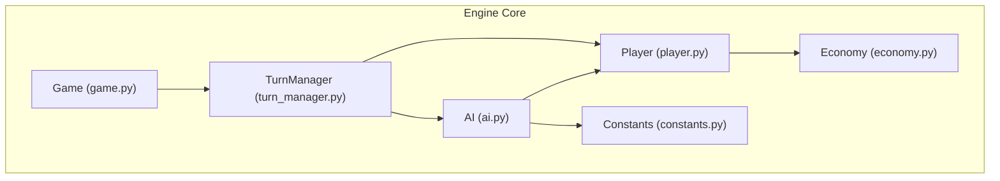
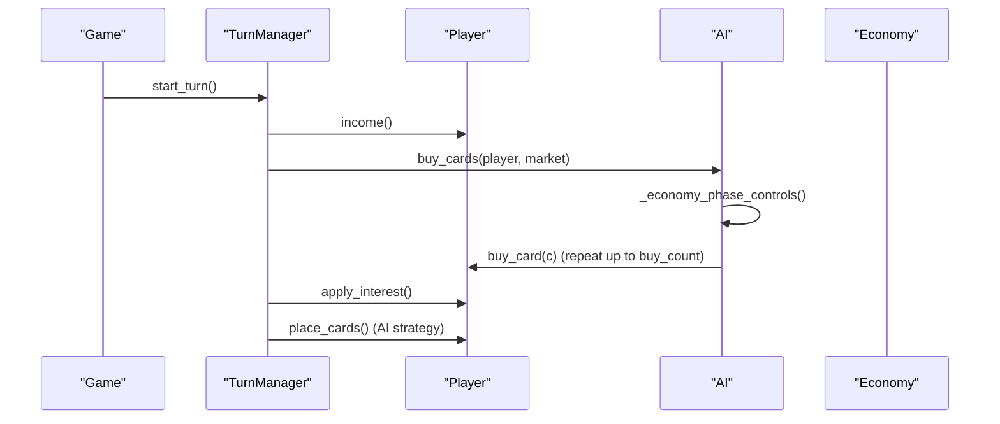
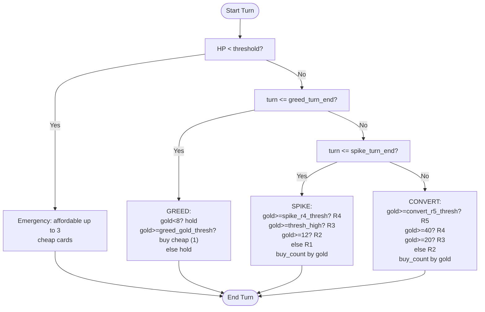
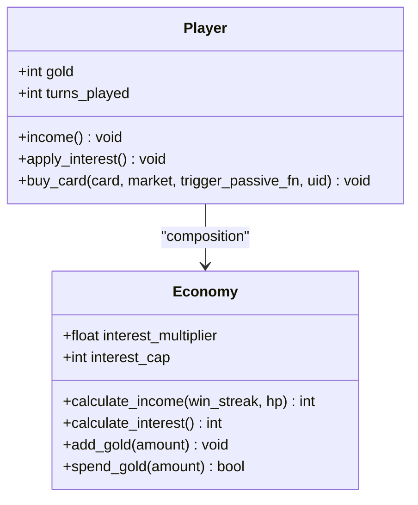
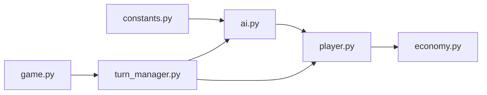

# Economist Strategy

<cite>
**Referenced Files in This Document**
- [ai.py](file://engine_core/ai.py)
- [economy.py](file://engine_core/economy.py)
- [player.py](file://engine_core/player.py)
- [constants.py](file://engine_core/constants.py)
- [turn_manager.py](file://engine_core/turn_manager.py)
- [game.py](file://engine_core/game.py)
- [trained_params.json](file://trained_params.json)
- [test_buy_economist_parameterization.py](file://_archive/old_dirs/tests/unit/test_buy_economist_parameterization.py)
</cite>

## Table of Contents
1. [Introduction](#introduction)
2. [Project Structure](#project-structure)
3. [Core Components](#core-components)
4. [Architecture Overview](#architecture-overview)
5. [Detailed Component Analysis](#detailed-component-analysis)
6. [Dependency Analysis](#dependency-analysis)
7. [Performance Considerations](#performance-considerations)
8. [Troubleshooting Guide](#troubleshooting-guide)
9. [Conclusion](#conclusion)
10. [Appendices](#appendices)

## Introduction
This document explains the Economist Strategy implementation, a three-phase economy-driven approach for automated card buying and board power building. It covers:
- The three-phase system: GREED (turns 1–8), SPIKE (turns 9–18), and CONVERT (turns 19+)
- Phase control logic and parameter thresholds
- Spending behavior and decision trees
- Examples of adaptation to game state, gold conditions, and turn phases
- Parameter configuration, tuning scenarios, and performance characteristics

## Project Structure
The Economist Strategy is implemented in the engine core and integrated into the turn lifecycle:
- AI module orchestrates strategy selection and card buying
- Economy module computes income and interest accumulation
- Player composes Economy and tracks gold, turns, and stats
- TurnManager coordinates per-turn preparation and finish phases
- Game delegates turn management to TurnManager

**Diagram sources**
- [ai.py](file://engine_core/ai.py)
- [economy.py](file://engine_core/economy.py)
- [player.py](file://engine_core/player.py)
- [constants.py](file://engine_core/constants.py)
- [turn_manager.py](file://engine_core/turn_manager.py)
- [game.py](file://engine_core/game.py)

**Section sources**
- [ai.py](file://engine_core/ai.py)
- [economy.py](file://engine_core/economy.py)
- [player.py](file://engine_core/player.py)
- [constants.py](file://engine_core/constants.py)
- [turn_manager.py](file://engine_core/turn_manager.py)
- [game.py](file://engine_core/game.py)

## Core Components
- AI._economy_phase_controls: Shared phase controller for Economist and Builder strategies. Computes phase, candidate cards, and buy counts based on turn, gold, and thresholds.
- AI._buy_economist: Applies the phase controls to select and purchase cards, prioritizing raw power among affordable candidates.
- Economy: Computes income and interest accumulation, with strategy-specific multipliers and caps for the Economist.
- Player: Tracks gold, turns played, and integrates Economy; applies interest and card purchases.
- Constants: Provides thresholds, costs, and global constants used by the strategy.
- TurnManager and Game: Orchestrate turn lifecycle and delegate AI buying/interest to Player and AI.

Key parameters (from trained_params.json):
- greed_turn_end: End of GREED phase
- spike_turn_end: End of SPIKE phase
- greed_gold_thresh: Threshold to start buying cheap cards during GREED
- spike_r4_thresh: Threshold to include rare-4 cards during SPIKE
- convert_r5_thresh: Threshold to include rare-5 cards during CONVERT
- spike_buy_count: Max cards to buy per turn during SPIKE
- convert_buy_count: Max cards to buy per turn during CONVERT
- thresh_high, buy_2_thresh: Additional thresholds guiding SPIKE spending tiers

**Section sources**
- [ai.py](file://engine_core/ai.py)
- [economy.py](file://engine_core/economy.py)
- [player.py](file://engine_core/player.py)
- [constants.py](file://engine_core/constants.py)
- [trained_params.json](file://trained_params.json)

## Architecture Overview
The Economist Strategy is invoked during TurnManager.finish_turn, after income distribution and before passive triggers and evolution. The flow:
1. Player.income(): receives base income plus streak/hp bonuses
2. AI.buy_cards(): routes to _buy_economist for the Economist strategy
3. AI._economy_phase_controls(): selects phase and candidates
4. Player.buy_card(): spends gold and adds to hand
5. Player.apply_interest(): accumulates interest based on banked gold

**Diagram sources**
- [turn_manager.py](file://engine_core/turn_manager.py)
- [ai.py](file://engine_core/ai.py)
- [player.py](file://engine_core/player.py)
- [economy.py](file://engine_core/economy.py)

**Section sources**
- [turn_manager.py](file://engine_core/turn_manager.py)
- [ai.py](file://engine_core/ai.py)
- [player.py](file://engine_core/player.py)
- [economy.py](file://engine_core/economy.py)

## Detailed Component Analysis

### Phase Control Logic and Decision Trees
The shared phase controller determines:
- Phase: GREED, SPIKE, CONVERT, or emergency
- Candidates: Cards within max cost allowed by gold
- Buy count: Number of cards to buy per turn
- Cheap-only mode: During GREED, prefer low-cost cards
- Ratio floor: Minimum power-to-cost ratio filter in certain phases

Decision tree highlights:
- Emergency: If HP below a threshold, force affordable buys with limited slots
- GREED (turn ≤ greed_turn_end):
  - If gold < 8: hold (cheap-only)
  - If gold ≥ greed_gold_thresh: buy cheap cards (1 per turn)
  - Else: hold (cheap-only)
- SPIKE (turn ≤ spike_turn_end):
  - If gold ≥ spike_r4_thresh: up to rare-4
  - Else if gold ≥ thresh_high: up to rare-3
  - Else if gold ≥ 12: up to rare-2
  - Else: up to rare-1
  - Buy count increases with gold thresholds
- CONVERT (turn > spike_turn_end):
  - If gold ≥ convert_r5_thresh: up to rare-5
  - Else if gold ≥ 40: up to rare-4
  - Else if gold ≥ 20: up to rare-3
  - Else: up to rare-2
  - Buy count increases with gold thresholds

**Diagram sources**
- [ai.py](file://engine_core/ai.py)

**Section sources**
- [ai.py](file://engine_core/ai.py)

### Spending Behavior and Economic Mechanics
- Income: Base income plus streak and hp bonuses
- Interest: Accumulated from banked gold; Economist gets a multiplier and higher cap
- Purchasing: Cards are bought in order of total power among eligible candidates, respecting max cost and buy count
- Hand overflow: Excess cards drop back to the market pool

**Diagram sources**
- [economy.py](file://engine_core/economy.py)
- [player.py](file://engine_core/player.py)

**Section sources**
- [economy.py](file://engine_core/economy.py)
- [player.py](file://engine_core/player.py)
- [constants.py](file://engine_core/constants.py)

### Parameter Configuration and Tuning
Trained parameters for the Economist strategy are stored in a JSON file and loaded at runtime. The AI reads parameters per-strategy with fallback support. Unit tests confirm parameterization and backward compatibility.

- Parameterization source: [trained_params.json](file://trained_params.json)
- Loading and fallback logic: [ai.py](file://engine_core/ai.py)
- Unit tests validating parameterization: [test_buy_economist_parameterization.py](file://_archive/old_dirs/tests/unit/test_buy_economist_parameterization.py)

Common tuning scenarios:
- Adjust greed_turn_end to shift when the strategy transitions from hoarding to buying
- Raise greed_gold_thresh to encourage earlier cheap purchases
- Increase spike_buy_count or convert_buy_count to accelerate spending in later phases
- Modify spike_r4_thresh and convert_r5_thresh to change when higher rarities are considered
- Tune thresh_high and buy_2_thresh to adjust tier progression thresholds

**Section sources**
- [trained_params.json](file://trained_params.json)
- [ai.py](file://engine_core/ai.py)
- [test_buy_economist_parameterization.py](file://_archive/old_dirs/tests/unit/test_buy_economist_parameterization.py)

### Concrete Examples of Strategy Adaptation
Below are scenario-based examples illustrating how the strategy adapts to game state and parameters. These describe expected behavior without quoting code.

- Scenario A: Low gold early turns
  - Turns 1–3 with gold < 8: Hold (cheap-only) to preserve banked gold for GREED
- Scenario B: Moderate gold mid-GREED
  - Turn 5 with gold ≥ greed_gold_thresh: Buy one cheap card to start stacking power
- Scenario C: SPIKE ramp-up
  - Turn 12 with gold between thresh_high and spike_r4_thresh: Buy up to rare-3; increase buy_count if gold exceeds buy_2_thresh
- Scenario D: High-gold SPIKE
  - Turn 16 with gold ≥ spike_r4_thresh: Consider rare-4 cards; maintain aggressive buy_count
- Scenario E: CONVERT hard spend
  - Turn 22 with gold ≥ convert_r5_thresh: Consider rare-5; otherwise rare-4 or rare-3 depending on thresholds
- Scenario F: Emergency safety
  - Any turn with low HP: Force purchase of affordable cards regardless of phase

These examples reflect the thresholds and logic defined in the phase controller.

**Section sources**
- [ai.py](file://engine_core/ai.py)
- [trained_params.json](file://trained_params.json)

## Dependency Analysis
The Economist Strategy depends on:
- AI._economy_phase_controls for phase decisions
- Player for gold tracking and purchasing
- Economy for income and interest mechanics
- Constants for thresholds and costs
- TurnManager/Game for lifecycle orchestration

**Diagram sources**
- [ai.py](file://engine_core/ai.py)
- [player.py](file://engine_core/player.py)
- [economy.py](file://engine_core/economy.py)
- [constants.py](file://engine_core/constants.py)
- [turn_manager.py](file://engine_core/turn_manager.py)
- [game.py](file://engine_core/game.py)

**Section sources**
- [ai.py](file://engine_core/ai.py)
- [player.py](file://engine_core/player.py)
- [economy.py](file://engine_core/economy.py)
- [constants.py](file://engine_core/constants.py)
- [turn_manager.py](file://engine_core/turn_manager.py)
- [game.py](file://engine_core/game.py)

## Performance Considerations
- Parameter-driven thresholds reduce branching overhead and enable genetic tuning without code changes
- Backward-compatible fallback ensures no runtime degradation when parameters are missing
- Interest multiplier and cap improve late-game acceleration for the Economist
- Buy count scaling with gold prevents over-spending while maintaining responsiveness

[No sources needed since this section provides general guidance]

## Troubleshooting Guide
- Strategy does not transition phases:
  - Verify greed_turn_end and spike_turn_end are set appropriately in trained parameters
  - Confirm Player.turns_played increments correctly via TurnManager
- Excessive hoarding:
  - Lower greed_gold_thresh or greed_turn_end to encourage earlier purchases
- Early stall on expensive cards:
  - Reduce spike_r4_thresh or convert_r5_thresh to allow earlier rare-4/rare-5 consideration
- Over-spending in early turns:
  - Increase thresh_high and buy_2_thresh to delay tier-ups
- Emergency safety not triggering:
  - Check HP threshold logic and ensure low HP conditions activate emergency branch

**Section sources**
- [ai.py](file://engine_core/ai.py)
- [trained_params.json](file://trained_params.json)
- [turn_manager.py](file://engine_core/turn_manager.py)
- [player.py](file://engine_core/player.py)

## Conclusion
The Economist Strategy implements a robust, parameterized three-phase economy system that balances interest stacking, board power building, and late-game hard spending. Its modular design integrates cleanly with the turn lifecycle, supports dynamic tuning, and maintains backward compatibility. Proper configuration of phase thresholds and buy counts enables optimization for win rate, gold efficiency, and overall performance.

[No sources needed since this section summarizes without analyzing specific files]

## Appendices

### Appendix A: Parameter Reference
- greed_turn_end: End of GREED phase
- spike_turn_end: End of SPIKE phase
- greed_gold_thresh: Gold threshold to start buying cheap cards during GREED
- spike_r4_thresh: Gold threshold to include rare-4 during SPIKE
- convert_r5_thresh: Gold threshold to include rare-5 during CONVERT
- spike_buy_count: Max cards to buy per turn during SPIKE
- convert_buy_count: Max cards to buy per turn during CONVERT
- thresh_high, buy_2_thresh: Additional thresholds guiding SPIKE tier progression

**Section sources**
- [trained_params.json](file://trained_params.json)
- [ai.py](file://engine_core/ai.py)