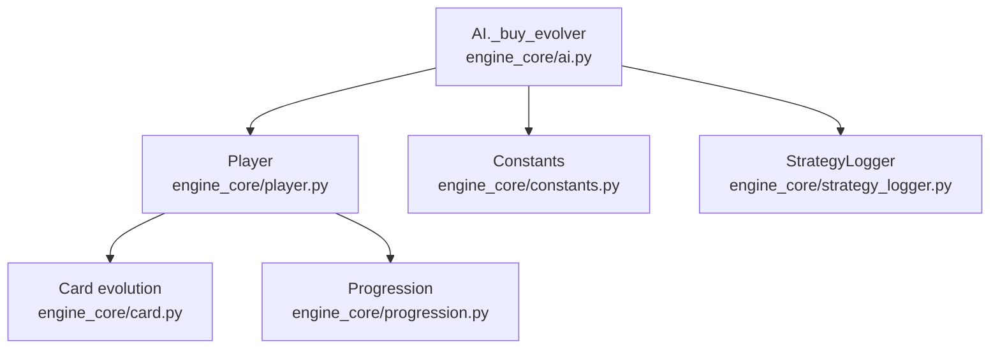
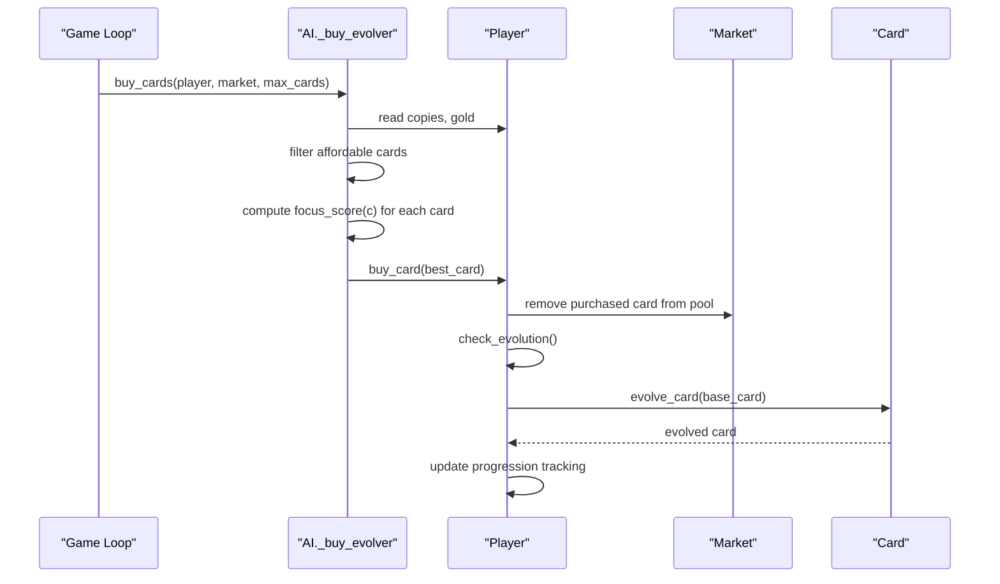
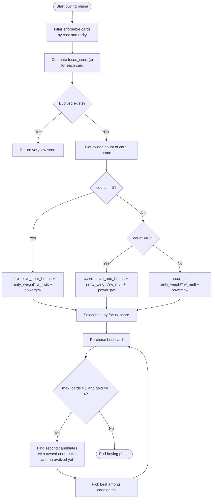
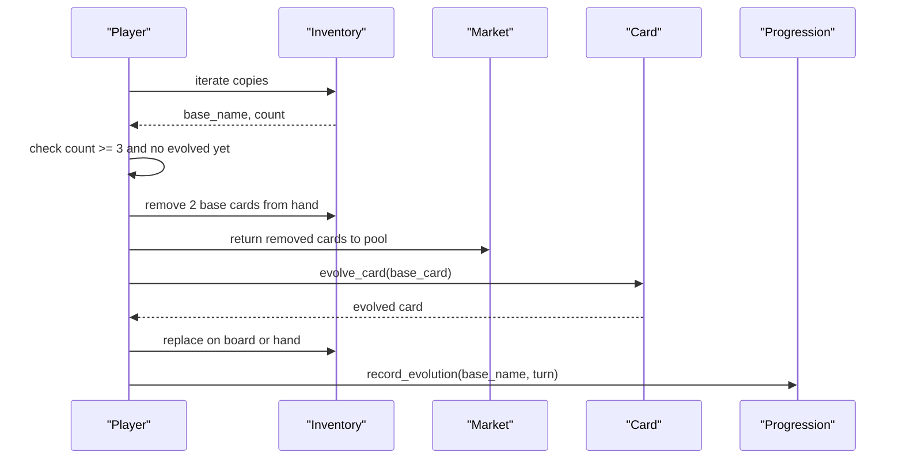
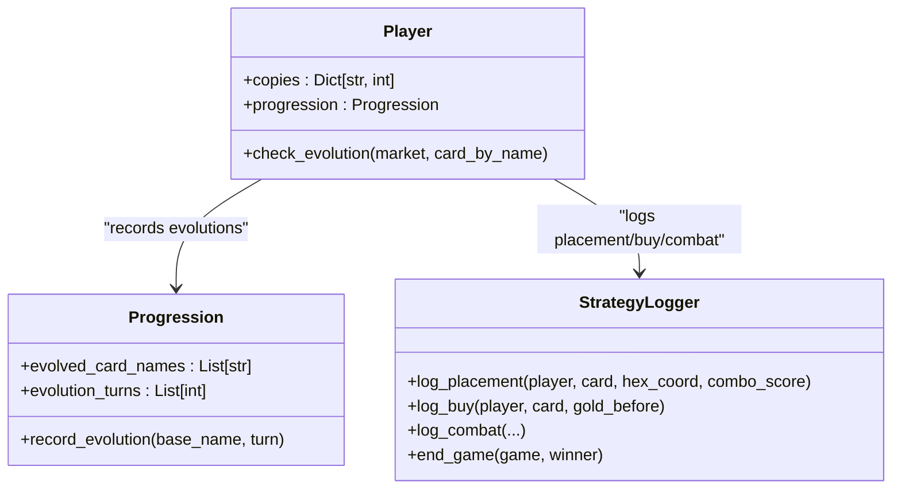
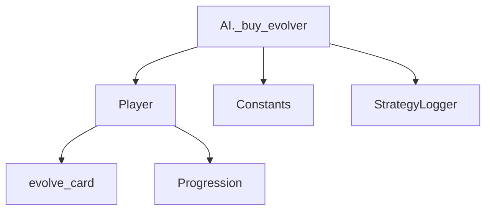

# Evolver Strategy

<cite>
**Referenced Files in This Document**
- [ai.py](file://engine_core/ai.py)
- [player.py](file://engine_core/player.py)
- [card.py](file://engine_core/card.py)
- [constants.py](file://engine_core/constants.py)
- [strategy_logger.py](file://engine_core/strategy_logger.py)
- [progression.py](file://engine_core/progression.py)
- [COPY_STRENGTHENING_FIX.md](file://docs/reports/COPY_STRENGTHENING_FIX.md)
- [BAL_5_4_2_EVOLVER_HP_SCALED_ECONOMY.md](file://docs/reports/BAL_5_4_2_EVOLVER_HP_SCALED_ECONOMY.md)
- [manual_tuner.py](file://trainer/manual_tuner.py)
</cite>

## Table of Contents
1. [Introduction](#introduction)
2. [Project Structure](#project-structure)
3. [Core Components](#core-components)
4. [Architecture Overview](#architecture-overview)
5. [Detailed Component Analysis](#detailed-component-analysis)
6. [Dependency Analysis](#dependency-analysis)
7. [Performance Considerations](#performance-considerations)
8. [Troubleshooting Guide](#troubleshooting-guide)
9. [Conclusion](#conclusion)

## Introduction
This document explains the Evolver Strategy implementation, focusing on evolution-aware card selection and scoring. The Evolver prioritizes cards that bring it closer to evolution (2 copies remaining to evolve), then cards with 1 copy, and finally new cards by rarity. The scoring algorithm incorporates evolution bonuses, rarity weighting, and power considerations. It also covers evolution detection, adaptive behavior after successful evolutions, and parameter tuning guidance.

## Project Structure
The Evolver Strategy is implemented within the AI subsystem and interacts with player state, card evolution mechanics, and constants. Key modules include:
- AI strategy selection and evolution-focused buying logic
- Player state and evolution detection
- Card evolution transformation
- Game constants (rarity targets, costs, thresholds)
- Strategy analytics and logging
- Progression tracking for evolutions

**Diagram sources**
- [ai.py:522-574](file://engine_core/ai.py#L522-L574)
- [player.py:184-241](file://engine_core/player.py#L184-L241)
- [card.py:293-315](file://engine_core/card.py#L293-L315)
- [constants.py:49-138](file://engine_core/constants.py#L49-L138)
- [strategy_logger.py:52-591](file://engine_core/strategy_logger.py#L52-L591)
- [progression.py:3-15](file://engine_core/progression.py#L3-L15)

**Section sources**
- [ai.py:522-574](file://engine_core/ai.py#L522-L574)
- [player.py:184-241](file://engine_core/player.py#L184-L241)
- [card.py:293-315](file://engine_core/card.py#L293-L315)
- [constants.py:49-138](file://engine_core/constants.py#L49-L138)
- [strategy_logger.py:52-591](file://engine_core/strategy_logger.py#L52-L591)
- [progression.py:3-15](file://engine_core/progression.py#L3-L15)

## Core Components
- Evolution-aware buying logic: Selects cards based on proximity to evolution and rarity/power weights.
- Evolution detection: Automatically evolves eligible cards when 3 copies are collected.
- Scoring function: Computes focus scores using evolution bonuses, rarity multipliers, and power weights.
- Adaptive behavior: After evolving, the strategy adapts by selecting a new focus target.

Key parameters:
- evo_near_bonus: Bonus for cards with 2 copies (one away from evolving)
- evo_one_bonus: Bonus for cards with 1 copy
- rarity_weight_mult: Multiplier for rarity-based preference
- power_weight: Weight for card power in scoring

**Section sources**
- [ai.py:41-60](file://engine_core/ai.py#L41-L60)
- [ai.py:522-574](file://engine_core/ai.py#L522-L574)
- [player.py:184-241](file://engine_core/player.py#L184-L241)
- [constants.py:49-138](file://engine_core/constants.py#L49-L138)
- [manual_tuner.py:88-93](file://trainer/manual_tuner.py#L88-L93)

## Architecture Overview
The Evolver Strategy integrates with the AI subsystem and player state. The buying process filters affordable cards, computes focus scores, and purchases the best option. Evolution detection runs separately and replaces eligible cards with evolved versions.

**Diagram sources**
- [ai.py:351-380](file://engine_core/ai.py#L351-L380)
- [ai.py:522-574](file://engine_core/ai.py#L522-L574)
- [player.py:184-241](file://engine_core/player.py#L184-L241)
- [card.py:293-315](file://engine_core/card.py#L293-L315)

## Detailed Component Analysis

### Evolution-Aware Card Selection and Scoring
The Evolver uses a focus scoring algorithm that prioritizes evolution readiness and rarity/power. The scoring function considers:
- Evolution proximity: 2 copies (near evolution) receives a bonus; 1 copy receives a smaller bonus
- Rarity weighting: Higher rarity cards receive increased weight
- Power consideration: Cards are scored by total power multiplied by a power weight

**Diagram sources**
- [ai.py:522-574](file://engine_core/ai.py#L522-L574)

**Section sources**
- [ai.py:522-574](file://engine_core/ai.py#L522-L574)

### Evolution Detection and Replacement
When a player reaches the evolution threshold (3 copies of a base card), the system automatically evolves the card. The evolved card replaces the base card on the board or in hand and updates progression tracking.

**Diagram sources**
- [player.py:184-241](file://engine_core/player.py#L184-L241)
- [card.py:293-315](file://engine_core/card.py#L293-L315)
- [progression.py:9-12](file://engine_core/progression.py#L9-L12)

**Section sources**
- [player.py:184-241](file://engine_core/player.py#L184-L241)
- [card.py:293-315](file://engine_core/card.py#L293-L315)
- [progression.py:9-12](file://engine_core/progression.py#L9-L12)

### Focus Target Tracking and Adaptive Strategy
After evolving a card, the Evolver adapts by selecting a new focus target. The system tracks evolution occurrences and turns, enabling analysis of evolution frequency and timing. Strategy logs capture evolution events and related metrics for monitoring.

**Diagram sources**
- [player.py:88-92](file://engine_core/player.py#L88-L92)
- [progression.py:3-15](file://engine_core/progression.py#L3-L15)
- [strategy_logger.py:140-323](file://engine_core/strategy_logger.py#L140-L323)

**Section sources**
- [player.py:88-92](file://engine_core/player.py#L88-L92)
- [progression.py:3-15](file://engine_core/progression.py#L3-L15)
- [strategy_logger.py:140-323](file://engine_core/strategy_logger.py#L140-L323)

### Parameter Tuning Guidance
Parameters influence evolution urgency versus power considerations:
- evo_near_bonus: Controls how aggressively the strategy targets cards near evolution
- evo_one_bonus: Encourages collecting cards that are one step from evolution
- rarity_weight_mult: Balances rarity preference against power
- power_weight: Emphasizes power when choosing between equally rare cards

Baseline values are defined in the training configuration and can be overridden via parameter files. The system supports hot-reloading of parameters between simulations.

**Section sources**
- [ai.py:41-60](file://engine_core/ai.py#L41-L60)
- [manual_tuner.py:88-93](file://trainer/manual_tuner.py#L88-L93)

## Dependency Analysis
The Evolver Strategy depends on:
- AI subsystem for strategy selection and buying logic
- Player state for ownership counts and evolution checks
- Card evolution mechanics for transforming base cards
- Constants for rarity targets, costs, and thresholds
- Strategy logging for analytics and progress tracking

**Diagram sources**
- [ai.py:522-574](file://engine_core/ai.py#L522-L574)
- [player.py:184-241](file://engine_core/player.py#L184-L241)
- [card.py:293-315](file://engine_core/card.py#L293-L315)
- [constants.py:49-138](file://engine_core/constants.py#L49-L138)
- [strategy_logger.py:52-591](file://engine_core/strategy_logger.py#L52-L591)
- [progression.py:3-15](file://engine_core/progression.py#L3-L15)

**Section sources**
- [ai.py:522-574](file://engine_core/ai.py#L522-L574)
- [player.py:184-241](file://engine_core/player.py#L184-L241)
- [card.py:293-315](file://engine_core/card.py#L293-L315)
- [constants.py:49-138](file://engine_core/constants.py#L49-L138)
- [strategy_logger.py:52-591](file://engine_core/strategy_logger.py#L52-L591)
- [progression.py:3-15](file://engine_core/progression.py#L3-L15)

## Performance Considerations
- Scoring complexity: Linear in the number of affordable cards; negligible overhead compared to placement and combat phases.
- Evolution detection: Runs once per turn per eligible card; minimal cost due to early exits and targeted checks.
- Logging: StrategyLogger buffers writes and flushes periodically; overhead is bounded and configurable.

## Troubleshooting Guide
Common issues and resolutions:
- No cards purchased: Ensure sufficient gold and that market contains affordable cards (excluding evolved cards).
- Unexpected evolution timing: Verify copy thresholds and that evolved cards are not being selected as focus targets.
- Parameter overrides not taking effect: Confirm parameter file location and JSON validity; verify hot-reload behavior between simulations.

Monitoring tips:
- Track evolution frequency and average turn of first evolution via progression logs.
- Use strategy logs to analyze buying patterns and power distributions.

**Section sources**
- [COPY_STRENGTHENING_FIX.md:1-156](file://docs/reports/COPY_STRENGTHENING_FIX.md#L1-L156)
- [BAL_5_4_2_EVOLVER_HP_SCALED_ECONOMY.md:199-208](file://docs/reports/BAL_5_4_2_EVOLVER_HP_SCALED_ECONOMY.md#L199-L208)
- [strategy_logger.py:277-323](file://engine_core/strategy_logger.py#L277-L323)

## Conclusion
The Evolver Strategy combines evolution-aware selection with adaptive behavior to create a powerful progression path. Its scoring algorithm balances evolution urgency, rarity, and power, while evolution detection ensures efficient transformation of base cards. With tunable parameters and robust logging, the strategy can be optimized and monitored effectively across simulations.