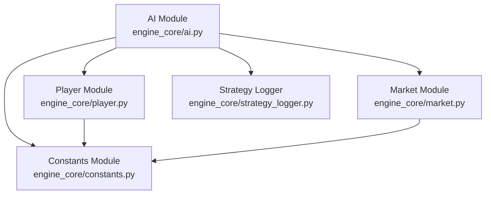
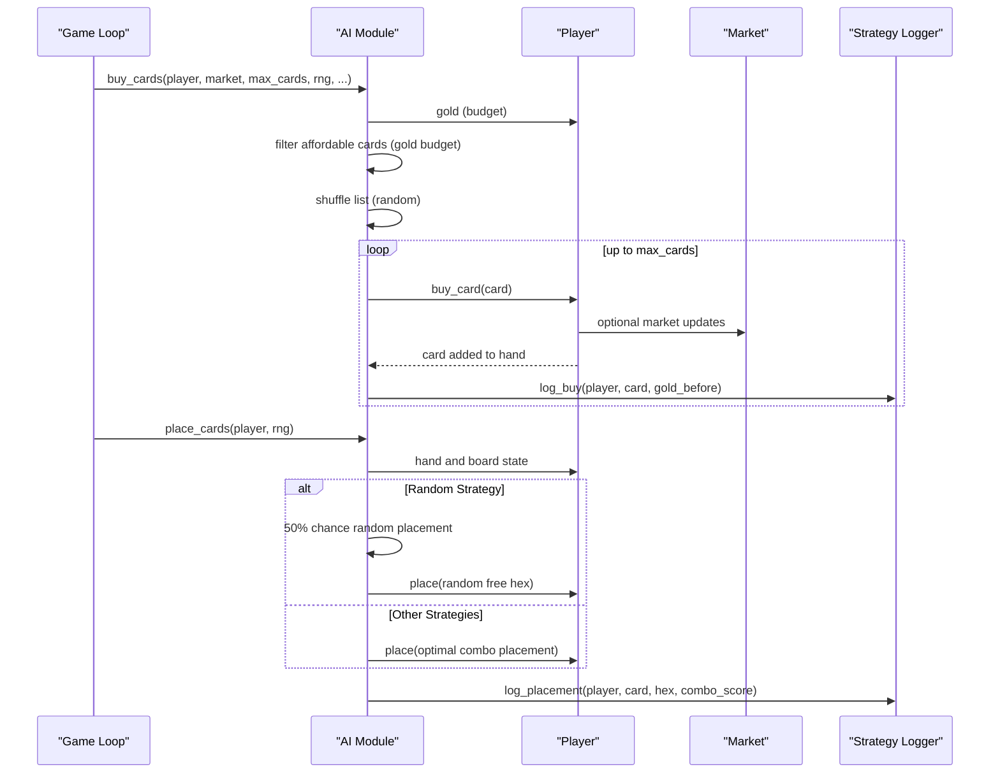
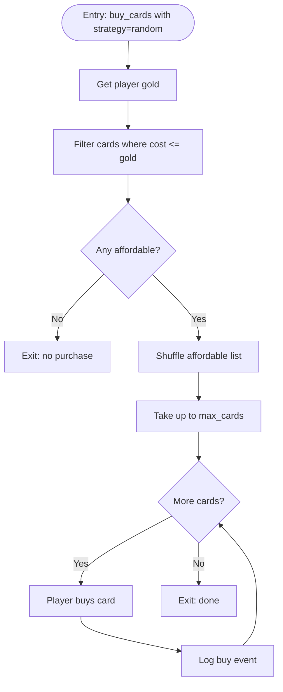
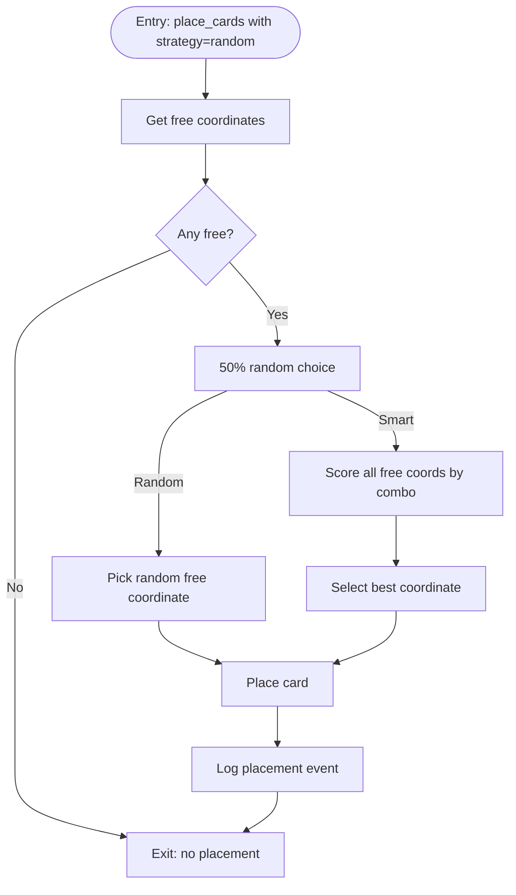
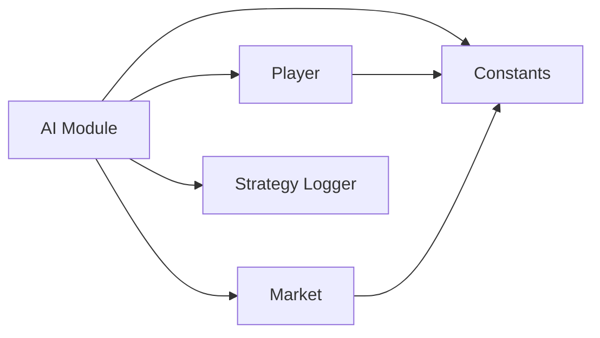

# Random Strategy

<cite>
**Referenced Files in This Document**
- [ai.py](file://engine_core/ai.py)
- [player.py](file://engine_core/player.py)
- [constants.py](file://engine_core/constants.py)
- [market.py](file://engine_core/market.py)
- [strategy_logger.py](file://engine_core/strategy_logger.py)
- [debug_sim.py](file://tools/debug_sim.py)
- [KPI_FINAL_REPORT.txt](file://docs/kpi/KPI_FINAL_REPORT.txt)
</cite>

## Table of Contents
1. [Introduction](#introduction)
2. [Project Structure](#project-structure)
3. [Core Components](#core-components)
4. [Architecture Overview](#architecture-overview)
5. [Detailed Component Analysis](#detailed-component-analysis)
6. [Dependency Analysis](#dependency-analysis)
7. [Performance Considerations](#performance-considerations)
8. [Troubleshooting Guide](#troubleshooting-guide)
9. [Conclusion](#conclusion)
10. [Appendices](#appendices)

## Introduction
This document explains the Random Strategy implementation as a baseline AI behavior in the AutoChess Hybrid engine. It covers the random card selection algorithm, gold-filtering logic, parameter-free operation, and how the strategy integrates with the broader engine for buying and placement decisions. It also describes the Random Strategy’s role in AI comparison, performance benchmarking, and testing frameworks, along with practical use cases for playtesting, strategy validation, and education.

## Project Structure
The Random Strategy lives within the AI module and interacts with core systems for cards, economy, and logging. The following diagram shows the key modules involved in Random Strategy execution.

**Diagram sources**
- [ai.py](file://engine_core/ai.py)
- [player.py](file://engine_core/player.py)
- [constants.py](file://engine_core/constants.py)
- [market.py](file://engine_core/market.py)
- [strategy_logger.py](file://engine_core/strategy_logger.py)

**Section sources**
- [ai.py](file://engine_core/ai.py)
- [player.py](file://engine_core/player.py)
- [constants.py](file://engine_core/constants.py)
- [market.py](file://engine_core/market.py)
- [strategy_logger.py](file://engine_core/strategy_logger.py)

## Core Components
- Random card buying: Selects affordable cards based on current gold and rarity costs, shuffles the list, and purchases up to a turn limit.
- Random placement: For the Random Strategy, randomly chooses a free hex 50% of the time; otherwise, places optimally by combo score.
- Logging hooks: Records purchases, placements, and outcomes for analytics and benchmarking.

Key behaviors:
- Parameter-free operation: No strategy-specific parameters are required.
- Gold filtering: Only cards within the player’s current gold budget are considered.
- Randomness sources: Uses Python’s standard random number generator seeded internally if none is provided.

**Section sources**
- [ai.py](file://engine_core/ai.py)
- [player.py](file://engine_core/player.py)
- [constants.py](file://engine_core/constants.py)
- [strategy_logger.py](file://engine_core/strategy_logger.py)

## Architecture Overview
The Random Strategy participates in two phases per turn: buying and placement. The AI module routes the player’s strategy to the appropriate method, which then delegates to the Player and Market modules as needed.

**Diagram sources**
- [ai.py](file://engine_core/ai.py)
- [player.py](file://engine_core/player.py)
- [market.py](file://engine_core/market.py)
- [strategy_logger.py](file://engine_core/strategy_logger.py)

## Detailed Component Analysis

### Random Card Buying Algorithm
The Random Strategy’s buying routine:
- Reads the player’s current gold.
- Filters cards whose rarity cost is less than or equal to the player’s gold.
- Shuffles the filtered list using a random number generator.
- Purchases up to the turn limit (max_cards) from the shuffled list.

**Diagram sources**
- [ai.py](file://engine_core/ai.py)
- [player.py](file://engine_core/player.py)
- [strategy_logger.py](file://engine_core/strategy_logger.py)

**Section sources**
- [ai.py](file://engine_core/ai.py)
- [constants.py](file://engine_core/constants.py)
- [strategy_logger.py](file://engine_core/strategy_logger.py)

### Random Placement Logic
During placement, the Random Strategy randomly selects a free hex 50% of the time. Otherwise, it evaluates all free coordinates by combo score and places the card at the best location.

**Diagram sources**
- [ai.py](file://engine_core/ai.py)
- [strategy_logger.py](file://engine_core/strategy_logger.py)

**Section sources**
- [ai.py](file://engine_core/ai.py)
- [strategy_logger.py](file://engine_core/strategy_logger.py)

### Gold Filtering Logic
The Random Strategy relies on the global rarity cost mapping to determine affordability. Cards are considered affordable if their rarity cost does not exceed the player’s current gold.

- Affordability condition: cost(card.rarity) ≤ player.gold
- Cost mapping is defined globally and ensures deterministic filtering.

**Section sources**
- [constants.py](file://engine_core/constants.py)
- [ai.py](file://engine_core/ai.py)

### Randomness Sources and Determinism
- Internal RNG seeding: If no RNG instance is provided, the Random Strategy seeds its own generator internally.
- Deterministic simulations: Tests and benchmarks often set seeds externally to ensure reproducibility.

**Section sources**
- [ai.py](file://engine_core/ai.py)
- [debug_sim.py](file://tools/debug_sim.py)

### Integration with Other Strategies
- The AI module routes all strategies through a unified interface. When strategy equals “random”, the Random Strategy’s methods are invoked for both buying and placement.
- For placement, Random Strategy mixes random and greedy choices, enabling controlled exploration of the strategy space.

**Section sources**
- [ai.py](file://engine_core/ai.py)

### Role in Testing and Benchmarking
- Baseline comparison: Random Strategy provides a baseline performance metric against which other strategies are compared.
- Balanced tournaments: It is commonly used in multi-strategy simulations to assess relative strengths.
- Deterministic runs: Benchmarks rely on fixed seeds and consistent RNG behavior to produce comparable results.

**Section sources**
- [debug_sim.py](file://tools/debug_sim.py)
- [KPI_FINAL_REPORT.txt](file://docs/kpi/KPI_FINAL_REPORT.txt)

## Dependency Analysis
The Random Strategy depends on:
- Player state (gold, hand, board).
- Global constants (rarity costs, placement limits).
- Market for window management and card pooling.
- Strategy Logger for analytics and reporting.

**Diagram sources**
- [ai.py](file://engine_core/ai.py)
- [player.py](file://engine_core/player.py)
- [constants.py](file://engine_core/constants.py)
- [market.py](file://engine_core/market.py)
- [strategy_logger.py](file://engine_core/strategy_logger.py)

**Section sources**
- [ai.py](file://engine_core/ai.py)
- [player.py](file://engine_core/player.py)
- [constants.py](file://engine_core/constants.py)
- [market.py](file://engine_core/market.py)
- [strategy_logger.py](file://engine_core/strategy_logger.py)

## Performance Considerations
- Random buying: Shuffling is O(n log n) with typical library performance; acceptable for small windows.
- Placement mixing: The 50% random placement introduces variance, which can reduce average combo score but increases exploration.
- Logging overhead: Strategy Logger buffers events and flushes periodically; negligible in most simulations.

## Troubleshooting Guide
Common issues and checks:
- No cards purchased: Verify that player gold is sufficient for any card cost; ensure the card pool has available cards.
- Unexpected placement: Confirm whether the Random Strategy’s random branch is active (50% probability).
- Reproducibility problems: Set a fixed seed in the RNG passed to the AI routines.

**Section sources**
- [ai.py](file://engine_core/ai.py)
- [debug_sim.py](file://tools/debug_sim.py)

## Conclusion
The Random Strategy serves as a parameter-free baseline that reliably filters by gold, shuffles eligible cards, and purchases up to the turn limit. Its placement logic blends random and greedy decisions, making it useful for comparative analysis, benchmarking, and educational demonstrations. Together with the Strategy Logger and deterministic simulation practices, it forms a robust foundation for validating and comparing more advanced strategies.

## Appendices

### Practical Use Cases
- Playtesting: Run long batches of games to observe baseline performance trends.
- Strategy validation: Compare new strategies against Random to establish viability.
- Education: Demonstrate core mechanics (buying, placement) without complex heuristics.

[No sources needed since this section provides general guidance]