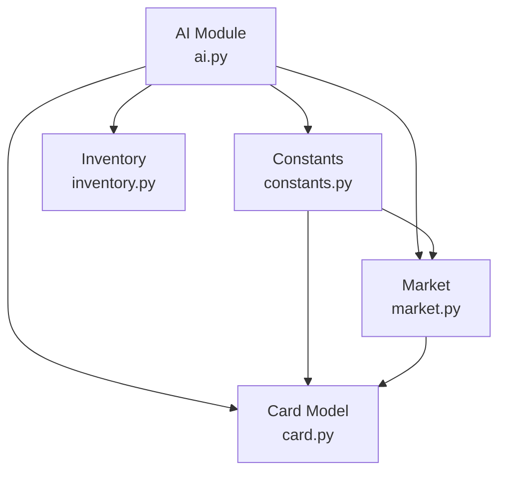
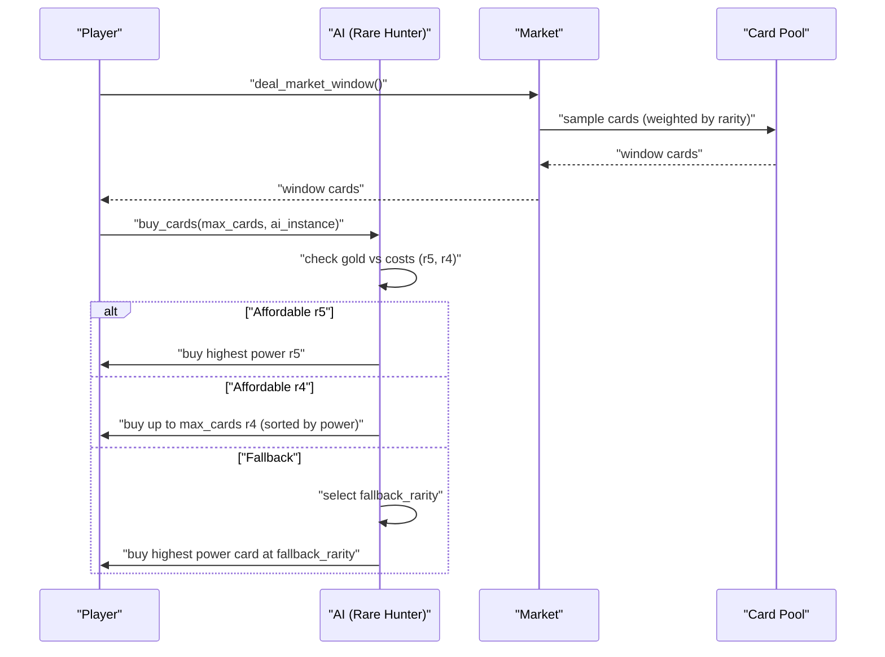
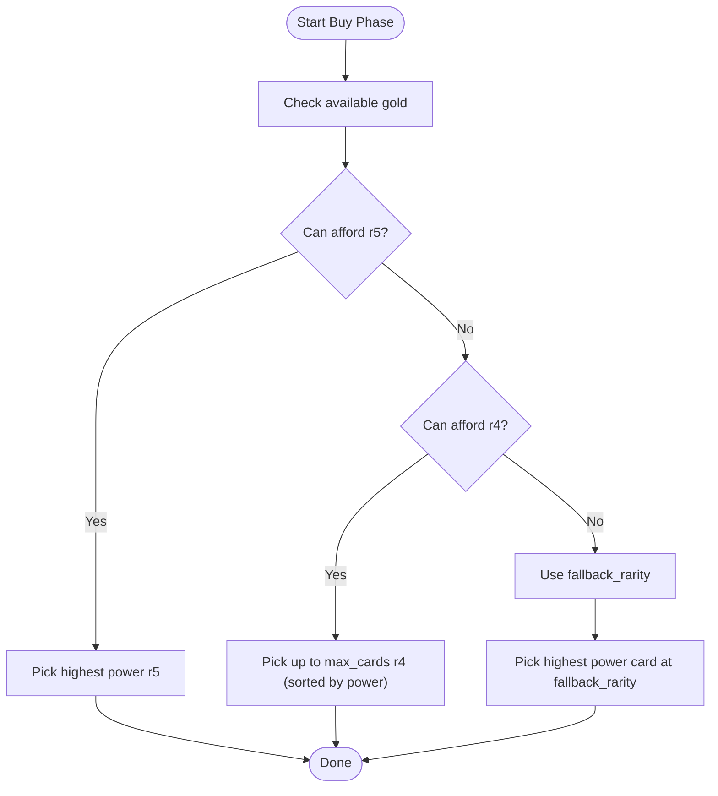
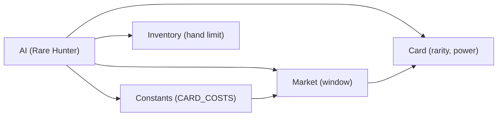

# Rare Hunter Strategy

<cite>
**Referenced Files in This Document**
- [ai.py](file://engine_core/ai.py)
- [constants.py](file://engine_core/constants.py)
- [market.py](file://engine_core/market.py)
- [card.py](file://engine_core/card.py)
- [inventory.py](file://engine_core/inventory.py)
</cite>

## Table of Contents
1. [Introduction](#introduction)
2. [Project Structure](#project-structure)
3. [Core Components](#core-components)
4. [Architecture Overview](#architecture-overview)
5. [Detailed Component Analysis](#detailed-component-analysis)
6. [Dependency Analysis](#dependency-analysis)
7. [Performance Considerations](#performance-considerations)
8. [Troubleshooting Guide](#troubleshooting-guide)
9. [Conclusion](#conclusion)

## Introduction
This document explains the Rare Hunter Strategy implementation, focusing on how it chases high-rarity cards while maintaining early-game stability. The strategy:
- Prioritizes legendary (5-pip) cards when affordable
- Followed by epic (4-pip) cards when affordable
- Falls back to a parameterized rarity controlled by fallback_rarity for early turns or when higher rarities are unaffordable
- Includes a bug fix that prevents early-game stalls by switching to a safe fallback threshold when gold is low

We also describe the gold threshold logic, the fallback_rarity parameter system, and how these combine to shape the strategy’s behavior across the game.

## Project Structure
The Rare Hunter Strategy lives in the AI module and interacts with constants, market generation, card definitions, and inventory limits. The following diagram shows the key relationships.

**Diagram sources**
- [ai.py:646-686](file://engine_core/ai.py#L646-L686)
- [constants.py:134](file://engine_core/constants.py#L134)
- [market.py:49-130](file://engine_core/market.py#L49-L130)
- [card.py:48-316](file://engine_core/card.py#L48-L316)
- [inventory.py:5-33](file://engine_core/inventory.py#L5-L33)

**Section sources**
- [ai.py:646-686](file://engine_core/ai.py#L646-L686)
- [constants.py:134](file://engine_core/constants.py#L134)
- [market.py:49-130](file://engine_core/market.py#L49-L130)
- [card.py:48-316](file://engine_core/card.py#L48-L316)
- [inventory.py:5-33](file://engine_core/inventory.py#L5-L33)

## Core Components
- Rare Hunter buying logic: Implements the high-rarity chase and fallback behavior, including the 8-gold stall-prevention fix.
- Parameter system: Uses fallback_rarity to control early-game caution and adjust the chase intensity.
- Cost model: Defines card costs that enable earlier access to r4 and r5 cards, reducing early stalls.
- Market generation: Provides weighted rarity sampling that respects turn-based availability.
- Card model: Supplies card metadata (rarity, stats, total power) used for selection.

Key implementation references:
- Rare Hunter buying method and fallback logic: [ai.py:646-686]
- Cost definitions enabling earlier rare access: [constants.py:134]
- Market rarity weights and sampling: [market.py:23-130]
- Card rarity and power: [card.py:48-162]

**Section sources**
- [ai.py:646-686](file://engine_core/ai.py#L646-L686)
- [constants.py:134](file://engine_core/constants.py#L134)
- [market.py:23-130](file://engine_core/market.py#L23-L130)
- [card.py:48-162](file://engine_core/card.py#L48-L162)

## Architecture Overview
The Rare Hunter Strategy operates during the buy phase. It evaluates the current gold and turn context, selects cards from the market window, and purchases up to a configured limit. The process is influenced by:
- Gold thresholds that gate access to r4 and r5 cards
- A parameterized fallback rarity for early turns
- Market rarity weights that reflect turn-based availability

**Diagram sources**
- [ai.py:646-686](file://engine_core/ai.py#L646-L686)
- [market.py:105-130](file://engine_core/market.py#L105-L130)
- [constants.py:134](file://engine_core/constants.py#L134)

## Detailed Component Analysis

### Rare Hunter Buying Logic
The Rare Hunter strategy follows a strict priority:
1) If gold allows, buy the highest power legendary (5-pip) card.
2) Else if gold allows, buy up to max_cards epic (4-pip) cards, sorted by power.
3) Else, fall back to a parameterized rarity (fallback_rarity) and buy the highest power card at that rarity.

A safety mechanism prevents early-game stalls:
- When gold is below a fixed threshold, the strategy avoids risky purchases and instead banks gold or buys lower rarities appropriate to the fallback_rarity setting.

**Diagram sources**
- [ai.py:646-686](file://engine_core/ai.py#L646-L686)
- [constants.py:134](file://engine_core/constants.py#L134)

**Section sources**
- [ai.py:646-686](file://engine_core/ai.py#L646-L686)

### Gold Threshold Logic and Early-Game Stability
- The cost model reduces the barrier to purchasing r4 and r5 cards, improving early accessibility and reducing stalls.
- The strategy itself includes a built-in stall-prevention mechanism: when gold is low, it falls back to a safer rarity rather than stalling.

References:
- Cost definitions: [constants.py:134]
- Stall-prevention note in strategy docstring: [ai.py:649-L652]

**Section sources**
- [constants.py:134](file://engine_core/constants.py#L134)
- [ai.py:649-652](file://engine_core/ai.py#L649-L652)

### Fallback Rarity Parameter System
- fallback_rarity is a numeric parameter controlling the minimum acceptable rarity during fallback.
- The parameter is clamped to a supported range and rounded to an integer rarity index.
- The strategy converts the parameter into a concrete rarity string and filters the market window accordingly.

Implementation references:
- Parameter access and rounding: [ai.py:656-L659]
- Fallback selection: [ai.py:680-L685]

**Section sources**
- [ai.py:656-659](file://engine_core/ai.py#L656-L659)
- [ai.py:680-685](file://engine_core/ai.py#L680-L685)

### Rarity Selection Priority and Examples
- Priority order: r5 > r4 > fallback_rarity.
- Selection criteria: highest power within the chosen rarity band.
- Example sequences:
  - Turn 1 with 7 gold: Cannot afford r5 (cost 7); cannot afford r4 (cost 5); fallback to fallback_rarity; buy highest power card at that rarity.
  - Turn 5 with 12 gold: Cannot afford r5; can afford r4; buy highest power r4 cards up to max_cards.
  - Turn 10 with 15 gold: Can afford r5; buy highest power r5.

These examples illustrate how the strategy adapts to available gold and the fallback_rarity setting.

**Section sources**
- [ai.py:661-677](file://engine_core/ai.py#L661-L677)
- [ai.py:679-685](file://engine_core/ai.py#L679-L685)
- [constants.py:134](file://engine_core/constants.py#L134)

### Bug Fix: Early-Game Stall Prevention
- The strategy includes a note indicating a fix that prevents early-game stalls by switching to a safe fallback threshold when gold is low.
- This aligns with the documented stall-prevention behavior described above.

Reference:
- Strategy docstring mentioning the fix: [ai.py:649-L652]

**Section sources**
- [ai.py:649-652](file://engine_core/ai.py#L649-L652)

### Tuning Scenarios
Adjusting the strategy’s behavior can be achieved by modifying:
- fallback_rarity: Controls early-game caution. Higher values increase the minimum acceptable rarity during fallback.
- max_cards: Limits how many r4 cards are purchased per turn (via the underlying buy logic).
- Market rarity weights: Influence how often r4 and r5 appear in the window (turn-dependent).

Practical tuning examples:
- Increase fallback_rarity to 4 for stricter early-game caution; the strategy will avoid r3 and below during fallback.
- Decrease fallback_rarity to 3 to encourage more aggressive early purchases at the cost of higher risk.
- Adjust max_cards to control r4 acquisition rate during spikes.

References:
- fallback_rarity usage: [ai.py:656-L659]
- r4/r5 cost definitions: [constants.py:134]
- Market rarity weights: [market.py:23-L46]

**Section sources**
- [ai.py:656-659](file://engine_core/ai.py#L656-L659)
- [constants.py:134](file://engine_core/constants.py#L134)
- [market.py:23-46](file://engine_core/market.py#L23-L46)

## Dependency Analysis
The Rare Hunter Strategy depends on:
- AI module for the buying logic and parameter access
- Constants for card costs and power targets
- Market for generating the visible window with turn-based rarity weights
- Card model for rarity and power metadata
- Inventory for hand capacity and overflow behavior

**Diagram sources**
- [ai.py:646-686](file://engine_core/ai.py#L646-L686)
- [constants.py:134](file://engine_core/constants.py#L134)
- [market.py:49-130](file://engine_core/market.py#L49-L130)
- [card.py:48-162](file://engine_core/card.py#L48-L162)
- [inventory.py:5-33](file://engine_core/inventory.py#L5-L33)

**Section sources**
- [ai.py:646-686](file://engine_core/ai.py#L646-L686)
- [constants.py:134](file://engine_core/constants.py#L134)
- [market.py:49-130](file://engine_core/market.py#L49-L130)
- [card.py:48-162](file://engine_core/card.py#L48-L162)
- [inventory.py:5-33](file://engine_core/inventory.py#L5-L33)

## Performance Considerations
- The strategy sorts candidates by power within narrow rarity bands, minimizing sorting overhead.
- Using the highest power selection ensures efficient use of the purchase limit (max_cards).
- Market rarity weights reduce the number of irrelevant cards considered, improving selection speed.

[No sources needed since this section provides general guidance]

## Troubleshooting Guide
Common issues and resolutions:
- Strategy stalls early: Verify fallback_rarity is not set too high for the current turn and gold. Confirm that CARD_COSTS allow r4/r5 purchases when intended.
- Unexpected fallback behavior: Check that fallback_rarity resolves to a supported rarity index and that the market window contains cards at that rarity.
- Hand overflow: Ensure max_cards is appropriate for the desired r4 acquisition rate and that the hand limit is respected.

References:
- fallback_rarity handling: [ai.py:656-L659]
- r4/r5 costs: [constants.py:134]
- hand limit: [inventory.py:17]

**Section sources**
- [ai.py:656-659](file://engine_core/ai.py#L656-L659)
- [constants.py:134](file://engine_core/constants.py#L134)
- [inventory.py:17](file://engine_core/inventory.py#L17)

## Conclusion
The Rare Hunter Strategy combines a high-rarity chase (legendary first, then epic) with a parameterized fallback system to maintain flexibility and stability. The 8-gold stall-prevention mechanism and reduced r4/r5 costs improve early-game viability. Tuning fallback_rarity lets players adjust caution levels, while max_cards controls acquisition intensity. Together, these elements deliver a robust, adaptable strategy suitable for varied game conditions.