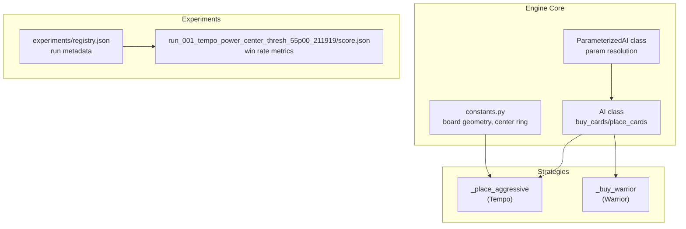
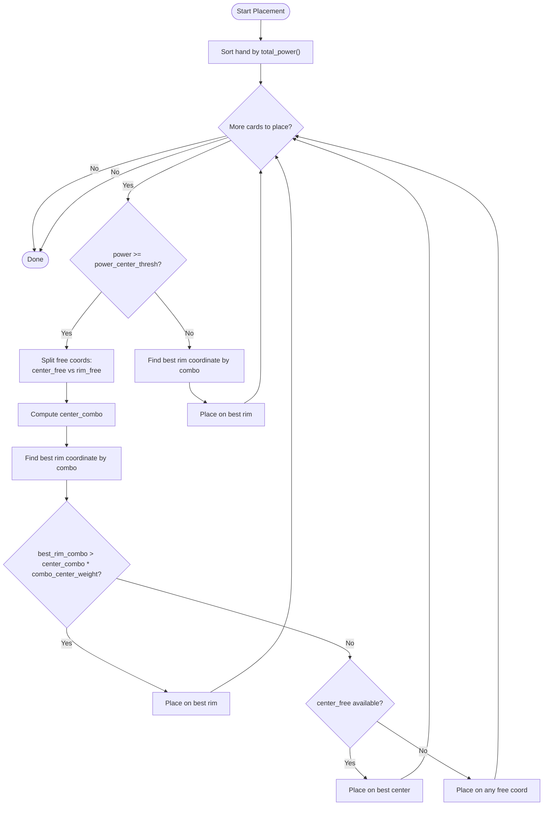
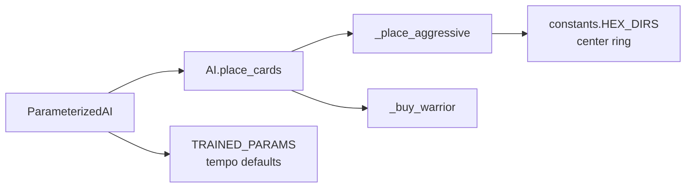

# Tempo Strategy

<cite>
**Referenced Files in This Document**
- [engine_core/ai.py](file://engine_core/ai.py)
- [engine_core/constants.py](file://engine_core/constants.py)
- [AUTOCHESS_HYBRID_FINAL_GDD.md](file://AUTOCHESS_HYBRID_FINAL_GDD.md)
- [experiments/registry.json](file://experiments/registry.json)
- [experiments/runs/run_001_tempo_power_center_thresh_55p00_211919/score.json](file://experiments/runs/run_001_tempo_power_center_thresh_55p00_211919/score.json)
- [_archive/old_dirs/godot_project/scripts/ai.gd](file://_archive/old_dirs/godot_project/scripts/ai.gd)
</cite>

## Table of Contents
1. [Introduction](#introduction)
2. [Project Structure](#project-structure)
3. [Core Components](#core-components)
4. [Architecture Overview](#architecture-overview)
5. [Detailed Component Analysis](#detailed-component-analysis)
6. [Dependency Analysis](#dependency-analysis)
7. [Performance Considerations](#performance-considerations)
8. [Troubleshooting Guide](#troubleshooting-guide)
9. [Conclusion](#conclusion)

## Introduction
This document explains the Tempo Strategy implementation, focusing on its aggressive positioning approach that combines power-focused card selection with a central positioning bias. The strategy balances power optimization against center control using two key parameters:
- power_center_thresh: Threshold determining when a card qualifies for the center.
- combo_center_weight: Weight applied to rim combo scores to decide whether to override center preference.

The Tempo Strategy shares its placement logic with the Warrior Strategy for buying and placement, while maintaining distinct behavioral emphasis. The document covers the parameter system, center proximity scoring, placement decision trees, strategic rationale for early aggressive positioning, parameter tuning across game phases, performance characteristics, and future enhancement possibilities.

## Project Structure
Tempo’s placement logic is implemented in the Python engine core and integrated with the broader AI framework. Key locations:
- Placement engine and parameter system live in engine_core/ai.py.
- Game constants and board geometry (including center ring definitions) live in engine_core/constants.py.
- Strategy parameterization and training harness are documented in AUTOCHESS_HYBRID_FINAL_GDD.md.
- Experimental runs demonstrate parameter sweeps and outcomes in experiments/.



**Diagram sources**
- [engine_core/ai.py:688-700](file://engine_core/ai.py#L688-L700)
- [engine_core/ai.py:1043-1141](file://engine_core/ai.py#L1043-L1141)
- [engine_core/ai.py:1147-1231](file://engine_core/ai.py#L1147-L1231)
- [engine_core/constants.py:65-93](file://engine_core/constants.py#L65-L93)
- [experiments/registry.json:1-40](file://experiments/registry.json#L1-L40)
- [experiments/runs/run_001_tempo_power_center_thresh_55p00_211919/score.json:1-7](file://experiments/runs/run_001_tempo_power_center_thresh_55p00_211919/score.json#L1-L7)

**Section sources**
- [engine_core/ai.py:688-700](file://engine_core/ai.py#L688-L700)
- [engine_core/ai.py:1043-1141](file://engine_core/ai.py#L1043-L1141)
- [engine_core/ai.py:1147-1231](file://engine_core/ai.py#L1147-L1231)
- [engine_core/constants.py:65-93](file://engine_core/constants.py#L65-L93)
- [AUTOCHESS_HYBRID_FINAL_GDD.md:790-800](file://AUTOCHESS_HYBRID_FINAL_GDD.md#L790-L800)
- [experiments/registry.json:1-40](file://experiments/registry.json#L1-L40)
- [experiments/runs/run_001_tempo_power_center_thresh_55p00_211919/score.json:1-7](file://experiments/runs/run_001_tempo_power_center_thresh_55p00_211919/score.json#L1-L7)

## Core Components
- ParameterizedAI: Centralizes parameter resolution across strategies, merges defaults, JSON overrides, and manual overrides, and exposes get_param for strategy-specific access.
- AI.place_cards: Delegates placement to strategy-specific engines; Tempo uses _place_aggressive.
- _place_aggressive: Implements the Tempo aggressive positioning logic with power thresholding and combo-center weighting.
- constants.HEX_DIRS and center ring: Defines axial directions and the center ring coordinates used for proximity scoring.
- TRAINED_PARAMS: Provides default values for tempo.power_center_thresh and tempo.combo_center_weight.

Key behaviors:
- Buying: Tempo delegates to Warrior’s power-focused selection via AI.buy_cards.
- Placement: Tempo prefers center for sufficiently powerful cards but allows rim placement if combo synergy significantly exceeds center.

**Section sources**
- [engine_core/ai.py:1147-1231](file://engine_core/ai.py#L1147-L1231)
- [engine_core/ai.py:688-700](file://engine_core/ai.py#L688-L700)
- [engine_core/ai.py:1043-1141](file://engine_core/ai.py#L1043-L1141)
- [engine_core/constants.py:65-93](file://engine_core/constants.py#L65-L93)
- [AUTOCHESS_HYBRID_FINAL_GDD.md:790-800](file://AUTOCHESS_HYBRID_FINAL_GDD.md#L790-L800)

## Architecture Overview
The Tempo Strategy integrates with the AI framework as follows:
- ParameterizedAI resolves tempo parameters from defaults, JSON overrides, and manual overrides.
- AI.place_cards passes resolved parameters to _place_aggressive.
- _place_aggressive computes center vs rim decisions using combo scoring and applies power_center_thresh and combo_center_weight.

```mermaid
sequenceDiagram
participant P as "Player"
participant PAI as "ParameterizedAI"
participant AI as "AI"
participant Engine as "_place_aggressive"
PAI->>PAI : get_param("tempo","power_center_thresh")
PAI->>PAI : get_param("tempo","combo_center_weight")
PAI->>AI : place_cards(player, rng, pct, ccw)
AI->>Engine : _place_aggressive(player, pct, ccw)
Engine->>Engine : sort hand by total_power()
Engine->>Engine : define center_coords (radius<=1)
loop for each card
Engine->>Engine : if power >= pct
Engine->>Engine : evaluate center_combo and best_rim_combo
Engine->>Engine : if best_rim_combo > center_combo * ccw, choose rim
Engine->>Engine : else choose center (if available)
else
Engine->>Engine : choose best rim coordinate by combo
end
Engine-->>P : place cards on board
```

**Diagram sources**
- [engine_core/ai.py:1223-1231](file://engine_core/ai.py#L1223-L1231)
- [engine_core/ai.py:688-700](file://engine_core/ai.py#L688-L700)
- [engine_core/ai.py:1043-1141](file://engine_core/ai.py#L1043-L1141)

## Detailed Component Analysis

### Parameter System: power_center_thresh and combo_center_weight
- power_center_thresh: Minimum power threshold for a card to be considered for center placement. Cards meeting or exceeding this threshold are evaluated for center vs rim.
- combo_center_weight: Multiplicative weight applied to center combo score when deciding whether rim placement is justified by significantly higher combo synergy.

Behavioral implications:
- Lower power_center_thresh increases center pressure for weaker cards.
- Higher combo_center_weight makes rim placement more likely when rim combo substantially outperforms center.

Default values and training context:
- TRAINED_PARAMS sets tempo.power_center_thresh and tempo.combo_center_weight as defaults.
- Experiment registry documents runs sweeping tempo.power_center_thresh across 55–65.

**Section sources**
- [engine_core/ai.py:1147-1231](file://engine_core/ai.py#L1147-L1231)
- [AUTOCHESS_HYBRID_FINAL_GDD.md:790-800](file://AUTOCHESS_HYBRID_FINAL_GDD.md#L790-L800)
- [experiments/registry.json:1-40](file://experiments/registry.json#L1-L40)

### Center Proximity Scoring
- Center ring: Coordinates within radius 1 around center (0,0) are treated as center.
- Combo scoring: For a given coordinate, count neighbors sharing the card’s dominant group.
- Decision rule: Rim placement is chosen if best_rim_combo > center_combo * combo_center_weight; otherwise center is preferred if available.

Board geometry:
- constants.HEX_DIRS defines axial directions.
- Center ring computed from HEX_DIRS for proximity checks.

**Section sources**
- [engine_core/ai.py:1043-1141](file://engine_core/ai.py#L1043-L1141)
- [engine_core/constants.py:65-93](file://engine_core/constants.py#L65-L93)

### Placement Decision Tree (Tempo)


**Diagram sources**
- [engine_core/ai.py:1043-1141](file://engine_core/ai.py#L1043-L1141)

### Strategic Rationale: Early Aggressive Positioning
- Early game: Prioritize power to establish tempo dominance quickly.
- Center preference: Strong cards are placed at center to maximize immediate impact and control.
- Rim flexibility: When rim placement yields significantly higher combo synergy, Tempo rewards board awareness and synergy optimization.

Historical context:
- Board size increased to reduce center dominance and encourage diverse positioning strategies.

**Section sources**
- [engine_core/constants.py:74-93](file://engine_core/constants.py#L74-L93)
- [AUTOCHESS_HYBRID_FINAL_GDD.md:790-800](file://AUTOCHESS_HYBRID_FINAL_GDD.md#L790-L800)

### Relationship with Warrior Strategy
- Buying: Tempo uses Warrior’s power-focused selection via AI.buy_warrior.
- Placement: Tempo uses its own _place_aggressive logic, distinct from Warrior’s smart-default placement.

Implications:
- Tempo emphasizes aggressive center control while leveraging Warrior’s power prioritization during shopping.
- Placement remains strategy-specific to preserve Tempo’s identity.

**Section sources**
- [engine_core/ai.py:364-379](file://engine_core/ai.py#L364-L379)
- [engine_core/ai.py:688-700](file://engine_core/ai.py#L688-L700)

### Parameter Tuning Across Game Phases
- Early game: Lower power_center_thresh encourages center placement for emerging threats; moderate combo_center_weight preserves center bias.
- Mid game: Increase combo_center_weight to reward synergy when rim offers meaningful benefits.
- Late game: Adjust thresholds to maintain tempo while adapting to board composition.

Training evidence:
- Experiment registry shows tempo.power_center_thresh sweeps (55–65) with neutral or modest fitness outcomes.

**Section sources**
- [experiments/registry.json:1-40](file://experiments/registry.json#L1-L40)
- [experiments/runs/run_001_tempo_power_center_thresh_55p00_211919/score.json:1-7](file://experiments/runs/run_001_tempo_power_center_thresh_55p00_211919/score.json#L1-L7)

### Performance Characteristics
- Placement complexity: _place_aggressive iterates over free coordinates to compute combo scores; bounded by available spaces and center ring size.
- Parameterization overhead: ParameterizedAI caches merged parameters once per game, avoiding runtime lookup regressions.
- Trade-offs: Center bias reduces variance in high-power scenarios; rim flexibility improves synergy capture when justified.

**Section sources**
- [engine_core/ai.py:1147-1231](file://engine_core/ai.py#L1147-L1231)
- [engine_core/ai.py:1043-1141](file://engine_core/ai.py#L1043-L1141)

### Future Enhancement Possibilities
- Opponent awareness: Adjust tempo_dominance based on opponent context to modulate aggression.
- Dynamic thresholds: Adapt power_center_thresh and combo_center_weight based on game state and opponent strategies.
- Non-deterministic selection: Introduce variance controls per strategy to improve robustness.
- Meta adaptation: Detect meta trends (e.g., frequent strong units) and tune parameters accordingly.

[No sources needed since this section provides general guidance]

## Dependency Analysis


**Diagram sources**
- [engine_core/ai.py:1147-1231](file://engine_core/ai.py#L1147-L1231)
- [engine_core/ai.py:688-700](file://engine_core/ai.py#L688-L700)
- [engine_core/ai.py:1043-1141](file://engine_core/ai.py#L1043-L1141)
- [engine_core/constants.py:65-93](file://engine_core/constants.py#L65-L93)

**Section sources**
- [engine_core/ai.py:1147-1231](file://engine_core/ai.py#L1147-L1231)
- [engine_core/ai.py:688-700](file://engine_core/ai.py#L688-L700)
- [engine_core/ai.py:1043-1141](file://engine_core/ai.py#L1043-L1141)
- [engine_core/constants.py:65-93](file://engine_core/constants.py#L65-L93)

## Performance Considerations
- Parameter caching: ParameterizedAI loads and merges parameters once per game, minimizing runtime overhead.
- Placement budgeting: AI uses time budgets and limited coordinate checks to keep placement responsive.
- Center ring optimization: Limiting evaluation to center ring and rim reduces unnecessary computations.

[No sources needed since this section provides general guidance]

## Troubleshooting Guide
Common issues and remedies:
- Unexpected center placement: Verify power_center_thresh is not too low; increase to force rim placement when combo is significantly better.
- Poor synergy capture: Increase combo_center_weight to allow rim placement when rim combo exceeds center by a meaningful margin.
- Parameter overrides not taking effect: Ensure trained_params.json is valid and ParameterizedAI is initialized with the desired strategy and parameters.

**Section sources**
- [engine_core/ai.py:1147-1231](file://engine_core/ai.py#L1147-L1231)
- [engine_core/ai.py:1043-1141](file://engine_core/ai.py#L1043-L1141)

## Conclusion
The Tempo Strategy blends power-focused selection with aggressive center positioning, guided by power_center_thresh and combo_center_weight. Its placement logic is implemented in _place_aggressive, while parameterization is handled centrally via ParameterizedAI. Experiments demonstrate parameter sweeps and neutral outcomes, indicating room for refinement. Future enhancements could incorporate opponent awareness, dynamic thresholds, and variance controls to strengthen Tempo’s adaptability and performance.