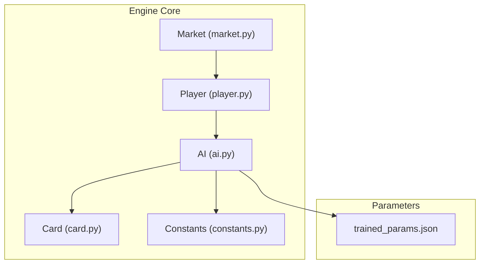
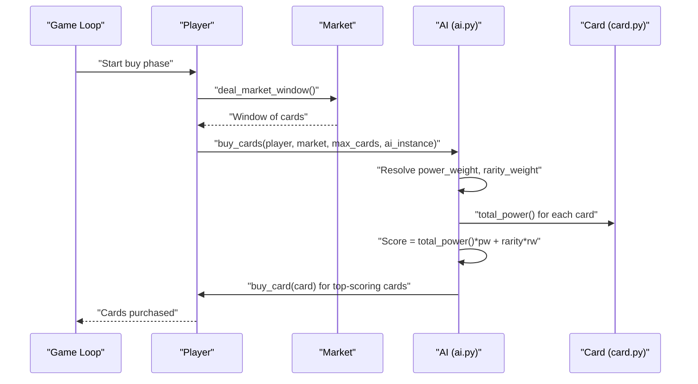
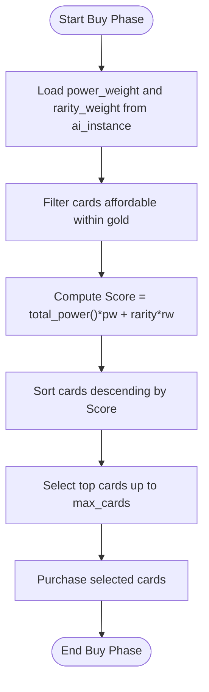
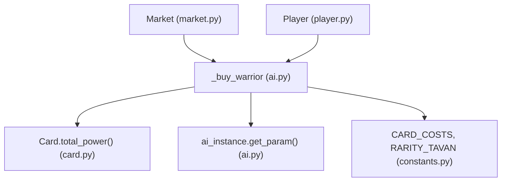

# Warrior Strategy

<cite>
**Referenced Files in This Document**
- [ai.py](file://engine_core/ai.py)
- [card.py](file://engine_core/card.py)
- [constants.py](file://engine_core/constants.py)
- [player.py](file://engine_core/player.py)
- [market.py](file://engine_core/market.py)
- [trained_params.json](file://trained_params.json)
- [POWER_PER_GOLD_TABLE.md](file://docs/reports/POWER_PER_GOLD_TABLE.md)
</cite>

## Table of Contents
1. [Introduction](#introduction)
2. [Project Structure](#project-structure)
3. [Core Components](#core-components)
4. [Architecture Overview](#architecture-overview)
5. [Detailed Component Analysis](#detailed-component-analysis)
6. [Dependency Analysis](#dependency-analysis)
7. [Performance Considerations](#performance-considerations)
8. [Troubleshooting Guide](#troubleshooting-guide)
9. [Conclusion](#conclusion)

## Introduction
This document explains the Warrior Strategy implementation, focusing on the power-focused card selection algorithm that prioritizes cards with the highest total_power() values. It documents the parameter system using power_weight and rarity_weight coefficients for balancing power vs rarity preferences, provides concrete examples of card scoring and decision-making, and clarifies the relationship with the Tempo strategy (which currently uses warrior logic). It also covers performance characteristics and tuning scenarios for optimizing the power curve and rarity selection balance.

## Project Structure
The Warrior Strategy resides in the engine_core module and integrates with the card database, market mechanics, and parameter management system. Key files include:
- engine_core/ai.py: Contains the AI class with strategy implementations, including the Warrior logic and parameter access helpers.
- engine_core/card.py: Defines the Card class and total_power() calculation used by the Warrior algorithm.
- engine_core/constants.py: Provides CARD_COSTS and RARITY_TAVAN used for power normalization and scoring.
- engine_core/player.py: Manages player state and strategy assignment.
- engine_core/market.py: Handles market windows and rarity availability weighting.
- trained_params.json: Stores strategy parameters, including the default power_weight and rarity_weight for Warrior.

**Diagram sources**
- [ai.py](file://engine_core/ai.py)
- [card.py](file://engine_core/card.py)
- [constants.py](file://engine_core/constants.py)
- [player.py](file://engine_core/player.py)
- [market.py](file://engine_core/market.py)
- [trained_params.json](file://trained_params.json)

**Section sources**
- [ai.py](file://engine_core/ai.py)
- [card.py](file://engine_core/card.py)
- [constants.py](file://engine_core/constants.py)
- [player.py](file://engine_core/player.py)
- [market.py](file://engine_core/market.py)
- [trained_params.json](file://trained_params.json)

## Core Components
- Warrior card selection algorithm:
  - Sorts affordable cards by a weighted score: total_power() × power_weight + rarity_map[rarity] × rarity_weight.
  - The rarity_map converts rarity strings to numeric tiers for additive weighting.
  - The ai_instance parameter supplies strategy-specific power_weight and rarity_weight values, enabling dynamic tuning.
- Parameter system:
  - power_weight: emphasis on raw power (total_power()).
  - rarity_weight: emphasis on rarity tier (converted to numeric).
  - Defaults are defined in trained_params.json under the "warrior" strategy.
- Relationship with Tempo:
  - Tempo currently delegates to the same warrior logic path, inheriting the same parameters and scoring mechanism.

Key implementation references:
- Warrior scoring and selection: [ai.py](file://engine_core/ai.py)
- Card total_power(): [card.py](file://engine_core/card.py)
- Rarity and cost constants: [constants.py](file://engine_core/constants.py)
- Parameter defaults: [trained_params.json](file://trained_params.json)

**Section sources**
- [ai.py](file://engine_core/ai.py)
- [card.py](file://engine_core/card.py)
- [constants.py](file://engine_core/constants.py)
- [trained_params.json](file://trained_params.json)

## Architecture Overview
The Warrior Strategy participates in the card-buying phase. The AI selects cards from the market window based on a deterministic scoring formula and purchases up to a configured limit.

**Diagram sources**
- [ai.py](file://engine_core/ai.py)
- [card.py](file://engine_core/card.py)
- [market.py](file://engine_core/market.py)
- [player.py](file://engine_core/player.py)

## Detailed Component Analysis

### Warrior Strategy Scoring and Selection
The Warrior strategy sorts cards by a linear combination of power and rarity, controlled by strategy parameters:
- Score = total_power(card) × power_weight + rarity_map[rarity] × rarity_weight
- Cards are sorted descending by score and purchased up to max_cards.

**Diagram sources**
- [ai.py](file://engine_core/ai.py)
- [card.py](file://engine_core/card.py)
- [constants.py](file://engine_core/constants.py)

**Section sources**
- [ai.py](file://engine_core/ai.py)
- [card.py](file://engine_core/card.py)
- [constants.py](file://engine_core/constants.py)

### Parameter System: power_weight and rarity_weight
- power_weight: Controls how much total_power() contributes to the score.
- rarity_weight: Controls how much rarity tier contributes to the score.
- Defaults:
  - power_weight: 1.0
  - rarity_weight: 0.0
- These defaults emphasize pure power selection, aligning with the Warrior identity.

Practical implications:
- Increasing power_weight increases focus on high total_power() cards.
- Increasing rarity_weight increases preference for higher rarity tiers, even if absolute power is slightly lower.

**Section sources**
- [trained_params.json](file://trained_params.json)
- [ai.py](file://engine_core/ai.py)

### Relationship with Tempo Strategy
- Tempo currently uses the same warrior logic path in the buy_cards dispatcher.
- As a result, Tempo inherits the same power_weight and rarity_weight parameters from the "tempo" strategy bucket.
- This means Tempo’s card selection follows the same scoring formula as Warrior, with whatever parameters are set for "tempo".

Implications:
- To tune Tempo differently from Warrior, define separate parameters for "tempo" in the parameter source.
- Until then, Tempo and Warrior share identical selection behavior.

**Section sources**
- [ai.py](file://engine_core/ai.py)
- [trained_params.json](file://trained_params.json)

### Concrete Examples: Card Scoring and Decision-Making
Below are example scenarios demonstrating how the scoring formula influences decisions. These examples illustrate relative comparisons rather than exact values.

Example 1: Power-dominant scenario
- Two cards:
  - Card A: total_power = 40, rarity = "3"
  - Card B: total_power = 38, rarity = "4"
- With power_weight = 1.0, rarity_weight = 0.0:
  - Score(A) = 40 × 1.0 + 0 = 40
  - Score(B) = 38 × 1.0 + 0 = 38
  - Decision: Choose Card A.

Example 2: Rarity-dominant scenario
- Same cards as above, but with power_weight = 0.5, rarity_weight = 1.0:
  - rarity_map["3"] = 3, rarity_map["4"] = 4
  - Score(A) = 40 × 0.5 + 3 × 1.0 = 23
  - Score(B) = 38 × 0.5 + 4 × 1.0 = 23
  - Decision: Tie resolved by secondary criteria (e.g., reverse-sort by total_power() or random tie-break).

Example 3: Mixed scenario with balanced weights
- power_weight = 0.6, rarity_weight = 0.4
- rarity_map["3"] = 3, rarity_map["4"] = 4
- Score(A) = 40 × 0.6 + 3 × 0.4 = 25.2
- Score(B) = 38 × 0.6 + 4 × 0.4 = 25.6
- Decision: Choose Card B.

These examples demonstrate how adjusting power_weight and rarity_weight shifts the balance between raw power and rarity.

**Section sources**
- [ai.py](file://engine_core/ai.py)
- [card.py](file://engine_core/card.py)
- [constants.py](file://engine_core/constants.py)

### Parameter Influence on Selection Behavior
- Higher power_weight:
  - Favors cards with higher total_power(), even if rarity is lower.
- Higher rarity_weight:
  - Favors higher rarity cards, potentially at the expense of marginally lower total_power().
- Combined weights:
  - Allow fine-tuning of the power curve vs. rarity selection trade-off.

Tuning guidance:
- Increase power_weight to emphasize aggressive power spikes.
- Increase rarity_weight to encourage acquiring higher-tier cards earlier.
- Balance both to maintain a responsive power curve while preserving rarity selection.

**Section sources**
- [trained_params.json](file://trained_params.json)
- [ai.py](file://engine_core/ai.py)

### Performance Characteristics
- Time complexity:
  - Sorting affordable cards by score is O(n log n), where n is the number of affordable cards.
  - Computing total_power() per card is O(s) per card, where s is the number of stats; typically small and bounded.
- Memory:
  - Temporary lists for filtering and sorting are proportional to n.
- Practical considerations:
  - The scoring is deterministic and fast, suitable for real-time gameplay.
  - Parameter access via ai_instance is constant-time dictionary lookups.

**Section sources**
- [ai.py](file://engine_core/ai.py)
- [card.py](file://engine_core/card.py)

## Dependency Analysis
The Warrior Strategy depends on:
- Card scoring via total_power() and rarity tiers.
- Parameter access through ai_instance (or defaults).
- Market affordability determined by CARD_COSTS.

**Diagram sources**
- [ai.py](file://engine_core/ai.py)
- [card.py](file://engine_core/card.py)
- [constants.py](file://engine_core/constants.py)
- [market.py](file://engine_core/market.py)
- [player.py](file://engine_core/player.py)

**Section sources**
- [ai.py](file://engine_core/ai.py)
- [card.py](file://engine_core/card.py)
- [constants.py](file://engine_core/constants.py)
- [market.py](file://engine_core/market.py)
- [player.py](file://engine_core/player.py)

## Performance Considerations
- Keep max_cards low to reduce sorting overhead during the buy phase.
- Avoid excessive parameter churn during a single game; parameters are loaded once and cached.
- The rarity cost adjustments documented in the power-per-gold report improve accessibility of higher rarities without changing the Warrior scoring logic, indirectly supporting better selection balance.

[No sources needed since this section provides general guidance]

## Troubleshooting Guide
Common issues and resolutions:
- Unexpected card choices:
  - Verify power_weight and rarity_weight values in the active parameter source.
  - Confirm the market window reflects current turn rarity weights.
- Parameter not taking effect:
  - Ensure ai_instance is passed to AI.buy_cards() and that the parameter source is valid.
  - Check for typos in strategy bucket names ("warrior" vs. "tempo").
- Rarity imbalance concerns:
  - Adjust rarity_weight upward to increase preference for higher rarities.
  - Review the power-per-gold efficiency report to confirm cost scaling supports intended rarity selection.

**Section sources**
- [trained_params.json](file://trained_params.json)
- [ai.py](file://engine_core/ai.py)
- [POWER_PER_GOLD_TABLE.md](file://docs/reports/POWER_PER_GOLD_TABLE.md)

## Conclusion
The Warrior Strategy implements a straightforward, parameterizable card selection algorithm that emphasizes total_power() with optional weighting for rarity. Its scoring formula enables precise tuning of the power curve versus rarity selection balance. Because Tempo currently uses the same logic path, it inherits the same parameters and behavior. With clear parameter controls and deterministic performance, the Warrior Strategy offers a robust foundation for power-focused gameplay while remaining adaptable to evolving balance needs.