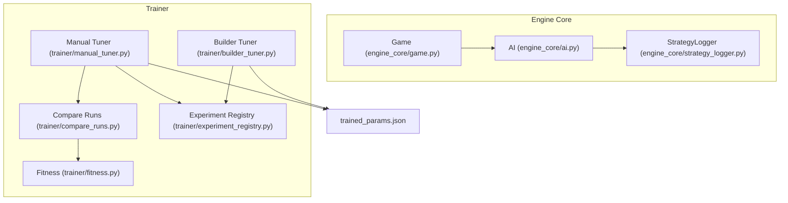
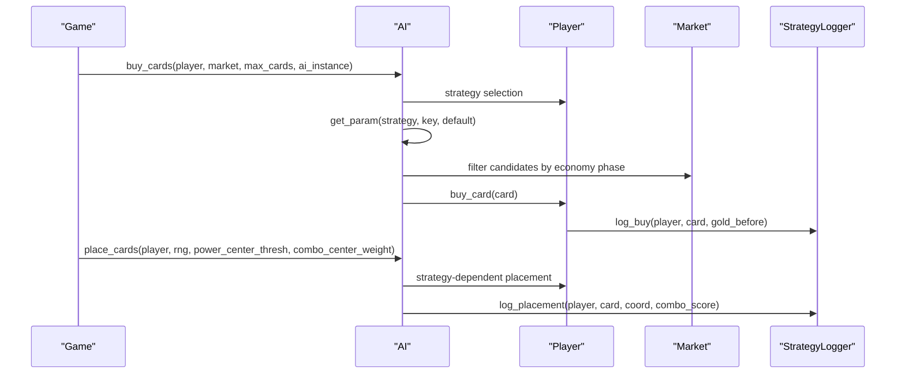
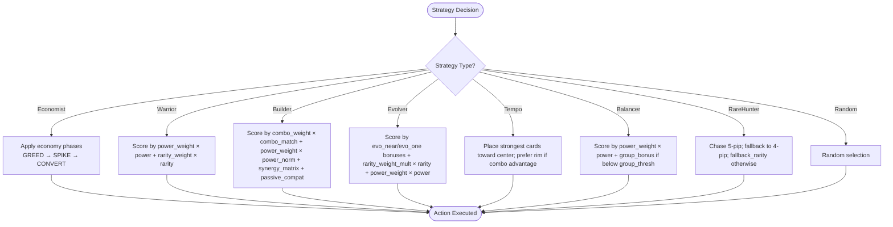
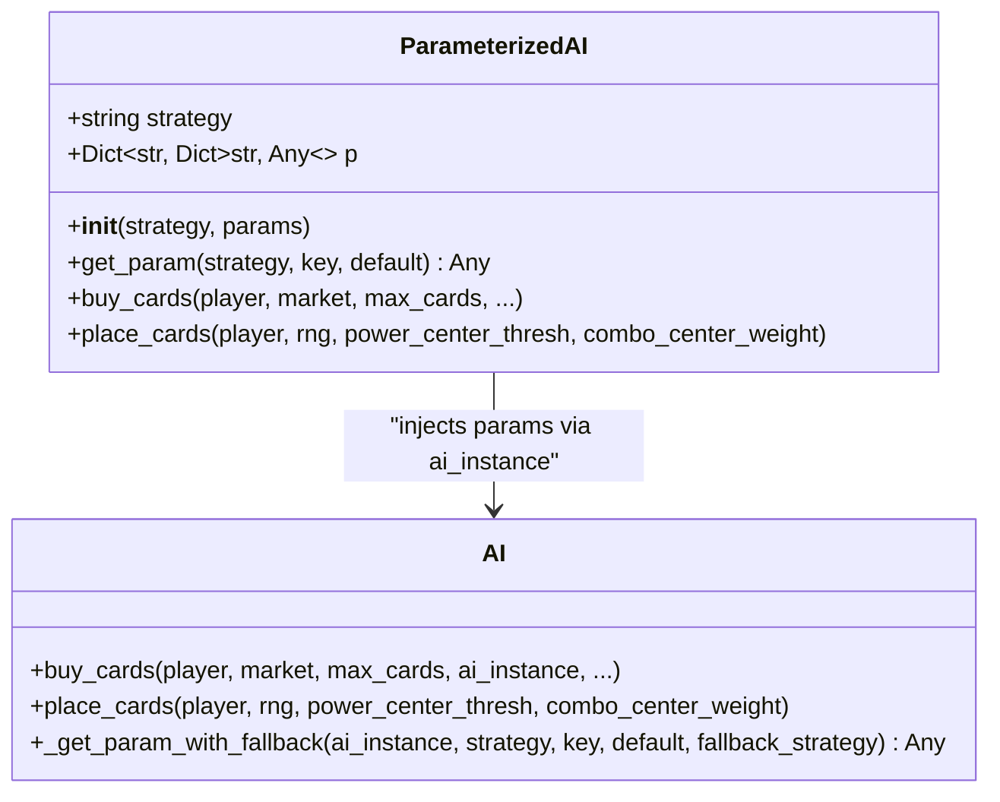
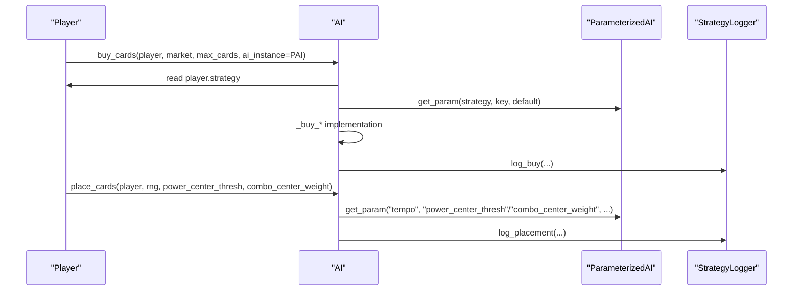
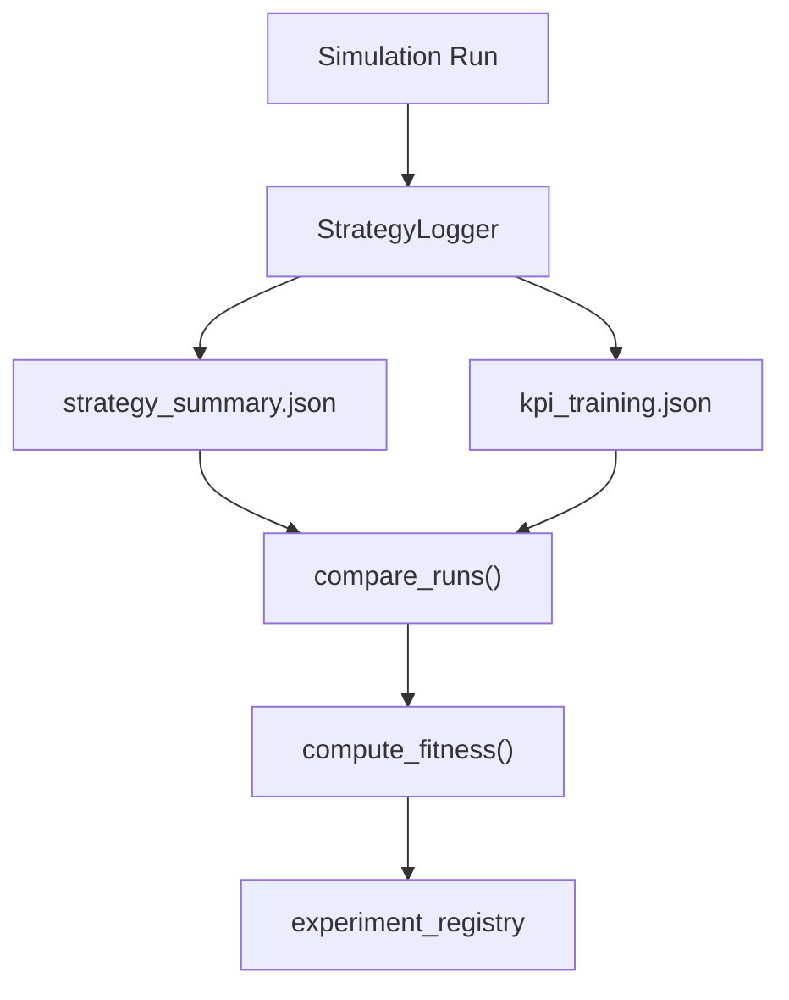
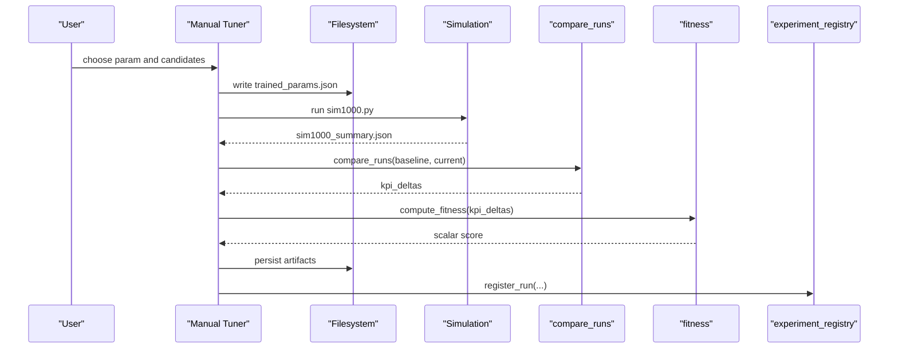
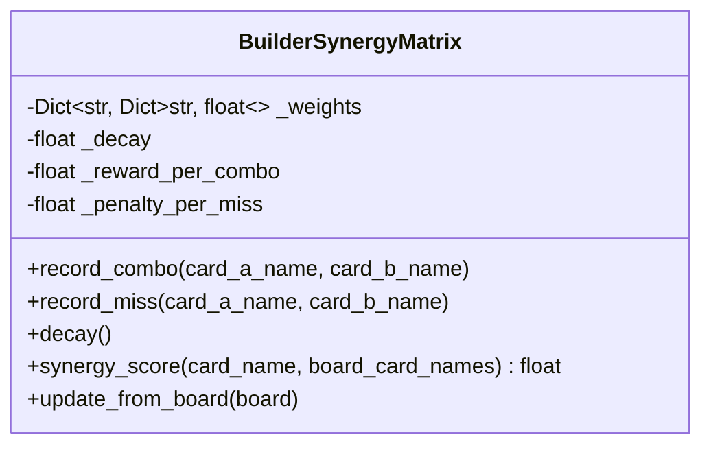
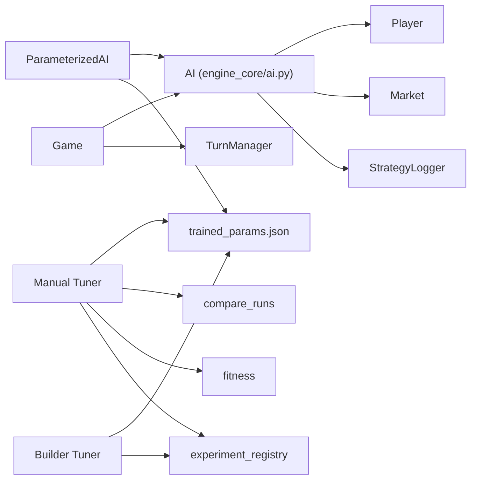

# AI Strategy System

<cite>
**Referenced Files in This Document**
- [engine_core/ai.py](file://engine_core/ai.py)
- [engine_core/game.py](file://engine_core/game.py)
- [engine_core/strategy_logger.py](file://engine_core/strategy_logger.py)
- [trainer/manual_tuner.py](file://trainer/manual_tuner.py)
- [trainer/builder_tuner.py](file://trainer/builder_tuner.py)
- [trainer/fitness.py](file://trainer/fitness.py)
- [trainer/compare_runs.py](file://trainer/compare_runs.py)
- [trainer/experiment_registry.py](file://trainer/experiment_registry.py)
- [trained_params.json](file://trained_params.json)
</cite>

## Table of Contents
1. [Introduction](#introduction)
2. [Project Structure](#project-structure)
3. [Core Components](#core-components)
4. [Architecture Overview](#architecture-overview)
5. [Detailed Component Analysis](#detailed-component-analysis)
6. [Dependency Analysis](#dependency-analysis)
7. [Performance Considerations](#performance-considerations)
8. [Troubleshooting Guide](#troubleshooting-guide)
9. [Conclusion](#conclusion)
10. [Appendices](#appendices)

## Introduction
This document describes the AI Strategy System used by the AutoChess Hybrid engine. It explains the multiple AI strategy implementations (Economist, Warrior, Builder, Evolver, Tempo, Balancer, Rare Hunter, and Random), the parameter management system (strategy parameters, parameter tuning, and parameter precedence), the strategy selection mechanism, and the performance monitoring and experimentation framework. It provides both conceptual overviews for beginners and technical details for advanced users optimizing strategies.

## Project Structure
The AI Strategy System spans several modules:
- Strategy implementations and parameter injection live in engine_core/ai.py
- Strategy analytics and KPI logging live in engine_core/strategy_logger.py
- Experiment orchestration and tuning live in trainer/*.py
- Strategy parameters are persisted in trained_params.json
- The Game engine integrates AI decisions during turns

**Diagram sources**
- [engine_core/ai.py:1147-1231](file://engine_core/ai.py#L1147-L1231)
- [engine_core/game.py:35-104](file://engine_core/game.py#L35-L104)
- [engine_core/strategy_logger.py:52-591](file://engine_core/strategy_logger.py#L52-L591)
- [trainer/manual_tuner.py:1-566](file://trainer/manual_tuner.py#L1-L566)
- [trainer/builder_tuner.py:1-623](file://trainer/builder_tuner.py#L1-L623)
- [trainer/fitness.py:1-175](file://trainer/fitness.py#L1-L175)
- [trainer/compare_runs.py:1-274](file://trainer/compare_runs.py#L1-L274)
- [trainer/experiment_registry.py:1-144](file://trainer/experiment_registry.py#L1-L144)
- [trained_params.json:1-49](file://trained_params.json#L1-L49)

**Section sources**
- [engine_core/ai.py:1147-1231](file://engine_core/ai.py#L1147-L1231)
- [engine_core/game.py:35-104](file://engine_core/game.py#L35-L104)
- [engine_core/strategy_logger.py:52-591](file://engine_core/strategy_logger.py#L52-L591)
- [trainer/manual_tuner.py:1-566](file://trainer/manual_tuner.py#L1-L566)
- [trainer/builder_tuner.py:1-623](file://trainer/builder_tuner.py#L1-L623)
- [trainer/fitness.py:1-175](file://trainer/fitness.py#L1-L175)
- [trainer/compare_runs.py:1-274](file://trainer/compare_runs.py#L1-L274)
- [trainer/experiment_registry.py:1-144](file://trainer/experiment_registry.py#L1-L144)
- [trained_params.json:1-49](file://trained_params.json#L1-L49)

## Core Components
- AI: Central orchestrator for strategy selection, buying, and placement. Implements Economist, Warrior, Builder, Evolver, Tempo, Balancer, Rare Hunter, and Random strategies.
- ParameterizedAI: Provides strategy parameters via three-tier precedence and exposes get_param for strategy-specific parameter access.
- BuilderSynergyMatrix: Session-level synergy memory for the Builder strategy to improve combo placement over time.
- StrategyLogger: Comprehensive logging of placement events, combat outcomes, buying decisions, and KPI aggregation for performance analysis.
- Trainer modules: Automated tuning and experimentation for parameter sweeps, fitness evaluation, and run registration.

Key concepts:
- Strategy parameters: Values controlling strategy behavior (e.g., thresholds, weights, counts).
- Fitness evaluation: Scalar score computed from KPI deltas relative to a dynamic baseline.
- Parameter tuning: Controlled experiments sweeping one or multiple parameters to optimize fitness.

**Section sources**
- [engine_core/ai.py:214-1231](file://engine_core/ai.py#L214-L1231)
- [engine_core/strategy_logger.py:52-591](file://engine_core/strategy_logger.py#L52-L591)
- [trainer/manual_tuner.py:1-566](file://trainer/manual_tuner.py#L1-L566)
- [trainer/builder_tuner.py:1-623](file://trainer/builder_tuner.py#L1-L623)
- [trainer/fitness.py:1-175](file://trainer/fitness.py#L1-L175)

## Architecture Overview
The AI Strategy System integrates strategy selection, parameter access, and performance monitoring across the engine and trainer layers.

**Diagram sources**
- [engine_core/ai.py:351-799](file://engine_core/ai.py#L351-L799)
- [engine_core/strategy_logger.py:140-354](file://engine_core/strategy_logger.py#L140-L354)
- [engine_core/game.py:157-171](file://engine_core/game.py#L157-L171)

## Detailed Component Analysis

### Strategy Implementations
- Economist: Phase-aware economy-driven buying with three phases (GREED, SPIKE, CONVERT) guided by thresholds and buy counts.
- Warrior: Power-focused buying prioritizing total power with configurable power and rarity weights.
- Builder: Combo-first buying with economy controls; uses BuilderSynergyMatrix for learned synergy bonuses.
- Evolver: Evolution-aware buying focusing on cards near evolution or single copies.
- Tempo: Aggressive power-centric placement with center preference and combo-aware rim placement.
- Balancer: Balanced buying emphasizing group diversity with a group bonus threshold.
- Rare Hunter: High-rarity chasing with fallback rarity parameterization.
- Random: Uninformed random selection for baseline comparisons.

**Diagram sources**
- [engine_core/ai.py:235-686](file://engine_core/ai.py#L235-L686)

**Section sources**
- [engine_core/ai.py:235-686](file://engine_core/ai.py#L235-L686)

### Parameter Management System
- Three-tier precedence:
  1) TRAINED_PARAMS defaults (hardcoded)
  2) trained_params.json overrides (partial OK)
  3) Manual constructor overrides (highest priority)
- ParameterizedAI.get_param provides safe access with fallbacks and optional cross-strategy fallbacks.
- Parameter loading is crash-proof and performed once at initialization.

**Diagram sources**
- [engine_core/ai.py:1147-1231](file://engine_core/ai.py#L1147-L1231)
- [engine_core/ai.py:214-233](file://engine_core/ai.py#L214-L233)

**Section sources**
- [engine_core/ai.py:78-114](file://engine_core/ai.py#L78-L114)
- [engine_core/ai.py:1147-1231](file://engine_core/ai.py#L1147-L1231)
- [trained_params.json:1-49](file://trained_params.json#L1-L49)

### Strategy Selection Mechanisms
- Player.strategy determines which branch of AI.buy_cards is executed.
- AI.place_cards routes to strategy-specific placement logic.
- Tempo’s placement parameters are resolved from ParameterizedAI.

**Diagram sources**
- [engine_core/ai.py:351-799](file://engine_core/ai.py#L351-L799)
- [engine_core/strategy_logger.py:140-354](file://engine_core/strategy_logger.py#L140-L354)

**Section sources**
- [engine_core/ai.py:351-799](file://engine_core/ai.py#L351-L799)
- [engine_core/game.py:35-104](file://engine_core/game.py#L35-L104)

### Performance Monitoring and Analytics
- StrategyLogger captures placement, combat, buying, and game-end events; aggregates KPIs into strategy_summary.json and kpi_training.json.
- KPI groups include placement efficiency, combat effectiveness, economy management, passive synergy, snowball/tempo, and card quality.
- compare_runs computes deltas relative to a baseline and enriches with kpi_training.json oracle values.
- fitness.compute_fitness produces a scalar score used for ranking experiments.

**Diagram sources**
- [engine_core/strategy_logger.py:366-500](file://engine_core/strategy_logger.py#L366-L500)
- [trainer/compare_runs.py:35-199](file://trainer/compare_runs.py#L35-L199)
- [trainer/fitness.py:48-148](file://trainer/fitness.py#L48-L148)
- [trainer/experiment_registry.py:39-94](file://trainer/experiment_registry.py#L39-L94)

**Section sources**
- [engine_core/strategy_logger.py:366-500](file://engine_core/strategy_logger.py#L366-L500)
- [trainer/compare_runs.py:35-199](file://trainer/compare_runs.py#L35-L199)
- [trainer/fitness.py:48-148](file://trainer/fitness.py#L48-L148)
- [trainer/experiment_registry.py:39-94](file://trainer/experiment_registry.py#L39-L94)

### AI Research Framework and Automated Experimentation
- Manual Tuner: Sweeps one parameter at a time using dot-notation keys, runs simulations, compares results, computes fitness, persists artifacts, and registers runs.
- Builder Tuner: Grid-sweeps four builder parameters, computes a composite fitness, and promotes best runs.
- Experiment Registry: Tracks runs, best run, and prints summaries.

**Diagram sources**
- [trainer/manual_tuner.py:249-331](file://trainer/manual_tuner.py#L249-L331)
- [trainer/compare_runs.py:35-199](file://trainer/compare_runs.py#L35-L199)
- [trainer/fitness.py:48-148](file://trainer/fitness.py#L48-L148)
- [trainer/experiment_registry.py:39-94](file://trainer/experiment_registry.py#L39-L94)

**Section sources**
- [trainer/manual_tuner.py:1-566](file://trainer/manual_tuner.py#L1-L566)
- [trainer/builder_tuner.py:1-623](file://trainer/builder_tuner.py#L1-L623)
- [trainer/compare_runs.py:1-274](file://trainer/compare_runs.py#L1-L274)
- [trainer/fitness.py:1-175](file://trainer/fitness.py#L1-L175)
- [trainer/experiment_registry.py:1-144](file://trainer/experiment_registry.py#L1-L144)

### Builder Synergy Matrix
- Maintains pairwise synergy weights between cards based on whether they formed combos on the board.
- Updates after placements and decays over time to prevent permanent bias.
- Used by Builder strategy to improve combo placement.

**Diagram sources**
- [engine_core/ai.py:135-208](file://engine_core/ai.py#L135-L208)

**Section sources**
- [engine_core/ai.py:135-208](file://engine_core/ai.py#L135-L208)

### Practical Examples

- Strategy selection
  - Set player.strategy to "economist", "warrior", "builder", "evolver", "tempo", "balancer", "rare_hunter", or "random".
  - AI.buy_cards delegates to the corresponding _buy_* method based on player.strategy.

- Parameter configuration
  - Modify trained_params.json to override defaults for a strategy (e.g., tempo.power_center_thresh).
  - Use ParameterizedAI constructor to supply manual overrides for the active strategy.

- Performance analysis
  - Run simulations to produce strategy_summary.json and kpi_training.json.
  - Use compare_runs to compute deltas and fitness.compute_fitness to score experiments.
  - Inspect experiment_registry for run metadata and best-run tracking.

**Section sources**
- [engine_core/ai.py:351-799](file://engine_core/ai.py#L351-L799)
- [engine_core/ai.py:1147-1231](file://engine_core/ai.py#L1147-L1231)
- [engine_core/strategy_logger.py:366-500](file://engine_core/strategy_logger.py#L366-L500)
- [trainer/compare_runs.py:35-199](file://trainer/compare_runs.py#L35-L199)
- [trainer/fitness.py:48-148](file://trainer/fitness.py#L48-L148)
- [trainer/experiment_registry.py:39-94](file://trainer/experiment_registry.py#L39-L94)

## Dependency Analysis
- AI depends on Player, Market, constants, and StrategyLogger for logging.
- ParameterizedAI depends on TRAINED_PARAMS defaults and trained_params.json.
- Trainer modules depend on StrategyLogger outputs and experiment registry for persistence and reporting.
- Game integrates AI via ai_override and delegates turn phases to TurnManager.

**Diagram sources**
- [engine_core/ai.py:214-1231](file://engine_core/ai.py#L214-L1231)
- [engine_core/game.py:35-104](file://engine_core/game.py#L35-L104)
- [trainer/manual_tuner.py:1-566](file://trainer/manual_tuner.py#L1-L566)
- [trainer/builder_tuner.py:1-623](file://trainer/builder_tuner.py#L1-L623)
- [trainer/compare_runs.py:1-274](file://trainer/compare_runs.py#L1-L274)
- [trainer/fitness.py:1-175](file://trainer/fitness.py#L1-L175)
- [trainer/experiment_registry.py:1-144](file://trainer/experiment_registry.py#L1-L144)

**Section sources**
- [engine_core/ai.py:214-1231](file://engine_core/ai.py#L214-L1231)
- [engine_core/game.py:35-104](file://engine_core/game.py#L35-L104)
- [trainer/manual_tuner.py:1-566](file://trainer/manual_tuner.py#L1-L566)
- [trainer/builder_tuner.py:1-623](file://trainer/builder_tuner.py#L1-L623)
- [trainer/compare_runs.py:1-274](file://trainer/compare_runs.py#L1-L274)
- [trainer/fitness.py:1-175](file://trainer/fitness.py#L1-L175)
- [trainer/experiment_registry.py:1-144](file://trainer/experiment_registry.py#L1-L144)

## Performance Considerations
- ParameterizedAI performs JSON loading once at initialization and uses O(1) dictionary lookups at runtime, ensuring zero performance regression.
- Placement engines enforce time budgets and coordinate checks to avoid combinatorial blow-ups (e.g., lookahead pruning).
- StrategyLogger buffers events and flushes periodically to minimize I/O overhead.

[No sources needed since this section provides general guidance]

## Troubleshooting Guide
- Parameter loading failures: load_all_strategy_params returns an empty dict on JSON decode errors or missing files; ensure trained_params.json is valid.
- Simulation crashes: compare_runs and fitness handle missing or corrupted outputs by returning neutral scores; check simulation logs and rerun with deterministic seeds.
- Registry issues: experiment_registry maintains append-only run history; malformed registry.json is handled gracefully by falling back to defaults.

**Section sources**
- [engine_core/ai.py:94-103](file://engine_core/ai.py#L94-L103)
- [trainer/compare_runs.py:20-27](file://trainer/compare_runs.py#L20-L27)
- [trainer/fitness.py:83-94](file://trainer/fitness.py#L83-L94)
- [trainer/experiment_registry.py:24-30](file://trainer/experiment_registry.py#L24-L30)

## Conclusion
The AI Strategy System combines modular strategy implementations, robust parameter management, and a comprehensive experimentation framework. It enables precise parameter tuning, reliable performance monitoring, and iterative improvement through automated experimentation. By leveraging strategy parameters, fitness evaluation, and synergy matrices, teams can optimize strategies for both competitive play and balanced gameplay.

[No sources needed since this section summarizes without analyzing specific files]

## Appendices

### Strategy Parameter Reference
- Economist: greed_turn_end, spike_turn_end, greed_gold_thresh, spike_r4_thresh, thresh_high, buy_2_thresh, spike_buy_count, convert_r5_thresh, convert_buy_count
- Warrior: power_weight, rarity_weight
- Builder: combo_weight (or legacy group_weight), power_weight, greed_turn_end, spike_turn_end, greed_gold_thresh, spike_r4_thresh, convert_r5_thresh, spike_buy_count, convert_buy_count
- Evolver: evo_near_bonus, evo_one_bonus, rarity_weight_mult, power_weight
- Balancer: group_bonus, group_thresh, power_weight
- Rare Hunter: fallback_rarity
- Tempo: power_center_thresh, combo_center_weight
- Random: {}

**Section sources**
- [engine_core/ai.py:9-60](file://engine_core/ai.py#L9-L60)
- [trained_params.json:1-49](file://trained_params.json#L1-L49)