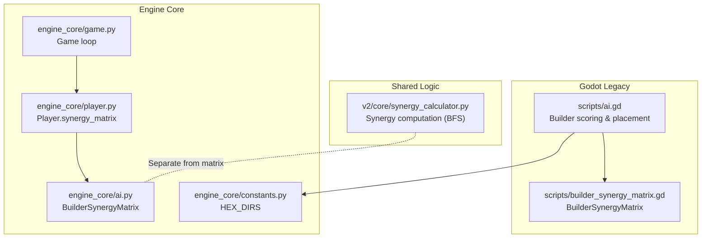
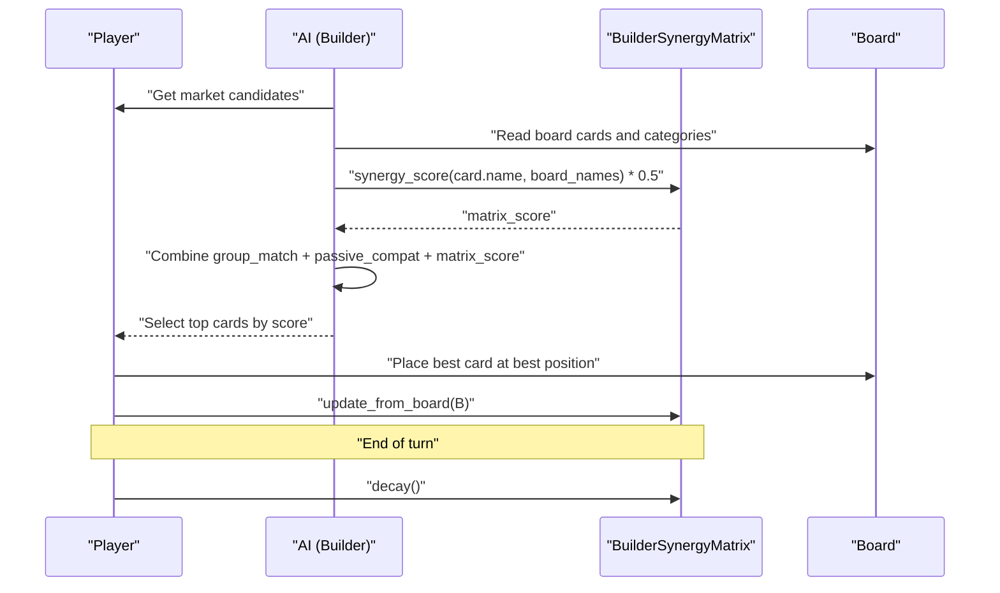
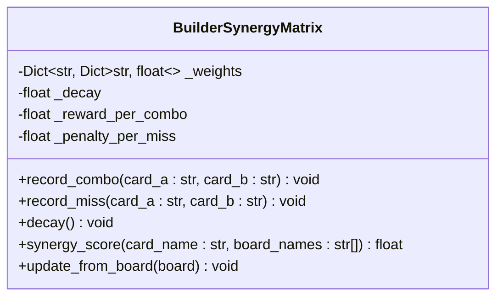
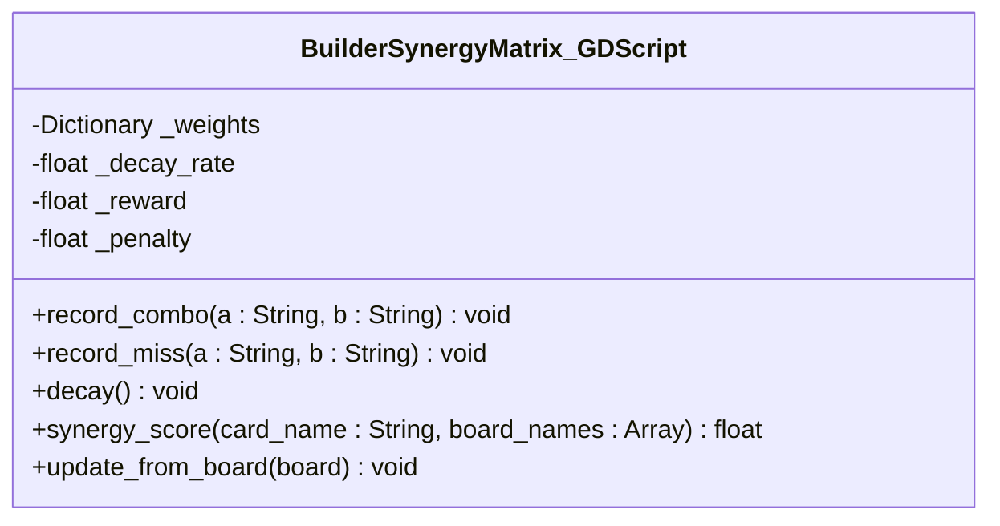
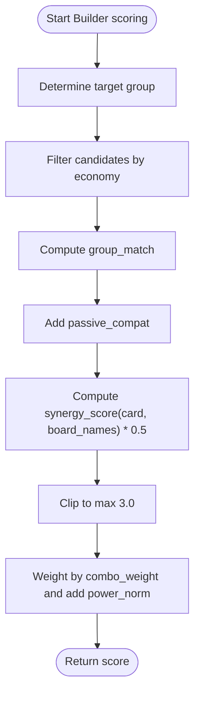
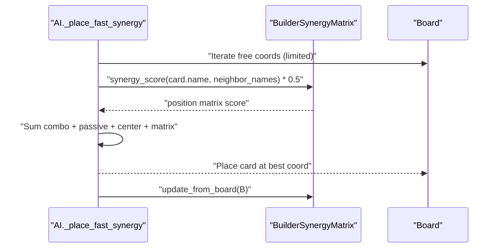
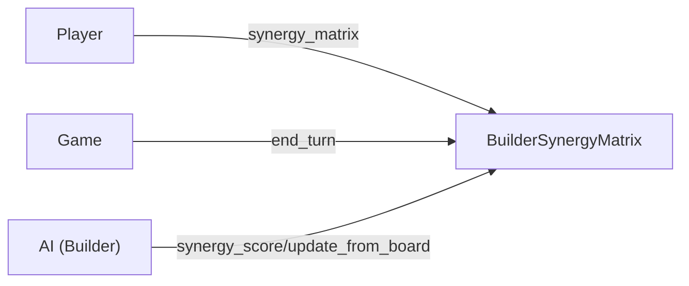

# Builder Synergy Matrix

<cite>
**Referenced Files in This Document**
- [engine_core/ai.py](file://engine_core/ai.py)
- [engine_core/game.py](file://engine_core/game.py)
- [engine_core/player.py](file://engine_core/player.py)
- [engine_core/constants.py](file://engine_core/constants.py)
- [_archive/old_dirs/godot_project/scripts/builder_synergy_matrix.gd](file://_archive/old_dirs/godot_project/scripts/builder_synergy_matrix.gd)
- [_archive/old_dirs/godot_project/scripts/ai.gd](file://_archive/old_dirs/godot_project/scripts/ai.gd)
- [v2/core/synergy_calculator.py](file://v2/core/synergy_calculator.py)
</cite>

## Table of Contents
1. [Introduction](#introduction)
2. [Project Structure](#project-structure)
3. [Core Components](#core-components)
4. [Architecture Overview](#architecture-overview)
5. [Detailed Component Analysis](#detailed-component-analysis)
6. [Dependency Analysis](#dependency-analysis)
7. [Performance Considerations](#performance-considerations)
8. [Troubleshooting Guide](#troubleshooting-guide)
9. [Conclusion](#conclusion)

## Introduction
This document explains the Builder Synergy Matrix, a session-level memory system that captures adjacency-based synergy experiences between cards. It covers how the matrix records successful combos (record_combo), missed opportunities (record_miss), decays over time (decay), and computes scores (synergy_score). It also documents how the Builder strategy integrates the matrix into its card scoring and placement logic, including parameter influence, cross-game memory isolation guarantees, and performance considerations for large boards.

## Project Structure
The Builder Synergy Matrix exists in two complementary implementations:
- Python engine_core/ai.py: The authoritative implementation used by the core engine and simulations.
- GDScript _archive/old_dirs/godot_project/scripts/builder_synergy_matrix.gd: A legacy mirror used by the original Godot-based AI.

Key integration points:
- Player initialization creates the matrix for the Builder strategy.
- Game loop triggers periodic decay to prevent long-term drift.
- Builder AI scoring and placement use the matrix to bias decisions.

**Diagram sources**
- [engine_core/ai.py:135-207](file://engine_core/ai.py#L135-L207)
- [engine_core/player.py:46-50](file://engine_core/player.py#L46-L50)
- [engine_core/game.py:209-211](file://engine_core/game.py#L209-L211)
- [engine_core/constants.py:66-68](file://engine_core/constants.py#L66-L68)
- [_archive/old_dirs/godot_project/scripts/builder_synergy_matrix.gd:1-66](file://_archive/old_dirs/godot_project/scripts/builder_synergy_matrix.gd#L1-L66)
- [_archive/old_dirs/godot_project/scripts/ai.gd:292-320](file://_archive/old_dirs/godot_project/scripts/ai.gd#L292-L320)
- [v2/core/synergy_calculator.py:24-50](file://v2/core/synergy_calculator.py#L24-L50)

**Section sources**
- [engine_core/ai.py:135-207](file://engine_core/ai.py#L135-L207)
- [engine_core/player.py:46-50](file://engine_core/player.py#L46-L50)
- [engine_core/game.py:209-211](file://engine_core/game.py#L209-L211)
- [_archive/old_dirs/godot_project/scripts/builder_synergy_matrix.gd:1-66](file://_archive/old_dirs/godot_project/scripts/builder_synergy_matrix.gd#L1-L66)
- [_archive/old_dirs/godot_project/scripts/ai.gd:292-320](file://_archive/old_dirs/godot_project/scripts/ai.gd#L292-L320)
- [v2/core/synergy_calculator.py:24-50](file://v2/core/synergy_calculator.py#L24-L50)

## Core Components
- BuilderSynergyMatrix (Python): Session-scoped memory of adjacency experiences between card names. Provides:
  - record_combo: increase mutual synergy weight for a pair when they form a combo.
  - record_miss: decrease mutual synergy weight for a pair when adjacent but not combo.
  - decay: multiplicative forgetting factor applied to all weights each turn.
  - synergy_score: sum of stored weights for a given card against board members.
  - update_from_board: scans the board for adjacent pairs and updates the matrix accordingly.

- Player integration: For the Builder strategy, Player constructs a BuilderSynergyMatrix instance and stores it as player.synergy_matrix.

- Game loop integration: At the end of each turn, Game.decays any active synergy matrices held by living players.

- Builder AI integration (Python): The Builder strategy’s card scoring and placement logic consult the matrix to bias choices toward cards that historically synergize well with current board composition.

- Builder AI integration (GDScript): The legacy Godot AI mirrors the same scoring and placement logic using the GDScript matrix.

**Section sources**
- [engine_core/ai.py:135-207](file://engine_core/ai.py#L135-L207)
- [engine_core/player.py:46-50](file://engine_core/player.py#L46-L50)
- [engine_core/game.py:209-211](file://engine_core/game.py#L209-L211)
- [_archive/old_dirs/godot_project/scripts/builder_synergy_matrix.gd:16-42](file://_archive/old_dirs/godot_project/scripts/builder_synergy_matrix.gd#L16-L42)
- [_archive/old_dirs/godot_project/scripts/ai.gd:292-320](file://_archive/old_dirs/godot_project/scripts/ai.gd#L292-L320)

## Architecture Overview
The Builder strategy composes three signals to score a candidate card:
- Group match: how many stats belong to the target synergy group.
- Passive compatibility: whether the card category matches categories already present on the board.
- Synergy matrix bonus: historical adjacency experience scaled and capped.

Placement adds a similar matrix-derived score for candidate positions.

**Diagram sources**
- [engine_core/ai.py:415-520](file://engine_core/ai.py#L415-L520)
- [engine_core/ai.py:185-207](file://engine_core/ai.py#L185-L207)
- [engine_core/game.py:209-211](file://engine_core/game.py#L209-L211)
- [_archive/old_dirs/godot_project/scripts/ai.gd:292-320](file://_archive/old_dirs/godot_project/scripts/ai.gd#L292-L320)
- [_archive/old_dirs/godot_project/scripts/ai.gd:518-543](file://_archive/old_dirs/godot_project/scripts/ai.gd#L518-L543)

## Detailed Component Analysis

### BuilderSynergyMatrix (Python)
The authoritative implementation resides in engine_core/ai.py. It maintains a nested dictionary of weights keyed by card names, with symmetric updates for mutual pairs.

- Initialization and decay parameters:
  - Internal weights initialized as nested defaultdicts.
  - Decay factor applied per turn to reduce long-term memory.
  - Reward and penalty magnitudes tune learning speed and noise resistance.

- Methods:
  - record_combo: increases weights for both directions by a fixed reward.
  - record_miss: decreases weights for both directions by a fixed penalty, clamped to zero.
  - decay: multiplies all weights by the decay factor.
  - synergy_score: sums weights for a given card against board members.
  - update_from_board: iterates the board grid, checks adjacency, and calls record_combo or record_miss for each unique neighbor pair.

- Cross-game memory isolation:
  - The matrix is attached to Player instances, which are recreated per game.
  - There is no global persistent state; RNG seeds are independent.
  - This ensures no cross-game leakage.

- Relationship to board positions and adjacency:
  - Adjacency is determined by axial hex coordinates and the predefined direction set.
  - Only dominant synergy group membership determines combo/mismatch classification.

- Integration with Builder strategy:
  - Scoring: synergy_score is scaled and capped, then combined with group match and passive compatibility.
  - Placement: a position-specific matrix score is computed and added to combo/passive/center bonuses.

- Complexity and optimization:
  - update_from_board scans all board positions and their neighbors; with a fixed hex degree, this is O(N_neighbors) per update.
  - synergy_score is O(k) where k is the number of board cards queried.
  - For very large boards, consider hashing board state to avoid redundant updates.

**Diagram sources**
- [engine_core/ai.py:150-207](file://engine_core/ai.py#L150-L207)

**Section sources**
- [engine_core/ai.py:135-207](file://engine_core/ai.py#L135-L207)
- [engine_core/constants.py:66-68](file://engine_core/constants.py#L66-L68)

### BuilderSynergyMatrix (GDScript, Legacy)
The Godot mirror in _archive/old_dirs/godot_project/scripts/builder_synergy_matrix.gd mirrors the Python semantics:
- Same method names and behavior: record_combo, record_miss, decay, synergy_score, update_from_board.
- Uses axial hex directions and pair canonicalization to avoid double-counting edges.
- Integrated into the legacy Godot AI scoring and placement logic.

**Diagram sources**
- [_archive/old_dirs/godot_project/scripts/builder_synergy_matrix.gd:11-66](file://_archive/old_dirs/godot_project/scripts/builder_synergy_matrix.gd#L11-L66)

**Section sources**
- [_archive/old_dirs/godot_project/scripts/builder_synergy_matrix.gd:11-66](file://_archive/old_dirs/godot_project/scripts/builder_synergy_matrix.gd#L11-L66)

### Integration with Builder Strategy Scoring (Python)
The Builder strategy’s card scoring combines:
- Group match: counts stats aligned with the target synergy group.
- Passive compatibility: bonus if the card category appears on the board.
- Synergy matrix bonus: synergy_score scaled and capped.
- Power tiebreaker: normalized power weighted by a parameter.

**Diagram sources**
- [engine_core/ai.py:415-520](file://engine_core/ai.py#L415-L520)

**Section sources**
- [engine_core/ai.py:415-520](file://engine_core/ai.py#L415-L520)

### Integration with Builder Strategy Placement (Python)
During placement, the AI evaluates up to a small number of candidate positions per card, selecting the highest-scoring one. The position score includes:
- Neighbor combo count (target group alignment).
- Passive compatibility with neighbors.
- Center proximity bonus.
- Matrix-derived score based on neighbors already placed.

After placing a card, the matrix updates from the current board state, then decays at the end of the turn.

**Diagram sources**
- [engine_core/ai.py:688-700](file://engine_core/ai.py#L688-L700)
- [engine_core/ai.py:498-504](file://engine_core/ai.py#L498-L504)

**Section sources**
- [engine_core/ai.py:688-700](file://engine_core/ai.py#L688-L700)
- [engine_core/ai.py:498-504](file://engine_core/ai.py#L498-L504)

### Integration with Builder Strategy Scoring (GDScript, Legacy)
The legacy Godot AI mirrors the Python logic:
- Builds a score combining group match, passive compatibility, and a matrix term scaled and capped.
- Uses the matrix to rank candidates before purchase.
- Also uses the matrix during placement to select the best coordinate.

**Section sources**
- [_archive/old_dirs/godot_project/scripts/ai.gd:292-320](file://_archive/old_dirs/godot_project/scripts/ai.gd#L292-L320)
- [_archive/old_dirs/godot_project/scripts/ai.gd:518-543](file://_archive/old_dirs/godot_project/scripts/ai.gd#L518-L543)

## Dependency Analysis
- Player creation: For strategy "builder", Player initializes a BuilderSynergyMatrix and stores it as player.synergy_matrix.
- Game loop: Game.end_turn invokes decay on any active synergy matrix held by living players.
- Builder scoring/placement: Both Python and GDScript Builder logic conditionally use the matrix if present.

**Diagram sources**
- [engine_core/player.py:46-50](file://engine_core/player.py#L46-L50)
- [engine_core/game.py:209-211](file://engine_core/game.py#L209-L211)
- [engine_core/ai.py:415-520](file://engine_core/ai.py#L415-L520)

**Section sources**
- [engine_core/player.py:46-50](file://engine_core/player.py#L46-L50)
- [engine_core/game.py:209-211](file://engine_core/game.py#L209-L211)
- [engine_core/ai.py:415-520](file://engine_core/ai.py#L415-L520)

## Performance Considerations
- Update frequency: update_from_board is called per placement; Game.end_turn applies decay each turn. For typical Builder placement rates, this is bounded and efficient.
- Complexity:
  - update_from_board: O(N_edges) with fixed hex degree.
  - synergy_score: O(k) where k is the number of board cards considered.
- Large boards: With the increased 37-hex board radius, adjacency scanning remains O(N) in effective neighbors. Consider hashing the board state to skip redundant updates if the board has not changed.
- UI vs engine: The separate SynergyCalculator (v2/core/synergy_calculator.py) performs BFS-based synergy computations for UI rendering and caching; it is orthogonal to the Builder matrix and should remain separate.

[No sources needed since this section provides general guidance]

## Troubleshooting Guide
Common issues and remedies:
- Matrix not present: If player.synergy_matrix is None, Builder scoring/placement falls back to zero matrix bonus. Ensure Player initialization sets the matrix for strategy "builder".
- No decay observed: Verify Game.end_turn is invoked and players are alive; decay only runs on active players.
- Unexpected low synergy scores: Confirm that board_card_names passed to synergy_score reflect the current board composition and that update_from_board has been called after placements.
- Parameter influence: combo_weight dominates synergy contribution; power_weight acts as a tie-breaker. Adjust TRAINED_PARAMS for strategy "builder" to shift emphasis.

**Section sources**
- [engine_core/player.py:46-50](file://engine_core/player.py#L46-L50)
- [engine_core/game.py:209-211](file://engine_core/game.py#L209-L211)
- [engine_core/ai.py:415-520](file://engine_core/ai.py#L415-L520)

## Conclusion
The Builder Synergy Matrix provides a lightweight, session-scoped memory of adjacency experiences that improves the Builder strategy’s card selection and placement. Its design balances learning speed (reward/penalty) with stability (decay), and it integrates cleanly with both Python and GDScript implementations. Proper initialization, periodic updates, and turn-based decay ensure robust, isolated behavior across games and scalable performance on larger boards.