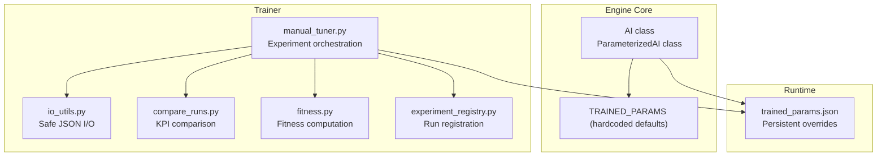
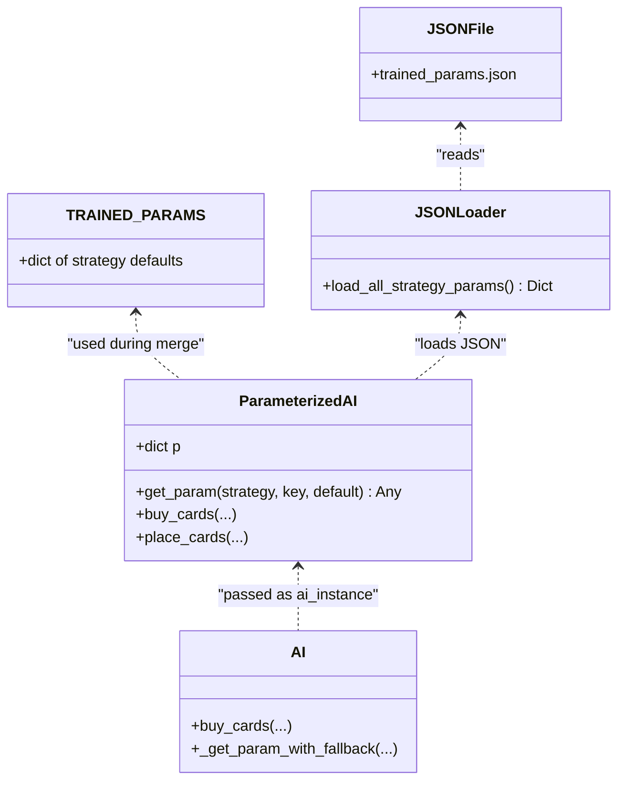
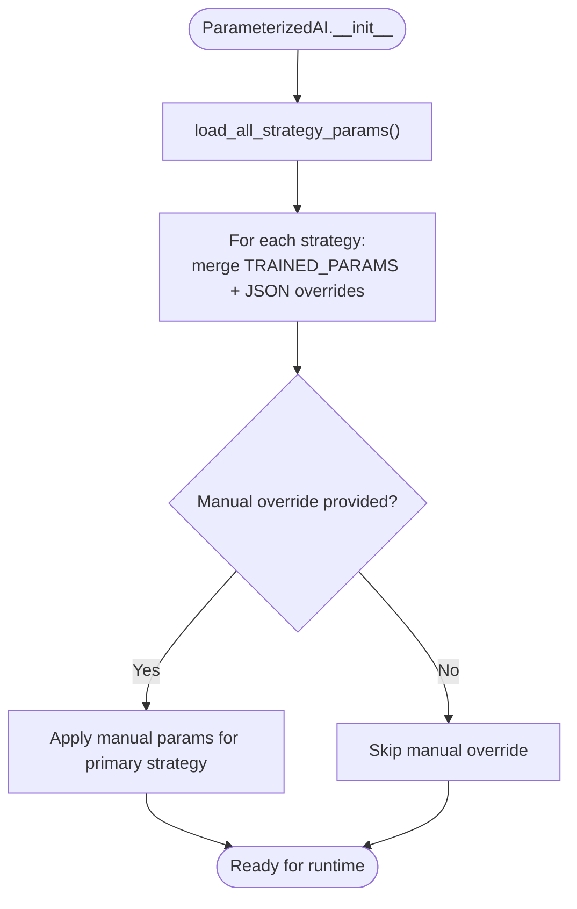
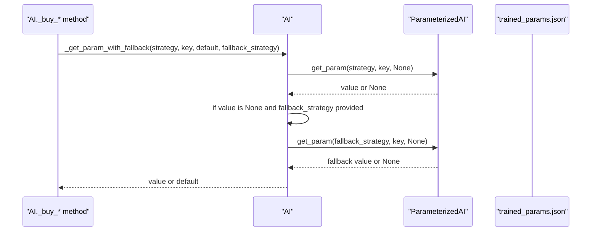
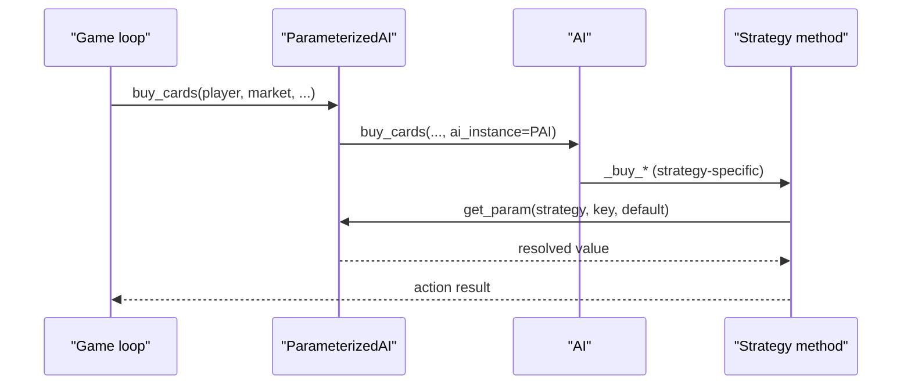
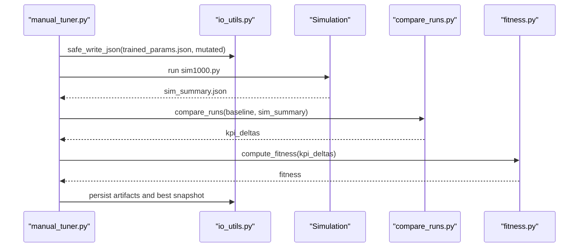
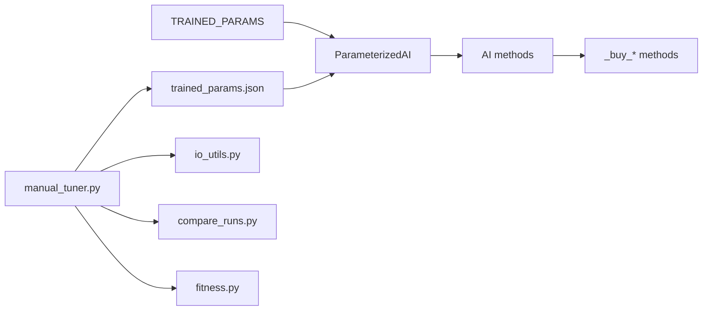

# Parameter Management System

<cite>
**Referenced Files in This Document**
- [engine_core/ai.py](file://engine_core/ai.py)
- [trained_params.json](file://trained_params.json)
- [trainer/manual_tuner.py](file://trainer/manual_tuner.py)
- [trainer/io_utils.py](file://trainer/io_utils.py)
- [trainer/fitness.py](file://trainer/fitness.py)
- [trainer/compare_runs.py](file://trainer/compare_runs.py)
- [trainer/experiment_registry.py](file://trainer/experiment_registry.py)
</cite>

## Table of Contents
1. [Introduction](#introduction)
2. [Project Structure](#project-structure)
3. [Core Components](#core-components)
4. [Architecture Overview](#architecture-overview)
5. [Detailed Component Analysis](#detailed-component-analysis)
6. [Dependency Analysis](#dependency-analysis)
7. [Performance Considerations](#performance-considerations)
8. [Troubleshooting Guide](#troubleshooting-guide)
9. [Conclusion](#conclusion)
10. [Appendices](#appendices)

## Introduction
This document explains the Parameter Management System that powers AI strategy behavior in the game. It covers how parameters are loaded from trained_params.json, how the AI._get_param_with_fallback method enables robust runtime access, and how backward compatibility is preserved. It also documents the TRAINED_PARAMS structure, parameter validation, fallback mechanisms, and practical workflows for configuration, loading, and runtime access. Finally, it provides guidance on parameter tuning, validation, error handling, persistence, versioning, migration, and extending the system with new strategies and parameters.

## Project Structure
The parameter system spans three main areas:
- Engine core: AI logic and parameter access APIs
- Trained parameters: JSON-backed persistent configuration
- Trainer: Automated tuning and validation pipeline

**Diagram sources**
- [engine_core/ai.py:9-61](file://engine_core/ai.py#L9-61)
- [engine_core/ai.py:1147-1231](file://engine_core/ai.py#L1147-L1231)
- [trainer/manual_tuner.py:103-121](file://trainer/manual_tuner.py#L103-L121)
- [trainer/io_utils.py:12-36](file://trainer/io_utils.py#L12-L36)
- [trainer/compare_runs.py](file://trainer/compare_runs.py)
- [trainer/fitness.py](file://trainer/fitness.py)
- [trainer/experiment_registry.py](file://trainer/experiment_registry.py)

**Section sources**
- [engine_core/ai.py:9-61](file://engine_core/ai.py#L9-61)
- [engine_core/ai.py:1147-1231](file://engine_core/ai.py#L1147-L1231)
- [trainer/manual_tuner.py:103-121](file://trainer/manual_tuner.py#L103-L121)
- [trainer/io_utils.py:12-36](file://trainer/io_utils.py#L12-L36)

## Core Components
- TRAINED_PARAMS: Hardcoded default parameter sets for all strategies, embedded in the engine.
- ParameterizedAI: Loads and merges parameters from TRAINED_PARAMS and trained_params.json, exposes get_param for runtime access.
- AI._get_param_with_fallback: Provides fallback resolution across strategies and defaults.
- trained_params.json: Persistent overrides applied on top of TRAINED_PARAMS.
- Trainer pipeline: Writes mutated parameters to trained_params.json, runs simulations, compares KPIs, computes fitness, and persists artifacts.

Key runtime behaviors:
- Parameter loading occurs once during ParameterizedAI initialization.
- get_param returns merged values: JSON overrides default values.
- AI._get_param_with_fallback supports cross-strategy fallback and explicit defaults.

**Section sources**
- [engine_core/ai.py:9-61](file://engine_core/ai.py#L9-61)
- [engine_core/ai.py:78-114](file://engine_core/ai.py#L78-L114)
- [engine_core/ai.py:1147-1231](file://engine_core/ai.py#L1147-L1231)
- [engine_core/ai.py:214-233](file://engine_core/ai.py#L214-L233)
- [trained_params.json:1-49](file://trained_params.json#L1-L49)

## Architecture Overview
The parameter system follows a layered priority model:
1) TRAINED_PARAMS (hardcoded defaults)
2) trained_params.json (partial overrides)
3) Constructor-provided manual overrides (highest priority)

**Diagram sources**
- [engine_core/ai.py:9-61](file://engine_core/ai.py#L9-61)
- [engine_core/ai.py:78-114](file://engine_core/ai.py#L78-L114)
- [engine_core/ai.py:1147-1231](file://engine_core/ai.py#L1147-L1231)
- [engine_core/ai.py:214-233](file://engine_core/ai.py#L214-L233)
- [trained_params.json:1-49](file://trained_params.json#L1-L49)

## Detailed Component Analysis

### TRAINED_PARAMS and Parameter Loading
- TRAINED_PARAMS defines default parameters for all supported strategies.
- load_all_strategy_params reads trained_params.json once at startup and returns a crash-proof dictionary of strategy-to-parameters mappings.
- ParameterizedAI merges TRAINED_PARAMS with JSON overrides and optional manual overrides.

**Diagram sources**
- [engine_core/ai.py:78-114](file://engine_core/ai.py#L78-L114)
- [engine_core/ai.py:1167-1200](file://engine_core/ai.py#L1167-L1200)

**Section sources**
- [engine_core/ai.py:9-61](file://engine_core/ai.py#L9-61)
- [engine_core/ai.py:78-114](file://engine_core/ai.py#L78-L114)
- [engine_core/ai.py:1167-1200](file://engine_core/ai.py#L1167-L1200)

### AI._get_param_with_fallback Mechanism
- Used by AI methods to fetch parameters with optional fallback to another strategy or a default value.
- Enables backward compatibility by allowing missing keys to resolve to fallbacks or defaults.

**Diagram sources**
- [engine_core/ai.py:214-233](file://engine_core/ai.py#L214-L233)
- [engine_core/ai.py:1202-1215](file://engine_core/ai.py#L1202-L1215)

**Section sources**
- [engine_core/ai.py:214-233](file://engine_core/ai.py#L214-L233)
- [engine_core/ai.py:1202-1215](file://engine_core/ai.py#L1202-L1215)

### Backward Compatibility Handling
- load_strategy_params remains for legacy consumers; it returns only the economist subset.
- AI._get_param_with_fallback supports fallback to the economist strategy when a requested key is missing in the current strategy.
- TRAINED_PARAMS includes both legacy and phase-specific parameters to ease migration.

Practical implications:
- Existing code using load_strategy_params continues to work.
- New strategies can reuse keys from the economist bucket via fallback.

**Section sources**
- [engine_core/ai.py:106-114](file://engine_core/ai.py#L106-L114)
- [engine_core/ai.py:238-242](file://engine_core/ai.py#L238-L242)
- [engine_core/ai.py:10-61](file://engine_core/ai.py#L10-L61)

### Parameter Validation and Fallback Strategies
- JSON loading is crash-proof: invalid or missing files yield empty overrides, preventing runtime failures.
- get_param returns a provided default when a key is missing.
- AI._get_param_with_fallback adds an extra safety net with optional cross-strategy fallback.

Validation checks in practice:
- JSON decoding errors are caught and ignored.
- Non-dict values are filtered out.
- Missing keys resolve to defaults or fallbacks.

**Section sources**
- [engine_core/ai.py:78-114](file://engine_core/ai.py#L78-L114)
- [engine_core/ai.py:214-233](file://engine_core/ai.py#L214-L233)
- [engine_core/ai.py:1202-1215](file://engine_core/ai.py#L1202-L1215)

### Runtime Parameter Access Patterns
Common patterns:
- Strategy-specific getters: AI._buy_warrior, AI._buy_evolver, etc., call get_param on the ai_instance.
- Economy phase controls: AI._economy_phase_controls uses AI._get_param_with_fallback to fetch keys with fallback.
- Placement parameters: ParameterizedAI.place_cards reads tempo parameters from self.p.

**Diagram sources**
- [engine_core/ai.py:1217-1221](file://engine_core/ai.py#L1217-L1221)
- [engine_core/ai.py:394-412](file://engine_core/ai.py#L394-L412)
- [engine_core/ai.py:522-564](file://engine_core/ai.py#L522-L564)

**Section sources**
- [engine_core/ai.py:1217-1231](file://engine_core/ai.py#L1217-L1231)
- [engine_core/ai.py:394-412](file://engine_core/ai.py#L394-L412)
- [engine_core/ai.py:522-564](file://engine_core/ai.py#L522-L564)

### Practical Examples: Configuration, Loading, and Access
- Example configuration: See trained_params.json entries for economist, builder, evolver, balancer, rare_hunter, tempo, and random strategies.
- Example loading: ParameterizedAI.__init__ merges TRAINED_PARAMS with JSON overrides.
- Example access: AI._buy_economist uses AI._economy_phase_controls, which resolves parameters via AI._get_param_with_fallback.

Note: For concrete code paths, see the “Section sources” entries below.

**Section sources**
- [trained_params.json:1-49](file://trained_params.json#L1-L49)
- [engine_core/ai.py:1167-1200](file://engine_core/ai.py#L1167-L1200)
- [engine_core/ai.py:235-348](file://engine_core/ai.py#L235-L348)
- [engine_core/ai.py:576-616](file://engine_core/ai.py#L576-L616)

### Relationship Between Strategy Parameters and Performance Outcomes
- Parameters directly influence buying behavior, economy phases, and placement decisions.
- The trainer pipeline validates parameter effects by running simulations, computing KPI deltas, and deriving a scalar fitness score.
- Results are persisted and archived for future sessions.

**Diagram sources**
- [trainer/manual_tuner.py:277-331](file://trainer/manual_tuner.py#L277-L331)
- [trainer/io_utils.py:23-36](file://trainer/io_utils.py#L23-L36)
- [trainer/compare_runs.py](file://trainer/compare_runs.py)
- [trainer/fitness.py](file://trainer/fitness.py)

**Section sources**
- [trainer/manual_tuner.py:249-331](file://trainer/manual_tuner.py#L249-L331)
- [trainer/compare_runs.py](file://trainer/compare_runs.py)
- [trainer/fitness.py](file://trainer/fitness.py)

## Dependency Analysis
- ParameterizedAI depends on TRAINED_PARAMS and trained_params.json for runtime values.
- AI methods depend on ParameterizedAI.get_param for strategy parameters.
- The trainer depends on io_utils for safe JSON I/O and on simulation outputs for validation.

**Diagram sources**
- [engine_core/ai.py:9-61](file://engine_core/ai.py#L9-61)
- [engine_core/ai.py:1147-1231](file://engine_core/ai.py#L1147-L1231)
- [engine_core/ai.py:214-233](file://engine_core/ai.py#L214-L233)
- [trainer/manual_tuner.py:103-121](file://trainer/manual_tuner.py#L103-L121)
- [trainer/io_utils.py:12-36](file://trainer/io_utils.py#L12-L36)
- [trainer/compare_runs.py](file://trainer/compare_runs.py)
- [trainer/fitness.py](file://trainer/fitness.py)

**Section sources**
- [engine_core/ai.py:1147-1231](file://engine_core/ai.py#L1147-L1231)
- [engine_core/ai.py:214-233](file://engine_core/ai.py#L214-L233)
- [trainer/manual_tuner.py:103-121](file://trainer/manual_tuner.py#L103-L121)

## Performance Considerations
- Parameter loading is performed once during ParameterizedAI initialization, avoiding repeated disk I/O.
- Runtime access is O(1) dictionary lookup.
- Economy phase logic uses integer thresholds and minimal branching to maintain low overhead.

[No sources needed since this section provides general guidance]

## Troubleshooting Guide
Common issues and resolutions:
- trained_params.json missing or unreadable
  - Symptom: Parameters revert to TRAINED_PARAMS defaults silently.
  - Resolution: Ensure the file exists and is valid JSON. The loader gracefully handles missing or invalid files.
- Parameter key missing
  - Symptom: Strategy uses fallback or default value.
  - Resolution: Add the key to trained_params.json or provide a default in code. For cross-strategy keys, rely on AI._get_param_with_fallback fallback.
- JSON write failures during tuning
  - Symptom: Tuner reports inability to update trained_params.json.
  - Resolution: Verify file permissions and disk availability. The tuner logs detailed errors.
- Simulation failures during tuning
  - Symptom: Tuner reports sim failure or missing output.
  - Resolution: Check simulation logs and ensure sim1000.py runs successfully.

**Section sources**
- [engine_core/ai.py:78-114](file://engine_core/ai.py#L78-L114)
- [engine_core/ai.py:214-233](file://engine_core/ai.py#L214-L233)
- [trainer/manual_tuner.py:277-286](file://trainer/manual_tuner.py#L277-L286)
- [trainer/manual_tuner.py:379-385](file://trainer/manual_tuner.py#L379-L385)
- [trainer/io_utils.py:12-36](file://trainer/io_utils.py#L12-L36)

## Conclusion
The Parameter Management System combines deterministic defaults, persistent overrides, and runtime fallbacks to deliver robust, configurable AI behavior. The trainer pipeline validates parameter effects rigorously, ensuring that changes are data-driven and reversible. By following the recommended practices—validating parameters, handling errors explicitly, and preserving backward compatibility—you can evolve strategies safely and iteratively.

[No sources needed since this section summarizes without analyzing specific files]

## Appendices

### Appendix A: TRAINED_PARAMS Structure
- Location: Embedded in engine_core/ai.py
- Content: Default parameters for all strategies (economist, warrior, builder, evolver, balancer, rare_hunter, tempo, random)
- Purpose: Provide reliable defaults and serve as the baseline for merging with JSON overrides.

**Section sources**
- [engine_core/ai.py:9-61](file://engine_core/ai.py#L9-61)

### Appendix B: Parameter Persistence and Versioning
- Persistence: trained_params.json stores the latest validated parameters.
- Versioning: The system does not enforce semantic versioning; however, the tuner snapshots and archives preserve historical configurations.
- Migration: Use fallback mechanisms and cross-strategy resolution to migrate missing keys gradually.

**Section sources**
- [trained_params.json:1-49](file://trained_params.json#L1-L49)
- [trainer/manual_tuner.py:226-244](file://trainer/manual_tuner.py#L226-L244)

### Appendix C: Extending the System with New Strategies and Parameters
Steps:
- Add defaults to TRAINED_PARAMS in engine_core/ai.py.
- Optionally add a JSON block for the new strategy in trained_params.json.
- Update strategy logic to consume parameters via get_param or AI._get_param_with_fallback.
- If needed, add fallbacks to existing strategies for shared keys.
- Integrate new parameters into the trainer pipeline by updating BASELINE_PARAMS and tuning scripts.

Guidelines:
- Keep defaults documented and conservative.
- Prefer incremental changes with fallbacks.
- Validate parameter effects using the trainer pipeline.

**Section sources**
- [engine_core/ai.py:9-61](file://engine_core/ai.py#L9-61)
- [engine_core/ai.py:1147-1231](file://engine_core/ai.py#L1147-L1231)
- [trainer/manual_tuner.py:72-98](file://trainer/manual_tuner.py#L72-L98)