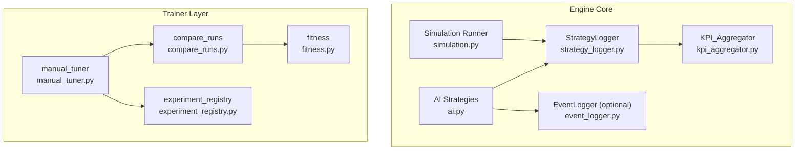
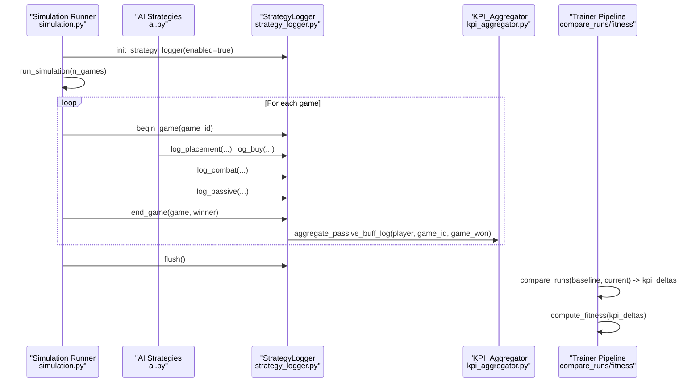
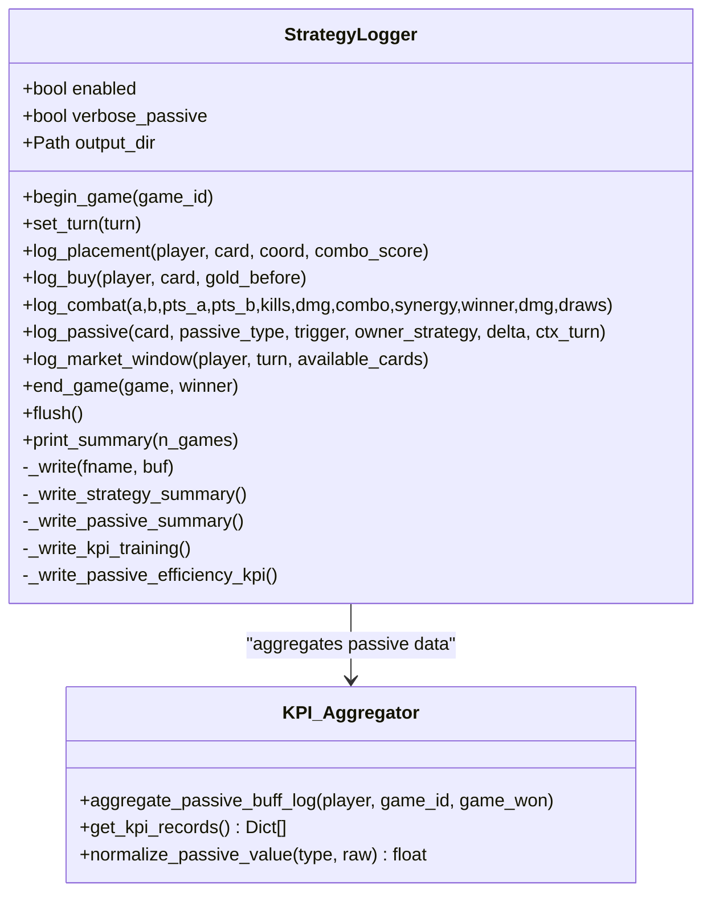
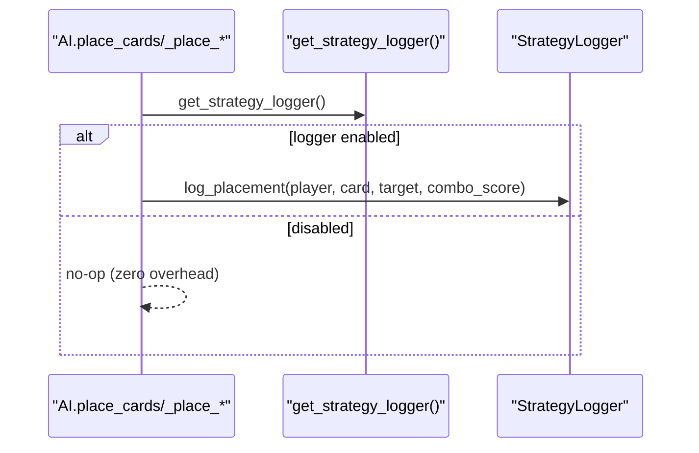
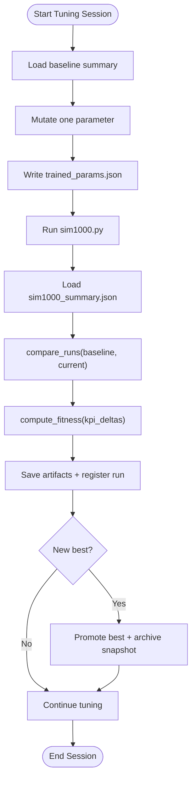
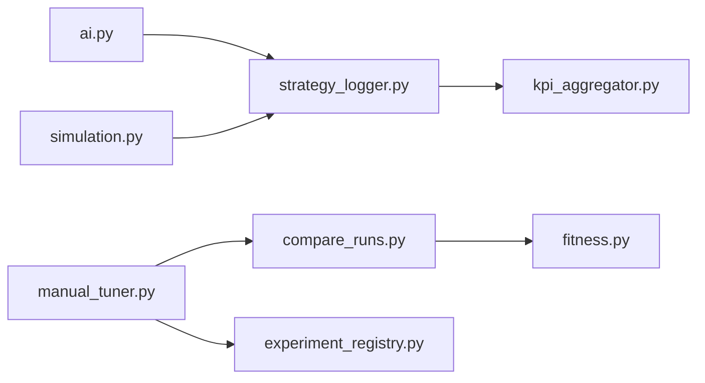

# Performance Monitoring

<cite>
**Referenced Files in This Document**
- [strategy_logger.py](file://engine_core/strategy_logger.py)
- [event_logger.py](file://engine_core/event_logger.py)
- [kpi_aggregator.py](file://engine_core/kpi_aggregator.py)
- [ai.py](file://engine_core/ai.py)
- [simulation.py](file://engine_core/simulation.py)
- [fitness.py](file://trainer/fitness.py)
- [compare_runs.py](file://trainer/compare_runs.py)
- [experiment_registry.py](file://trainer/experiment_registry.py)
- [manual_tuner.py](file://trainer/manual_tuner.py)
</cite>

## Table of Contents
1. [Introduction](#introduction)
2. [Project Structure](#project-structure)
3. [Core Components](#core-components)
4. [Architecture Overview](#architecture-overview)
5. [Detailed Component Analysis](#detailed-component-analysis)
6. [Dependency Analysis](#dependency-analysis)
7. [Performance Considerations](#performance-considerations)
8. [Troubleshooting Guide](#troubleshooting-guide)
9. [Conclusion](#conclusion)
10. [Appendices](#appendices)

## Introduction
This document explains the Performance Monitoring system that measures, logs, and evaluates AI strategy effectiveness in the hybrid AutoChess engine. It covers:
- Strategy logging hooks embedded in AI logic
- Real-time and post-game metrics collection
- Fitness evaluation and strategy comparison
- Benchmarking and optimization feedback loops
- Data export formats and visualization opportunities
- Logging overhead, data retention, and analytical reporting

## Project Structure
The performance monitoring stack spans three layers:
- AI layer: strategy decisions and placement actions emit events
- Logging layer: StrategyLogger aggregates and persists KPI streams
- Trainer layer: fitness scoring and comparison against KPI baselines

**Diagram sources**
- [ai.py](file://engine_core/ai.py)
- [strategy_logger.py](file://engine_core/strategy_logger.py)
- [kpi_aggregator.py](file://engine_core/kpi_aggregator.py)
- [event_logger.py](file://engine_core/event_logger.py)
- [simulation.py](file://engine_core/simulation.py)
- [compare_runs.py](file://trainer/compare_runs.py)
- [fitness.py](file://trainer/fitness.py)
- [experiment_registry.py](file://trainer/experiment_registry.py)
- [manual_tuner.py](file://trainer/manual_tuner.py)

**Section sources**
- [ai.py](file://engine_core/ai.py)
- [strategy_logger.py](file://engine_core/strategy_logger.py)
- [kpi_aggregator.py](file://engine_core/kpi_aggregator.py)
- [event_logger.py](file://engine_core/event_logger.py)
- [simulation.py](file://engine_core/simulation.py)
- [compare_runs.py](file://trainer/compare_runs.py)
- [fitness.py](file://trainer/fitness.py)
- [experiment_registry.py](file://trainer/experiment_registry.py)
- [manual_tuner.py](file://trainer/manual_tuner.py)

## Core Components
- StrategyLogger: Centralized, buffered KPI aggregator with JSONL streaming and summary exports. Provides hooks for placement, combat, buying, market windows, and passive triggers.
- KPI_Aggregator: Pure computation module that normalizes passive effects and computes per-passive efficiency scores.
- EventLogger: Optional, independent event logger for detailed per-event streams (card purchase, board placement, combat, synergy, round results, passive triggers).
- AI Strategies: Inject StrategyLogger hooks during placement and market phases.
- Simulation Runner: Initializes StrategyLogger, coordinates game lifecycle, and flushes final reports.
- Trainer Pipeline: compare_runs computes deltas; fitness computes scalar scores; experiment_registry persists runs; manual_tuner orchestrates tuning sweeps.

**Section sources**
- [strategy_logger.py](file://engine_core/strategy_logger.py)
- [kpi_aggregator.py](file://engine_core/kpi_aggregator.py)
- [event_logger.py](file://engine_core/event_logger.py)
- [ai.py](file://engine_core/ai.py)
- [simulation.py](file://engine_core/simulation.py)
- [compare_runs.py](file://trainer/compare_runs.py)
- [fitness.py](file://trainer/fitness.py)
- [experiment_registry.py](file://trainer/experiment_registry.py)
- [manual_tuner.py](file://trainer/manual_tuner.py)

## Architecture Overview
The monitoring architecture integrates AI decision points with logging and evaluation:

**Diagram sources**
- [simulation.py](file://engine_core/simulation.py)
- [ai.py](file://engine_core/ai.py)
- [strategy_logger.py](file://engine_core/strategy_logger.py)
- [kpi_aggregator.py](file://engine_core/kpi_aggregator.py)
- [compare_runs.py](file://trainer/compare_runs.py)
- [fitness.py](file://trainer/fitness.py)

## Detailed Component Analysis

### StrategyLogger: Centralized Performance Analytics
- Purpose: Collect and persist comprehensive KPI streams and summaries for strategy evaluation.
- Key capabilities:
  - Buffered JSONL logging for placement, combat, buy, and game-ending events.
  - Strategy-level and passive-level aggregation with counters and sums.
  - Strategy summary and training-ready KPI vectors.
  - Passive efficiency KPI export via KPI_Aggregator.
- Hooks integrated in AI:
  - Placement: emits combo score and center/ring positioning.
  - Market window: captures seen rarities.
  - Combat: records outcomes, kills, damage, and draws.
  - Passive: ghost-load filtering and delta normalization.
- Output files:
  - placement_events.jsonl, combat_events.jsonl, buy_events.jsonl, game_endings.jsonl
  - strategy_summary.json, passive_summary.json, kpi_training.json, passive_efficiency_kpi.jsonl

**Diagram sources**
- [strategy_logger.py](file://engine_core/strategy_logger.py)
- [kpi_aggregator.py](file://engine_core/kpi_aggregator.py)

**Section sources**
- [strategy_logger.py](file://engine_core/strategy_logger.py)
- [kpi_aggregator.py](file://engine_core/kpi_aggregator.py)

### get_strategy_logger and AI Integration
- get_strategy_logger(): Global accessor to the initialized StrategyLogger instance.
- AI integration points:
  - Placement engines call log_placement with combo score and coordinate.
  - Market-phase controls can call log_market_window to capture rarity distribution.
  - These hooks are present in multiple placement strategies and are guarded by enabled checks.

**Diagram sources**
- [ai.py](file://engine_core/ai.py)
- [strategy_logger.py](file://engine_core/strategy_logger.py)

**Section sources**
- [ai.py](file://engine_core/ai.py)
- [strategy_logger.py](file://engine_core/strategy_logger.py)

### EventLogger: Independent Detailed Streaming
- Optional, independent logger that writes detailed event streams to separate JSONL files.
- Enabled via a global flag; does not interfere with StrategyLogger.
- Useful for debugging and deep analysis of individual events.

**Section sources**
- [event_logger.py](file://engine_core/event_logger.py)

### KPI Aggregation and Normalization
- KPI_Aggregator:
  - Converts raw passive deltas into normalized values using empirically derived conversion factors.
  - Aggregates per-(game,strategy,card,passive_type) records.
  - Computes efficiency scores and exposes them as KPI records.
- StrategyLogger delegates passive efficiency computation to KPI_Aggregator and writes passive_efficiency_kpi.jsonl.

**Section sources**
- [kpi_aggregator.py](file://engine_core/kpi_aggregator.py)
- [strategy_logger.py](file://engine_core/strategy_logger.py)

### Simulation Runner and Logging Lifecycle
- Initializes StrategyLogger at the start of a batch.
- Notifies logger of turn changes and game lifecycle events.
- Flushes all buffers and prints strategy analytics summary upon completion.

**Section sources**
- [simulation.py](file://engine_core/simulation.py)
- [strategy_logger.py](file://engine_core/strategy_logger.py)

### Trainer: Fitness Evaluation and Strategy Comparison
- compare_runs:
  - Loads kpi_training.json as the “oracle” baseline.
  - Computes deltas between baseline and current run summaries.
  - Enriches each strategy with oracle values (e.g., g3_gold_efficiency, g5_win_rate).
- fitness:
  - Computes a scalar fitness score from KPI deltas.
  - Rewards directionality, target-range alignment, secondary health metrics, global balance, and crash safety.
- experiment_registry:
  - Persists run metadata and best-run tracking.
- manual_tuner:
  - Orchestrates parameter sweeps, runs simulations, compares results, computes fitness, persists artifacts, and updates best.

**Diagram sources**
- [compare_runs.py](file://trainer/compare_runs.py)
- [fitness.py](file://trainer/fitness.py)
- [experiment_registry.py](file://trainer/experiment_registry.py)
- [manual_tuner.py](file://trainer/manual_tuner.py)

**Section sources**
- [compare_runs.py](file://trainer/compare_runs.py)
- [fitness.py](file://trainer/fitness.py)
- [experiment_registry.py](file://trainer/experiment_registry.py)
- [manual_tuner.py](file://trainer/manual_tuner.py)

## Dependency Analysis
- AI depends on StrategyLogger via get_strategy_logger() to emit placement and market events.
- StrategyLogger depends on KPI_Aggregator for passive efficiency computation.
- Simulation Runner initializes and coordinates StrategyLogger across games.
- Trainer modules depend on StrategyLogger outputs (strategy_summary.json, kpi_training.json) and passive_efficiency_kpi.jsonl for evaluation.

**Diagram sources**
- [ai.py](file://engine_core/ai.py)
- [simulation.py](file://engine_core/simulation.py)
- [strategy_logger.py](file://engine_core/strategy_logger.py)
- [kpi_aggregator.py](file://engine_core/kpi_aggregator.py)
- [compare_runs.py](file://trainer/compare_runs.py)
- [fitness.py](file://trainer/fitness.py)
- [experiment_registry.py](file://trainer/experiment_registry.py)
- [manual_tuner.py](file://trainer/manual_tuner.py)

**Section sources**
- [ai.py](file://engine_core/ai.py)
- [simulation.py](file://engine_core/simulation.py)
- [strategy_logger.py](file://engine_core/strategy_logger.py)
- [kpi_aggregator.py](file://engine_core/kpi_aggregator.py)
- [compare_runs.py](file://trainer/compare_runs.py)
- [fitness.py](file://trainer/fitness.py)
- [experiment_registry.py](file://trainer/experiment_registry.py)
- [manual_tuner.py](file://trainer/manual_tuner.py)

## Performance Considerations
- Zero-overhead mode:
  - When StrategyLogger.enabled is False, all methods become no-ops, eliminating runtime overhead.
- Buffering and flushing:
  - Buffered JSONL writes reduce I/O frequency; flush threshold is configurable.
- Ghost-load filtering:
  - Small absolute delta thresholds filter near-zero passive deltas to avoid unnecessary updates.
- Optional verbose passive logging:
  - Disabling verbose_passive avoids populating per-event passive logs, reducing I/O.
- EventLogger independence:
  - Optional detailed logging does not affect StrategyLogger’s performance profile.

**Section sources**
- [strategy_logger.py](file://engine_core/strategy_logger.py)
- [event_logger.py](file://engine_core/event_logger.py)

## Troubleshooting Guide
- Missing or corrupted kpi_training.json:
  - fitness.load_kpi_baseline() returns an empty dict; fitness falls back to neutral scoring.
- Passive efficiency KPI file not written:
  - _write_passive_efficiency_kpi() catches IO and unexpected errors and logs warnings.
- Simulation log file issues:
  - write_game_log() ensures directory creation and truncates at first game; errors are handled gracefully.
- Tuning artifacts:
  - experiment_registry protects against missing or invalid entries; safe_read_json/safe_write_json handle failures.

**Section sources**
- [fitness.py](file://trainer/fitness.py)
- [strategy_logger.py](file://engine_core/strategy_logger.py)
- [simulation.py](file://engine_core/simulation.py)
- [experiment_registry.py](file://trainer/experiment_registry.py)

## Conclusion
The Performance Monitoring system provides a robust, extensible pipeline for measuring AI strategy effectiveness:
- AI hooks emit rich, structured events during gameplay.
- StrategyLogger aggregates metrics and produces standardized outputs for analysis.
- KPI_Aggregator normalizes passive effects for cross-strategy comparisons.
- The trainer layer enables rigorous benchmarking, comparison, and optimization feedback loops.
- Optional detailed logging supports deep debugging without impacting core performance.

## Appendices

### Practical Examples

- Monitoring strategy effectiveness
  - Use strategy_summary.json for strategy-level KPIs (win rate, avg turns, center/ring ratios, combat stats, economy metrics, passive triggers, and snowball metrics).
  - Use kpi_training.json for normalized KPI vectors suitable for ML training.

- Tracking parameter influence
  - manual_tuner orchestrates parameter sweeps; compare_runs computes deltas; fitness quantifies net impact.
  - experiment_registry persists run metadata and best-run snapshots.

- Analyzing decision patterns
  - placement_events.jsonl and combat_events.jsonl capture per-turn placements and combat outcomes.
  - passive_summary.json and passive_efficiency_kpi.jsonl reveal passive usage and normalized effectiveness.

- Integration with logging framework
  - StrategyLogger is globally accessible via get_strategy_logger(); AI placement engines call log_placement/log_buy/log_combat/log_passive.
  - EventLogger is independent and optional; StrategyLogger is the primary source for strategy analytics.

- Data export formats and visualization
  - JSONL for streaming events; JSON for summaries and training-ready vectors.
  - Visualize trends across experiments using the registry and exported KPIs.

- Performance benchmarking and strategy comparison
  - compare_runs enriches deltas with oracle values from kpi_training.json.
  - fitness computes a scalar score balancing primary strategy direction, secondary health, global balance, and crash safety.

- Optimization feedback loops
  - manual_tuner runs simulations, computes deltas, scores fitness, persists artifacts, and updates best parameters.

**Section sources**
- [strategy_logger.py](file://engine_core/strategy_logger.py)
- [kpi_aggregator.py](file://engine_core/kpi_aggregator.py)
- [event_logger.py](file://engine_core/event_logger.py)
- [ai.py](file://engine_core/ai.py)
- [simulation.py](file://engine_core/simulation.py)
- [compare_runs.py](file://trainer/compare_runs.py)
- [fitness.py](file://trainer/fitness.py)
- [experiment_registry.py](file://trainer/experiment_registry.py)
- [manual_tuner.py](file://trainer/manual_tuner.py)