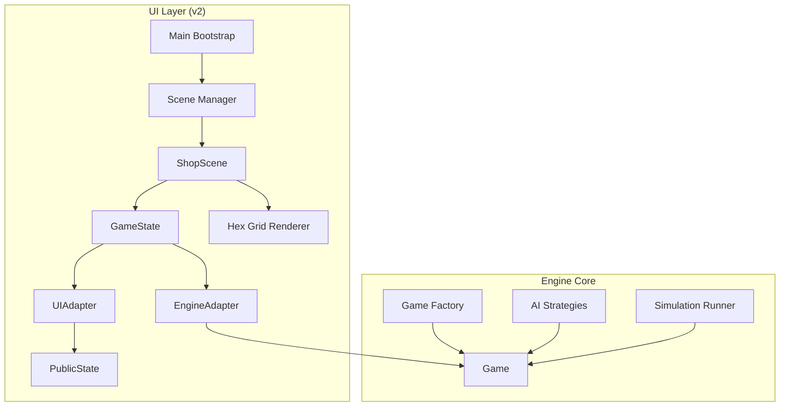
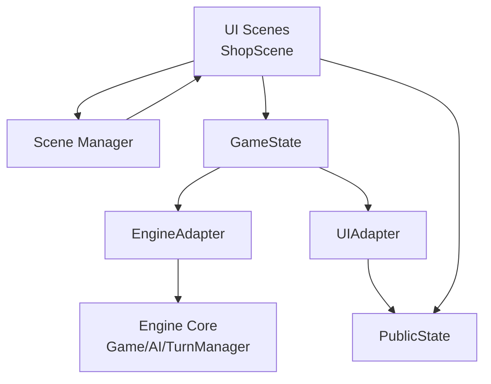
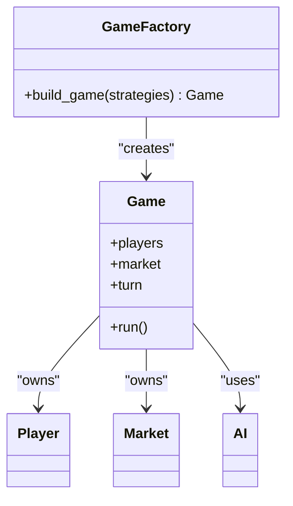
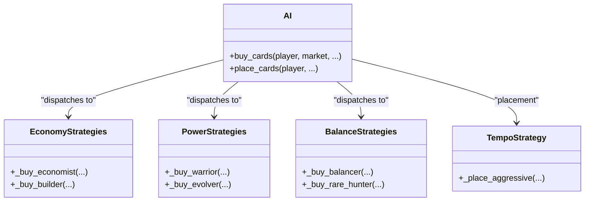
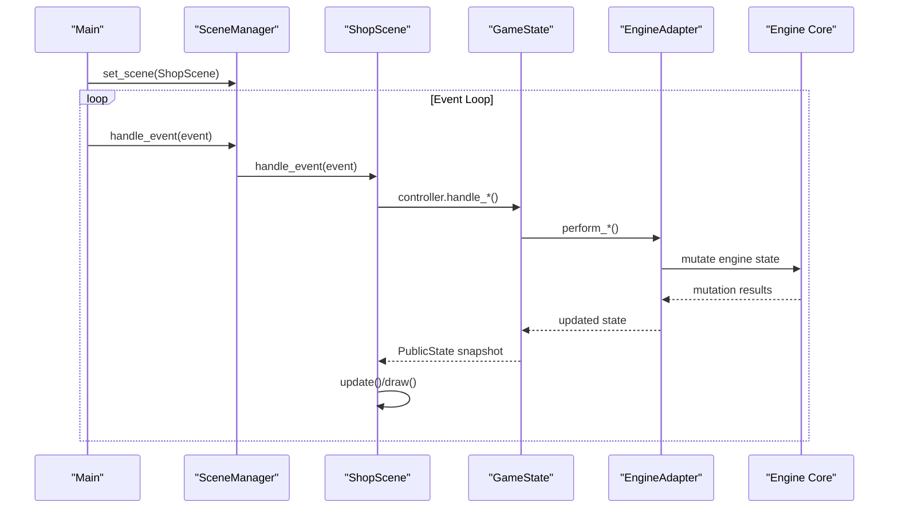
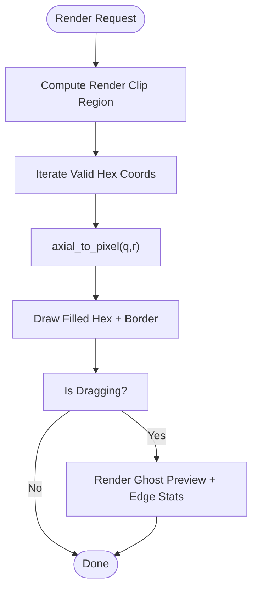
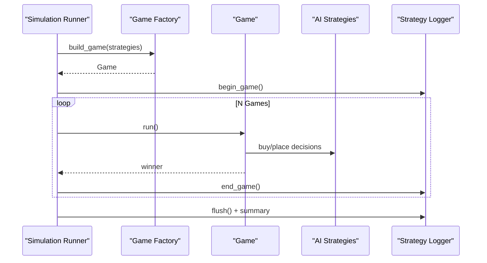
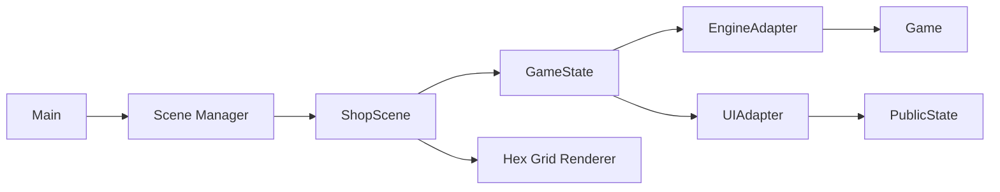
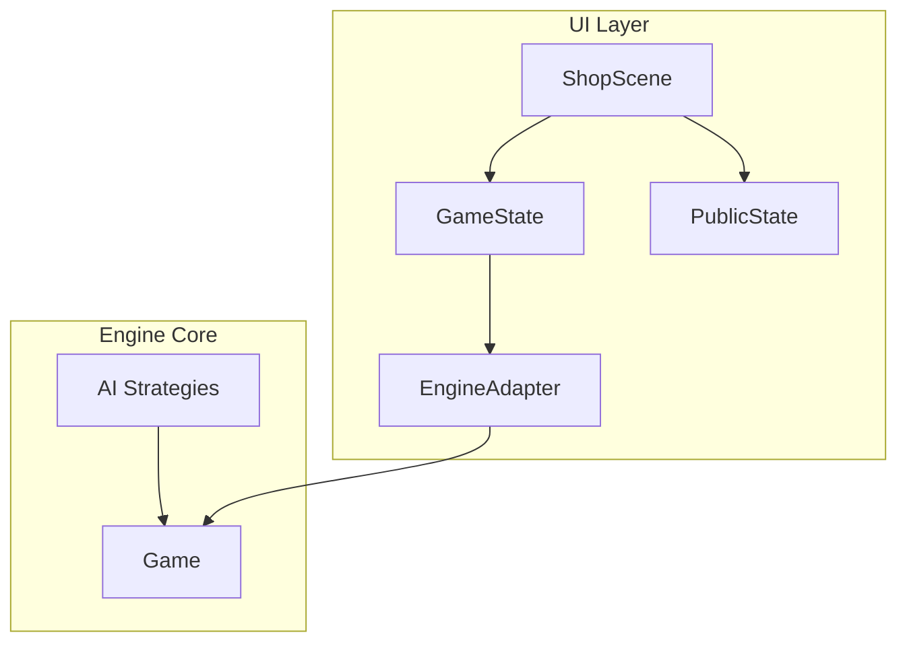

# Architecture Overview

<cite>
**Referenced Files in This Document**
- [engine_core/game_factory.py](file://engine_core/game_factory.py)
- [engine_core/game.py](file://engine_core/game.py)
- [engine_core/ai.py](file://engine_core/ai.py)
- [engine_core/simulation.py](file://engine_core/simulation.py)
- [v2/main.py](file://v2/main.py)
- [v2/core/scene_manager.py](file://v2/core/scene_manager.py)
- [v2/core/engine_adapter.py](file://v2/core/engine_adapter.py)
- [v2/core/game_state.py](file://v2/core/game_state.py)
- [v2/core/public_state.py](file://v2/core/public_state.py)
- [v2/core/state_store.py](file://v2/core/state_store.py)
- [v2/core/ui_adapter.py](file://v2/core/ui_adapter.py)
- [v2/core/ui_formatter.py](file://v2/core/ui_formatter.py)
- [v2/core/phase_machine.py](file://v2/core/phase_machine.py)
- [v2/scenes/shop.py](file://v2/scenes/shop.py)
- [v2/ui/hex_grid.py](file://v2/ui/hex_grid.py)
</cite>

## Table of Contents
1. [Introduction](#introduction)
2. [Project Structure](#project-structure)
3. [Core Components](#core-components)
4. [Architecture Overview](#architecture-overview)
5. [Detailed Component Analysis](#detailed-component-analysis)
6. [Dependency Analysis](#dependency-analysis)
7. [Performance Considerations](#performance-considerations)
8. [Troubleshooting Guide](#troubleshooting-guide)
9. [Conclusion](#conclusion)
10. [Appendices](#appendices)

## Introduction
This document describes the architectural design of Autochess Hybrid’s system, focusing on the migration from a legacy monolithic engine to a modern scene-based architecture. It explains how the engine core encapsulates game logic, how the scene manager coordinates UI scenes, and how UI components render the hex-grid board and interactive panels. It also documents architectural patterns such as the factory pattern for game creation and the strategy pattern for AI implementations, along with cross-cutting concerns like event-driven communication, asset management, and performance optimization.

## Project Structure
Autochess Hybrid is organized into two major layers:
- Engine Core: Implements game mechanics, AI strategies, turn management, combat, and simulation.
- UI Layer (v2): Implements a scene-based rendering pipeline using Pygame, with modular UI panels and a hex-grid renderer.

Key directories and responsibilities:
- engine_core: Game engine, AI, turn management, market, board, combat, simulation, and factories.
- v2: Scene orchestration, UI adapters, state caching, and rendering for shop/combat scenes.
- assets: Card database and image assets consumed by the UI.
- experiments and tools: AI tuning, simulations, and analysis utilities.

**Diagram sources**
- [engine_core/game_factory.py:30-70](file://engine_core/game_factory.py#L30-L70)
- [engine_core/game.py:35-120](file://engine_core/game.py#L35-L120)
- [engine_core/ai.py:214-380](file://engine_core/ai.py#L214-L380)
- [engine_core/simulation.py:113-218](file://engine_core/simulation.py#L113-L218)
- [v2/main.py:14-74](file://v2/main.py#L14-L74)
- [v2/core/scene_manager.py:28-156](file://v2/core/scene_manager.py#L28-L156)
- [v2/scenes/shop.py:23-71](file://v2/scenes/shop.py#L23-L71)
- [v2/core/game_state.py:14-90](file://v2/core/game_state.py#L14-L90)
- [v2/core/engine_adapter.py:38-115](file://v2/core/engine_adapter.py#L38-L115)
- [v2/core/ui_adapter.py:97-121](file://v2/core/ui_adapter.py#L97-L121)
- [v2/core/public_state.py:118-128](file://v2/core/public_state.py#L118-L128)
- [v2/ui/hex_grid.py:327-414](file://v2/ui/hex_grid.py#L327-L414)

**Section sources**
- [v2/main.py:14-74](file://v2/main.py#L14-L74)
- [v2/core/scene_manager.py:28-156](file://v2/core/scene_manager.py#L28-L156)
- [v2/core/game_state.py:14-90](file://v2/core/game_state.py#L14-L90)
- [v2/core/engine_adapter.py:38-115](file://v2/core/engine_adapter.py#L38-L115)
- [v2/core/ui_adapter.py:97-121](file://v2/core/ui_adapter.py#L97-L121)
- [v2/core/public_state.py:118-128](file://v2/core/public_state.py#L118-L128)
- [v2/scenes/shop.py:23-71](file://v2/scenes/shop.py#L23-L71)
- [v2/ui/hex_grid.py:327-414](file://v2/ui/hex_grid.py#L327-L414)
- [engine_core/game_factory.py:30-70](file://engine_core/game_factory.py#L30-L70)
- [engine_core/game.py:35-120](file://engine_core/game.py#L35-L120)
- [engine_core/ai.py:214-380](file://engine_core/ai.py#L214-L380)
- [engine_core/simulation.py:113-218](file://engine_core/simulation.py#L113-L218)

## Core Components
- Game Factory: Builds a Game instance with players, RNG, card pool, and injected engine functions. It centralizes construction and removes circular dependencies.
- Engine Adapter: A façade over the engine that exposes a stable API to the UI, encapsulating engine attribute access and mutation semantics.
- GameState: Central orchestrator for UI mutations and cached reads. It invalidates caches after mutations and builds immutable PublicState snapshots via UIAdapter.
- UIAdapter: Translates engine state into UI-friendly dataclasses (PublicState, ActivePlayerViewState, etc.), computing synergy and formatting logs.
- Scene Manager: Manages scene lifecycle and transitions with fade effects, routing events and updates to the active scene.
- ShopScene: The primary UI scene for shop/preparation, handling user actions, rendering hex grid, synergy lines, and overlays.
- Hex Grid Renderer: Renders the axial hex grid, synergy preview, and ghost placement overlays with camera support and performance-conscious drawing.

**Section sources**
- [engine_core/game_factory.py:30-70](file://engine_core/game_factory.py#L30-L70)
- [v2/core/engine_adapter.py:38-115](file://v2/core/engine_adapter.py#L38-L115)
- [v2/core/game_state.py:14-90](file://v2/core/game_state.py#L14-L90)
- [v2/core/ui_adapter.py:97-121](file://v2/core/ui_adapter.py#L97-L121)
- [v2/core/public_state.py:118-128](file://v2/core/public_state.py#L118-L128)
- [v2/core/scene_manager.py:28-156](file://v2/core/scene_manager.py#L28-L156)
- [v2/scenes/shop.py:23-71](file://v2/scenes/shop.py#L23-L71)
- [v2/ui/hex_grid.py:327-414](file://v2/ui/hex_grid.py#L327-L414)

## Architecture Overview
The system follows a layered architecture:
- Legacy engine core remains intact, providing deterministic game logic, AI strategies, and turn management.
- v2 layer acts as a presentation façade, exposing a stable interface to the UI and decoupling rendering from engine internals.
- Scenes encapsulate UI state machines and rendering, communicating with the engine via EngineAdapter and GameState.

**Diagram sources**
- [v2/core/scene_manager.py:28-156](file://v2/core/scene_manager.py#L28-L156)
- [v2/scenes/shop.py:23-71](file://v2/scenes/shop.py#L23-L71)
- [v2/core/game_state.py:14-90](file://v2/core/game_state.py#L14-L90)
- [v2/core/engine_adapter.py:38-115](file://v2/core/engine_adapter.py#L38-L115)
- [v2/core/ui_adapter.py:97-121](file://v2/core/ui_adapter.py#L97-L121)
- [v2/core/public_state.py:118-128](file://v2/core/public_state.py#L118-L128)
- [engine_core/game.py:35-120](file://engine_core/game.py#L35-L120)

## Detailed Component Analysis

### Factory Pattern: Game Creation
The Game Factory centralizes construction of the engine with randomized strategies and injected dependencies. This eliminates circular imports and enables clean separation between engine initialization and UI bootstrap.

**Diagram sources**
- [engine_core/game_factory.py:30-70](file://engine_core/game_factory.py#L30-L70)
- [engine_core/game.py:35-120](file://engine_core/game.py#L35-L120)

**Section sources**
- [engine_core/game_factory.py:30-70](file://engine_core/game_factory.py#L30-L70)
- [engine_core/game.py:35-120](file://engine_core/game.py#L35-L120)

### Strategy Pattern: AI Implementations
The AI module implements a strategy pattern: a dispatcher routes to specific strategies (e.g., random, warrior, builder, economist, evolver, balancer, rare_hunter, tempo). Each strategy encapsulates its decision logic, enabling easy extension and parameterization.

**Diagram sources**
- [engine_core/ai.py:350-380](file://engine_core/ai.py#L350-L380)
- [engine_core/ai.py:576-616](file://engine_core/ai.py#L576-L616)
- [engine_core/ai.py:414-520](file://engine_core/ai.py#L414-L520)
- [engine_core/ai.py:521-574](file://engine_core/ai.py#L521-L574)
- [engine_core/ai.py:617-686](file://engine_core/ai.py#L617-L686)
- [engine_core/ai.py:687-700](file://engine_core/ai.py#L687-L700)

**Section sources**
- [engine_core/ai.py:350-380](file://engine_core/ai.py#L350-L380)
- [engine_core/ai.py:576-616](file://engine_core/ai.py#L576-L616)
- [engine_core/ai.py:414-520](file://engine_core/ai.py#L414-L520)
- [engine_core/ai.py:521-574](file://engine_core/ai.py#L521-L574)
- [engine_core/ai.py:617-700](file://engine_core/ai.py#L617-L700)

### Scene-Based UI Orchestration
The scene manager coordinates scene lifecycles and transitions, while ShopScene integrates UI panels, hex-grid rendering, and overlays. It handles input events, updates state, and renders UI components.

**Diagram sources**
- [v2/main.py:37-74](file://v2/main.py#L37-L74)
- [v2/core/scene_manager.py:64-156](file://v2/core/scene_manager.py#L64-L156)
- [v2/scenes/shop.py:153-252](file://v2/scenes/shop.py#L153-L252)
- [v2/core/game_state.py:91-173](file://v2/core/game_state.py#L91-L173)
- [v2/core/engine_adapter.py:81-175](file://v2/core/engine_adapter.py#L81-L175)
- [engine_core/game.py:157-200](file://engine_core/game.py#L157-L200)

**Section sources**
- [v2/main.py:37-74](file://v2/main.py#L37-L74)
- [v2/core/scene_manager.py:64-156](file://v2/core/scene_manager.py#L64-L156)
- [v2/scenes/shop.py:153-252](file://v2/scenes/shop.py#L153-L252)
- [v2/core/game_state.py:91-173](file://v2/core/game_state.py#L91-L173)
- [v2/core/engine_adapter.py:81-175](file://v2/core/engine_adapter.py#L81-L175)
- [engine_core/game.py:157-200](file://engine_core/game.py#L157-L200)

### Hex-Grid Rendering and Synergy Visualization
The hex grid renderer converts axial coordinates to screen space, applies camera transforms, and draws filled hexes with glow and borders. It also renders synergy previews and ghost placements during drag-and-drop.

**Diagram sources**
- [v2/ui/hex_grid.py:327-414](file://v2/ui/hex_grid.py#L327-L414)
- [v2/ui/hex_grid.py:233-286](file://v2/ui/hex_grid.py#L233-L286)
- [v2/ui/hex_grid.py:415-458](file://v2/ui/hex_grid.py#L415-L458)

**Section sources**
- [v2/ui/hex_grid.py:327-414](file://v2/ui/hex_grid.py#L327-L414)
- [v2/ui/hex_grid.py:233-286](file://v2/ui/hex_grid.py#L233-L286)
- [v2/ui/hex_grid.py:415-458](file://v2/ui/hex_grid.py#L415-L458)

### Simulation and AI Research Pipeline
The simulation runner creates randomized matches, injects strategies, and aggregates statistics. It supports strategy logging and writes per-game logs for analysis.

**Diagram sources**
- [engine_core/simulation.py:113-218](file://engine_core/simulation.py#L113-L218)
- [engine_core/game_factory.py:30-70](file://engine_core/game_factory.py#L30-L70)
- [engine_core/game.py:203-224](file://engine_core/game.py#L203-L224)
- [engine_core/ai.py:350-380](file://engine_core/ai.py#L350-L380)

**Section sources**
- [engine_core/simulation.py:113-218](file://engine_core/simulation.py#L113-L218)
- [engine_core/game_factory.py:30-70](file://engine_core/game_factory.py#L30-L70)
- [engine_core/game.py:203-224](file://engine_core/game.py#L203-L224)
- [engine_core/ai.py:350-380](file://engine_core/ai.py#L350-L380)

## Dependency Analysis
The UI layer depends on the engine via EngineAdapter and GameState, which encapsulate engine mutations and expose immutable PublicState snapshots. The ShopScene composes multiple UI panels and the hex-grid renderer. The scene manager isolates UI lifecycle from engine logic.

**Diagram sources**
- [v2/scenes/shop.py:23-71](file://v2/scenes/shop.py#L23-L71)
- [v2/core/game_state.py:14-90](file://v2/core/game_state.py#L14-L90)
- [v2/core/engine_adapter.py:38-115](file://v2/core/engine_adapter.py#L38-L115)
- [v2/core/ui_adapter.py:97-121](file://v2/core/ui_adapter.py#L97-L121)
- [v2/core/public_state.py:118-128](file://v2/core/public_state.py#L118-L128)
- [v2/ui/hex_grid.py:327-414](file://v2/ui/hex_grid.py#L327-L414)
- [v2/core/scene_manager.py:28-156](file://v2/core/scene_manager.py#L28-L156)
- [v2/main.py:37-74](file://v2/main.py#L37-L74)

**Section sources**
- [v2/scenes/shop.py:23-71](file://v2/scenes/shop.py#L23-L71)
- [v2/core/game_state.py:14-90](file://v2/core/game_state.py#L14-L90)
- [v2/core/engine_adapter.py:38-115](file://v2/core/engine_adapter.py#L38-L115)
- [v2/core/ui_adapter.py:97-121](file://v2/core/ui_adapter.py#L97-L121)
- [v2/core/public_state.py:118-128](file://v2/core/public_state.py#L118-L128)
- [v2/ui/hex_grid.py:327-414](file://v2/ui/hex_grid.py#L327-L414)
- [v2/core/scene_manager.py:28-156](file://v2/core/scene_manager.py#L28-L156)
- [v2/main.py:37-74](file://v2/main.py#L37-L74)

## Performance Considerations
- Caching: GameState caches PublicState and invalidates on mutations to avoid recomputation. StateStore caches board names/rotations for the active player.
- Immutable Snapshots: UIAdapter constructs frozen dataclasses to prevent accidental mutation and simplify rendering.
- Rendering Efficiency: Hex grid renderer clips to visible regions, draws only visible hexes, and uses temporary surfaces for alpha blending to reduce overdraw.
- Event-Driven Updates: Scene Manager blocks input during transitions to maintain state consistency.
- Simulation Overheads: Strategy logging and per-game logs are optional and disabled by default to reduce overhead.

[No sources needed since this section provides general guidance]

## Troubleshooting Guide
- Engine Exceptions: EngineAdapter wraps engine calls and logs exceptions, returning explicit error codes to the UI for graceful handling.
- UI State Invalidation: GameState invalidates cached PublicState after any engine mutation to ensure UI consistency.
- Asset Loading Failures: ShopScene preloads audio assets; failures are handled gracefully without breaking the UI.
- Simulation Logging: Simulation runner writes per-game logs to a fixed output directory for post-run analysis.

**Section sources**
- [v2/core/engine_adapter.py:108-115](file://v2/core/engine_adapter.py#L108-L115)
- [v2/core/game_state.py:55-58](file://v2/core/game_state.py#L55-L58)
- [v2/scenes/shop.py:76-98](file://v2/scenes/shop.py#L76-L98)
- [engine_core/simulation.py:32-107](file://engine_core/simulation.py#L32-L107)

## Conclusion
Autochess Hybrid’s architecture cleanly separates the engine core from the UI layer. The factory pattern streamlines engine instantiation, while the strategy pattern enables flexible AI decision-making. The scene manager and GameState provide a robust, event-driven UI framework with strong caching and immutable state. The hex-grid renderer delivers responsive visuals with camera support and synergy feedback. Together, these patterns and components support scalable AI research, maintainable UI development, and efficient simulation workflows.

[No sources needed since this section summarizes without analyzing specific files]

## Appendices

### System Context Diagram: Engine, AI Strategies, and UI

**Diagram sources**
- [engine_core/ai.py:350-380](file://engine_core/ai.py#L350-L380)
- [engine_core/game.py:35-120](file://engine_core/game.py#L35-L120)
- [v2/scenes/shop.py:23-71](file://v2/scenes/shop.py#L23-L71)
- [v2/core/game_state.py:14-90](file://v2/core/game_state.py#L14-L90)
- [v2/core/engine_adapter.py:38-115](file://v2/core/engine_adapter.py#L38-L115)
- [v2/core/public_state.py:118-128](file://v2/core/public_state.py#L118-L128)

### Cross-Cutting Concerns
- Event-Driven Communication: Scene Manager coordinates events and updates, blocking input during transitions.
- Asset Management: AssetLoader initializes card and audio assets; ShopScene preloads scene-specific sounds.
- Performance Optimization: Immutable snapshots, clipping, and targeted invalidation minimize redraw and computation costs.

**Section sources**
- [v2/core/scene_manager.py:88-156](file://v2/core/scene_manager.py#L88-L156)
- [v2/scenes/shop.py:76-98](file://v2/scenes/shop.py#L76-L98)
- [v2/ui/hex_grid.py:327-414](file://v2/ui/hex_grid.py#L327-L414)
- [v2/core/game_state.py:55-58](file://v2/core/game_state.py#L55-L58)