# Component Interactions and Data Flow

<cite>
**Referenced Files in This Document**
- [v2/main.py](file://v2/main.py)
- [engine_core/__init__.py](file://engine_core/__init__.py)
- [engine_core/game.py](file://engine_core/game.py)
- [v2/core/game_state.py](file://v2/core/game_state.py)
- [v2/core/engine_adapter.py](file://v2/core/engine_adapter.py)
- [v2/core/ui_adapter.py](file://v2/core/ui_adapter.py)
- [v2/core/public_state.py](file://v2/core/public_state.py)
- [v2/core/state_store.py](file://v2/core/state_store.py)
- [v2/core/action_result.py](file://v2/core/action_result.py)
- [_archive/v2/core/event_bus.py](file://_archive/v2/core/event_bus.py)
- [v2/core/scene_manager.py](file://v2/core/scene_manager.py)
- [v2/scenes/shop.py](file://v2/scenes/shop.py)
- [v2/ui/hand_panel.py](file://v2/ui/hand_panel.py)
</cite>

## Table of Contents
1. [Introduction](#introduction)
2. [Project Structure](#project-structure)
3. [Core Components](#core-components)
4. [Architecture Overview](#architecture-overview)
5. [Detailed Component Analysis](#detailed-component-analysis)
6. [Dependency Analysis](#dependency-analysis)
7. [Performance Considerations](#performance-considerations)
8. [Troubleshooting Guide](#troubleshooting-guide)
9. [Conclusion](#conclusion)

## Introduction
This document explains the component interaction patterns and data flow in Autochess Hybrid’s architecture. It focuses on how UI components, the GameState bridge layer, and engine implementations communicate, how events propagate via the EventBus, and how dependency injection and singleton patterns are used. It also covers observer-style UI updates, method delegation chains, error handling strategies, graceful degradation, and the integration between the Pygame rendering pipeline, asset loading, and game state management. Finally, it addresses performance considerations and the architectural decisions enabling zero-downtime engine swapping.

## Project Structure
The architecture is organized around a clear separation of concerns:
- UI layer: Scenes and panels manage rendering and user input.
- Bridge layer: GameState, EngineAdapter, and UIAdapter mediate between UI and engine.
- Engine layer: engine_core provides the game logic, state, and orchestration.
- Eventing: EventBus supports observer-style notifications.
- Rendering and assets: Pygame surfaces and AssetLoader integrate with UI components.

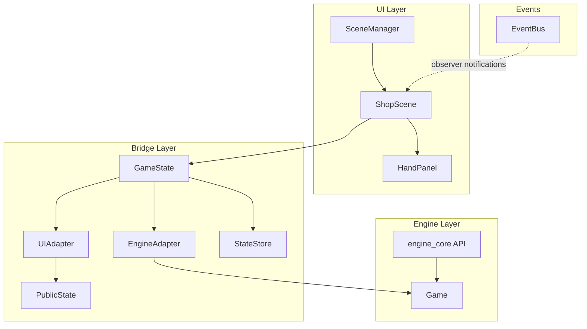

**Diagram sources**
- [v2/core/scene_manager.py:28-156](file://v2/core/scene_manager.py#L28-L156)
- [v2/scenes/shop.py:23-682](file://v2/scenes/shop.py#L23-L682)
- [v2/ui/hand_panel.py:25-221](file://v2/ui/hand_panel.py#L25-L221)
- [v2/core/game_state.py:14-173](file://v2/core/game_state.py#L14-L173)
- [v2/core/engine_adapter.py:38-301](file://v2/core/engine_adapter.py#L38-L301)
- [v2/core/ui_adapter.py:24-476](file://v2/core/ui_adapter.py#L24-L476)
- [v2/core/public_state.py:10-128](file://v2/core/public_state.py#L10-L128)
- [v2/core/state_store.py:3-56](file://v2/core/state_store.py#L3-L56)
- [_archive/v2/core/event_bus.py:9-44](file://_archive/v2/core/event_bus.py#L9-L44)
- [engine_core/__init__.py:17-46](file://engine_core/__init__.py#L17-L46)
- [engine_core/game.py:35-224](file://engine_core/game.py#L35-L224)

**Section sources**
- [v2/main.py:14-74](file://v2/main.py#L14-L74)
- [engine_core/__init__.py:17-46](file://engine_core/__init__.py#L17-L46)

## Core Components
- GameState: Singleton that holds the bridge to the engine, caches public state, and exposes mutation APIs for UI actions. It invalidates cache after mutations and builds PublicState via UIAdapter.
- EngineAdapter: Encapsulates engine attribute access and mutation calls, returning ActionResult codes and safe fallbacks.
- UIAdapter: Builds immutable PublicState snapshots from engine data, integrating CardDatabase and SynergyCalculator.
- StateStore: Reactive-style cache for UI-facing values (phase, view index, placement lock, pairings, board snapshots).
- PublicState: Immutable data structures representing UI-facing state for shops, hands, HUD, synergy, combat, and lobby/endgame views.
- ActionResult: Enumerated outcomes for engine mutations.
- EventBus: Observer pattern publisher/subscriber for UI notifications.
- SceneManager: Singleton managing scene transitions and rendering lifecycle.
- ShopScene and HandPanel: UI components that consume PublicState, issue controller actions, and render visuals.

**Section sources**
- [v2/core/game_state.py:14-173](file://v2/core/game_state.py#L14-L173)
- [v2/core/engine_adapter.py:38-301](file://v2/core/engine_adapter.py#L38-L301)
- [v2/core/ui_adapter.py:24-476](file://v2/core/ui_adapter.py#L24-L476)
- [v2/core/state_store.py:3-56](file://v2/core/state_store.py#L3-L56)
- [v2/core/public_state.py:10-128](file://v2/core/public_state.py#L10-L128)
- [v2/core/action_result.py:3-14](file://v2/core/action_result.py#L3-L14)
- [_archive/v2/core/event_bus.py:9-44](file://_archive/v2/core/event_bus.py#L9-L44)
- [v2/core/scene_manager.py:28-156](file://v2/core/scene_manager.py#L28-L156)
- [v2/scenes/shop.py:23-682](file://v2/scenes/shop.py#L23-L682)
- [v2/ui/hand_panel.py:25-221](file://v2/ui/hand_panel.py#L25-L221)

## Architecture Overview
The system follows a layered, event-driven design:
- UI invokes actions via ShopScene and HandPanel.
- Actions are delegated to GameState, which validates ownership and routes to EngineAdapter.
- EngineAdapter performs engine mutations and returns ActionResult codes.
- GameState invalidates cache and rebuilds PublicState via UIAdapter.
- PublicState is consumed by UI components for rendering and updates.
- EventBus supports observer-style notifications for UI reactions.
- SceneManager coordinates scene lifecycle and transitions.

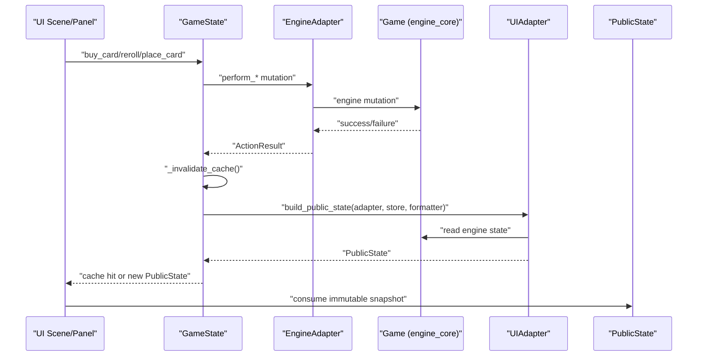

**Diagram sources**
- [v2/scenes/shop.py:223-248](file://v2/scenes/shop.py#L223-L248)
- [v2/core/game_state.py:92-172](file://v2/core/game_state.py#L92-L172)
- [v2/core/engine_adapter.py:81-175](file://v2/core/engine_adapter.py#L81-L175)
- [engine_core/game.py:157-200](file://engine_core/game.py#L157-L200)
- [v2/core/ui_adapter.py:97-120](file://v2/core/ui_adapter.py#L97-L120)
- [v2/core/public_state.py:118-128](file://v2/core/public_state.py#L118-L128)

## Detailed Component Analysis

### GameState and EngineAdapter Interaction
- Ownership checks: GameState enforces that only player index 0 can mutate shop-related actions.
- Adapter hooks: GameState attaches mutation callbacks to board mutations to invalidate cache.
- Delegation: All mutations route through EngineAdapter, which validates engine readiness and returns ActionResult codes.
- Cache invalidation: After each mutation, GameState clears cached PublicState to force a rebuild.

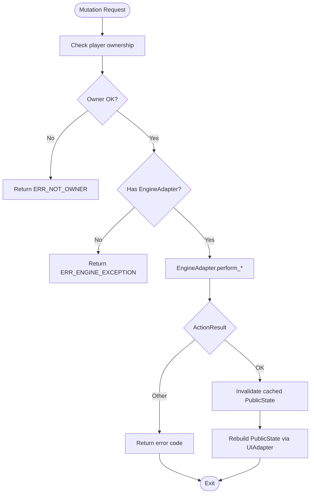

**Diagram sources**
- [v2/core/game_state.py:92-172](file://v2/core/game_state.py#L92-L172)
- [v2/core/engine_adapter.py:81-175](file://v2/core/engine_adapter.py#L81-L175)

**Section sources**
- [v2/core/game_state.py:37-172](file://v2/core/game_state.py#L37-L172)
- [v2/core/engine_adapter.py:38-301](file://v2/core/engine_adapter.py#L38-L301)

### UIAdapter and PublicState Construction
- UIAdapter constructs PublicState from engine data, including shop windows, hand, HUD, synergy, combat logs, and lobby/endgame stats.
- It integrates CardDatabase and SynergyCalculator to compute synergy groups and bonuses.
- On missing engine data, UIAdapter returns an empty PublicState snapshot to maintain UI stability.

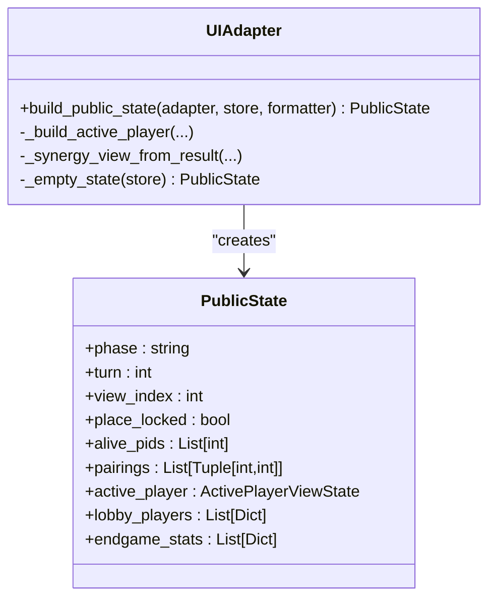

**Diagram sources**
- [v2/core/ui_adapter.py:97-120](file://v2/core/ui_adapter.py#L97-L120)
- [v2/core/public_state.py:118-128](file://v2/core/public_state.py#L118-L128)

**Section sources**
- [v2/core/ui_adapter.py:90-476](file://v2/core/ui_adapter.py#L90-L476)
- [v2/core/public_state.py:10-128](file://v2/core/public_state.py#L10-L128)

### Dependency Injection in engine_core
- Game constructor accepts injected dependencies: trigger_passive_fn, combat_phase_fn, card_pool, and ai_override.
- TurnManager and CombatEngine are injected into Game, centralizing orchestration and enabling parameterized training and engine swapping.

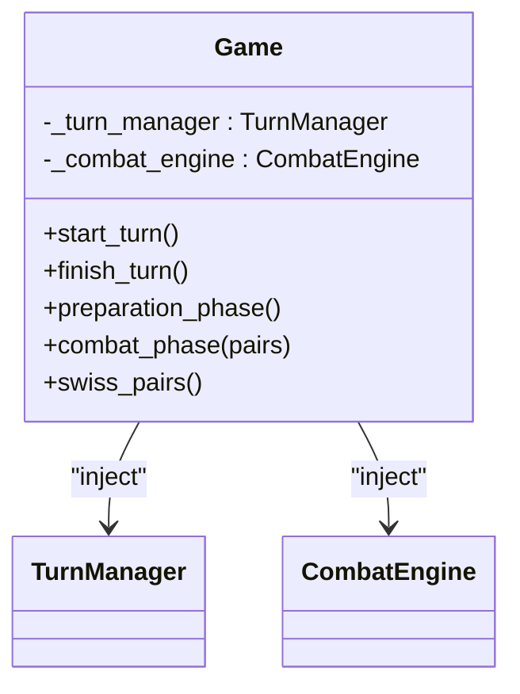

**Diagram sources**
- [engine_core/game.py:35-96](file://engine_core/game.py#L35-L96)

**Section sources**
- [engine_core/game.py:35-96](file://engine_core/game.py#L35-L96)

### Singleton Patterns
- GameState: Singleton via class-level instance storage and get() method.
- SceneManager: Singleton managing active scene transitions with fade overlays.
- EventBus: Singleton publisher/subscriber for UI observers.

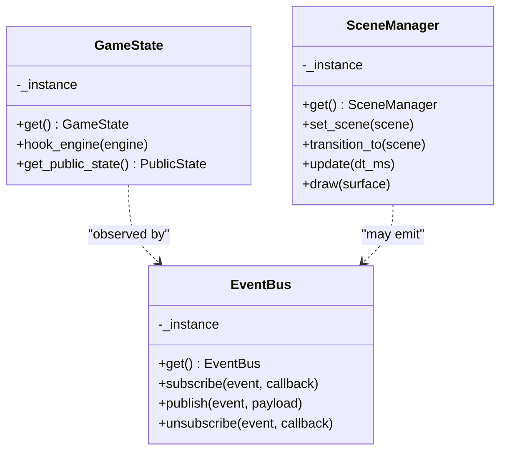

**Diagram sources**
- [v2/core/game_state.py:31-35](file://v2/core/game_state.py#L31-L35)
- [v2/core/scene_manager.py:56-60](file://v2/core/scene_manager.py#L56-L60)
- [_archive/v2/core/event_bus.py:12-16](file://_archive/v2/core/event_bus.py#L12-L16)

**Section sources**
- [v2/core/game_state.py:20-35](file://v2/core/game_state.py#L20-L35)
- [v2/core/scene_manager.py:44-60](file://v2/core/scene_manager.py#L44-L60)
- [_archive/v2/core/event_bus.py:9-44](file://_archive/v2/core/event_bus.py#L9-L44)

### Observer Pattern for UI Updates
- UI components subscribe to EventBus to react to state changes (e.g., gold updates, placement locks).
- EventBus publishes payloads to subscribers; errors are logged in debug mode without crashing.

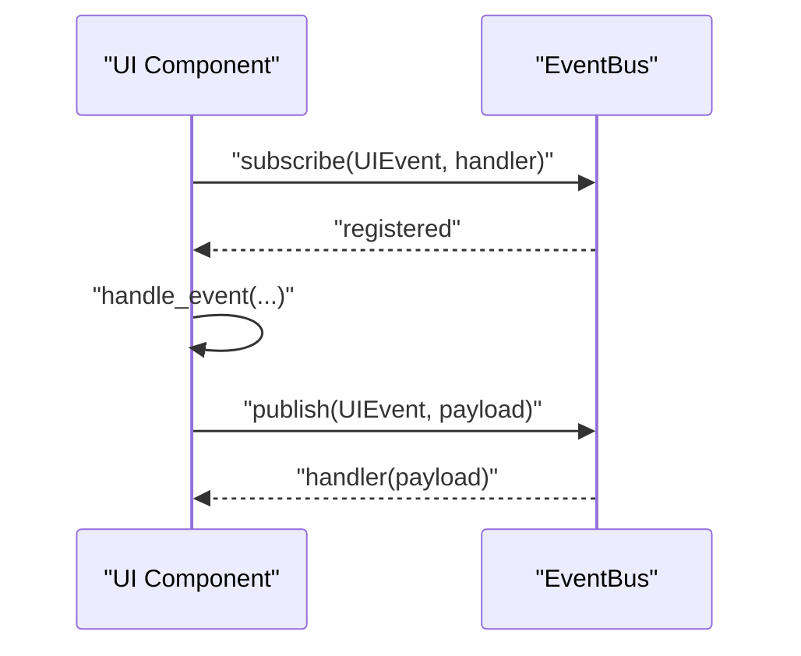

**Diagram sources**
- [_archive/v2/core/event_bus.py:21-32](file://_archive/v2/core/event_bus.py#L21-L32)

**Section sources**
- [_archive/v2/core/event_bus.py:9-44](file://_archive/v2/core/event_bus.py#L9-L44)

### Method Delegation Chains
- UI action: ShopScene.handle_event → controller → GameState → EngineAdapter → Game.
- Mutation result: EngineAdapter returns ActionResult; GameState invalidates cache and rebuilds PublicState.
- UI consumption: ShopScene.sync_view consumes PublicState for rendering.

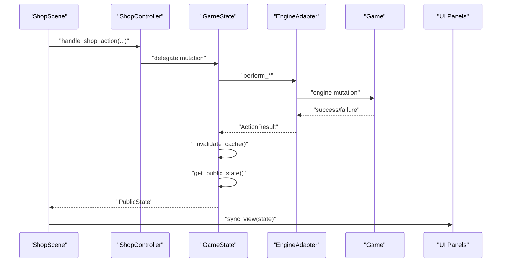

**Diagram sources**
- [v2/scenes/shop.py:223-248](file://v2/scenes/shop.py#L223-L248)
- [v2/core/game_state.py:92-172](file://v2/core/game_state.py#L92-L172)
- [v2/core/engine_adapter.py:81-175](file://v2/core/engine_adapter.py#L81-L175)
- [engine_core/game.py:157-200](file://engine_core/game.py#L157-L200)

**Section sources**
- [v2/scenes/shop.py:153-248](file://v2/scenes/shop.py#L153-L248)
- [v2/core/game_state.py:92-172](file://v2/core/game_state.py#L92-L172)
- [v2/core/engine_adapter.py:81-175](file://v2/core/engine_adapter.py#L81-L175)
- [engine_core/game.py:157-200](file://engine_core/game.py#L157-L200)

### Error Handling Strategies
- ActionResult codes unify error semantics across mutations (e.g., insufficient gold, invalid coordinates, engine exceptions).
- EngineAdapter wraps engine calls with try/catch and logs exceptions; returns safe defaults.
- UIAdapter gracefully falls back to empty PublicState when CardDatabase or SynergyCalculator fails.
- StateStore caches values to minimize repeated engine polling and reduce error propagation.

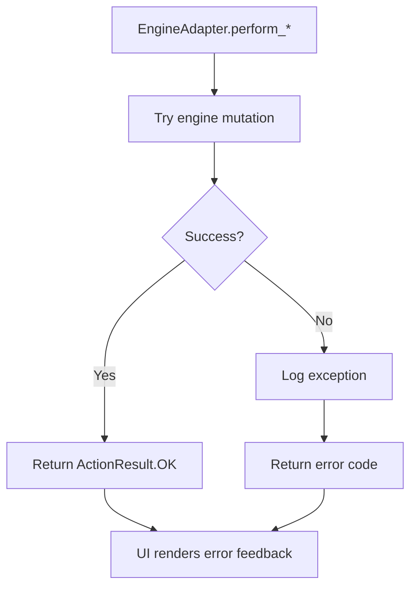

**Diagram sources**
- [v2/core/engine_adapter.py:81-114](file://v2/core/engine_adapter.py#L81-L114)
- [v2/core/ui_adapter.py:122-171](file://v2/core/ui_adapter.py#L122-L171)
- [v2/core/action_result.py:3-14](file://v2/core/action_result.py#L3-L14)

**Section sources**
- [v2/core/engine_adapter.py:81-114](file://v2/core/engine_adapter.py#L81-L114)
- [v2/core/ui_adapter.py:122-171](file://v2/core/ui_adapter.py#L122-L171)
- [v2/core/action_result.py:3-14](file://v2/core/action_result.py#L3-L14)

### Graceful Degradation
- When engine components are unavailable, EngineAdapter returns ERR_ENGINE_EXCEPTION and UIAdapter constructs an empty PublicState snapshot.
- AssetLoader failures are handled in UI components (e.g., HandPanel) by falling back to procedural card surfaces.
- UI remains interactive during degraded states; animations and audio preload failures are ignored to keep the app responsive.

**Section sources**
- [v2/core/engine_adapter.py:116-127](file://v2/core/engine_adapter.py#L116-L127)
- [v2/core/ui_adapter.py:122-171](file://v2/core/ui_adapter.py#L122-L171)
- [v2/ui/hand_panel.py:106-135](file://v2/ui/hand_panel.py#L106-L135)

### Integration Patterns: Pygame Rendering Pipeline, Asset Loading, and Game State
- Initialization: v2/main bootstraps AssetLoader, CardDatabase, builds a Game via engine_core.game_factory, and hooks it to GameState.
- Rendering: SceneManager drives the Pygame loop, delegating handle_event/update/draw to the active scene.
- Scene-to-state: ShopScene refreshes PublicState via controller and syncs UI panels (ShopPanel, HandPanel, HUD, SynergyHud).
- Assets: AssetLoader preloads SFX/Music and supplies card fronts/back surfaces; fallbacks are used when assets are missing.

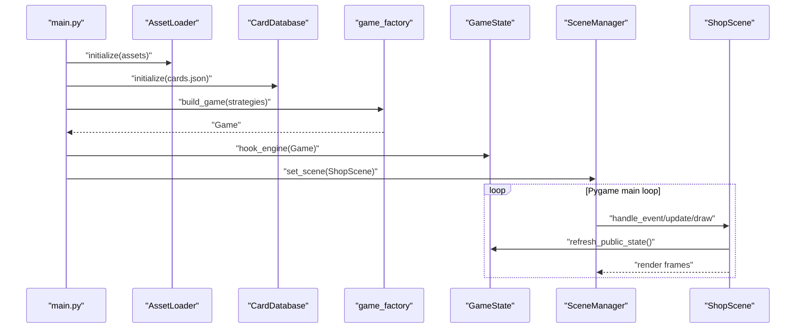

**Diagram sources**
- [v2/main.py:14-74](file://v2/main.py#L14-L74)
- [v2/core/scene_manager.py:64-135](file://v2/core/scene_manager.py#L64-L135)
- [v2/scenes/shop.py:102-111](file://v2/scenes/shop.py#L102-L111)

**Section sources**
- [v2/main.py:14-74](file://v2/main.py#L14-L74)
- [v2/core/scene_manager.py:28-156](file://v2/core/scene_manager.py#L28-L156)
- [v2/scenes/shop.py:102-111](file://v2/scenes/shop.py#L102-L111)

## Dependency Analysis
- Coupling: UI depends on GameState and PublicState; GameState depends on EngineAdapter and UIAdapter; EngineAdapter depends on engine_core.Game.
- Cohesion: UIAdapter encapsulates UI-specific transformations; EngineAdapter encapsulates engine access; GameState centralizes bridge logic.
- External dependencies: Pygame for rendering/input; AssetLoader for graphics/audio; engine_core for game logic.

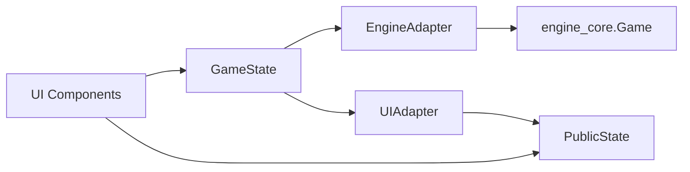

**Diagram sources**
- [v2/core/game_state.py:37-65](file://v2/core/game_state.py#L37-L65)
- [v2/core/engine_adapter.py:44-45](file://v2/core/engine_adapter.py#L44-L45)
- [v2/core/ui_adapter.py:97-120](file://v2/core/ui_adapter.py#L97-L120)
- [engine_core/game.py:35-96](file://engine_core/game.py#L35-L96)

**Section sources**
- [v2/core/game_state.py:37-65](file://v2/core/game_state.py#L37-L65)
- [v2/core/engine_adapter.py:44-45](file://v2/core/engine_adapter.py#L44-L45)
- [v2/core/ui_adapter.py:97-120](file://v2/core/ui_adapter.py#L97-L120)
- [engine_core/game.py:35-96](file://engine_core/game.py#L35-L96)

## Performance Considerations
- Caching: GameState caches PublicState and StateStore minimizes engine reads; invalidate cache only on mutations.
- Immutable snapshots: PublicState reduces UI recomputation overhead by providing stable references.
- Lazy computation: UIAdapter computes synergy once per build cycle; fallbacks avoid expensive operations when unavailable.
- Rendering efficiency: SceneManager fades are computed per frame; UI components batch updates and reuse surfaces.
- Zero-downtime engine swapping: Injected dependencies in Game allow swapping TurnManager/CombatEngine without UI changes.

[No sources needed since this section provides general guidance]

## Troubleshooting Guide
- Mutations fail: Check ActionResult codes returned by EngineAdapter; verify ownership and engine readiness.
- UI not updating: Confirm GameState cache invalidation and PublicState rebuild; ensure UI consumes cached snapshot.
- Asset errors: Verify AssetLoader initialization and fallbacks in UI components; preload sounds/music early.
- Engine exceptions: Wrap engine calls in EngineAdapter; log exceptions and return safe defaults.
- EventBus issues: Ensure subscriptions are registered before publishing; check debug-mode logs for subscriber errors.

**Section sources**
- [v2/core/action_result.py:3-14](file://v2/core/action_result.py#L3-L14)
- [v2/core/engine_adapter.py:81-114](file://v2/core/engine_adapter.py#L81-L114)
- [v2/ui/hand_panel.py:106-135](file://v2/ui/hand_panel.py#L106-L135)
- [_archive/v2/core/event_bus.py:32-34](file://_archive/v2/core/event_bus.py#L32-L34)

## Conclusion
Autochess Hybrid’s architecture cleanly separates UI, bridge, and engine layers, using a singleton GameState bridge, an EngineAdapter for controlled engine access, and a UIAdapter for immutable state snapshots. The EventBus enables observer-style updates, while StateStore and caching optimize performance. Dependency injection in engine_core allows flexible engine swapping and parameterized training. Robust error handling and graceful degradation ensure UI resilience under component failures. The Pygame integration and asset-loading pipeline remain cohesive with the bridge layer, delivering a responsive and extensible system.