# Design Patterns and Architectural Principles

<cite>
**Referenced Files in This Document**
- [game_factory.py](file://engine_core/game_factory.py)
- [ai.py](file://engine_core/ai.py)
- [passive_trigger.py](file://engine_core/passive_trigger.py)
- [event_logger.py](file://engine_core/event_logger.py)
- [scene_manager.py](file://v2/core/scene_manager.py)
- [engine_adapter.py](file://v2/core/engine_adapter.py)
- [ui_adapter.py](file://v2/core/ui_adapter.py)
- [game_state.py](file://v2/core/game_state.py)
- [state_store.py](file://v2/core/state_store.py)
- [public_state.py](file://v2/core/public_state.py)
- [board.py](file://engine_core/board.py)
- [game.py](file://engine_core/game.py)
- [exceptions.py](file://v2/core/exceptions.py)
- [implementation_plan_v2.md](file://implementation_plan_v2.md)
- [test_game_state_engine_contract.py](file://tests/test_game_state_engine_contract.py)
</cite>

## Update Summary
**Changes Made**
- Added documentation for new board mutation callback mechanism that ensures single-source data integrity
- Enhanced property-based data management patterns section with StateStore and PublicState implementations
- Updated error handling patterns documentation with standardized exception hierarchy
- Expanded state synchronization mechanisms to cover mutation callbacks and cache invalidation
- Added comprehensive coverage of property-based systems for UI-facing state management

## Table of Contents
1. [Introduction](#introduction)
2. [Project Structure](#project-structure)
3. [Core Components](#core-components)
4. [Architecture Overview](#architecture-overview)
5. [Detailed Component Analysis](#detailed-component-analysis)
6. [Enhanced State Synchronization](#enhanced-state-synchronization)
7. [Property-Based Data Management](#property-based-data-management)
8. [Standardized Error Handling](#standardized-error-handling)
9. [Dependency Analysis](#dependency-analysis)
10. [Performance Considerations](#performance-considerations)
11. [Troubleshooting Guide](#troubleshooting-guide)
12. [Conclusion](#conclusion)

## Introduction
This document explains the design patterns and architectural principles underpinning Autochess Hybrid's system design. It focuses on how the codebase applies and benefits from:
- Factory pattern for game instance creation and card pooling
- Strategy pattern for AI behaviors and interchangeable decision-making
- Observer pattern for event logging and passive-trigger systems
- Dependency injection for testability and modularity
- Singleton pattern in GameState and SceneManager
- Adapter pattern for engine abstraction
- Bridge pattern for UI-engine separation
- **Enhanced state synchronization through mutation callbacks**
- **Property-based data management systems**
- **Standardized error handling patterns**

The goal is to connect each pattern to concrete implementation files and show how they improve maintainability, extensibility, and testability.

## Project Structure
Autochess Hybrid separates the simulation core from the UI layer:
- engine_core/: Pure simulation logic (game loop, board, market, AI, passive triggers, combat)
- v2/: UI, scenes, adapters, and state management for rendering and user interaction
- Tests and scripts validate contracts and integration between layers

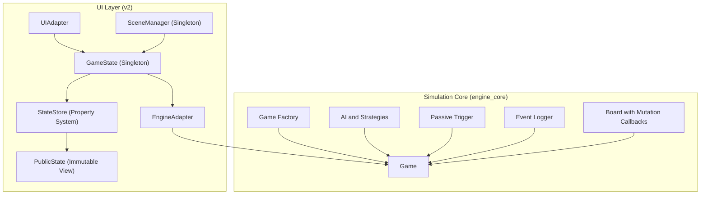

**Diagram sources**
- [game_factory.py:30-70](file://engine_core/game_factory.py#L30-L70)
- [game.py:35-200](file://engine_core/game.py#L35-L200)
- [board.py:65-81](file://engine_core/board.py#L65-L81)
- [game_state.py:41-58](file://v2/core/game_state.py#L41-L58)
- [state_store.py:3-17](file://v2/core/state_store.py#L3-L17)
- [public_state.py:10-128](file://v2/core/public_state.py#L10-L128)
- [scene_manager.py:28-156](file://v2/core/scene_manager.py#L28-L156)
- [engine_adapter.py:38-301](file://v2/core/engine_adapter.py#L38-L301)
- [ui_adapter.py:24-476](file://v2/core/ui_adapter.py#L24-L476)

**Section sources**
- [game_factory.py:1-70](file://engine_core/game_factory.py#L1-L70)
- [game.py:1-200](file://engine_core/game.py#L1-L200)
- [board.py:1-449](file://engine_core/board.py#L1-L449)
- [game_state.py:1-173](file://v2/core/game_state.py#L1-L173)
- [state_store.py:1-56](file://v2/core/state_store.py#L1-L56)
- [public_state.py:1-128](file://v2/core/public_state.py#L1-L128)
- [scene_manager.py:1-156](file://v2/core/scene_manager.py#L1-L156)
- [engine_adapter.py:1-301](file://v2/core/engine_adapter.py#L1-L301)
- [ui_adapter.py:1-476](file://v2/core/ui_adapter.py#L1-L476)

## Core Components
- Game Factory builds a Game with injected dependencies (rng, card pool, players, passive trigger, combat phase, AI).
- AI module encapsulates multiple strategies with parameterized behavior and a builder synergy matrix.
- Passive trigger system logs passive events and maintains per-card/per-trigger counts.
- Event Logger provides an independent, buffered logging mechanism for detailed simulation insights.
- **GameState singleton with enhanced mutation callback system**: Orchestrates engine mutations and ensures single-source data integrity through board mutation hooks.
- **StateStore with property-based system**: Reactive-style store that provides read-only snapshots and caches values to minimize engine polling.
- **PublicState immutable view**: Frozen dataclass representing the single-source-of-truth UI state.
- EngineAdapter bridges UI actions to engine operations, normalizing differences between GameState and engine APIs.
- UIAdapter transforms engine-facing data into UI view models for rendering and HUD updates.
- SceneManager coordinates scene transitions and acts as a singleton for UI lifecycle.

**Section sources**
- [game_factory.py:30-70](file://engine_core/game_factory.py#L30-L70)
- [ai.py:1147-1231](file://engine_core/ai.py#L1147-L1231)
- [passive_trigger.py:51-137](file://engine_core/passive_trigger.py#L51-L137)
- [event_logger.py:22-251](file://engine_core/event_logger.py#L22-L251)
- [game_state.py:41-58](file://v2/core/game_state.py#L41-L58)
- [state_store.py:3-17](file://v2/core/state_store.py#L3-L17)
- [public_state.py:10-128](file://v2/core/public_state.py#L10-L128)
- [engine_adapter.py:38-301](file://v2/core/engine_adapter.py#L38-L301)
- [ui_adapter.py:24-476](file://v2/core/ui_adapter.py#L24-L476)
- [scene_manager.py:28-156](file://v2/core/scene_manager.py#L28-L156)

## Architecture Overview
The system follows an event-driven architecture with clear separation of concerns and enhanced state synchronization:
- engine_core/ owns the authoritative game logic and state transitions
- v2/ owns UI rendering, scenes, and user input handling
- **Enhanced state synchronization**: Board mutation callbacks ensure cache invalidation even when mutations occur outside GameState APIs
- **Property-based data management**: StateStore and PublicState provide immutable, reactive state management
- Adapters and singletons mediate between layers, enabling testability and modularity

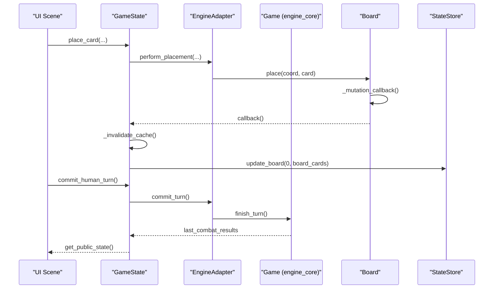

**Diagram sources**
- [game_state.py:118-161](file://v2/core/game_state.py#L118-L161)
- [engine_adapter.py:129-176](file://v2/core/engine_adapter.py#L129-L176)
- [board.py:65-81](file://engine_core/board.py#L65-L81)
- [state_store.py:40-56](file://v2/core/state_store.py#L40-L56)
- [implementation_plan_v2.md:505-534](file://v2/HYBRID_ENGINE_CORE_VS_MOCK_REPORT.md#L505-L534)

## Detailed Component Analysis

### Factory Pattern: Game Instance Creation and Card Pooling
- Purpose: Centralize construction of Game with all dependencies to avoid circular imports and enable clean instantiation.
- Implementation highlights:
  - Builds a random number generator and card pool
  - Shuffles default strategies and creates Player instances
  - Injects trigger_passive_fn, combat_phase_fn, and card_pool into Game
- Benefits: Decouples creation from usage, simplifies testing, and supports deterministic fixtures.

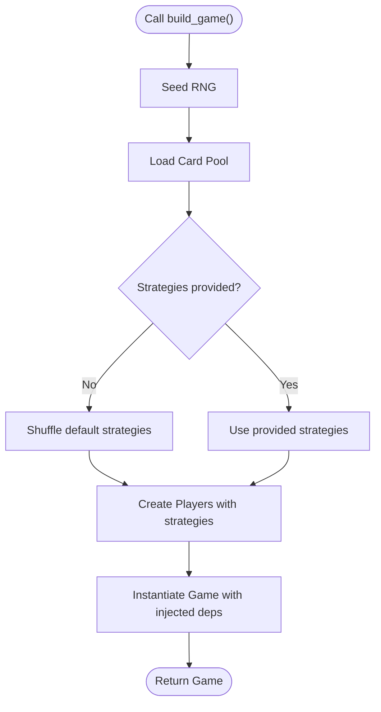

**Diagram sources**
- [game_factory.py:30-70](file://engine_core/game_factory.py#L30-L70)

**Section sources**
- [game_factory.py:30-70](file://engine_core/game_factory.py#L30-L70)

### Strategy Pattern: Interchangeable AI Behaviors
- Purpose: Allow multiple AI strategies with parameterized behavior and dynamic selection.
- Implementation highlights:
  - ParameterizedAI encapsulates strategy parameters loaded from JSON and defaults
  - TRAINED_PARAMS define baseline weights and thresholds per strategy
  - BuilderSynergyMatrix maintains session-level synergy memory for combo optimization
  - AI class exposes buy/place decisions with time budgets and lookahead limits
- Benefits: Easy to add new strategies, tune parameters, and swap AI during training or demos.

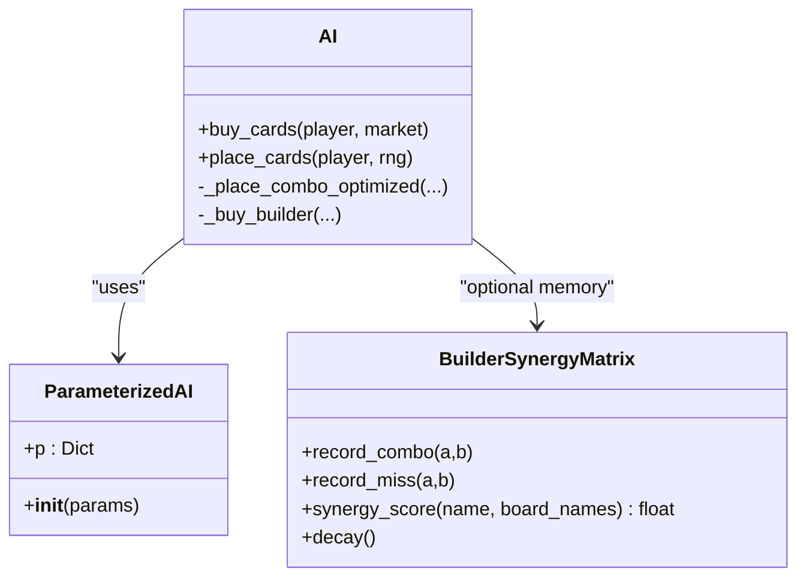

**Diagram sources**
- [ai.py:1147-1231](file://engine_core/ai.py#L1147-L1231)
- [ai.py:135-200](file://engine_core/ai.py#L135-L200)

**Section sources**
- [ai.py:1147-1231](file://engine_core/ai.py#L1147-L1231)
- [ai.py:135-200](file://engine_core/ai.py#L135-L200)

### Observer Pattern: Event Logging and Passive Triggers
- Purpose: Decouple event producers (engine) from observers (logging/UI) and support passive-trigger feedback.
- Implementation highlights:
  - Passive trigger logs per-card/per-trigger counts into player and game-level buffers
  - EventLogger writes buffered events to JSONL files with a configurable global flag
  - UI reads passive_buff_log via EngineAdapter to render passive feed
- Benefits: Non-intrusive instrumentation, replayable logs, and reactive UI updates.

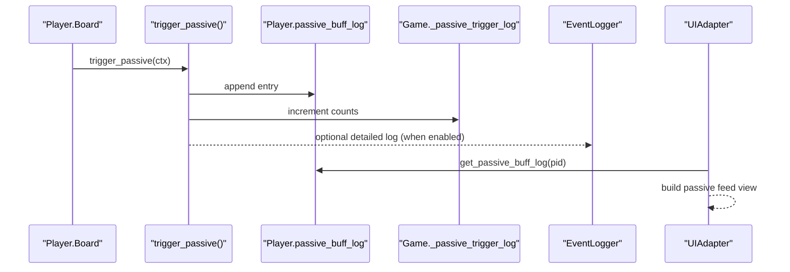

**Diagram sources**
- [passive_trigger.py:51-137](file://engine_core/passive_trigger.py#L51-L137)
- [event_logger.py:22-251](file://engine_core/event_logger.py#L22-L251)
- [ui_adapter.py:24-476](file://v2/core/ui_adapter.py#L24-L476)

**Section sources**
- [passive_trigger.py:51-137](file://engine_core/passive_trigger.py#L51-L137)
- [event_logger.py:22-251](file://engine_core/event_logger.py#L22-L251)
- [ui_adapter.py:24-476](file://v2/core/ui_adapter.py#L24-L476)

### Dependency Injection: Modularity and Testability
- Purpose: Make subsystems pluggable and replaceable for testing and training.
- Implementation highlights:
  - Game accepts trigger_passive_fn, combat_phase_fn, card_pool, and ai_override
  - EngineAdapter wraps engine operations and exposes normalized methods
  - GameState holds EngineAdapter and UIAdapter instances and invalidates cache on mutation
- Benefits: Clear contracts, easy mocking, and minimal coupling between layers.

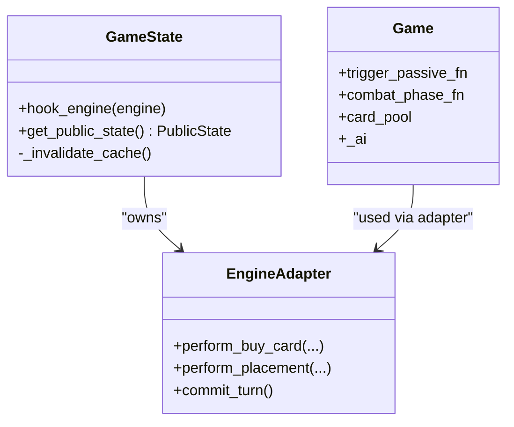

**Diagram sources**
- [game.py:35-96](file://engine_core/game.py#L35-L96)
- [engine_adapter.py:38-301](file://v2/core/engine_adapter.py#L38-L301)
- [game_state.py:37-65](file://v2/core/game_state.py#L37-L65)

**Section sources**
- [game.py:35-96](file://engine_core/game.py#L35-L96)
- [engine_adapter.py:38-301](file://v2/core/engine_adapter.py#L38-L301)
- [game_state.py:37-65](file://v2/core/game_state.py#L37-L65)
- [HYBRID_ENGINE_CORE_VS_MOCK_REPORT.md:157-168](file://v2/HYBRID_ENGINE_CORE_VS_MOCK_REPORT.md#L157-L168)

### Singleton Pattern: GameState and SceneManager
- Purpose: Provide global access to shared state and UI lifecycle management.
- Implementation highlights:
  - GameState.get() ensures a single instance and caches PublicState
  - SceneManager.get() returns the singleton managing scene transitions
- Benefits: Consistent access to state and UI without passing references everywhere.

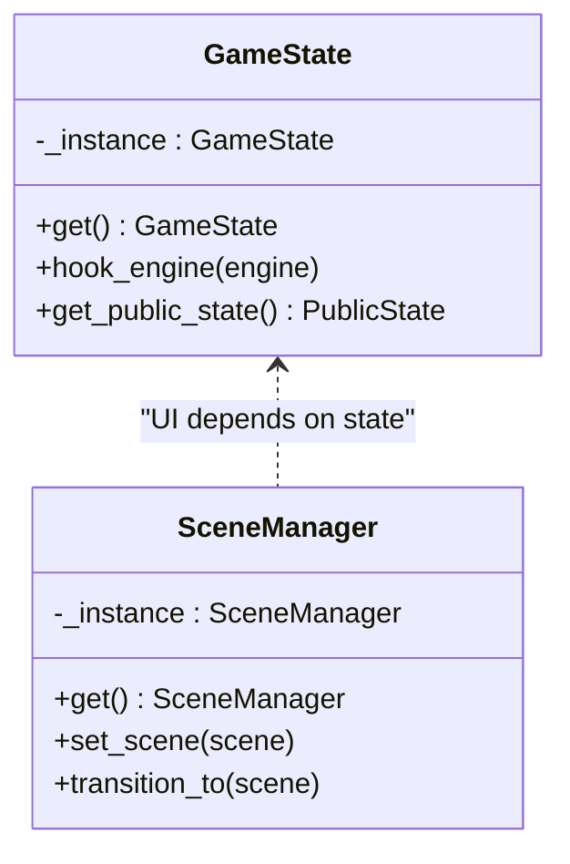

**Diagram sources**
- [game_state.py:20-35](file://v2/core/game_state.py#L20-L35)
- [scene_manager.py:44-60](file://v2/core/scene_manager.py#L44-L60)

**Section sources**
- [game_state.py:20-35](file://v2/core/game_state.py#L20-L35)
- [scene_manager.py:44-60](file://v2/core/scene_manager.py#L44-L60)

### Adapter Pattern: Engine Abstraction
- Purpose: Normalize engine operations behind a stable facade for UI.
- Implementation highlights:
  - EngineAdapter exposes methods like get_shop_window, perform_buy_card, perform_placement, commit_turn, run_combat_phase
  - Handles missing attributes gracefully and logs failures
- Benefits: UI remains decoupled from engine internals and can evolve independently.

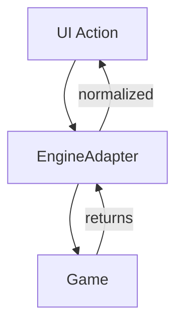

**Diagram sources**
- [engine_adapter.py:38-301](file://v2/core/engine_adapter.py#L38-L301)

**Section sources**
- [engine_adapter.py:38-301](file://v2/core/engine_adapter.py#L38-L301)

### Bridge Pattern: UI-Engine Separation
- Purpose: Keep UI and engine independent while enabling controlled communication.
- Implementation highlights:
  - GameState orchestrates mutations and caches PublicState
  - UIAdapter transforms engine-facing data into UI view models
  - EngineAdapter mediates between GameState and engine operations
- Benefits: Clean separation, testable UI, and flexible engine evolution.

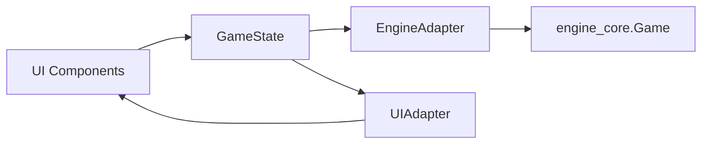

**Diagram sources**
- [game_state.py:59-65](file://v2/core/game_state.py#L59-L65)
- [ui_adapter.py:97-121](file://v2/core/ui_adapter.py#L97-L121)
- [engine_adapter.py:38-301](file://v2/core/engine_adapter.py#L38-L301)

**Section sources**
- [game_state.py:59-65](file://v2/core/game_state.py#L59-L65)
- [ui_adapter.py:97-121](file://v2/core/ui_adapter.py#L97-L121)
- [engine_adapter.py:38-301](file://v2/core/engine_adapter.py#L38-L301)

## Enhanced State Synchronization

### Board Mutation Callback Mechanism
**Updated** The system now implements a robust board mutation callback mechanism to ensure single-source data integrity across all state access patterns.

The enhancement addresses critical state desynchronization issues by implementing automatic cache invalidation through mutation callbacks:

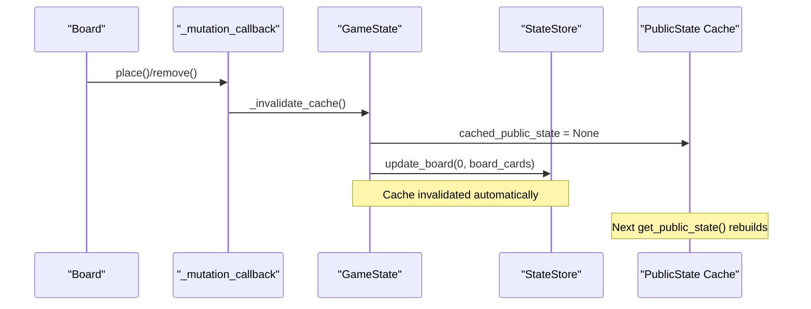

**Key Implementation Details:**
- **Board mutation hooks**: Board class maintains `_mutation_callback` attribute that gets triggered on every place/remove operation
- **Automatic cache invalidation**: GameState._invalidate_cache() is called automatically when board mutations occur
- **StateStore synchronization**: StateStore.update_board() synchronizes local board caches with current engine state
- **Cross-layer consistency**: Works whether mutations occur through GameState APIs or directly on engine objects

**Section sources**
- [board.py:65-81](file://engine_core/board.py#L65-L81)
- [game_state.py:41-58](file://v2/core/game_state.py#L41-L58)
- [state_store.py:40-56](file://v2/core/state_store.py#L40-L56)
- [implementation_plan_v2.md:62-80](file://v2/HYBRID_ENGINE_CORE_VS_MOCK_REPORT.md#L62-L80)

### State Synchronization Guarantees
The mutation callback system provides several critical guarantees:

1. **Single-source data integrity**: All state access goes through GameState.get_public_state() ensuring consistency
2. **Automatic cache management**: No manual cache invalidation required - handled automatically
3. **Cross-layer synchronization**: Works regardless of where mutations originate
4. **Performance optimization**: Cached PublicState rebuilt only when needed

**Section sources**
- [test_game_state_engine_contract.py:164-181](file://tests/test_game_state_engine_contract.py#L164-L181)

## Property-Based Data Management

### StateStore Reactive System
**Updated** The StateStore component implements a comprehensive property-based system for managing UI-facing state with automatic synchronization.

The StateStore provides:
- **Reactive property system**: Properties with getter/setter pairs for controlled state access
- **Local caching**: Optimistic caching of board state to minimize engine polling
- **Automatic synchronization**: Seamless updates when engine state changes
- **Type safety**: Strong typing for all state properties

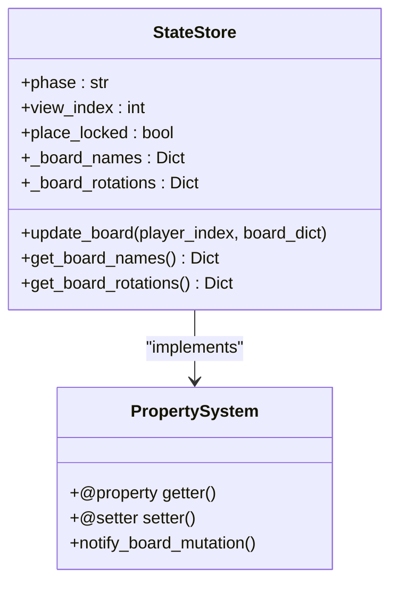

**Diagram sources**
- [state_store.py:3-17](file://v2/core/state_store.py#L3-L17)
- [state_store.py:40-56](file://v2/core/state_store.py#L40-L56)

**Key Features:**
- **Immutable PublicState**: All UI state is exposed through frozen dataclasses
- **Property decorators**: Controlled access to internal state with validation
- **Board state synchronization**: Automatic updates when engine board changes
- **Pairings caching**: Efficient storage of tournament pairings

**Section sources**
- [state_store.py:1-56](file://v2/core/state_store.py#L1-L56)
- [public_state.py:10-128](file://v2/core/public_state.py#L10-L128)

### PublicState Immutable View
**Updated** PublicState serves as the single-source-of-truth immutable view of the game state, designed specifically for UI consumption.

**PublicState Characteristics:**
- **Frozen dataclasses**: All fields are immutable once constructed
- **Comprehensive coverage**: Includes all UI-relevant state (board, shop, hand, combat, synergy)
- **Type safety**: Strong typing for all state fields
- **Performance optimized**: Built once per frame and cached until state changes

**Section sources**
- [public_state.py:10-128](file://v2/core/public_state.py#L10-L128)

## Standardized Error Handling

### Exception Hierarchy
**Updated** The system implements a comprehensive exception hierarchy for standardized error handling across all components.

The exception hierarchy provides clear categorization and handling patterns:

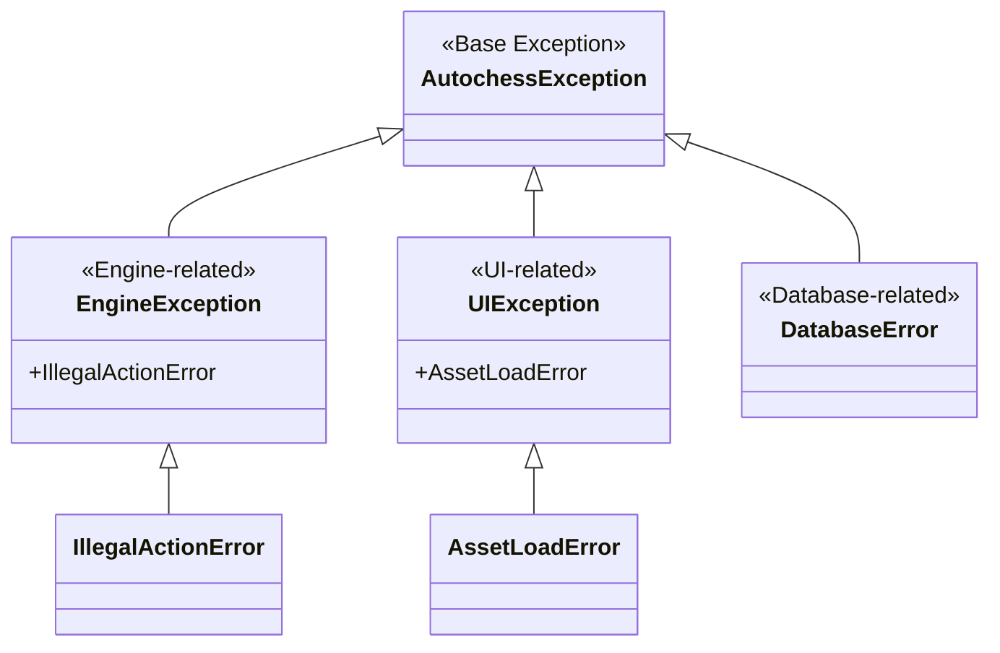

**Diagram sources**
- [exceptions.py:18-49](file://v2/core/exceptions.py#L18-L49)

**Error Handling Patterns:**
- **Consistent exception types**: All components use the standardized hierarchy
- **Specific error categories**: Clear distinction between engine, UI, and database errors
- **Graceful degradation**: Components handle errors without crashing the entire system
- **Logging integration**: All exceptions are properly logged with context

**Section sources**
- [exceptions.py:1-49](file://v2/core/exceptions.py#L1-L49)

### Error Handling in Key Components
- **EngineAdapter**: Comprehensive error handling for all engine interactions with detailed logging
- **UIAdapter**: Graceful fallbacks when engine data is unavailable or corrupted
- **GameState**: Centralized error handling with cache invalidation on failure states

**Section sources**
- [engine_adapter.py:81-114](file://v2/core/engine_adapter.py#L81-L114)
- [ui_adapter.py:213-218](file://v2/core/ui_adapter.py#L213-L218)
- [game_state.py:92-111](file://v2/core/game_state.py#L92-L111)

## Dependency Analysis
Key dependencies and contracts with enhanced state management:
- engine_core/Game depends on injected callbacks for passive triggers and combat resolution
- v2/GameState depends on EngineAdapter and UIAdapter for read/write operations
- **Enhanced**: Board mutation callbacks ensure state consistency across all access patterns
- **New**: StateStore provides property-based reactive state management
- **New**: PublicState serves as immutable single-source-of-truth for UI
- UI components depend on GameState for PublicState and on EventBus indirectly via controller orchestration

```mermaid
graph TB
EC_Game["engine_core.Game"] --> EC_AI["engine_core.AI"]
EC_Game --> EC_TM["TurnManager"]
EC_Game --> EC_CE["CombatEngine"]
EC_Board["engine_core.Board"] --> EC_Game
V2_State["v2.GameState"] --> V2_EA["v2.EngineAdapter"]
V2_State --> V2_UA["v2.UIAdapter"]
V2_State --> V2_SS["v2.StateStore"]
V2_SS --> V2_PS["v2.PublicState"]
V2_EA --> EC_Game
V2_Scene["v2.Scene"] --> V2_State
EC_Board -.-> V2_State : "mutation callbacks"
```

**Diagram sources**
- [game.py:35-96](file://engine_core/game.py#L35-L96)
- [board.py:65-81](file://engine_core/board.py#L65-L81)
- [game_state.py:41-58](file://v2/core/game_state.py#L41-L58)
- [state_store.py:3-17](file://v2/core/state_store.py#L3-L17)
- [public_state.py:10-128](file://v2/core/public_state.py#L10-L128)
- [engine_adapter.py:38-301](file://v2/core/engine_adapter.py#L38-L301)

**Section sources**
- [game.py:35-96](file://engine_core/game.py#L35-L96)
- [board.py:65-81](file://engine_core/board.py#L65-L81)
- [game_state.py:41-58](file://v2/core/game_state.py#L41-L58)
- [state_store.py:3-17](file://v2/core/state_store.py#L3-L17)
- [public_state.py:10-128](file://v2/core/public_state.py#L10-L128)
- [engine_adapter.py:38-301](file://v2/core/engine_adapter.py#L38-L301)

## Performance Considerations
- **Enhanced caching**: GameState caches PublicState and invalidates on mutations to avoid recomputation
- **Buffering**: EventLogger buffers events and flushes periodically to reduce I/O overhead
- **Determinism**: RNG drift in passive-triggered chance effects can break snapshot tests; intercept global RNG usage
- **Dynamic stats**: UI must reflect dynamic engine stats, not static templates, to prevent ghost stats
- **Mutation optimization**: Board mutation callbacks eliminate redundant state rebuilds
- **Property system efficiency**: StateStore properties minimize engine polling through intelligent caching

**Section sources**
- [game_state.py:55-65](file://v2/core/game_state.py#L55-L65)
- [event_logger.py:173-218](file://engine_core/event_logger.py#L173-L218)
- [implementation_plan_v2.md:1265-1276](file://implementation_plan_v2.md#L1265-L1276)
- [state_store.py:3-17](file://v2/core/state_store.py#L3-L17)

## Troubleshooting Guide
- **Legacy passive logging**: Deprecated functions remain exported; remove or add deprecation warnings to avoid confusion
- **Global RNG leakage**: Ensure EngineAdapter and passive-triggered effects use the engine's RNG to prevent test instability
- **UI/engine mismatch**: Verify that UI renders dynamic stats from PublicState rather than static templates
- **State desynchronization**: Use GameState.get_public_state() exclusively to ensure cache consistency
- **Mutation callback issues**: Verify board mutation hooks are properly attached during GameState.hook_engine()

**Section sources**
- [passive_trigger.py:128-137](file://engine_core/passive_trigger.py#L128-L137)
- [implementation_plan_v2.md:1265-1276](file://implementation_plan_v2.md#L1265-L1276)
- [test_game_state_engine_contract.py:164-181](file://tests/test_game_state_engine_contract.py#L164-L181)

## Conclusion
Autochess Hybrid's architecture leverages well-defined patterns to achieve separation of concerns, testability, and modularity with enhanced state management:

**Core Patterns Maintained:**
- Factory and dependency injection streamline construction and decouple components
- Strategy pattern enables flexible, parameterized AI behaviors
- Observer pattern powers passive-trigger feedback and detailed event logging
- Singleton patterns in GameState and SceneManager provide global access with clear lifecycles
- Adapter and bridge patterns isolate UI from engine internals, enabling independent evolution

**Enhanced Features:**
- **Mutation callback system**: Automatic state synchronization eliminates desynchronization risks
- **Property-based state management**: Reactive StateStore with automatic cache invalidation
- **Immutable PublicState**: Single-source-of-truth UI state with comprehensive coverage
- **Standardized error handling**: Comprehensive exception hierarchy for predictable error management
- **Performance optimizations**: Intelligent caching and efficient state rebuilding mechanisms

These enhancements collectively support maintainability, extensibility, and robust integration across simulation and UI layers while providing stronger guarantees around state consistency and error handling reliability.