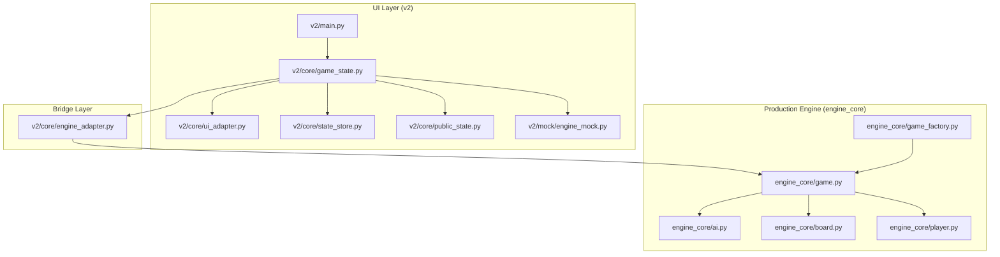
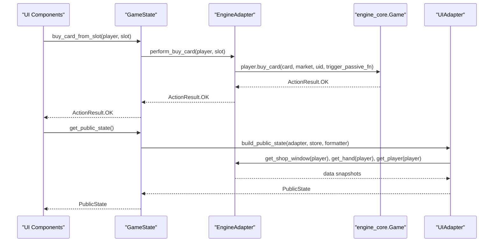
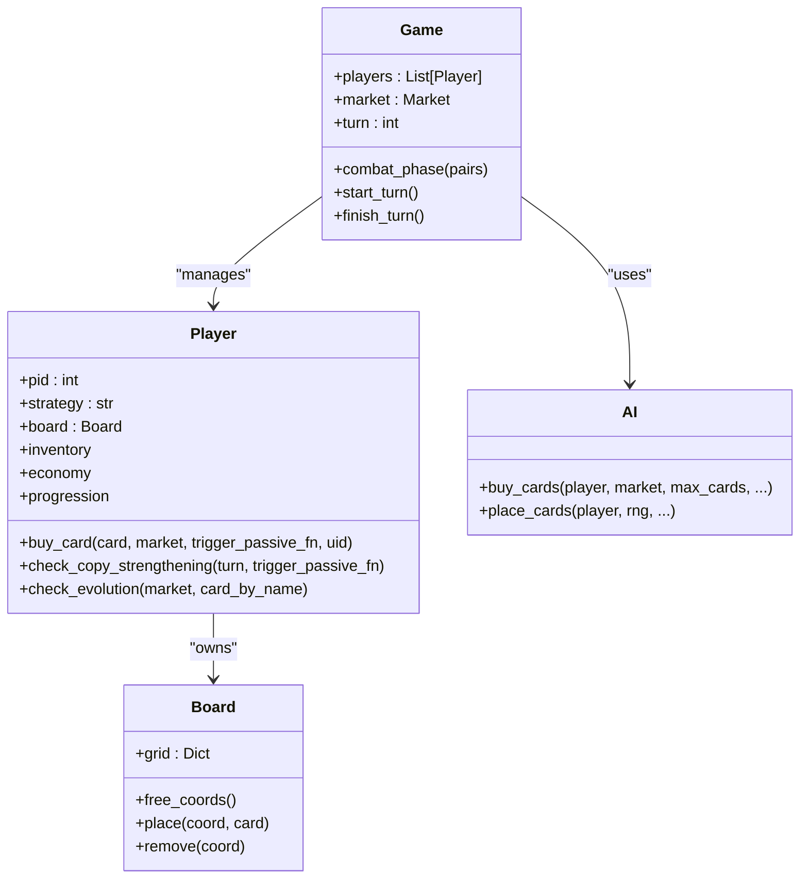
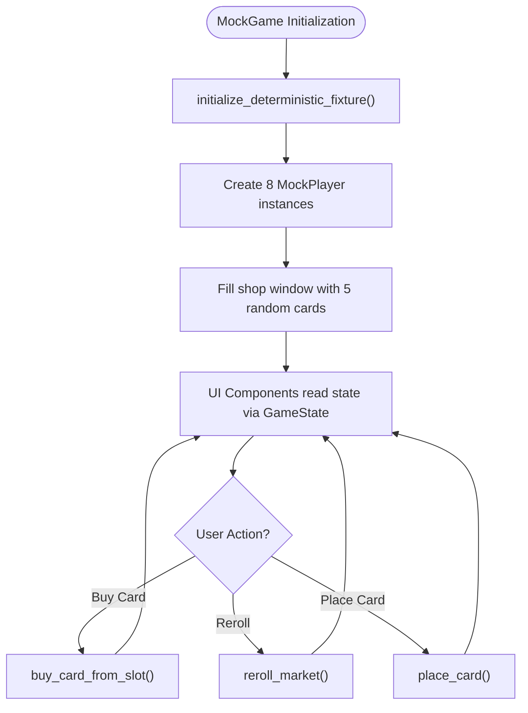
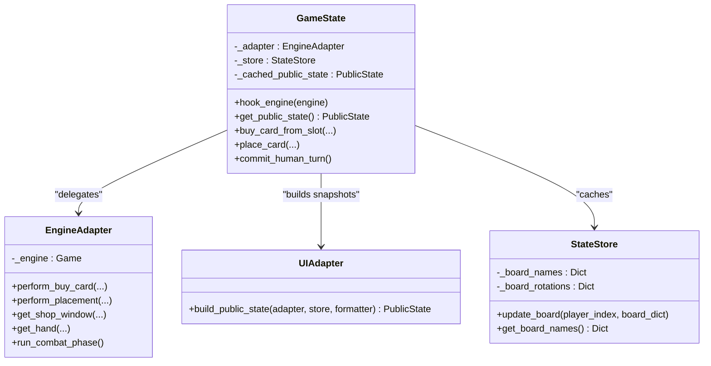
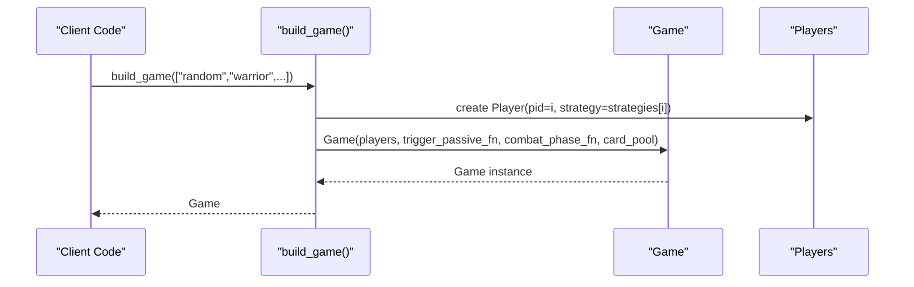
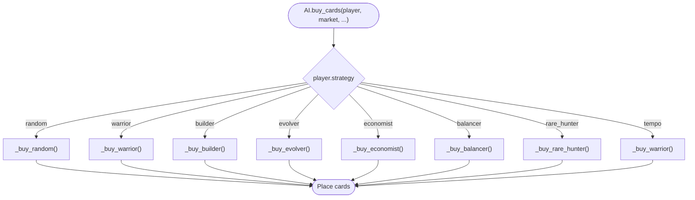
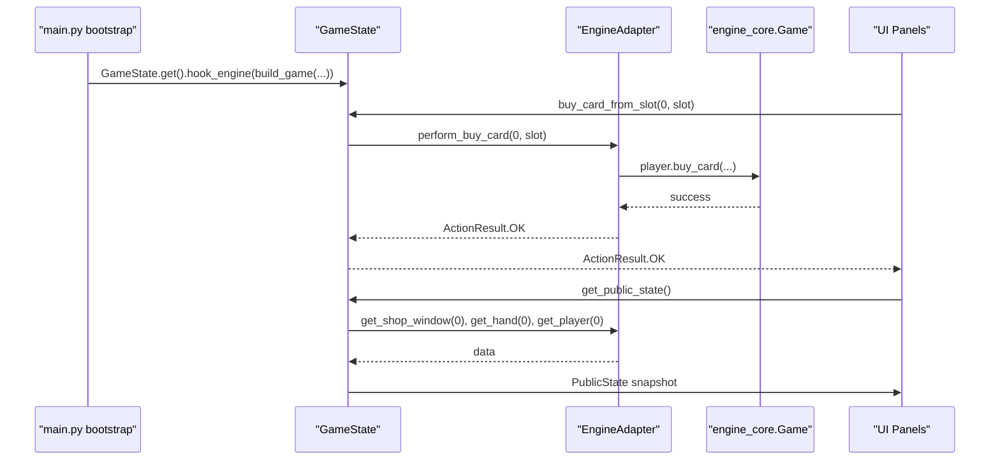
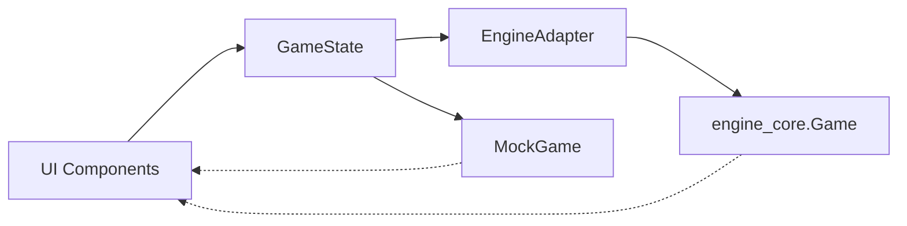

# Legacy vs Modern Architecture

<cite>
**Referenced Files in This Document**
- [engine_core/__init__.py](file://engine_core/__init__.py)
- [engine_core/game_factory.py](file://engine_core/game_factory.py)
- [engine_core/game.py](file://engine_core/game.py)
- [engine_core/board.py](file://engine_core/board.py)
- [engine_core/player.py](file://engine_core/player.py)
- [engine_core/ai.py](file://engine_core/ai.py)
- [v2/mock/engine_mock.py](file://v2/mock/engine_mock.py)
- [v2/core/engine_adapter.py](file://v2/core/engine_adapter.py)
- [v2/core/game_state.py](file://v2/core/game_state.py)
- [v2/core/public_state.py](file://v2/core/public_state.py)
- [v2/core/state_store.py](file://v2/core/state_store.py)
- [v2/core/ui_adapter.py](file://v2/core/ui_adapter.py)
- [v2/main.py](file://v2/main.py)
- [v2/HYBRID_ENGINE_CORE_VS_MOCK_REPORT.md](file://v2/HYBRID_ENGINE_CORE_VS_MOCK_REPORT.md)
</cite>

## Table of Contents
1. [Introduction](#introduction)
2. [Project Structure](#project-structure)
3. [Core Components](#core-components)
4. [Architecture Overview](#architecture-overview)
5. [Detailed Component Analysis](#detailed-component-analysis)
6. [Dependency Analysis](#dependency-analysis)
7. [Performance Considerations](#performance-considerations)
8. [Troubleshooting Guide](#troubleshooting-guide)
9. [Conclusion](#conclusion)

## Introduction
This document presents a comprehensive architectural comparison between the legacy engine_core/ and the modern v2/ architecture of AutoChess Hybrid. The legacy engine_core/ provides a complete, production-grade game engine with full combat resolution, passive effects, 8 AI strategies, economy and evolution systems, and Swiss pairing. The modern v2/ architecture introduces a bridge layer (GameState) that enables parallel UI development against a lightweight mock engine, while preserving the ability to swap to the production engine with minimal friction. The document explains the factory pattern for game creation, the strategy pattern for AI implementations, and the architectural decisions that maintain backward compatibility while enabling rapid UI iteration.

## Project Structure
The repository separates concerns into three layers:
- engine_core/: Production game engine with complete simulation and AI
- v2/: UI framework and bridge layer for parallel development
- Shared assets and tests supporting both layers

**Diagram sources**
- [v2/main.py:14-35](file://v2/main.py#L14-L35)
- [v2/core/game_state.py:37-40](file://v2/core/game_state.py#L37-L40)
- [v2/core/engine_adapter.py:38-46](file://v2/core/engine_adapter.py#L38-L46)
- [engine_core/game_factory.py:30-70](file://engine_core/game_factory.py#L30-L70)
- [engine_core/game.py:35-96](file://engine_core/game.py#L35-L96)

**Section sources**
- [v2/HYBRID_ENGINE_CORE_VS_MOCK_REPORT.md:172-211](file://v2/HYBRID_ENGINE_CORE_VS_MOCK_REPORT.md#L172-L211)
- [v2/main.py:14-35](file://v2/main.py#L14-L35)

## Core Components
- Legacy engine_core/ provides:
  - Game orchestration, turn management, and Swiss pairing
  - Full combat resolution with edge-to-edge combat, group advantage, synergy bonuses, and damage scaling
  - Passive effect system with registry-based dispatch and lifecycle triggers
  - Economy system (income, interest, card costs, rarity-weighted markets)
  - Evolution mechanics and copy strengthening
  - AI strategies with parameterized training and synergy matrices
  - Factory pattern for game creation with configurable strategies

- v2/ bridge layer provides:
  - GameState singleton acting as the UI engine abstraction
  - UIAdapter that constructs immutable PublicState snapshots
  - StateStore caching and reactive updates
  - EngineAdapter wrapping engine_core.Game for UI integration
  - Mock engine for parallel UI development

**Section sources**
- [engine_core/__init__.py:17-46](file://engine_core/__init__.py#L17-L46)
- [engine_core/game_factory.py:30-70](file://engine_core/game_factory.py#L30-L70)
- [engine_core/game.py:35-96](file://engine_core/game.py#L35-L96)
- [v2/core/game_state.py:14-40](file://v2/core/game_state.py#L14-L40)
- [v2/core/engine_adapter.py:38-46](file://v2/core/engine_adapter.py#L38-L46)
- [v2/mock/engine_mock.py:61-84](file://v2/mock/engine_mock.py#L61-L84)

## Architecture Overview
The modern architecture uses a layered approach:
- UI components interact exclusively with GameState
- GameState delegates to either MockGame (for parallel development) or EngineAdapter (for production)
- EngineAdapter wraps engine_core.Game and translates between string-based UI interfaces and engine objects
- UIAdapter builds immutable PublicState snapshots for rendering

**Diagram sources**
- [v2/core/game_state.py:92-102](file://v2/core/game_state.py#L92-L102)
- [v2/core/engine_adapter.py:81-114](file://v2/core/engine_adapter.py#L81-L114)
- [v2/core/ui_adapter.py:97-120](file://v2/core/ui_adapter.py#L97-L120)

**Section sources**
- [v2/HYBRID_ENGINE_CORE_VS_MOCK_REPORT.md:519-602](file://v2/HYBRID_ENGINE_CORE_VS_MOCK_REPORT.md#L519-L602)
- [v2/core/game_state.py:59-65](file://v2/core/game_state.py#L59-L65)

## Detailed Component Analysis

### Legacy Engine Core (engine_core/)
The engine_core/ implements a complete AutoChess simulation:
- Game orchestrates preparation and combat phases, Swiss pairing, and turn lifecycle
- Board manages hex grid, combat resolution, combo detection, and synergy calculations
- Player encapsulates economy, inventory, progression, and board state
- AI module implements 8 strategies with parameterized training and synergy matrices

**Diagram sources**
- [engine_core/game.py:35-96](file://engine_core/game.py#L35-L96)
- [engine_core/board.py:54-106](file://engine_core/board.py#L54-L106)
- [engine_core/player.py:22-51](file://engine_core/player.py#L22-L51)
- [engine_core/ai.py:214-380](file://engine_core/ai.py#L214-L380)

**Section sources**
- [engine_core/game.py:35-96](file://engine_core/game.py#L35-L96)
- [engine_core/board.py:54-106](file://engine_core/board.py#L54-L106)
- [engine_core/player.py:22-51](file://engine_core/player.py#L22-L51)
- [engine_core/ai.py:214-380](file://engine_core/ai.py#L214-L380)

### Mock Engine (v2/mock/engine_mock.py)
The mock engine enables parallel UI development:
- Uses string-based card names instead of Card objects
- Provides deterministic shop windows and simplified player state
- Exposes stub implementations for shop operations and turn flow
- Intentionally omits combat, board, and advanced systems

**Diagram sources**
- [v2/mock/engine_mock.py:71-84](file://v2/mock/engine_mock.py#L71-L84)
- [v2/mock/engine_mock.py:105-118](file://v2/mock/engine_mock.py#L105-L118)
- [v2/mock/engine_mock.py:119-122](file://v2/mock/engine_mock.py#L119-L122)

**Section sources**
- [v2/mock/engine_mock.py:61-84](file://v2/mock/engine_mock.py#L61-L84)
- [v2/mock/engine_mock.py:105-122](file://v2/mock/engine_mock.py#L105-L122)

### Bridge Layer (v2/core/)
The bridge layer abstracts engine differences:
- GameState is a singleton that holds an EngineAdapter and caches PublicState
- EngineAdapter translates between GameState expectations and engine_core.Game
- UIAdapter builds immutable snapshots for rendering
- StateStore caches board and pairing data to minimize engine polling

**Diagram sources**
- [v2/core/game_state.py:14-40](file://v2/core/game_state.py#L14-L40)
- [v2/core/engine_adapter.py:38-46](file://v2/core/engine_adapter.py#L38-L46)
- [v2/core/ui_adapter.py:24-27](file://v2/core/ui_adapter.py#L24-L27)
- [v2/core/state_store.py:3-18](file://v2/core/state_store.py#L3-L18)

**Section sources**
- [v2/core/game_state.py:14-40](file://v2/core/game_state.py#L14-L40)
- [v2/core/engine_adapter.py:38-46](file://v2/core/engine_adapter.py#L38-L46)
- [v2/core/ui_adapter.py:24-27](file://v2/core/ui_adapter.py#L24-L27)
- [v2/core/state_store.py:3-18](file://v2/core/state_store.py#L3-L18)

### Factory Pattern for Game Creation
The legacy engine uses a factory to construct games with configurable strategies:
- build_game() creates players with specified strategies
- Injects trigger_passive_fn, combat_phase_fn, and card_pool
- Enables deterministic simulations and training pipelines

**Diagram sources**
- [engine_core/game_factory.py:30-70](file://engine_core/game_factory.py#L30-L70)

**Section sources**
- [engine_core/game_factory.py:30-70](file://engine_core/game_factory.py#L30-L70)

### Strategy Pattern for AI Implementations
The AI module implements a strategy pattern:
- AI.buy_cards() selects strategy-specific logic based on player.strategy
- Each strategy (random, warrior, builder, evolver, economist, balancer, rare_hunter, tempo) defines its own scoring and selection
- ParameterizedAI supports trained parameters loaded from JSON

**Diagram sources**
- [engine_core/ai.py:351-380](file://engine_core/ai.py#L351-L380)
- [engine_core/ai.py:382-574](file://engine_core/ai.py#L382-L574)

**Section sources**
- [engine_core/ai.py:351-380](file://engine_core/ai.py#L351-L380)
- [engine_core/ai.py:382-574](file://engine_core/ai.py#L382-L574)

### UI Integration Through GameState
UI components interact with the engine through GameState:
- Bootstrap initializes assets, builds a game via build_game(), and hooks it to GameState
- UI components call GameState methods (buy_card_from_slot, place_card, reroll_market)
- GameState delegates to EngineAdapter, which translates to engine_core.Game calls
- UIAdapter constructs PublicState snapshots for rendering

**Diagram sources**
- [v2/main.py:28-34](file://v2/main.py#L28-L34)
- [v2/core/game_state.py:92-102](file://v2/core/game_state.py#L92-L102)
- [v2/core/engine_adapter.py:81-114](file://v2/core/engine_adapter.py#L81-L114)
- [v2/core/ui_adapter.py:97-120](file://v2/core/ui_adapter.py#L97-L120)

**Section sources**
- [v2/main.py:28-34](file://v2/main.py#L28-L34)
- [v2/core/game_state.py:92-102](file://v2/core/game_state.py#L92-L102)
- [v2/core/engine_adapter.py:81-114](file://v2/core/engine_adapter.py#L81-L114)
- [v2/core/ui_adapter.py:97-120](file://v2/core/ui_adapter.py#L97-L120)

## Dependency Analysis
The modern architecture minimizes coupling through abstraction:
- UI depends only on GameState interface
- GameState depends on EngineAdapter abstraction
- EngineAdapter depends on engine_core.Game
- MockGame provides a compatible interface for parallel development

**Diagram sources**
- [v2/core/game_state.py:37-40](file://v2/core/game_state.py#L37-L40)
- [v2/core/engine_adapter.py:38-46](file://v2/core/engine_adapter.py#L38-L46)
- [v2/mock/engine_mock.py:61-84](file://v2/mock/engine_mock.py#L61-L84)

**Section sources**
- [v2/core/game_state.py:37-40](file://v2/core/game_state.py#L37-L40)
- [v2/core/engine_adapter.py:38-46](file://v2/core/engine_adapter.py#L38-L46)
- [v2/mock/engine_mock.py:61-84](file://v2/mock/engine_mock.py#L61-L84)

## Performance Considerations
- GameState caches PublicState to avoid repeated expensive computations
- EngineAdapter performs safe type coercion and graceful fallbacks
- UIAdapter computes synergy and passive feeds from cached data
- Mock engine uses seeded RNG for deterministic testing

## Troubleshooting Guide
Common issues and resolutions:
- EngineAdapter errors: Check engine attribute access and type coercion
- GameState cache misses: Call _invalidate_cache() after mutations
- UI sync problems: Use GameState.get_public_state() instead of direct engine access
- Mock limitations: Intentional simplifications; swap to EngineAdapter for full features

**Section sources**
- [v2/core/engine_adapter.py:48-53](file://v2/core/engine_adapter.py#L48-L53)
- [v2/core/game_state.py:55-57](file://v2/core/game_state.py#L55-L57)
- [v2/HYBRID_ENGINE_CORE_VS_MOCK_REPORT.md:744-758](file://v2/HYBRID_ENGINE_CORE_VS_MOCK_REPORT.md#L744-L758)

## Conclusion
The transition from engine_core/ to v2/ demonstrates a successful architectural evolution:
- Legacy engine_core/ provides a complete, battle-tested simulation
- v2/ introduces a robust bridge layer enabling parallel UI and engine development
- Factory and strategy patterns ensure clean separation of concerns
- Backward compatibility is maintained through GameState abstraction
- The remaining work focuses on integrating the production engine via EngineAdapter rather than implementing missing features