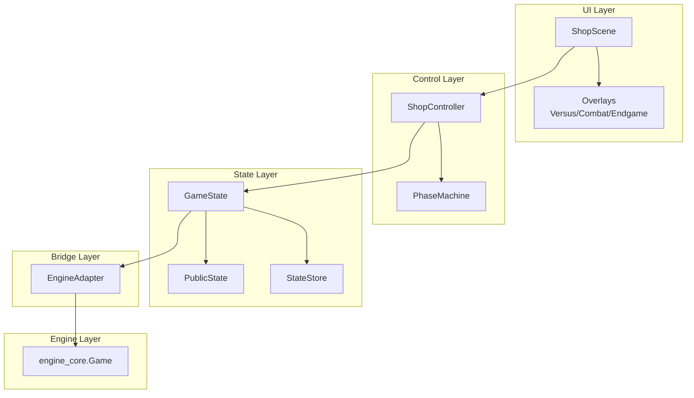
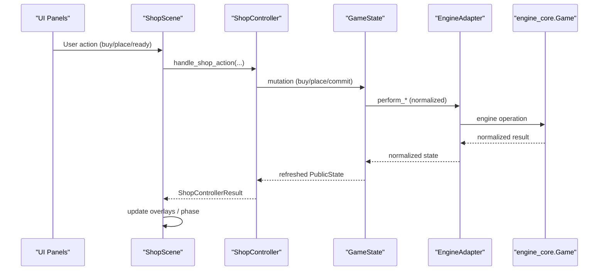
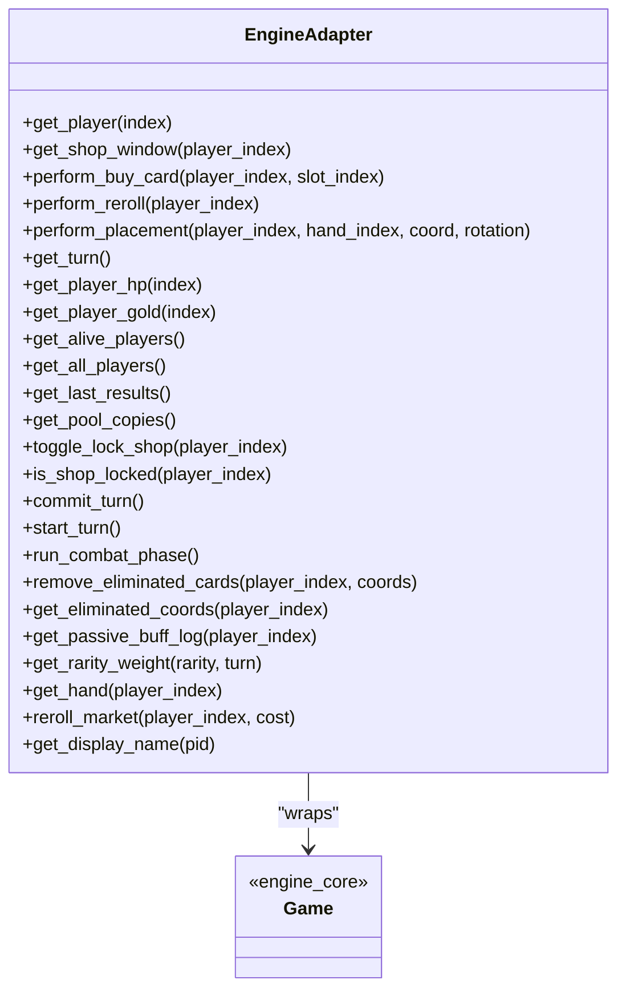
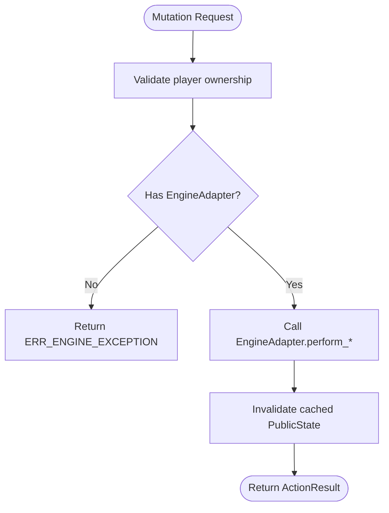
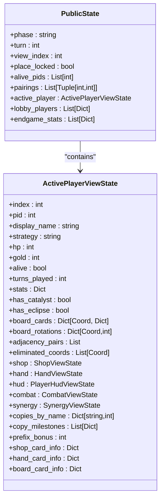
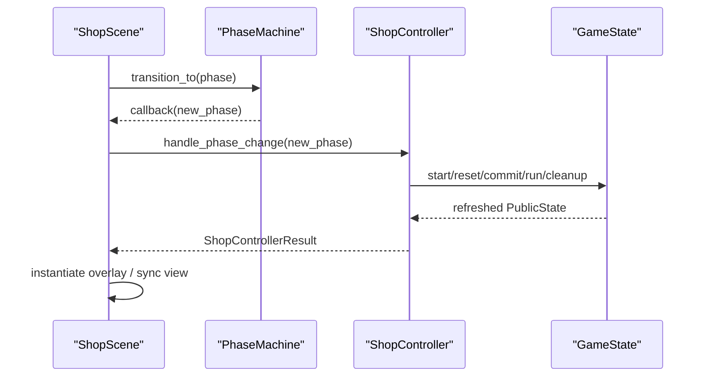
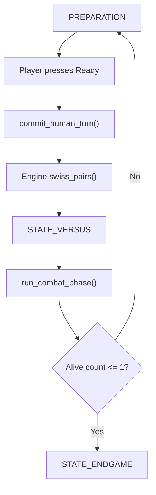
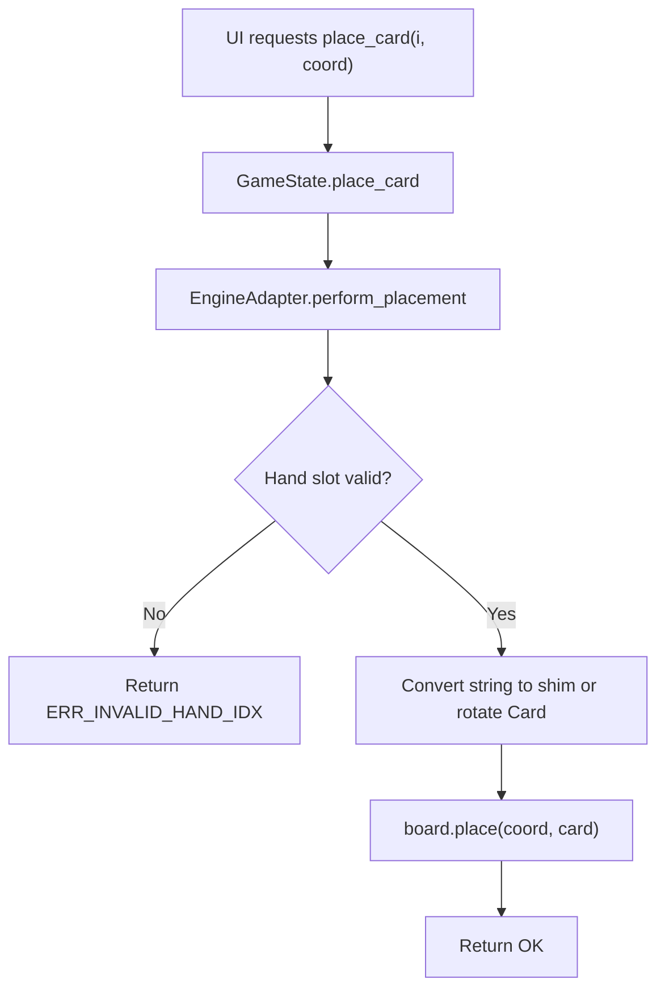
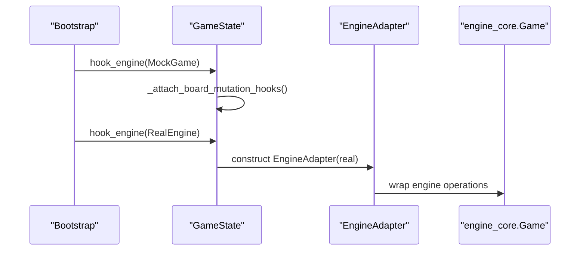
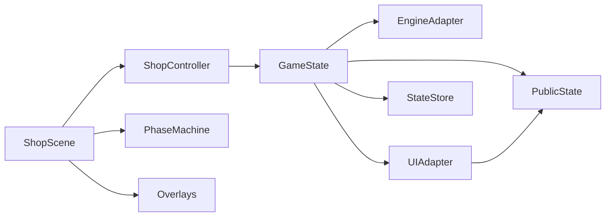

# Migration Strategy and Integration Path

<cite>
**Referenced Files in This Document**
- [engine_adapter.py](file://v2/core/engine_adapter.py)
- [game_state.py](file://v2/core/game_state.py)
- [public_state.py](file://v2/core/public_state.py)
- [ui_adapter.py](file://v2/core/ui_adapter.py)
- [phase_machine.py](file://v2/core/phase_machine.py)
- [shop_controller.py](file://v2/core/shop_controller.py)
- [shop.py](file://v2/scenes/shop.py)
- [combat_overlay.py](file://v2/ui/overlays/combat_overlay.py)
- [endgame_overlay.py](file://v2/ui/overlays/endgame_overlay.py)
- [engine_mock.py](file://v2/mock/engine_mock.py)
- [implementation_plan_v2.md](file://implementation_plan_v2.md)
- [HYBRID_ENGINE_CORE_VS_MOCK_REPORT.md](file://v2/HYBRID_ENGINE_CORE_VS_MOCK_REPORT.md)
</cite>

## Table of Contents
1. [Introduction](#introduction)
2. [Project Structure](#project-structure)
3. [Core Components](#core-components)
4. [Architecture Overview](#architecture-overview)
5. [Detailed Component Analysis](#detailed-component-analysis)
6. [Dependency Analysis](#dependency-analysis)
7. [Performance Considerations](#performance-considerations)
8. [Troubleshooting Guide](#troubleshooting-guide)
9. [Conclusion](#conclusion)
10. [Appendices](#appendices)

## Introduction
This document describes a pragmatic, step-by-step migration from a legacy monolithic architecture to a modern scene-based architecture. It explains how to integrate a real engine (engine_core) behind a GameState bridge layer, how to implement the EngineAdapter pattern, and how to connect UI components to the engine while maintaining bidirectional synchronization. It also outlines a phased rollout for turn phase management, combat visualization, and live data integration, and provides concrete migration examples, error-handling strategies for partial implementations, and architectural decisions enabling seamless engine switching.

## Project Structure
The modern architecture centers around:
- A GameState singleton that exposes mutation APIs and caches a PublicState snapshot for UI reads.
- An EngineAdapter that encapsulates all direct engine access and normalizes engine_core’s object-based API into UI-friendly structures.
- A scene-based UI with ShopScene orchestrating phases and overlays.
- Controllers and adapters that translate between UI actions and engine operations.

**Diagram sources**
- [shop.py:23-71](file://v2/scenes/shop.py#L23-L71)
- [shop_controller.py:28-66](file://v2/core/shop_controller.py#L28-L66)
- [phase_machine.py:3-27](file://v2/core/phase_machine.py#L3-L27)
- [game_state.py:14-65](file://v2/core/game_state.py#L14-L65)
- [public_state.py:10-128](file://v2/core/public_state.py#L10-L128)
- [engine_adapter.py:38-301](file://v2/core/engine_adapter.py#L38-L301)

**Section sources**
- [shop.py:23-71](file://v2/scenes/shop.py#L23-L71)
- [shop_controller.py:28-66](file://v2/core/shop_controller.py#L28-L66)
- [phase_machine.py:3-27](file://v2/core/phase_machine.py#L3-L27)
- [game_state.py:14-65](file://v2/core/game_state.py#L14-L65)
- [public_state.py:10-128](file://v2/core/public_state.py#L10-L128)
- [engine_adapter.py:38-301](file://v2/core/engine_adapter.py#L38-L301)

## Core Components
- GameState: Central hub for engine mutation APIs and caching of PublicState. It hooks an EngineAdapter and invalidates caches after mutations.
- EngineAdapter: Normalizes engine_core’s object-based API into UI-friendly structures (names, rotations, probabilities, logs).
- PublicState: Immutable, UI-facing snapshot of the game world for rendering and interaction.
- UIAdapter: Builds PublicState from engine data, computes synergies, formats logs, and aggregates card metadata.
- ShopController: Orchestrates UI actions, engine commits, and phase transitions.
- PhaseMachine: Enforces deterministic phase ordering and triggers controller actions.
- ShopScene: Root scene hosting panels, overlays, and event routing.

**Section sources**
- [game_state.py:14-173](file://v2/core/game_state.py#L14-L173)
- [engine_adapter.py:38-301](file://v2/core/engine_adapter.py#L38-L301)
- [public_state.py:10-128](file://v2/core/public_state.py#L10-L128)
- [ui_adapter.py:24-476](file://v2/core/ui_adapter.py#L24-L476)
- [shop_controller.py:28-139](file://v2/core/shop_controller.py#L28-L139)
- [phase_machine.py:3-40](file://v2/core/phase_machine.py#L3-L40)
- [shop.py:23-71](file://v2/scenes/shop.py#L23-L71)

## Architecture Overview
The migration path proceeds in stages:
- Stage 1: Hook a mock engine to GameState to validate UI reads and writes.
- Stage 2: Replace the mock with EngineAdapter and normalize engine outputs to PublicState.
- Stage 3: Wire ShopScene to orchestrate phases and overlays via ShopController and PhaseMachine.
- Stage 4: Implement turn-phase lifecycle, combat visualization, and end-game reporting.

**Diagram sources**
- [shop.py:153-248](file://v2/scenes/shop.py#L153-L248)
- [shop_controller.py:67-98](file://v2/core/shop_controller.py#L67-L98)
- [game_state.py:91-161](file://v2/core/game_state.py#L91-L161)
- [engine_adapter.py:81-175](file://v2/core/engine_adapter.py#L81-L175)

## Detailed Component Analysis

### EngineAdapter Pattern and Engine Swap Mechanism
EngineAdapter encapsulates all direct engine access and provides normalized getters and operations for UI consumption. It:
- Coerces types safely and returns defaults on missing attributes.
- Normalizes engine objects into simple structures (names, rotations, probabilities).
- Exposes operations like buy, reroll, placement, turn commit, combat run, and cleanup.
- Bridges gaps between engine_core’s object-based model and UI expectations.

**Diagram sources**
- [engine_adapter.py:38-301](file://v2/core/engine_adapter.py#L38-L301)

**Section sources**
- [engine_adapter.py:38-301](file://v2/core/engine_adapter.py#L38-L301)

### GameState Bridge Layer and Caching
GameState:
- Hooks an EngineAdapter and attaches board mutation hooks to invalidate cached PublicState.
- Exposes mutation APIs (buy, reroll, place, commit, start, combat, cleanup).
- Mirrors phase state into StateStore and clears per-turn logs.

**Diagram sources**
- [game_state.py:91-161](file://v2/core/game_state.py#L91-L161)

**Section sources**
- [game_state.py:14-173](file://v2/core/game_state.py#L14-L173)

### PublicState Model and UI Rendering
PublicState is an immutable snapshot consumed by UI components. UIAdapter builds it by:
- Extracting shop, hand, HUD, board, synergy, combat, and lobby data.
- Computing synergies via SynergyCalculator and formatting logs and passive feeds.
- Providing card metadata for tooltips and overlays.

**Diagram sources**
- [public_state.py:10-128](file://v2/core/public_state.py#L10-L128)

**Section sources**
- [public_state.py:10-128](file://v2/core/public_state.py#L10-L128)
- [ui_adapter.py:97-297](file://v2/core/ui_adapter.py#L97-L297)

### ShopScene Orchestration and Phase Management
ShopScene:
- Owns ShopController and PhaseMachine.
- Applies phase contexts (PREPARATION/VERSUS/COMBAT/ENDGAME) and instantiates overlays.
- Routes events to overlays and updates state caches.

**Diagram sources**
- [shop.py:150-151](file://v2/scenes/shop.py#L150-L151)
- [phase_machine.py:19-27](file://v2/core/phase_machine.py#L19-L27)
- [shop_controller.py:38-66](file://v2/core/shop_controller.py#L38-L66)

**Section sources**
- [shop.py:113-151](file://v2/scenes/shop.py#L113-L151)
- [phase_machine.py:3-40](file://v2/core/phase_machine.py#L3-L40)
- [shop_controller.py:28-66](file://v2/core/shop_controller.py#L28-L66)

### Turn Phase Lifecycle and Engine Commit
ShopController coordinates turn lifecycle:
- PREPARATION: start_turn, reset_turn, cleanup dead cards.
- COMMIT: commit_human_turn (engine finish_turn or preparation_phase) and pairings.
- COMBAT: run_combat_phase and capture logs.
- ENDGAME: compute endgame stats and sort players.

**Diagram sources**
- [shop_controller.py:38-66](file://v2/core/shop_controller.py#L38-L66)
- [engine_adapter.py:219-228](file://v2/core/engine_adapter.py#L219-L228)

**Section sources**
- [shop_controller.py:38-66](file://v2/core/shop_controller.py#L38-L66)
- [engine_adapter.py:219-241](file://v2/core/engine_adapter.py#L219-L241)

### Bidirectional Board Synchronization: String-Based GameState vs Object-Based Engine
Challenge:
- GameState._board stores string names only.
- Engine uses Card objects with rotations and stats.
- UI expects fixed 6-slot hand arrays for drag-and-drop.

Resolution:
- EngineAdapter performs placement by converting strings to lightweight shims and preserving slot positions.
- GameState.get_hand() returns a fixed 6-slot list of names for UI compatibility.
- Place operations avoid injecting None into engine lists; instead, they pop or mark slots as empty.

**Diagram sources**
- [engine_adapter.py:129-175](file://v2/core/engine_adapter.py#L129-L175)
- [implementation_plan_v2.md:1205-1209](file://implementation_plan_v2.md#L1205-L1209)

**Section sources**
- [engine_adapter.py:129-175](file://v2/core/engine_adapter.py#L129-L175)
- [implementation_plan_v2.md:1205-1209](file://implementation_plan_v2.md#L1205-L1209)

### Connecting UI to Real Engine: Mock to Production Path
- Step 1: Bootstrap with MockGame to validate UI reads/writes.
- Step 2: Replace mock with EngineAdapter and normalize engine outputs.
- Step 3: Wire ShopScene to use ShopController and PhaseMachine.
- Step 4: Implement overlays and finalize turn-phase and combat flows.

**Diagram sources**
- [engine_mock.py:61-84](file://v2/mock/engine_mock.py#L61-L84)
- [game_state.py:37-53](file://v2/core/game_state.py#L37-L53)
- [engine_adapter.py:44-46](file://v2/core/engine_adapter.py#L44-L46)

**Section sources**
- [engine_mock.py:61-84](file://v2/mock/engine_mock.py#L61-L84)
- [game_state.py:37-53](file://v2/core/game_state.py#L37-L53)
- [engine_adapter.py:44-46](file://v2/core/engine_adapter.py#L44-L46)

### Remaining Work Items and Integration Targets
- Complete CombatScene: Already represented by CombatOverlay; ensure engine logs and combat results are fully integrated.
- Complete EndGameScene: Already represented by EndgameOverlay; wire endgame stats and restart flow.
- Event-driven UI updates: Use GameState cache invalidation and overlay state machines to drive UI updates without polling.

**Section sources**
- [combat_overlay.py:5-86](file://v2/ui/overlays/combat_overlay.py#L5-L86)
- [endgame_overlay.py:5-113](file://v2/ui/overlays/endgame_overlay.py#L5-L113)
- [shop.py:135-151](file://v2/scenes/shop.py#L135-L151)

## Dependency Analysis
Key dependencies:
- GameState depends on EngineAdapter, UIAdapter, PublicState, and StateStore.
- UIAdapter depends on engine_core data and SynergyCalculator.
- ShopController depends on GameState and PublicState.
- ShopScene depends on ShopController, PhaseMachine, and overlays.

**Diagram sources**
- [game_state.py:14-65](file://v2/core/game_state.py#L14-L65)
- [ui_adapter.py:24-476](file://v2/core/ui_adapter.py#L24-L476)
- [shop_controller.py:28-66](file://v2/core/shop_controller.py#L28-L66)
- [shop.py:23-71](file://v2/scenes/shop.py#L23-L71)

**Section sources**
- [game_state.py:14-65](file://v2/core/game_state.py#L14-L65)
- [ui_adapter.py:24-476](file://v2/core/ui_adapter.py#L24-L476)
- [shop_controller.py:28-66](file://v2/core/shop_controller.py#L28-L66)
- [shop.py:23-71](file://v2/scenes/shop.py#L23-L71)

## Performance Considerations
- Cache PublicState aggressively; invalidate only after mutations.
- Normalize engine data once per frame via UIAdapter to avoid repeated computations.
- Keep overlay updates minimal; defer heavy operations to background threads if needed.
- Prefer immutable snapshots (PublicState) to simplify change detection and rendering.

## Troubleshooting Guide
Common issues and mitigations:
- Missing engine attributes: EngineAdapter coerces values and logs warnings; UI gracefully falls back to empty state.
- Hand slot mismatches: Ensure placement preserves fixed 6-slot layout; avoid inserting None into engine lists.
- Phase synchronization errors: Use PhaseMachine transitions and ShopController to enforce correct order.
- Combat logs not appearing: Verify EngineAdapter.get_last_results and UIAdapter.formatting pipeline.

**Section sources**
- [engine_adapter.py:48-54](file://v2/core/engine_adapter.py#L48-L54)
- [engine_adapter.py:129-175](file://v2/core/engine_adapter.py#L129-L175)
- [shop_controller.py:38-66](file://v2/core/shop_controller.py#L38-L66)
- [ui_adapter.py:258-262](file://v2/core/ui_adapter.py#L258-L262)

## Conclusion
By isolating engine access behind EngineAdapter, normalizing outputs into PublicState, and orchestrating phases via ShopController and PhaseMachine, the migration cleanly swaps the mock engine for engine_core. The approach preserves UI stability, enables incremental feature delivery, and establishes a robust foundation for turn-phase management, combat visualization, and end-game reporting.

## Appendices

### Migration Examples
- Hooking engine: [game_state.py:37-39](file://v2/core/game_state.py#L37-L39)
- Normalized hand read: [engine_adapter.py:271-279](file://v2/core/engine_adapter.py#L271-L279)
- Placement with rotation: [engine_adapter.py:129-175](file://v2/core/engine_adapter.py#L129-L175)
- Turn commit and pairing: [engine_adapter.py:219-228](file://v2/core/engine_adapter.py#L219-L228)
- Overlay wiring: [shop.py:135-151](file://v2/scenes/shop.py#L135-L151)

### Architectural Decisions
- Single source of truth: GameState caches PublicState; UI reads only from PublicState.
- Adapter boundary: All engine attribute access funnels through EngineAdapter.
- Immutable UI snapshots: PublicState simplifies rendering and diffing.
- Deterministic phases: PhaseMachine and ShopController enforce strict transitions.

**Section sources**
- [implementation_plan_v2.md:358-380](file://implementation_plan_v2.md#L358-L380)
- [HYBRID_ENGINE_CORE_VS_MOCK_REPORT.md:505-534](file://v2/HYBRID_ENGINE_CORE_VS_MOCK_REPORT.md#L505-L534)