# Asset Loading Pipeline

<cite>
**Referenced Files in This Document**
- [loader.py](file://v2/assets/loader.py)
- [font_cache.py](file://v2/ui/font_cache.py)
- [constants.py](file://v2/constants.py)
- [exceptions.py](file://v2/core/exceptions.py)
- [test_asset_loader.py](file://tests/test_asset_loader.py)
- [asset_loader.py](file://_archive/old_dirs/scenes/asset_loader.py)
- [lobby.py](file://v2/scenes/lobby.py)
- [shop_panel.py](file://v2/ui/shop_panel.py)
</cite>

## Table of Contents
1. [Introduction](#introduction)
2. [Project Structure](#project-structure)
3. [Core Components](#core-components)
4. [Architecture Overview](#architecture-overview)
5. [Detailed Component Analysis](#detailed-component-analysis)
6. [Dependency Analysis](#dependency-analysis)
7. [Performance Considerations](#performance-considerations)
8. [Troubleshooting Guide](#troubleshooting-guide)
9. [Conclusion](#conclusion)

## Introduction
This document explains the Asset Loading Pipeline used by the game’s UI and scenes. It focuses on the AssetLoader class, its singleton pattern, caching strategies, initialization, and how it integrates with Pygame subsystems. It also covers asset type handling (sprites, fonts, SFX, music), override mechanisms for special card names, configuration via AudioConfig, preloading strategies, error handling, and performance optimization. Examples are grounded in the actual codebase to help both beginners and experienced developers understand and extend the pipeline safely.

## Project Structure
The asset pipeline centers around a single AssetLoader that loads and caches assets under a base directory. Fonts are also centrally managed by a separate font cache module. Configuration for audio volumes and asset paths comes from constants.

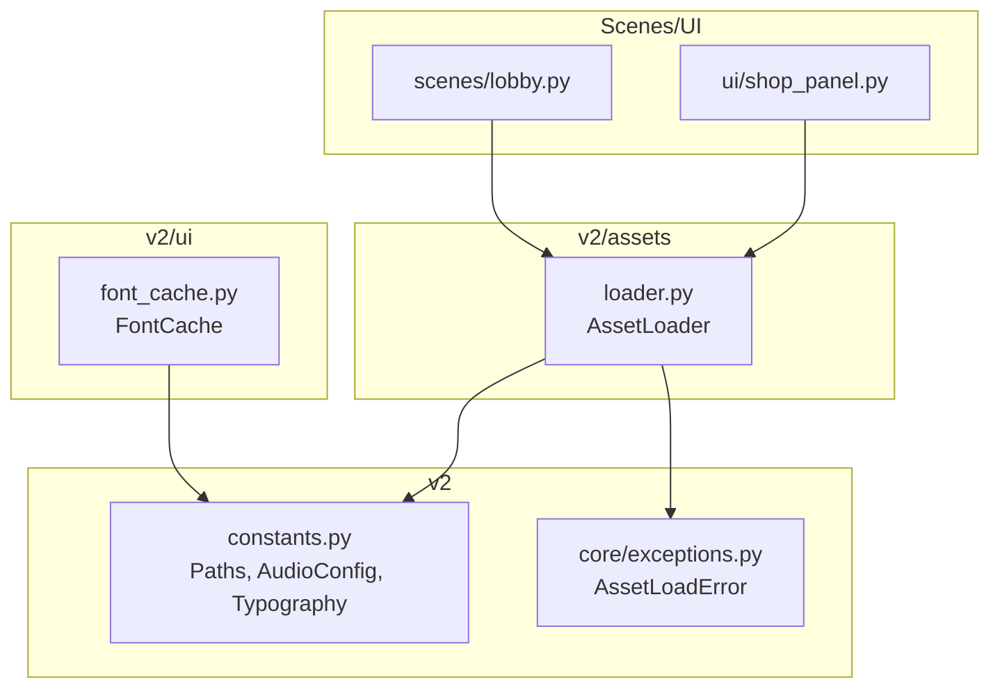

**Diagram sources**
- [loader.py:14-122](file://v2/assets/loader.py#L14-L122)
- [font_cache.py:1-139](file://v2/ui/font_cache.py#L1-L139)
- [constants.py:76-168](file://v2/constants.py#L76-L168)
- [exceptions.py:30-35](file://v2/core/exceptions.py#L30-L35)
- [lobby.py:1-16](file://v2/scenes/lobby.py#L1-L16)
- [shop_panel.py:126-158](file://v2/ui/shop_panel.py#L126-L158)

**Section sources**
- [loader.py:14-122](file://v2/assets/loader.py#L14-L122)
- [font_cache.py:1-139](file://v2/ui/font_cache.py#L1-L139)
- [constants.py:76-168](file://v2/constants.py#L76-L168)

## Core Components
- AssetLoader: Central singleton responsible for loading and caching sprites, fonts, SFX, and music. It enforces explicit initialization and raises errors for missing assets.
- FontCache: A dedicated font manager that centralizes font loading and caching, falling back to system fonts when TTFs are unavailable.
- Constants: Provides Paths for asset directories, Typography for font filenames, and AudioConfig for volume scaling.
- Exceptions: Defines AssetLoadError for asset-loading failures.

Key behaviors:
- Singleton pattern with explicit initialization and access guard.
- Caching by asset identity (sprite name, font key tuple).
- Preloading helpers for scene-specific assets.
- Override mapping for special card names.

**Section sources**
- [loader.py:14-122](file://v2/assets/loader.py#L14-L122)
- [font_cache.py:17-49](file://v2/ui/font_cache.py#L17-L49)
- [constants.py:76-168](file://v2/constants.py#L76-L168)
- [exceptions.py:30-35](file://v2/core/exceptions.py#L30-L35)

## Architecture Overview
The AssetLoader coordinates with Pygame’s subsystems:
- Images: Uses pygame.image.load with convert_alpha for per-pixel alpha surfaces.
- Fonts: Uses pygame.font.Font for TTFs; falls back to pygame.font.SysFont for system fonts.
- Audio: Uses pygame.mixer.Sound for SFX and sets mixer music volume via AudioConfig.

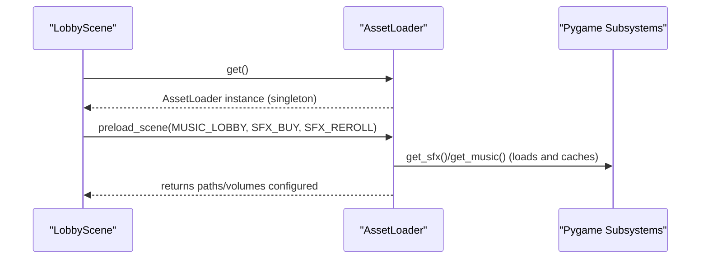

**Diagram sources**
- [lobby.py:5-16](file://v2/scenes/lobby.py#L5-L16)
- [loader.py:78-114](file://v2/assets/loader.py#L78-L114)
- [constants.py:151-162](file://v2/constants.py#L151-L162)

## Detailed Component Analysis

### AssetLoader: Singleton Pattern and Initialization
- Explicit initialization: initialize(base_dir) creates the singleton instance and stores the base path.
- Access guard: get() raises AssetLoadError if called before initialization.
- Base directory: All asset paths are resolved relative to base_dir plus subfolders (sprites, fonts, sfx, music).

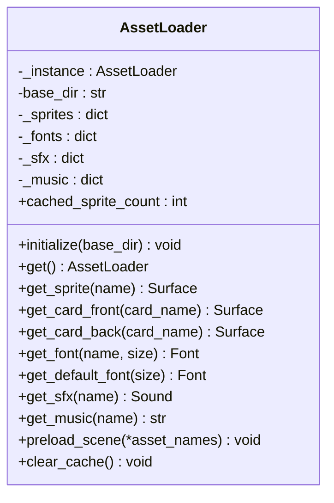

**Diagram sources**
- [loader.py:14-122](file://v2/assets/loader.py#L14-L122)

**Section sources**
- [loader.py:24-36](file://v2/assets/loader.py#L24-L36)
- [exceptions.py:30-35](file://v2/core/exceptions.py#L30-L35)

### Resource Caching Strategies
- Sprites: Cached by asset name; first load performs image decode and convert_alpha; subsequent requests return the cached Surface.
- Fonts: Cached by (name, size) tuple; supports TTFs and falls back to system fonts.
- SFX/Music: Cached by asset name; SFX volumes are set using AudioConfig; music volume is set when mixer is initialized.

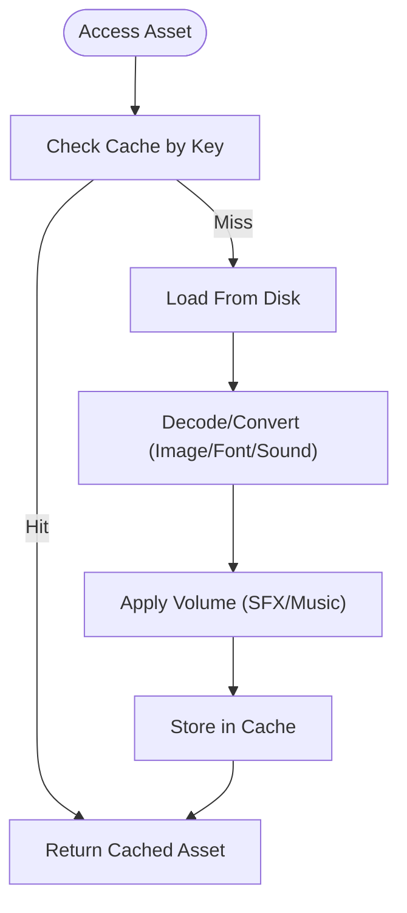

**Diagram sources**
- [loader.py:37-50](file://v2/assets/loader.py#L37-L50)
- [loader.py:60-77](file://v2/assets/loader.py#L60-L77)
- [loader.py:78-103](file://v2/assets/loader.py#L78-L103)
- [font_cache.py:17-49](file://v2/ui/font_cache.py#L17-L49)

**Section sources**
- [loader.py:19-22](file://v2/assets/loader.py#L19-L22)
- [loader.py:60-77](file://v2/assets/loader.py#L60-L77)
- [loader.py:78-103](file://v2/assets/loader.py#L78-L103)
- [font_cache.py:17-49](file://v2/ui/font_cache.py#L17-L49)

### Asset Type Handling
- Sprites: get_sprite(name) resolves path under sprites/; supports convert_alpha with fallback to non-alpha decoding.
- Fonts: get_font(name, size) resolves path under fonts/; if missing, falls back to SysFont using the base filename.
- SFX: get_sfx(name) resolves path under sfx/; sets volume using AudioConfig.MASTER * AudioConfig.SFX.
- Music: get_music(name) resolves path under music/; sets music volume when mixer is initialized.

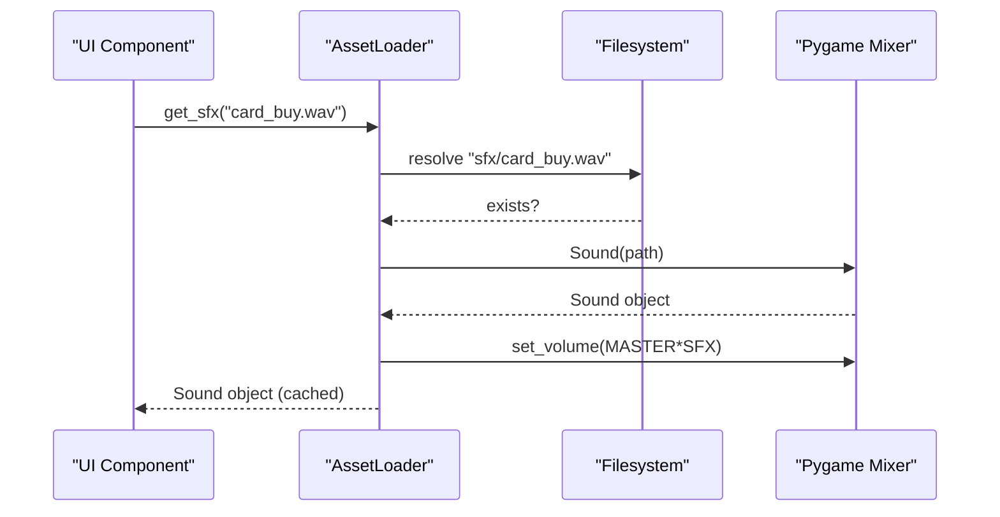

**Diagram sources**
- [loader.py:78-89](file://v2/assets/loader.py#L78-L89)
- [constants.py:164-167](file://v2/constants.py#L164-L167)

**Section sources**
- [loader.py:37-50](file://v2/assets/loader.py#L37-L50)
- [loader.py:60-77](file://v2/assets/loader.py#L60-L77)
- [loader.py:78-103](file://v2/assets/loader.py#L78-L103)
- [constants.py:164-167](file://v2/constants.py#L164-L167)

### Override Mechanisms for Special Card Names
- A mapping allows special card names to resolve to different filenames. For example, a specific card name maps to a normalized filename before loading.
- This ensures compatibility with assets that use underscored or normalized filenames while keeping client code readable.

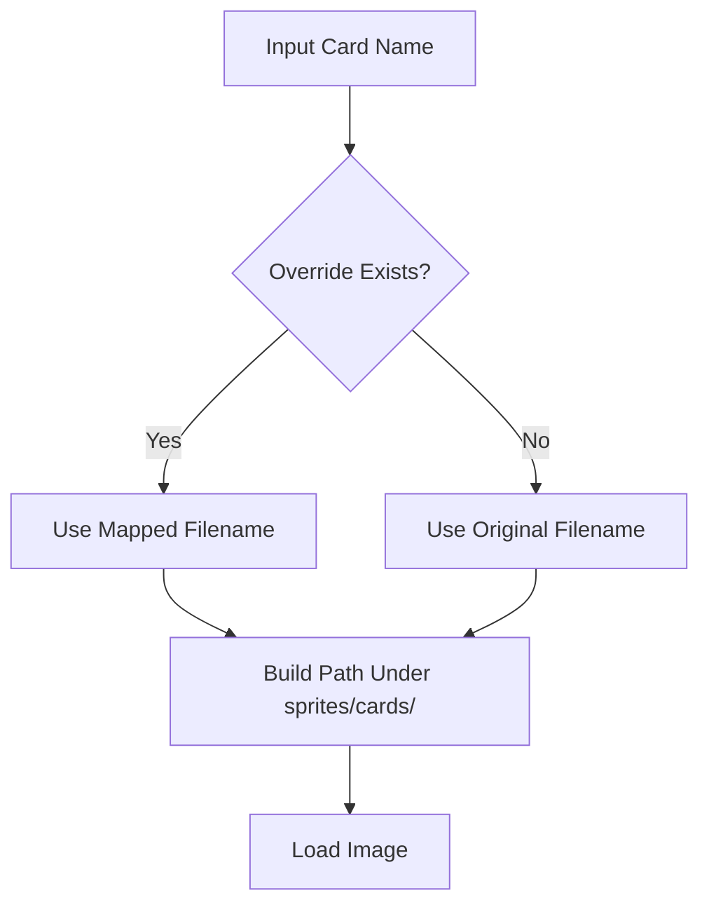

**Diagram sources**
- [loader.py:52-58](file://v2/assets/loader.py#L52-L58)
- [loader.py:8-11](file://v2/assets/loader.py#L8-L11)

**Section sources**
- [loader.py:8-11](file://v2/assets/loader.py#L8-L11)
- [loader.py:52-58](file://v2/assets/loader.py#L52-L58)

### Preloading Strategies
- preload_scene accepts asset names and attempts to load them as SFX or music. It catches AssetLoadError, FileNotFoundError, and pygame.error to avoid halting transitions.
- Scenes call preload_scene during transitions to warm caches before on_enter().

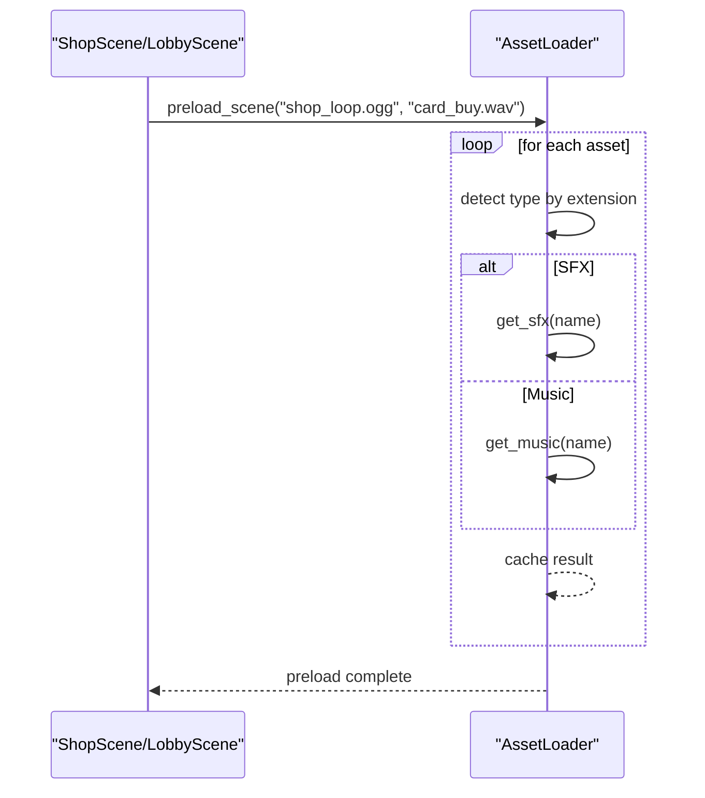

**Diagram sources**
- [loader.py:105-114](file://v2/assets/loader.py#L105-L114)
- [lobby.py:10-14](file://v2/scenes/lobby.py#L10-L14)

**Section sources**
- [loader.py:105-114](file://v2/assets/loader.py#L105-L114)
- [lobby.py:10-14](file://v2/scenes/lobby.py#L10-L14)

### Configuration Options Through AudioConfig
- MASTER controls overall volume.
- SFX and MUSIC scale individual categories.
- Paths defines asset keys for common sounds and tracks.

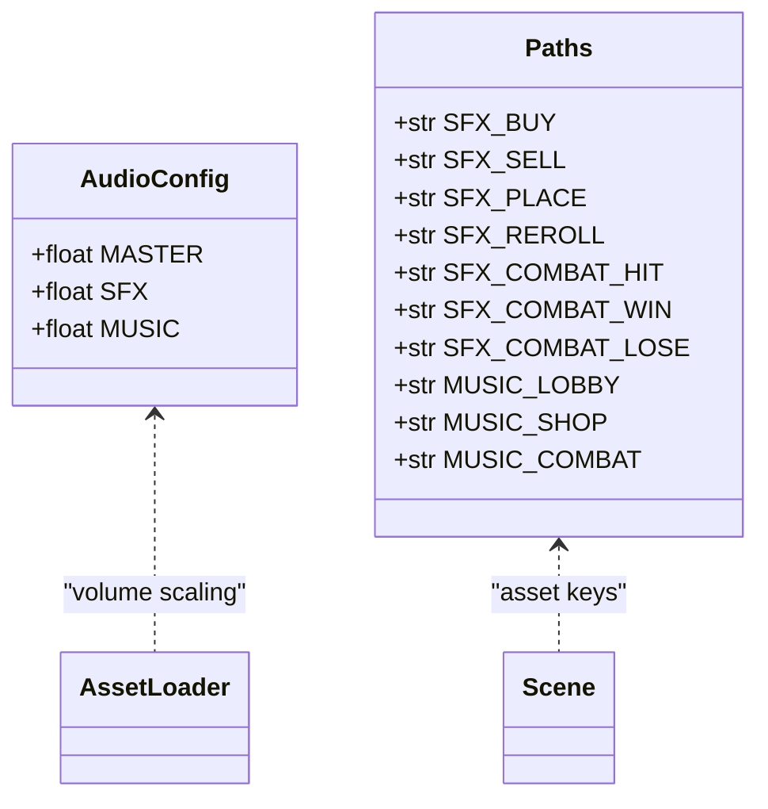

**Diagram sources**
- [constants.py:164-167](file://v2/constants.py#L164-L167)
- [constants.py:151-162](file://v2/constants.py#L151-L162)

**Section sources**
- [constants.py:164-167](file://v2/constants.py#L164-L167)
- [constants.py:151-162](file://v2/constants.py#L151-L162)

### Integration With Pygame Subsystems
- Images: Decoded via pygame.image.load; convert_alpha used for per-pixel alpha.
- Fonts: TTFs via pygame.font.Font; fallback to SysFont when TTF not found.
- Audio: SFX via pygame.mixer.Sound; music path stored and volume set when mixer is initialized.

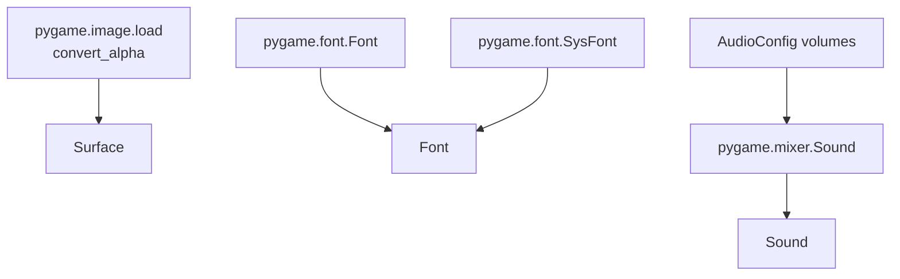

**Diagram sources**
- [loader.py:45-49](file://v2/assets/loader.py#L45-L49)
- [loader.py:65-71](file://v2/assets/loader.py#L65-L71)
- [loader.py:86-88](file://v2/assets/loader.py#L86-L88)
- [loader.py:99-100](file://v2/assets/loader.py#L99-L100)

**Section sources**
- [loader.py:45-49](file://v2/assets/loader.py#L45-L49)
- [loader.py:65-71](file://v2/assets/loader.py#L65-L71)
- [loader.py:86-88](file://v2/assets/loader.py#L86-L88)
- [loader.py:99-100](file://v2/assets/loader.py#L99-L100)

### Asset Lifecycle Management
- Initialization: Called once at startup with the base assets directory.
- Access: get() returns the singleton; if not initialized, AssetLoadError is raised.
- Caching: Automatic per-type cache; clear_cache() frees memory.
- Shutdown: Scenes can clear caches on exit to reduce memory footprint.

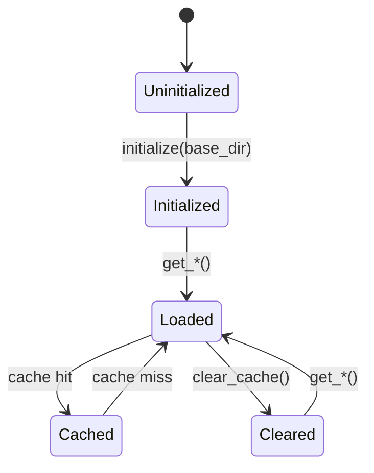

**Diagram sources**
- [loader.py:24-36](file://v2/assets/loader.py#L24-L36)
- [loader.py:115-118](file://v2/assets/loader.py#L115-L118)

**Section sources**
- [loader.py:24-36](file://v2/assets/loader.py#L24-L36)
- [loader.py:115-118](file://v2/assets/loader.py#L115-L118)

### Example Usage in Scenes and UI
- Scenes: LobbyScene preloads music and SFX before entering the lobby.
- UI: ShopPanel uses AssetLoader to fetch card fronts/back and scales them to UI sizes, with fallback rendering when assets are missing.

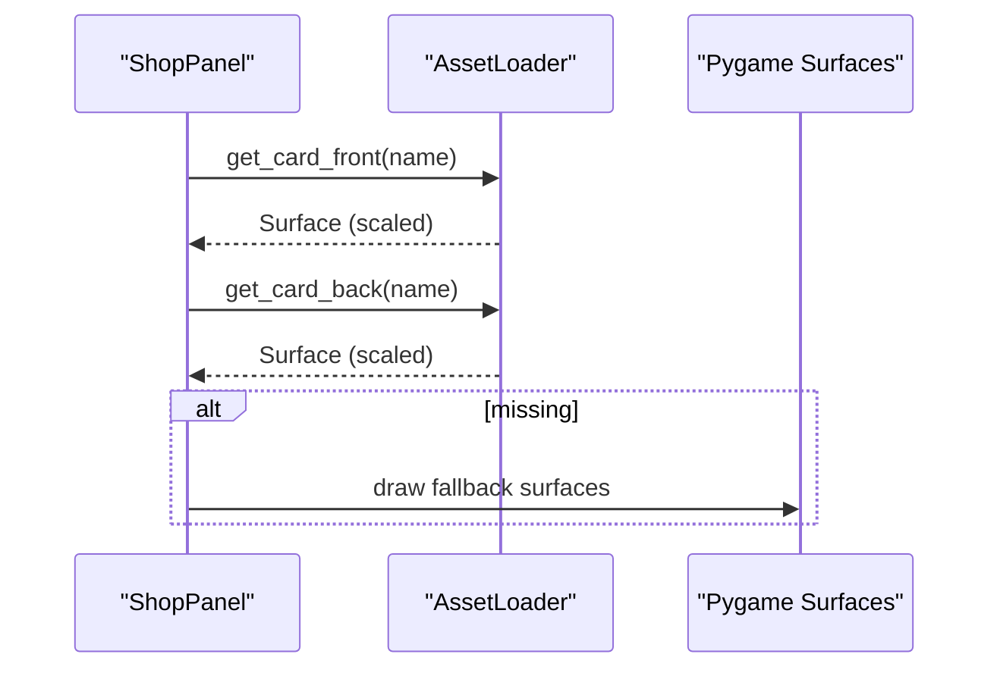

**Diagram sources**
- [shop_panel.py:149-158](file://v2/ui/shop_panel.py#L149-L158)
- [loader.py:52-58](file://v2/assets/loader.py#L52-L58)

**Section sources**
- [lobby.py:10-14](file://v2/scenes/lobby.py#L10-L14)
- [shop_panel.py:149-158](file://v2/ui/shop_panel.py#L149-L158)
- [loader.py:52-58](file://v2/assets/loader.py#L52-L58)

## Dependency Analysis
- AssetLoader depends on:
  - Pygame for image, font, and mixer operations.
  - AudioConfig for volume scaling.
  - Exceptions for explicit error signaling.
- FontCache is independent but complements AssetLoader by centralizing font resolution.
- Scenes and UI modules depend on AssetLoader for runtime asset access.

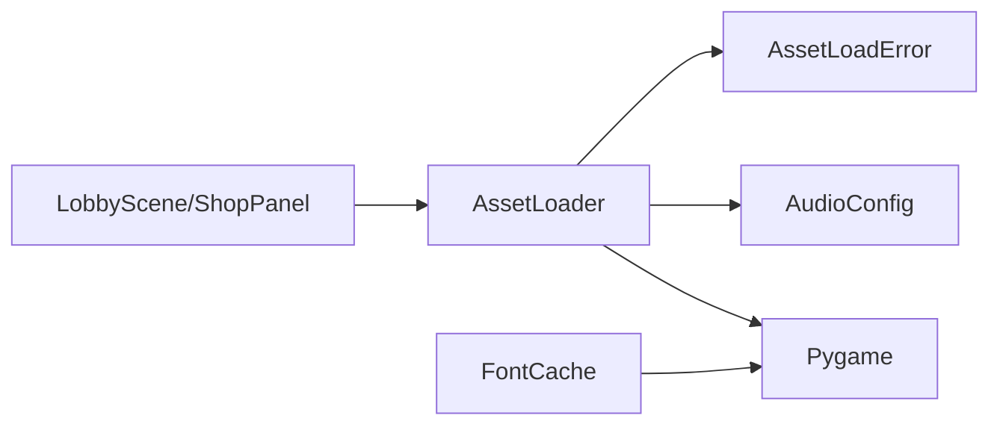

**Diagram sources**
- [loader.py:5-6](file://v2/assets/loader.py#L5-L6)
- [constants.py:164-167](file://v2/constants.py#L164-L167)
- [exceptions.py:30-35](file://v2/core/exceptions.py#L30-L35)
- [font_cache.py:9-11](file://v2/ui/font_cache.py#L9-L11)
- [lobby.py:1-3](file://v2/scenes/lobby.py#L1-L3)
- [shop_panel.py:136-138](file://v2/ui/shop_panel.py#L136-L138)

**Section sources**
- [loader.py:5-6](file://v2/assets/loader.py#L5-L6)
- [constants.py:164-167](file://v2/constants.py#L164-L167)
- [exceptions.py:30-35](file://v2/core/exceptions.py#L30-L35)
- [font_cache.py:9-11](file://v2/ui/font_cache.py#L9-L11)
- [lobby.py:1-3](file://v2/scenes/lobby.py#L1-L3)
- [shop_panel.py:136-138](file://v2/ui/shop_panel.py#L136-L138)

## Performance Considerations
- Prefer convert_alpha for sprites requiring transparency to minimize per-blit conversions.
- Use preload_scene to warm caches before transitions to avoid stalls.
- Clear caches on scene exits to free memory when appropriate.
- Keep font cache small by reusing (name, size) tuples; avoid excessive font variations.
- Avoid loading very large assets at runtime; pre-scale where possible.

[No sources needed since this section provides general guidance]

## Troubleshooting Guide
Common issues and resolutions:
- Missing assets: AssetLoader raises FileNotFoundError with the full path. Verify asset presence and correct naming.
- Silent failures: AssetLoader does not silently fall back; always raises on missing assets. Use fallback rendering in UI components when catching exceptions.
- Special card names: Ensure overrides map to existing filenames; otherwise, asset loading will fail.
- Audio not playing: Confirm Pygame mixer is initialized; music volume is set only when mixer is active.
- Font fallback: If TTFs are missing, FontCache falls back to SysFont; verify font filenames in Typography.

Concrete references:
- Missing sprite raises FileNotFoundError.
- Missing SFX raises FileNotFoundError.
- Missing music raises FileNotFoundError.
- Preload catches AssetLoadError/FileNotFoundError/pygame.error to avoid blocking transitions.
- Font fallback to SysFont when TTF not found.

**Section sources**
- [loader.py:42-43](file://v2/assets/loader.py#L42-L43)
- [loader.py:83-84](file://v2/assets/loader.py#L83-L84)
- [loader.py:96-97](file://v2/assets/loader.py#L96-L97)
- [loader.py:112-113](file://v2/assets/loader.py#L112-L113)
- [font_cache.py:26-32](file://v2/ui/font_cache.py#L26-L32)

## Conclusion
The Asset Loading Pipeline provides a robust, centralized mechanism for loading and caching assets with explicit initialization, strong error signaling, and clear separation of concerns. By leveraging the singleton pattern, caching strategies, and Pygame subsystems, it enables smooth UI performance and predictable asset availability. Scenes and UI components integrate seamlessly through preloading and fallback rendering, ensuring resilience against missing assets while maintaining high-quality visuals and audio.