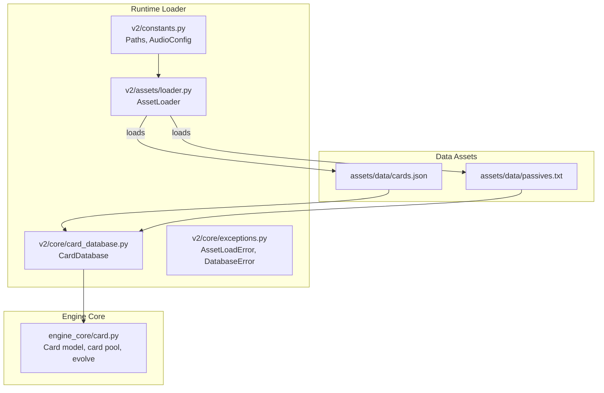
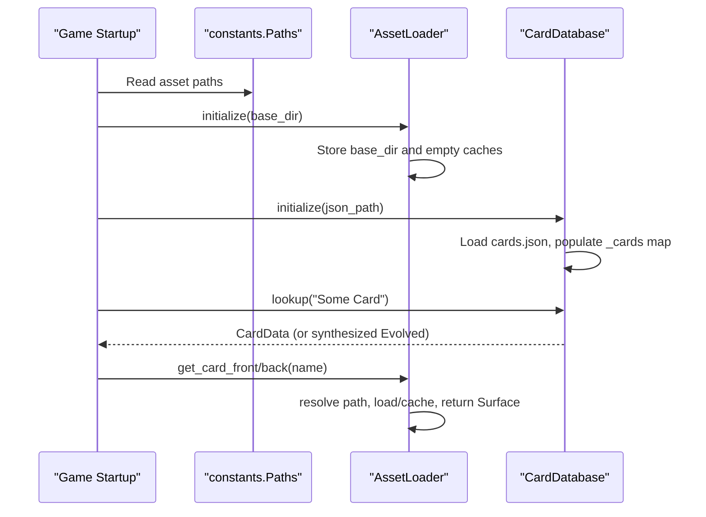
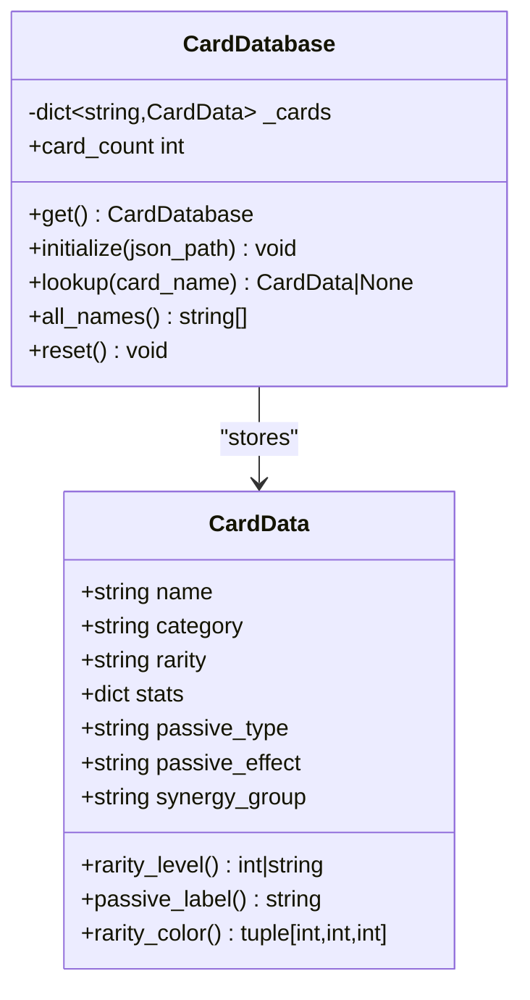
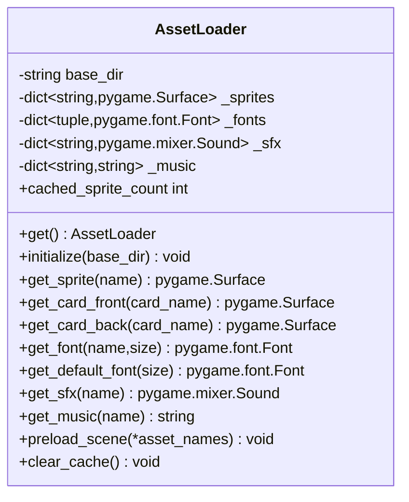
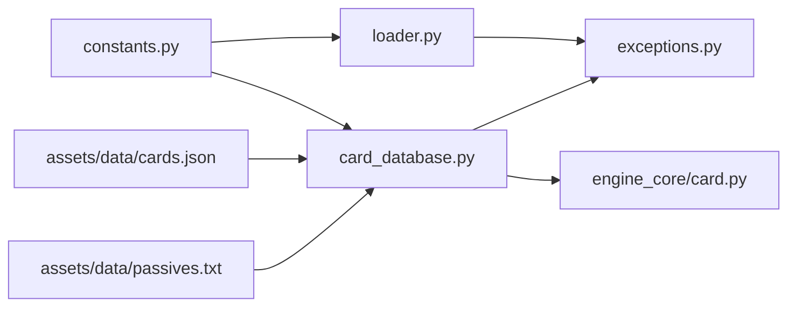

# Asset Management

<cite>
**Referenced Files in This Document**
- [cards.json](file://assets/data/cards.json)
- [passives.txt](file://assets/data/passives.txt)
- [loader.py](file://v2/assets/loader.py)
- [card_database.py](file://v2/core/card_database.py)
- [exceptions.py](file://v2/core/exceptions.py)
- [constants.py](file://v2/constants.py)
- [card.py](file://engine_core/card.py)
- [test_asset_loader.py](file://tests/test_asset_loader.py)
- [test_card_database.py](file://tests/test_card_database.py)
</cite>

## Table of Contents
1. [Introduction](#introduction)
2. [Project Structure](#project-structure)
3. [Core Components](#core-components)
4. [Architecture Overview](#architecture-overview)
5. [Detailed Component Analysis](#detailed-component-analysis)
6. [Dependency Analysis](#dependency-analysis)
7. [Performance Considerations](#performance-considerations)
8. [Troubleshooting Guide](#troubleshooting-guide)
9. [Conclusion](#conclusion)

## Introduction
This document explains the Asset Management system for the game, focusing on:
- Card database: JSON-backed card metadata and passives
- Asset loader: Resource cache and dynamic loading for sprites, fonts, SFX, and music
- Resource cache: In-memory caching and preloading strategies
- Integration with UI rendering, evolution handling, and asset lifecycle

It provides both conceptual overviews for beginners and technical details for developers implementing or extending the asset pipeline.

## Project Structure
The asset management system spans two primary areas:
- Data assets: JSON and text files containing card definitions and passive descriptions
- Runtime assets: Pygame-based loader with in-memory caches for sprites, fonts, SFX, and music

**Diagram sources**
- [cards.json:1-1517](file://assets/data/cards.json#L1-L1517)
- [passives.txt:1-71](file://assets/data/passives.txt#L1-L71)
- [loader.py:1-122](file://v2/assets/loader.py#L1-L122)
- [card_database.py:1-145](file://v2/core/card_database.py#L1-L145)
- [exceptions.py:1-49](file://v2/core/exceptions.py#L1-L49)
- [constants.py:144-168](file://v2/constants.py#L144-L168)
- [card.py:237-316](file://engine_core/card.py#L237-L316)

**Section sources**
- [cards.json:1-1517](file://assets/data/cards.json#L1-L1517)
- [passives.txt:1-71](file://assets/data/passives.txt#L1-L71)
- [loader.py:1-122](file://v2/assets/loader.py#L1-L122)
- [card_database.py:1-145](file://v2/core/card_database.py#L1-L145)
- [constants.py:144-168](file://v2/constants.py#L144-L168)
- [card.py:237-316](file://engine_core/card.py#L237-L316)

## Core Components
- Card database (card database): Loads and normalizes card metadata from JSON, supports lookup, inferred synergy groups, and evolution-aware stats.
- Asset loader (asset loader): Singleton resource manager with in-memory caches for sprites, fonts, SFX, and music; supports preloading and safe initialization.
- Exceptions: Dedicated exceptions for asset load failures and database errors.
- Constants: Centralized asset paths and audio configuration keys.
- Engine core bridge: Card model and card pool construction used by the engine and validated by the card database.

Key responsibilities:
- Card database: Provide normalized CardData records, handle “Evolved” card synthesis, and map categories to synergy groups.
- Asset loader: Resolve asset paths, load resources, cache them, and expose typed getters for sprites, fonts, SFX, and music.
- Integration: The engine’s Card model and card pool align with the card database’s schema and rarity semantics.

**Section sources**
- [card_database.py:69-145](file://v2/core/card_database.py#L69-L145)
- [loader.py:14-122](file://v2/assets/loader.py#L14-L122)
- [exceptions.py:30-48](file://v2/core/exceptions.py#L30-L48)
- [constants.py:144-168](file://v2/constants.py#L144-L168)
- [card.py:237-316](file://engine_core/card.py#L237-L316)

## Architecture Overview
The asset management architecture separates static data from runtime loading:
- Static data: cards.json defines cards and passives; passives.txt provides passive descriptions.
- Runtime loader: AssetLoader initializes once, resolves asset paths via constants, loads and caches resources, and exposes typed getters.
- Card database: CardDatabase initializes from cards.json, builds an in-memory lookup map, and supports evolution handling.
- Engine integration: engine_core/card.py constructs Card instances aligned with the card database schema and handles evolution.

**Diagram sources**
- [constants.py:144-168](file://v2/constants.py#L144-L168)
- [loader.py:30-104](file://v2/assets/loader.py#L30-L104)
- [card_database.py:84-133](file://v2/core/card_database.py#L84-L133)

## Detailed Component Analysis

### Card Database (card database)
The card database loads card definitions from JSON and exposes:
- Lookup by card name
- Inferred synergy group per category
- Rarity level normalization supporting multiple formats
- Evolution handling: synthesizes “Evolved” cards with scaled stats and special rarity marker

Practical examples:
- Card lookup: Call lookup with the exact card name; returns CardData or None.
- Evolution handling: lookup("Evolved BaseName") scales base stats by a fixed factor and marks rarity as a special evolution indicator.
- Synergy inference: CATEGORY_TO_SYNERGY maps categories to synergy groups used by the game logic.

**Diagram sources**
- [card_database.py:35-67](file://v2/core/card_database.py#L35-L67)
- [card_database.py:69-145](file://v2/core/card_database.py#L69-L145)

**Section sources**
- [card_database.py:69-145](file://v2/core/card_database.py#L69-L145)
- [cards.json:1-1517](file://assets/data/cards.json#L1-L1517)

### Asset Loader (asset loader)
The asset loader is a singleton that manages:
- Sprite cache (per asset name)
- Font cache (keyed by (name, size))
- SFX cache (per asset name)
- Music cache (per asset name)
- Preloading and clearing caches
- Safe initialization and error handling

Practical examples:
- Initialize once with the base assets directory.
- Load a card front/back using get_card_front/get_card_back; under the hood, it resolves the file name with overrides and caches the Surface.
- Preload scene-specific assets to warm caches before transitions.
- Clear caches when switching scenes or during memory pressure.

**Diagram sources**
- [loader.py:14-122](file://v2/assets/loader.py#L14-L122)

**Section sources**
- [loader.py:14-122](file://v2/assets/loader.py#L14-L122)
- [exceptions.py:30-35](file://v2/core/exceptions.py#L30-L35)
- [constants.py:144-168](file://v2/constants.py#L144-L168)

### JSON Data Structure for Cards
The cards.json file defines each card with:
- name
- category
- rarity (supports numeric tiers and diamond markers)
- stats (a dictionary of stat keys to integer values)
- passive_type
- passive_effect

Passives are also documented in passives.txt with categorized descriptions.

Practical example references:
- Card entries: See representative entries for various categories and rarities.
- Passive descriptions: See categorized sections for synergy fields, combos, copy, survival, and economy passives.

**Section sources**
- [cards.json:1-1517](file://assets/data/cards.json#L1-L1517)
- [passives.txt:1-71](file://assets/data/passives.txt#L1-L71)

### Asset Loading Mechanisms and Resource Cache
The loader resolves asset paths using constants and caches loaded resources:
- Sprites: cards/{name}_front.png and cards/{name}_back.png
- Fonts: fonts/{name} with fallback to system fonts
- SFX/Music: sfx/{name} and music/{name}; volumes adjusted by AudioConfig

Cache management:
- Caching by key: sprites by name, fonts by (name, size), SFX by name, music by name
- Preloading: preload_scene warms up SFX and music caches
- Clearing: clear_cache resets sprite and font caches

**Section sources**
- [loader.py:37-122](file://v2/assets/loader.py#L37-L122)
- [constants.py:144-168](file://v2/constants.py#L144-L168)

### Integration Between Asset Management and UI Rendering
- Card front/back surfaces are requested by UI components via AssetLoader.get_card_front/back.
- Card metadata (including rarity, passive label, and synergy group) is provided by CardDatabase for UI rendering and tooltips.
- Evolution handling: UI badges and visuals can rely on the special evolution rarity marker and scaled stats.

**Section sources**
- [loader.py:52-58](file://v2/assets/loader.py#L52-L58)
- [card_database.py:110-133](file://v2/core/card_database.py#L110-L133)

### Asset Lifecycle Management
- Initialization: Both AssetLoader.initialize and CardDatabase.initialize must be called before use.
- Usage: Access via singletons (get) after initialization.
- Scene transitions: Use preload_scene to warm caches; clear caches when appropriate.
- Reset: CardDatabase.reset allows re-initialization; AssetLoader caches are cleared via clear_cache.

**Section sources**
- [loader.py:24-36](file://v2/assets/loader.py#L24-L36)
- [card_database.py:75-86](file://v2/core/card_database.py#L75-L86)
- [card_database.py:142-145](file://v2/core/card_database.py#L142-L145)

## Dependency Analysis
The following diagram shows key dependencies among components:

**Diagram sources**
- [constants.py:144-168](file://v2/constants.py#L144-L168)
- [loader.py:1-122](file://v2/assets/loader.py#L1-L122)
- [card_database.py:1-145](file://v2/core/card_database.py#L1-L145)
- [exceptions.py:1-49](file://v2/core/exceptions.py#L1-L49)
- [card.py:237-316](file://engine_core/card.py#L237-L316)
- [cards.json:1-1517](file://assets/data/cards.json#L1-L1517)
- [passives.txt:1-71](file://assets/data/passives.txt#L1-L71)

**Section sources**
- [constants.py:144-168](file://v2/constants.py#L144-L168)
- [loader.py:1-122](file://v2/assets/loader.py#L1-L122)
- [card_database.py:1-145](file://v2/core/card_database.py#L1-L145)
- [exceptions.py:1-49](file://v2/core/exceptions.py#L1-L49)
- [card.py:237-316](file://engine_core/card.py#L237-L316)
- [cards.json:1-1517](file://assets/data/cards.json#L1-L1517)
- [passives.txt:1-71](file://assets/data/passives.txt#L1-L71)

## Performance Considerations
- Prefer preloading scene-specific assets to avoid stalls during transitions.
- Keep the number of unique fonts small; reuse sizes via the font cache.
- Avoid excessive sprite reloads; rely on the sprite cache for repeated lookups.
- Use clear_cache judiciously to free memory when transitioning between scenes with distinct art assets.
- Normalize rarity formats early to prevent repeated parsing overhead.

[No sources needed since this section provides general guidance]

## Troubleshooting Guide
Common issues and resolutions:
- AssetLoadError: Thrown when AssetLoader.get is called before initialization. Ensure AssetLoader.initialize is invoked with the correct base directory.
- FileNotFoundError for sprites/SFX/music: Verify asset paths and filenames; AssetLoader raises if a requested asset is missing.
- DatabaseError: Occurs if CardDatabase.get is called before initialization. Ensure CardDatabase.initialize is called with a valid JSON path.
- Missing card metadata: Confirm cards.json exists and contains the requested card; check for typos in names.
- Evolution rendering: UI relies on a special evolution rarity marker; ensure lookup("Evolved Name") is used for evolved cards.

Validation references:
- Asset loader tests cover initialization, missing assets, caching, and font caching.
- Card database tests cover initialization, lookup, rarity levels, and evolution behavior.

**Section sources**
- [exceptions.py:30-48](file://v2/core/exceptions.py#L30-L48)
- [test_asset_loader.py:21-77](file://tests/test_asset_loader.py#L21-L77)
- [test_card_database.py:21-161](file://tests/test_card_database.py#L21-L161)

## Conclusion
The Asset Management system combines a robust card database backed by JSON with a flexible asset loader that caches and lazily loads runtime resources. Together with centralized asset paths and typed exceptions, this design enables scalable UI rendering, smooth scene transitions, and accurate evolution handling. By following the initialization and caching patterns outlined here, developers can implement efficient asset pipelines while maintaining reliability and performance.