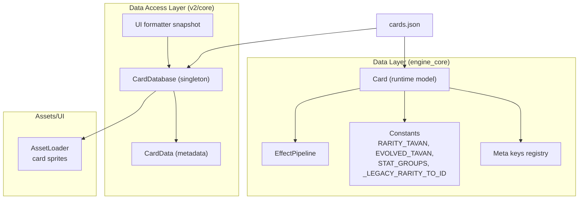
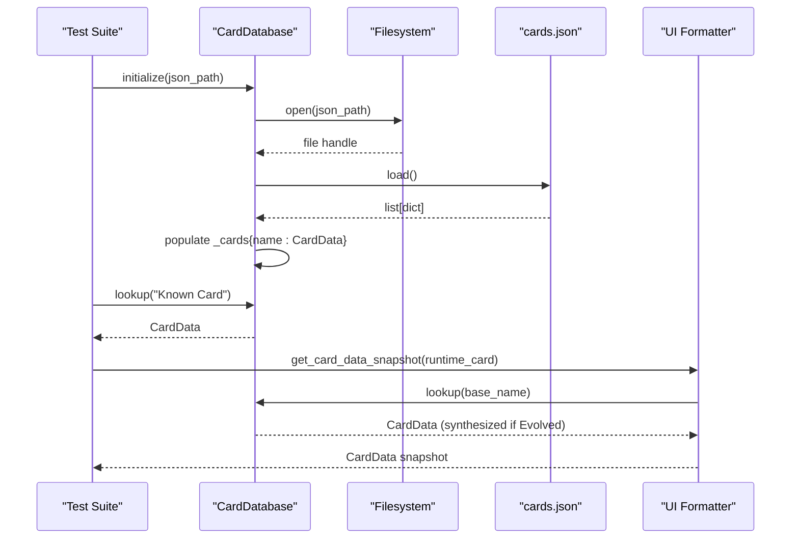
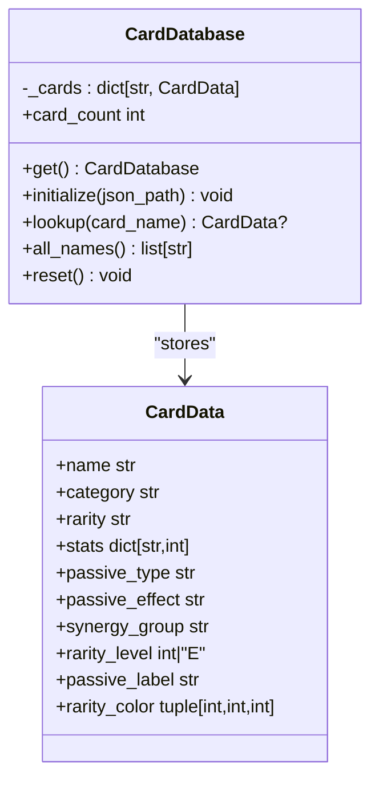
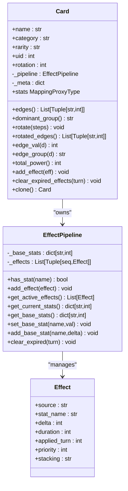
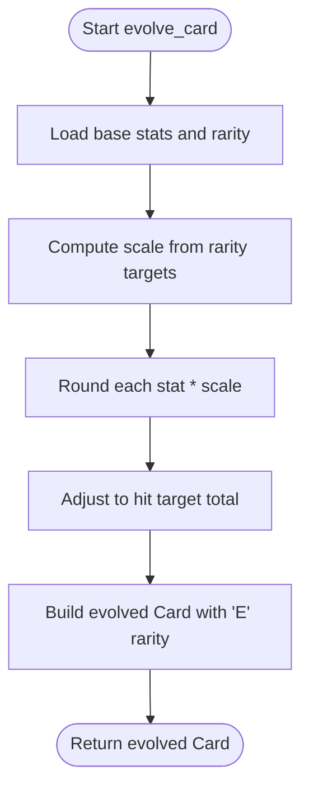
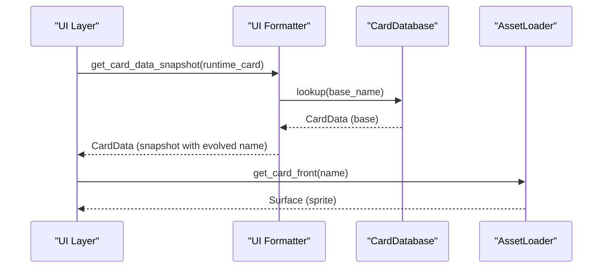
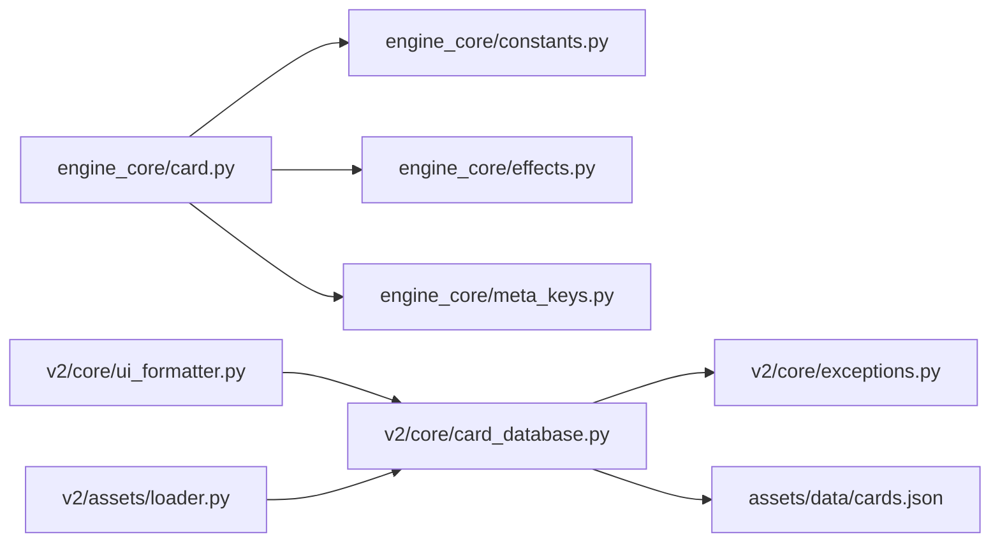

# Card Database System

<cite>
**Referenced Files in This Document**
- [cards.json](file://assets/data/cards.json)
- [card_database.py](file://v2/core/card_database.py)
- [card.py](file://engine_core/card.py)
- [constants.py](file://engine_core/constants.py)
- [effects.py](file://engine_core/effects.py)
- [meta_keys.py](file://engine_core/meta_keys.py)
- [loader.py](file://v2/assets/loader.py)
- [card_pool.gd](file://_archive/old_dirs/godot_project/scripts/card_pool.gd)
- [test_card_database.py](file://tests/test_card_database.py)
- [exceptions.py](file://v2/core/exceptions.py)
- [ui_formatter.py](file://v2/core/ui_formatter.py)
</cite>

## Table of Contents
1. [Introduction](#introduction)
2. [Project Structure](#project-structure)
3. [Core Components](#core-components)
4. [Architecture Overview](#architecture-overview)
5. [Detailed Component Analysis](#detailed-component-analysis)
6. [Dependency Analysis](#dependency-analysis)
7. [Performance Considerations](#performance-considerations)
8. [Troubleshooting Guide](#troubleshooting-guide)
9. [Conclusion](#conclusion)
10. [Appendices](#appendices)

## Introduction
This document explains the Card Database System that powers card data modeling, JSON structure organization, and card lookup mechanisms across the project. It covers both conceptual overviews for beginners and technical details for developers implementing card queries, transformations, and UI integration. The system defines:
- Card data model and JSON schema
- Card database class and card pool construction
- Card properties (name, category, rarity, stats, passives)
- Evolution handling and stat scaling
- Integration with asset loading and UI rendering
- Game engine logic bridges and performance optimization

## Project Structure
The card system spans two primary layers:
- Data and model layer (engine_core): runtime card representation, effect pipeline, constants, and evolution logic
- Data access and UI layer (v2/core): card database singleton, card metadata, and UI helpers

**Diagram sources**
- [card.py:48-316](file://engine_core/card.py#L48-L316)
- [effects.py:29-97](file://engine_core/effects.py#L29-L97)
- [constants.py:17-58](file://engine_core/constants.py#L17-L58)
- [meta_keys.py:8-70](file://engine_core/meta_keys.py#L8-L70)
- [card_database.py:69-145](file://v2/core/card_database.py#L69-L145)
- [loader.py:14-122](file://v2/assets/loader.py#L14-L122)
- [cards.json:1-800](file://assets/data/cards.json#L1-L800)

**Section sources**
- [card.py:1-316](file://engine_core/card.py#L1-L316)
- [card_database.py:1-145](file://v2/core/card_database.py#L1-L145)
- [loader.py:1-122](file://v2/assets/loader.py#L1-L122)

## Core Components
- Card (runtime model): encapsulates stats, passives, rotation, and effect pipeline; exposes derived properties (edges, dominant group, total power)
- CardDatabase (singleton): loads cards.json into memory, provides fast lookup by name, and synthesizes evolved cards
- CardData (metadata): lightweight DTO for UI and presentation with rarity level, label, and color mapping
- EffectPipeline: manages base stats and additive effects with priority ordering and expiration
- Constants: stat groups, rarity targets, legacy rarity mapping, and evolution thresholds
- AssetLoader: resolves card front/back sprites for UI rendering
- UI formatter: constructs CardData snapshots from runtime Card objects

Key responsibilities:
- CardDatabase.initialize(path) builds an in-memory card pool keyed by name
- CardDatabase.lookup(name) returns CardData or synthesizes evolved variants
- engine_core.Card builds runtime cards with effect pipeline and evolution support
- AssetLoader resolves card sprites for UI
- UI formatter bridges runtime Card to CardData for rendering

**Section sources**
- [card.py:48-316](file://engine_core/card.py#L48-L316)
- [card_database.py:69-145](file://v2/core/card_database.py#L69-L145)
- [effects.py:29-97](file://engine_core/effects.py#L29-L97)
- [constants.py:17-58](file://engine_core/constants.py#L17-L58)
- [loader.py:14-122](file://v2/assets/loader.py#L14-L122)
- [ui_formatter.py:62-85](file://v2/core/ui_formatter.py#L62-L85)

## Architecture Overview
The card system integrates three pillars:
- Data ingestion: cards.json defines card entries with name, category, rarity, stats, passive_type, passive_effect
- Runtime model: engine_core.Card builds cards with normalized rarity and effect pipeline
- Presentation layer: v2/core/CardDatabase loads metadata for UI and UI formatter converts runtime cards to CardData snapshots

**Diagram sources**
- [card_database.py:84-133](file://v2/core/card_database.py#L84-L133)
- [test_card_database.py:26-131](file://tests/test_card_database.py#L26-L131)
- [ui_formatter.py:62-85](file://v2/core/ui_formatter.py#L62-L85)

## Detailed Component Analysis

### Card Data Model and JSON Schema
- JSON structure: array of objects with fields name, category, rarity, stats, passive_type, passive_effect
- Stats normalization: engine_core.Card splits numeric base stats from meta fields (prefixed or boolean)
- Legacy rarity support: _LEGACY_RARITY_TO_ID maps diamond strings to runtime IDs "1".."5"
- Rarity targets: RARITY_TAVAN and EVOLVED_TAVAN define power ceilings for scaling

Practical implications:
- Filtering by rarity: use rarity_level property (integers 1..5, "E" for evolved)
- Stat access: use edges or stats mapping; rotation-aware getters for combat orientation
- Passive semantics: passive_type mapped to labels for UI; passive_effect text for tooltips

**Section sources**
- [cards.json:1-800](file://assets/data/cards.json#L1-L800)
- [card.py:27-45](file://engine_core/card.py#L27-L45)
- [constants.py:28-58](file://engine_core/constants.py#L28-L58)

### Card Database Class and Lookup Mechanisms
- Singleton pattern: CardDatabase.get() raises DatabaseError if not initialized
- Initialization: reads cards.json, creates CardData entries, infers synergy_group from category
- Lookup: O(1) dictionary access by exact name; supports "Evolved ..." prefix by deriving stats from base card
- Metadata: CardData provides rarity_level, passive_label, rarity_color for UI

**Diagram sources**
- [card_database.py:69-145](file://v2/core/card_database.py#L69-L145)

**Section sources**
- [card_database.py:69-145](file://v2/core/card_database.py#L69-L145)
- [exceptions.py:42-49](file://v2/core/exceptions.py#L42-L49)

### Runtime Card Model and Effect Pipeline
- Card encapsulates base stats and an EffectPipeline
- Edges and rotation: edges() returns ordered pairs; rotated_edges() respects rotation
- Dominant group: aggregates by STAT_GROUPS to compute group advantage
- Effect pipeline: additive stacking, priority ordering, and turn-based expiration
- Evolution: evolve_card scales base stats to target totals and rounds to nearest integer

**Diagram sources**
- [card.py:48-316](file://engine_core/card.py#L48-L316)
- [effects.py:18-97](file://engine_core/effects.py#L18-L97)

**Section sources**
- [card.py:48-316](file://engine_core/card.py#L48-L316)
- [effects.py:29-97](file://engine_core/effects.py#L29-L97)

### Evolution Handling and Stat Scaling
- Target totals: EVOLVED_TAVAN scales evolved rarities proportionally; E remains at 72
- Scaling formula: new_stat = round(old_stat * scale) with rounding correction to hit target
- engine_core.Card.evolve_card: produces evolved Card with "Evolved {name}" and rarity "E"
- v2/CardDatabase.lookup: synthesizes evolved stats by scaling base stats by ~1.4 and caps at 72

**Diagram sources**
- [card.py:293-316](file://engine_core/card.py#L293-L316)
- [constants.py:49-58](file://engine_core/constants.py#L49-L58)

**Section sources**
- [card.py:293-316](file://engine_core/card.py#L293-L316)
- [constants.py:49-58](file://engine_core/constants.py#L49-L58)

### Integration Between Card Database, Asset Loading, and UI Rendering
- AssetLoader: resolves card front/back sprites by name; supports overrides for special names
- UI formatter: constructs CardData snapshots from runtime Card objects; handles "Evolved " prefix
- Bridge contract: CardData.rarity == "E" and rarity_level == "E" for evolved badges

**Diagram sources**
- [ui_formatter.py:62-85](file://v2/core/ui_formatter.py#L62-L85)
- [loader.py:52-58](file://v2/assets/loader.py#L52-L58)
- [card_database.py:115-131](file://v2/core/card_database.py#L115-L131)

**Section sources**
- [ui_formatter.py:62-85](file://v2/core/ui_formatter.py#L62-L85)
- [loader.py:14-122](file://v2/assets/loader.py#L14-L122)
- [card_database.py:115-131](file://v2/core/card_database.py#L115-L131)

### Practical Examples

- Card retrieval by name
  - Initialize CardDatabase with assets/data/cards.json
  - Call lookup("Odin") to retrieve CardData
  - Use card.rarity_level to filter by tier (1..5) or evolved ("E")

- Filtering by rarity
  - Iterate CardDatabase.all_names() and filter by card.rarity_level
  - Support legacy diamond format and runtime numeric format

- Stat scaling and evolution
  - engine_core.Card.evolve_card(base_card) scales stats to EVOLVED_TAVAN
  - v2/CardDatabase.lookup("Evolved BaseName") synthesizes evolved stats by scaling base stats (~1.4) and capping at 72

- UI rendering and asset integration
  - Use AssetLoader.get_card_front("Odin") to fetch sprite
  - UI formatter composes CardData snapshots for rendered tooltips and badges

**Section sources**
- [test_card_database.py:32-131](file://tests/test_card_database.py#L32-L131)
- [card.py:293-316](file://engine_core/card.py#L293-L316)
- [card_database.py:115-131](file://v2/core/card_database.py#L115-L131)
- [loader.py:52-58](file://v2/assets/loader.py#L52-L58)
- [ui_formatter.py:62-85](file://v2/core/ui_formatter.py#L62-L85)

## Dependency Analysis
- engine_core/Card depends on:
  - engine_core/constants for rarity targets and legacy mapping
  - engine_core/effects for stat modification pipeline
  - engine_core/meta_keys for meta validation and scopes
- v2/CardDatabase depends on:
  - v2/exceptions for structured errors
  - assets/data/cards.json for initialization
- AssetLoader depends on filesystem paths under v2/assets
- UI formatter depends on CardDatabase for metadata synthesis

**Diagram sources**
- [card.py:18-20](file://engine_core/card.py#L18-L20)
- [constants.py:17-58](file://engine_core/constants.py#L17-L58)
- [effects.py:1-97](file://engine_core/effects.py#L1-L97)
- [meta_keys.py:1-70](file://engine_core/meta_keys.py#L1-L70)
- [card_database.py:1-145](file://v2/core/card_database.py#L1-L145)
- [exceptions.py:1-49](file://v2/core/exceptions.py#L1-L49)
- [ui_formatter.py:62-85](file://v2/core/ui_formatter.py#L62-L85)
- [loader.py:1-122](file://v2/assets/loader.py#L1-L122)

**Section sources**
- [card.py:18-20](file://engine_core/card.py#L18-L20)
- [card_database.py:1-145](file://v2/core/card_database.py#L1-L145)
- [loader.py:1-122](file://v2/assets/loader.py#L1-L122)

## Performance Considerations
- CardDatabase.initialize is idempotent; subsequent calls safely return existing instance
- Lookup is O(1) dictionary access; evolved lookup computes synthetic stats on demand
- engine_core.Card.get_base_stats and edges are cached via EffectPipeline; avoid frequent cloning unless necessary
- AssetLoader caches loaded surfaces; preloading scenes reduces runtime misses
- Micro-buff application during pool building ensures balanced early stats without repeated computation

[No sources needed since this section provides general guidance]

## Troubleshooting Guide
Common issues and resolutions:
- Calling CardDatabase.get() before initialize(): raises DatabaseError; ensure initialize(json_path) is called once
- Missing cards.json path: initialize() raises FileNotFoundError; verify path correctness
- Unknown meta keys: engine_core.meta_keys.validate_meta_value raises KeyError; ensure keys conform to META_SPECS
- Asset loading failures: AssetLoader.get_*() raises AssetLoadError/FileNotFoundError; confirm asset presence and paths
- Evolved card rendering: ensure UI checks rarity == "E" and rarity_level == "E" for evolved badges

**Section sources**
- [exceptions.py:42-49](file://v2/core/exceptions.py#L42-L49)
- [meta_keys.py:48-65](file://engine_core/meta_keys.py#L48-L65)
- [loader.py:37-50](file://v2/assets/loader.py#L37-L50)
- [test_card_database.py:158-161](file://tests/test_card_database.py#L158-L161)

## Conclusion
The Card Database System cleanly separates data ingestion, runtime modeling, and presentation concerns. It supports robust card lookup, flexible rarity and evolution semantics, and efficient asset integration for UI rendering. The design enables scalable filtering, stat transformations, and consistent metadata across engine and UI layers.

[No sources needed since this section summarizes without analyzing specific files]

## Appendices

### JSON Structure Reference
- Required fields: name, category, rarity, stats
- Optional fields: passive_type, passive_effect
- Stats values must be integers; meta fields are recognized by leading underscore or boolean flags

**Section sources**
- [cards.json:1-800](file://assets/data/cards.json#L1-L800)
- [card.py:27-45](file://engine_core/card.py#L27-L45)

### Legacy Rarity Mapping
- Diamond rarity strings map to runtime IDs "1".."5"
- Engine runtime may use numeric IDs; CardData.rarity_level normalizes both formats

**Section sources**
- [constants.py:28-36](file://engine_core/constants.py#L28-L36)
- [test_card_database.py:89-117](file://tests/test_card_database.py#L89-L117)

### Godot Legacy Card Pool
- Legacy Godot implementation mirrors engine_core.Card behavior: builds pool, applies micro-buff, normalizes rarity
- Useful for cross-platform parity and migration

**Section sources**
- [card_pool.gd:11-81](file://_archive/old_dirs/godot_project/scripts/card_pool.gd#L11-L81)