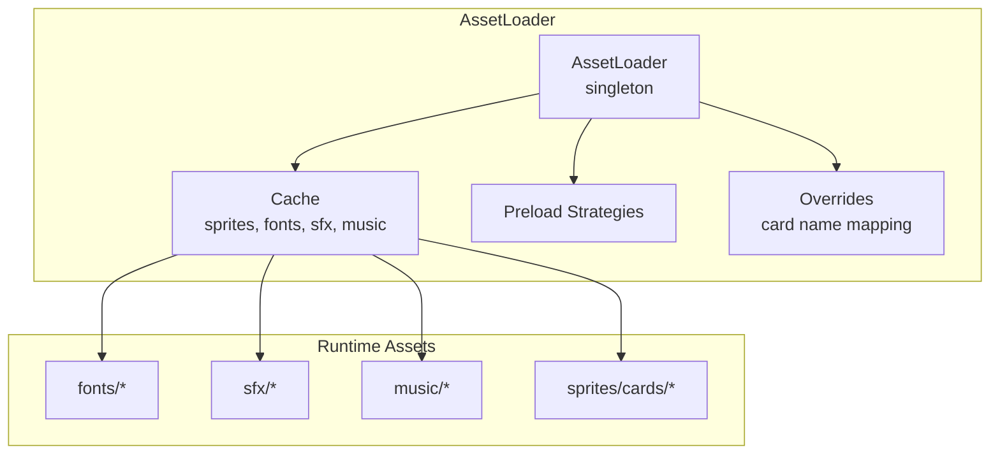
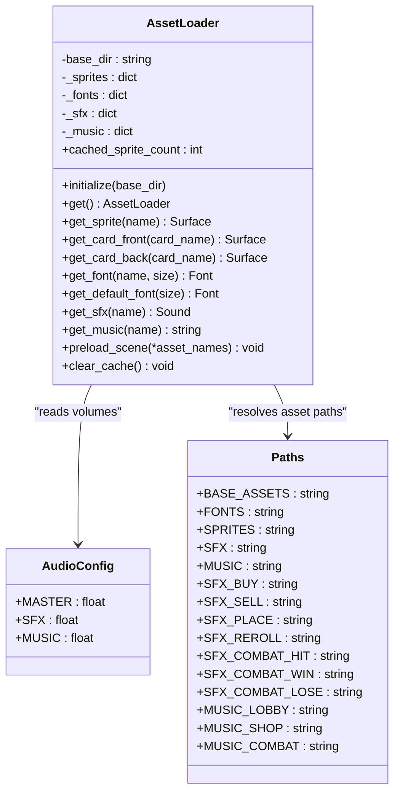
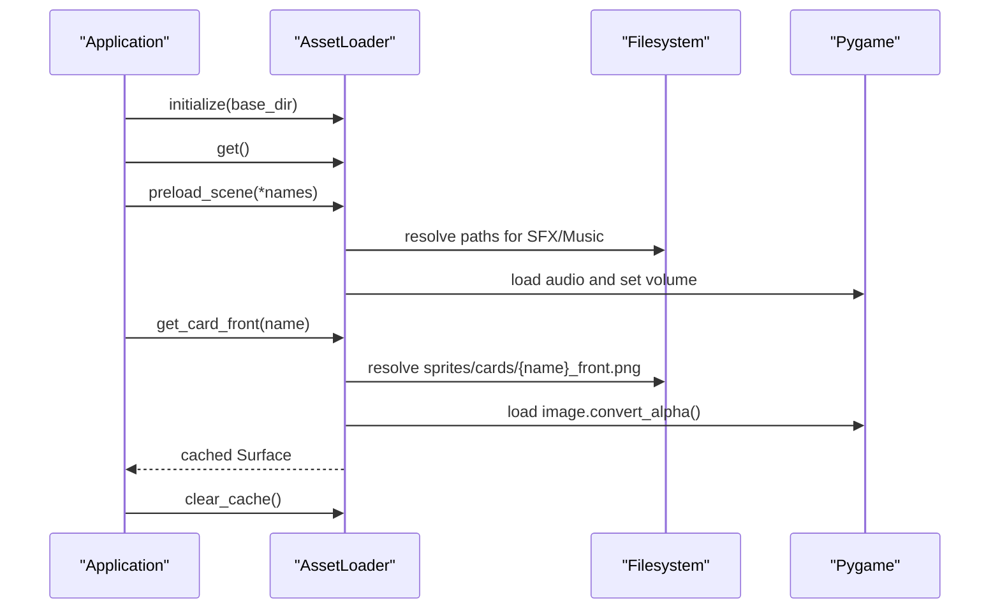
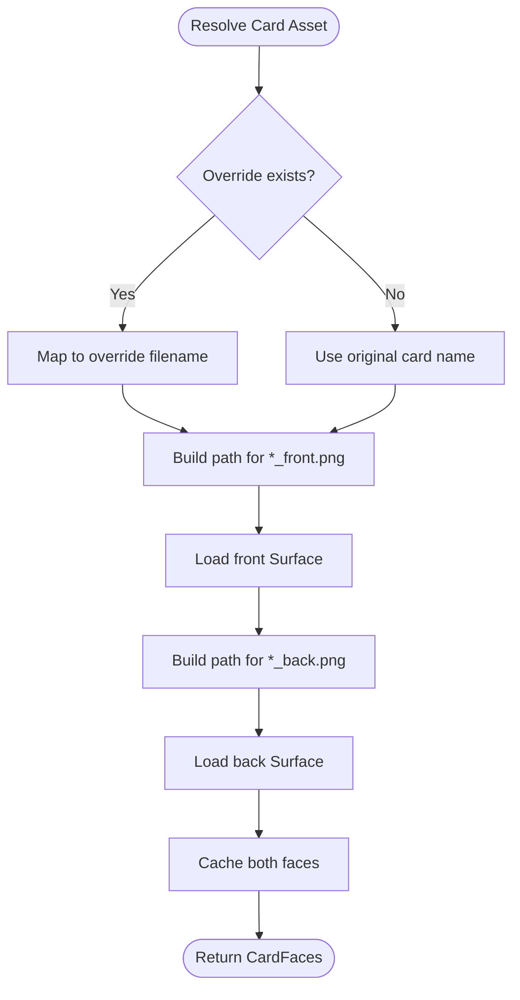
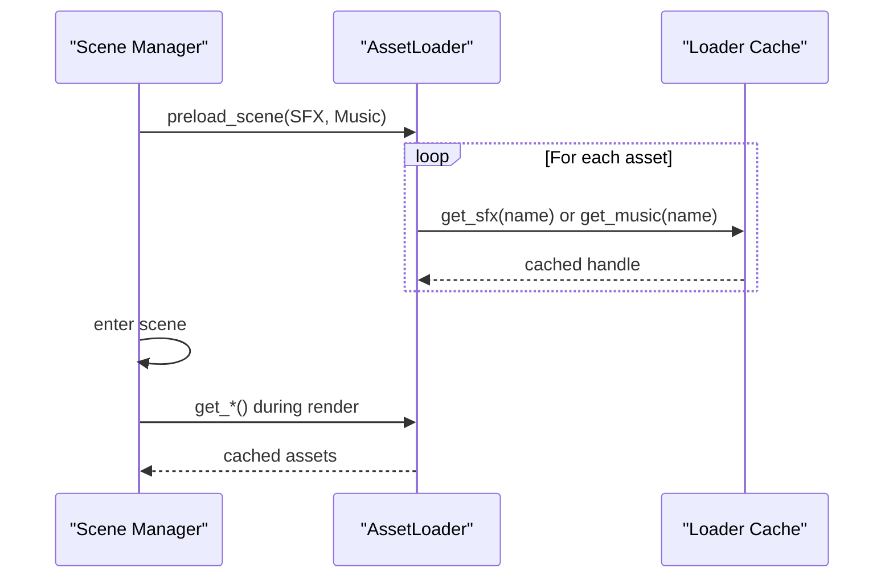
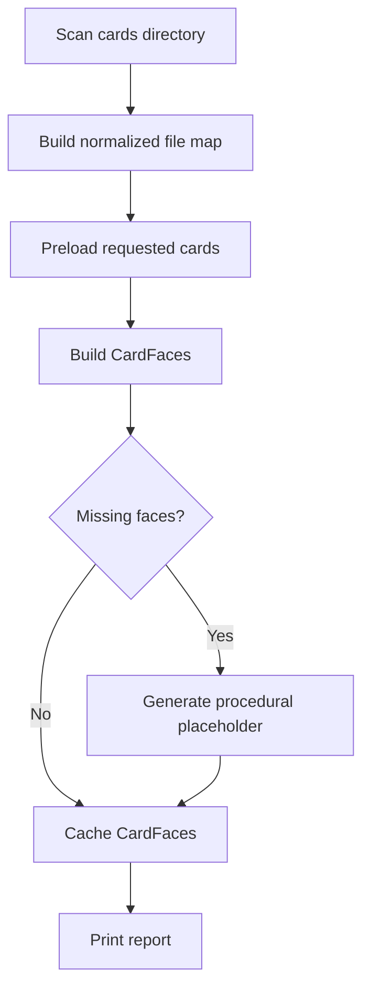
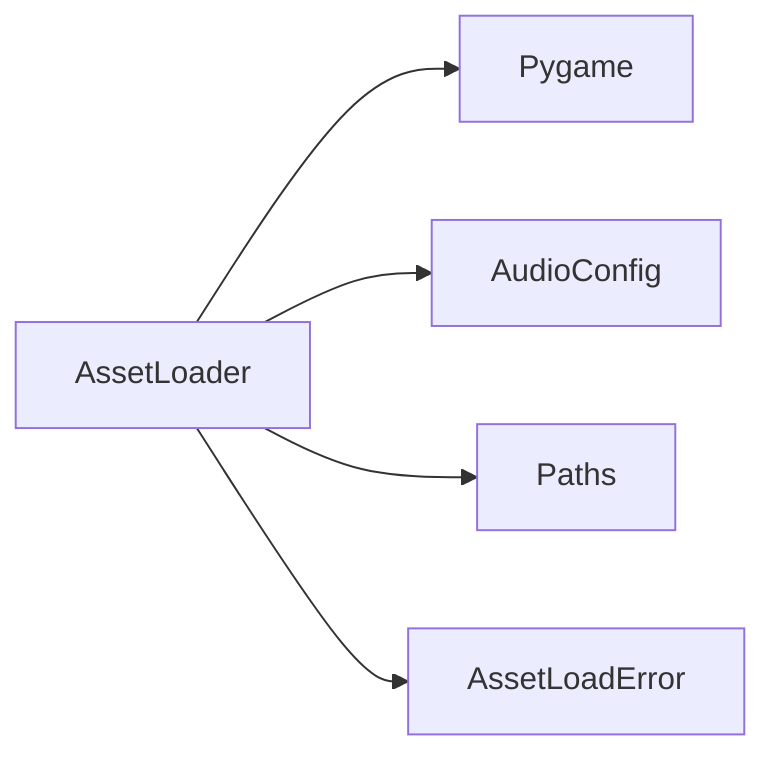

# Resource Management

<cite>
**Referenced Files in This Document**
- [loader.py](file://v2/assets/loader.py)
- [asset_loader.py](file://_archive/old_dirs/scenes/asset_loader.py)
- [constants.py](file://v2/constants.py)
- [exceptions.py](file://v2/core/exceptions.py)
- [test_asset_loader.py](file://tests/test_asset_loader.py)
- [test_task_14_asset_preloading.py](file://archive_legacy/test_task_14_asset_preloading.py)
</cite>

## Table of Contents
1. [Introduction](#introduction)
2. [Project Structure](#project-structure)
3. [Core Components](#core-components)
4. [Architecture Overview](#architecture-overview)
5. [Detailed Component Analysis](#detailed-component-analysis)
6. [Dependency Analysis](#dependency-analysis)
7. [Performance Considerations](#performance-considerations)
8. [Troubleshooting Guide](#troubleshooting-guide)
9. [Conclusion](#conclusion)
10. [Appendices](#appendices)

## Introduction
This document explains the Resource Management system used to organize, discover, load, cache, and stream assets across the application. It covers the directory hierarchy for fonts, sound effects, music tracks, and card sprites; naming conventions and overrides; resource categorization; and the integration between asset types. It also documents the resource cache, asset overrides, and preload strategies, and provides practical examples for asset discovery, loading performance optimization, and memory management. Guidance is included for adding new assets, maintaining consistency, and troubleshooting resource-related issues, along with performance considerations for large asset collections and streaming optimization strategies.

## Project Structure
Assets are organized under a central assets directory with subfolders for each asset type. The current runtime asset loader expects the following layout:
- v2/assets/fonts: TrueType/OpenType font files
- v2/assets/sfx: Sound effect files (WAV, MP3, FLAC, OGG)
- v2/assets/music: Music tracks (OGG, WAV, MP3, FLAC)
- v2/assets/sprites/cards: Card front/back image pairs named consistently per convention

Asset discovery and loading are centralized via the AssetLoader, which maintains a resource cache and supports preload strategies. The loader also supports asset overrides for special cases and integrates audio volume scaling from configuration.

**Diagram sources**
- [loader.py:14-122](file://v2/assets/loader.py#L14-L122)
- [constants.py:144-168](file://v2/constants.py#L144-L168)

**Section sources**
- [loader.py:14-122](file://v2/assets/loader.py#L14-L122)
- [constants.py:144-168](file://v2/constants.py#L144-L168)

## Core Components
- AssetLoader: Centralized singleton responsible for asset discovery, loading, caching, and streaming. It exposes typed getters for sprites, fonts, SFX, and music, and supports preload strategies and cache clearing.
- Constants: Defines asset paths, default font names, and audio asset keys used by the loader and UI.
- Exceptions: Provides AssetLoadError for explicit asset-loading failures.
- Legacy AssetLoader: Historical implementation with advanced card asset discovery, fuzzy matching, and procedural placeholders.

Key responsibilities:
- Directory-aware asset resolution and fallbacks
- Resource cache keyed by name and parameters (e.g., font size)
- Preload strategies to warm caches before scenes
- Memory management via cache clearing and cache counts
- Asset overrides for special card names

**Section sources**
- [loader.py:14-122](file://v2/assets/loader.py#L14-L122)
- [constants.py:76-84](file://v2/constants.py#L76-L84)
- [constants.py:144-168](file://v2/constants.py#L144-L168)
- [exceptions.py:30-36](file://v2/core/exceptions.py#L30-L36)
- [asset_loader.py:145-294](file://_archive/old_dirs/scenes/asset_loader.py#L145-L294)

## Architecture Overview
The AssetLoader acts as a facade over the filesystem and Pygame subsystems. It maintains separate caches for sprites, fonts, SFX, and music, and applies volume scaling from configuration when loading audio assets. Preload strategies allow warming the cache for upcoming scenes, and runtime clearing ensures memory is reclaimed when assets are no longer needed.

**Diagram sources**
- [loader.py:14-122](file://v2/assets/loader.py#L14-L122)
- [constants.py:144-168](file://v2/constants.py#L144-L168)

**Section sources**
- [loader.py:14-122](file://v2/assets/loader.py#L14-L122)
- [constants.py:144-168](file://v2/constants.py#L144-L168)

## Detailed Component Analysis

### AssetLoader: Discovery, Caching, and Streaming
- Initialization and singleton pattern: Ensures a single AssetLoader instance is used across the app and raises a specific error if accessed before initialization.
- Sprite loading: Resolves sprite paths under the sprites directory and caches surfaces. Supports card front/back retrieval via naming conventions and overrides.
- Fonts: Resolves TTF/OTF files by name and size; falls back to system fonts if a file is not found. Caches font instances keyed by (name, size).
- SFX and Music: Loads audio assets and applies volume scaling from AudioConfig. Caches handles for reuse.
- Preload strategies: preload_scene accepts asset filenames and attempts to load them as SFX or music, suppressing errors to avoid blocking startup.
- Memory management: clear_cache clears sprite and font caches; cached_sprite_count exposes sprite cache size for monitoring.

**Diagram sources**
- [loader.py:30-122](file://v2/assets/loader.py#L30-L122)

**Section sources**
- [loader.py:14-122](file://v2/assets/loader.py#L14-L122)

### Asset Overrides and Naming Conventions
- Overrides: Special card names can be remapped to match file names. This enables consistent file naming while accommodating in-game names that differ from filenames.
- Naming conventions:
  - Card sprites: {name}_front.png and {name}_back.png under sprites/cards/
  - Fonts: TTF/OTF files under fonts/
  - SFX: WAV/MP3/FLAC/OGG under sfx/
  - Music: OGG/WAV/MP3/FLAC under music/

**Diagram sources**
- [loader.py:52-58](file://v2/assets/loader.py#L52-L58)
- [loader.py:8-11](file://v2/assets/loader.py#L8-L11)

**Section sources**
- [loader.py:8-11](file://v2/assets/loader.py#L8-L11)
- [loader.py:52-58](file://v2/assets/loader.py#L52-L58)

### Preload Strategies and Scene Transitions
- Preloading: preload_scene iterates a list of asset names and attempts to load them as SFX or music. This warms the cache before entering a scene, reducing perceived latency during transitions.
- Typical usage: Call preload_scene with a curated list of SFX and music names expected in the upcoming scene. This minimizes stalls during scene entry.

**Diagram sources**
- [loader.py:105-114](file://v2/assets/loader.py#L105-L114)

**Section sources**
- [loader.py:105-114](file://v2/assets/loader.py#L105-L114)

### Legacy Card Asset Loader: Advanced Discovery and Fallbacks
- Directory scanning: Scans a cards directory for PNG files and builds a normalized file map, enabling fuzzy matching and partial matches.
- Procedural placeholders: Generates placeholder graphics for missing faces, aiding development and graceful degradation.
- Reporting: Tracks loaded pairs, partial pairs, and missing pairs to help diagnose asset gaps.
- Clearing: Resets caches and counters to free memory between scenes.

**Diagram sources**
- [asset_loader.py:168-294](file://_archive/old_dirs/scenes/asset_loader.py#L168-L294)

**Section sources**
- [asset_loader.py:145-294](file://_archive/old_dirs/scenes/asset_loader.py#L145-L294)

## Dependency Analysis
- AssetLoader depends on:
  - Pygame for image/font/audio loading and rendering contexts
  - AudioConfig for volume scaling
  - Paths for canonical asset locations and default audio keys
- Exceptions module defines AssetLoadError for explicit error handling around asset loading.

**Diagram sources**
- [loader.py:1-7](file://v2/assets/loader.py#L1-L7)
- [constants.py:164-168](file://v2/constants.py#L164-L168)
- [exceptions.py:30-36](file://v2/core/exceptions.py#L30-L36)

**Section sources**
- [loader.py:1-7](file://v2/assets/loader.py#L1-L7)
- [constants.py:164-168](file://v2/constants.py#L164-L168)
- [exceptions.py:30-36](file://v2/core/exceptions.py#L30-L36)

## Performance Considerations
- Warm caches early: Use preload_scene to load likely SFX and music before scene entry.
- Prefer cached assets: Repeated requests return cached handles to avoid repeated disk I/O and decoding.
- Control memory footprint: Clear caches after scenes that do not require assets anymore.
- Optimize asset sizes: Keep sprites and audio compressed appropriately; consider streaming large music tracks.
- Normalize names: Consistent naming reduces lookup overhead and prevents missing assets.
- Volume scaling: Apply master and category-specific volumes once per asset load to avoid repeated computation.

[No sources needed since this section provides general guidance]

## Troubleshooting Guide
Common issues and resolutions:
- Accessing AssetLoader before initialization: Initialize the loader with a base directory before calling get().
- Missing assets: Ensure files exist under the expected subdirectories and follow naming conventions.
- Cache misses: Confirm preload_scene was called for the asset names; verify that the asset paths are correct.
- Audio not playing: Check that the mixer is initialized and that volume settings are non-zero.
- Large memory usage: Clear caches after scenes and monitor cached_sprite_count to detect leaks.

Validation references:
- Singleton initialization and access behavior
- Missing sprite and font caching behavior
- Default font retrieval and caching

**Section sources**
- [test_asset_loader.py:21-29](file://tests/test_asset_loader.py#L21-L29)
- [test_asset_loader.py:32-45](file://tests/test_asset_loader.py#L32-L45)
- [test_asset_loader.py:54-61](file://tests/test_asset_loader.py#L54-L61)
- [test_asset_loader.py:63-77](file://tests/test_asset_loader.py#L63-L77)

## Conclusion
The Resource Management system centers on a robust AssetLoader that discovers, loads, and caches assets efficiently, with explicit support for overrides, preload strategies, and memory management. By following consistent naming conventions, organizing assets under the expected directory structure, and leveraging preload and cache-clearing patterns, teams can maintain predictable performance and reliability across scenes and asset categories.

[No sources needed since this section summarizes without analyzing specific files]

## Appendices

### Practical Examples

- Asset discovery and loading
  - Initialize the loader with the assets base directory.
  - Retrieve card fronts/back via get_card_front/get_card_back.
  - Verify caching behavior by requesting the same asset twice and confirming identity.

- Loading performance optimization
  - Preload likely SFX and music for the next scene using preload_scene.
  - Monitor cached_sprite_count to assess cache effectiveness.

- Memory management
  - Clear caches after scenes that do not require assets.
  - Use cached_sprite_count to track memory usage trends.

- Adding new assets
  - Place fonts under v2/assets/fonts, SFX under v2/assets/sfx, music under v2/assets/music, and card sprites under v2/assets/sprites/cards.
  - Follow naming conventions: {name}_front.png and {name}_back.png for cards.
  - Add entries to Paths for audio keys if applicable.
  - If a card name differs from the filename, add an override mapping.

- Troubleshooting
  - If asset loading fails, check for AssetLoadError and FileNotFoundError.
  - Use preload_scene to warm caches and reduce stalls.
  - For missing assets, confirm file existence and correct naming.

**Section sources**
- [loader.py:30-122](file://v2/assets/loader.py#L30-L122)
- [constants.py:144-168](file://v2/constants.py#L144-L168)
- [test_asset_loader.py:21-77](file://tests/test_asset_loader.py#L21-L77)
- [test_task_14_asset_preloading.py:70-84](file://archive_legacy/test_task_14_asset_preloading.py#L70-L84)