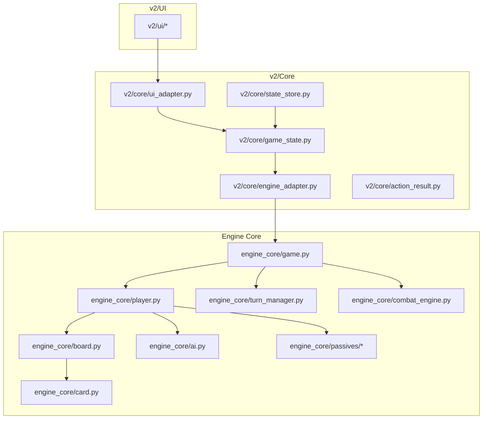
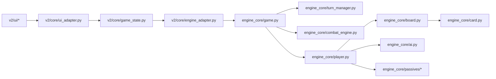
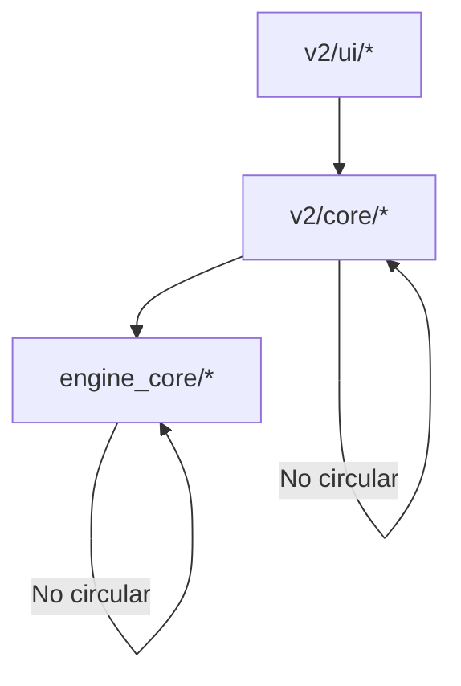

# Contributing and Development

<cite>
**Referenced Files in This Document**
- [README.md](file://README.md)
- [IMPLEMENTATION_PLAN_EXECUTABLE.md](file://IMPLEMENTATION_PLAN_EXECUTABLE.md)
- [CODEBASE_ARCHITECTURE_ANALYSIS.md](file://CODEBASE_ARCHITECTURE_ANALYSIS.md)
- [SENIOR_ARCHITECT_REPORT.md](file://SENIOR_ARCHITECT_REPORT.md)
- [pytest.ini](file://pytest.ini)
- [tests/conftest.py](file://tests/conftest.py)
- [requirements.txt](file://requirements.txt)
- [v2/core/engine_adapter.py](file://v2/core/engine_adapter.py)
- [engine_core/board.py](file://engine_core/board.py)
- [v2/core/synergy_calculator.py](file://v2/core/synergy_calculator.py)
- [v2/core/state_store.py](file://v2/core/state_store.py)
- [engine_core/player.py](file://engine_core/player.py)
- [engine_core/ai.py](file://engine_core/ai.py)
- [engine_core/game.py](file://engine_core/game.py)
- [v2/core/game_state.py](file://v2/core/game_state.py)
- [v2/core/ui_adapter.py](file://v2/core/ui_adapter.py)
- [v2/core/action_result.py](file://v2/core/action_result.py)
- [engine_core/constants.py](file://engine_core/constants.py)
- [engine_core/passives/registry.py](file://engine_core/passives/registry.py)
- [engine_core/passive_trigger.py](file://engine_core/passive_trigger.py)
- [engine_core/turn_manager.py](file://engine_core/turn_manager.py)
- [engine_core/combat_engine.py](file://engine_core/combat_engine.py)
- [engine_core/economy.py](file://engine_core/economy.py)
- [engine_core/market.py](file://engine_core/market.py)
- [engine_core/card.py](file://engine_core/card.py)
- [engine_core/player.py](file://engine_core/player.py)
- [v2/ui/hand_panel.py](file://v2/ui/hand_panel.py)
- [v2/ui/shop_panel.py](file://v2/ui/shop_panel.py)
- [v2/ui/combat_terminal.py](file://v2/ui/combat_terminal.py)
- [v2/ui/minimap_hud.py](file://v2/ui/minimap_hud.py)
- [v2/ui/synergy_hud.py](file://v2/ui/synergy_hud.py)
- [v2/ui/timer_bar.py](file://v2/ui/timer_bar.py)
- [v2/ui/info_box.py](file://v2/ui/info_box.py)
- [v2/ui/versus_overlay.py](file://v2/ui/versus_overlay.py)
- [v2/ui/endgame_overlay.py](file://v2/ui/endgame_overlay.py)
- [v2/ui/background_manager.py](file://v2/ui/background_manager.py)
- [v2/ui/font_cache.py](file://v2/ui/font_cache.py)
- [v2/ui/widgets.py](file://v2/ui/widgets.py)
- [v2/ui/ui_utils.py](file://v2/ui/ui_utils.py)
- [v2/scenes/lobby.py](file://v2/scenes/lobby.py)
- [v2/scenes/shop.py](file://v2/scenes/shop.py)
- [v2/main.py](file://v2/main.py)
- [engine_core/game.py](file://engine_core/game.py)
- [engine_core/game_factory.py](file://engine_core/game_factory.py)
- [scripts/simulation/run_simulation.py](file://scripts/simulation/run_simulation.py)
- [scripts/simulation/bench_sim.py](file://scripts/simulation/bench_sim.py)
- [scripts/simulation/analyze_all_batches.py](file://scripts/simulation/analyze_all_batches.py)
- [scripts/validation/verify_results.py](file://scripts/validation/verify_results.py)
- [scripts/refactoring/market_ekonomi_refactor.py](file://scripts/refactoring/market_ekonomi_refactor.py)
- [tools/debug_sim.py](file://tools/debug_sim.py)
- [tools/strategy_meta_analysis.py](file://tools/strategy_meta_analysis.py)
- [docs/design/Autochess_Hybrid_GDD_v06.md](file://docs/design/Autochess_Hybrid_GDD_v06.md)
- [docs/reports/qa/FIXED_SIMULATION_SUMMARY.md](file://docs/reports/qa/FIXED_SIMULATION_SUMMARY.md)
- [docs/reports/refactoring/REFACTORING_SUMMARY.md](file://docs/reports/refactoring/REFACTORING_SUMMARY.md)
- [docs/guides/CURSOR_BASLANGIC.md](file://docs/guides/CURSOR_BASLANGIC.md)
- [MIGRATION.md](file://MIGRATION.md)
</cite>

## Table of Contents
1. [Introduction](#introduction)
2. [Project Structure](#project-structure)
3. [Core Components](#core-components)
4. [Architecture Overview](#architecture-overview)
5. [Detailed Component Analysis](#detailed-component-analysis)
6. [Dependency Analysis](#dependency-analysis)
7. [Performance Considerations](#performance-considerations)
8. [Troubleshooting Guide](#troubleshooting-guide)
9. [Conclusion](#conclusion)
10. [Appendices](#appendices)

## Introduction
This document defines the development guidelines, code style standards, and contribution workflow for the Autochess Hybrid project. It consolidates the project’s engineering practices, testing requirements, documentation standards, and governance processes. It also outlines extension points for adding new features, AI strategies, and UI components, and provides practical examples of contribution processes, code review procedures, and project governance.

## Project Structure
The repository combines a pure game engine (engine_core), a state management layer (v2/core), and a Pygame-based UI (v2/ui). The top-level structure supports:
- Engine core: game logic, AI, combat, passives, and state transitions
- v2/core: state adapters, UI adapters, and contracts between engine and UI
- v2/ui: Pygame rendering and interactive components
- Tests: unit, integration, and QA suites
- Scripts and tools: simulation, validation, and refactoring helpers
- Documentation: design docs, reports, and guides

**Diagram sources**
- [engine_core/game.py](file://engine_core/game.py)
- [engine_core/player.py](file://engine_core/player.py)
- [engine_core/board.py](file://engine_core/board.py)
- [engine_core/card.py](file://engine_core/card.py)
- [engine_core/ai.py](file://engine_core/ai.py)
- [engine_core/turn_manager.py](file://engine_core/turn_manager.py)
- [engine_core/combat_engine.py](file://engine_core/combat_engine.py)
- [v2/core/game_state.py](file://v2/core/game_state.py)
- [v2/core/engine_adapter.py](file://v2/core/engine_adapter.py)
- [v2/core/ui_adapter.py](file://v2/core/ui_adapter.py)
- [v2/core/state_store.py](file://v2/core/state_store.py)
- [v2/core/action_result.py](file://v2/core/action_result.py)
- [v2/ui/hand_panel.py](file://v2/ui/hand_panel.py)
- [v2/ui/shop_panel.py](file://v2/ui/shop_panel.py)
- [v2/ui/combat_terminal.py](file://v2/ui/combat_terminal.py)
- [v2/ui/minimap_hud.py](file://v2/ui/minimap_hud.py)
- [v2/ui/synergy_hud.py](file://v2/ui/synergy_hud.py)
- [v2/ui/timer_bar.py](file://v2/ui/timer_bar.py)
- [v2/ui/info_box.py](file://v2/ui/info_box.py)
- [v2/ui/versus_overlay.py](file://v2/ui/versus_overlay.py)
- [v2/ui/endgame_overlay.py](file://v2/ui/endgame_overlay.py)
- [v2/ui/background_manager.py](file://v2/ui/background_manager.py)
- [v2/ui/font_cache.py](file://v2/ui/font_cache.py)
- [v2/ui/widgets.py](file://v2/ui/widgets.py)
- [v2/ui/ui_utils.py](file://v2/ui/ui_utils.py)

**Section sources**
- [README.md:7-58](file://README.md#L7-L58)
- [README.md:143-189](file://README.md#L143-L189)

## Core Components
This section summarizes the core components and their responsibilities, which inform development guidelines and contribution expectations.

- Engine Core
  - Game orchestrates turns, phases, and lifecycle
  - Player encapsulates state, economy, inventory, and board
  - Board manages hex grid, combat, combos, synergy, and damage
  - Card stores stats, edges, rotation, and meta
  - AI selects purchases and placements
  - TurnManager controls phase transitions
  - CombatEngine resolves combat outcomes
  - Passives define event-driven behaviors

- v2/Core
  - GameState exposes immutable PublicState snapshots
  - EngineAdapter bridges v2 to engine_core
  - StateStore caches board state for UI
  - UIAdapter builds views from engine state
  - ActionResult standardizes operation results

- v2/UI
  - Panels and overlays implement scene-based UI
  - Widgets and HUDs render game state

**Section sources**
- [CODEBASE_ARCHITECTURE_ANALYSIS.md:48-93](file://CODEBASE_ARCHITECTURE_ANALYSIS.md#L48-L93)
- [v2/core/game_state.py](file://v2/core/game_state.py)
- [v2/core/engine_adapter.py](file://v2/core/engine_adapter.py)
- [v2/core/state_store.py](file://v2/core/state_store.py)
- [v2/core/ui_adapter.py](file://v2/core/ui_adapter.py)
- [v2/core/action_result.py](file://v2/core/action_result.py)

## Architecture Overview
The architecture follows a layered design:
- engine_core: pure logic with no UI dependencies
- v2/core: adapters and state management
- v2/ui: Pygame rendering and interactive components

**Diagram sources**
- [v2/ui/hand_panel.py](file://v2/ui/hand_panel.py)
- [v2/ui/shop_panel.py](file://v2/ui/shop_panel.py)
- [v2/core/ui_adapter.py](file://v2/core/ui_adapter.py)
- [v2/core/game_state.py](file://v2/core/game_state.py)
- [v2/core/engine_adapter.py](file://v2/core/engine_adapter.py)
- [engine_core/game.py](file://engine_core/game.py)
- [engine_core/turn_manager.py](file://engine_core/turn_manager.py)
- [engine_core/combat_engine.py](file://engine_core/combat_engine.py)
- [engine_core/player.py](file://engine_core/player.py)
- [engine_core/board.py](file://engine_core/board.py)
- [engine_core/card.py](file://engine_core/card.py)
- [engine_core/ai.py](file://engine_core/ai.py)
- [engine_core/passives/registry.py](file://engine_core/passives/registry.py)

**Section sources**
- [CODEBASE_ARCHITECTURE_ANALYSIS.md:23-46](file://CODEBASE_ARCHITECTURE_ANALYSIS.md#L23-L46)
- [README.md:143-166](file://README.md#L143-L166)

## Detailed Component Analysis

### Development Guidelines and Contribution Workflow
- Contribution basics
  - Fork and branch from the default branch
  - Create focused feature branches
  - Reference related issues and PRs
  - Keep commits atomic and well-described

- Code style standards
  - PEP 8 compliant Python code
  - Type hints where applicable
  - Docstrings for public APIs
  - Consistent naming conventions across modules

- Contribution workflow
  - Branch naming: feature/short-description
  - Commit messages: concise, imperative, include issue reference
  - PR checklist:
    - All tests pass
    - New or updated tests included
    - Documentation updated
    - No breaking changes to public APIs
  - Code review: at least one reviewer approves; address feedback promptly

- Pull request requirements
  - pytest passes locally
  - Coverage maintained or improved
  - No new lint violations
  - Performance impact reviewed if applicable

- Project governance
  - Maintainers triage issues and PRs
  - Escalation protocol for blockers
  - Risk log and post-mortems for production issues

**Section sources**
- [README.md:223-233](file://README.md#L223-L233)
- [pytest.ini:1-5](file://pytest.ini#L1-L5)
- [tests/conftest.py:1-27](file://tests/conftest.py#L1-L27)

### Testing Requirements and Standards
- Test categories
  - Unit tests: isolated logic and functions
  - Integration tests: cross-module behavior
  - QA tests: regression and edge cases
  - End-to-end tests: full game flow validation

- Execution
  - Run all tests: pytest
  - Run specific tests: pytest tests/<path>
  - Coverage: pytest --cov=engine_core tests/
  - Headless environment: SDL_VIDEODRIVER=dummy

- Test markers
  - known_bug: documents known failures pending fix

- Test environment safeguards
  - Session-scoped fixture initializes Pygame in headless mode
  - Environment variables pinned for reproducibility

**Section sources**
- [README.md:115-129](file://README.md#L115-L129)
- [pytest.ini:3-5](file://pytest.ini#L3-L5)
- [tests/conftest.py:15-27](file://tests/conftest.py#L15-L27)

### Documentation Standards
- Documentation locations
  - Game Design Document: docs/design/Autochess_Hybrid_GDD_v06.md
  - Guides: docs/guides/CURSOR_BASLANGIC.md
  - Reports: docs/reports/*
  - QA and refactoring summaries

- Standards
  - Keep docs synchronized with code changes
  - Include diagrams and examples where helpful
  - Maintain changelog entries for major changes

**Section sources**
- [README.md:131-142](file://README.md#L131-L142)
- [docs/design/Autochess_Hybrid_GDD_v06.md:1-30](file://docs/design/Autochess_Hybrid_GDD_v06.md#L1-L30)
- [docs/guides/CURSOR_BASLANGIC.md](file://docs/guides/CURSOR_BASLANGIC.md)

### Extension Points and Feature Development
- Adding new cards
  - Extend card database JSON
  - Handlers auto-register via passives registry
  - No engine changes required for stats and groups

- Adding new AI strategies
  - Define strategy parameters and selection logic
  - Use AI parameter loader with explicit error handling
  - Validate with simulation and QA tests

- Extending UI components
  - Follow scene-based architecture
  - Use existing panels and overlays as templates
  - Maintain separation between logic and rendering

- Modifying synergy system
  - Parameterize group system and BFS
  - Centralize calculations in SynergyCalculator
  - Avoid hardcoded group assumptions

- Performance-sensitive areas
  - Cache synergy computations
  - Avoid O(n^2) repeated work
  - Use bounded data structures (deque for logs)

**Section sources**
- [engine_core/card.py](file://engine_core/card.py)
- [engine_core/passives/registry.py](file://engine_core/passives/registry.py)
- [engine_core/ai.py](file://engine_core/ai.py)
- [v2/ui/hand_panel.py](file://v2/ui/hand_panel.py)
- [v2/ui/shop_panel.py](file://v2/ui/shop_panel.py)
- [v2/ui/combat_terminal.py](file://v2/ui/combat_terminal.py)
- [v2/ui/minimap_hud.py](file://v2/ui/minimap_hud.py)
- [v2/ui/synergy_hud.py](file://v2/ui/synergy_hud.py)
- [v2/ui/timer_bar.py](file://v2/ui/timer_bar.py)
- [v2/ui/info_box.py](file://v2/ui/info_box.py)
- [v2/ui/versus_overlay.py](file://v2/ui/versus_overlay.py)
- [v2/ui/endgame_overlay.py](file://v2/ui/endgame_overlay.py)
- [v2/ui/background_manager.py](file://v2/ui/background_manager.py)
- [v2/ui/font_cache.py](file://v2/ui/font_cache.py)
- [v2/ui/widgets.py](file://v2/ui/widgets.py)
- [v2/ui/ui_utils.py](file://v2/ui/ui_utils.py)
- [v2/core/synergy_calculator.py](file://v2/core/synergy_calculator.py)
- [engine_core/board.py](file://engine_core/board.py)
- [engine_core/constants.py](file://engine_core/constants.py)

### Code Review Procedures and Best Practices
- Review checklist
  - Requirements adherence
  - Test coverage and quality
  - Performance impact
  - Error handling and logging
  - Documentation updates

- Review tools and standards
  - pytest for functional validation
  - Type hints and docstrings
  - Avoid silent failures; raise descriptive exceptions

- Example review scenarios
  - State synchronization fixes
  - Synergy BFS consolidation
  - Error handling improvements
  - Performance optimizations

**Section sources**
- [v2/core/engine_adapter.py](file://v2/core/engine_adapter.py)
- [engine_core/board.py](file://engine_core/board.py)
- [v2/core/synergy_calculator.py](file://v2/core/synergy_calculator.py)
- [v2/core/state_store.py](file://v2/core/state_store.py)
- [engine_core/player.py](file://engine_core/player.py)
- [engine_core/ai.py](file://engine_core/ai.py)
- [engine_core/game.py](file://engine_core/game.py)
- [v2/core/game_state.py](file://v2/core/game_state.py)
- [v2/core/ui_adapter.py](file://v2/core/ui_adapter.py)
- [v2/core/action_result.py](file://v2/core/action_result.py)

### Practical Examples: Contribution Processes
- Example: Fixing state desynchronization
  - Identify stale cache in StateStore
  - Hook Board mutations to update StateStore
  - Add unit tests validating cache sync
  - Run integration tests to prevent regressions

- Example: Consolidating synergy BFS
  - Migrate consumers to SynergyCalculator
  - Remove duplicate implementations
  - Add performance tests and benchmarks
  - Update documentation and tests

- Example: Improving error handling
  - Replace shim returns with descriptive exceptions
  - Add logging context to error paths
  - Validate error propagation in adapters

- Example: Adding a new UI overlay
  - Study existing overlays (versus, endgame)
  - Implement scene integration
  - Add tests for user interactions
  - Verify performance in render loop

**Section sources**
- [SENIOR_ARCHITECT_REPORT.md:19-115](file://SENIOR_ARCHITECT_REPORT.md#L19-L115)
- [IMPLEMENTATION_PLAN_EXECUTABLE.md:62-207](file://IMPLEMENTATION_PLAN_EXECUTABLE.md#L62-L207)
- [CODEBASE_ARCHITECTURE_ANALYSIS.md:706-744](file://CODEBASE_ARCHITECTURE_ANALYSIS.md#L706-L744)
- [v2/ui/versus_overlay.py](file://v2/ui/versus_overlay.py)
- [v2/ui/endgame_overlay.py](file://v2/ui/endgame_overlay.py)

## Dependency Analysis
The project enforces unidirectional dependencies: v2/UI depends on v2/Core, which depends on engine_core. There are no circular imports detected.

**Diagram sources**
- [CODEBASE_ARCHITECTURE_ANALYSIS.md:95-98](file://CODEBASE_ARCHITECTURE_ANALYSIS.md#L95-L98)

**Section sources**
- [CODEBASE_ARCHITECTURE_ANALYSIS.md:95-98](file://CODEBASE_ARCHITECTURE_ANALYSIS.md#L95-L98)

## Performance Considerations
- Synergy BFS performance
  - Centralize BFS in SynergyCalculator
  - Cache results keyed by board state
  - Avoid redundant computations per frame

- State synchronization
  - Hook Board mutations to invalidate cache
  - Prefer live reads over stale caches when necessary

- Logging and memory
  - Use bounded deques for logs
  - Avoid unbounded growth in long-running simulations

- UI rendering
  - Minimize surface recreation per frame
  - Cache textures and fonts

**Section sources**
- [v2/core/synergy_calculator.py](file://v2/core/synergy_calculator.py)
- [v2/core/state_store.py](file://v2/core/state_store.py)
- [engine_core/game.py](file://engine_core/game.py)
- [v2/ui/font_cache.py](file://v2/ui/font_cache.py)
- [v2/ui/background_manager.py](file://v2/ui/background_manager.py)

## Troubleshooting Guide
- Common issues and resolutions
  - Silent failures: replace shim returns with descriptive exceptions; add logging context
  - State desync: hook Board mutations; invalidate cache on changes
  - Duplicated logic: consolidate to single source of truth (e.g., SynergyCalculator)
  - Performance regressions: add caching; profile BFS and render paths

- Debugging aids
  - pytest with verbose and coverage flags
  - Headless Pygame initialization for CI
  - Simulation scripts for stress testing

- Escalation and risk management
  - Document blockers and risks
  - Pause work on unresolved issues
  - Perform root cause analysis before resuming

**Section sources**
- [v2/core/engine_adapter.py](file://v2/core/engine_adapter.py)
- [v2/core/state_store.py](file://v2/core/state_store.py)
- [v2/core/synergy_calculator.py](file://v2/core/synergy_calculator.py)
- [tests/conftest.py:15-27](file://tests/conftest.py#L15-L27)
- [IMPLEMENTATION_PLAN_EXECUTABLE.md:709-724](file://IMPLEMENTATION_PLAN_EXECUTABLE.md#L709-L724)

## Conclusion
This Contributing and Development guide consolidates the project’s development guidelines, testing requirements, documentation standards, and governance processes. By following these practices—PEP 8 compliance, robust error handling, centralized logic, and performance-conscious design—you can contribute effectively to Autochess Hybrid while maintaining code quality and system reliability.

## Appendices

### Appendix A: Development Environment Setup
- Install dependencies: pip install -r requirements.txt
- Run tests: pytest
- Run simulations: scripts/simulation/run_simulation.py

**Section sources**
- [requirements.txt:1-20](file://requirements.txt#L1-L20)
- [README.md:102-113](file://README.md#L102-L113)

### Appendix B: Scene-Based Architecture Migration
- Use main.py for scene-based architecture
- Legacy run_game.py is deprecated
- Refer to MIGRATION.md for details

**Section sources**
- [README.md:167-177](file://README.md#L167-L177)
- [MIGRATION.md](file://MIGRATION.md)

### Appendix C: Simulation and Validation
- Run simulations and benchmarks
- Use validation scripts for result verification
- Analyze batch results for performance trends

**Section sources**
- [scripts/simulation/run_simulation.py](file://scripts/simulation/run_simulation.py)
- [scripts/simulation/bench_sim.py](file://scripts/simulation/bench_sim.py)
- [scripts/simulation/analyze_all_batches.py](file://scripts/simulation/analyze_all_batches.py)
- [scripts/validation/verify_results.py](file://scripts/validation/verify_results.py)