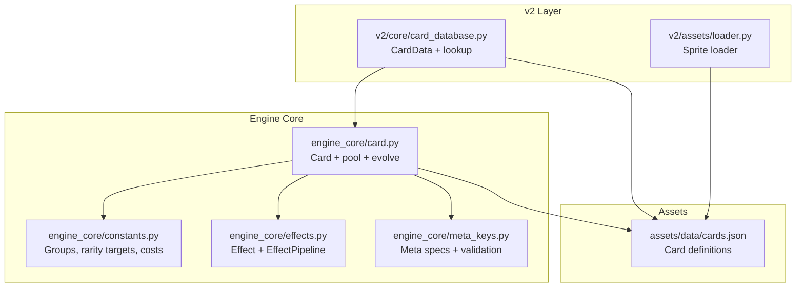
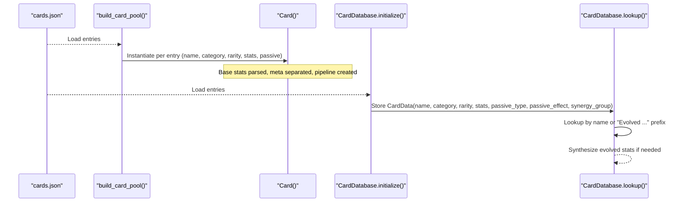
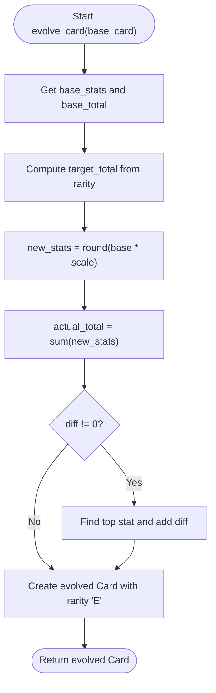
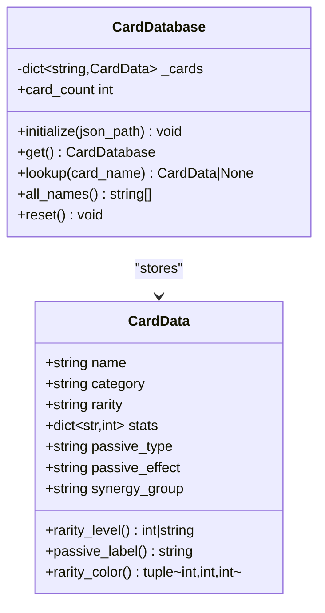
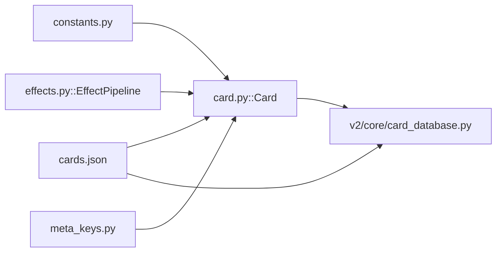

# Card System

<cite>
**Referenced Files in This Document**
- [engine_core/card.py](file://engine_core/card.py)
- [engine_core/constants.py](file://engine_core/constants.py)
- [engine_core/effects.py](file://engine_core/effects.py)
- [engine_core/meta_keys.py](file://engine_core/meta_keys.py)
- [assets/data/cards.json](file://assets/data/cards.json)
- [v2/core/card_database.py](file://v2/core/card_database.py)
- [tests/test_card_database.py](file://tests/test_card_database.py)
- [v2/assets/loader.py](file://v2/assets/loader.py)
</cite>

## Table of Contents
1. [Introduction](#introduction)
2. [Project Structure](#project-structure)
3. [Core Components](#core-components)
4. [Architecture Overview](#architecture-overview)
5. [Detailed Component Analysis](#detailed-component-analysis)
6. [Dependency Analysis](#dependency-analysis)
7. [Performance Considerations](#performance-considerations)
8. [Troubleshooting Guide](#troubleshooting-guide)
9. [Conclusion](#conclusion)

## Introduction
This document explains the card system architecture, focusing on the Card data model, stats and groups, rarity and evolution mechanics, passive ability definitions, and the card database and lookup systems. It covers card instantiation, evolution tracking, card pool management, property and stat scaling, and the relationship between card definitions and runtime instances. It also documents JSON-based card data management, serialization/deserialization, and practical troubleshooting and performance guidance.

## Project Structure
The card system spans two primary layers:
- Engine core (runtime): defines the Card class, effect pipeline, stat groups, rarity targets, and evolution logic.
- UI/database bridge (v2): loads and exposes card definitions from JSON for UI and compatibility.

**Diagram sources**
- [engine_core/card.py:1-316](file://engine_core/card.py#L1-L316)
- [engine_core/constants.py:1-145](file://engine_core/constants.py#L1-L145)
- [engine_core/effects.py:1-97](file://engine_core/effects.py#L1-L97)
- [engine_core/meta_keys.py:1-70](file://engine_core/meta_keys.py#L1-L70)
- [assets/data/cards.json:1-1517](file://assets/data/cards.json#L1-L1517)
- [v2/core/card_database.py:1-145](file://v2/core/card_database.py#L1-L145)
- [v2/assets/loader.py:1-122](file://v2/assets/loader.py#L1-L122)

**Section sources**
- [engine_core/card.py:1-316](file://engine_core/card.py#L1-L316)
- [engine_core/constants.py:1-145](file://engine_core/constants.py#L1-L145)
- [engine_core/effects.py:1-97](file://engine_core/effects.py#L1-L97)
- [engine_core/meta_keys.py:1-70](file://engine_core/meta_keys.py#L1-L70)
- [assets/data/cards.json:1-1517](file://assets/data/cards.json#L1-L1517)
- [v2/core/card_database.py:1-145](file://v2/core/card_database.py#L1-L145)
- [v2/assets/loader.py:1-122](file://v2/assets/loader.py#L1-L122)

## Core Components
- Card: Runtime representation with base stats, meta keys, rotation, edges, and effect pipeline. Provides stat accessors, combat helpers, and cloning.
- Effect and EffectPipeline: Manage stat modifications via ordered, additive effects with durations and priorities.
- Stat Groups and Rarity Targets: Define stat-to-group mapping and target totals per rarity tier and evolution.
- Card Pool: Loads definitions from JSON, normalizes legacy rarity, and applies micro-buffs to weak cards.
- CardDatabase (v2): Loads definitions from JSON into CardData objects, supports lookup and inferred synergy groups; synthesizes evolved cards.

Key responsibilities:
- Stats and groups: [engine_core/constants.py:17-22](file://engine_core/constants.py#L17-L22)
- Evolution targets: [engine_core/constants.py:49-58](file://engine_core/constants.py#L49-L58)
- Card class and pipeline: [engine_core/card.py:48-232](file://engine_core/card.py#L48-L232), [engine_core/effects.py:29-97](file://engine_core/effects.py#L29-L97)
- Meta keys and validation: [engine_core/meta_keys.py:14-65](file://engine_core/meta_keys.py#L14-L65)
- Card pool and evolution: [engine_core/card.py:237-316](file://engine_core/card.py#L237-L316)
- v2 database and lookup: [v2/core/card_database.py:69-145](file://v2/core/card_database.py#L69-L145)

**Section sources**
- [engine_core/card.py:48-232](file://engine_core/card.py#L48-L232)
- [engine_core/effects.py:29-97](file://engine_core/effects.py#L29-L97)
- [engine_core/constants.py:17-22](file://engine_core/constants.py#L17-L22)
- [engine_core/constants.py:49-58](file://engine_core/constants.py#L49-L58)
- [engine_core/meta_keys.py:14-65](file://engine_core/meta_keys.py#L14-L65)
- [v2/core/card_database.py:69-145](file://v2/core/card_database.py#L69-L145)

## Architecture Overview
The runtime Card encapsulates base stats and an effect pipeline. Definitions come from JSON and are normalized to internal formats. The v2 CardDatabase provides a typed, lookup-friendly view for UI and compatibility.

**Diagram sources**
- [engine_core/card.py:246-263](file://engine_core/card.py#L246-L263)
- [engine_core/card.py:293-316](file://engine_core/card.py#L293-L316)
- [v2/core/card_database.py:84-108](file://v2/core/card_database.py#L84-L108)
- [v2/core/card_database.py:110-133](file://v2/core/card_database.py#L110-L133)
- [assets/data/cards.json:1-1517](file://assets/data/cards.json#L1-L1517)

## Detailed Component Analysis

### Card Data Model and Properties
- Fields: name, category, rarity, passive_type, uid, rotation.
- Base stats: stored in a pipeline; exposed via mapping proxy to prevent mutation.
- Meta keys: validated against specs; separate from gameplay stats; support scopes like persistent and combat.
- Edges and rotation: cyclic ordering of stats for combat and synergy logic.
- Combat helpers: total power, elimination checks, edge debuff application, highest-edge loss, strengthening.

Implementation highlights:
- Splitting base stats and meta: [engine_core/card.py:35-45](file://engine_core/card.py#L35-L45)
- Pipeline creation and exposure: [engine_core/card.py:61-68](file://engine_core/card.py#L61-L68), [engine_core/effects.py:29-75](file://engine_core/effects.py#L29-L75)
- Rotation and edges: [engine_core/card.py:127-148](file://engine_core/card.py#L127-L148)
- Elimination logic and group aggregation: [engine_core/card.py:163-176](file://engine_core/card.py#L163-L176)
- Debuff application via effect pipeline: [engine_core/card.py:187-204](file://engine_core/card.py#L187-L204)

**Section sources**
- [engine_core/card.py:35-45](file://engine_core/card.py#L35-L45)
- [engine_core/card.py:61-68](file://engine_core/card.py#L61-L68)
- [engine_core/effects.py:29-75](file://engine_core/effects.py#L29-L75)
- [engine_core/card.py:127-148](file://engine_core/card.py#L127-L148)
- [engine_core/card.py:163-176](file://engine_core/card.py#L163-L176)
- [engine_core/card.py:187-204](file://engine_core/card.py#L187-L204)

### Stats, Groups, and Scaling
- Stat groups: EXISTENCE, MIND, CONNECTION map stats to thematic categories.
- Group advantage: cyclic matrix determines bonuses.
- Rarity targets: target totals per rarity; evolved targets scaled proportionally.
- Scaling behavior: runtime pool averages are computed; weak cards receive small boosts to improve viability.

References:
- Group mapping: [engine_core/constants.py:17-22](file://engine_core/constants.py#L17-L22)
- Group advantage: [engine_core/constants.py:42-43](file://engine_core/constants.py#L42-L43)
- Rarity targets and evolved targets: [engine_core/constants.py:49-58](file://engine_core/constants.py#L49-L58)
- Micro-buff logic: [engine_core/card.py:266-290](file://engine_core/card.py#L266-L290)

**Section sources**
- [engine_core/constants.py:17-22](file://engine_core/constants.py#L17-L22)
- [engine_core/constants.py:42-43](file://engine_core/constants.py#L42-L43)
- [engine_core/constants.py:49-58](file://engine_core/constants.py#L49-L58)
- [engine_core/card.py:266-290](file://engine_core/card.py#L266-L290)

### Rarity and Evolution Mechanics
- Legacy rarity normalization: diamond strings mapped to numeric IDs.
- Evolution: compute target total based on rarity, scale base stats, adjust rounding to meet target, preserve top stat integrity.
- Evolved badge contract: evolved cards carry "E" rarity and level for UI.

References:
- Normalization: [engine_core/card.py:23-24](file://engine_core/card.py#L23-L24)
- Evolution computation: [engine_core/card.py:293-316](file://engine_core/card.py#L293-L316)
- Targets: [engine_core/constants.py:49-58](file://engine_core/constants.py#L49-L58)

**Diagram sources**
- [engine_core/card.py:293-316](file://engine_core/card.py#L293-L316)
- [engine_core/constants.py:49-58](file://engine_core/constants.py#L49-L58)

**Section sources**
- [engine_core/card.py:23-24](file://engine_core/card.py#L23-L24)
- [engine_core/card.py:293-316](file://engine_core/card.py#L293-L316)
- [engine_core/constants.py:49-58](file://engine_core/constants.py#L49-L58)

### Passive Ability Definitions
- Definitions are embedded in JSON with fields for passive_type and passive_effect.
- v2 CardDatabase maps passive_type to labels for UI presentation.
- Engine Core supports passive-triggered effects via meta keys and effect pipeline.

References:
- JSON schema and examples: [assets/data/cards.json:1-1517](file://assets/data/cards.json#L1-L1517)
- Passive label mapping: [v2/core/card_database.py:22-32](file://v2/core/card_database.py#L22-L32)
- Meta specs for passives: [engine_core/meta_keys.py:14-34](file://engine_core/meta_keys.py#L14-L34)

**Section sources**
- [assets/data/cards.json:1-1517](file://assets/data/cards.json#L1-L1517)
- [v2/core/card_database.py:22-32](file://v2/core/card_database.py#L22-L32)
- [engine_core/meta_keys.py:14-34](file://engine_core/meta_keys.py#L14-L34)

### Card Database System and Lookup
- Initialization loads JSON into CardData keyed by name.
- Lookup supports exact match and "Evolved ..." prefix; synthesizes evolved stats by scaling base stats.
- Inferred synergy groups derived from category.
- Safety and validation: raises errors for uninitialized access and missing files.

References:
- Initialization and storage: [v2/core/card_database.py:84-108](file://v2/core/card_database.py#L84-L108)
- Lookup and synthesis: [v2/core/card_database.py:110-133](file://v2/core/card_database.py#L110-L133)
- Category-to-synergy mapping: [v2/core/card_database.py:12-20](file://v2/core/card_database.py#L12-L20)
- Contract tests: [tests/test_card_database.py:26-161](file://tests/test_card_database.py#L26-L161)

**Diagram sources**
- [v2/core/card_database.py:35-67](file://v2/core/card_database.py#L35-L67)
- [v2/core/card_database.py:69-145](file://v2/core/card_database.py#L69-L145)

**Section sources**
- [v2/core/card_database.py:69-145](file://v2/core/card_database.py#L69-L145)
- [tests/test_card_database.py:26-161](file://tests/test_card_database.py#L26-L161)

### Card Instantiation, Pool Management, and Evolution Tracking
- Pool loading: reads JSON, normalizes rarity, splits stats/meta, instantiates Card objects, applies micro-buffs.
- Evolution tracking: runtime evolves a Card instance to a new Card with "E" rarity and scaled stats.
- Clone semantics: preserves name, category, rarity, base stats, rotation, uid.

References:
- Pool building and caching: [engine_core/card.py:237-263](file://engine_core/card.py#L237-L263)
- Micro-buff application: [engine_core/card.py:266-290](file://engine_core/card.py#L266-L290)
- Evolution: [engine_core/card.py:293-316](file://engine_core/card.py#L293-L316)
- Clone: [engine_core/card.py:218-228](file://engine_core/card.py#L218-L228)

**Section sources**
- [engine_core/card.py:237-263](file://engine_core/card.py#L237-L263)
- [engine_core/card.py:266-290](file://engine_core/card.py#L266-L290)
- [engine_core/card.py:293-316](file://engine_core/card.py#L293-L316)
- [engine_core/card.py:218-228](file://engine_core/card.py#L218-L228)

### Relationship Between Definitions and Runtime Instances
- JSON provides CardData with stats, passive_type, passive_effect, and synergy_group.
- Engine Card holds runtime state: base stats, meta keys, rotation, and effect pipeline.
- Bridge ensures compatibility: v2 CardDatabase recognizes engine-core rarity IDs and "Evolved ..." names.

References:
- Definition loading: [v2/core/card_database.py:84-108](file://v2/core/card_database.py#L84-L108)
- Engine pool compatibility: [tests/test_card_database.py:118-131](file://tests/test_card_database.py#L118-L131)

**Section sources**
- [v2/core/card_database.py:84-108](file://v2/core/card_database.py#L84-L108)
- [tests/test_card_database.py:118-131](file://tests/test_card_database.py#L118-L131)

### Examples

- Card creation from JSON:
  - Load entries from [assets/data/cards.json:1-1517](file://assets/data/cards.json#L1-L1517)
  - Build pool via [engine_core/card.py:246-263](file://engine_core/card.py#L246-L263)
  - Access via [engine_core/card.py:237-243](file://engine_core/card.py#L237-L243)

- Evolution process:
  - Compute target and scale in [engine_core/card.py:293-316](file://engine_core/card.py#L293-L316)
  - Evolved CardData synthesized by [v2/core/card_database.py:115-133](file://v2/core/card_database.py#L115-L133)

- Database queries:
  - Initialize [v2/core/card_database.py:84-108](file://v2/core/card_database.py#L84-L108)
  - Lookup [v2/core/card_database.py:110-133](file://v2/core/card_database.py#L110-L133)
  - Verify via tests [tests/test_card_database.py:32-87](file://tests/test_card_database.py#L32-L87)

**Section sources**
- [assets/data/cards.json:1-1517](file://assets/data/cards.json#L1-L1517)
- [engine_core/card.py:246-263](file://engine_core/card.py#L246-L263)
- [engine_core/card.py:237-243](file://engine_core/card.py#L237-L243)
- [engine_core/card.py:293-316](file://engine_core/card.py#L293-L316)
- [v2/core/card_database.py:84-108](file://v2/core/card_database.py#L84-L108)
- [v2/core/card_database.py:110-133](file://v2/core/card_database.py#L110-L133)
- [tests/test_card_database.py:32-87](file://tests/test_card_database.py#L32-L87)

## Dependency Analysis
- Card depends on:
  - constants for stat groups, rarity targets, and legacy rarity mapping
  - effects for stat modification pipeline
  - meta_keys for meta validation and scopes
- CardDatabase depends on:
  - JSON definitions
  - CardData for typed storage
  - Engine Card for compatibility checks

**Diagram sources**
- [engine_core/card.py:18-20](file://engine_core/card.py#L18-L20)
- [engine_core/constants.py:17-58](file://engine_core/constants.py#L17-L58)
- [engine_core/effects.py:29-97](file://engine_core/effects.py#L29-L97)
- [engine_core/meta_keys.py:14-65](file://engine_core/meta_keys.py#L14-L65)
- [assets/data/cards.json:1-1517](file://assets/data/cards.json#L1-L1517)
- [v2/core/card_database.py:69-145](file://v2/core/card_database.py#L69-L145)

**Section sources**
- [engine_core/card.py:18-20](file://engine_core/card.py#L18-L20)
- [engine_core/constants.py:17-58](file://engine_core/constants.py#L17-L58)
- [engine_core/effects.py:29-97](file://engine_core/effects.py#L29-L97)
- [engine_core/meta_keys.py:14-65](file://engine_core/meta_keys.py#L14-L65)
- [assets/data/cards.json:1-1517](file://assets/data/cards.json#L1-L1517)
- [v2/core/card_database.py:69-145](file://v2/core/card_database.py#L69-L145)

## Performance Considerations
- Card pool caching: built once and reused to avoid repeated JSON parsing and instantiation.
- Effect sorting and accumulation: pipeline sorts by priority and insertion order; keep effect counts reasonable to minimize sort overhead.
- Stat normalization: base stats are normalized once during initialization; avoid frequent mutations to reduce recalculation.
- Evolved synthesis: prefer reusing base stats and applying scaling once per evolution; cache results if evolving frequently.
- JSON I/O: load definitions once at startup; avoid repeated disk reads.

[No sources needed since this section provides general guidance]

## Troubleshooting Guide
Common issues and resolutions:
- Unknown meta key or invalid type:
  - Symptom: KeyError or TypeError when setting meta.
  - Cause: Using unregistered meta keys or wrong value type.
  - Fix: Register in meta specs or use allowed types/values.
  - Reference: [engine_core/meta_keys.py:48-65](file://engine_core/meta_keys.py#L48-L65)

- Attempting to mutate base stats via mapping proxy:
  - Symptom: Mutable mapping not supported.
  - Cause: stats property returns a proxy.
  - Fix: Use provided setters/adders on Card or EffectPipeline.
  - Reference: [engine_core/card.py:66-68](file://engine_core/card.py#L66-L68), [engine_core/effects.py:73-89](file://engine_core/effects.py#L73-L89)

- Adding effects to unknown stats:
  - Symptom: KeyError for unknown stat.
  - Cause: Applying effect to non-existent stat.
  - Fix: Ensure stat exists in base stats before adding effects.
  - Reference: [engine_core/effects.py:42-47](file://engine_core/effects.py#L42-L47)

- Uninitialized CardDatabase:
  - Symptom: DatabaseError raised.
  - Cause: Calling get() before initialize().
  - Fix: Call initialize() with a valid path before get().
  - Reference: [v2/core/card_database.py:76-81](file://v2/core/card_database.py#L76-L81), [tests/test_card_database.py:21-24](file://tests/test_card_database.py#L21-L24)

- Missing card in database:
  - Symptom: lookup() returns None.
  - Cause: Name mismatch or typo.
  - Fix: Verify exact name and category; check "Evolved ..." prefix for synthesized entries.
  - Reference: [v2/core/card_database.py:110-133](file://v2/core/card_database.py#L110-L133)

- Rarity level mismatches:
  - Symptom: Discrepancy between engine and DB rarity levels.
  - Cause: Legacy diamond vs numeric IDs.
  - Fix: Normalize legacy diamonds to numeric IDs; verify engine pool compat.
  - Reference: [engine_core/card.py:23-24](file://engine_core/card.py#L23-L24), [tests/test_card_database.py:118-131](file://tests/test_card_database.py#L118-L131)

**Section sources**
- [engine_core/meta_keys.py:48-65](file://engine_core/meta_keys.py#L48-L65)
- [engine_core/card.py:66-68](file://engine_core/card.py#L66-L68)
- [engine_core/effects.py:42-47](file://engine_core/effects.py#L42-L47)
- [v2/core/card_database.py:76-81](file://v2/core/card_database.py#L76-L81)
- [tests/test_card_database.py:21-24](file://tests/test_card_database.py#L21-L24)
- [v2/core/card_database.py:110-133](file://v2/core/card_database.py#L110-L133)
- [engine_core/card.py:23-24](file://engine_core/card.py#L23-L24)
- [tests/test_card_database.py:118-131](file://tests/test_card_database.py#L118-L131)

## Conclusion
The card system combines a robust runtime model (Card + EffectPipeline) with a JSON-backed definition layer and a typed v2 database interface. Stats are grouped thematically, rarity targets drive scaling, and evolution maintains balanced power curves. The database bridges definitions to UI needs while preserving engine compatibility. Following the outlined patterns and troubleshooting steps ensures reliable card operations and maintainable evolution of the system.