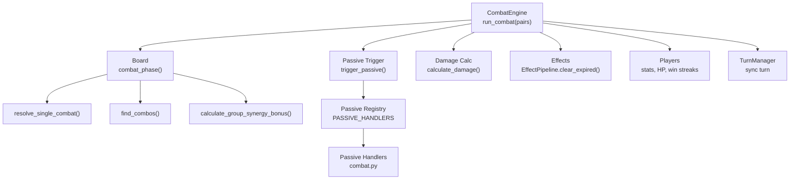
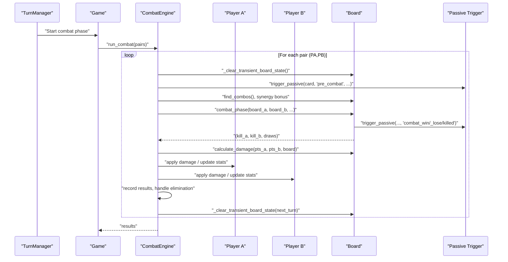
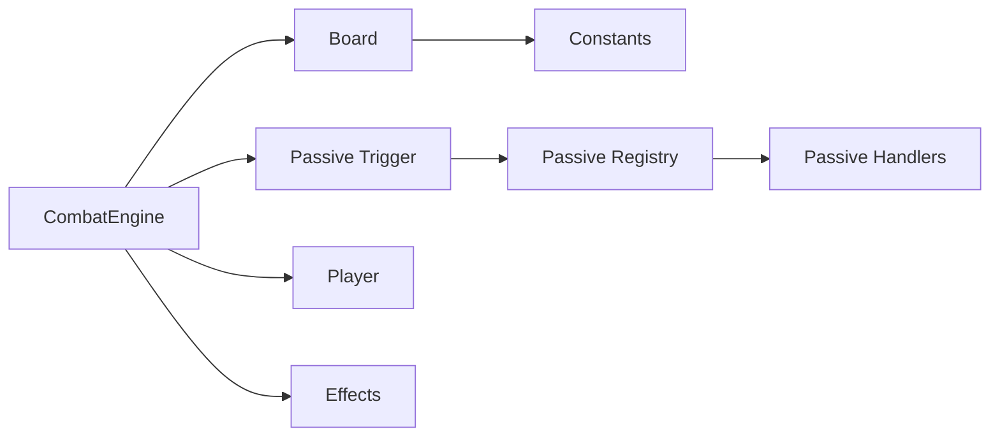
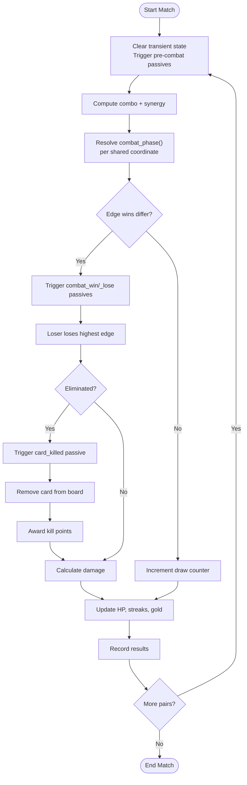

# Combat Resolution

<cite>
**Referenced Files in This Document**
- [combat_engine.py](file://engine_core/combat_engine.py)
- [board.py](file://engine_core/board.py)
- [passive_trigger.py](file://engine_core/passive_trigger.py)
- [effects.py](file://engine_core/effects.py)
- [combat.py](file://engine_core/passives/combat.py)
- [registry.py](file://engine_core/passives/registry.py)
- [base.py](file://engine_core/passives/base.py)
- [constants.py](file://engine_core/constants.py)
- [game.py](file://engine_core/game.py)
- [turn_manager.py](file://engine_core/turn_manager.py)
- [player.py](file://engine_core/player.py)
- [card.py](file://engine_core/card.py)
- [autochess_sim_v06.py](file://engine_core/autochess_sim_v06.py)
</cite>

## Table of Contents
1. [Introduction](#introduction)
2. [Project Structure](#project-structure)
3. [Core Components](#core-components)
4. [Architecture Overview](#architecture-overview)
5. [Detailed Component Analysis](#detailed-component-analysis)
6. [Dependency Analysis](#dependency-analysis)
7. [Performance Considerations](#performance-considerations)
8. [Troubleshooting Guide](#troubleshooting-guide)
9. [Conclusion](#conclusion)
10. [Appendices](#appendices)

## Introduction
This document explains the combat resolution system of the AutoChess Hybrid game engine. It covers the CombatEngine architecture, turn-based combat mechanics, scoring and damage computation, synergy and combo bonuses, passive ability triggers during combat, effect duration management, and how outcomes relate to player elimination. It also provides examples, balancing notes, fairness mechanisms, edge-case handling, troubleshooting guidance, and performance optimization recommendations.

## Project Structure
The combat system spans several core modules:
- CombatEngine orchestrates match pairings, pre/post combat triggers, scoring, and damage application.
- Board implements hex-grid placement, combat resolution per coordinate, combo detection, synergy clustering, and damage calculation.
- Passive trigger system manages passive activation, logging, and handler dispatch.
- Effects define stat-modifying effects with durations and stacking semantics.
- Passives modules register and implement combat-related passive behaviors.
- Game and TurnManager coordinate phases and state synchronization.



**Diagram sources**
- [combat_engine.py:106-271](file://engine_core/combat_engine.py#L106-L271)
- [board.py:393-448](file://engine_core/board.py#L393-L448)
- [passive_trigger.py:21-95](file://engine_core/passive_trigger.py#L21-L95)
- [effects.py:29-97](file://engine_core/effects.py#L29-L97)
- [combat.py:1-226](file://engine_core/passives/combat.py#L1-L226)
- [registry.py:13-18](file://engine_core/passives/registry.py#L13-L18)

**Section sources**
- [combat_engine.py:106-271](file://engine_core/combat_engine.py#L106-L271)
- [board.py:393-448](file://engine_core/board.py#L393-L448)
- [passive_trigger.py:21-95](file://engine_core/passive_trigger.py#L21-L95)
- [effects.py:29-97](file://engine_core/effects.py#L29-L97)
- [combat.py:1-226](file://engine_core/passives/combat.py#L1-L226)
- [registry.py:13-18](file://engine_core/passives/registry.py#L13-L18)

## Core Components
- CombatEngine: Executes all matches for a turn, manages transient board state, triggers pre-combat passives, computes scores, applies damage, updates stats, and handles player elimination.
- Board: Implements combat per overlapping coordinate, combo detection, synergy clustering, and damage calculation.
- Passive Trigger: Dispatches passive handlers by card name/type, logs triggers, and returns bonus combat points where applicable.
- Effects: Provides effect dataclass, priority ordering, stacking semantics, and expiration logic.
- Passives Registry: Auto-registers handlers via decorators and exposes PASSIVE_HANDLERS.
- Constants: Defines scoring thresholds and group advantage mapping used across combat.

Key responsibilities:
- Pairing and turn orchestration are coordinated by higher-level systems (see Game and TurnManager).
- CombatEngine consumes pairings and delegates to Board for per-coordinate combat and to Passive Trigger for combat-phase activations.

**Section sources**
- [combat_engine.py:22-271](file://engine_core/combat_engine.py#L22-L271)
- [board.py:54-448](file://engine_core/board.py#L54-L448)
- [passive_trigger.py:21-138](file://engine_core/passive_trigger.py#L21-L138)
- [effects.py:18-97](file://engine_core/effects.py#L18-L97)
- [registry.py:13-18](file://engine_core/passives/registry.py#L13-L18)
- [constants.py](file://engine_core/constants.py)

## Architecture Overview
The combat pipeline proceeds as follows:
1. Pair opponents by turn logic (external to CombatEngine).
2. For each pair:
   - Clear transient board state and meta.
   - Trigger pre-combat passives for all board cards.
   - Compute combo points and synergy bonus.
   - Resolve combat at overlapping coordinates via combat_phase().
   - Sum scores (kill points + combo + synergy).
   - Calculate damage based on score difference and apply to losing side.
   - Update stats, HP, win streaks, and gold on draws.
   - Record results and handle player elimination (return cards to pool).
   - Clear transient state for next turn.



**Diagram sources**
- [combat_engine.py:106-271](file://engine_core/combat_engine.py#L106-L271)
- [board.py:393-448](file://engine_core/board.py#L393-L448)
- [passive_trigger.py:21-95](file://engine_core/passive_trigger.py#L21-L95)

## Detailed Component Analysis

### CombatEngine
Responsibilities:
- Accepts a list of (player_a, player_b) pairs.
- Synchronizes turn with TurnManager via Game.
- Clears transient board state and meta before and after combat.
- Triggers pre-combat passives for both sides.
- Computes combo points and synergy bonus.
- Delegates to combat_phase() for per-coordinate combat resolution.
- Aggregates scores, calculates damage, updates stats, and records outcomes.
- Handles player elimination by returning all cards to the shared pool.

Notable behaviors:
- Transient state clearing ensures effects and combat meta are reset between turns.
- Eliminated players’ cards are returned to the market pool with safeguards (e.g., copy caps).
- Win streaks and max streaks are tracked per player.
- Draws grant gold and reset win streaks.

**Section sources**
- [combat_engine.py:22-271](file://engine_core/combat_engine.py#L22-L271)

### Board and Combat Phase
Core functions:
- resolve_single_combat(card_a, card_b, bonus_a, bonus_b): Compares rotated edges across six directions, applies group advantage, and returns edge win tallies.
- combat_phase(board_a, board_b, ...): Iterates shared coordinates, resolves each, triggers combat-phase passives, reduces edges, removes eliminated cards, and awards kill points.
- find_combos(board): Counts neighbor pairs with matching groups and distributes small combat bonuses.
- calculate_group_synergy_bonus(board): Computes clustered synergy with tiered and connection bonuses.
- calculate_damage(winner_pts, loser_pts, board, turn): Computes damage with turn scaling and early-game hard cap.

Group advantage mapping and constants are defined centrally and used by Board.

**Section sources**
- [board.py:142-186](file://engine_core/board.py#L142-L186)
- [board.py:393-448](file://engine_core/board.py#L393-L448)
- [board.py:305-337](file://engine_core/board.py#L305-L337)
- [board.py:196-248](file://engine_core/board.py#L196-L248)
- [board.py:350-386](file://engine_core/board.py#L350-L386)
- [constants.py](file://engine_core/constants.py)

### Passive Trigger System
- trigger_passive(card, trigger, owner, opponent, ctx, verbose): Looks up handler by card name, executes implementation, logs impactful triggers, and returns bonus combat points if any.
- _trigger_passive_impl(card, trigger, owner, opponent, ctx): Dispatches to registered handler or default behavior for certain passive types.
- PASSIVE_HANDLERS registry auto-populated by importing handler modules.

Logging:
- Tracks per-player passive buff log and per-game passive trigger log.
- Strategy logger hook captures passive events for analysis.

**Section sources**
- [passive_trigger.py:21-138](file://engine_core/passive_trigger.py#L21-L138)
- [registry.py:13-18](file://engine_core/passives/registry.py#L13-L18)
- [base.py:17-44](file://engine_core/passives/base.py#L17-L44)

### Combat Passives
Handlers in combat.py implement win/lose/killed triggers:
- Ragnarok, World War II, Loki, Cubism, Komodo Dragon: Reduce enemy edges/statistics on win.
- Narwhal, Sirius: Gain Power or Speed with per-turn and total limits.
- Pulsar: Grant combat points once per turn.
- Cerberus: Award points every three wins.
- Fibonacci Sequence: Grant points based on win streak.
- Guernica: Grant combat points on loss (per turn cap).
- Minotaur, Code of Hammurabi, Frida Kahlo: Buff on loss with caps and conditions.
- Anubis: Gain Secret when any card is killed.

These handlers are registered automatically and invoked during combat_phase().

**Section sources**
- [combat.py:1-226](file://engine_core/passives/combat.py#L1-L226)
- [registry.py:13-18](file://engine_core/passives/registry.py#L13-L18)

### Effects and Duration Management
- Effect dataclass defines source, stat, delta, duration, applied turn, priority, and stacking policy.
- EffectPipeline validates inputs, enforces stacking rules, sorts by priority and sequencing, and computes effective stats.
- clear_expired(current_turn) prunes expired effects.

CombatEngine clears expired effects and combat-scoped meta before and after each match to prevent carryover.

**Section sources**
- [effects.py:18-97](file://engine_core/effects.py#L18-L97)
- [combat_engine.py:60-71](file://engine_core/combat_engine.py#L60-L71)

### Turn-Based Resolution and Outcome Determination
- Turn synchronization: CombatEngine reads turn from Game; TurnManager coordinates phase transitions.
- Outcome logic:
  - If one side wins: damage computed and applied; stats updated; win streaks incremented.
  - If draw: both players gain gold and draw counters increment.
  - Elimination: dead player’s board and hand cards are returned to the shared pool with copy caps.

**Section sources**
- [combat_engine.py:42-44](file://engine_core/combat_engine.py#L42-L44)
- [combat_engine.py:200-237](file://engine_core/combat_engine.py#L200-L237)
- [combat_engine.py:259-268](file://engine_core/combat_engine.py#L259-L268)

### Example Scenarios and Calculations

Scenario A: Balanced edge wins
- Two cards face off with equal edge strengths; group advantage evens out.
- Expected outcome: draw at shared coordinate; draws increment counters; no damage.

Scenario B: Stronger board with synergy
- Player A has a 4-card MIND cluster and strong edges; Player B has fewer cards.
- Synergy bonus adds significant points; combat_phase() resolves overlapping coordinates.
- Winner receives combat points from kills and passives; loser loses edges; damage applied if score gap exists.

Scenario C: Early game hard cap
- Low score gap but high early-game turn; damage capped to protect against snowball.
- Turn multiplier increases gradually; final damage respects cap for turns 1–10.

Note: Specific numerical examples are intentionally omitted; see the referenced code paths for exact formulas and logic.

**Section sources**
- [board.py:393-448](file://engine_core/board.py#L393-L448)
- [board.py:350-386](file://engine_core/board.py#L350-L386)
- [combat_engine.py:200-237](file://engine_core/combat_engine.py#L200-L237)

### Passive Trigger Sequences During Combat
Typical sequence at a shared coordinate:
1. resolve_single_combat determines edge winners.
2. If A wins: trigger_passive(card_a, "combat_win"), trigger_passive(card_b, "combat_lose").
3. A loses highest edge; if eliminated, trigger_passive(card_b, "card_killed") and award kill points.
4. Symmetric steps for B winning.

**Section sources**
- [board.py:423-447](file://engine_core/board.py#L423-L447)
- [passive_trigger.py:21-95](file://engine_core/passive_trigger.py#L21-L95)

## Dependency Analysis
High-level dependencies:
- CombatEngine depends on Board for scoring and damage, Passive Trigger for combat-phase activations, and Player for stats and HP.
- Board depends on constants for group advantage and scoring thresholds.
- Passive Trigger depends on PASSIVE_HANDLERS registry populated by passives modules.
- Effects underpin stat modifications and are cleared by CombatEngine.



**Diagram sources**
- [combat_engine.py:106-271](file://engine_core/combat_engine.py#L106-L271)
- [board.py:393-448](file://engine_core/board.py#L393-L448)
- [passive_trigger.py:21-95](file://engine_core/passive_trigger.py#L21-L95)
- [registry.py:13-18](file://engine_core/passives/registry.py#L13-L18)
- [effects.py:29-97](file://engine_core/effects.py#L29-L97)

**Section sources**
- [combat_engine.py:106-271](file://engine_core/combat_engine.py#L106-L271)
- [board.py:393-448](file://engine_core/board.py#L393-L448)
- [passive_trigger.py:21-95](file://engine_core/passive_trigger.py#L21-L95)
- [registry.py:13-18](file://engine_core/passives/registry.py#L13-L18)
- [effects.py:29-97](file://engine_core/effects.py#L29-L97)

## Performance Considerations
- Complexity:
  - resolve_single_combat iterates six edges per pair; overall combat_phase is O(C) where C is shared coordinates.
  - find_combos scans neighbors and counts pairs; dominated by number of placed cards.
  - calculate_group_synergy_bonus uses BFS per group; worst-case O(N^2) for dense boards but typically efficient due to local connectivity.
- Optimization opportunities:
  - Memoize combo and synergy computations if boards are reused across frames.
  - Batch passive trigger calls and minimize repeated lookups in hot loops.
  - Avoid redundant effect sorting by grouping by priority and applying deltas incrementally.
  - Short-circuit early when boards are sparse to reduce iteration overhead.
- Fairness and balance:
  - Turn-based damage scaling and early-game hard cap prevent snowball effects.
  - 30% power cap concept (refer to analysis documents) constrains synergy dominance.

[No sources needed since this section provides general guidance]

## Troubleshooting Guide
Common issues and checks:
- No combat results recorded:
  - Verify run_combat receives non-empty pairs and that combat_phase returns values.
  - Confirm last_combat_results append logic in CombatEngine.
- Passive not triggering:
  - Ensure card name matches registry keys (case normalization occurs in trigger_passive).
  - Check PASSIVE_HANDLERS population by importing handler modules.
- Stale effects or meta bleeding:
  - Confirm _clear_transient_board_state is called before and after combat.
  - Verify EffectPipeline.clear_expired is invoked with correct turn.
- Player elimination anomalies:
  - Inspect _return_cards_to_pool logic for copy caps and Evolved card handling.
- Turn synchronization errors:
  - Ensure Game sets CombatEngine.turn before run_combat and TurnManager advances turn consistently.

**Section sources**
- [combat_engine.py:106-271](file://engine_core/combat_engine.py#L106-L271)
- [passive_trigger.py:21-95](file://engine_core/passive_trigger.py#L21-L95)
- [effects.py:91-97](file://engine_core/effects.py#L91-L97)

## Conclusion
The combat system integrates a robust scoring model (kill points, combos, synergy), deterministic per-coordinate resolution with group advantage, and a flexible passive-trigger framework. Transient state and effect management ensure fairness and prevent carryover. The modular design enables easy extension of passive behaviors and fine-tuning of balance parameters.

[No sources needed since this section summarizes without analyzing specific files]

## Appendices

### A. Combat Calculation Flowchart


**Diagram sources**
- [combat_engine.py:106-271](file://engine_core/combat_engine.py#L106-L271)
- [board.py:393-448](file://engine_core/board.py#L393-L448)

### B. Passive Handler Registration
```mermaid
graph LR
REG["passives/registry.py"] --> |imports| CM["passives/combat.py"]
REG --> |imports| ECO["passives/economy.py"]
REG --> |imports| SURV["passives/survival.py"]
REG --> |imports| SY["passives/synergy.py"]
REG --> |imports| CB["passives/copy_handlers.py"]
CM --> |@passive decorator| REG
ECO --> |...| REG
SUR --> |...| REG
SY --> |...| REG
CB --> |...| REG
```

**Diagram sources**
- [registry.py:13-18](file://engine_core/passives/registry.py#L13-L18)
- [combat.py:1-226](file://engine_core/passives/combat.py#L1-L226)