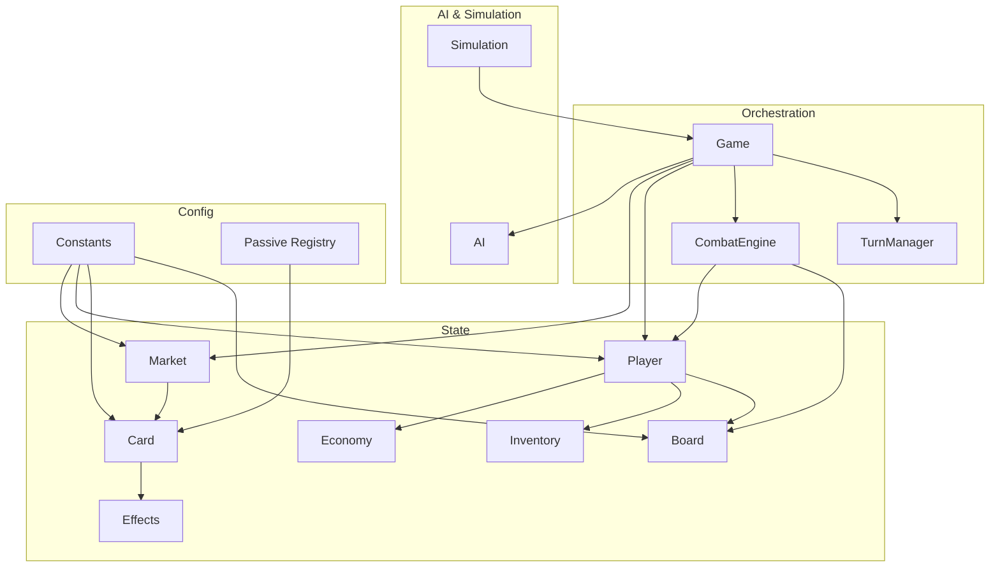
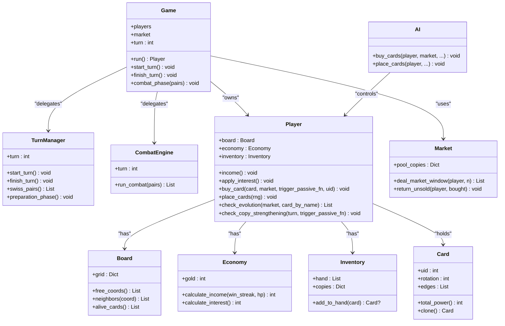
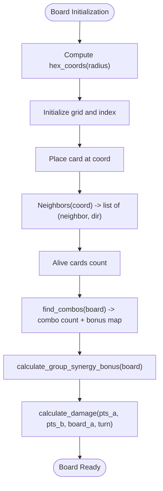
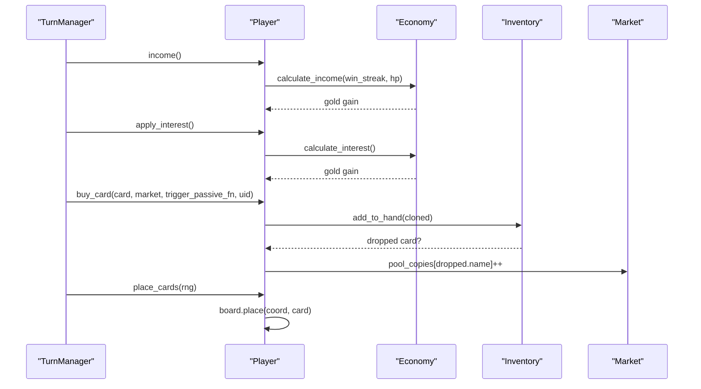
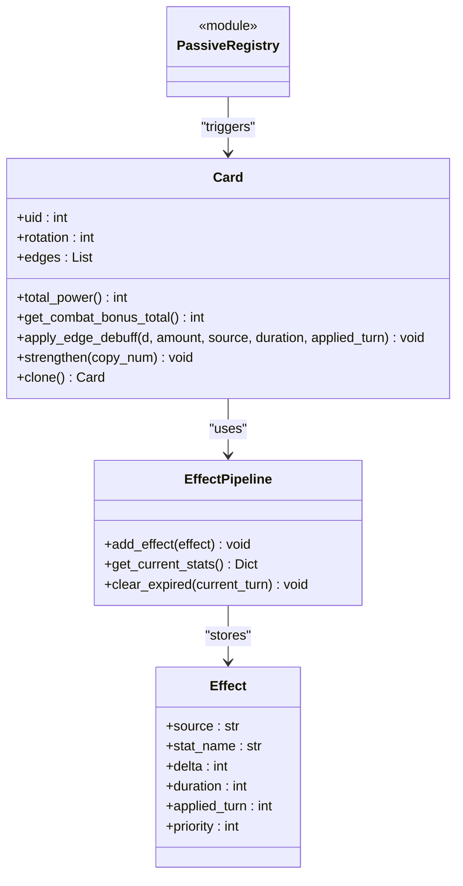
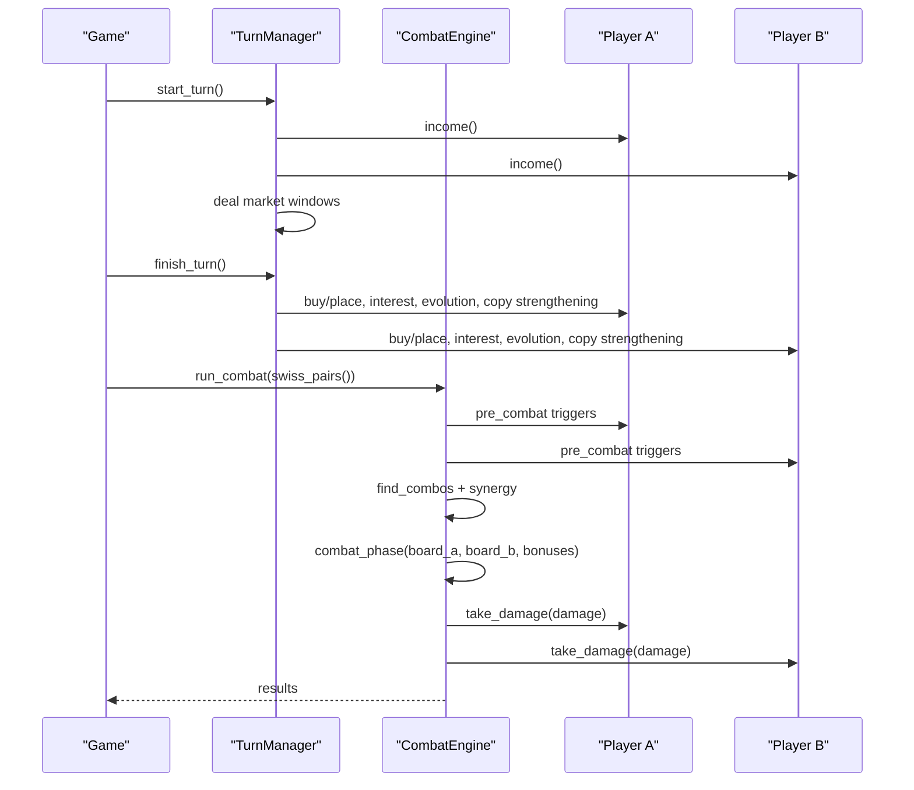
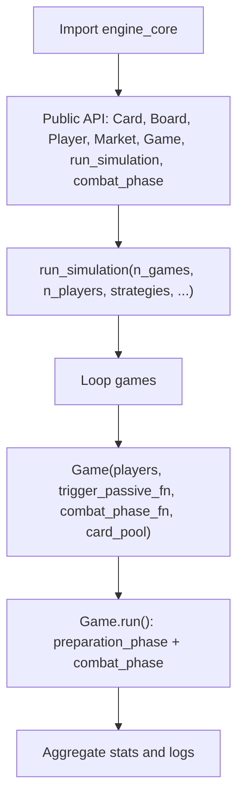
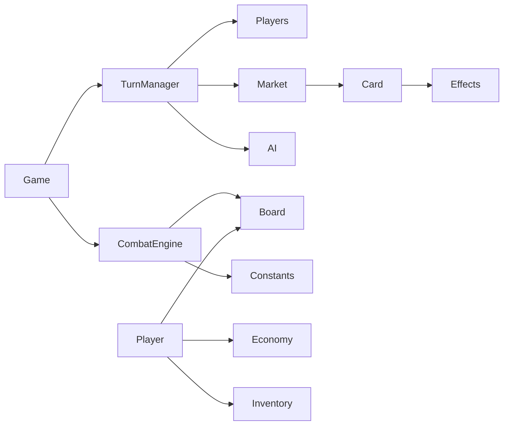

# Core Game Engine

<cite>
**Referenced Files in This Document**
- [engine_core/__init__.py](file://engine_core/__init__.py)
- [engine_core/game.py](file://engine_core/game.py)
- [engine_core/board.py](file://engine_core/board.py)
- [engine_core/player.py](file://engine_core/player.py)
- [engine_core/card.py](file://engine_core/card.py)
- [engine_core/economy.py](file://engine_core/economy.py)
- [engine_core/market.py](file://engine_core/market.py)
- [engine_core/combat_engine.py](file://engine_core/combat_engine.py)
- [engine_core/turn_manager.py](file://engine_core/turn_manager.py)
- [engine_core/constants.py](file://engine_core/constants.py)
- [engine_core/effects.py](file://engine_core/effects.py)
- [engine_core/simulation.py](file://engine_core/simulation.py)
- [engine_core/ai.py](file://engine_core/ai.py)
- [engine_core/passives/registry.py](file://engine_core/passives/registry.py)
</cite>

## Table of Contents
1. [Introduction](#introduction)
2. [Project Structure](#project-structure)
3. [Core Components](#core-components)
4. [Architecture Overview](#architecture-overview)
5. [Detailed Component Analysis](#detailed-component-analysis)
6. [Dependency Analysis](#dependency-analysis)
7. [Performance Considerations](#performance-considerations)
8. [Troubleshooting Guide](#troubleshooting-guide)
9. [Conclusion](#conclusion)
10. [Appendices](#appendices)

## Introduction
This document describes the Autochess Hybrid core game engine, focusing on the hex-grid board system, player management, card economy, and combat resolution. It explains how the engine orchestrates turns, resolves state transitions, and exposes public interfaces for initialization, player actions, and simulation control. The content balances conceptual explanations for newcomers and technical details for implementers extending the engine with new features, strategies, or passive abilities.

## Project Structure
The core engine resides under engine_core/, organized by responsibility:
- Orchestration: game.py, turn_manager.py, combat_engine.py
- State: board.py, player.py, card.py, economy.py, market.py, inventory.py, effects.py
- Simulation and AI: simulation.py, ai.py
- Constants and passives: constants.py, passives/registry.py

**Diagram sources**
- [engine_core/game.py:35-224](file://engine_core/game.py#L35-L224)
- [engine_core/turn_manager.py:29-285](file://engine_core/turn_manager.py#L29-L285)
- [engine_core/combat_engine.py:22-271](file://engine_core/combat_engine.py#L22-L271)
- [engine_core/player.py:22-250](file://engine_core/player.py#L22-L250)
- [engine_core/board.py:54-106](file://engine_core/board.py#L54-L106)
- [engine_core/card.py:48-316](file://engine_core/card.py#L48-L316)
- [engine_core/economy.py:3-30](file://engine_core/economy.py#L3-L30)
- [engine_core/market.py:49-174](file://engine_core/market.py#L49-L174)
- [engine_core/inventory.py:5-33](file://engine_core/inventory.py#L5-L33)
- [engine_core/effects.py:29-97](file://engine_core/effects.py#L29-L97)
- [engine_core/ai.py:214-800](file://engine_core/ai.py#L214-L800)
- [engine_core/simulation.py:113-284](file://engine_core/simulation.py#L113-L284)
- [engine_core/constants.py:1-145](file://engine_core/constants.py#L1-L145)
- [engine_core/passives/registry.py:12-18](file://engine_core/passives/registry.py#L12-L18)

**Section sources**
- [engine_core/__init__.py:1-46](file://engine_core/__init__.py#L1-L46)
- [engine_core/constants.py:65-145](file://engine_core/constants.py#L65-L145)

## Core Components
- Hex-grid board: Board manages axial hex coordinates, neighbor queries, placement/removal, and board-wide bonuses.
- Player: Manages economy, inventory, progression, and board state; integrates AI decisions for automated play.
- Card: Defines stats, edges, rotations, passive metadata, and effect pipeline for buffs/debuffs.
- Market: Shared pool and per-player windows with weighted rarity sampling and return mechanics.
- Economy: Income calculation, interest accumulation, and gold flow.
- TurnManager: Orchestrates turn lifecycle (start/finish/preparation), Swiss pairing, and transient state cleanup.
- CombatEngine: Resolves pairwise combat across overlapping hexes, synergy/combo scoring, and damage application.
- Simulation: Runs many games, aggregates statistics, and logs outcomes.
- AI: Strategy implementations for buying and placing cards, parameterized via JSON.

**Section sources**
- [engine_core/board.py:54-106](file://engine_core/board.py#L54-L106)
- [engine_core/player.py:22-250](file://engine_core/player.py#L22-L250)
- [engine_core/card.py:48-316](file://engine_core/card.py#L48-L316)
- [engine_core/market.py:49-174](file://engine_core/market.py#L49-L174)
- [engine_core/economy.py:3-30](file://engine_core/economy.py#L3-L30)
- [engine_core/turn_manager.py:29-285](file://engine_core/turn_manager.py#L29-L285)
- [engine_core/combat_engine.py:22-271](file://engine_core/combat_engine.py#L22-L271)
- [engine_core/simulation.py:113-284](file://engine_core/simulation.py#L113-L284)
- [engine_core/ai.py:214-800](file://engine_core/ai.py#L214-L800)

## Architecture Overview
The engine separates orchestration from domain logic:
- Game delegates turn lifecycle to TurnManager and combat to CombatEngine.
- Player composes Economy, Inventory, Progression, and Board.
- Card encapsulates stats and effects; Market and constants govern economy and board geometry.
- Simulation and AI integrate with the core through injected dependencies.

**Diagram sources**
- [engine_core/game.py:35-224](file://engine_core/game.py#L35-L224)
- [engine_core/turn_manager.py:29-285](file://engine_core/turn_manager.py#L29-L285)
- [engine_core/combat_engine.py:22-271](file://engine_core/combat_engine.py#L22-L271)
- [engine_core/player.py:22-250](file://engine_core/player.py#L22-L250)
- [engine_core/board.py:54-106](file://engine_core/board.py#L54-L106)
- [engine_core/market.py:49-174](file://engine_core/market.py#L49-L174)
- [engine_core/economy.py:3-30](file://engine_core/economy.py#L3-L30)
- [engine_core/inventory.py:5-33](file://engine_core/inventory.py#L5-L33)
- [engine_core/card.py:48-316](file://engine_core/card.py#L48-L316)
- [engine_core/ai.py:214-800](file://engine_core/ai.py#L214-L800)

## Detailed Component Analysis

### Hex-grid Board System
- Axial hex coordinates define the board with a fixed radius, enabling neighbor queries and connected-cluster synergy.
- Board supports placement, removal, and neighbor enumeration; provides rarity and combo bonuses.
- Synergy clustering computes connected components per group and scores tiers and internal edge connections.

**Diagram sources**
- [engine_core/board.py:28-47](file://engine_core/board.py#L28-L47)
- [engine_core/board.py:54-106](file://engine_core/board.py#L54-L106)
- [engine_core/board.py:118-121](file://engine_core/board.py#L118-L121)
- [engine_core/board.py:305-337](file://engine_core/board.py#L305-L337)
- [engine_core/board.py:196-248](file://engine_core/board.py#L196-L248)
- [engine_core/board.py:350-386](file://engine_core/board.py#L350-L386)

**Section sources**
- [engine_core/constants.py:65-93](file://engine_core/constants.py#L65-L93)
- [engine_core/board.py:28-106](file://engine_core/board.py#L28-L106)
- [engine_core/board.py:196-386](file://engine_core/board.py#L196-L386)

### Player Management and Economy
- Player composes Economy, Inventory, Board, and Progression.
- Income and interest are computed based on strategy and health; gold caps are configurable.
- Hand overflow returns the oldest card to the Market pool; copies tracking enables copy-strengthening and evolution.

**Diagram sources**
- [engine_core/player.py:112-158](file://engine_core/player.py#L112-L158)
- [engine_core/economy.py:9-20](file://engine_core/economy.py#L9-L20)
- [engine_core/player.py:124-145](file://engine_core/player.py#L124-L145)
- [engine_core/inventory.py:12-22](file://engine_core/inventory.py#L12-L22)
- [engine_core/market.py:139-159](file://engine_core/market.py#L139-L159)
- [engine_core/player.py:146-158](file://engine_core/player.py#L146-L158)

**Section sources**
- [engine_core/player.py:22-250](file://engine_core/player.py#L22-L250)
- [engine_core/economy.py:3-30](file://engine_core/economy.py#L3-L30)
- [engine_core/inventory.py:5-33](file://engine_core/inventory.py#L5-L33)
- [engine_core/market.py:49-174](file://engine_core/market.py#L49-L174)

### Card Economy and Passive Abilities
- Cards carry base stats and a metadata pipeline supporting passive-triggered effects.
- Passive handlers are registered centrally; passives can trigger on events like income, market refresh, combat win/lose, and copy strengthening.
- Evolved cards inherit passives and scale toward target power caps per rarity.

**Diagram sources**
- [engine_core/card.py:48-228](file://engine_core/card.py#L48-L228)
- [engine_core/effects.py:18-97](file://engine_core/effects.py#L18-L97)
- [engine_core/passives/registry.py:12-18](file://engine_core/passives/registry.py#L12-L18)

**Section sources**
- [engine_core/card.py:48-316](file://engine_core/card.py#L48-L316)
- [engine_core/effects.py:29-97](file://engine_core/effects.py#L29-L97)
- [engine_core/passives/registry.py:12-18](file://engine_core/passives/registry.py#L12-L18)

### Combat Resolution and Turn Flow Control
- TurnManager orchestrates preparation (income, market) and finish (AI actions, interest, evolution, copy strengthening).
- CombatEngine resolves pairwise boards, computes synergy and combo bonuses, and applies damage with turn-based caps.
- Game.run() alternates preparation and combat phases until a winner emerges.

**Diagram sources**
- [engine_core/game.py:157-224](file://engine_core/game.py#L157-L224)
- [engine_core/turn_manager.py:155-285](file://engine_core/turn_manager.py#L155-L285)
- [engine_core/combat_engine.py:106-271](file://engine_core/combat_engine.py#L106-L271)

**Section sources**
- [engine_core/game.py:35-224](file://engine_core/game.py#L35-L224)
- [engine_core/turn_manager.py:29-285](file://engine_core/turn_manager.py#L29-L285)
- [engine_core/combat_engine.py:22-271](file://engine_core/combat_engine.py#L22-L271)

### Public Interfaces and Simulation Control
- engine_core public API exports Card, Board, Player, Market, Game, run_simulation, combat_phase, and strategy logging facilities.
- Simulation runner initializes players with strategies, runs games, and aggregates statistics.

**Diagram sources**
- [engine_core/__init__.py:1-46](file://engine_core/__init__.py#L1-L46)
- [engine_core/simulation.py:113-218](file://engine_core/simulation.py#L113-L218)

**Section sources**
- [engine_core/__init__.py:1-46](file://engine_core/__init__.py#L1-L46)
- [engine_core/simulation.py:113-284](file://engine_core/simulation.py#L113-L284)

## Dependency Analysis
- Coupling: Game depends on TurnManager and CombatEngine; TurnManager depends on Players, Market, RNG, and AI class; CombatEngine depends on Board and constants.
- Cohesion: Each module encapsulates a single concern (economy, board, combat, AI).
- External dependencies: Randomness via Python’s random; JSON for trained parameters; OS for logging.

**Diagram sources**
- [engine_core/game.py:35-96](file://engine_core/game.py#L35-L96)
- [engine_core/turn_manager.py:36-62](file://engine_core/turn_manager.py#L36-L62)
- [engine_core/combat_engine.py:22-44](file://engine_core/combat_engine.py#L22-L44)
- [engine_core/player.py:22-41](file://engine_core/player.py#L22-L41)
- [engine_core/market.py:49-56](file://engine_core/market.py#L49-L56)
- [engine_core/card.py:48-64](file://engine_core/card.py#L48-L64)

**Section sources**
- [engine_core/game.py:35-96](file://engine_core/game.py#L35-L96)
- [engine_core/turn_manager.py:36-62](file://engine_core/turn_manager.py#L36-L62)
- [engine_core/combat_engine.py:22-44](file://engine_core/combat_engine.py#L22-L44)

## Performance Considerations
- Board operations: neighbor queries and connected-cluster search are O(N) per board; ensure board updates are batched and callbacks are minimal.
- Synergy computation: BFS per group per tile; consider caching or incremental updates if frequently recomputed.
- Market sampling: Weighted sampling without replacement; tune pool sizes and weights to avoid degenerate cases.
- AI placement: Greedy selection over free coordinates; budget placement time to maintain responsiveness.
- Logs and passive triggers: Keep logging off for bulk simulations; enable selectively for debugging.

## Troubleshooting Guide
- Symptom: Players not eliminated after combat.
  - Check damage calculation and HP updates in CombatEngine and Player.take_damage.
  - Verify synergy/combo bonuses and combat phase function injection.
- Symptom: Market window empty or biased.
  - Inspect rarity weights and pool_copies tracking; ensure return_unsold handles edge cases.
- Symptom: AI stalls buying.
  - Review economy phase controls and candidate filtering; confirm gold thresholds and buy counts.
- Symptom: Passives not triggering.
  - Confirm trigger_passive_fn injection and PASSIVE_HANDLERS registration.

**Section sources**
- [engine_core/combat_engine.py:200-238](file://engine_core/combat_engine.py#L200-L238)
- [engine_core/player.py:243-247](file://engine_core/player.py#L243-L247)
- [engine_core/market.py:105-159](file://engine_core/market.py#L105-L159)
- [engine_core/ai.py:235-348](file://engine_core/ai.py#L235-L348)
- [engine_core/passives/registry.py:12-18](file://engine_core/passives/registry.py#L12-L18)

## Conclusion
Autochess Hybrid’s core engine cleanly separates orchestration, state, and domain logic. The hex-grid board, player economy, card effects, and combat resolution form a cohesive system that is modular, testable, and extensible. Developers can add new strategies, passive handlers, and balancing parameters while maintaining predictable state transitions and deterministic turn flow.

## Appendices

### Practical Examples

- Game state transitions
  - Preparation: TurnManager.start_turn() increases turn, distributes income, opens market windows, triggers passive “income” and “market_refresh”.
  - Finish: TurnManager.finish_turn() runs AI buy/place, interest, evolution, copy strengthening, and updates stats.
  - Combat: CombatEngine.run_combat() clears transient state, computes synergy and combo bonuses, resolves combat, applies damage, and returns eliminated player cards to the pool.

- Combat calculations
  - resolve_single_combat compares rotated edges, applies group advantage, distributes hidden combat bonuses, and tallies edge wins.
  - calculate_damage uses absolute point difference, living card count, and board rarity bonus, scaled by turn multiplier and capped early game.

- Economic mechanics
  - Economy.calculate_income considers win streak and HP thresholds; calculate_interest applies a cap and optional multiplier for specific strategies.
  - Market._weighted_sample selects cards by rarity weights; Market.return_unsold ensures fair pool restoration.

**Section sources**
- [engine_core/turn_manager.py:155-285](file://engine_core/turn_manager.py#L155-L285)
- [engine_core/combat_engine.py:106-271](file://engine_core/combat_engine.py#L106-L271)
- [engine_core/board.py:142-186](file://engine_core/board.py#L142-L186)
- [engine_core/board.py:350-386](file://engine_core/board.py#L350-L386)
- [engine_core/economy.py:9-20](file://engine_core/economy.py#L9-L20)
- [engine_core/market.py:71-130](file://engine_core/market.py#L71-L130)