# Game Orchestration

<cite>
**Referenced Files in This Document**
- [game.py](file://engine_core/game.py)
- [turn_manager.py](file://engine_core/turn_manager.py)
- [combat_engine.py](file://engine_core/combat_engine.py)
- [game_factory.py](file://engine_core/game_factory.py)
- [player.py](file://engine_core/player.py)
- [market.py](file://engine_core/market.py)
- [ai.py](file://engine_core/ai.py)
- [simulation.py](file://engine_core/simulation.py)
- [board.py](file://engine_core/board.py)
- [constants.py](file://engine_core/constants.py)
- [passive_trigger.py](file://engine_core/passive_trigger.py)
- [test_engine_bridge_contracts.py](file://tests/test_engine_bridge_contracts.py)
- [test_turn_manager_contract.py](file://tests/test_turn_manager_contract.py)
- [test_engine_turn_flow_smoke.py](file://tests/test_engine_turn_flow_smoke.py)
- [phase_machine.py](file://v2/core/phase_machine.py)
</cite>

## Table of Contents
1. [Introduction](#introduction)
2. [Project Structure](#project-structure)
3. [Core Components](#core-components)
4. [Architecture Overview](#architecture-overview)
5. [Detailed Component Analysis](#detailed-component-analysis)
6. [Dependency Analysis](#dependency-analysis)
7. [Performance Considerations](#performance-considerations)
8. [Troubleshooting Guide](#troubleshooting-guide)
9. [Conclusion](#conclusion)
10. [Appendices](#appendices)

## Introduction
This document explains the game orchestration system that coordinates AutoChess Hybrid matches. It focuses on the Game class as the central coordinator, the turn management pipeline handled by TurnManager, and the combat resolution managed by CombatEngine. It documents initialization, dependency injection, the main game loop, turn-based progression, combat coordination, AI integration, market management, state synchronization, and practical troubleshooting and optimization guidance.

## Project Structure
The orchestration system spans several core modules:
- Game: Central coordinator delegating to TurnManager and CombatEngine
- TurnManager: Isolated turn lifecycle (start/finish/preparation/swiss)
- CombatEngine: Battle resolution and cleanup
- Player, Market, Board, AI, Constants, Passive Trigger: Supporting subsystems
- game_factory: Constructing Game with injected dependencies
- Tests: Contract and integration validations

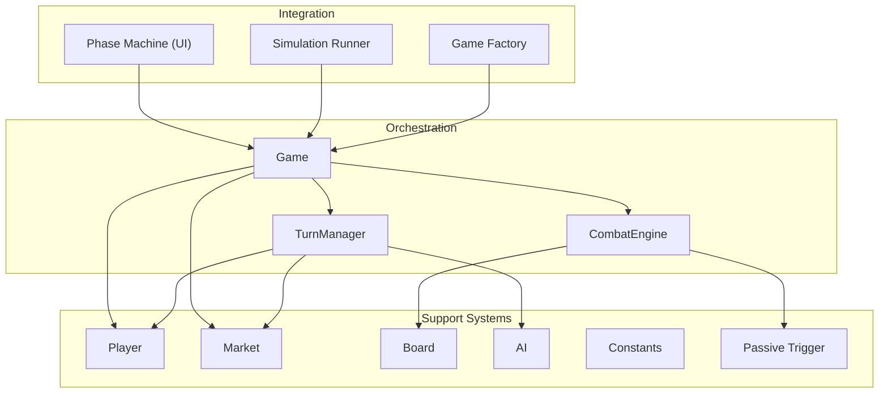

**Diagram sources**
- [game.py:35-224](file://engine_core/game.py#L35-L224)
- [turn_manager.py:29-285](file://engine_core/turn_manager.py#L29-L285)
- [combat_engine.py:22-271](file://engine_core/combat_engine.py#L22-L271)
- [game_factory.py:30-70](file://engine_core/game_factory.py#L30-L70)
- [simulation.py:113-218](file://engine_core/simulation.py#L113-L218)
- [phase_machine.py:3-39](file://v2/core/phase_machine.py#L3-L39)

**Section sources**
- [game.py:35-224](file://engine_core/game.py#L35-L224)
- [turn_manager.py:29-285](file://engine_core/turn_manager.py#L29-L285)
- [combat_engine.py:22-271](file://engine_core/combat_engine.py#L22-L271)
- [game_factory.py:30-70](file://engine_core/game_factory.py#L30-L70)
- [simulation.py:113-218](file://engine_core/simulation.py#L113-L218)
- [phase_machine.py:3-39](file://v2/core/phase_machine.py#L3-L39)

## Core Components
- Game: Initializes TurnManager and CombatEngine, exposes turn control, orchestrates preparation and combat phases, and runs the main loop. It delegates turn lifecycle to TurnManager and combat resolution to CombatEngine.
- TurnManager: Independent turn lifecycle manager. Handles income distribution, market windows, AI actions, interest, evolution, copy strengthening, and Swiss pairing. It is the single source of truth for the turn counter.
- CombatEngine: Resolves pairwise combat for all living players, computes scores, applies damage, updates stats, and cleans transient board state.
- Player, Market, Board, AI, Constants, Passive Trigger: Underpin the subsystems used by Game and TurnManager for economy, placement, combat, and passive mechanics.
- game_factory: Builds a Game with strategies, RNG, card pool, and injected functions.
- Simulation Runner: Executes many games and aggregates statistics.

**Section sources**
- [game.py:35-224](file://engine_core/game.py#L35-L224)
- [turn_manager.py:29-285](file://engine_core/turn_manager.py#L29-L285)
- [combat_engine.py:22-271](file://engine_core/combat_engine.py#L22-L271)
- [game_factory.py:30-70](file://engine_core/game_factory.py#L30-L70)
- [simulation.py:113-218](file://engine_core/simulation.py#L113-L218)

## Architecture Overview
The orchestration follows a strict delegation pattern:
- Game owns turn state and delegates lifecycle to TurnManager
- Game delegates combat to CombatEngine
- TurnManager coordinates Player, Market, and AI
- CombatEngine coordinates Board and Passive Trigger
- game_factory constructs Game with all dependencies
- Simulation Runner invokes Game.run() for batch execution

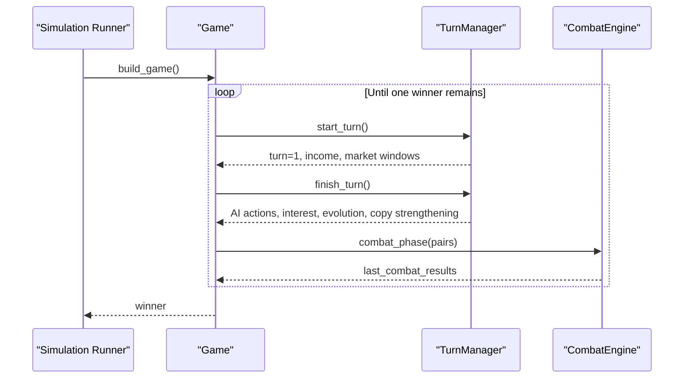

**Diagram sources**
- [simulation.py:168-182](file://engine_core/simulation.py#L168-L182)
- [game.py:157-201](file://engine_core/game.py#L157-L201)
- [turn_manager.py:155-284](file://engine_core/turn_manager.py#L155-L284)
- [combat_engine.py:106-270](file://engine_core/combat_engine.py#L106-L270)

## Detailed Component Analysis

### Game Class
Responsibilities:
- Initialize TurnManager and CombatEngine with injected dependencies
- Expose turn property and lifecycle methods (start_turn, finish_turn, preparation_phase)
- Compute Swiss pairing and delegate combat resolution
- Run the main loop until a single survivor remains
- Maintain last_combat_results and passive trigger logs

Key behaviors:
- Turn synchronization: game.turn is a property alias to TurnManager.turn
- Delegation: start_turn/finish/preparation_phase/swiss_pairs delegated to TurnManager
- Combat: sets CombatEngine.turn and runs run_combat with TurnManager.swiss_pairs()

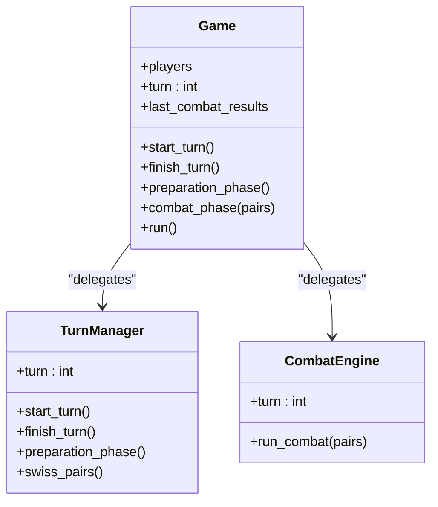

**Diagram sources**
- [game.py:35-224](file://engine_core/game.py#L35-L224)
- [turn_manager.py:29-285](file://engine_core/turn_manager.py#L29-L285)
- [combat_engine.py:22-271](file://engine_core/combat_engine.py#L22-L271)

**Section sources**
- [game.py:35-224](file://engine_core/game.py#L35-L224)
- [test_engine_bridge_contracts.py:115-347](file://tests/test_engine_bridge_contracts.py#L115-L347)

### TurnManager
Responsibilities:
- Manage turn lifecycle: increment turn, distribute income, open market windows
- Execute AI actions for non-human players (buy cards, place cards)
- Apply interest, handle evolution, copy strengthening, and statistics
- Provide Swiss pairing for live players
- Clear transient board state before and after combat

Turn flow:
- start_turn(): increment turn, clear transient state, open market windows, distribute income and passive triggers
- finish_turn(): AI buy/place, return unsold, apply interest, evolution, copy strengthening, update stats
- preparation_phase(): start_turn() + finish_turn() for AI-only simulation
- swiss_pairs(): create live-player pairs

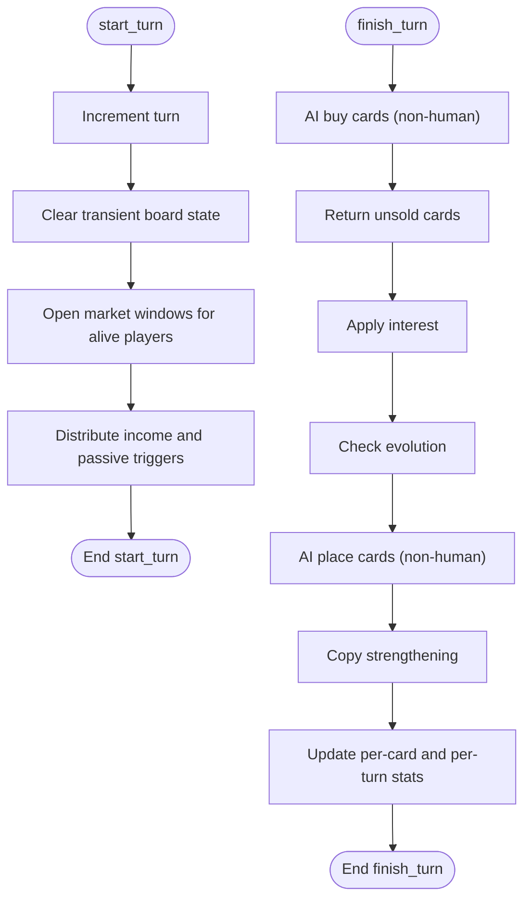

**Diagram sources**
- [turn_manager.py:155-284](file://engine_core/turn_manager.py#L155-L284)

**Section sources**
- [turn_manager.py:29-285](file://engine_core/turn_manager.py#L29-L285)
- [test_turn_manager_contract.py:123-361](file://tests/test_turn_manager_contract.py#L123-L361)

### CombatEngine
Responsibilities:
- Resolve pairwise combat for all living player pairs
- Compute combo and synergy bonuses, invoke combat phase function if provided
- Apply damage, update stats, and manage elimination
- Return eliminated player cards to the market pool
- Clear transient board state around combat

Combat flow:
- For each pair: pre-combat passive triggers, compute bonuses, resolve combat via injected function or default, update scores and stats, apply damage, record results, return eliminated player cards, clear post-combat state

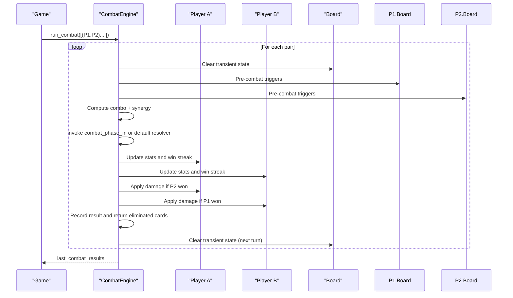

**Diagram sources**
- [combat_engine.py:106-270](file://engine_core/combat_engine.py#L106-L270)
- [board.py:142-185](file://engine_core/board.py#L142-L185)

**Section sources**
- [combat_engine.py:22-271](file://engine_core/combat_engine.py#L22-L271)
- [board.py:142-185](file://engine_core/board.py#L142-L185)

### Initialization, Player Setup, and Dependency Injection
- game_factory builds a Game with strategies, RNG, card pool, and injected functions (trigger_passive_fn, combat_phase_fn)
- Game constructor injects TurnManager and CombatEngine with references to players, market, RNG, and callbacks
- Player instances are created with strategy and composed components (Economy, Inventory, Progression, Board)
- Market maintains shared pool and per-player windows; Market windows are opened during start_turn

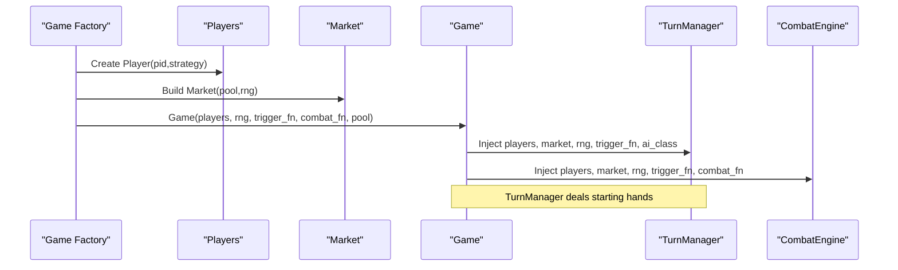

**Diagram sources**
- [game_factory.py:30-70](file://engine_core/game_factory.py#L30-L70)
- [game.py:73-96](file://engine_core/game.py#L73-L96)
- [turn_manager.py:115-128](file://engine_core/turn_manager.py#L115-L128)
- [market.py:105-130](file://engine_core/market.py#L105-L130)

**Section sources**
- [game_factory.py:30-70](file://engine_core/game_factory.py#L30-L70)
- [game.py:36-96](file://engine_core/game.py#L36-L96)
- [player.py:22-51](file://engine_core/player.py#L22-L51)
- [market.py:49-130](file://engine_core/market.py#L49-L130)

### Main Game Loop, Turn-Based Progression, and Combat Coordination
- Main loop: repeat preparation_phase() followed by combat_phase() until one player remains or turn limit reached
- Turn synchronization: game.turn equals TurnManager.turn at all times
- Pairing: Swiss pairing computed by TurnManager; optional override passed to combat_phase to prevent Bait-and-Switch bugs
- Elimination: eliminated players’ cards returned to pool; alive filter shrinks accordingly

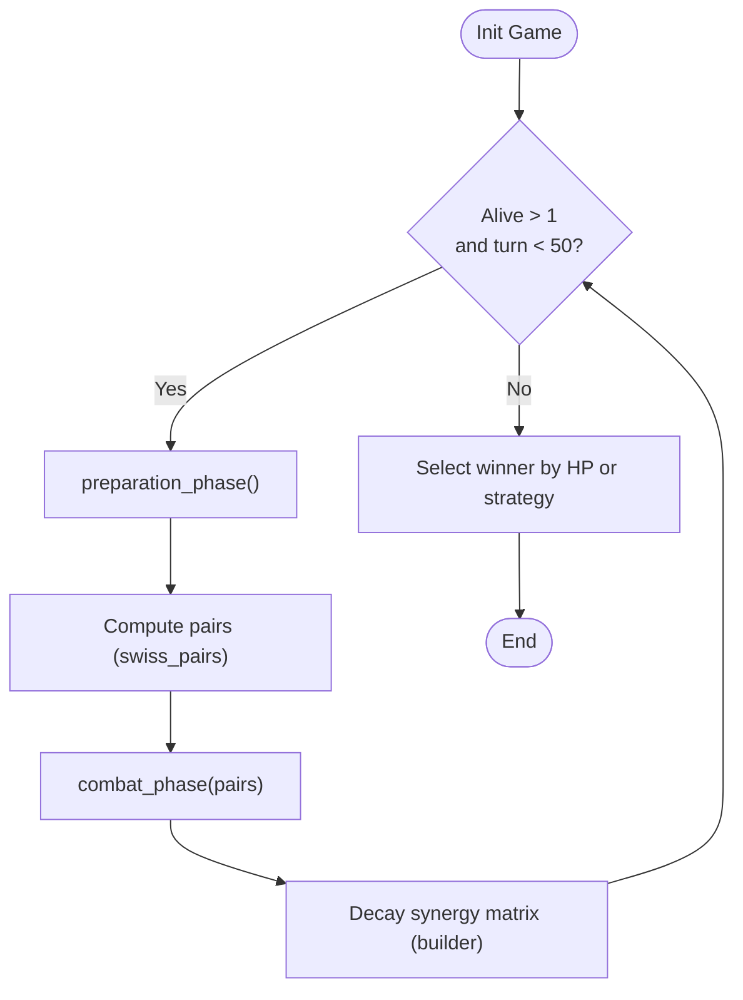

**Diagram sources**
- [game.py:203-224](file://engine_core/game.py#L203-L224)
- [turn_manager.py:132-149](file://engine_core/turn_manager.py#L132-L149)
- [combat_engine.py:106-114](file://engine_core/combat_engine.py#L106-L114)

**Section sources**
- [game.py:203-224](file://engine_core/game.py#L203-L224)
- [test_engine_turn_flow_smoke.py:55-114](file://tests/test_engine_turn_flow_smoke.py#L55-L114)

### Relationship Between Game, TurnManager, and CombatEngine
- Game delegates turn lifecycle to TurnManager and combat to CombatEngine
- TurnManager is the single source of truth for turn counter and turn-related state
- CombatEngine reads Game.turn and resolves pairwise battles, returning results to Game

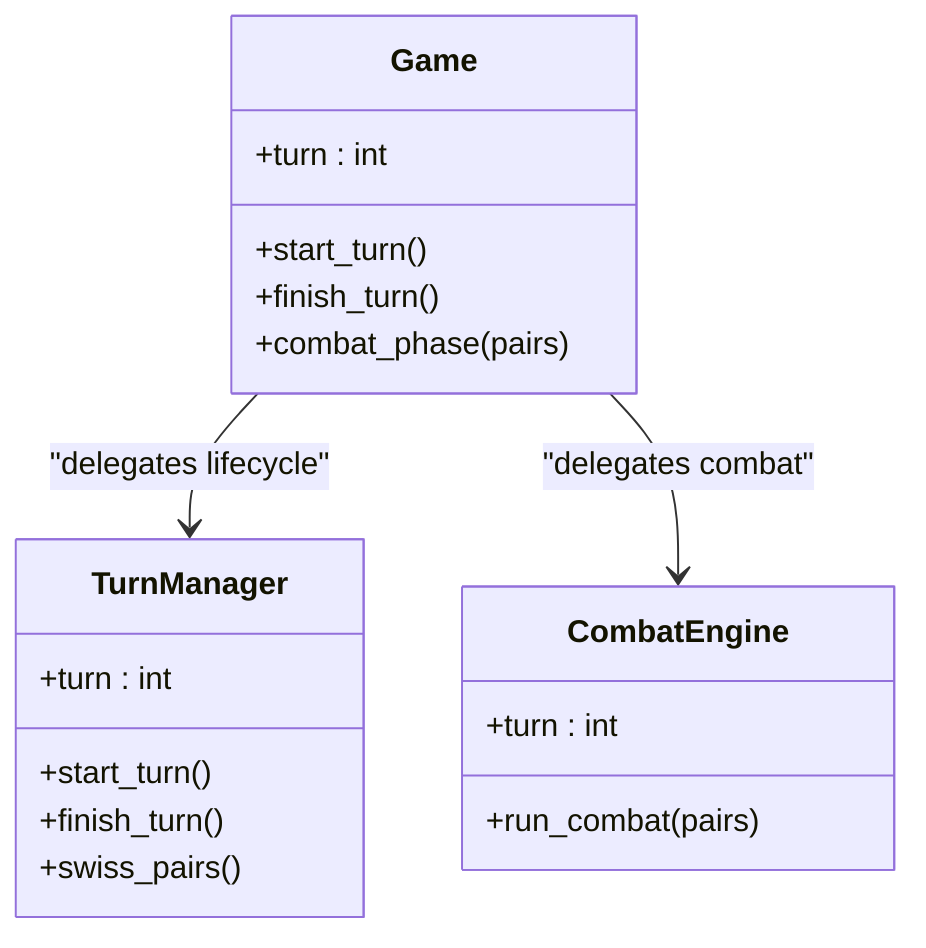

**Diagram sources**
- [game.py:98-108](file://engine_core/game.py#L98-L108)
- [game.py:184-199](file://engine_core/game.py#L184-L199)
- [turn_manager.py:65-65](file://engine_core/turn_manager.py#L65-L65)
- [combat_engine.py:43-43](file://engine_core/combat_engine.py#L43-L43)

**Section sources**
- [game.py:98-108](file://engine_core/game.py#L98-L108)
- [game.py:184-199](file://engine_core/game.py#L184-L199)
- [turn_manager.py:65-65](file://engine_core/turn_manager.py#L65-L65)
- [combat_engine.py:43-43](file://engine_core/combat_engine.py#L43-L43)

### AI Integration and Market Management
- AI strategies: TurnManager.finish_turn() invokes AI.buy_cards() and AI.place_cards() for non-human players
- Market windows: TurnManager.start_turn() opens windows for alive players; Market.refresh_cost() governs shop refresh
- Passive triggers: Both TurnManager and CombatEngine invoke trigger_passive() for system events and combat outcomes
- Constants: Board radius, starting HP, income, interest, and costs are centralized in constants

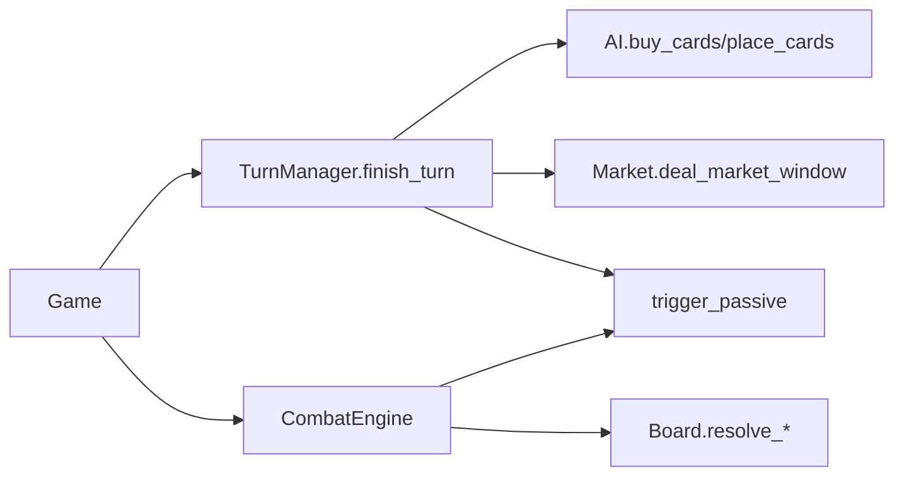

**Diagram sources**
- [turn_manager.py:201-262](file://engine_core/turn_manager.py#L201-L262)
- [market.py:105-130](file://engine_core/market.py#L105-L130)
- [passive_trigger.py:21-95](file://engine_core/passive_trigger.py#L21-L95)
- [board.py:142-185](file://engine_core/board.py#L142-L185)
- [constants.py:93-145](file://engine_core/constants.py#L93-L145)

**Section sources**
- [turn_manager.py:201-262](file://engine_core/turn_manager.py#L201-L262)
- [market.py:105-130](file://engine_core/market.py#L105-L130)
- [passive_trigger.py:21-95](file://engine_core/passive_trigger.py#L21-L95)
- [board.py:142-185](file://engine_core/board.py#L142-L185)
- [constants.py:93-145](file://engine_core/constants.py#L93-L145)

### Examples of State Transitions, Turn Preparation, and End-of-Turn Processing
- Turn preparation: start_turn increments turn, clears transient state, distributes income, opens market windows, triggers passive events
- End-of-turn processing: finish_turn runs AI for bots, returns unsold cards, applies interest, checks evolution, strengthens copies, updates stats
- Pairing: swiss_pairs() produces live-player pairs; optional override prevents mismatches
- Elimination: when a player dies, their board/hand/copies are cleared and cards returned to pool

**Section sources**
- [turn_manager.py:155-284](file://engine_core/turn_manager.py#L155-L284)
- [combat_engine.py:106-270](file://engine_core/combat_engine.py#L106-L270)
- [test_engine_turn_flow_smoke.py:55-96](file://tests/test_engine_turn_flow_smoke.py#L55-L96)

## Dependency Analysis
- Coupling: Game depends on TurnManager and CombatEngine; TurnManager depends on Player, Market, RNG, AI; CombatEngine depends on Board and Passive Trigger
- Cohesion: Each class encapsulates a single responsibility; TurnManager isolates turn lifecycle; CombatEngine isolates combat resolution
- External dependencies: RNG, card pool, passive registry, strategy logger
- Contracts: Tests enforce that Game.turn mirrors TurnManager.turn and that TurnManager can operate independently

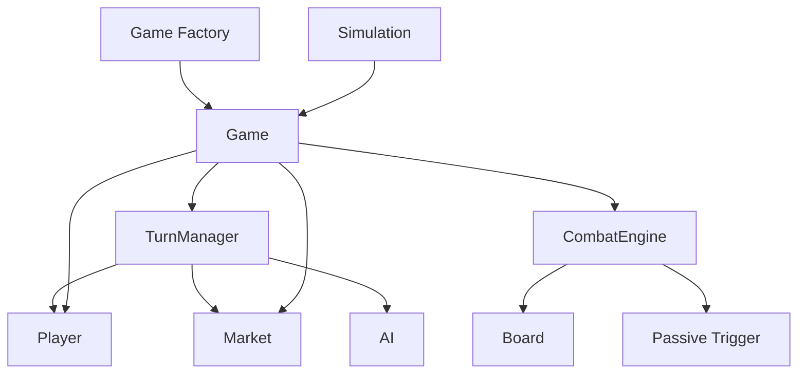

**Diagram sources**
- [game.py:35-224](file://engine_core/game.py#L35-L224)
- [turn_manager.py:29-285](file://engine_core/turn_manager.py#L29-L285)
- [combat_engine.py:22-271](file://engine_core/combat_engine.py#L22-L271)
- [game_factory.py:30-70](file://engine_core/game_factory.py#L30-L70)
- [simulation.py:113-218](file://engine_core/simulation.py#L113-L218)

**Section sources**
- [test_engine_bridge_contracts.py:115-347](file://tests/test_engine_bridge_contracts.py#L115-L347)
- [test_turn_manager_contract.py:76-117](file://tests/test_turn_manager_contract.py#L76-L117)

## Performance Considerations
- Time-bounded AI execution: AI runs synchronously but is bounded; avoid heavy computations per turn
- Batch operations: Use TurnManager.preparation_phase() for AI-only simulations to minimize UI overhead
- State clearing: CombatEngine and TurnManager clear transient board state to reduce memory pressure
- Market sampling: Weighted sampling in Market is efficient; ensure card pool sizes remain reasonable
- Logs and passive triggers: Keep verbose logging off in production simulations to reduce I/O overhead

## Troubleshooting Guide
Common orchestration issues and resolutions:
- Turn counter desynchronization: Verify that Game.turn equals TurnManager.turn after each lifecycle step
- Missing AI actions: Ensure TurnManager.finish_turn() is called after start_turn() for non-human players
- Shop window not refreshing: Confirm shop_locked flag is respected and windows are reopened when unlocked
- Elimination anomalies: After combat, verify eliminated player’s board/hand/copies are cleared and cards returned to pool
- Infinite loop protection: Game.run() terminates at turn 50; confirm this guard is not masking deeper issues

Validation references:
- Turn synchronization contract tests
- Turn lifecycle contract tests
- Smoke tests for elimination and pair counts

**Section sources**
- [test_engine_bridge_contracts.py:307-347](file://tests/test_engine_bridge_contracts.py#L307-L347)
- [test_turn_manager_contract.py:123-361](file://tests/test_turn_manager_contract.py#L123-L361)
- [test_engine_turn_flow_smoke.py:55-114](file://tests/test_engine_turn_flow_smoke.py#L55-L114)

## Conclusion
The orchestration system cleanly separates concerns: Game coordinates, TurnManager manages turn lifecycle, and CombatEngine resolves battles. Dependency injection enables flexible testing and simulation. Contracts and tests ensure turn synchronization and lifecycle correctness. With proper AI bounding, state clearing, and logging controls, the system scales to batch simulations and interactive UI flows.

## Appendices

### UI Phase Machine Integration
The UI phase machine transitions between PREPARATION, VERSUS, COMBAT, and ENDGAME. It complements the engine’s turn lifecycle by ensuring UI state aligns with Game progress.

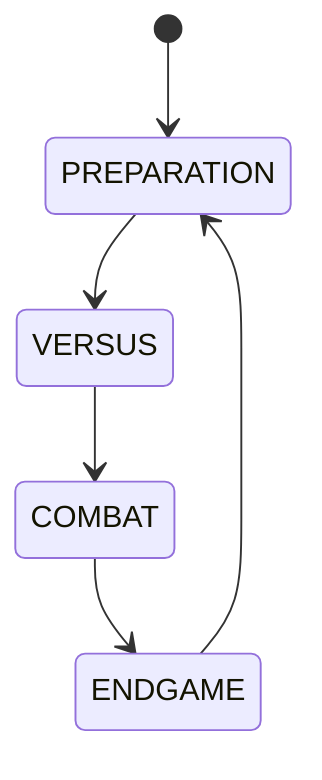

**Diagram sources**
- [phase_machine.py:3-39](file://v2/core/phase_machine.py#L3-L39)