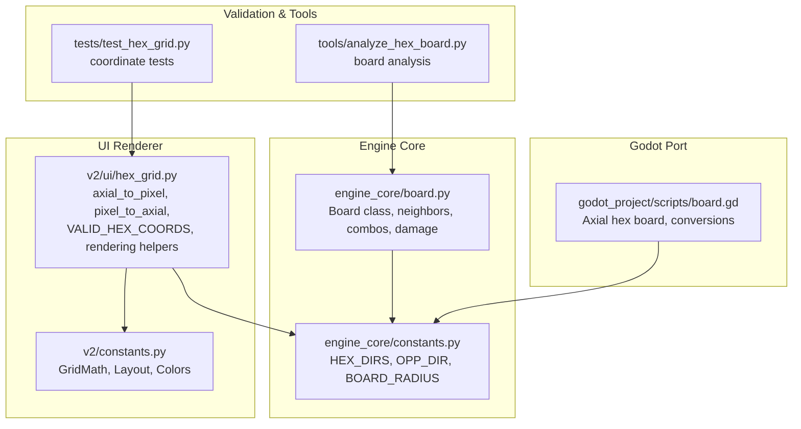
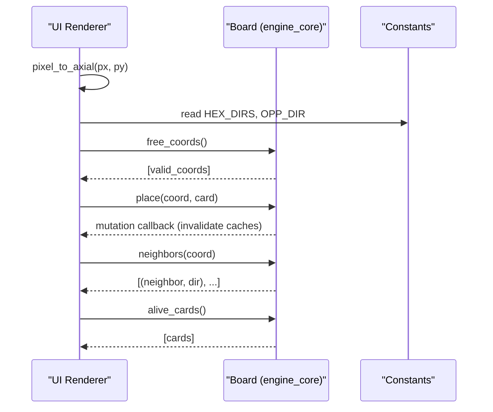
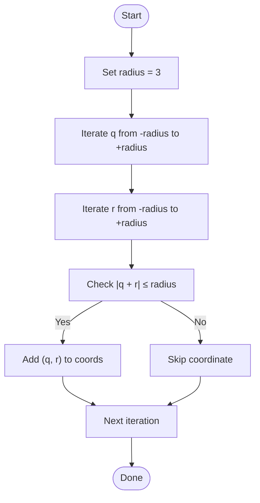
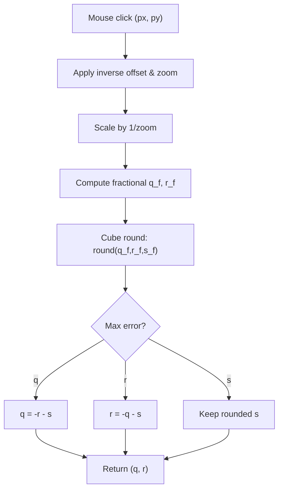
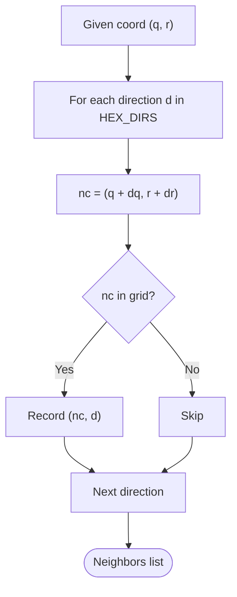
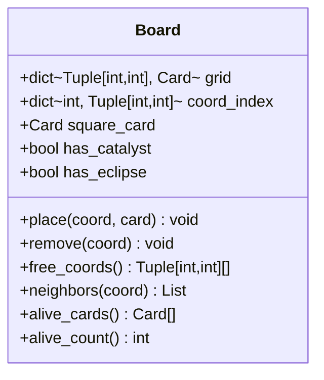
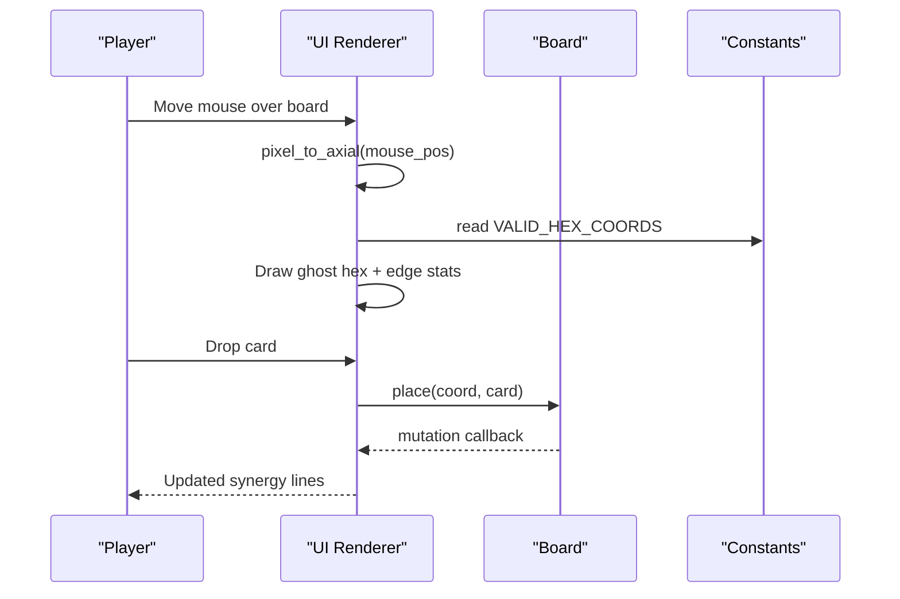
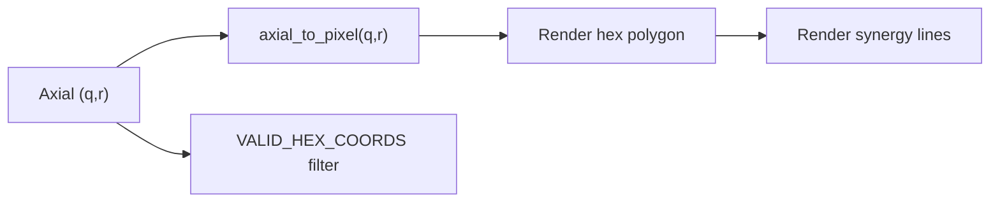
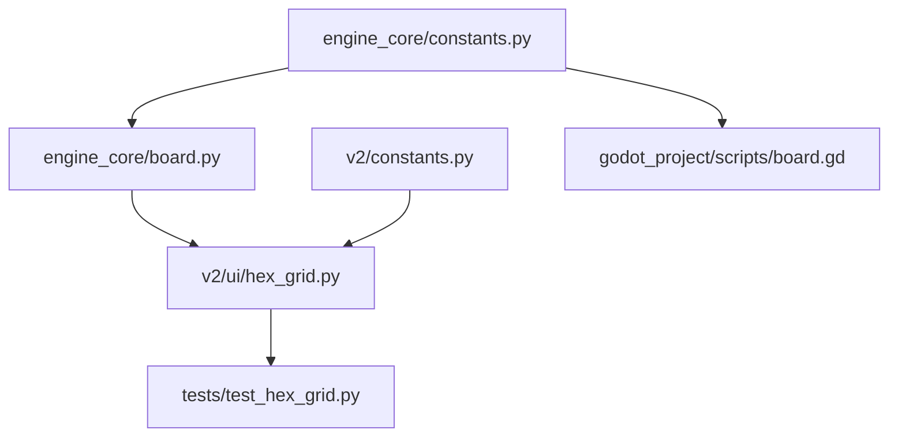

# Hex-Grid Board System

<cite>
**Referenced Files in This Document**
- [engine_core/board.py](file://engine_core/board.py)
- [engine_core/constants.py](file://engine_core/constants.py)
- [v2/ui/hex_grid.py](file://v2/ui/hex_grid.py)
- [v2/constants.py](file://v2/constants.py)
- [_archive/old_dirs/core/hex_system.py](file://_archive/old_dirs/core/hex_system.py)
- [tests/test_hex_grid.py](file://tests/test_hex_grid.py)
- [tools/analyze_hex_board.py](file://tools/analyze_hex_board.py)
- [_archive/old_dirs/godot_project/scripts/board.gd](file://_archive/old_dirs/godot_project/scripts/board.gd)
</cite>

## Table of Contents
1. [Introduction](#introduction)
2. [Project Structure](#project-structure)
3. [Core Components](#core-components)
4. [Architecture Overview](#architecture-overview)
5. [Detailed Component Analysis](#detailed-component-analysis)
6. [Dependency Analysis](#dependency-analysis)
7. [Performance Considerations](#performance-considerations)
8. [Troubleshooting Guide](#troubleshooting-guide)
9. [Conclusion](#conclusion)

## Introduction
This document explains the hex-grid board system used in the game’s combat and positioning mechanics. It covers the axial coordinate system, board geometry, coordinate conversion, adjacency and neighbor calculations, the 37-tile layout, validation logic, board state management, card placement algorithms, movement restrictions, and the relationship between board coordinates and visual rendering. It also includes examples of coordinate arithmetic, distance calculations, neighbor finding, edge cases, and performance considerations.

## Project Structure
The hex-grid system spans both the engine core and the UI/renderer:
- Engine core defines board state, adjacency, combat, and synergy logic.
- UI handles coordinate conversion for rendering and user interaction.
- Tests validate coordinate correctness and boundary handling.
- Tools analyze board geometry and center dominance.
- A Godot port mirrors core logic for the flat-top hex layout.

**Diagram sources**
- [engine_core/board.py:28-47](file://engine_core/board.py#L28-L47)
- [engine_core/constants.py:65-93](file://engine_core/constants.py#L65-L93)
- [v2/ui/hex_grid.py:415-471](file://v2/ui/hex_grid.py#L415-L471)
- [v2/constants.py:68-122](file://v2/constants.py#L68-L122)
- [tests/test_hex_grid.py:1-60](file://tests/test_hex_grid.py#L1-L60)
- [tools/analyze_hex_board.py:6-57](file://tools/analyze_hex_board.py#L6-L57)
- [_archive/old_dirs/godot_project/scripts/board.gd:1-156](file://_archive/old_dirs/godot_project/scripts/board.gd#L1-L156)

**Section sources**
- [engine_core/board.py:28-47](file://engine_core/board.py#L28-L47)
- [engine_core/constants.py:65-93](file://engine_core/constants.py#L65-L93)
- [v2/ui/hex_grid.py:415-471](file://v2/ui/hex_grid.py#L415-L471)
- [v2/constants.py:68-122](file://v2/constants.py#L68-L122)
- [tests/test_hex_grid.py:1-60](file://tests/test_hex_grid.py#L1-L60)
- [tools/analyze_hex_board.py:19-57](file://tools/analyze_hex_board.py#L19-L57)
- [_archive/old_dirs/godot_project/scripts/board.gd:1-156](file://_archive/old_dirs/godot_project/scripts/board.gd#L1-L156)

## Core Components
- Axial coordinate system: q, r axes define board positions; s = -q - r satisfies the cube constraint.
- Board geometry: 37-tile hex grid with radius 3 centered at (0, 0).
- Coordinate conversion: axial_to_pixel and pixel_to_axial with camera support; cube rounding prevents ambiguous ties.
- Adjacency and neighbors: six axial directions; neighbor lookup uses precomputed offsets and board membership checks.
- Board state: dictionary mapping coordinates to cards; fast O(1) uid-to-coordinate indexing; mutation callbacks for UI invalidation.
- Card placement: free_coords enumerates valid positions; place/remove update both grid and index.
- Movement restrictions: axial moves only; rotations handled per card during combat.
- Rendering linkage: UI uses the same axial system and VALID_HEX_COORDS to draw and preview placements.

**Section sources**
- [engine_core/board.py:28-47](file://engine_core/board.py#L28-L47)
- [engine_core/board.py:54-106](file://engine_core/board.py#L54-L106)
- [engine_core/board.py:85-93](file://engine_core/board.py#L85-L93)
- [engine_core/constants.py:65-93](file://engine_core/constants.py#L65-L93)
- [v2/ui/hex_grid.py:415-471](file://v2/ui/hex_grid.py#L415-L471)
- [v2/ui/hex_grid.py:459-471](file://v2/ui/hex_grid.py#L459-L471)
- [v2/constants.py:68-122](file://v2/constants.py#L68-L122)

## Architecture Overview
The board system integrates engine logic with UI rendering through a shared axial coordinate model and explicit conversion functions. The engine maintains state and resolves combat; the UI translates coordinates to pixels for drawing and interaction.

**Diagram sources**
- [v2/ui/hex_grid.py:431-447](file://v2/ui/hex_grid.py#L431-L447)
- [engine_core/board.py:82-93](file://engine_core/board.py#L82-L93)
- [engine_core/board.py:113-120](file://engine_core/board.py#L113-L120)
- [engine_core/constants.py:65-93](file://engine_core/constants.py#L65-L93)

## Detailed Component Analysis

### Axial Coordinate System and Geometry
- The axial system uses q, r coordinates with s = -q - r. Valid positions satisfy |q| + |r| + |s| ≤ 2 × radius, simplified to |q + r| ≤ radius for iteration.
- The 37-tile board uses radius 3, generating coordinates within a hexagonal region centered at (0, 0).
- Direction vectors and opposite-direction mapping enable neighbor enumeration and edge alignment.

**Diagram sources**
- [engine_core/board.py:28-47](file://engine_core/board.py#L28-L47)
- [engine_core/board.py:47-47](file://engine_core/board.py#L47-L47)

**Section sources**
- [engine_core/board.py:28-47](file://engine_core/board.py#L28-L47)
- [engine_core/constants.py:65-93](file://engine_core/constants.py#L65-L93)
- [tools/analyze_hex_board.py:6-17](file://tools/analyze_hex_board.py#L6-L17)

### Coordinate Conversion and Boundary Handling
- Conversions support camera zoom and offsets:
  - axial_to_pixel computes screen coordinates from axial coordinates.
  - pixel_to_axial reverses the process and applies cube rounding to resolve ties.
- Tie-breaking uses cube rounding to ensure deterministic results when clicks fall exactly between hexes.
- Tests verify round-trip stability, center stability, and rejection of out-of-bounds coordinates.

**Diagram sources**
- [v2/ui/hex_grid.py:431-447](file://v2/ui/hex_grid.py#L431-L447)
- [v2/ui/hex_grid.py:449-457](file://v2/ui/hex_grid.py#L449-L457)
- [tests/test_hex_grid.py:31-59](file://tests/test_hex_grid.py#L31-L59)

**Section sources**
- [v2/ui/hex_grid.py:415-471](file://v2/ui/hex_grid.py#L415-L471)
- [tests/test_hex_grid.py:16-59](file://tests/test_hex_grid.py#L16-L59)

### Adjacency and Neighbor Finding
- Neighbors are computed by adding axial direction vectors to the current coordinate.
- The engine stores directions and opposite-direction mapping for edge alignment during combat and synergy checks.
- The UI validates coordinates against a precomputed set of valid hexes and uses the same direction vectors for previews.

**Diagram sources**
- [engine_core/board.py:85-93](file://engine_core/board.py#L85-L93)
- [engine_core/constants.py:65-93](file://engine_core/constants.py#L65-L93)
- [v2/ui/hex_grid.py:189-206](file://v2/ui/hex_grid.py#L189-L206)

**Section sources**
- [engine_core/board.py:85-93](file://engine_core/board.py#L85-L93)
- [engine_core/constants.py:65-93](file://engine_core/constants.py#L65-L93)
- [v2/ui/hex_grid.py:189-206](file://v2/ui/hex_grid.py#L189-L206)

### Board State Management and Positional Validation
- Board holds:
  - grid: coord -> Card
  - coord_index: card.uid -> coord for O(1) lookup
  - square_card, has_catalyst, has_eclipse for special tokens
  - mutation callback for UI cache invalidation
- Free coordinates are derived from the precomputed 37-tile set.
- Place/remove updates both grid and index; mutation callback triggers UI refresh.

**Diagram sources**
- [engine_core/board.py:54-106](file://engine_core/board.py#L54-L106)

**Section sources**
- [engine_core/board.py:54-106](file://engine_core/board.py#L54-L106)

### Card Placement Algorithms and Movement Restrictions
- Placement is restricted to valid axial coordinates within the 37-tile set.
- The UI supports:
  - Ghost preview: draws a translucent hex under the mouse with edge stats overlay.
  - Synergy preview: shows potential synergy lines with neighboring cards.
- Movement is axial only; rotations are applied per card during combat resolution.

**Diagram sources**
- [v2/ui/hex_grid.py:233-326](file://v2/ui/hex_grid.py#L233-L326)
- [v2/ui/hex_grid.py:327-414](file://v2/ui/hex_grid.py#L327-L414)
- [v2/ui/hex_grid.py:459-471](file://v2/ui/hex_grid.py#L459-L471)
- [engine_core/board.py:65-84](file://engine_core/board.py#L65-L84)

**Section sources**
- [v2/ui/hex_grid.py:233-326](file://v2/ui/hex_grid.py#L233-L326)
- [v2/ui/hex_grid.py:327-414](file://v2/ui/hex_grid.py#L327-L414)
- [engine_core/board.py:65-84](file://engine_core/board.py#L65-L84)

### Relationship Between Coordinates and Visual Rendering
- The UI converts axial coordinates to pixel positions using a flat-top hex layout with camera support.
- Rendering uses VALID_HEX_COORDS to iterate visible hexes, applies breathing animations, and draws tactical borders.
- Synergy lines are rendered between adjacent hexes when edge groups match.

**Diagram sources**
- [v2/ui/hex_grid.py:415-471](file://v2/ui/hex_grid.py#L415-L471)
- [v2/ui/hex_grid.py:327-414](file://v2/ui/hex_grid.py#L327-L414)
- [v2/ui/hex_grid.py:51-129](file://v2/ui/hex_grid.py#L51-L129)

**Section sources**
- [v2/ui/hex_grid.py:415-471](file://v2/ui/hex_grid.py#L415-L471)
- [v2/ui/hex_grid.py:327-414](file://v2/ui/hex_grid.py#L327-L414)
- [v2/ui/hex_grid.py:51-129](file://v2/ui/hex_grid.py#L51-L129)

### Examples and Algorithms
- Coordinate arithmetic:
  - Neighbor computation: add axial direction vector to (q, r).
  - Opposite direction mapping: use OPP_DIR to align edges during combat.
- Distance calculation:
  - Hex distance using cube coordinates: (|q1 - q2| + |q1 + r1 - q2 - r2| + |r1 - r2|) / 2.
- Neighbor finding:
  - Iterate directions and check membership in grid.
- Edge cases:
  - Out-of-bounds coordinates are rejected by VALID_HEX_COORDS.
  - Tie-breaking in cube rounding ensures deterministic selection.

**Section sources**
- [engine_core/constants.py:65-93](file://engine_core/constants.py#L65-L93)
- [_archive/old_dirs/core/hex_system.py:135-148](file://_archive/old_dirs/core/hex_system.py#L135-L148)
- [tests/test_hex_grid.py:16-59](file://tests/test_hex_grid.py#L16-L59)
- [v2/ui/hex_grid.py:459-471](file://v2/ui/hex_grid.py#L459-L471)

## Dependency Analysis
The engine and UI share constants and coordinate logic. The engine depends on constants for directions and board radius; the UI depends on constants for geometry and colors, and uses the engine’s constants for direction mapping.

**Diagram sources**
- [engine_core/constants.py:65-93](file://engine_core/constants.py#L65-L93)
- [engine_core/board.py:18-21](file://engine_core/board.py#L18-L21)
- [v2/ui/hex_grid.py:464-471](file://v2/ui/hex_grid.py#L464-L471)
- [v2/constants.py:105-122](file://v2/constants.py#L105-L122)
- [tests/test_hex_grid.py:1-14](file://tests/test_hex_grid.py#L1-L14)
- [_archive/old_dirs/godot_project/scripts/board.gd:10-16](file://_archive/old_dirs/godot_project/scripts/board.gd#L10-L16)

**Section sources**
- [engine_core/constants.py:65-93](file://engine_core/constants.py#L65-L93)
- [engine_core/board.py:18-21](file://engine_core/board.py#L18-L21)
- [v2/ui/hex_grid.py:464-471](file://v2/ui/hex_grid.py#L464-L471)
- [v2/constants.py:105-122](file://v2/constants.py#L105-L122)
- [tests/test_hex_grid.py:1-14](file://tests/test_hex_grid.py#L1-L14)
- [_archive/old_dirs/godot_project/scripts/board.gd:10-16](file://_archive/old_dirs/godot_project/scripts/board.gd#L10-L16)

## Performance Considerations
- Coordinate generation: Precompute 37 coordinates once at import time to avoid repeated recomputation.
- Neighbor lookup: Using axial directions and membership checks is O(1) per direction; total neighbor scan is O(1) since six directions.
- Grid operations: Dictionary-based grid and index provide O(1) average-time place/remove and uid-to-coord lookup.
- Rendering: Clip to visible rect and skip off-screen hexes to minimize draw calls.
- Cube rounding: Deterministic rounding avoids extra passes and reduces ambiguity.

[No sources needed since this section provides general guidance]

## Troubleshooting Guide
Common issues and resolutions:
- Click lands exactly between hexes:
  - Ensure cube rounding is used in pixel_to_axial to resolve ties deterministically.
- Out-of-bounds placement:
  - Validate coordinates against VALID_HEX_COORDS before placing.
- Unexpected neighbor counts:
  - Confirm HEX_DIRS and OPP_DIR are aligned with axial directions.
- Visual misalignment:
  - Verify axial_to_pixel uses correct origin, zoom, and offset values from GridMath.

**Section sources**
- [v2/ui/hex_grid.py:431-471](file://v2/ui/hex_grid.py#L431-L471)
- [v2/ui/hex_grid.py:459-471](file://v2/ui/hex_grid.py#L459-L471)
- [tests/test_hex_grid.py:16-59](file://tests/test_hex_grid.py#L16-L59)

## Conclusion
The hex-grid board system combines a robust axial coordinate model with precise conversion routines and a 37-tile layout. Engine-side state management and adjacency logic integrate cleanly with UI rendering and user interaction. Adhering to cube rounding, validating coordinates, and leveraging precomputed sets ensures correctness and performance across placement, preview, and rendering workflows.