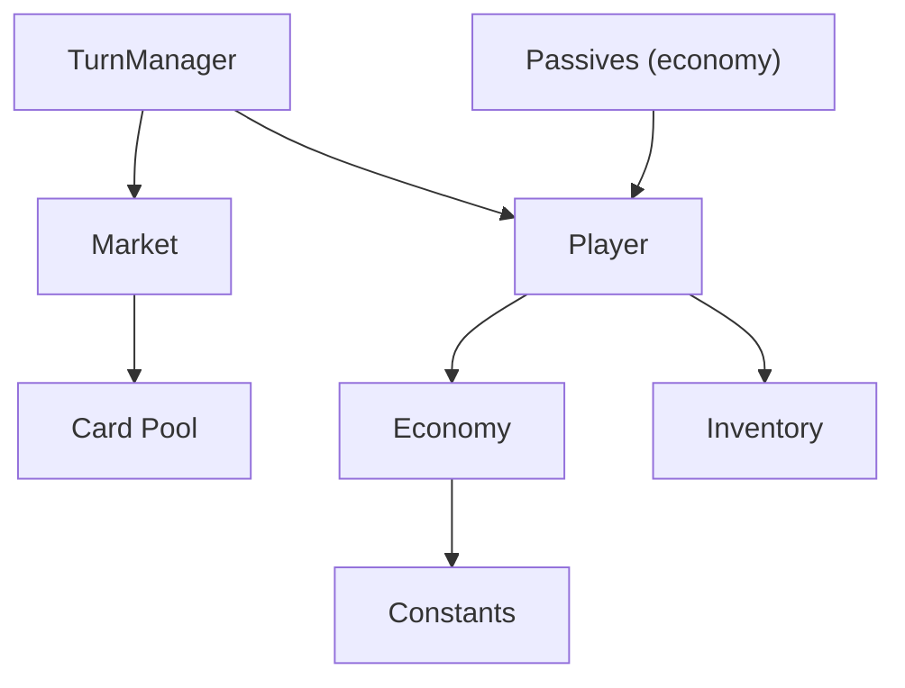
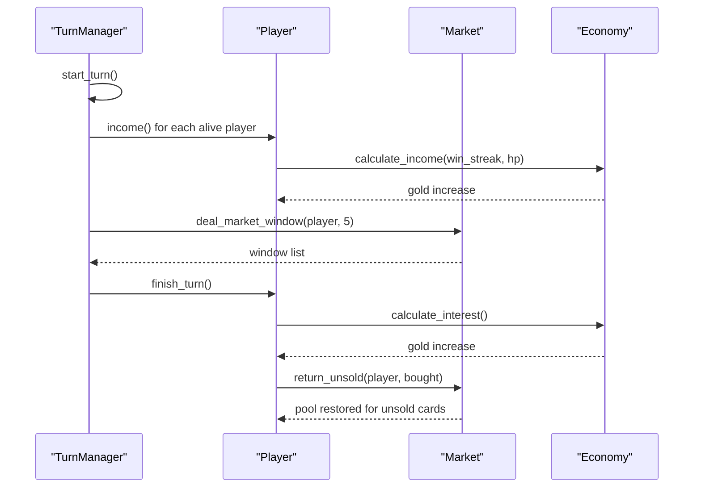
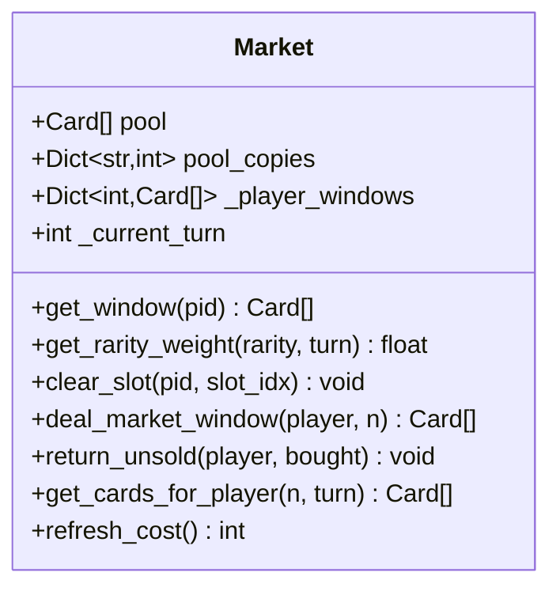
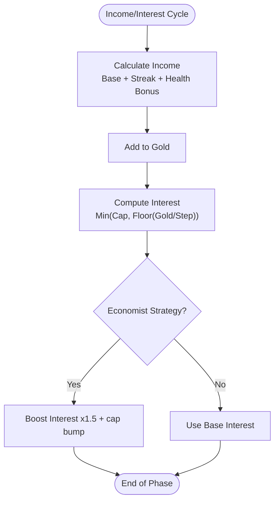
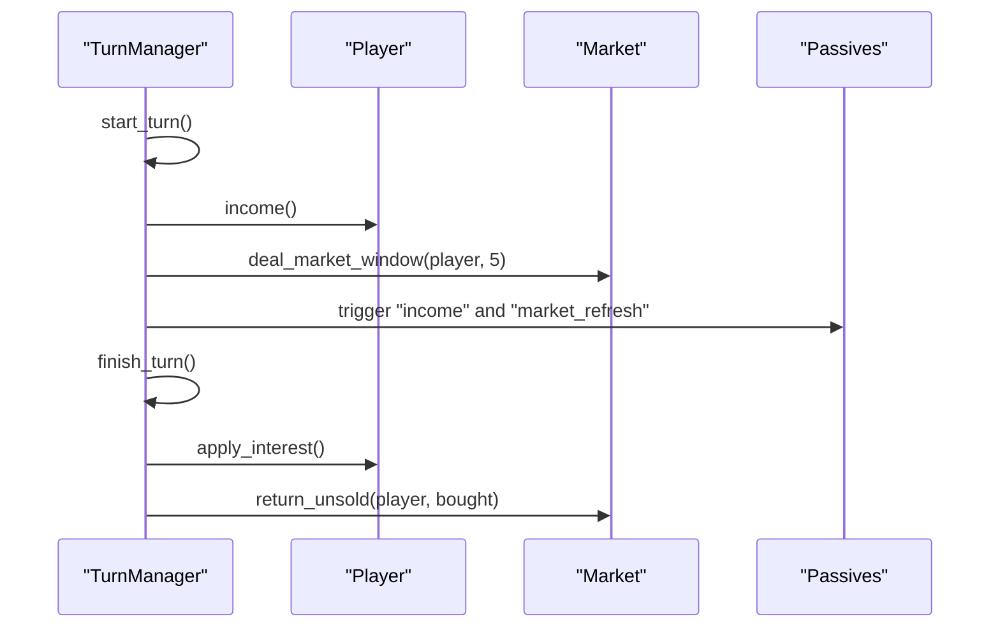
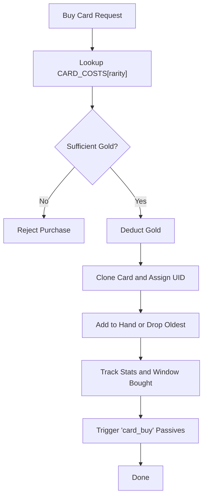
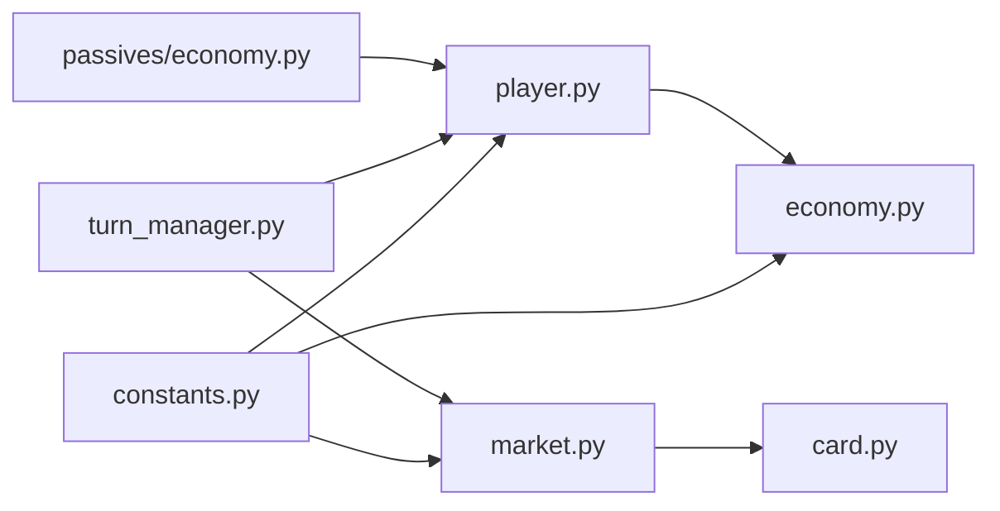

# Market and Economy

<cite>
**Referenced Files in This Document**
- [market.py](file://engine_core/market.py)
- [economy.py](file://engine_core/economy.py)
- [constants.py](file://engine_core/constants.py)
- [player.py](file://engine_core/player.py)
- [turn_manager.py](file://engine_core/turn_manager.py)
- [card.py](file://engine_core/card.py)
- [passives/economy.py](file://engine_core/passives/economy.py)
- [test_engine_board_market.py](file://tests/test_engine_board_market.py)
- [test_income_preview.py](file://tests/test_income_preview.py)
</cite>

## Table of Contents
1. [Introduction](#introduction)
2. [Project Structure](#project-structure)
3. [Core Components](#core-components)
4. [Architecture Overview](#architecture-overview)
5. [Detailed Component Analysis](#detailed-component-analysis)
6. [Dependency Analysis](#dependency-analysis)
7. [Performance Considerations](#performance-considerations)
8. [Troubleshooting Guide](#troubleshooting-guide)
9. [Conclusion](#conclusion)

## Introduction
This document explains the market and economy systems that drive resource generation, card availability, and pricing mechanics in the engine. It covers:
- Market class functionality: card deal generation, refresh cycles, rarity-weighted sampling, and deal rotation
- Economy system: gold income calculation, cost scaling, and economic balance controls
- Market state management: player windows, card availability tracking, and deal rotation algorithms
- Purchase validation, price computation, and economic feedback loops
- The relationship between market operations and player economy
- Examples of initialization, deal generation, and economic calculations
- Balancing mechanisms against inflation and economic stability
- Troubleshooting and optimization guidance

## Project Structure
The market and economy systems are implemented primarily in engine_core with supporting constants, passives, and tests:
- Market: manages shared card pool, per-player windows, and weighted sampling
- Economy: computes income and interest, tracks gold, and enforces spending
- Player: composes Economy and orchestrates income, purchases, and interest
- TurnManager: coordinates turn lifecycle, income distribution, and market window deals
- Constants: defines base income, interest caps, market refresh cost, and card costs
- Passives: provide economy-related triggers during income, market refresh, and card buy events
- Tests: validate rarity weighting, deal generation, income formulas, and economic behavior

**Diagram sources**
- [turn_manager.py:155-196](file://engine_core/turn_manager.py#L155-L196)
- [market.py:49-174](file://engine_core/market.py#L49-L174)
- [player.py:22-123](file://engine_core/player.py#L22-L123)
- [economy.py:3-30](file://engine_core/economy.py#L3-L30)
- [constants.py:98-101](file://engine_core/constants.py#L98-L101)
- [passives/economy.py:1-122](file://engine_core/passives/economy.py#L1-L122)

**Section sources**
- [turn_manager.py:155-196](file://engine_core/turn_manager.py#L155-L196)
- [market.py:49-174](file://engine_core/market.py#L49-L174)
- [player.py:22-123](file://engine_core/player.py#L22-L123)
- [economy.py:3-30](file://engine_core/economy.py#L3-L30)
- [constants.py:98-101](file://engine_core/constants.py#L98-L101)
- [passives/economy.py:1-122](file://engine_core/passives/economy.py#L1-L122)

## Core Components
- Market: Maintains a shared pool with per-card copy counts, generates per-player windows using rarity-weighted sampling, and manages deal rotation and returns
- Economy: Computes base income, streak and health bonuses, interest based on stored gold, and enforces gold spending
- Player: Composes Economy and Inventory, handles income and interest application, purchase logic, and market window tracking
- Constants: Defines base income, interest caps, market refresh cost, and card costs by rarity
- Passives: Trigger during income, market refresh, and card buy to influence gold flow

Key responsibilities:
- Market: weighted sampling, per-window tracking, returns, and refresh cost
- Economy: income and interest computation, gold accounting, and purchase validation
- Player: integrates economy with shop actions, maintains per-turn stats, and triggers passives
- TurnManager: starts turns, distributes income, opens market windows, and applies interest

**Section sources**
- [market.py:49-174](file://engine_core/market.py#L49-L174)
- [economy.py:3-30](file://engine_core/economy.py#L3-L30)
- [player.py:22-123](file://engine_core/player.py#L22-L123)
- [constants.py:98-139](file://engine_core/constants.py#L98-L139)
- [passives/economy.py:1-122](file://engine_core/passives/economy.py#L1-L122)

## Architecture Overview
The market and economy systems integrate across turn lifecycle phases:
- Start of turn: TurnManager increments turn counter, distributes income to all living players, and opens market windows for eligible players
- During turn: Players receive income, optionally refresh the market (cost defined by constants), and buy cards (costs by rarity)
- End of turn: Unsold cards are returned to the pool, interest is applied, and evolution/copy strengthening occur

**Diagram sources**
- [turn_manager.py:155-196](file://engine_core/turn_manager.py#L155-L196)
- [turn_manager.py:201-244](file://engine_core/turn_manager.py#L201-L244)
- [player.py:112-123](file://engine_core/player.py#L112-L123)
- [market.py:105-130](file://engine_core/market.py#L105-L130)
- [market.py:139-159](file://engine_core/market.py#L139-L159)
- [economy.py:9-20](file://engine_core/economy.py#L9-L20)

## Detailed Component Analysis

### Market Class
The Market class manages the shared card pool, per-player windows, and weighted sampling:
- Rarity weights define organic rarity curves by turn ranges
- deal_market_window samples cards with replacement removal and updates pool copy counts
- Per-player windows are tracked and returned to the pool when not purchased
- refresh_cost is fixed and defined in constants

**Diagram sources**
- [market.py:49-174](file://engine_core/market.py#L49-L174)

Key behaviors:
- Rarity weighting: stepwise weights by turn for each rarity
- Weighted sampling: cumulative probability selection without replacement
- Window lifecycle: open, track purchases, return unsold, and restore pool copies
- Refresh cost: fixed value used when players refresh the market

Validation and examples:
- Rarity weight steps validated by tests
- Deal respects early-game rarity gates and updates roll stats
- Unsold returns restore only cards not marked as bought

**Section sources**
- [market.py:26-46](file://engine_core/market.py#L26-L46)
- [market.py:105-130](file://engine_core/market.py#L105-L130)
- [market.py:139-159](file://engine_core/market.py#L139-L159)
- [test_engine_board_market.py:44-65](file://tests/test_engine_board_market.py#L44-L65)
- [test_engine_board_market.py:67-85](file://tests/test_engine_board_market.py#L67-L85)

### Economy System
The Economy class computes income and interest and manages gold:
- Income: base income plus streak bonus and health-based bailout bonus
- Interest: capped by maximum interest and computed per gold stored at fixed intervals
- Spending: validates sufficient gold before purchases

**Diagram sources**
- [economy.py:9-20](file://engine_core/economy.py#L9-L20)
- [constants.py:98-101](file://engine_core/constants.py#L98-L101)

Player integration:
- Player.income() and Player.apply_interest() delegate to Economy
- Player.buy_card() uses CARD_COSTS[rarity] to compute cost and validates spending

**Section sources**
- [economy.py:3-30](file://engine_core/economy.py#L3-L30)
- [constants.py:98-139](file://engine_core/constants.py#L98-L139)
- [player.py:112-123](file://engine_core/player.py#L112-L123)
- [player.py:124-145](file://engine_core/player.py#L124-L145)

### Turn Lifecycle and Market Windows
TurnManager coordinates market windows and income:
- start_turn(): increments turn, clears transient board state, opens windows for alive players, distributes income, triggers income and market_refresh passives
- finish_turn(): performs AI purchases (for non-human), returns unsold cards, applies interest, checks evolution and copy strengthening

**Diagram sources**
- [turn_manager.py:155-196](file://engine_core/turn_manager.py#L155-L196)
- [turn_manager.py:201-244](file://engine_core/turn_manager.py#L201-L244)

**Section sources**
- [turn_manager.py:155-196](file://engine_core/turn_manager.py#L155-L196)
- [turn_manager.py:201-244](file://engine_core/turn_manager.py#L201-L244)

### Purchase Validation and Price Computation
Purchase flow:
- Cost lookup by rarity from constants
- Spend validation via Economy.spend_gold
- Hand management and optional card drop when hand limit reached
- Tracking of cards bought this turn and per-window purchases

**Diagram sources**
- [player.py:124-145](file://engine_core/player.py#L124-L145)
- [constants.py:134-139](file://engine_core/constants.py#L134-L139)

**Section sources**
- [player.py:124-145](file://engine_core/player.py#L124-L145)
- [constants.py:134-139](file://engine_core/constants.py#L134-L139)

### Economic Feedback Loops and Passives
Passives influence gold flow during key phases:
- Income triggers: Industrial Revolution, Ottoman Empire, Babylon, Printing Press, Midas, Silk Road, Exoplanet, Moon Landing
- Market refresh triggers: Algorithm
- Card buy triggers: Age of Discovery

These provide incremental gold adjustments that shape long-term economic sustainability and encourage strategic play.

**Section sources**
- [passives/economy.py:24-90](file://engine_core/passives/economy.py#L24-L90)
- [passives/economy.py:97-103](file://engine_core/passives/economy.py#L97-L103)
- [passives/economy.py:110-121](file://engine_core/passives/economy.py#L110-L121)

## Dependency Analysis
- Market depends on Card pool, RNG, and constants for refresh cost
- Economy depends on constants for base income, interest caps, and step
- Player composes Economy and delegates income/interest/spending
- TurnManager orchestrates Market and Player interactions across phases
- Passives integrate with Player and Market via trigger hooks

**Diagram sources**
- [constants.py:98-139](file://engine_core/constants.py#L98-L139)
- [market.py:14-16](file://engine_core/market.py#L14-L16)
- [economy.py:1-2](file://engine_core/economy.py#L1-L2)
- [player.py:11-20](file://engine_core/player.py#L11-L20)
- [turn_manager.py:36-62](file://engine_core/turn_manager.py#L36-L62)
- [passives/economy.py:10-17](file://engine_core/passives/economy.py#L10-L17)

**Section sources**
- [constants.py:98-139](file://engine_core/constants.py#L98-L139)
- [market.py:14-16](file://engine_core/market.py#L14-L16)
- [economy.py:1-2](file://engine_core/economy.py#L1-L2)
- [player.py:11-20](file://engine_core/player.py#L11-L20)
- [turn_manager.py:36-62](file://engine_core/turn_manager.py#L36-L62)
- [passives/economy.py:10-17](file://engine_core/passives/economy.py#L10-L17)

## Performance Considerations
- Weighted sampling: cumulative selection over remaining cards; consider precomputing weights and indices for large pools
- Pool copy tracking: dictionary lookups are O(1); ensure minimal churn by avoiding frequent pool rebuilds
- Market window returns: avoid repeated scans by tracking bought names per window
- Interest computation: constant-time arithmetic; negligible overhead
- Tests validate correctness without heavy computation; keep logic linear in number of sampled cards

[No sources needed since this section provides general guidance]

## Troubleshooting Guide
Common issues and resolutions:
- Market window contains unexpected rarities: verify rarity weight steps and turn progression; confirm deal respects early-game gates
- Cards not returning to pool: ensure return_unsold is called and bought names are tracked correctly
- Income/interest not updating: confirm Player.income() and Player.apply_interest() are invoked during turn lifecycle
- Purchase failures: verify CARD_COSTS[rarity] and Economy.spend_gold logic
- Passive triggers not firing: ensure trigger_passive_fn is wired in TurnManager and passives are registered

Validation references:
- Rarity weight steps and early-game gates
- Deal window length and pool copy reductions
- Unsold returns restoring only non-bought cards
- Income formula terms and economist multiplier behavior

**Section sources**
- [test_engine_board_market.py:44-65](file://tests/test_engine_board_market.py#L44-L65)
- [test_engine_board_market.py:67-85](file://tests/test_engine_board_market.py#L67-L85)
- [test_income_preview.py:22-77](file://tests/test_income_preview.py#L22-L77)

## Conclusion
The market and economy systems are tightly integrated around turn lifecycle phases. Market ensures balanced card availability via rarity-weighted sampling and per-window tracking, while Economy governs income and interest with tunable caps and multipliers. Player actions—buying cards, refreshing markets, and accumulating gold—interact with passives to create dynamic feedback loops. Together, these components support economic stability, strategic depth, and predictable scaling across rarities and strategies.