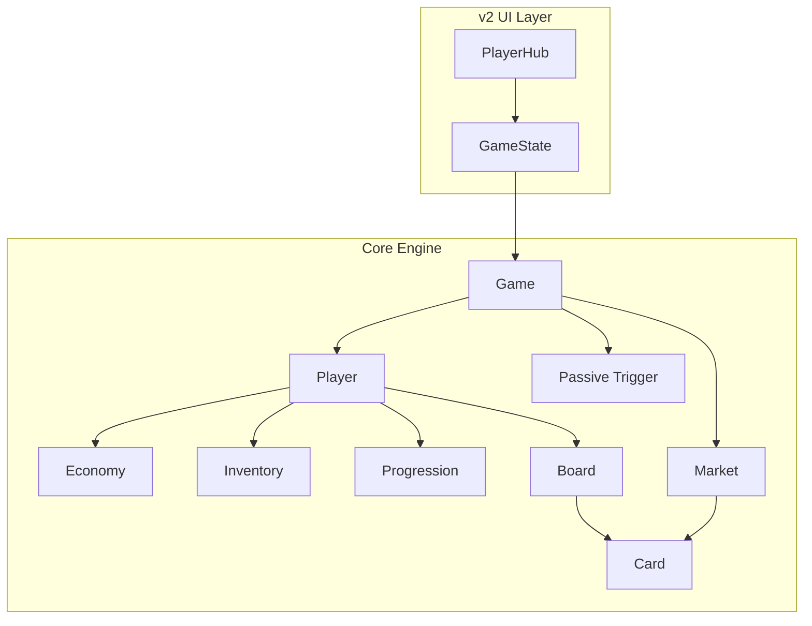
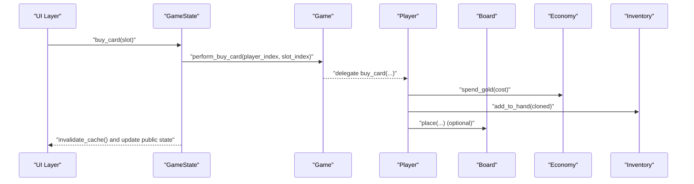
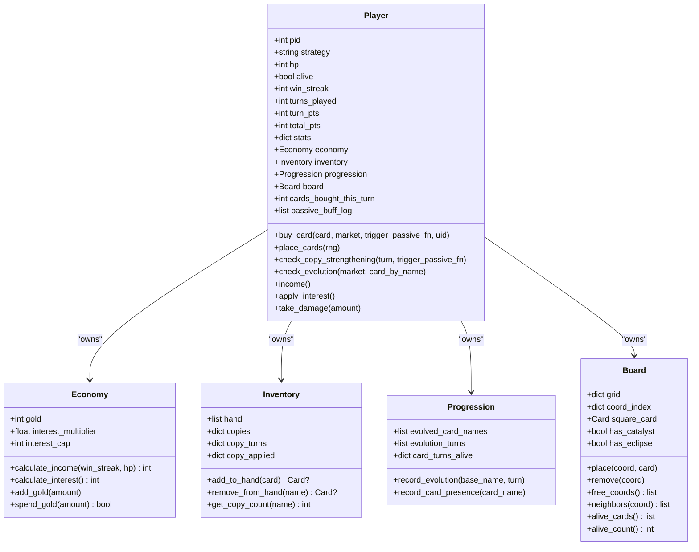
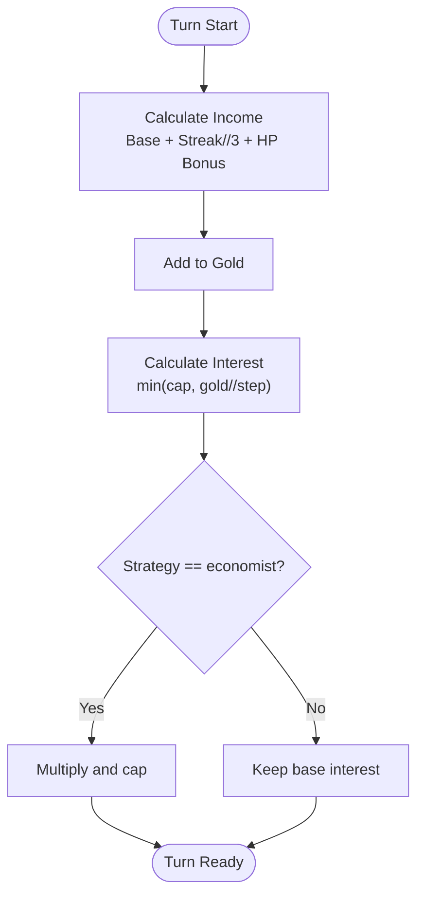
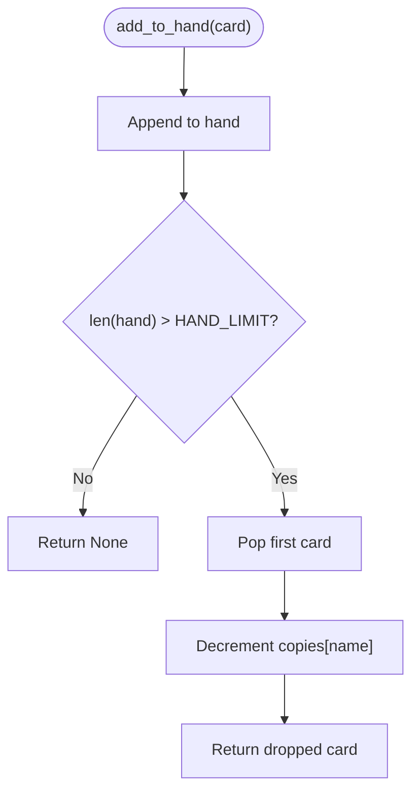
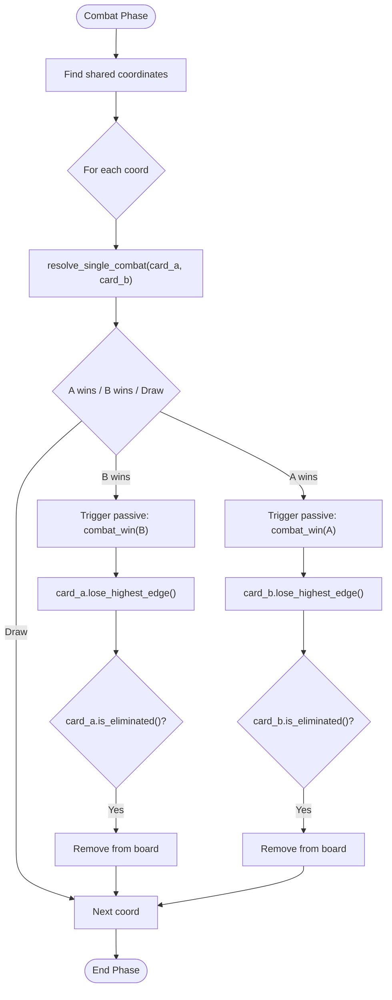
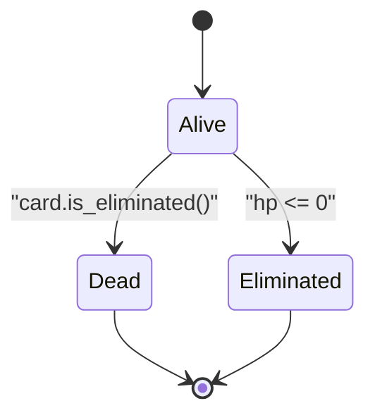
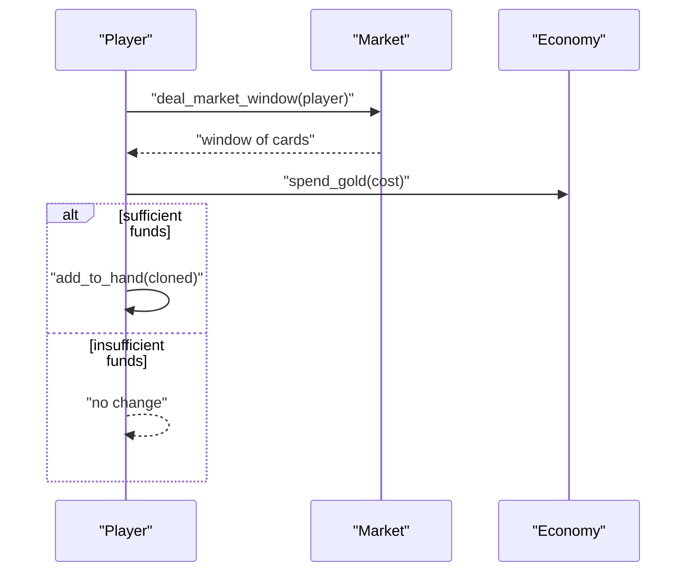
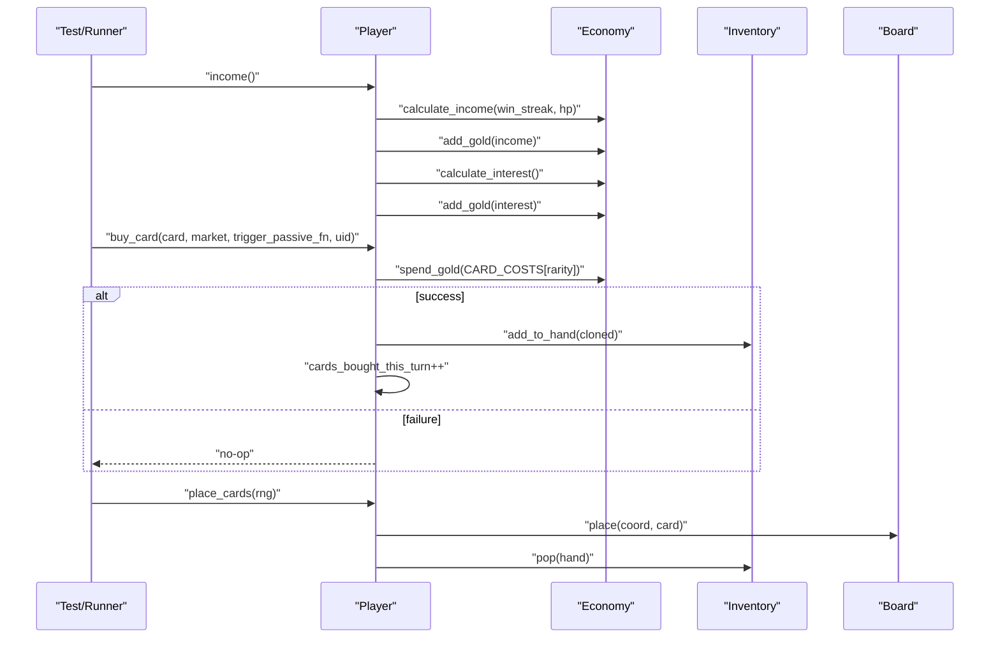
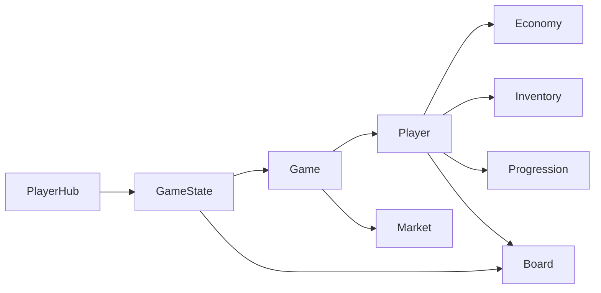

# Player Management

<cite>
**Referenced Files in This Document**
- [player.py](file://engine_core/player.py)
- [economy.py](file://engine_core/economy.py)
- [inventory.py](file://engine_core/inventory.py)
- [board.py](file://engine_core/board.py)
- [constants.py](file://engine_core/constants.py)
- [card.py](file://engine_core/card.py)
- [progression.py](file://engine_core/progression.py)
- [market.py](file://engine_core/market.py)
- [passive_trigger.py](file://engine_core/passive_trigger.py)
- [game.py](file://engine_core/game.py)
- [game_state.py](file://v2/core/game_state.py)
- [player_hub.py](file://v2/ui/player_hub.py)
</cite>

## Table of Contents
1. [Introduction](#introduction)
2. [Project Structure](#project-structure)
3. [Core Components](#core-components)
4. [Architecture Overview](#architecture-overview)
5. [Detailed Component Analysis](#detailed-component-analysis)
6. [Dependency Analysis](#dependency-analysis)
7. [Performance Considerations](#performance-considerations)
8. [Troubleshooting Guide](#troubleshooting-guide)
9. [Conclusion](#conclusion)
10. [Appendices](#appendices)

## Introduction
This document explains the player management system in the AutoChess Hybrid engine. It covers the Player class architecture, economy and income mechanics, inventory and card management, board positioning and synergy calculations, lifecycle and elimination rules, win/loss tracking, and UI integration. It also provides examples of initialization, economic transactions, and board operations, along with guidance on state persistence, serialization, and performance optimization.

## Project Structure
The player management system spans several core modules:
- Player encapsulates state, composed subsystems (economy, inventory, progression, board), and lifecycle actions.
- Economy controls gold income and interest.
- Inventory manages hand, copies, and overflow.
- Board stores positioned cards, adjacency, and synergy calculations.
- Market provides weighted card windows and pool tracking.
- Passive trigger integrates card abilities and logs.
- Game orchestrates turns, pairings, and combat.
- v2 GameState bridges UI reads and engine mutations.
- v2 PlayerHub renders player stats.

**Diagram sources**
- [player.py:22-250](file://engine_core/player.py#L22-L250)
- [economy.py:3-30](file://engine_core/economy.py#L3-L30)
- [inventory.py:5-33](file://engine_core/inventory.py#L5-L33)
- [progression.py:3-15](file://engine_core/progression.py#L3-L15)
- [board.py:54-449](file://engine_core/board.py#L54-L449)
- [card.py:48-316](file://engine_core/card.py#L48-L316)
- [market.py:49-174](file://engine_core/market.py#L49-L174)
- [passive_trigger.py:21-138](file://engine_core/passive_trigger.py#L21-L138)
- [game.py:35-224](file://engine_core/game.py#L35-L224)
- [game_state.py:14-173](file://v2/core/game_state.py#L14-L173)
- [player_hub.py:24-253](file://v2/ui/player_hub.py#L24-L253)

**Section sources**
- [player.py:22-250](file://engine_core/player.py#L22-L250)
- [economy.py:3-30](file://engine_core/economy.py#L3-L30)
- [inventory.py:5-33](file://engine_core/inventory.py#L5-L33)
- [board.py:54-449](file://engine_core/board.py#L54-L449)
- [constants.py:1-145](file://engine_core/constants.py#L1-L145)
- [card.py:48-316](file://engine_core/card.py#L48-L316)
- [progression.py:3-15](file://engine_core/progression.py#L3-L15)
- [market.py:49-174](file://engine_core/market.py#L49-L174)
- [passive_trigger.py:21-138](file://engine_core/passive_trigger.py#L21-L138)
- [game.py:35-224](file://engine_core/game.py#L35-L224)
- [game_state.py:14-173](file://v2/core/game_state.py#L14-L173)
- [player_hub.py:24-253](file://v2/ui/player_hub.py#L24-L253)

## Core Components
- Player: central state container with health, gold, strategy, win streak, turn counters, stats, and composed subsystems. Provides income, interest, buying cards, placing cards, copy strengthening, evolution checks, and damage taking.
- Economy: calculates income from streak and HP, computes interest, and manages gold flow.
- Inventory: maintains hand, copy counts, and overflow behavior.
- Board: stores positioned cards, supports placement/removal, neighbor queries, and synergy calculations.
- Market: generates weighted windows, tracks pool copies, and handles refresh costs.
- Passive Trigger: fires card passives and logs effects for stats and strategy analysis.
- Game: orchestrates turns, pairings, and combat; delegates to TurnManager and CombatEngine.
- v2 GameState: UI bridge that invalidates caches on board mutations and exposes read-only state snapshots.
- v2 PlayerHub: renders HP, gold, streak, points, and income preview.

**Section sources**
- [player.py:22-250](file://engine_core/player.py#L22-L250)
- [economy.py:3-30](file://engine_core/economy.py#L3-L30)
- [inventory.py:5-33](file://engine_core/inventory.py#L5-L33)
- [board.py:54-449](file://engine_core/board.py#L54-L449)
- [market.py:49-174](file://engine_core/market.py#L49-L174)
- [passive_trigger.py:21-138](file://engine_core/passive_trigger.py#L21-L138)
- [game.py:35-224](file://engine_core/game.py#L35-L224)
- [game_state.py:14-173](file://v2/core/game_state.py#L14-L173)
- [player_hub.py:24-253](file://v2/ui/player_hub.py#L24-L253)

## Architecture Overview
The Player composes Economy, Inventory, Progression, and Board. Game coordinates turn phases and delegates actions to TurnManager and CombatEngine. v2 GameState hooks Board mutation callbacks to keep UI snapshots consistent. PlayerHub consumes GameState-provided data to render live stats.

**Diagram sources**
- [game_state.py:92-136](file://v2/core/game_state.py#L92-L136)
- [player.py:124-158](file://engine_core/player.py#L124-L158)
- [board.py:65-81](file://engine_core/board.py#L65-L81)
- [economy.py:25-29](file://engine_core/economy.py#L25-L29)
- [inventory.py:12-22](file://engine_core/inventory.py#L12-L22)

## Detailed Component Analysis

### Player Class Architecture
Player aggregates:
- Health and lifecycle flags (HP, alive)
- Economy (gold, income, interest)
- Inventory (hand, copies, copy tracking)
- Progression (evolved cards, evolution turns)
- Board (grid, coord index, catalyst/eclipse flags)
- Stats and metrics (wins/losses/draws, kills, damage, synergy, gold spent/earned, etc.)
- Strategy-specific behavior (builder synergy matrix)

Key behaviors:
- Income calculation and interest accrual
- Buying cards from market window with overflow handling
- Placing cards on the board with per-turn limits
- Copy strengthening and evolution checks
- Damage application and elimination

**Diagram sources**
- [player.py:22-250](file://engine_core/player.py#L22-L250)
- [economy.py:3-30](file://engine_core/economy.py#L3-L30)
- [inventory.py:5-33](file://engine_core/inventory.py#L5-L33)
- [progression.py:3-15](file://engine_core/progression.py#L3-L15)
- [board.py:54-106](file://engine_core/board.py#L54-L106)

**Section sources**
- [player.py:22-250](file://engine_core/player.py#L22-L250)

### Economy System: Gold, Income, and Interest
- Income: base income plus streak and HP bonuses; paid at turn start.
- Interest: capped by banked gold with configurable multiplier for certain strategies; added after income.
- Spending: card purchases consume gold; insufficient funds returns false.

**Diagram sources**
- [economy.py:9-20](file://engine_core/economy.py#L9-L20)
- [constants.py:96-101](file://engine_core/constants.py#L96-L101)

**Section sources**
- [economy.py:3-30](file://engine_core/economy.py#L3-L30)
- [constants.py:96-101](file://engine_core/constants.py#L96-L101)

### Inventory and Card Management
- Hand management enforces a hand limit; excess card is dropped and returned to pool copies.
- Copy tracking per card name is maintained for copy strengthening thresholds.
- Removal by name supports evolution and board replacement.

**Diagram sources**
- [inventory.py:12-22](file://engine_core/inventory.py#L12-L22)
- [constants.py:137](file://engine_core/constants.py#L137)

**Section sources**
- [inventory.py:5-33](file://engine_core/inventory.py#L5-L33)
- [constants.py:137](file://engine_core/constants.py#L137)

### Board Positioning and Synergy Calculations
- Placement: free coordinates are selected deterministically or randomly; each placement updates board grid and coord index.
- Neighbors: adjacent hex coordinates are computed using axial directions.
- Synergy: connected clusters by group (MIND, CONNECTION, EXISTENCE) with tiered bonuses and internal edge matches.
- Damage: difference in points, half-count of living cards, and rarity term with turn-based multiplier and early-game cap.

**Diagram sources**
- [board.py:393-449](file://engine_core/board.py#L393-L449)
- [board.py:142-186](file://engine_core/board.py#L142-L186)
- [board.py:350-387](file://engine_core/board.py#L350-L387)

**Section sources**
- [board.py:54-449](file://engine_core/board.py#L54-L449)

### Player Lifecycle, Elimination, and Win/Loss Tracking
- Elimination occurs when HP reaches zero or a card becomes eliminated (all stats zero or group requirement met).
- Win condition: last player alive wins; tiebreaker by HP and total points.
- Stats capture wins, losses, draws, kills, damage dealt/taken, synergy metrics, and evolution records.

**Diagram sources**
- [player.py:243-247](file://engine_core/player.py#L243-L247)
- [board.py:163-176](file://engine_core/board.py#L163-L176)
- [game.py:203-224](file://engine_core/game.py#L203-L224)

**Section sources**
- [player.py:243-247](file://engine_core/player.py#L243-L247)
- [board.py:163-176](file://engine_core/board.py#L163-L176)
- [game.py:203-224](file://engine_core/game.py#L203-L224)

### Market and Economic Transactions
- Market windows are drawn with rarity-weighted sampling per turn; pool copies are tracked.
- Refresh cost is fixed; unsold cards are returned to pool.
- Player buys cards by spending gold; overflow is handled by dropping the oldest card.

**Diagram sources**
- [market.py:105-131](file://engine_core/market.py#L105-L131)
- [player.py:124-144](file://engine_core/player.py#L124-L144)
- [economy.py:25-29](file://engine_core/economy.py#L25-L29)

**Section sources**
- [market.py:49-174](file://engine_core/market.py#L49-L174)
- [player.py:124-144](file://engine_core/player.py#L124-L144)
- [economy.py:25-29](file://engine_core/economy.py#L25-L29)

### Player Initialization, Examples, and Operations
- Initialization: create Player with strategy; Economy and Inventory are constructed automatically; Board is empty; stats initialized.
- Economic transaction example: call income() to receive income and interest; spend_gold() to buy a card.
- Board operation example: place_cards() selects free coordinates and places cards from hand up to per-turn limit.

**Diagram sources**
- [player.py:109-158](file://engine_core/player.py#L109-L158)
- [economy.py:9-29](file://engine_core/economy.py#L9-L29)
- [constants.py:134](file://engine_core/constants.py#L134)
- [board.py:65-81](file://engine_core/board.py#L65-L81)

**Section sources**
- [player.py:22-67](file://engine_core/player.py#L22-L67)
- [player.py:109-158](file://engine_core/player.py#L109-L158)
- [economy.py:9-29](file://engine_core/economy.py#L9-L29)
- [constants.py:134](file://engine_core/constants.py#L134)
- [board.py:65-81](file://engine_core/board.py#L65-L81)

### Player State Persistence, Serialization, and Data Consistency
- Current code does not expose explicit serialization methods in Player/Economy/Inventory/Board. State is held in-memory during simulation.
- UI consistency: Board mutation callbacks trigger GameState cache invalidation; GameState.get_public_state() rebuilds a snapshot for UI consumption.
- Recommended approach for persistence:
  - Serialize Player.stats, Player.turns_played, Player.win_streak, Economy.gold, Inventory.hand and copies, Board.grid and coord_index, Progression arrays.
  - Use deterministic RNG seeds for reproducibility.
  - Reconstruct composed objects after deserialization and rebind references (e.g., Player.game).

**Section sources**
- [board.py:61-74](file://engine_core/board.py#L61-L74)
- [game_state.py:55-65](file://v2/core/game_state.py#L55-L65)
- [player.py:40-41](file://engine_core/player.py#L40-L41)

## Dependency Analysis
- Player depends on Economy, Inventory, Progression, and Board.
- Game composes Market and delegates turn logic to TurnManager and CombatEngine.
- v2 GameState hooks Board mutation callbacks to maintain a cached PublicState snapshot.
- UI rendering relies on GameState-provided snapshots.

**Diagram sources**
- [player.py:22-50](file://engine_core/player.py#L22-L50)
- [game.py:35-96](file://engine_core/game.py#L35-L96)
- [game_state.py:41-52](file://v2/core/game_state.py#L41-L52)

**Section sources**
- [player.py:22-50](file://engine_core/player.py#L22-L50)
- [game.py:35-96](file://engine_core/game.py#L35-L96)
- [game_state.py:41-52](file://v2/core/game_state.py#L41-L52)

## Performance Considerations
- Board operations: Coord index enables O(1) lookup for card-to-coordinate mapping; neighbor queries are O(degrees) bounded by hex connectivity.
- Synergy calculation: BFS-based cluster finding visits each coordinate once per group; complexity proportional to board size plus edge match counts.
- Market sampling: Weighted sampling without replacement is O(n) per window; caching card pool reduces repeated IO.
- UI cache invalidation: Mutation callbacks prevent recomputing PublicState until needed, reducing UI lag.
- Recommendations:
  - Prefer deterministic RNG for deterministic simulations.
  - Batch passive triggers and defer expensive UI updates.
  - Use lazy evaluation for synergy totals when not immediately needed.

[No sources needed since this section provides general guidance]

## Troubleshooting Guide
Common issues and remedies:
- Buying fails unexpectedly:
  - Verify gold sufficiency via Economy.spend_gold().
  - Check hand limit overflow and dropped card behavior.
- Copy strengthening not triggering:
  - Confirm copy counts meet thresholds and copy_turns increments.
  - Ensure thresholds differ when Catalyst/Eclipse is active.
- Evolution not occurring:
  - Ensure strategy is "evolver".
  - Verify copies >= required amount and base card presence in hand/board.
- Board placement errors:
  - Confirm coordinate is free and within BOARD_RADIUS bounds.
  - Ensure rotation is valid and placement callback is registered.
- UI not updating:
  - Ensure GameState mutation hooks are attached and cache invalidated after board mutations.

**Section sources**
- [economy.py:25-29](file://engine_core/economy.py#L25-L29)
- [inventory.py:12-22](file://engine_core/inventory.py#L12-L22)
- [player.py:159-183](file://engine_core/player.py#L159-L183)
- [player.py:184-241](file://engine_core/player.py#L184-L241)
- [board.py:65-81](file://engine_core/board.py#L65-L81)
- [game_state.py:55-57](file://v2/core/game_state.py#L55-L57)

## Conclusion
The player management system integrates economy, inventory, board, and passive systems around a cohesive Player model. GameState ensures UI consistency through cache invalidation, while Game orchestrates turn phases and combat. The documented flows and diagrams provide a blueprint for extending strategies, optimizing performance, and maintaining data integrity.

[No sources needed since this section summarizes without analyzing specific files]

## Appendices

### Example Workflows

#### Player Initialization
- Create Player with strategy.
- Access gold via Player.gold property.
- Inspect stats via Player.stats.

**Section sources**
- [player.py:22-67](file://engine_core/player.py#L22-L67)

#### Economic Transactions
- Call Player.income() to collect income and interest.
- Spend gold via Player.buy_card() with market context.

**Section sources**
- [player.py:109-144](file://engine_core/player.py#L109-L144)
- [economy.py:9-29](file://engine_core/economy.py#L9-L29)

#### Board Operations
- Place cards using Player.place_cards() with optional RNG.
- Retrieve neighbors and free coordinates from Board.

**Section sources**
- [player.py:146-158](file://engine_core/player.py#L146-L158)
- [board.py:82-96](file://engine_core/board.py#L82-L96)

### UI Integration Notes
- GameState.get_public_state() provides a cached snapshot for UI reads.
- PlayerHub consumes PlayerHubData to render HP, gold, streak, points, and income preview.

**Section sources**
- [game_state.py:59-65](file://v2/core/game_state.py#L59-L65)
- [player_hub.py:65-83](file://v2/ui/player_hub.py#L65-L83)