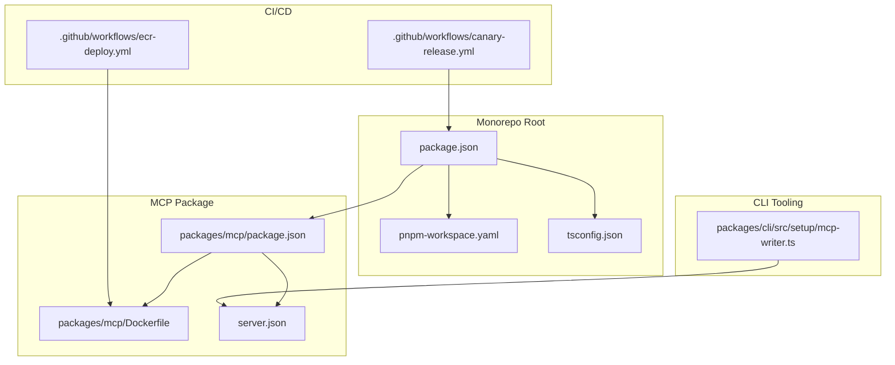
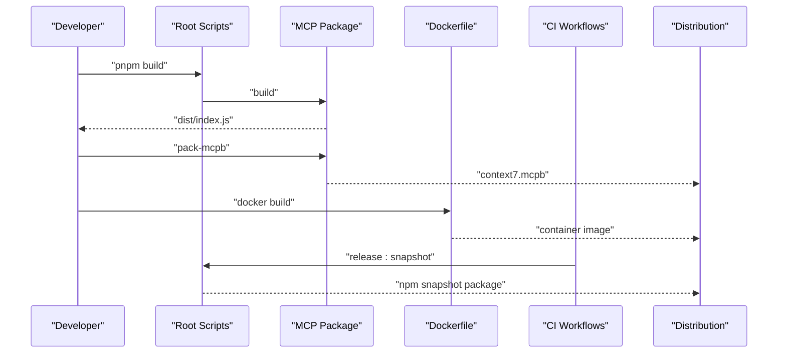
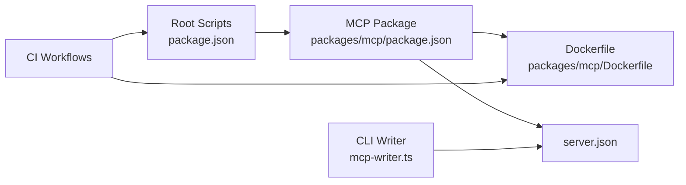

# Deployment and Distribution

<cite>
**Referenced Files in This Document**
- [package.json](file://context7-mcp/package.json)
- [pnpm-workspace.yaml](file://context7-mcp/pnpm-workspace.yaml)
- [tsconfig.json](file://context7-mcp/tsconfig.json)
- [packages/mcp/package.json](file://context7-mcp/packages/mcp/package.json)
- [packages/mcp/Dockerfile](file://context7-mcp/packages/mcp/Dockerfile)
- [server.json](file://context7-mcp/server.json)
- [docs/enterprise/deployment/kubernetes.mdx](file://context7-mcp/docs/enterprise/deployment/kubernetes.mdx)
- [.github/workflows/canary-release.yml](file://context7-mcp/.github/workflows/canary-release.yml)
- [.github/workflows/ecr-deploy.yml](file://context7-mcp/.github/workflows/ecr-deploy.yml)
- [packages/cli/src/setup/mcp-writer.ts](file://context7-mcp/packages/cli/src/setup/mcp-writer.ts)
- [v2/constants.py](file://v2/constants.py)
</cite>

## Table of Contents
1. [Introduction](#introduction)
2. [Project Structure](#project-structure)
3. [Core Components](#core-components)
4. [Architecture Overview](#architecture-overview)
5. [Detailed Component Analysis](#detailed-component-analysis)
6. [Dependency Analysis](#dependency-analysis)
7. [Performance Considerations](#performance-considerations)
8. [Troubleshooting Guide](#troubleshooting-guide)
9. [Conclusion](#conclusion)
10. [Appendices](#appendices)

## Introduction
This document explains how to deploy and distribute the Context7 MCP server and related packages. It covers build configuration, dependency management, distribution preparation, runtime settings, environment setup, and performance tuning. It also documents packaging for both npm and MCPB formats, distribution channels, version management via Changesets, and operational guidance for automation, monitoring, and maintenance.

## Project Structure
The deployment surface centers on the context7-mcp monorepo with a TypeScript MCP server package and supporting tooling. Key elements:
- Monorepo configuration defines workspaces and shared scripts.
- The MCP server package builds to a Node.js binary and supports packaging for MCPB.
- Containerization is supported via a multi-stage Dockerfile.
- Enterprise deployment guidance is provided for Kubernetes with persistent storage.
- CI/CD workflows automate snapshot releases and container image publishing.

**Diagram sources**
- [package.json:1-62](file://context7-mcp/package.json#L1-L62)
- [pnpm-workspace.yaml:1-3](file://context7-mcp/pnpm-workspace.yaml#L1-L3)
- [tsconfig.json:1-14](file://context7-mcp/tsconfig.json#L1-L14)
- [packages/mcp/package.json:1-62](file://context7-mcp/packages/mcp/package.json#L1-L62)
- [packages/mcp/Dockerfile:1-30](file://context7-mcp/packages/mcp/Dockerfile#L1-L30)
- [server.json:1-68](file://context7-mcp/server.json#L1-L68)
- [.github/workflows/canary-release.yml:1-46](file://context7-mcp/.github/workflows/canary-release.yml#L1-L46)
- [.github/workflows/ecr-deploy.yml:46-57](file://context7-mcp/.github/workflows/ecr-deploy.yml#L46-L57)
- [packages/cli/src/setup/mcp-writer.ts:1-48](file://context7-mcp/packages/cli/src/setup/mcp-writer.ts#L1-L48)

**Section sources**
- [package.json:1-62](file://context7-mcp/package.json#L1-L62)
- [pnpm-workspace.yaml:1-3](file://context7-mcp/pnpm-workspace.yaml#L1-L3)
- [tsconfig.json:1-14](file://context7-mcp/tsconfig.json#L1-L14)
- [packages/mcp/package.json:1-62](file://context7-mcp/packages/mcp/package.json#L1-L62)
- [packages/mcp/Dockerfile:1-30](file://context7-mcp/packages/mcp/Dockerfile#L1-L30)
- [server.json:1-68](file://context7-mcp/server.json#L1-L68)
- [.github/workflows/canary-release.yml:1-46](file://context7-mcp/.github/workflows/canary-release.yml#L1-L46)
- [.github/workflows/ecr-deploy.yml:46-57](file://context7-mcp/.github/workflows/ecr-deploy.yml#L46-L57)
- [packages/cli/src/setup/mcp-writer.ts:1-48](file://context7-mcp/packages/cli/src/setup/mcp-writer.ts#L1-L48)

## Core Components
- Build configuration: TypeScript compiler options and module resolution are centralized in tsconfig.json. The MCP package compiles to ES2022 with Node16 module resolution and enables strict checks.
- Dependency management: The monorepo uses pnpm workspaces and a frozen lockfile. Root scripts orchestrate builds, tests, linting, and formatting across packages. The MCP package declares runtime and dev dependencies appropriate for a Node.js HTTP server.
- Distribution preparation: The MCP package includes a script to produce an MCPB bundle and a Dockerfile for containerized deployment. server.json defines server metadata, supported registries, and environment variables for distribution.

Practical examples:
- Build the monorepo: run the root build script to compile all packages.
- Build the MCP package: run the MCP package build script to emit the compiled server.
- Produce an MCPB bundle: run the MCP package pack script to assemble a portable bundle.
- Run locally: use the MCP package start script to launch the server with HTTP transport.

**Section sources**
- [tsconfig.json:1-14](file://context7-mcp/tsconfig.json#L1-L14)
- [packages/mcp/package.json:1-62](file://context7-mcp/packages/mcp/package.json#L1-L62)
- [package.json:1-62](file://context7-mcp/package.json#L1-L62)
- [server.json:1-68](file://context7-mcp/server.json#L1-L68)

## Architecture Overview
The deployment pipeline integrates development, packaging, and distribution:
- Development: TypeScript sources are compiled with strict settings.
- Packaging: The MCP package emits a distributable binary and supports MCPB bundling.
- Distribution: Artifacts are published to npm and/or MCPB channels, and container images are published to registries.
- Runtime: The server reads environment variables and exposes HTTP transport by default.

**Diagram sources**
- [package.json:9-25](file://context7-mcp/package.json#L9-L25)
- [packages/mcp/package.json:6-16](file://context7-mcp/packages/mcp/package.json#L6-L16)
- [packages/mcp/Dockerfile:1-30](file://context7-mcp/packages/mcp/Dockerfile#L1-L30)
- [.github/workflows/canary-release.yml:43-44](file://context7-mcp/.github/workflows/canary-release.yml#L43-L44)

## Detailed Component Analysis

### Build Configuration
- Compiler options: Target ES2022, Node16 module resolution, strict mode, and consistent casing enforcement.
- Exclusions: Library and build outputs are excluded from compilation.
- Implications: Ensures compatibility with modern Node.js runtimes and reduces type-check noise from vendored libraries.

Best practices:
- Keep tsconfig.json centralized to enforce uniformity across packages.
- Use strict compiler options to catch subtle bugs early.

**Section sources**
- [tsconfig.json:1-14](file://context7-mcp/tsconfig.json#L1-L14)

### Dependency Management
- Monorepo layout: Workspaces define package boundaries; root scripts run tasks across all packages.
- Lockfile: Frozen lockfile ensures reproducible installs in CI and local environments.
- Package dependencies: The MCP package depends on the Model Context Protocol SDK, Express, and related utilities; dev dependencies include TypeScript and testing tools.

Guidelines:
- Prefer pnpm for deterministic installs and workspace linking.
- Pin versions consistently and use the frozen lockfile in CI.

**Section sources**
- [package.json:6-25](file://context7-mcp/package.json#L6-L25)
- [pnpm-workspace.yaml:1-3](file://context7-mcp/pnpm-workspace.yaml#L1-L3)
- [packages/mcp/package.json:47-60](file://context7-mcp/packages/mcp/package.json#L47-L60)

### Distribution Preparation
- MCPB packaging: The MCP package includes a dedicated script to assemble a portable bundle with a manifest and ignore file, then validates and packs the artifact.
- Container packaging: A multi-stage Dockerfile builds the package with pnpm, copies production dependencies, and runs the server on port 8080 with HTTP transport.
- Server metadata: server.json describes the server identity, supported registries, and environment variables for distribution.

Operational notes:
- Use the MCPB pack script to prepare a distributable bundle.
- Build the container image and push to your registry for platform deployments.

**Section sources**
- [packages/mcp/package.json](file://context7-mcp/packages/mcp/package.json#L16)
- [packages/mcp/Dockerfile:1-30](file://context7-mcp/packages/mcp/Dockerfile#L1-L30)
- [server.json:1-68](file://context7-mcp/server.json#L1-L68)

### Runtime Configuration and Environment Setup
- Environment variables: server.json documents CONTEXT7_API_KEY as an optional secret variable for authentication.
- Local environment: A Python utility demonstrates loading .env files into process environment, useful for local development parity.
- Transport defaults: The MCP package’s start script launches the server with HTTP transport and a default port.

Recommendations:
- Define required environment variables in deployment platforms and keep secrets out of source.
- Mirror environment variable names and semantics across local and production setups.

**Section sources**
- [server.json:26-33](file://context7-mcp/server.json#L26-L33)
- [v2/constants.py:1-25](file://v2/constants.py#L1-L25)
- [packages/mcp/package.json](file://context7-mcp/packages/mcp/package.json#L15)

### Version Management and Release Automation
- Changesets-driven releases: The root build script invokes a command to publish packages after building, enabling coordinated versioning and changelogs.
- Canary releases: A CI workflow publishes snapshot versions on demand, configuring npm authentication and running the snapshot release script.

Workflow highlights:
- Build all packages before publishing.
- Use snapshot releases for pre-production validation.

**Section sources**
- [package.json:23-24](file://context7-mcp/package.json#L23-L24)
- [.github/workflows/canary-release.yml:33-44](file://context7-mcp/.github/workflows/canary-release.yml#L33-L44)

### Packaging and Distribution Channels
- npm registry: server.json lists an npm package entry with registry type and version.
- MCPB channel: server.json includes an MCPB package entry with transport and checksum.
- Container images: The workflow publishes container images to a registry for cloud or on-prem deployments.

Channel selection:
- Choose npm for Node-based integrations.
- Choose MCPB for portable distribution across MCP-compatible clients.
- Use container images for orchestrated environments.

**Section sources**
- [server.json:18-51](file://context7-mcp/server.json#L18-L51)
- [.github/workflows/ecr-deploy.yml:46-57](file://context7-mcp/.github/workflows/ecr-deploy.yml#L46-L57)

### Enterprise Deployment Guidance
- Kubernetes: The documentation describes a single-replica StatefulSet with persistent storage for SQLite and LanceDB, along with a Service and optional Ingress.
- Persistent volumes: Required due to SQLite’s single-writer constraint.
- Secrets: License keys are injected via Kubernetes secrets.

Operational checklist:
- Provision persistent volumes for local storage.
- Apply StatefulSet, Service, and Ingress manifests.
- Manage secrets and license keys securely.

**Section sources**
- [docs/enterprise/deployment/kubernetes.mdx:48-83](file://context7-mcp/docs/enterprise/deployment/kubernetes.mdx#L48-L83)

### CLI Integration for Server Registration
- Configuration writer: A utility reads and merges JSON configuration entries for MCP servers, supporting comment stripping and merging logic.
- Practical use: Integrates with client-side configuration to register server entries.

**Section sources**
- [packages/cli/src/setup/mcp-writer.ts:1-48](file://context7-mcp/packages/cli/src/setup/mcp-writer.ts#L1-L48)

## Dependency Analysis
The deployment stack exhibits clear separation of concerns:
- Root orchestrator drives builds and releases.
- MCP package encapsulates server logic, packaging, and distribution metadata.
- Dockerfile isolates build and runtime stages.
- CI workflows automate release and image publishing.
- CLI tooling assists with server registration.

**Diagram sources**
- [package.json:9-25](file://context7-mcp/package.json#L9-L25)
- [packages/mcp/package.json:6-16](file://context7-mcp/packages/mcp/package.json#L6-L16)
- [packages/mcp/Dockerfile:1-30](file://context7-mcp/packages/mcp/Dockerfile#L1-L30)
- [server.json:1-68](file://context7-mcp/server.json#L1-L68)
- [.github/workflows/canary-release.yml:33-44](file://context7-mcp/.github/workflows/canary-release.yml#L33-L44)
- [packages/cli/src/setup/mcp-writer.ts:29-48](file://context7-mcp/packages/cli/src/setup/mcp-writer.ts#L29-L48)

**Section sources**
- [package.json:1-62](file://context7-mcp/package.json#L1-L62)
- [packages/mcp/package.json:1-62](file://context7-mcp/packages/mcp/package.json#L1-L62)
- [packages/mcp/Dockerfile:1-30](file://context7-mcp/packages/mcp/Dockerfile#L1-L30)
- [server.json:1-68](file://context7-mcp/server.json#L1-L68)
- [.github/workflows/canary-release.yml:1-46](file://context7-mcp/.github/workflows/canary-release.yml#L1-L46)
- [packages/cli/src/setup/mcp-writer.ts:1-48](file://context7-mcp/packages/cli/src/setup/mcp-writer.ts#L1-L48)

## Performance Considerations
- Build performance: Use pnpm’s hoisting and frozen lockfile to minimize install overhead. Enable incremental builds during development.
- Runtime transport: The server defaults to HTTP transport; ensure network latency and TLS termination are configured appropriately in production.
- Container footprint: Multi-stage builds reduce runtime image size by installing only production dependencies in the final stage.
- Storage I/O: For enterprise deployments, provision SSD-backed persistent volumes to optimize SQLite and LanceDB performance.

[No sources needed since this section provides general guidance]

## Troubleshooting Guide
Common issues and resolutions:
- Build failures due to lockfile mismatch: Ensure the CI environment uses the frozen lockfile and consistent Node/npm/pnpm versions.
- Missing environment variables: Verify that required variables (such as the API key) are set in the runtime environment.
- MCPB packaging errors: Confirm the presence of the manifest and ignore files before running the pack script; validate the manifest prior to packing.
- Container startup errors: Check exposed port and transport arguments; confirm the working directory and entrypoint align with the Dockerfile.

**Section sources**
- [packages/mcp/package.json](file://context7-mcp/packages/mcp/package.json#L16)
- [packages/mcp/Dockerfile:27-29](file://context7-mcp/packages/mcp/Dockerfile#L27-L29)
- [server.json:26-33](file://context7-mcp/server.json#L26-L33)

## Conclusion
The Context7 MCP server is designed for reproducible builds, flexible distribution, and straightforward operations. By leveraging pnpm workspaces, a multi-stage Dockerfile, and Changesets-based releases, teams can reliably package, ship, and operate the service across diverse environments. For production, pair containerized deployments with robust environment management and persistent storage, and use CI workflows to automate releases and image publishing.

[No sources needed since this section summarizes without analyzing specific files]

## Appendices

### Practical Deployment Workflows
- Local development build and run:
  - Build all packages.
  - Build the MCP package.
  - Start the server with HTTP transport.
- Packaging for distribution:
  - Prepare an MCPB bundle using the provided script.
  - Publish to npm or MCPB channels as defined in server.json.
- Containerized deployment:
  - Build the image using the Dockerfile.
  - Push to your container registry.
  - Deploy to Kubernetes or another orchestrator.

**Section sources**
- [package.json:9-25](file://context7-mcp/package.json#L9-L25)
- [packages/mcp/package.json:6-16](file://context7-mcp/packages/mcp/package.json#L6-L16)
- [packages/mcp/Dockerfile:1-30](file://context7-mcp/packages/mcp/Dockerfile#L1-L30)
- [server.json:18-51](file://context7-mcp/server.json#L18-L51)