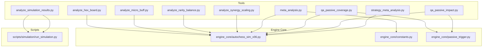
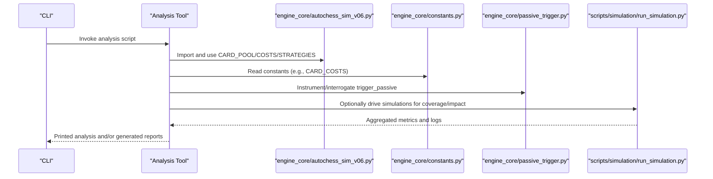
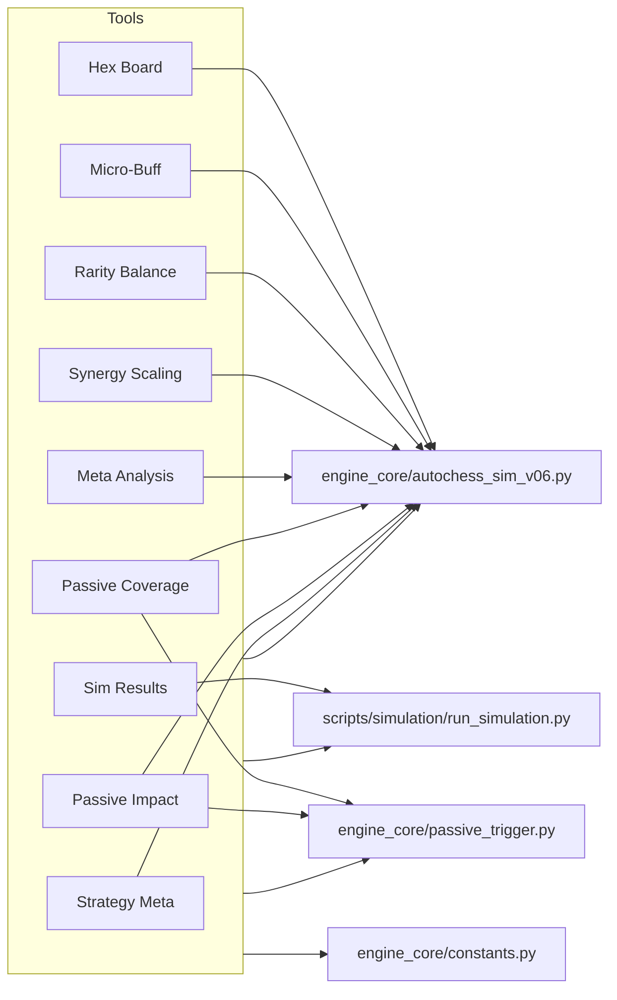

# Analysis Tools

<cite>
**Referenced Files in This Document**
- [analyze_hex_board.py](file://tools/analyze_hex_board.py)
- [analyze_micro_buff.py](file://tools/analyze_micro_buff.py)
- [analyze_rarity_balance.py](file://tools/analyze_rarity_balance.py)
- [analyze_simulation_results.py](file://tools/analyze_simulation_results.py)
- [analyze_synergy_scaling.py](file://tools/analyze_synergy_scaling.py)
- [meta_analysis.py](file://tools/meta_analysis.py)
- [qa_passive_coverage.py](file://tools/qa_passive_coverage.py)
- [qa_passive_impact.py](file://tools/qa_passive_impact.py)
- [strategy_meta_analysis.py](file://tools/strategy_meta_analysis.py)
- [autochess_sim_v06.py](file://engine_core/autochess_sim_v06.py)
- [constants.py](file://engine_core/constants.py)
- [passive_trigger.py](file://engine_core/passive_trigger.py)
- [run_simulation.py](file://scripts/simulation/run_simulation.py)
</cite>

## Table of Contents
1. [Introduction](#introduction)
2. [Project Structure](#project-structure)
3. [Core Components](#core-components)
4. [Architecture Overview](#architecture-overview)
5. [Detailed Component Analysis](#detailed-component-analysis)
6. [Dependency Analysis](#dependency-analysis)
7. [Performance Considerations](#performance-considerations)
8. [Troubleshooting Guide](#troubleshooting-guide)
9. [Conclusion](#conclusion)

## Introduction
This document describes the Analysis Tools suite used to optimize Autochess Hybrid gameplay systems. It covers:
- Hex board analysis for 37-cell positioning and center dominance
- Micro-buffer analysis for balancing weak cards
- Rarity cost-efficiency and power-per-gold balance
- Simulation result processing for performance evaluation and strategy/meta insights
- Synergy scaling analysis and meta evaluation
- QA tools for passive ability coverage and impact assessment

Each tool is explained with usage, interpretation, and integration workflows into the broader engine optimization process.

## Project Structure
The Analysis Tools live primarily under the tools/ directory and integrate with engine_core modules and scripts under scripts/.

**Diagram sources**
- [analyze_hex_board.py:1-151](file://tools/analyze_hex_board.py#L1-L151)
- [analyze_micro_buff.py:1-75](file://tools/analyze_micro_buff.py#L1-L75)
- [analyze_rarity_balance.py:1-179](file://tools/analyze_rarity_balance.py#L1-L179)
- [analyze_simulation_results.py:1-278](file://tools/analyze_simulation_results.py#L1-L278)
- [analyze_synergy_scaling.py:1-190](file://tools/analyze_synergy_scaling.py#L1-L190)
- [meta_analysis.py:1-396](file://tools/meta_analysis.py#L1-L396)
- [qa_passive_coverage.py:1-390](file://tools/qa_passive_coverage.py#L1-L390)
- [qa_passive_impact.py:1-395](file://tools/qa_passive_impact.py#L1-L395)
- [strategy_meta_analysis.py:1-194](file://tools/strategy_meta_analysis.py#L1-L194)
- [autochess_sim_v06.py:1-107](file://engine_core/autochess_sim_v06.py#L1-L107)
- [constants.py:60-145](file://engine_core/constants.py#L60-L145)
- [passive_trigger.py:21-54](file://engine_core/passive_trigger.py#L21-L54)
- [run_simulation.py:1-269](file://scripts/simulation/run_simulation.py#L1-L269)

**Section sources**
- [autochess_sim_v06.py:1-107](file://engine_core/autochess_sim_v06.py#L1-L107)
- [constants.py:60-145](file://engine_core/constants.py#L60-L145)

## Core Components
- Hex board analyzer: Computes neighbor distributions, center dominance, and ring structure for 19- and 37-hex boards, and outlines implementation steps to switch board radius.
- Micro-buffer analyzer: Identifies weak cards below a global average threshold and cross-checks simulation output expectations.
- Rarity balance analyzer: Computes power-per-gold metrics per rarity tier and proposes new costs to improve efficiency.
- Simulation result processor: Loads and aggregates simulation outputs into strategy and card performance summaries, and generates a comprehensive analysis report.
- Synergy scaling analyzer: Compares old flat bonuses to a new moderated scaling formula, diversity bonus, and power cap.
- Meta analysis: Runs many games to compute strategy win rates, card owner win rates, category and rarity contributions, and provides balance hints.
- QA tools:
  - Passive coverage: Instruments trigger_passive to log triggers, effectiveness, and dispatch table presence across a large number of games.
  - Passive impact: Controlled A/B testing per card to quantify gameplay impact using per-type scoring and caps.
- Strategy meta analysis: Infers behavioral archetypes from logs and summarizes per-tag and per-strategy metrics.

**Section sources**
- [analyze_hex_board.py:1-151](file://tools/analyze_hex_board.py#L1-L151)
- [analyze_micro_buff.py:1-75](file://tools/analyze_micro_buff.py#L1-L75)
- [analyze_rarity_balance.py:1-179](file://tools/analyze_rarity_balance.py#L1-L179)
- [analyze_simulation_results.py:1-278](file://tools/analyze_simulation_results.py#L1-L278)
- [analyze_synergy_scaling.py:1-190](file://tools/analyze_synergy_scaling.py#L1-L190)
- [meta_analysis.py:1-396](file://tools/meta_analysis.py#L1-L396)
- [qa_passive_coverage.py:1-390](file://tools/qa_passive_coverage.py#L1-L390)
- [qa_passive_impact.py:1-395](file://tools/qa_passive_impact.py#L1-L395)
- [strategy_meta_analysis.py:1-194](file://tools/strategy_meta_analysis.py#L1-L194)

## Architecture Overview
The analysis pipeline integrates tools with the engine and simulation scripts. Tools import engine_core modules to access card pools, constants, and passive-trigger logic. Simulation scripts produce structured outputs consumed by analysis tools.

**Diagram sources**
- [autochess_sim_v06.py:1-107](file://engine_core/autochess_sim_v06.py#L1-L107)
- [constants.py:60-145](file://engine_core/constants.py#L60-L145)
- [passive_trigger.py:21-54](file://engine_core/passive_trigger.py#L21-L54)
- [run_simulation.py:1-269](file://scripts/simulation/run_simulation.py#L1-L269)

## Detailed Component Analysis

### Hex Board Analysis
Purpose:
- Quantify positional balance on 19-hex vs 37-hex boards using neighbor counts, center dominance, and ring structure.
- Provide actionable guidance for board size migration and implementation.

Key capabilities:
- Coordinate generation within a hex radius
- Neighbor counting and distribution analysis
- Center dominance computation
- Ring structure enumeration
- Comparative reporting and implementation notes

Practical usage:
- Run the script to compare 19-hex and 37-hex metrics and interpret balance implications.
- Use the provided implementation guidance to adjust BOARD_RADIUS and related engine constants.

Interpretation:
- Lower center dominance indicates reduced tempo advantage and more viable positions.
- Increased interior positions (6 neighbors) promote balanced strategies.

Integration:
- Adjust engine_core/constants.py BOARD_RADIUS and verify hex-based placement bounds automatically update.

**Section sources**
- [analyze_hex_board.py:1-151](file://tools/analyze_hex_board.py#L1-L151)
- [constants.py:74-93](file://engine_core/constants.py#L74-L93)

### Micro-Buffer Analysis
Purpose:
- Identify cards below a computed global average and verify whether they would receive a micro-buff.

Key capabilities:
- Load card database from assets/data/cards.json
- Compute global average stat and define a buff threshold
- List cards below threshold and sort by average
- Cross-check expected counts against simulation output

Practical usage:
- Run the analyzer to list buff candidates and confirm expected counts align with simulation logs.

Interpretation:
- Cards with averages below threshold are candidates for micro-buffs.
- Expected buff counts should match simulation output indicating correct logic.

Integration:
- Use results to inform card balancing and micro-buff application logic in the engine.

**Section sources**
- [analyze_micro_buff.py:1-75](file://tools/analyze_micro_buff.py#L1-L75)

### Rarity Balance Assessment
Purpose:
- Evaluate power-per-gold efficiency across rarities and propose cost adjustments to improve balance.

Key capabilities:
- Group cards by rarity and compute average power and power-per-gold
- Compare current vs proposed costs and compute efficiency ratios
- Summarize impact on accessibility and strategy viability

Practical usage:
- Run the analyzer to review current efficiency and proposed new costs.
- Apply suggested cost changes to engine_core/constants.py CARD_COSTS.

Interpretation:
- Improved power-per-gold ratios across rarities reduce stalling strategies (e.g., rare_hunter).
- Cost reductions for higher rarities increase early-mid game accessibility.

Integration:
- Update CARD_COSTS in engine_core/constants.py and re-run simulations/meta analyses.

**Section sources**
- [analyze_rarity_balance.py:1-179](file://tools/analyze_rarity_balance.py#L1-L179)
- [constants.py:106-134](file://engine_core/constants.py#L106-L134)

### Simulation Result Processing
Purpose:
- Transform raw simulation outputs into strategy and card performance summaries and generate comprehensive reports.

Key capabilities:
- Load strategy performance, card performance, and game results JSON
- Rank strategies by win rate and compute per-card metrics
- Aggregate game length distributions and generate recommendations
- Produce a detailed analysis report with actionable balance suggestions

Practical usage:
- Ensure output/detailed_simulation contains the required JSON files, then run the analyzer to generate a comprehensive report.

Interpretation:
- Strategies with high win rates may need nerfs; weak strategies may need buffs.
- Overpowered or underpowered cards suggest targeted adjustments.

Integration:
- Use the generated report to guide card balancing, synergy scaling, and economy adjustments.

**Section sources**
- [analyze_simulation_results.py:1-278](file://tools/analyze_simulation_results.py#L1-L278)

### Synergy Scaling Analysis
Purpose:
- Compare old flat synergy bonuses to a new moderated scaling formula, diversity bonus, and power cap.

Key capabilities:
- Implement old system: stepped bonuses capped at +4
- Implement new system: 3 * (n-1)^1.25 per group (capped at 18), plus diversity bonus (+1 per unique group, max +5)
- Enforce 30% power cap on synergy contribution
- Provide comparative tables, scaling curves, and balance reasoning

Practical usage:
- Run the analyzer to see how different group sizes and compositions change synergy contributions.
- Use the implementation guidance to update the engine’s synergy calculation.

Interpretation:
- Moderated scaling rewards deeper investment without exponential growth.
- Diversity bonus encourages varied compositions.

Integration:
- Update calculate_group_synergy_bonus in the engine and enforce synergy caps during combat calculations.

**Section sources**
- [analyze_synergy_scaling.py:1-190](file://tools/analyze_synergy_scaling.py#L1-L190)

### Meta Analysis Tools
Purpose:
- Evaluate strategy and card strength across many games and provide balance insights.

Key capabilities:
- Static card value (power/cost) ranking
- Category synergy snapshot
- Passive-type combat/income trigger means
- Card owner win rate (N games)
- Strategy meta: win rates, HP, damage, gold spent, cards bought
- Card meta: owner win rate, contribution vs uniform baseline
- Category and rarity meta
- Balance hints: recommendations for buffs/nerfs

Practical usage:
- Run the meta analyzer to compute strategy and card contributions and review balance recommendations.

Interpretation:
- Strategies with significantly above/below expected win rates indicate imbalance.
- Cards with extreme contributions may need adjustment.

Integration:
- Use results to inform card balancing, synergy scaling, and economy tuning.

**Section sources**
- [meta_analysis.py:1-396](file://tools/meta_analysis.py#L1-L396)

### QA Tools: Passive Coverage and Impact
Purpose:
- Ensure passive abilities are triggered and impactful across diverse scenarios.

Coverage analyzer:
- Instruments trigger_passive to log triggers, event coverage, and effectiveness
- Audits dispatch tables for correct wiring
- Generates coverage tables, missing events, and per-type summaries

Impact analyzer:
- Controlled A/B testing per card: enabled vs disabled passive
- Pre-configures boards to maximize trigger probability (synergy_field, copy, survival)
- Scores impact using per-type caps and weighted metrics

Practical usage:
- Run coverage analyzer to identify missing or ineffective passives and dispatch table issues.
- Run impact analyzer to quantify per-card gameplay impact and classify strengths.

Interpretation:
- Missing events or zero effectiveness indicate design or wiring issues.
- High impact scores justify continued strength; low scores may warrant rebalancing.

Integration:
- Fix dispatch table wiring and refine passive logic based on findings.

**Section sources**
- [qa_passive_coverage.py:1-390](file://tools/qa_passive_coverage.py#L1-L390)
- [qa_passive_impact.py:1-395](file://tools/qa_passive_impact.py#L1-L395)
- [passive_trigger.py:21-54](file://engine_core/passive_trigger.py#L21-L54)

### Strategy Meta Analysis
Purpose:
- Infer behavioral archetypes from game logs and summarize per-tag/per-strategy performance.

Key capabilities:
- Infer tags (economist, aggressive, combo_builder, high_rarity, balanced) from player stats and logs
- Summarize appearances, wins, placements, damage, combos, kills, gold generation, and game lengths
- Provide per-tag and per-strategy summaries

Practical usage:
- Run the strategy meta analyzer to understand behavioral patterns and archetype prevalence.

Interpretation:
- Archetypes with high win rates or strong metrics inform strategy balancing.

Integration:
- Use insights to adjust AI strategies, synergy scaling, and card availability.

**Section sources**
- [strategy_meta_analysis.py:1-194](file://tools/strategy_meta_analysis.py#L1-L194)

## Dependency Analysis
The tools depend on engine_core modules for card pools, constants, and passive-trigger logic. Simulation scripts provide structured outputs consumed by analysis tools.

**Diagram sources**
- [autochess_sim_v06.py:1-107](file://engine_core/autochess_sim_v06.py#L1-L107)
- [constants.py:60-145](file://engine_core/constants.py#L60-L145)
- [passive_trigger.py:21-54](file://engine_core/passive_trigger.py#L21-L54)
- [run_simulation.py:1-269](file://scripts/simulation/run_simulation.py#L1-L269)

**Section sources**
- [autochess_sim_v06.py:1-107](file://engine_core/autochess_sim_v06.py#L1-L107)
- [constants.py:60-145](file://engine_core/constants.py#L60-L145)
- [passive_trigger.py:21-54](file://engine_core/passive_trigger.py#L21-L54)
- [run_simulation.py:1-269](file://scripts/simulation/run_simulation.py#L1-L269)

## Performance Considerations
- Simulation throughput: The simulation runner computes performance metrics (runtime, games per second) and writes structured outputs for downstream analysis.
- Determinism checks: The simulation runner validates deterministic behavior across runs to ensure reliable analysis.
- Instrumentation overhead: Passive coverage and impact analyzers instrument trigger_passive; ensure appropriate sampling to avoid excessive runtime.

[No sources needed since this section provides general guidance]

## Troubleshooting Guide
Common issues and resolutions:
- Non-deterministic simulations: Use the built-in determinism checker to compare identical seeds and identify sources of nondeterminism.
- Missing passive triggers: Review passive coverage analyzer output for missing events and dispatch table audit results.
- Zero-effect passives: Investigate passive logic and ensure handlers produce measurable outcomes.
- Excessive runtime: Reduce sample sizes for coverage/impact analyzers or increase parallelism where safe.

**Section sources**
- [run_simulation.py:34-62](file://scripts/simulation/run_simulation.py#L34-L62)
- [qa_passive_coverage.py:1-390](file://tools/qa_passive_coverage.py#L1-L390)
- [qa_passive_impact.py:1-395](file://tools/qa_passive_impact.py#L1-L395)

## Conclusion
The Analysis Tools provide a comprehensive toolkit for optimizing Autochess Hybrid:
- Hex board analysis informs spatial balance and strategy diversity.
- Micro-buffer and rarity balance tools guide card and cost adjustments.
- Simulation result processing and meta analysis reveal strategy and card strengths.
- Synergy scaling analysis supports balanced progression systems.
- QA tools ensure passive abilities are both triggered and impactful.
Together, these tools enable data-driven decisions and iterative improvements across gameplay systems.