# Development Tools and Utilities

<cite>
**Referenced Files in This Document**
- [analyze_hex_board.py](file://tools/analyze_hex_board.py)
- [analyze_micro_buff.py](file://tools/analyze_micro_buff.py)
- [analyze_rarity_balance.py](file://tools/analyze_rarity_balance.py)
- [analyze_simulation_results.py](file://tools/analyze_simulation_results.py)
- [debug_sim.py](file://tools/debug_sim.py)
- [run_detailed_simulation.py](file://tools/run_detailed_simulation.py)
- [run_comprehensive_8player_simulation.py](file://tools/run_comprehensive_8player_simulation.py)
- [strategy_meta_analysis.py](file://tools/strategy_meta_analysis.py)
- [qa_passive_coverage.py](file://tools/qa_passive_coverage.py)
- [sim_hud_analysis.py](file://scripts/sim_hud_analysis.py)
- [clean_imports.py](file://scripts/clean_imports.py)
- [fix_imports_v2.py](file://scripts/fix_imports_v2.py)
- [fix_type_checking.py](file://scripts/fix_type_checking.py)
- [autochess_sim_v06.py](file://engine_core/autochess_sim_v06.py)
- [event_logger.py](file://engine_core/event_logger.py)
</cite>

## Table of Contents
1. [Introduction](#introduction)
2. [Project Structure](#project-structure)
3. [Core Components](#core-components)
4. [Architecture Overview](#architecture-overview)
5. [Detailed Component Analysis](#detailed-component-analysis)
6. [Dependency Analysis](#dependency-analysis)
7. [Performance Considerations](#performance-considerations)
8. [Troubleshooting Guide](#troubleshooting-guide)
9. [Conclusion](#conclusion)
10. [Appendices](#appendices)

## Introduction
This document describes the Development Tools and Utilities used to analyze, validate, and optimize the Autochess Hybrid engine. It covers:
- Analysis tools for hex board optimization, micro-buffer analysis, rarity balance assessment, and simulation result processing
- Development utilities for import cleaning, type checking, and debugging
- Practical workflows, automation scripts, and productivity enhancements
- Guidelines for customization, extension points, and integration into development processes

The goal is to help both beginners and experienced developers understand how to use the tool ecosystem effectively and safely.

## Project Structure
The tooling ecosystem is organized around two primary areas:
- tools/: standalone scripts for analysis, simulation orchestration, and QA
- scripts/: development utilities for import cleaning, type checking, and HUD analysis

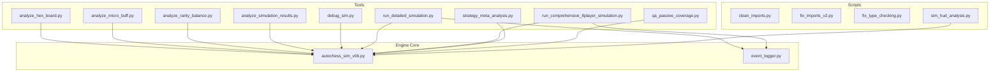

**Diagram sources**
- [analyze_hex_board.py:1-151](file://tools/analyze_hex_board.py#L1-L151)
- [analyze_micro_buff.py:1-75](file://tools/analyze_micro_buff.py#L1-L75)
- [analyze_rarity_balance.py:1-179](file://tools/analyze_rarity_balance.py#L1-L179)
- [analyze_simulation_results.py:1-278](file://tools/analyze_simulation_results.py#L1-L278)
- [debug_sim.py:1-324](file://tools/debug_sim.py#L1-L324)
- [run_detailed_simulation.py:1-427](file://tools/run_detailed_simulation.py#L1-L427)
- [run_comprehensive_8player_simulation.py:1-548](file://tools/run_comprehensive_8player_simulation.py#L1-L548)
- [strategy_meta_analysis.py:1-194](file://tools/strategy_meta_analysis.py#L1-L194)
- [qa_passive_coverage.py:1-390](file://tools/qa_passive_coverage.py#L1-L390)
- [sim_hud_analysis.py:1-418](file://scripts/sim_hud_analysis.py#L1-L418)
- [clean_imports.py:1-45](file://scripts/clean_imports.py#L1-L45)
- [fix_imports_v2.py:1-40](file://scripts/fix_imports_v2.py#L1-L40)
- [fix_type_checking.py:1-38](file://scripts/fix_type_checking.py#L1-L38)
- [autochess_sim_v06.py](file://engine_core/autochess_sim_v06.py)
- [event_logger.py](file://engine_core/event_logger.py)

**Section sources**
- [analyze_hex_board.py:1-151](file://tools/analyze_hex_board.py#L1-L151)
- [analyze_micro_buff.py:1-75](file://tools/analyze_micro_buff.py#L1-L75)
- [analyze_rarity_balance.py:1-179](file://tools/analyze_rarity_balance.py#L1-L179)
- [analyze_simulation_results.py:1-278](file://tools/analyze_simulation_results.py#L1-L278)
- [debug_sim.py:1-324](file://tools/debug_sim.py#L1-L324)
- [run_detailed_simulation.py:1-427](file://tools/run_detailed_simulation.py#L1-L427)
- [run_comprehensive_8player_simulation.py:1-548](file://tools/run_comprehensive_8player_simulation.py#L1-L548)
- [strategy_meta_analysis.py:1-194](file://tools/strategy_meta_analysis.py#L1-L194)
- [qa_passive_coverage.py:1-390](file://tools/qa_passive_coverage.py#L1-L390)
- [sim_hud_analysis.py:1-418](file://scripts/sim_hud_analysis.py#L1-L418)
- [clean_imports.py:1-45](file://scripts/clean_imports.py#L1-L45)
- [fix_imports_v2.py:1-40](file://scripts/fix_imports_v2.py#L1-L40)
- [fix_type_checking.py:1-38](file://scripts/fix_type_checking.py#L1-L38)

## Core Components
This section introduces the primary categories of tools and their roles.

- Hex board analysis tools
  - Purpose: evaluate hex grid geometry, center dominance, and positional balance for different board sizes.
  - Example: [analyze_hex_board.py:1-151](file://tools/analyze_hex_board.py#L1-L151) compares 19-hex and 37-hex boards and outlines implementation changes.

- Micro-buffer analysis tools
  - Purpose: identify cards that qualify for small power adjustments based on global averages.
  - Example: [analyze_micro_buff.py:1-75](file://tools/analyze_micro_buff.py#L1-L75) computes thresholds and lists affected cards.

- Rarity balance assessment tools
  - Purpose: compute power-per-gold efficiency across rarities and propose cost adjustments.
  - Example: [analyze_rarity_balance.py:1-179](file://tools/analyze_rarity_balance.py#L1-L179) prints current stats, proposes new costs, and documents implementation steps.

- Simulation result processing tools
  - Purpose: transform simulation outputs into comprehensive reports and summaries.
  - Example: [analyze_simulation_results.py:1-278](file://tools/analyze_simulation_results.py#L1-L278) generates strategy and card performance reports from JSON outputs.

- Debug utilities
  - Purpose: validate engine invariants, detect anomalies, and assess strategy balance.
  - Example: [debug_sim.py:1-324](file://tools/debug_sim.py#L1-L324) runs integrity checks, passive triggers, and strategy balance tests.

- Simulation orchestration tools
  - Purpose: run large-scale simulations with detailed logging and produce structured outputs.
  - Examples:
    - [run_detailed_simulation.py:1-427](file://tools/run_detailed_simulation.py#L1-L427) runs 5000 games with event logging and produces JSON/CSV reports.
    - [run_comprehensive_8player_simulation.py:1-548](file://tools/run_comprehensive_8player_simulation.py#L1-L548) runs 2000 games with 8 players per game and full logs.

- Strategy and passive analysis tools
  - Purpose: infer behavioral archetypes, audit passive coverage, and support meta analysis.
  - Examples:
    - [strategy_meta_analysis.py:1-194](file://tools/strategy_meta_analysis.py#L1-L194) summarizes behavior tags and AI strategy outcomes.
    - [qa_passive_coverage.py:1-390](file://tools/qa_passive_coverage.py#L1-L390) instruments passive triggers and measures effectiveness.

- Development utilities
  - Purpose: automate import cleaning, fix type-checking indentation, and assist HUD analysis.
  - Examples:
    - [clean_imports.py:1-45](file://scripts/clean_imports.py#L1-L45) removes redundant try/except import blocks.
    - [fix_imports_v2.py:1-40](file://scripts/fix_imports_v2.py#L1-L40) cleans and normalizes import blocks.
    - [fix_type_checking.py:1-38](file://scripts/fix_type_checking.py#L1-L38) fixes TYPE_CHECKING indentation.
    - [sim_hud_analysis.py:1-418](file://scripts/sim_hud_analysis.py#L1-L418) builds a verbose per-turn report for HUD design.

**Section sources**
- [analyze_hex_board.py:1-151](file://tools/analyze_hex_board.py#L1-L151)
- [analyze_micro_buff.py:1-75](file://tools/analyze_micro_buff.py#L1-L75)
- [analyze_rarity_balance.py:1-179](file://tools/analyze_rarity_balance.py#L1-L179)
- [analyze_simulation_results.py:1-278](file://tools/analyze_simulation_results.py#L1-L278)
- [debug_sim.py:1-324](file://tools/debug_sim.py#L1-L324)
- [run_detailed_simulation.py:1-427](file://tools/run_detailed_simulation.py#L1-L427)
- [run_comprehensive_8player_simulation.py:1-548](file://tools/run_comprehensive_8player_simulation.py#L1-L548)
- [strategy_meta_analysis.py:1-194](file://tools/strategy_meta_analysis.py#L1-L194)
- [qa_passive_coverage.py:1-390](file://tools/qa_passive_coverage.py#L1-L390)
- [sim_hud_analysis.py:1-418](file://scripts/sim_hud_analysis.py#L1-L418)
- [clean_imports.py:1-45](file://scripts/clean_imports.py#L1-L45)
- [fix_imports_v2.py:1-40](file://scripts/fix_imports_v2.py#L1-L40)
- [fix_type_checking.py:1-38](file://scripts/fix_type_checking.py#L1-L38)

## Architecture Overview
The tool ecosystem integrates with the engine core to validate correctness, assess balance, and generate actionable insights. The following diagram shows how analysis tools and utilities interact with the engine and each other.

```mermaid
graph TB
subgraph "Analysis Tools"
HB["Hex Board Analyzer<br/>analyze_hex_board.py"]
MB["Micro-Buff Analyzer<br/>analyze_micro_buff.py"]
RB["Rarity Balance Analyzer<br/>analyze_rarity_balance.py"]
SR["Simulation Results Analyzer<br/>analyze_simulation_results.py"]
DM["Debug Simulator<br/>debug_sim.py"]
SD["Detailed Simulation Runner<br/>run_detailed_simulation.py"]
S8["8-Player Simulation Runner<br/>run_comprehensive_8player_simulation.py"]
SM["Strategy Meta Analyzer<br/>strategy_meta_analysis.py"]
QC["Passive Coverage QA<br/>qa_passive_coverage.py"]
end
subgraph "Dev Utilities"
CI["Import Cleaner<br/>clean_imports.py"]
FI["Import Fixer v2<br/>fix_imports_v2.py"]
FT["Type-Checking Fixer<br/>fix_type_checking.py"]
SH["HUD Analysis Script<br/>sim_hud_analysis.py"]
end
subgraph "Engine Core"
EC["autochess_sim_v06.py"]
EL["event_logger.py"]
end
HB --> EC
MB --> EC
RB --> EC
SR --> EC
DM --> EC
SD --> EC
S8 --> EC
SM --> EC
QC --> EC
SD --> EL
S8 --> EL
SH --> EC
CI --> EC
FI --> EC
FT --> EC
```

**Diagram sources**
- [analyze_hex_board.py:1-151](file://tools/analyze_hex_board.py#L1-L151)
- [analyze_micro_buff.py:1-75](file://tools/analyze_micro_buff.py#L1-L75)
- [analyze_rarity_balance.py:1-179](file://tools/analyze_rarity_balance.py#L1-L179)
- [analyze_simulation_results.py:1-278](file://tools/analyze_simulation_results.py#L1-L278)
- [debug_sim.py:1-324](file://tools/debug_sim.py#L1-L324)
- [run_detailed_simulation.py:1-427](file://tools/run_detailed_simulation.py#L1-L427)
- [run_comprehensive_8player_simulation.py:1-548](file://tools/run_comprehensive_8player_simulation.py#L1-L548)
- [strategy_meta_analysis.py:1-194](file://tools/strategy_meta_analysis.py#L1-L194)
- [qa_passive_coverage.py:1-390](file://tools/qa_passive_coverage.py#L1-L390)
- [sim_hud_analysis.py:1-418](file://scripts/sim_hud_analysis.py#L1-L418)
- [clean_imports.py:1-45](file://scripts/clean_imports.py#L1-L45)
- [fix_imports_v2.py:1-40](file://scripts/fix_imports_v2.py#L1-L40)
- [fix_type_checking.py:1-38](file://scripts/fix_type_checking.py#L1-L38)
- [autochess_sim_v06.py](file://engine_core/autochess_sim_v06.py)
- [event_logger.py](file://engine_core/event_logger.py)

## Detailed Component Analysis

### Hex Board Optimization Tool
Purpose: Analyze hex grid geometry and center dominance to inform board size decisions.

Key capabilities:
- Compute neighbor counts and center dominance
- Compare multiple board radii
- Provide strategic implications and implementation notes

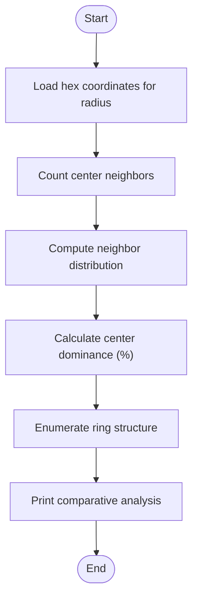

**Diagram sources**
- [analyze_hex_board.py:19-57](file://tools/analyze_hex_board.py#L19-L57)

**Section sources**
- [analyze_hex_board.py:1-151](file://tools/analyze_hex_board.py#L1-L151)

### Micro-Buffer Analysis Tool
Purpose: Identify cards eligible for small power adjustments based on global averages.

Key capabilities:
- Load card database
- Compute global average and threshold
- List cards below threshold and verify against simulation output

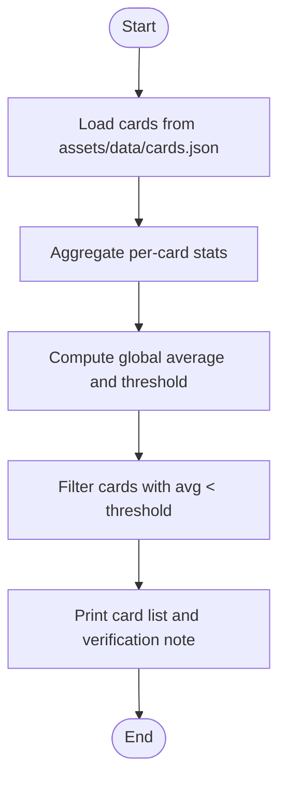

**Diagram sources**
- [analyze_micro_buff.py:8-72](file://tools/analyze_micro_buff.py#L8-L72)

**Section sources**
- [analyze_micro_buff.py:1-75](file://tools/analyze_micro_buff.py#L1-L75)

### Rarity Balance Assessment Tool
Purpose: Evaluate power-per-gold efficiency across rarities and propose cost adjustments.

Key capabilities:
- Group cards by rarity
- Compute average power and power-per-gold
- Propose new costs and print comparative analysis
- Document implementation steps

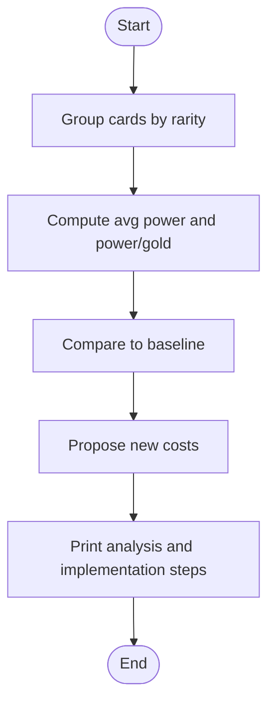

**Diagram sources**
- [analyze_rarity_balance.py:12-71](file://tools/analyze_rarity_balance.py#L12-L71)
- [analyze_rarity_balance.py:73-157](file://tools/analyze_rarity_balance.py#L73-L157)

**Section sources**
- [analyze_rarity_balance.py:1-179](file://tools/analyze_rarity_balance.py#L1-L179)

### Simulation Result Processing Tool
Purpose: Transform simulation outputs into comprehensive reports.

Key capabilities:
- Load JSON outputs
- Analyze strategy matchups and card performance
- Generate strategy and card performance reports
- Provide balance recommendations

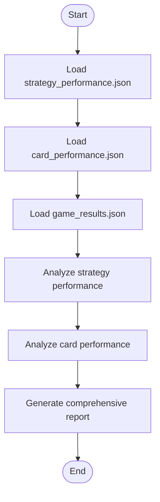

**Diagram sources**
- [analyze_simulation_results.py:12-56](file://tools/analyze_simulation_results.py#L12-L56)
- [analyze_simulation_results.py:49-251](file://tools/analyze_simulation_results.py#L49-L251)

**Section sources**
- [analyze_simulation_results.py:1-278](file://tools/analyze_simulation_results.py#L1-L278)

### Debug Utilities
Purpose: Validate engine invariants, passive triggers, and strategy balance.

Key capabilities:
- Card pool integrity checks
- Market and economy consistency checks
- Passive trigger validation
- Full game simulation and strategy balance assessment

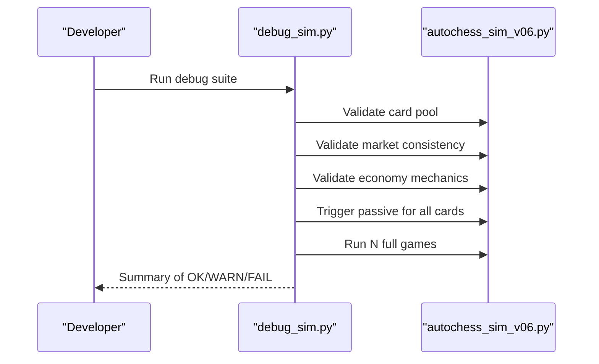

**Diagram sources**
- [debug_sim.py:45-58](file://tools/debug_sim.py#L45-L58)
- [debug_sim.py:63-144](file://tools/debug_sim.py#L63-L144)
- [debug_sim.py:147-173](file://tools/debug_sim.py#L147-L173)
- [debug_sim.py:177-294](file://tools/debug_sim.py#L177-L294)

**Section sources**
- [debug_sim.py:1-324](file://tools/debug_sim.py#L1-L324)

### Simulation Orchestration Tools
Purpose: Run large-scale simulations with detailed logging and produce structured outputs.

Key capabilities:
- Run 5000 games with event logging
- Aggregate strategy and card performance
- Save JSON/CSV reports and summary text
- Run 2000 games with 8 players per game and full logs

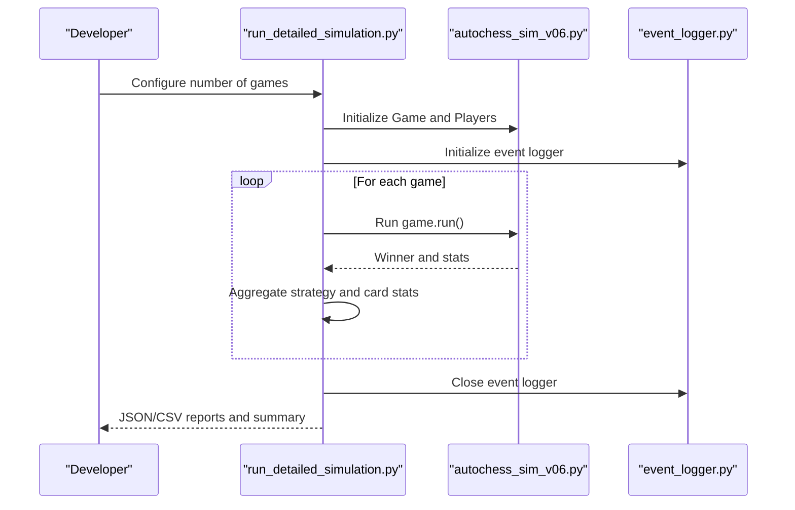

**Diagram sources**
- [run_detailed_simulation.py:72-112](file://tools/run_detailed_simulation.py#L72-L112)
- [run_detailed_simulation.py:113-168](file://tools/run_detailed_simulation.py#L113-L168)
- [run_detailed_simulation.py:170-186](file://tools/run_detailed_simulation.py#L170-L186)
- [run_detailed_simulation.py:388-406](file://tools/run_detailed_simulation.py#L388-L406)

**Section sources**
- [run_detailed_simulation.py:1-427](file://tools/run_detailed_simulation.py#L1-L427)

### Strategy and Passive Analysis Tools
Purpose: Infer behavioral archetypes, audit passive coverage, and support meta analysis.

Key capabilities:
- Infer behavior tags from game logs
- Instrument passive triggers and measure effectiveness
- Audit dispatch tables and coverage gaps

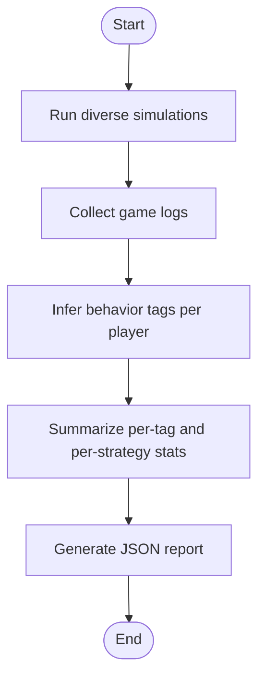

**Diagram sources**
- [strategy_meta_analysis.py:109-150](file://tools/strategy_meta_analysis.py#L109-L150)
- [strategy_meta_analysis.py:151-181](file://tools/strategy_meta_analysis.py#L151-L181)

**Section sources**
- [strategy_meta_analysis.py:1-194](file://tools/strategy_meta_analysis.py#L1-L194)

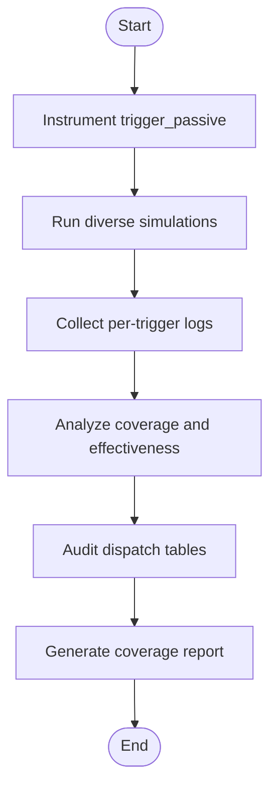

**Diagram sources**
- [qa_passive_coverage.py:149-185](file://tools/qa_passive_coverage.py#L149-L185)
- [qa_passive_coverage.py:191-229](file://tools/qa_passive_coverage.py#L191-L229)
- [qa_passive_coverage.py:318-343](file://tools/qa_passive_coverage.py#L318-L343)

**Section sources**
- [qa_passive_coverage.py:1-390](file://tools/qa_passive_coverage.py#L1-L390)

### Development Utilities
Purpose: Automate import cleaning, fix type-checking indentation, and assist HUD analysis.

Key capabilities:
- Clean redundant try/except import blocks
- Normalize import blocks and fix indentation
- Build verbose per-turn HUD analysis report

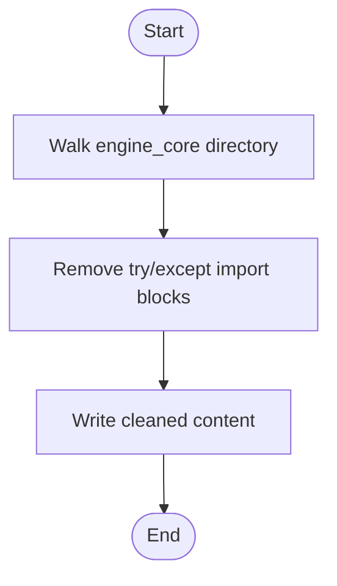

**Diagram sources**
- [clean_imports.py:4-41](file://scripts/clean_imports.py#L4-L41)

**Section sources**
- [clean_imports.py:1-45](file://scripts/clean_imports.py#L1-L45)
- [fix_imports_v2.py:1-40](file://scripts/fix_imports_v2.py#L1-L40)
- [fix_type_checking.py:1-38](file://scripts/fix_type_checking.py#L1-L38)
- [sim_hud_analysis.py:1-418](file://scripts/sim_hud_analysis.py#L1-L418)

## Dependency Analysis
The tools depend on the engine core for game logic, card pools, and event logging. The following diagram highlights key dependencies.

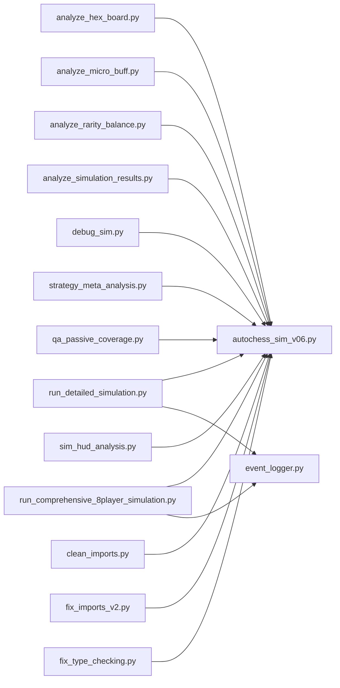

**Diagram sources**
- [analyze_hex_board.py:1-151](file://tools/analyze_hex_board.py#L1-L151)
- [analyze_micro_buff.py:1-75](file://tools/analyze_micro_buff.py#L1-L75)
- [analyze_rarity_balance.py:1-179](file://tools/analyze_rarity_balance.py#L1-L179)
- [analyze_simulation_results.py:1-278](file://tools/analyze_simulation_results.py#L1-L278)
- [debug_sim.py:1-324](file://tools/debug_sim.py#L1-L324)
- [run_detailed_simulation.py:1-427](file://tools/run_detailed_simulation.py#L1-L427)
- [run_comprehensive_8player_simulation.py:1-548](file://tools/run_comprehensive_8player_simulation.py#L1-L548)
- [strategy_meta_analysis.py:1-194](file://tools/strategy_meta_analysis.py#L1-L194)
- [qa_passive_coverage.py:1-390](file://tools/qa_passive_coverage.py#L1-L390)
- [sim_hud_analysis.py:1-418](file://scripts/sim_hud_analysis.py#L1-L418)
- [clean_imports.py:1-45](file://scripts/clean_imports.py#L1-L45)
- [fix_imports_v2.py:1-40](file://scripts/fix_imports_v2.py#L1-L40)
- [fix_type_checking.py:1-38](file://scripts/fix_type_checking.py#L1-L38)
- [autochess_sim_v06.py](file://engine_core/autochess_sim_v06.py)
- [event_logger.py](file://engine_core/event_logger.py)

**Section sources**
- [autochess_sim_v06.py](file://engine_core/autochess_sim_v06.py)
- [event_logger.py](file://engine_core/event_logger.py)

## Performance Considerations
- Batch processing: Tools like [run_detailed_simulation.py:72-112](file://tools/run_detailed_simulation.py#L72-L112) and [run_comprehensive_8player_simulation.py:124-144](file://tools/run_comprehensive_8player_simulation.py#L124-L144) process thousands of games; configure seeds and progress reporting to manage runtime.
- Logging overhead: Event logging in [run_detailed_simulation.py:62-62](file://tools/run_detailed_simulation.py#L62-L62) and [run_comprehensive_8player_simulation.py:48-76](file://tools/run_comprehensive_8player_simulation.py#L48-L76) generates substantial output; ensure disk space and I/O capacity.
- Memory footprint: Large reports and logs can grow quickly; periodically prune or stream outputs as needed.
- Type-checking fixes: [fix_type_checking.py:8-28](file://scripts/fix_type_checking.py#L8-L28) ensures proper indentation for TYPE_CHECKING blocks to avoid runtime overhead during type-checking phases.

[No sources needed since this section provides general guidance]

## Troubleshooting Guide
Common issues and resolutions:
- Import inconsistencies
  - Symptom: Mixed try/except import blocks
  - Resolution: Use [clean_imports.py:25-36](file://scripts/clean_imports.py#L25-L36) or [fix_imports_v2.py:4-34](file://scripts/fix_imports_v2.py#L4-L34) to normalize imports
- Type-checking indentation errors
  - Symptom: Incorrect indentation inside TYPE_CHECKING blocks
  - Resolution: Apply [fix_type_checking.py:8-28](file://scripts/fix_type_checking.py#L8-L28)
- Simulation stability
  - Symptom: Crashes or long games
  - Resolution: Run [debug_sim.py:177-294](file://tools/debug_sim.py#L177-L294) to validate engine invariants and strategy balance
- Passive coverage gaps
  - Symptom: Some passives not triggering or ineffective
  - Resolution: Use [qa_passive_coverage.py:149-185](file://tools/qa_passive_coverage.py#L149-L185) to instrument and audit coverage

**Section sources**
- [clean_imports.py:1-45](file://scripts/clean_imports.py#L1-L45)
- [fix_imports_v2.py:1-40](file://scripts/fix_imports_v2.py#L1-L40)
- [fix_type_checking.py:1-38](file://scripts/fix_type_checking.py#L1-L38)
- [debug_sim.py:1-324](file://tools/debug_sim.py#L1-L324)
- [qa_passive_coverage.py:1-390](file://tools/qa_passive_coverage.py#L1-L390)

## Conclusion
The Development Tools and Utilities provide a robust toolkit for validating engine correctness, assessing balance, and generating actionable insights. By integrating hex board analysis, micro-buffer evaluation, rarity cost modeling, simulation orchestration, and QA tools, teams can maintain quality and iterate efficiently. Automation scripts further streamline development workflows, ensuring consistent code hygiene and reliable outputs.

[No sources needed since this section summarizes without analyzing specific files]

## Appendices
- Workflow integration examples
  - Hex board sizing: Run [analyze_hex_board.py:133-151](file://tools/analyze_hex_board.py#L133-L151) and apply suggested changes to [autochess_sim_v06.py](file://engine_core/autochess_sim_v06.py).
  - Micro-buff verification: Run [analyze_micro_buff.py:21-72](file://tools/analyze_micro_buff.py#L21-L72) and cross-check simulation output.
  - Rarity cost rebalance: Run [analyze_rarity_balance.py:159-178](file://tools/analyze_rarity_balance.py#L159-L178) and update [autochess_sim_v06.py](file://engine_core/autochess_sim_v06.py).
  - Simulation runs: Use [run_detailed_simulation.py:388-406](file://tools/run_detailed_simulation.py#L388-L406) and [run_comprehensive_8player_simulation.py:503-527](file://tools/run_comprehensive_8player_simulation.py#L503-L527) to generate reports in output directories.
  - Debugging: Execute [debug_sim.py:1-324](file://tools/debug_sim.py#L1-L324) to validate engine invariants and strategy balance.
  - Import cleaning: Run [clean_imports.py:44-45](file://scripts/clean_imports.py#L44-L45), [fix_imports_v2.py:36-40](file://scripts/fix_imports_v2.py#L36-L40), and [fix_type_checking.py:34-38](file://scripts/fix_type_checking.py#L34-L38).
  - HUD analysis: Run [sim_hud_analysis.py:416-418](file://scripts/sim_hud_analysis.py#L416-L418) to produce a verbose per-turn report.

[No sources needed since this section provides general guidance]