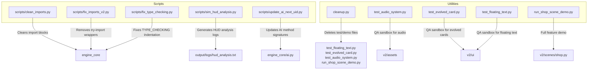
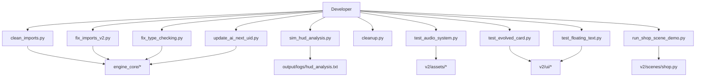
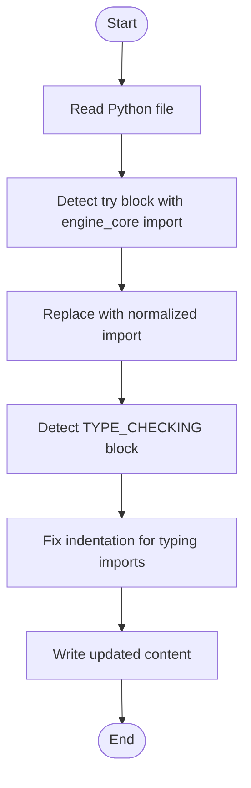
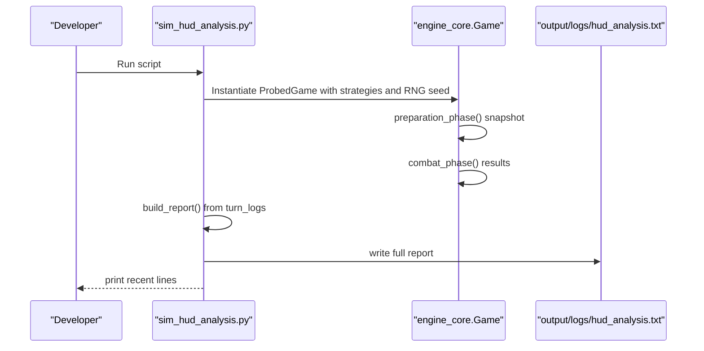
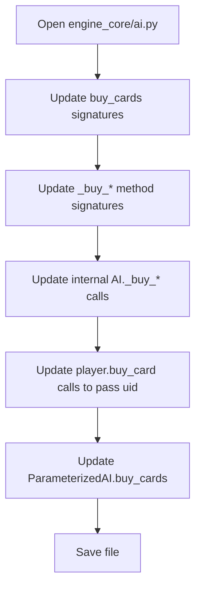
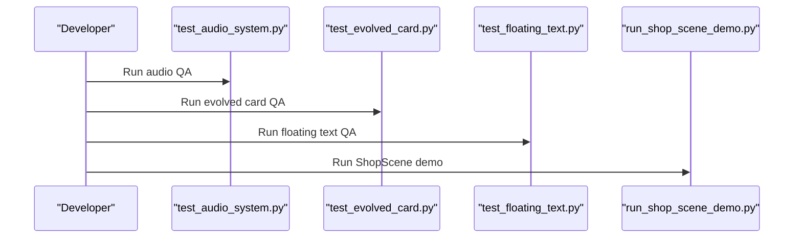
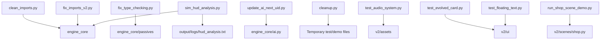

# Development Utilities

<cite>
**Referenced Files in This Document**
- [clean_imports.py](file://scripts/clean_imports.py)
- [fix_imports_v2.py](file://scripts/fix_imports_v2.py)
- [fix_type_checking.py](file://scripts/fix_type_checking.py)
- [sim_hud_analysis.py](file://scripts/sim_hud_analysis.py)
- [update_ai_next_uid.py](file://scripts/update_ai_next_uid.py)
- [cleanup.py](file://cleanup.py)
- [test_audio_system.py](file://test_audio_system.py)
- [test_evolved_card.py](file://test_evolved_card.py)
- [test_floating_text.py](file://test_floating_text.py)
- [run_shop_scene_demo.py](file://run_shop_scene_demo.py)
</cite>

## Table of Contents
1. [Introduction](#introduction)
2. [Project Structure](#project-structure)
3. [Core Components](#core-components)
4. [Architecture Overview](#architecture-overview)
5. [Detailed Component Analysis](#detailed-component-analysis)
6. [Dependency Analysis](#dependency-analysis)
7. [Performance Considerations](#performance-considerations)
8. [Troubleshooting Guide](#troubleshooting-guide)
9. [Conclusion](#conclusion)

## Introduction
This document covers the Development Utilities designed to improve developer productivity during development. It focuses on:
- Import path cleaning utilities to resolve circular dependencies and module import issues
- Type checking fix utilities for Python static analysis hygiene
- HUD analysis tools for user interface validation and data-driven UI decisions
- AI UID update utilities for evolving AI interfaces
- Cleanup scripts for development environment maintenance
- Testing utilities for audio systems, evolved cards, and floating text elements
- Step-by-step usage instructions, common use cases, and integration with development workflows

## Project Structure
The development utilities are primarily located under the scripts directory and scattered around the repository for targeted tasks. The following diagram shows the relationship between the utility modules and their primary targets.

**Diagram sources**
- [clean_imports.py:1-45](file://scripts/clean_imports.py#L1-L45)
- [fix_imports_v2.py:1-40](file://scripts/fix_imports_v2.py#L1-L40)
- [fix_type_checking.py:1-38](file://scripts/fix_type_checking.py#L1-L38)
- [sim_hud_analysis.py:1-418](file://scripts/sim_hud_analysis.py#L1-L418)
- [update_ai_next_uid.py:1-51](file://scripts/update_ai_next_uid.py#L1-L51)
- [cleanup.py:1-7](file://cleanup.py#L1-L7)
- [test_audio_system.py:1-148](file://test_audio_system.py#L1-L148)
- [test_evolved_card.py:1-87](file://test_evolved_card.py#L1-L87)
- [test_floating_text.py:1-90](file://test_floating_text.py#L1-L90)
- [run_shop_scene_demo.py:1-61](file://run_shop_scene_demo.py#L1-L61)

**Section sources**
- [clean_imports.py:1-45](file://scripts/clean_imports.py#L1-L45)
- [fix_imports_v2.py:1-40](file://scripts/fix_imports_v2.py#L1-L40)
- [fix_type_checking.py:1-38](file://scripts/fix_type_checking.py#L1-L38)
- [sim_hud_analysis.py:1-418](file://scripts/sim_hud_analysis.py#L1-L418)
- [update_ai_next_uid.py:1-51](file://scripts/update_ai_next_uid.py#L1-L51)
- [cleanup.py:1-7](file://cleanup.py#L1-L7)
- [test_audio_system.py:1-148](file://test_audio_system.py#L1-L148)
- [test_evolved_card.py:1-87](file://test_evolved_card.py#L1-L87)
- [test_floating_text.py:1-90](file://test_floating_text.py#L1-L90)
- [run_shop_scene_demo.py:1-61](file://run_shop_scene_demo.py#L1-L61)

## Core Components
- Import Path Cleaning Utilities
  - Purpose: Remove legacy try-except ImportError blocks and normalize import statements for engine_core to reduce circular dependencies and simplify imports.
  - Files: [clean_imports.py:1-45](file://scripts/clean_imports.py#L1-L45), [fix_imports_v2.py:1-40](file://scripts/fix_imports_v2.py#L1-L40)
- Type Checking Fix Utilities
  - Purpose: Normalize indentation inside TYPE_CHECKING blocks to satisfy static analysis expectations.
  - File: [fix_type_checking.py:1-38](file://scripts/fix_type_checking.py#L1-L38)
- HUD Analysis Tools
  - Purpose: Run a verbose single-match simulation and produce a structured HUD analysis report and a detailed log file for UI validation.
  - File: [sim_hud_analysis.py:1-418](file://scripts/sim_hud_analysis.py#L1-L418)
- AI UID Update Utilities
  - Purpose: Update AI method signatures and calls to support a next_uid_fn parameter for deterministic UID assignment.
  - File: [update_ai_next_uid.py:1-51](file://scripts/update_ai_next_uid.py#L1-L51)
- Cleanup Scripts
  - Purpose: Remove temporary test/demo files from the repository root to keep the working directory tidy.
  - File: [cleanup.py:1-7](file://cleanup.py#L1-L7)
- Testing Utilities
  - Purpose: QA sandboxes for audio systems, evolved cards, and floating text elements; also a full ShopScene demo integrating all three.
  - Files: [test_audio_system.py:1-148](file://test_audio_system.py#L1-L148), [test_evolved_card.py:1-87](file://test_evolved_card.py#L1-L87), [test_floating_text.py:1-90](file://test_floating_text.py#L1-L90), [run_shop_scene_demo.py:1-61](file://run_shop_scene_demo.py#L1-L61)

**Section sources**
- [clean_imports.py:1-45](file://scripts/clean_imports.py#L1-L45)
- [fix_imports_v2.py:1-40](file://scripts/fix_imports_v2.py#L1-L40)
- [fix_type_checking.py:1-38](file://scripts/fix_type_checking.py#L1-L38)
- [sim_hud_analysis.py:1-418](file://scripts/sim_hud_analysis.py#L1-L418)
- [update_ai_next_uid.py:1-51](file://scripts/update_ai_next_uid.py#L1-L51)
- [cleanup.py:1-7](file://cleanup.py#L1-L7)
- [test_audio_system.py:1-148](file://test_audio_system.py#L1-L148)
- [test_evolved_card.py:1-87](file://test_evolved_card.py#L1-L87)
- [test_floating_text.py:1-90](file://test_floating_text.py#L1-L90)
- [run_shop_scene_demo.py:1-61](file://run_shop_scene_demo.py#L1-L61)

## Architecture Overview
The development utilities form a cohesive toolkit that supports refactoring, validation, and QA. The following diagram shows how the utilities interact with the codebase and outputs.

**Diagram sources**
- [clean_imports.py:1-45](file://scripts/clean_imports.py#L1-L45)
- [fix_imports_v2.py:1-40](file://scripts/fix_imports_v2.py#L1-L40)
- [fix_type_checking.py:1-38](file://scripts/fix_type_checking.py#L1-L38)
- [sim_hud_analysis.py:1-418](file://scripts/sim_hud_analysis.py#L1-L418)
- [update_ai_next_uid.py:1-51](file://scripts/update_ai_next_uid.py#L1-L51)
- [cleanup.py:1-7](file://cleanup.py#L1-L7)
- [test_audio_system.py:1-148](file://test_audio_system.py#L1-L148)
- [test_evolved_card.py:1-87](file://test_evolved_card.py#L1-L87)
- [test_floating_text.py:1-90](file://test_floating_text.py#L1-L90)
- [run_shop_scene_demo.py:1-61](file://run_shop_scene_demo.py#L1-L61)

## Detailed Component Analysis

### Import Path Cleaning Utilities
These utilities address legacy import patterns that can cause circular dependencies and confusion for static analysis and IDEs.

- clean_imports.py
  - Removes try-except ImportError blocks wrapping engine_core imports and normalizes remaining imports.
  - Targets engine_core directory recursively.
  - Typical usage: python scripts/clean_imports.py
  - Expected outcome: Simplified imports and reduced risk of import-time errors.
  - Section sources
    - [clean_imports.py:1-45](file://scripts/clean_imports.py#L1-L45)

- fix_imports_v2.py
  - Strips standalone try blocks preceding engine_core imports and cleans up indentation.
  - Walks engine_core and fixes files in place.
  - Typical usage: python scripts/fix_imports_v2.py
  - Expected outcome: Consistent import statements without obsolete try-import wrappers.
  - Section sources
    - [fix_imports_v2.py:1-40](file://scripts/fix_imports_v2.py#L1-L40)

- fix_type_checking.py
  - Ensures imports inside TYPE_CHECKING blocks are properly indented so static analyzers recognize them as typing-only.
  - Operates on engine_core/passives.
  - Typical usage: python scripts/fix_type_checking.py
  - Expected outcome: Static analysis passes without indentation warnings for typing imports.
  - Section sources
    - [fix_type_checking.py:1-38](file://scripts/fix_type_checking.py#L1-L38)

**Diagram sources**
- [clean_imports.py:25-36](file://scripts/clean_imports.py#L25-L36)
- [fix_imports_v2.py:11-26](file://scripts/fix_imports_v2.py#L11-L26)
- [fix_type_checking.py:14-27](file://scripts/fix_type_checking.py#L14-L27)

### HUD Analysis Tools
The HUD analysis tool runs a verbose single-match simulation and produces a structured report and a detailed log for UI validation and data-driven design decisions.

- sim_hud_analysis.py
  - Adds project root to sys.path to enable imports from engine_core.
  - Runs a ProbedGame subclass that snapshots preparation and combat phases.
  - Aggregates synergy, combo, kill, damage, and passive trigger data per turn.
  - Writes a summary report to output/logs/hud_analysis.txt and prints a recent portion to console.
  - Typical usage: python scripts/sim_hud_analysis.py
  - Expected outcome: A comprehensive HUD analysis report and a detailed log file for review.
  - Section sources
    - [sim_hud_analysis.py:1-418](file://scripts/sim_hud_analysis.py#L1-L418)

**Diagram sources**
- [sim_hud_analysis.py:383-414](file://scripts/sim_hud_analysis.py#L383-L414)

### AI UID Update Utilities
This utility updates AI method signatures and internal calls to accept a next_uid_fn parameter for deterministic UID assignment.

- update_ai_next_uid.py
  - Updates buy_cards method signatures in AI and related methods to include next_uid_fn.
  - Updates internal calls to pass uid=next_uid_fn() if provided.
  - Updates ParameterizedAI.buy_cards signature and call site.
  - Typical usage: python scripts/update_ai_next_uid.py
  - Expected outcome: AI methods accept optional next_uid_fn for deterministic card UID generation.
  - Section sources
    - [update_ai_next_uid.py:1-51](file://scripts/update_ai_next_uid.py#L1-L51)

**Diagram sources**
- [update_ai_next_uid.py:9-44](file://scripts/update_ai_next_uid.py#L9-L44)

### Cleanup Scripts
Cleanup utilities remove temporary test/demo files from the repository root to maintain a clean working directory.

- cleanup.py
  - Deletes test_floating_text.py, test_evolved_card.py, test_audio_system.py, and run_shop_scene_demo.py if present.
  - Typical usage: python cleanup.py
  - Expected outcome: Temporary QA/demo files removed from repository root.
  - Section sources
    - [cleanup.py:1-7](file://cleanup.py#L1-L7)

### Testing Utilities
QA sandboxes and demos for audio systems, evolved cards, and floating text elements.

- test_audio_system.py
  - Initializes pygame mixer, loads assets via AssetLoader, and provides interactive controls for SFX and music tracks.
  - Includes sliders for master volume and SFX volume.
  - Typical usage: python test_audio_system.py
  - Expected outcome: Interactive QA sandbox for audio systems.
  - Section sources
    - [test_audio_system.py:1-148](file://test_audio_system.py#L1-L148)

- test_evolved_card.py
  - Renders a CardFlip widget and toggles evolved mode with a platinum glow effect.
  - Provides buttons to evolve and flip the card.
  - Typical usage: python test_evolved_card.py
  - Expected outcome: QA sandbox for evolved card visuals and animations.
  - Section sources
    - [test_evolved_card.py:1-87](file://test_evolved_card.py#L1-L87)

- test_floating_text.py
  - Spawns FloatingText entries at random positions and manages their lifecycle.
  - Includes FPS toggle and active count display.
  - Typical usage: python test_floating_text.py
  - Expected outcome: QA sandbox for floating text rendering and performance.
  - Section sources
    - [test_floating_text.py:1-90](file://test_floating_text.py#L1-L90)

- run_shop_scene_demo.py
  - Full feature demo integrating FloatingText, evolved cards, and audio within a ShopScene using a MockGame.
  - Typical usage: python run_shop_scene_demo.py
  - Expected outcome: End-to-end QA demo showcasing UI elements in a real scene.
  - Section sources
    - [run_shop_scene_demo.py:1-61](file://run_shop_scene_demo.py#L1-L61)

**Diagram sources**
- [test_audio_system.py:19-80](file://test_audio_system.py#L19-L80)
- [test_evolved_card.py:24-77](file://test_evolved_card.py#L24-L77)
- [test_floating_text.py:17-64](file://test_floating_text.py#L17-L64)
- [run_shop_scene_demo.py:18-56](file://run_shop_scene_demo.py#L18-L56)

## Dependency Analysis
The utilities depend on specific modules and directories. The following diagram shows key dependencies.

**Diagram sources**
- [clean_imports.py:4-41](file://scripts/clean_imports.py#L4-L41)
- [fix_imports_v2.py:36-39](file://scripts/fix_imports_v2.py#L36-L39)
- [fix_type_checking.py:34-37](file://scripts/fix_type_checking.py#L34-L37)
- [sim_hud_analysis.py:19-38](file://scripts/sim_hud_analysis.py#L19-L38)
- [update_ai_next_uid.py](file://scripts/update_ai_next_uid.py#L50)
- [cleanup.py:2-6](file://cleanup.py#L2-L6)
- [test_audio_system.py:3-31](file://test_audio_system.py#L3-L31)
- [test_evolved_card.py:3-33](file://test_evolved_card.py#L3-L33)
- [test_floating_text.py:4-24](file://test_floating_text.py#L4-L24)
- [run_shop_scene_demo.py:12-32](file://run_shop_scene_demo.py#L12-L32)

**Section sources**
- [clean_imports.py:1-45](file://scripts/clean_imports.py#L1-L45)
- [fix_imports_v2.py:1-40](file://scripts/fix_imports_v2.py#L1-L40)
- [fix_type_checking.py:1-38](file://scripts/fix_type_checking.py#L1-L38)
- [sim_hud_analysis.py:1-418](file://scripts/sim_hud_analysis.py#L1-L418)
- [update_ai_next_uid.py:1-51](file://scripts/update_ai_next_uid.py#L1-L51)
- [cleanup.py:1-7](file://cleanup.py#L1-L7)
- [test_audio_system.py:1-148](file://test_audio_system.py#L1-L148)
- [test_evolved_card.py:1-87](file://test_evolved_card.py#L1-L87)
- [test_floating_text.py:1-90](file://test_floating_text.py#L1-L90)
- [run_shop_scene_demo.py:1-61](file://run_shop_scene_demo.py#L1-L61)

## Performance Considerations
- Import cleaning reduces runtime overhead from redundant try-except blocks and improves import resolution speed.
- HUD analysis generates detailed logs; consider running with a fixed RNG seed for reproducibility and limiting verbosity in CI.
- QA sandboxes use pygame; keep window sizes reasonable and avoid excessive rendering for performance-sensitive environments.
- Cleanup removes unnecessary files to prevent accidental inclusion in commits and reduce repository clutter.

## Troubleshooting Guide
- Import cleaning does not change logic; if tests fail after cleaning, verify that all engine_core imports are valid and that no relative imports were inadvertently altered.
- TYPE_CHECKING indentation fixes are crucial for static analyzers; ensure the script runs against the intended directories.
- HUD analysis requires engine_core to be importable; ensure the project root is on sys.path before running.
- AI UID updates modify method signatures; ensure downstream code passing AI.buy_cards is updated accordingly.
- Cleanup removes files; if needed, regenerate test/demo files or revert changes using version control.

**Section sources**
- [clean_imports.py:12-36](file://scripts/clean_imports.py#L12-L36)
- [fix_type_checking.py:8-27](file://scripts/fix_type_checking.py#L8-L27)
- [sim_hud_analysis.py:19-21](file://scripts/sim_hud_analysis.py#L19-L21)
- [update_ai_next_uid.py:9-44](file://scripts/update_ai_next_uid.py#L9-L44)
- [cleanup.py:2-6](file://cleanup.py#L2-L6)

## Conclusion
The Development Utilities streamline refactoring, validation, and QA workflows. By automating import normalization, static analysis hygiene, HUD data collection, AI interface updates, and environment cleanup, developers can focus on building features while maintaining code quality and UI fidelity. Integrate these utilities into local development and CI pipelines to maximize productivity and consistency.