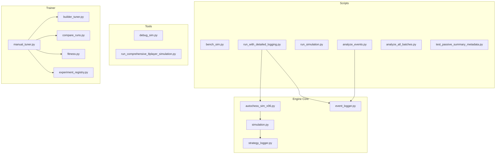
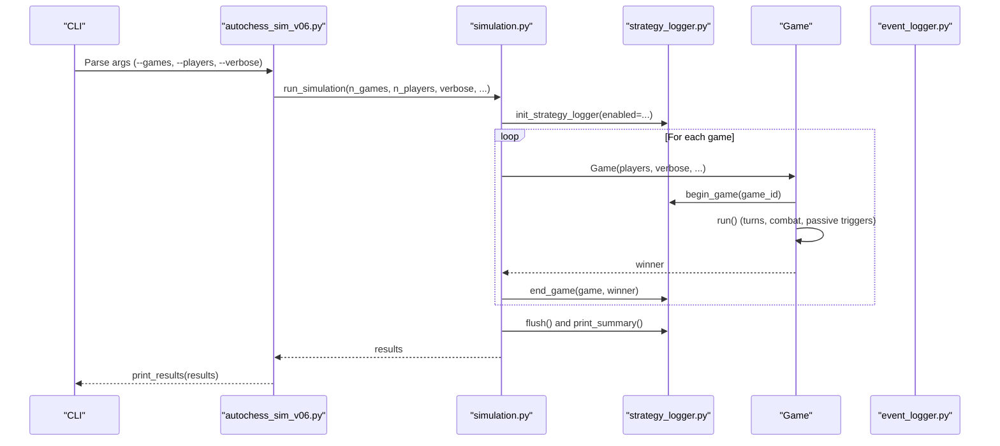
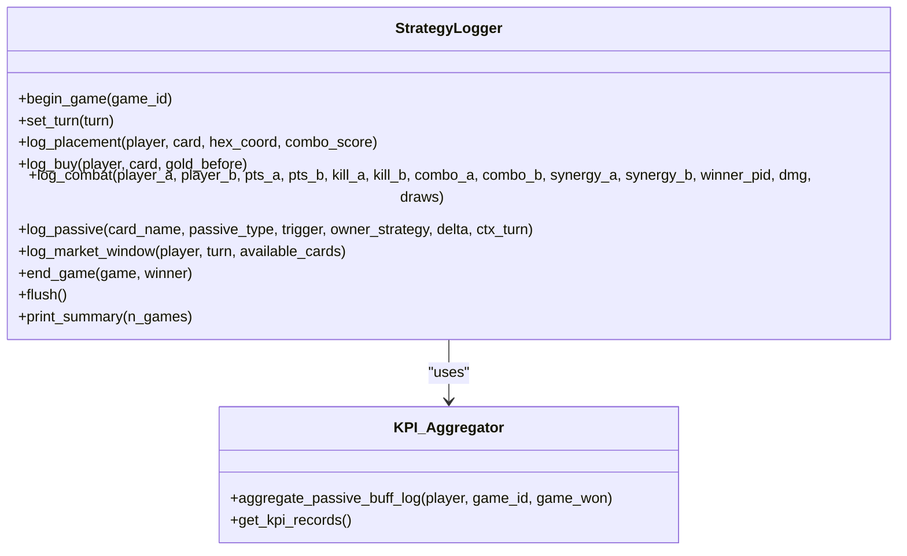
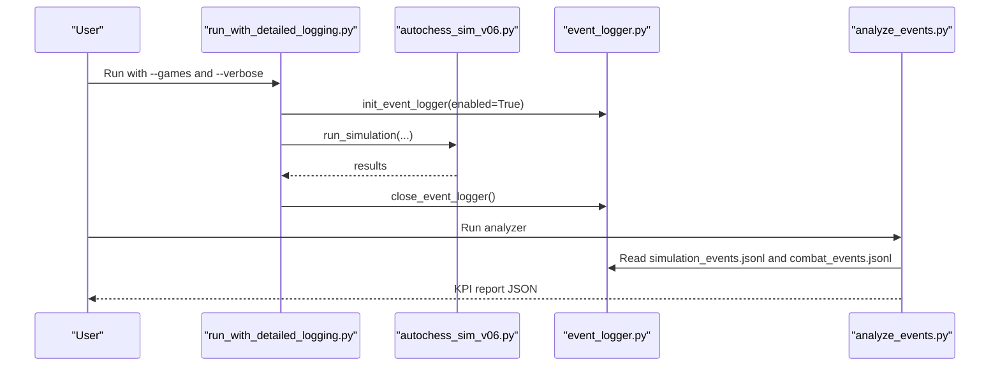
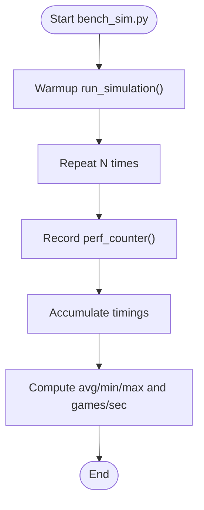
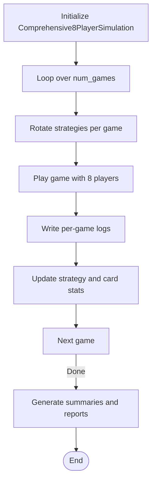
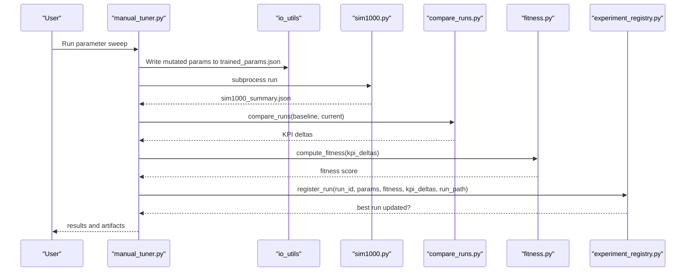
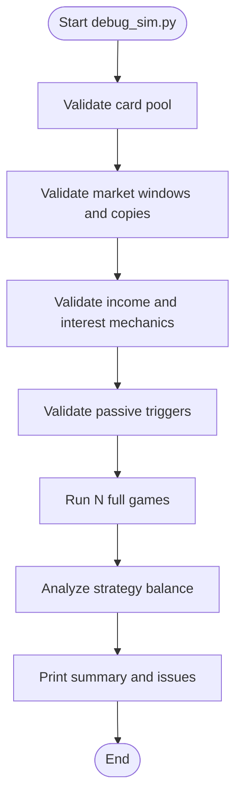
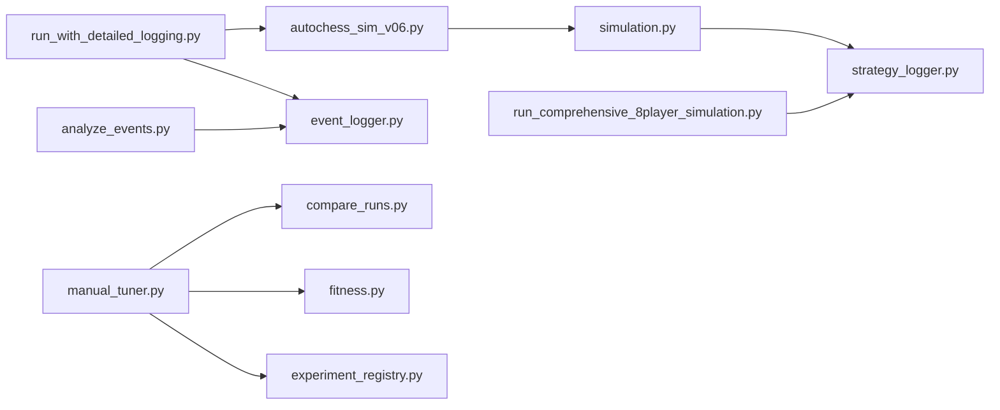

# Simulation and Automation

<cite>
**Referenced Files in This Document**
- [autochess_sim_v06.py](file://engine_core/autochess_sim_v06.py)
- [simulation.py](file://engine_core/simulation.py)
- [event_logger.py](file://engine_core/event_logger.py)
- [strategy_logger.py](file://engine_core/strategy_logger.py)
- [bench_sim.py](file://scripts/simulation/bench_sim.py)
- [run_with_detailed_logging.py](file://scripts/simulation/run_with_detailed_logging.py)
- [run_simulation.py](file://scripts/simulation/run_simulation.py)
- [analyze_events.py](file://scripts/analysis/analyze_events.py)
- [analyze_all_batches.py](file://scripts/simulation/analyze_all_batches.py)
- [test_passive_summary_metadata.py](file://scripts/simulation/test_passive_summary_metadata.py)
- [debug_sim.py](file://tools/debug_sim.py)
- [run_comprehensive_8player_simulation.py](file://tools/run_comprehensive_8player_simulation.py)
- [manual_tuner.py](file://trainer/manual_tuner.py)
- [builder_tuner.py](file://trainer/builder_tuner.py)
- [compare_runs.py](file://trainer/compare_runs.py)
- [fitness.py](file://trainer/fitness.py)
- [experiment_registry.py](file://trainer/experiment_registry.py)
</cite>

## Table of Contents
1. [Introduction](#introduction)
2. [Project Structure](#project-structure)
3. [Core Components](#core-components)
4. [Architecture Overview](#architecture-overview)
5. [Detailed Component Analysis](#detailed-component-analysis)
6. [Dependency Analysis](#dependency-analysis)
7. [Performance Considerations](#performance-considerations)
8. [Troubleshooting Guide](#troubleshooting-guide)
9. [Conclusion](#conclusion)
10. [Appendices](#appendices)

## Introduction
This document covers the Simulation and Automation subsystems used for high-throughput AI performance testing, benchmark simulation tools, and comprehensive logging for debugging complex scenarios. It explains:
- Batch simulation runners for throughput testing
- Benchmark simulation tools for performance measurement
- Event logging validation tools and passive summary metadata testing
- Comprehensive 8-player simulation frameworks
- Experiment management, trainer modules for AI parameter optimization, and automated analysis pipelines
- Practical workflows, benchmarking procedures, and experimental design patterns

## Project Structure
The Simulation and Automation domain spans several modules:
- Engine core simulation and logging
- Scripts for batch and benchmarking
- Tools for comprehensive simulations and debugging
- Trainer modules for experiment orchestration and fitness scoring
- Analysis scripts for event logs and batch summaries

**Diagram sources**
- [autochess_sim_v06.py:1-107](file://engine_core/autochess_sim_v06.py#L1-L107)
- [simulation.py:1-284](file://engine_core/simulation.py#L1-L284)
- [event_logger.py:1-251](file://engine_core/event_logger.py#L1-L251)
- [strategy_logger.py:1-591](file://engine_core/strategy_logger.py#L1-L591)
- [bench_sim.py:1-24](file://scripts/simulation/bench_sim.py#L1-L24)
- [run_with_detailed_logging.py:1-87](file://scripts/simulation/run_with_detailed_logging.py#L1-L87)
- [run_simulation.py:221-268](file://scripts/simulation/run_simulation.py#L221-L268)
- [analyze_events.py:1-253](file://scripts/analysis/analyze_events.py#L1-L253)
- [analyze_all_batches.py:1-114](file://scripts/simulation/analyze_all_batches.py#L1-L114)
- [test_passive_summary_metadata.py:1-80](file://scripts/simulation/test_passive_summary_metadata.py#L1-L80)
- [debug_sim.py:1-324](file://tools/debug_sim.py#L1-L324)
- [run_comprehensive_8player_simulation.py:55-547](file://tools/run_comprehensive_8player_simulation.py#L55-L547)
- [manual_tuner.py:1-497](file://trainer/manual_tuner.py#L1-L497)
- [builder_tuner.py:207-242](file://trainer/builder_tuner.py#L207-L242)
- [compare_runs.py:1-274](file://trainer/compare_runs.py#L1-L274)
- [fitness.py:1-175](file://trainer/fitness.py#L1-L175)
- [experiment_registry.py:1-144](file://trainer/experiment_registry.py#L1-L144)

**Section sources**
- [autochess_sim_v06.py:1-107](file://engine_core/autochess_sim_v06.py#L1-L107)
- [simulation.py:1-284](file://engine_core/simulation.py#L1-L284)

## Core Components
- Simulation engine entry and runner: orchestrates game runs, strategy logging, and result aggregation.
- Strategy analytics logger: produces strategy_summary.json, passive_summary.json, kpi_training.json, and passive_efficiency_kpi.jsonl.
- Event logger: optional detailed event logging for card purchases, placements, combat, synergies, and passive triggers.
- Benchmarking and batch tools: measure performance and aggregate batch results.
- Debugging and comprehensive simulation tools: validate engine consistency and run large-scale 8-player simulations.
- Trainer modules: parameter sweep orchestration, run comparison, fitness computation, and experiment registry.

**Section sources**
- [simulation.py:113-218](file://engine_core/simulation.py#L113-L218)
- [strategy_logger.py:52-591](file://engine_core/strategy_logger.py#L52-L591)
- [event_logger.py:22-251](file://engine_core/event_logger.py#L22-L251)
- [bench_sim.py:1-24](file://scripts/simulation/bench_sim.py#L1-L24)
- [debug_sim.py:1-324](file://tools/debug_sim.py#L1-L324)
- [run_comprehensive_8player_simulation.py:78-547](file://tools/run_comprehensive_8player_simulation.py#L78-L547)
- [manual_tuner.py:1-497](file://trainer/manual_tuner.py#L1-L497)
- [compare_runs.py:35-199](file://trainer/compare_runs.py#L35-L199)
- [fitness.py:48-148](file://trainer/fitness.py#L48-L148)
- [experiment_registry.py:39-94](file://trainer/experiment_registry.py#L39-L94)

## Architecture Overview
The simulation pipeline integrates engine core mechanics with logging, benchmarking, and experiment orchestration.

**Diagram sources**
- [autochess_sim_v06.py:78-106](file://engine_core/autochess_sim_v06.py#L78-L106)
- [simulation.py:113-218](file://engine_core/simulation.py#L113-L218)
- [strategy_logger.py:578-591](file://engine_core/strategy_logger.py#L578-L591)

## Detailed Component Analysis

### Simulation Engine and Strategy Analytics
- Simulation runner aggregates per-strategy metrics, writes logs, and flushes strategy analytics.
- Strategy logger maintains counters and summaries for placement, combat, economy, passive efficiency, and KPI training vectors.
- Passive efficiency KPIs are persisted separately and linked via metadata in passive_summary.json.

**Diagram sources**
- [strategy_logger.py:52-591](file://engine_core/strategy_logger.py#L52-L591)

**Section sources**
- [simulation.py:113-218](file://engine_core/simulation.py#L113-L218)
- [strategy_logger.py:325-523](file://engine_core/strategy_logger.py#L325-L523)

### Event Logging and Validation
- Event logger optionally captures detailed events and flushes buffers to JSONL files.
- Event analyzer reads event logs and generates KPI reports without modifying existing KPI systems.
- Passive summary metadata test validates that passive_summary.json includes required metadata referencing detailed KPI files.

**Diagram sources**
- [run_with_detailed_logging.py:17-74](file://scripts/simulation/run_with_detailed_logging.py#L17-L74)
- [event_logger.py:224-251](file://engine_core/event_logger.py#L224-L251)
- [autochess_sim_v06.py:99-106](file://engine_core/autochess_sim_v06.py#L99-L106)
- [analyze_events.py:16-247](file://scripts/analysis/analyze_events.py#L16-L247)

**Section sources**
- [event_logger.py:22-251](file://engine_core/event_logger.py#L22-L251)
- [run_with_detailed_logging.py:17-74](file://scripts/simulation/run_with_detailed_logging.py#L17-L74)
- [analyze_events.py:16-247](file://scripts/analysis/analyze_events.py#L16-L247)
- [test_passive_summary_metadata.py:18-80](file://scripts/simulation/test_passive_summary_metadata.py#L18-L80)

### Benchmark Simulation Tools
- Bench script measures average time and throughput for repeated runs with fixed parameters.
- Determinism checks and result writing are integrated into a dedicated runner script.

**Diagram sources**
- [bench_sim.py:10-24](file://scripts/simulation/bench_sim.py#L10-L24)

**Section sources**
- [bench_sim.py:1-24](file://scripts/simulation/bench_sim.py#L1-L24)
- [run_simulation.py:229-268](file://scripts/simulation/run_simulation.py#L229-L268)

### Comprehensive 8-Player Simulation Framework
- Runs large-scale simulations with extensive logging and statistical summaries.
- Generates executive summaries, strategy and card analyses, economy analysis, and balance recommendations.

**Diagram sources**
- [run_comprehensive_8player_simulation.py:124-547](file://tools/run_comprehensive_8player_simulation.py#L124-L547)

**Section sources**
- [run_comprehensive_8player_simulation.py:78-547](file://tools/run_comprehensive_8player_simulation.py#L78-L547)

### Experiment Management and Automated Analysis Pipelines
- Manual tuner orchestrates parameter sweeps, runs simulations, compares results, computes fitness, and persists artifacts.
- Builder tuner provides a focused simulation runner with timeouts and standardized arguments.
- Compare runs and fitness modules compute deltas and scalar scores relative to dynamic baselines.
- Experiment registry stores run metadata and tracks best runs.

**Diagram sources**
- [manual_tuner.py:147-301](file://trainer/manual_tuner.py#L147-L301)
- [compare_runs.py:35-199](file://trainer/compare_runs.py#L35-L199)
- [fitness.py:48-148](file://trainer/fitness.py#L48-L148)
- [experiment_registry.py:39-94](file://trainer/experiment_registry.py#L39-L94)

**Section sources**
- [manual_tuner.py:1-497](file://trainer/manual_tuner.py#L1-L497)
- [builder_tuner.py:216-237](file://trainer/builder_tuner.py#L216-L237)
- [compare_runs.py:1-274](file://trainer/compare_runs.py#L1-L274)
- [fitness.py:1-175](file://trainer/fitness.py#L1-L175)
- [experiment_registry.py:1-144](file://trainer/experiment_registry.py#L1-L144)

### Debugging and Consistency Validation
- Debug script validates card pool integrity, market consistency, economy mechanics, passive triggers, and full game runs.
- Provides crash counts, long game detection, and strategy balance checks.

**Diagram sources**
- [debug_sim.py:45-324](file://tools/debug_sim.py#L45-L324)

**Section sources**
- [debug_sim.py:1-324](file://tools/debug_sim.py#L1-L324)

## Dependency Analysis
Key dependencies and interactions:
- Engine core depends on simulation and strategy_logger for analytics.
- Scripts depend on engine_core modules and optionally on event_logger.
- Trainer modules depend on simulation outputs and produce artifacts consumed by analysis scripts.

**Diagram sources**
- [autochess_sim_v06.py:42-46](file://engine_core/autochess_sim_v06.py#L42-L46)
- [simulation.py:20-25](file://engine_core/simulation.py#L20-L25)
- [strategy_logger.py:34-36](file://engine_core/strategy_logger.py#L34-L36)
- [run_with_detailed_logging.py:14-15](file://scripts/simulation/run_with_detailed_logging.py#L14-L15)
- [event_logger.py:14-19](file://engine_core/event_logger.py#L14-L19)
- [analyze_events.py:19-22](file://scripts/analysis/analyze_events.py#L19-L22)
- [manual_tuner.py:147-285](file://trainer/manual_tuner.py#L147-L285)
- [compare_runs.py:16-27](file://trainer/compare_runs.py#L16-L27)
- [fitness.py:29-45](file://trainer/fitness.py#L29-L45)
- [experiment_registry.py:18-19](file://trainer/experiment_registry.py#L18-L19)
- [run_comprehensive_8player_simulation.py:87-103](file://tools/run_comprehensive_8player_simulation.py#L87-L103)

**Section sources**
- [simulation.py:113-218](file://engine_core/simulation.py#L113-L218)
- [strategy_logger.py:52-591](file://engine_core/strategy_logger.py#L52-L591)
- [run_with_detailed_logging.py:17-74](file://scripts/simulation/run_with_detailed_logging.py#L17-L74)
- [analyze_events.py:16-247](file://scripts/analysis/analyze_events.py#L16-L247)
- [manual_tuner.py:1-497](file://trainer/manual_tuner.py#L1-L497)
- [compare_runs.py:1-274](file://trainer/compare_runs.py#L1-L274)
- [fitness.py:1-175](file://trainer/fitness.py#L1-L175)
- [experiment_registry.py:1-144](file://trainer/experiment_registry.py#L1-L144)
- [run_comprehensive_8player_simulation.py:78-547](file://tools/run_comprehensive_8player_simulation.py#L78-L547)

## Performance Considerations
- Strategy logger employs ghost-load filtering, local caching, and buffered writes to minimize overhead during high-throughput simulations.
- Event logger uses configurable buffer sizes and flush thresholds to reduce I/O overhead while maintaining responsiveness.
- Benchmark scripts warm up the engine and average timing measurements to smooth variability.
- Batch analysis consolidates partial results efficiently to avoid reprocessing.

[No sources needed since this section provides general guidance]

## Troubleshooting Guide
Common issues and resolutions:
- Simulation crashes or infinite loops: use the debug script to validate card pools, markets, and full game runs; inspect crash counts and long games.
- Event logging not generated: ensure detailed logging is enabled and that the event logger is initialized and closed properly.
- Missing or malformed passive summary metadata: run the passive summary metadata test to verify required fields and linkage to detailed KPI files.
- Parameter tuning instability: validate deterministic seeds, timeouts, and output presence; confirm baseline and current run comparisons are successful.

**Section sources**
- [debug_sim.py:177-324](file://tools/debug_sim.py#L177-L324)
- [run_with_detailed_logging.py:33-74](file://scripts/simulation/run_with_detailed_logging.py#L33-L74)
- [test_passive_summary_metadata.py:18-80](file://scripts/simulation/test_passive_summary_metadata.py#L18-L80)
- [manual_tuner.py:147-301](file://trainer/manual_tuner.py#L147-L301)

## Conclusion
The Simulation and Automation subsystems provide a robust framework for high-throughput AI performance testing, comprehensive logging, and experiment-driven optimization. By combining deterministic simulation engines, detailed analytics, and automated pipelines, teams can validate balance, measure performance, and iteratively improve AI strategies with confidence.

[No sources needed since this section summarizes without analyzing specific files]

## Appendices

### Practical Workflows and Procedures
- High-throughput benchmarking: run bench_sim.py to measure average time and throughput; adjust parameters and seeds as needed.
- Deterministic simulation runs: use run_simulation.py to execute determinism checks and write consolidated results.
- Event-driven KPI generation: enable detailed logging, run simulations, then analyze event logs with analyze_events.py.
- Batch result aggregation: parse individual batch files and summarize outcomes using analyze_all_batches.py.
- 8-player meta analysis: execute the comprehensive 8-player simulator to generate strategy and card insights.
- Experiment orchestration: configure manual tuner sweeps, compare runs, compute fitness, and persist artifacts via the experiment registry.

**Section sources**
- [bench_sim.py:1-24](file://scripts/simulation/bench_sim.py#L1-L24)
- [run_simulation.py:229-268](file://scripts/simulation/run_simulation.py#L229-L268)
- [run_with_detailed_logging.py:17-74](file://scripts/simulation/run_with_detailed_logging.py#L17-L74)
- [analyze_events.py:16-247](file://scripts/analysis/analyze_events.py#L16-L247)
- [analyze_all_batches.py:31-111](file://scripts/simulation/analyze_all_batches.py#L31-L111)
- [run_comprehensive_8player_simulation.py:525-547](file://tools/run_comprehensive_8player_simulation.py#L525-L547)
- [manual_tuner.py:1-497](file://trainer/manual_tuner.py#L1-L497)