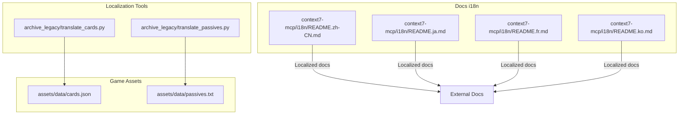
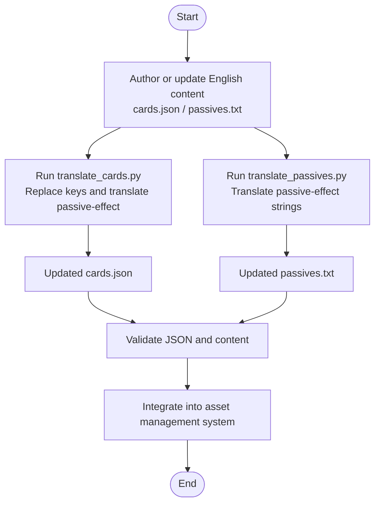
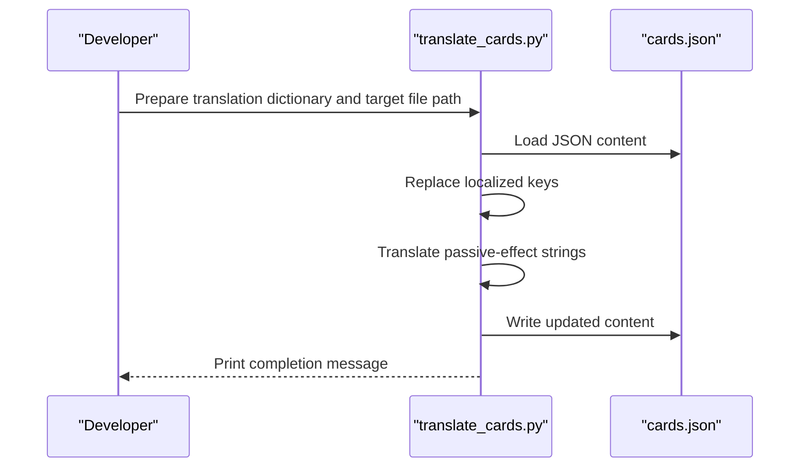
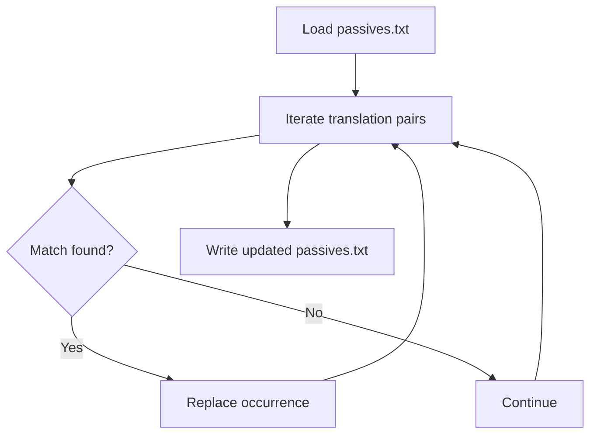
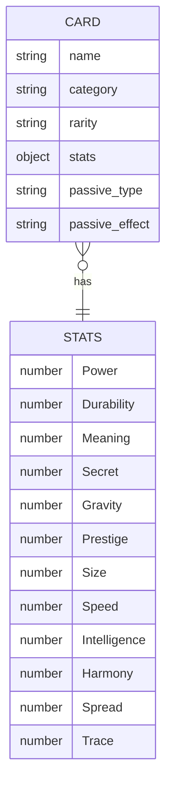
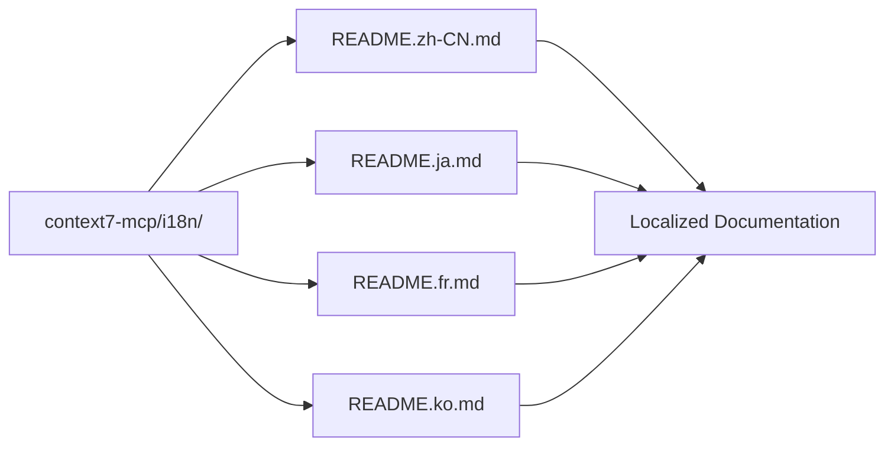
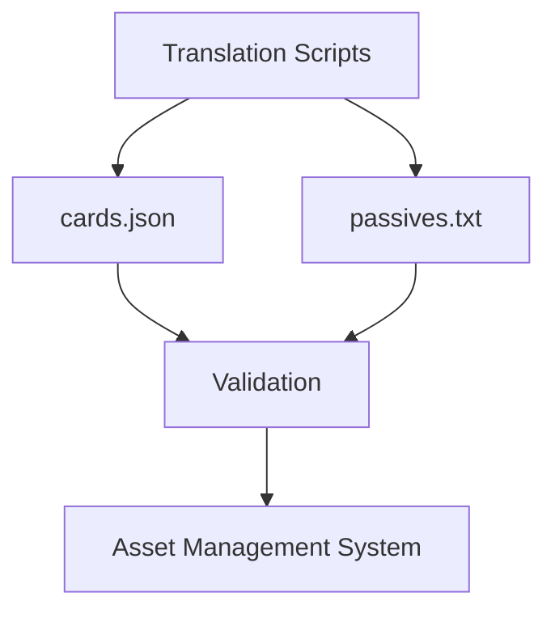

# Translation and Localization

<cite>
**Referenced Files in This Document**
- [translate_cards.py](file://archive_legacy/translate_cards.py)
- [translate_passives.py](file://archive_legacy/translate_passives.py)
- [cards.json](file://assets/data/cards.json)
- [passives.txt](file://assets/data/passives.txt)
- [README.zh-CN.md](file://context7-mcp/i18n/README.zh-CN.md)
- [README.ja.md](file://context7-mcp/i18n/README.ja.md)
- [README.fr.md](file://context7-mcp/i18n/README.fr.md)
- [README.ko.md](file://context7-mcp/i18n/README.ko.md)
</cite>

## Table of Contents
1. [Introduction](#introduction)
2. [Project Structure](#project-structure)
3. [Core Components](#core-components)
4. [Architecture Overview](#architecture-overview)
5. [Detailed Component Analysis](#detailed-component-analysis)
6. [Dependency Analysis](#dependency-analysis)
7. [Performance Considerations](#performance-considerations)
8. [Troubleshooting Guide](#troubleshooting-guide)
9. [Conclusion](#conclusion)
10. [Appendices](#appendices)

## Introduction
This document explains the Translation and Localization capabilities for the game’s content. It covers:
- Card translation utilities for internationalizing game assets
- Passive ability localization tools for multi-language support
- JSON and text data structure management for localized assets
- The translation workflow, locale-specific formatting, and content synchronization processes
- Practical examples for adding new languages, updating translations, and maintaining consistency across locales
- The localization pipeline, validation procedures, and integration with the asset management system

## Project Structure
Localization spans two primary areas:
- Game content assets stored under assets/data/, including cards.json and passives.txt
- Documentation and i18n materials under context7-mcp/i18n/, covering multiple locales

**Diagram sources**
- [cards.json](file://assets/data/cards.json)
- [passives.txt](file://assets/data/passives.txt)
- [translate_cards.py](file://archive_legacy/translate_cards.py)
- [translate_passives.py](file://archive_legacy/translate_passives.py)
- [README.zh-CN.md](file://context7-mcp/i18n/README.zh-CN.md)
- [README.ja.md](file://context7-mcp/i18n/README.ja.md)
- [README.fr.md](file://context7-mcp/i18n/README.fr.md)
- [README.ko.md](file://context7-mcp/i18n/README.ko.md)

**Section sources**
- [cards.json](file://assets/data/cards.json)
- [passives.txt](file://assets/data/passives.txt)
- [translate_cards.py](file://archive_legacy/translate_cards.py)
- [translate_passives.py](file://archive_legacy/translate_passives.py)
- [README.zh-CN.md](file://context7-mcp/i18n/README.zh-CN.md)
- [README.ja.md](file://context7-mcp/i18n/README.ja.md)
- [README.fr.md](file://context7-mcp/i18n/README.fr.md)
- [README.ko.md](file://context7-mcp/i18n/README.ko.md)

## Core Components
- Card data model and passive effect localization
  - cards.json defines card entries with localized passive-effect text
  - translate_cards.py demonstrates a script to replace localized keys and translate passive-effect strings
- Passive ability catalog localization
  - passives.txt organizes passive effects by category and includes localized descriptions
  - translate_passives.py shows a replacement-based approach to translating passive-effect strings
- Documentation i18n
  - context7-mcp/i18n/ contains localized READMEs for multiple locales, demonstrating a scalable pattern for documentation localization

Key responsibilities:
- Maintain a single source of truth for English passive-effect strings
- Provide deterministic translation updates to JSON and text assets
- Preserve data integrity and avoid breaking references during localization

**Section sources**
- [cards.json](file://assets/data/cards.json)
- [passives.txt](file://assets/data/passives.txt)
- [translate_cards.py](file://archive_legacy/translate_cards.py)
- [translate_passives.py](file://archive_legacy/translate_passives.py)
- [README.zh-CN.md](file://context7-mcp/i18n/README.zh-CN.md)

## Architecture Overview
The localization pipeline consists of three stages:
1. Content authoring and maintenance in English
2. Automated translation and data updates
3. Validation and integration into the asset management system

**Diagram sources**
- [translate_cards.py](file://archive_legacy/translate_cards.py)
- [translate_passives.py](file://archive_legacy/translate_passives.py)
- [cards.json](file://assets/data/cards.json)
- [passives.txt](file://assets/data/passives.txt)

## Detailed Component Analysis

### Card Translation Utilities
The card translation utility focuses on:
- Renaming localized keys (for example, replacing a Turkish key with an English key)
- Translating passive-effect strings from English to target locales
- Persisting changes back to cards.json

Operational notes:
- The script reads the JSON file, applies key replacements, and translates passive-effect strings using a predefined dictionary
- After translation, the script writes the updated JSON back to disk

Best practices:
- Keep the translation dictionary centralized and versioned
- Validate JSON after write to prevent malformed assets
- Use deterministic keys to avoid ambiguous replacements

**Diagram sources**
- [translate_cards.py](file://archive_legacy/translate_cards.py)
- [cards.json](file://assets/data/cards.json)

**Section sources**
- [translate_cards.py](file://archive_legacy/translate_cards.py)
- [cards.json](file://assets/data/cards.json)

### Passive Ability Localization Tools
The passive localization tool focuses on:
- Reading the passive catalog text
- Applying a set of translation replacements to convert localized passive-effect strings
- Writing the updated content back to passives.txt

Operational notes:
- The tool performs a series of string replacements based on a translation dictionary
- It preserves formatting and structure while updating only the passive-effect text

Best practices:
- Maintain a comprehensive translation dictionary aligned with the passive catalog
- Back up passives.txt before running the script
- Validate that all passive-effect strings are covered by the dictionary

**Diagram sources**
- [translate_passives.py](file://archive_legacy/translate_passives.py)
- [passives.txt](file://assets/data/passives.txt)

**Section sources**
- [translate_passives.py](file://archive_legacy/translate_passives.py)
- [passives.txt](file://assets/data/passives.txt)

### JSON Data Structure Management for Localized Assets
cards.json defines the schema for card entries, including localized passive-effect strings. The structure supports:
- Unique identifiers and metadata
- Stats with localized names
- Passive-type categorization
- Passive-effect text in the target locale

Guidelines:
- Keep stats keys consistent across locales
- Ensure passive-effect strings remain intact and free of accidental key replacements
- Validate JSON syntax and encoding after updates

**Diagram sources**
- [cards.json](file://assets/data/cards.json)

**Section sources**
- [cards.json](file://assets/data/cards.json)

### Documentation i18n Pattern
The context7-mcp/i18n/ directory demonstrates a scalable pattern for documentation localization:
- Each locale has its own README file
- Files share a consistent structure and purpose
- Links and badges reflect available locales

Practical benefits:
- Centralized locale-specific documentation
- Consistent navigation and cross-links
- Scalable addition of new locales

**Diagram sources**
- [README.zh-CN.md](file://context7-mcp/i18n/README.zh-CN.md)
- [README.ja.md](file://context7-mcp/i18n/README.ja.md)
- [README.fr.md](file://context7-mcp/i18n/README.fr.md)
- [README.ko.md](file://context7-mcp/i18n/README.ko.md)

**Section sources**
- [README.zh-CN.md](file://context7-mcp/i18n/README.zh-CN.md)
- [README.ja.md](file://context7-mcp/i18n/README.ja.md)
- [README.fr.md](file://context7-mcp/i18n/README.fr.md)
- [README.ko.md](file://context7-mcp/i18n/README.ko.md)

## Dependency Analysis
The localization pipeline depends on:
- Asset files (cards.json, passives.txt) as the authoritative sources for content
- Translation scripts to transform content into target locales
- Validation steps to ensure data integrity
- Integration with the asset management system for deployment

Potential risks:
- Key mismatches leading to missing or incorrect translations
- Encoding issues when writing JSON or text files
- Structural changes in assets breaking existing scripts

Mitigations:
- Maintain strict dictionaries and version control
- Add automated checks for JSON syntax and encoding
- Back up assets before applying transformations

**Diagram sources**
- [translate_cards.py](file://archive_legacy/translate_cards.py)
- [translate_passives.py](file://archive_legacy/translate_passives.py)
- [cards.json](file://assets/data/cards.json)
- [passives.txt](file://assets/data/passives.txt)

**Section sources**
- [translate_cards.py](file://archive_legacy/translate_cards.py)
- [translate_passives.py](file://archive_legacy/translate_passives.py)
- [cards.json](file://assets/data/cards.json)
- [passives.txt](file://assets/data/passives.txt)

## Performance Considerations
- Minimize repeated file reads/writes by batching operations
- Prefer streaming or chunked processing for very large assets
- Cache translation dictionaries in memory to reduce I/O overhead
- Use efficient string replacement strategies for large catalogs

## Troubleshooting Guide
Common issues and resolutions:
- JSON parsing errors after translation
  - Validate JSON syntax and encoding
  - Ensure UTF-8 encoding is preserved when writing files
- Missing or partial translations
  - Verify translation dictionary completeness
  - Confirm passive-effect strings match expected patterns
- Key replacement conflicts
  - Use deterministic keys and avoid ambiguous substrings
  - Test replacements on a small subset before full runs

Recommended checks:
- Run a linter on JSON files post-update
- Compare checksums before and after transformations
- Maintain a changelog of translation updates

**Section sources**
- [translate_cards.py](file://archive_legacy/translate_cards.py)
- [translate_passives.py](file://archive_legacy/translate_passives.py)
- [cards.json](file://assets/data/cards.json)
- [passives.txt](file://assets/data/passives.txt)

## Conclusion
The localization system combines targeted scripts with structured assets to deliver consistent, multi-language game content. By centralizing translation dictionaries, validating outputs, and integrating with the asset management system, teams can efficiently scale to new locales while preserving content quality and developer productivity.

## Appendices

### Practical Examples

- Adding a new language
  - Extend the translation dictionary in the relevant script
  - Update the asset files with translated passive-effect strings
  - Validate JSON and text files
  - Integrate into the asset management system

- Updating translations
  - Regenerate passive-effect strings using the latest dictionary
  - Re-run scripts and confirm deterministic outputs
  - Review diffs and approve changes

- Maintaining consistency across locales
  - Keep translation dictionaries synchronized
  - Use canonical keys for stats and passive types
  - Apply the same formatting rules across locales

[No sources needed since this section provides general guidance]