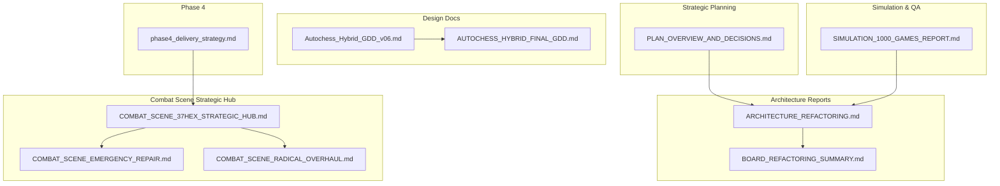
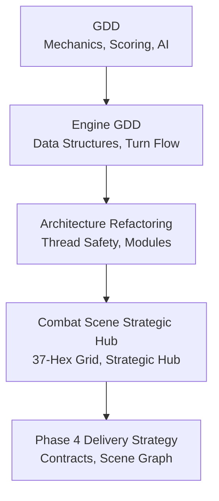
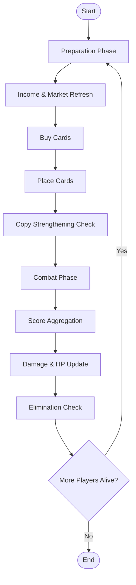
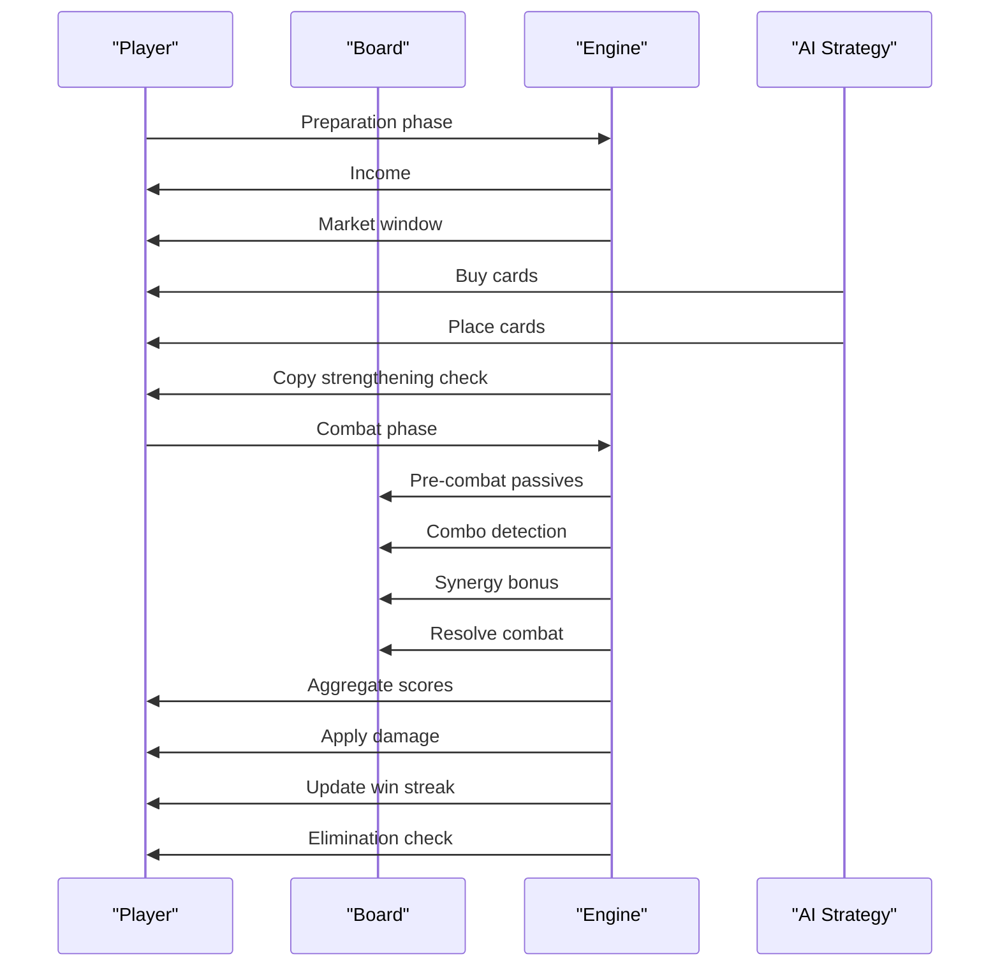
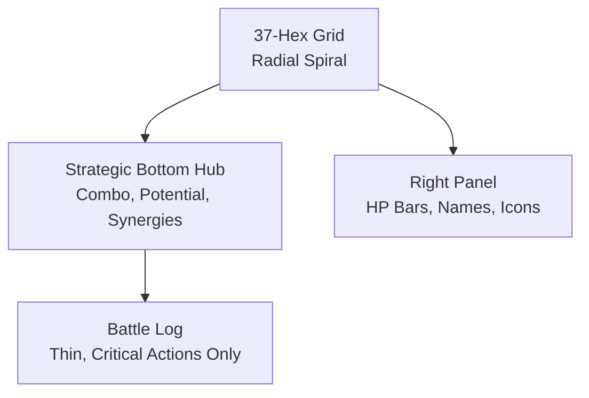
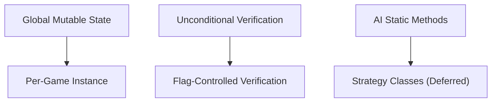
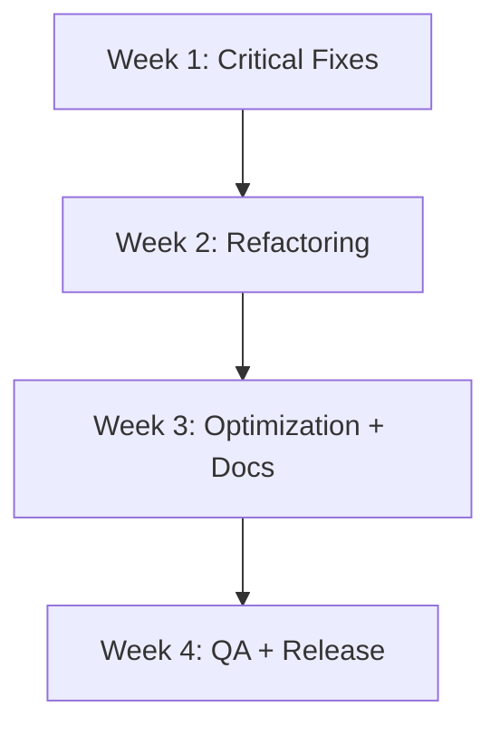
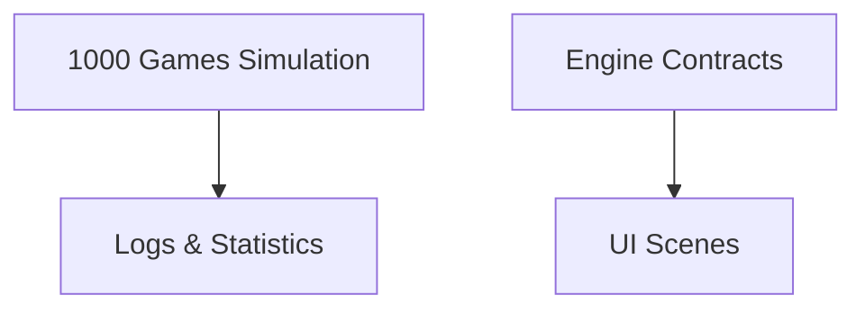
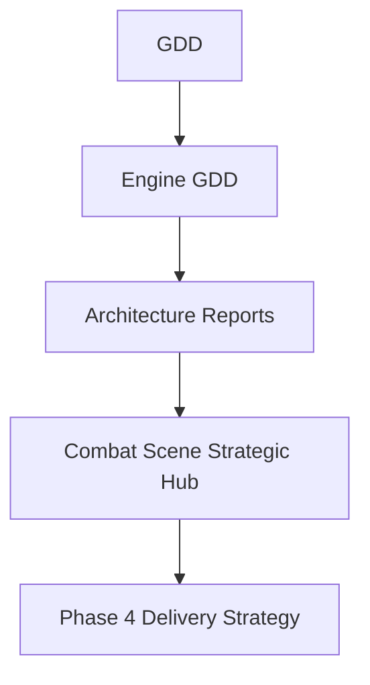

# Design Documents

<cite>
**Referenced Files in This Document**
- [Autochess_Hybrid_GDD_v06.md](file://docs/design/Autochess_Hybrid_GDD_v06.md)
- [AUTOCHESS_HYBRID_FINAL_GDD.md](file://AUTOCHESS_HYBRID_FINAL_GDD.md)
- [COMBAT_SCENE_37HEX_STRATEGIC_HUB.md](file://docs/COMBAT_SCENE_37HEX_STRATEGIC_HUB.md)
- [COMBAT_SCENE_EMERGENCY_REPAIR.md](file://docs/COMBAT_SCENE_EMERGENCY_REPAIR.md)
- [COMBAT_SCENE_RADICAL_OVERHAUL.md](file://docs/COMBAT_SCENE_RADICAL_OVERHAUL.md)
- [ARCHITECTURE_REFACTORING.md](file://docs/reports/ARCHITECTURE_REFACTORING.md)
- [BOARD_REFACTORING_SUMMARY.md](file://docs/reports/BOARD_REFACTORING_SUMMARY.md)
- [SIMULATION_1000_GAMES_REPORT.md](file://docs/reports/SIMULATION_1000_GAMES_REPORT.md)
- [phase4_delivery_strategy.md](file://docs/phase4_delivery_strategy.md)
- [PLAN_OVERVIEW_AND_DECISIONS.md](file://FINAL_REFACTOR_EXECUTION/PLAN_OVERVIEW_AND_DECISIONS.md)
- [CURSOR_BASLANGIC.md](file://docs/guides/CURSOR_BASLANGIC.md)
</cite>

## Table of Contents
1. [Introduction](#introduction)
2. [Project Structure](#project-structure)
3. [Core Components](#core-components)
4. [Architecture Overview](#architecture-overview)
5. [Detailed Component Analysis](#detailed-component-analysis)
6. [Dependency Analysis](#dependency-analysis)
7. [Performance Considerations](#performance-considerations)
8. [Troubleshooting Guide](#troubleshooting-guide)
9. [Conclusion](#conclusion)
10. [Appendices](#appendices)

## Introduction
This document consolidates the design documentation ecosystem for Autochess Hybrid. It explains the Game Design Document (GDD), architecture reports, and strategic planning documents, and connects them to the combat scene strategic hub documents. It provides both conceptual overviews for stakeholders and technical details for developers, with a focus on the Autochess Hybrid GDD, the hex-grid combat system, and AI strategies. It also documents the design documentation lifecycle, version control, approval processes, and guidelines for design review, stakeholder communication, and technical feasibility assessment.

## Project Structure
The repository organizes design artifacts across multiple categories:
- Game Design Documents (GDDs): high-level game vision and mechanics
- Architecture Reports: refactoring outcomes and technical deep-dives
- Strategic Planning Documents: executable plans, quick references, and gates
- Combat Scene Strategic Hub Documents: UI/UX and technical implementation of the combat scene
- Simulation and QA Reports: validation and performance evidence
- Phase 4 Delivery Strategy: integration and UI binding strategy

**Diagram sources**
- [Autochess_Hybrid_GDD_v06.md:1-572](file://docs/design/Autochess_Hybrid_GDD_v06.md#L1-L572)
- [AUTOCHESS_HYBRID_FINAL_GDD.md:1-800](file://AUTOCHESS_HYBRID_FINAL_GDD.md#L1-L800)
- [ARCHITECTURE_REFACTORING.md:1-169](file://docs/reports/ARCHITECTURE_REFACTORING.md#L1-L169)
- [BOARD_REFACTORING_SUMMARY.md:1-161](file://docs/reports/BOARD_REFACTORING_SUMMARY.md#L1-L161)
- [PLAN_OVERVIEW_AND_DECISIONS.md:1-363](file://FINAL_REFACTOR_EXECUTION/PLAN_OVERVIEW_AND_DECISIONS.md#L1-L363)
- [COMBAT_SCENE_37HEX_STRATEGIC_HUB.md:1-364](file://docs/COMBAT_SCENE_37HEX_STRATEGIC_HUB.md#L1-L364)
- [COMBAT_SCENE_EMERGENCY_REPAIR.md:1-192](file://docs/COMBAT_SCENE_EMERGENCY_REPAIR.md#L1-L192)
- [COMBAT_SCENE_RADICAL_OVERHAUL.md:1-444](file://docs/COMBAT_SCENE_RADICAL_OVERHAUL.md#L1-L444)
- [SIMULATION_1000_GAMES_REPORT.md:1-97](file://docs/reports/SIMULATION_1000_GAMES_REPORT.md#L1-L97)
- [phase4_delivery_strategy.md:1-325](file://docs/phase4_delivery_strategy.md#L1-L325)

**Section sources**
- [Autochess_Hybrid_GDD_v06.md:1-572](file://docs/design/Autochess_Hybrid_GDD_v06.md#L1-L572)
- [AUTOCHESS_HYBRID_FINAL_GDD.md:1-800](file://AUTOCHESS_HYBRID_FINAL_GDD.md#L1-L800)
- [COMBAT_SCENE_37HEX_STRATEGIC_HUB.md:1-364](file://docs/COMBAT_SCENE_37HEX_STRATEGIC_HUB.md#L1-L364)
- [COMBAT_SCENE_EMERGENCY_REPAIR.md:1-192](file://docs/COMBAT_SCENE_EMERGENCY_REPAIR.md#L1-L192)
- [COMBAT_SCENE_RADICAL_OVERHAUL.md:1-444](file://docs/COMBAT_SCENE_RADICAL_OVERHAUL.md#L1-L444)
- [ARCHITECTURE_REFACTORING.md:1-169](file://docs/reports/ARCHITECTURE_REFACTORING.md#L1-L169)
- [BOARD_REFACTORING_SUMMARY.md:1-161](file://docs/reports/BOARD_REFACTORING_SUMMARY.md#L1-L161)
- [SIMULATION_1000_GAMES_REPORT.md:1-97](file://docs/reports/SIMULATION_1000_GAMES_REPORT.md#L1-L97)
- [phase4_delivery_strategy.md:1-325](file://docs/phase4_delivery_strategy.md#L1-L325)
- [PLAN_OVERVIEW_AND_DECISIONS.md:1-363](file://FINAL_REFACTOR_EXECUTION/PLAN_OVERVIEW_AND_DECISIONS.md#L1-L363)

## Core Components
- Autochess Hybrid GDD: defines game mechanics, hex-grid combat, AI strategies, and economic systems.
- Final GDD: engine-verified reference for core data structures, turn flow, combat resolution, and passives.
- Combat Scene Strategic Hub: documents the 37-hex radial grid, strategic bottom hub, and UI hierarchy.
- Architecture Reports: document refactoring outcomes, thread safety improvements, and module separation.
- Strategic Planning: outlines executable plans, gates, and communication cadence for execution.
- Simulation and QA Reports: validate behavior, stabilize logs, and confirm deterministic outcomes.
- Phase 4 Delivery Strategy: binds UI scenes to engine contracts and prevents silent mismatches.

**Section sources**
- [Autochess_Hybrid_GDD_v06.md:34-572](file://docs/design/Autochess_Hybrid_GDD_v06.md#L34-L572)
- [AUTOCHESS_HYBRID_FINAL_GDD.md:32-800](file://AUTOCHESS_HYBRID_FINAL_GDD.md#L32-L800)
- [COMBAT_SCENE_37HEX_STRATEGIC_HUB.md:1-364](file://docs/COMBAT_SCENE_37HEX_STRATEGIC_HUB.md#L1-L364)
- [ARCHITECTURE_REFACTORING.md:1-169](file://docs/reports/ARCHITECTURE_REFACTORING.md#L1-L169)
- [BOARD_REFACTORING_SUMMARY.md:1-161](file://docs/reports/BOARD_REFACTORING_SUMMARY.md#L1-L161)
- [PLAN_OVERVIEW_AND_DECISIONS.md:1-363](file://FINAL_REFACTOR_EXECUTION/PLAN_OVERVIEW_AND_DECISIONS.md#L1-L363)
- [SIMULATION_1000_GAMES_REPORT.md:1-97](file://docs/reports/SIMULATION_1000_GAMES_REPORT.md#L1-L97)
- [phase4_delivery_strategy.md:1-325](file://docs/phase4_delivery_strategy.md#L1-L325)

## Architecture Overview
The design documents establish a layered architecture:
- Game-level GDDs define mechanics and scoring.
- Engine-level GDDs formalize data structures and turn flow.
- Architecture reports enforce thread safety and module separation.
- Strategic hubs (combat scene) implement UI/UX with strict contracts.
- Phase 4 delivery strategy ensures UI scenes bind to engine contracts and avoid silent mismatches.

**Diagram sources**
- [Autochess_Hybrid_GDD_v06.md:34-572](file://docs/design/Autochess_Hybrid_GDD_v06.md#L34-L572)
- [AUTOCHESS_HYBRID_FINAL_GDD.md:32-800](file://AUTOCHESS_HYBRID_FINAL_GDD.md#L32-L800)
- [ARCHITECTURE_REFACTORING.md:1-169](file://docs/reports/ARCHITECTURE_REFACTORING.md#L1-L169)
- [COMBAT_SCENE_37HEX_STRATEGIC_HUB.md:1-364](file://docs/COMBAT_SCENE_37HEX_STRATEGIC_HUB.md#L1-L364)
- [phase4_delivery_strategy.md:1-325](file://docs/phase4_delivery_strategy.md#L1-L325)

## Detailed Component Analysis

### Autochess Hybrid GDD
- Game overview: 8-player lobbies, hex-grid boards, simultaneous combat, and open-board visibility.
- Mechanics: card stats grouped into MIND, CONNECTION, EXISTENCE; group advantage matrix; combo detection by dominant group; copy strengthening thresholds; economy with interest and win streak bonuses.
- AI strategies: tempo, warrior, builder, evolver, economist, balancer, rare hunter, random.
- Example game flow: starting hands, copy strengthening milestones, and final turns.

**Diagram sources**
- [Autochess_Hybrid_GDD_v06.md:166-191](file://docs/design/Autochess_Hybrid_GDD_v06.md#L166-L191)

**Section sources**
- [Autochess_Hybrid_GDD_v06.md:34-572](file://docs/design/Autochess_Hybrid_GDD_v06.md#L34-L572)

### Final GDD (Engine-Verified)
- Core data structures: Card, Board, Player, with rotation and edge indexing.
- Turn structure: preparation phase (income, market refresh, AI buy/place, evolution/copy strengthening) and combat phase (pairing, pre-combat passives, combo detection, synergy bonus, combat resolution, score aggregation, damage, win streak, elimination).
- Combat resolution: shared-coordinate combat, group advantage, passive triggers, edge loss, and kill scoring.
- Economy: base income, win streak bonus, HP bailouts, interest, and market refresh costs.
- Evolution system: copy-triggered evolution with scaling and thresholds.

**Diagram sources**
- [AUTOCHESS_HYBRID_FINAL_GDD.md:99-189](file://AUTOCHESS_HYBRID_FINAL_GDD.md#L99-L189)

**Section sources**
- [AUTOCHESS_HYBRID_FINAL_GDD.md:49-710](file://AUTOCHESS_HYBRID_FINAL_GDD.md#L49-L710)

### Combat Scene Strategic Hub
- 37-hex radial grid: ring-based structure with perfect geometry and edge-to-edge contact.
- Strategic Bottom Hub: combo score, synergy potential, and active synergies with neon styling.
- UI hierarchy: maximize board, minimize HUD, and preserve minimal battle log.
- Emergency repair: crash fix for missing draw method, radial grid correction, strategic hub addition, and asset/edge protection.
- Radical overhaul: board-centric UI, card flip animation, holographic player info, and color palette.

**Diagram sources**
- [COMBAT_SCENE_37HEX_STRATEGIC_HUB.md:7-364](file://docs/COMBAT_SCENE_37HEX_STRATEGIC_HUB.md#L7-L364)
- [COMBAT_SCENE_EMERGENCY_REPAIR.md:8-192](file://docs/COMBAT_SCENE_EMERGENCY_REPAIR.md#L8-L192)
- [COMBAT_SCENE_RADICAL_OVERHAUL.md:9-444](file://docs/COMBAT_SCENE_RADICAL_OVERHAUL.md#L9-L444)

**Section sources**
- [COMBAT_SCENE_37HEX_STRATEGIC_HUB.md:1-364](file://docs/COMBAT_SCENE_37HEX_STRATEGIC_HUB.md#L1-L364)
- [COMBAT_SCENE_EMERGENCY_REPAIR.md:1-192](file://docs/COMBAT_SCENE_EMERGENCY_REPAIR.md#L1-L192)
- [COMBAT_SCENE_RADICAL_OVERHAUL.md:1-444](file://docs/COMBAT_SCENE_RADICAL_OVERHAUL.md#L1-L444)

### Architecture Reports
- Architecture refactoring report: fixes include removing unconditional verification, moving global mutable state to per-game instances, and deferring AI class refactoring to a future session.
- Board refactoring summary: successful migration of Board and related utilities to a new module while avoiding circular dependencies and maintaining backward compatibility.

**Diagram sources**
- [ARCHITECTURE_REFACTORING.md:10-169](file://docs/reports/ARCHITECTURE_REFACTORING.md#L10-L169)
- [BOARD_REFACTORING_SUMMARY.md:49-87](file://docs/reports/BOARD_REFACTORING_SUMMARY.md#L49-L87)

**Section sources**
- [ARCHITECTURE_REFACTORING.md:1-169](file://docs/reports/ARCHITECTURE_REFACTORING.md#L1-L169)
- [BOARD_REFACTORING_SUMMARY.md:1-161](file://docs/reports/BOARD_REFACTORING_SUMMARY.md#L1-L161)

### Strategic Planning Documents
- Plan overview and decisions: critical fixes reduced from 5 to 4 after decision to not add a fourth synergy type; 4-week execution plan with gates and communication cadence.
- Implementation plan: detailed weekly breakdown, task ownership matrix, success metrics, and go/no-go gates.

**Diagram sources**
- [PLAN_OVERVIEW_AND_DECISIONS.md:67-136](file://FINAL_REFACTOR_EXECUTION/PLAN_OVERVIEW_AND_DECISIONS.md#L67-L136)

**Section sources**
- [PLAN_OVERVIEW_AND_DECISIONS.md:1-363](file://FINAL_REFACTOR_EXECUTION/PLAN_OVERVIEW_AND_DECISIONS.md#L1-L363)

### Simulation and QA Reports
- Simulation 1000 games report: validates bug fixes, encoding improvements, pool management, and passive trigger behavior; provides logs and statistics for analysis.
- Phase 4 delivery strategy: establishes binding guardrails, test layering, and scene graph contracts to prevent silent mismatches between engine and UI.

**Diagram sources**
- [SIMULATION_1000_GAMES_REPORT.md:46-97](file://docs/reports/SIMULATION_1000_GAMES_REPORT.md#L46-L97)
- [phase4_delivery_strategy.md:61-143](file://docs/phase4_delivery_strategy.md#L61-L143)

**Section sources**
- [SIMULATION_1000_GAMES_REPORT.md:1-97](file://docs/reports/SIMULATION_1000_GAMES_REPORT.md#L1-L97)
- [phase4_delivery_strategy.md:1-325](file://docs/phase4_delivery_strategy.md#L1-L325)

## Dependency Analysis
- GDDs define mechanics that inform engine design.
- Engine GDD formalizes data structures and turn flow.
- Architecture reports enforce module separation and thread safety.
- Strategic hubs implement UI contracts bound to engine truths.
- Phase 4 delivery strategy enforces scene graph contracts and prevents silent mismatches.

**Diagram sources**
- [Autochess_Hybrid_GDD_v06.md:34-572](file://docs/design/Autochess_Hybrid_GDD_v06.md#L34-L572)
- [AUTOCHESS_HYBRID_FINAL_GDD.md:32-800](file://AUTOCHESS_HYBRID_FINAL_GDD.md#L32-L800)
- [ARCHITECTURE_REFACTORING.md:1-169](file://docs/reports/ARCHITECTURE_REFACTORING.md#L1-L169)
- [COMBAT_SCENE_37HEX_STRATEGIC_HUB.md:1-364](file://docs/COMBAT_SCENE_37HEX_STRATEGIC_HUB.md#L1-L364)
- [phase4_delivery_strategy.md:1-325](file://docs/phase4_delivery_strategy.md#L1-L325)

**Section sources**
- [Autochess_Hybrid_GDD_v06.md:34-572](file://docs/design/Autochess_Hybrid_GDD_v06.md#L34-L572)
- [AUTOCHESS_HYBRID_FINAL_GDD.md:32-800](file://AUTOCHESS_HYBRID_FINAL_GDD.md#L32-L800)
- [ARCHITECTURE_REFACTORING.md:1-169](file://docs/reports/ARCHITECTURE_REFACTORING.md#L1-L169)
- [COMBAT_SCENE_37HEX_STRATEGIC_HUB.md:1-364](file://docs/COMBAT_SCENE_37HEX_STRATEGIC_HUB.md#L1-L364)
- [phase4_delivery_strategy.md:1-325](file://docs/phase4_delivery_strategy.md#L1-L325)

## Performance Considerations
- UI performance targets: maintain 60 FPS, smooth animations, and efficient rendering.
- Simulation performance: bounded memory usage, deterministic logs, and stable performance across thousands of games.
- Architecture improvements: module separation, reduced file sizes, and cleaner dependency hierarchies.

**Section sources**
- [COMBAT_SCENE_RADICAL_OVERHAUL.md:312-334](file://docs/COMBAT_SCENE_RADICAL_OVERHAUL.md#L312-L334)
- [SIMULATION_1000_GAMES_REPORT.md:72-97](file://docs/reports/SIMULATION_1000_GAMES_REPORT.md#L72-L97)
- [BOARD_REFACTORING_SUMMARY.md:113-161](file://docs/reports/BOARD_REFACTORING_SUMMARY.md#L113-L161)

## Troubleshooting Guide
- Crash fixes: attribute errors during scene transitions resolved by restoring missing methods and adding None checks.
- Grid geometry: radial spiral corrected to proper cube coordinate system to avoid overlaps and ensure symmetry.
- Strategic hub: placeholder support and player safety checks added for robust rendering.
- Simulation stability: passive trigger logging, pool management, and evolution tracking fixes validated through 1000-game simulations.

**Section sources**
- [COMBAT_SCENE_EMERGENCY_REPAIR.md:8-90](file://docs/COMBAT_SCENE_EMERGENCY_REPAIR.md#L8-L90)
- [COMBAT_SCENE_37HEX_STRATEGIC_HUB.md:302-335](file://docs/COMBAT_SCENE_37HEX_STRATEGIC_HUB.md#L302-L335)
- [SIMULATION_1000_GAMES_REPORT.md:8-45](file://docs/reports/SIMULATION_1000_GAMES_REPORT.md#L8-L45)

## Conclusion
The design documents provide a cohesive blueprint for Autochess Hybrid:
- GDDs define the game vision and mechanics.
- Engine GDDs formalize core systems and turn flow.
- Architecture reports ensure maintainability and thread safety.
- Strategic hubs implement a professional, board-centric UI.
- Strategic planning documents execute improvements with gates and communication.
- Simulation and QA reports validate behavior and performance.
- Phase 4 delivery strategy binds UI scenes to engine contracts to prevent silent mismatches.

[No sources needed since this section summarizes without analyzing specific files]

## Appendices

### Practical Examples: Design-to-Implementation Mapping
- Hex-grid combat system: GDD defines the 37-hex radial grid and strategic bottom hub; implementation documents provide exact layout calculations, geometry, and UI hierarchy.
- AI strategies: GDD enumerates strategies; engine GDD formalizes scoring and turn flow; simulation reports validate strategy performance.
- Feature prioritization: strategic planning documents outline critical fixes and gates; architecture reports guide refactoring priorities.

**Section sources**
- [Autochess_Hybrid_GDD_v06.md:153-191](file://docs/design/Autochess_Hybrid_GDD_v06.md#L153-L191)
- [AUTOCHESS_HYBRID_FINAL_GDD.md:99-189](file://AUTOCHESS_HYBRID_FINAL_GDD.md#L99-L189)
- [COMBAT_SCENE_37HEX_STRATEGIC_HUB.md:256-301](file://docs/COMBAT_SCENE_37HEX_STRATEGIC_HUB.md#L256-L301)
- [PLAN_OVERVIEW_AND_DECISIONS.md:50-83](file://FINAL_REFACTOR_EXECUTION/PLAN_OVERVIEW_AND_DECISIONS.md#L50-L83)

### Design Documentation Lifecycle, Version Control, and Approval Processes
- Lifecycle: GDDs → Engine GDDs → Architecture Reports → Strategic Planning → Simulation/QA Reports → Phase 4 Delivery Strategy.
- Version control: documents reference specific files and line ranges; reports track changes and outcomes.
- Approval processes: go/no-go gates at the end of each week; risk register and mitigation strategies; QA sandbox requirements.

**Section sources**
- [PLAN_OVERVIEW_AND_DECISIONS.md:228-274](file://FINAL_REFACTOR_EXECUTION/PLAN_OVERVIEW_AND_DECISIONS.md#L228-L274)
- [phase4_delivery_strategy.md:144-325](file://docs/phase4_delivery_strategy.md#L144-L325)

### Guidelines for Design Review, Stakeholder Communication, and Technical Feasibility Assessment
- Design review: use executive summaries for managers, quick references for developers, and detailed analyses for technical reviews.
- Stakeholder communication: daily standups, weekly progress reviews, and ad-hoc blocking calls; clear risk log updates.
- Technical feasibility: test layering (mock, adapter/contract, real-engine smoke), explicit QA sandbox requirements, and scene graph contracts.

**Section sources**
- [PLAN_OVERVIEW_AND_DECISIONS.md:213-226](file://FINAL_REFACTOR_EXECUTION/PLAN_OVERVIEW_AND_DECISIONS.md#L213-L226)
- [phase4_delivery_strategy.md:34-60](file://docs/phase4_delivery_strategy.md#L34-L60)
- [CURSOR_BASLANGIC.md:156-177](file://docs/guides/CURSOR_BASLANGIC.md#L156-L177)