# Documentation and Design

<cite>
**Referenced Files in This Document**
- [AUTOCHESS_HYBRID_FINAL_GDD.md](file://AUTOCHESS_HYBRID_FINAL_GDD.md)
- [Autochess_Hybrid_GDD_v06.md](file://docs/design/Autochess_Hybrid_GDD_v06.md)
- [ARCHITECT_REPORT_EXECUTIVE_SUMMARY.md](file://ARCHITECT_REPORT_EXECUTIVE_SUMMARY.md)
- [CODEBASE_ARCHITECTURE_ANALYSIS.md](file://CODEBASE_ARCHITECTURE_ANALYSIS.md)
- [SENIOR_ARCHITECT_REPORT.md](file://SENIOR_ARCHITECT_REPORT.md)
- [IMPLEMENTATION_PLAN_EXECUTABLE.md](file://IMPLEMENTATION_PLAN_EXECUTABLE.md)
- [README.md](file://README.md)
- [CURSOR_BASLANGIC.md](file://docs/guides/CURSOR_BASLANGIC.md)
- [phase4_delivery_strategy.md](file://docs/phase4_delivery_strategy.md)
- [ARCHITECTURE_REFACTORING.md](file://docs/reports/ARCHITECTURE_REFACTORING.md)
- [MIGRATION.md](file://archive_legacy/MIGRATION.md)
- [ANALYSIS_EXECUTION_RESULT.md](file://FINAL_REFACTOR_EXECUTION/ANALYSIS_EXECUTION_RESULT.md)
- [MASTER_BACKLOG_AND_GATES.md](file://FINAL_REFACTOR_EXECUTION/MASTER_BACKLOG_AND_GATES.md)
- [figma_lobby_panel_spec.md](file://figma_lobby_panel_spec.md)
- [FINAL_REFACTOR_EXECUTION/README.md](file://FINAL_REFACTOR_EXECUTION/README.md)
- [FINAL_REFACTOR_EXECUTION/PLAN_OVERVIEW_AND_DECISIONS.md](file://FINAL_REFACTOR_EXECUTION/PLAN_OVERVIEW_AND_DECISIONS.md)
- [FINAL_REFACTOR_EXECUTION/PLAN_QUICK_REFERENCE.md](file://FINAL_REFACTOR_EXECUTION/PLAN_QUICK_REFERENCE.md)
</cite>

## Update Summary
**Changes Made**
- Added three new comprehensive documents to the documentation ecosystem
- Updated project structure to include FINAL_REFACTOR_EXECUTION directory
- Enhanced execution planning and governance documentation
- Added UI component specification documentation for lobby panel
- Updated architecture reporting and implementation planning sections

## Table of Contents
1. [Introduction](#introduction)
2. [Project Structure](#project-structure)
3. [Core Components](#core-components)
4. [Architecture Overview](#architecture-overview)
5. [Detailed Component Analysis](#detailed-component-analysis)
6. [Dependency Analysis](#dependency-analysis)
7. [Performance Considerations](#performance-considerations)
8. [Troubleshooting Guide](#troubleshooting-guide)
9. [Conclusion](#conclusion)
10. [Appendices](#appendices)

## Introduction
This section documents the Documentation and Design ecosystem for the Autochess Hybrid project. It covers the Game Design Document (GDD), architecture reports, migration guides, and the newly established FINAL_REFACTOR_EXECUTION framework. The ecosystem now includes comprehensive execution planning, governance documents, and UI component specifications that establish single sources of truth for refactoring projects and design implementations.

## Project Structure
The repository organizes documentation across multiple categories with enhanced execution and governance frameworks:
- GDD and design: high-level game mechanics and rules
- Architecture reports: deep technical analysis and recommendations
- Implementation plans: executable roadmaps for refactoring and delivery
- Final Refactor Execution: comprehensive execution framework with governance
- UI Component Specifications: detailed design specifications for components
- Guides: usage and contribution workflows
- KPI and QA reports: metrics and quality assurance outcomes
- Migration documentation: transition from legacy to modern architecture

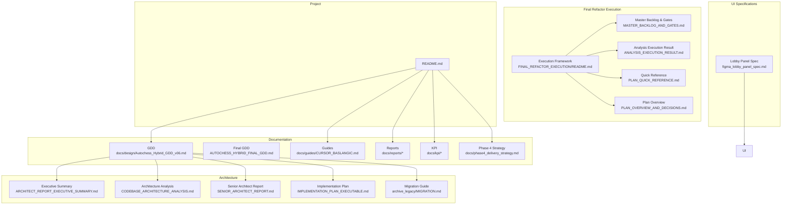

**Diagram sources**
- [README.md:131-142](file://README.md#L131-L142)
- [Autochess_Hybrid_GDD_v06.md:1-30](file://docs/design/Autochess_Hybrid_GDD_v06.md#L1-L30)
- [AUTOCHESS_HYBRID_FINAL_GDD.md:1-30](file://AUTOCHESS_HYBRID_FINAL_GDD.md#L1-L30)
- [CURSOR_BASLANGIC.md:1-15](file://docs/guides/CURSOR_BASLANGIC.md#L1-L15)
- [phase4_delivery_strategy.md:1-10](file://docs/phase4_delivery_strategy.md#L1-L10)
- [ARCHITECT_REPORT_EXECUTIVE_SUMMARY.md:1-15](file://ARCHITECT_REPORT_EXECUTIVE_SUMMARY.md#L1-L15)
- [CODEBASE_ARCHITECTURE_ANALYSIS.md:1-15](file://CODEBASE_ARCHITECTURE_ANALYSIS.md#L1-L15)
- [SENIOR_ARCHITECT_REPORT.md:1-15](file://SENIOR_ARCHITECT_REPORT.md#L1-L15)
- [IMPLEMENTATION_PLAN_EXECUTABLE.md:1-10](file://IMPLEMENTATION_PLAN_EXECUTABLE.md#L1-L10)
- [MIGRATION.md](file://archive_legacy/MIGRATION.md)
- [FINAL_REFACTOR_EXECUTION/README.md:1-361](file://FINAL_REFACTOR_EXECUTION/README.md#L1-L361)
- [MASTER_BACKLOG_AND_GATES.md:1-256](file://MASTER_BACKLOG_AND_GATES.md#L1-L256)
- [ANALYSIS_EXECUTION_RESULT.md:1-114](file://ANALYSIS_EXECUTION_RESULT.md#L1-L114)
- [figma_lobby_panel_spec.md:1-476](file://figma_lobby_panel_spec.md#L1-L476)

**Section sources**
- [README.md:131-142](file://README.md#L131-L142)

## Core Components
- Game Design Document (GDD): Defines game mechanics, turn structure, board and combat systems, economy, and strategy profiles. See [Autochess_Hybrid_GDD_v06.md:1-30](file://docs/design/Autochess_Hybrid_GDD_v06.md#L1-L30) and [AUTOCHESS_HYBRID_FINAL_GDD.md:1-30](file://AUTOCHESS_HYBRID_FINAL_GDD.md#L1-L30).
- Architecture Reports: Executive summaries, deep analysis, and senior architect findings. See [ARCHITECT_REPORT_EXECUTIVE_SUMMARY.md:1-15](file://ARCHITECT_REPORT_EXECUTIVE_SUMMARY.md#L1-L15), [CODEBASE_ARCHITECTURE_ANALYSIS.md:1-15](file://CODEBASE_ARCHITECTURE_ANALYSIS.md#L1-L15), and [SENIOR_ARCHITECT_REPORT.md:1-15](file://SENIOR_ARCHITECT_REPORT.md#L1-L15).
- Implementation Plan: Executable roadmap for critical fixes, refactors, and optimizations. See [IMPLEMENTATION_PLAN_EXECUTABLE.md:1-10](file://IMPLEMENTATION_PLAN_EXECUTABLE.md#L1-L10).
- Final Refactor Execution Framework: Comprehensive execution framework with master backlog, governance gates, and single source of truth documents. See [FINAL_REFACTOR_EXECUTION/README.md:1-361](file://FINAL_REFACTOR_EXECUTION/README.md#L1-L361), [MASTER_BACKLOG_AND_GATES.md:1-256](file://MASTER_BACKLOG_AND_GATES.md#L1-L256), and [ANALYSIS_EXECUTION_RESULT.md:1-114](file://ANALYSIS_EXECUTION_RESULT.md#L1-L114).
- UI Component Specifications: Detailed design specifications for UI components including lobby panel. See [figma_lobby_panel_spec.md:1-476](file://figma_lobby_panel_spec.md#L1-L476).
- Migration Guide: Transition from legacy architecture to scene-based architecture. See [MIGRATION.md](file://archive_legacy/MIGRATION.md).
- Usage Guides: Getting started, running simulations, and development workflows. See [CURSOR_BASLANGIC.md:1-15](file://docs/guides/CURSOR_BASLANGIC.md#L1-L15) and [README.md:131-142](file://README.md#L131-L142).
- QA and KPI Reports: Metrics, balance analysis, and refactoring outcomes. See [phase4_delivery_strategy.md:1-10](file://docs/phase4_delivery_strategy.md#L1-L10) and [ARCHITECTURE_REFACTORING.md:1-10](file://docs/reports/ARCHITECTURE_REFACTORING.md#L1-L10).

**Section sources**
- [Autochess_Hybrid_GDD_v06.md:1-30](file://docs/design/Autochess_Hybrid_GDD_v06.md#L1-L30)
- [AUTOCHESS_HYBRID_FINAL_GDD.md:1-30](file://AUTOCHESS_HYBRID_FINAL_GDD.md#L1-L30)
- [ARCHITECT_REPORT_EXECUTIVE_SUMMARY.md:1-15](file://ARCHITECT_REPORT_EXECUTIVE_SUMMARY.md#L1-L15)
- [CODEBASE_ARCHITECTURE_ANALYSIS.md:1-15](file://CODEBASE_ARCHITECTURE_ANALYSIS.md#L1-L15)
- [SENIOR_ARCHITECT_REPORT.md:1-15](file://SENIOR_ARCHITECT_REPORT.md#L1-L15)
- [IMPLEMENTATION_PLAN_EXECUTABLE.md:1-10](file://IMPLEMENTATION_PLAN_EXECUTABLE.md#L1-L10)
- [FINAL_REFACTOR_EXECUTION/README.md:1-361](file://FINAL_REFACTOR_EXECUTION/README.md#L1-L361)
- [MASTER_BACKLOG_AND_GATES.md:1-256](file://MASTER_BACKLOG_AND_GATES.md#L1-L256)
- [ANALYSIS_EXECUTION_RESULT.md:1-114](file://ANALYSIS_EXECUTION_RESULT.md#L1-L114)
- [figma_lobby_panel_spec.md:1-476](file://figma_lobby_panel_spec.md#L1-L476)
- [CURSOR_BASLANGIC.md:1-15](file://docs/guides/CURSOR_BASLANGIC.md#L1-L15)
- [README.md:131-142](file://README.md#L131-L142)
- [phase4_delivery_strategy.md:1-10](file://docs/phase4_delivery_strategy.md#L1-L10)
- [ARCHITECTURE_REFACTORING.md:1-10](file://docs/reports/ARCHITECTURE_REFACTORING.md#L1-L10)

## Architecture Overview
The project's documentation ecosystem aligns with a layered approach that now includes comprehensive execution governance:
- GDD defines the game model and rules
- Architecture reports analyze and prescribe structural improvements
- Implementation plans operationalize fixes and refactors
- Final Refactor Execution Framework establishes single sources of truth and governance
- UI Component Specifications provide detailed design implementations
- Migration guides document transitions between major architecture versions
- Guides and QA/KPI reports support contributor onboarding and quality assurance

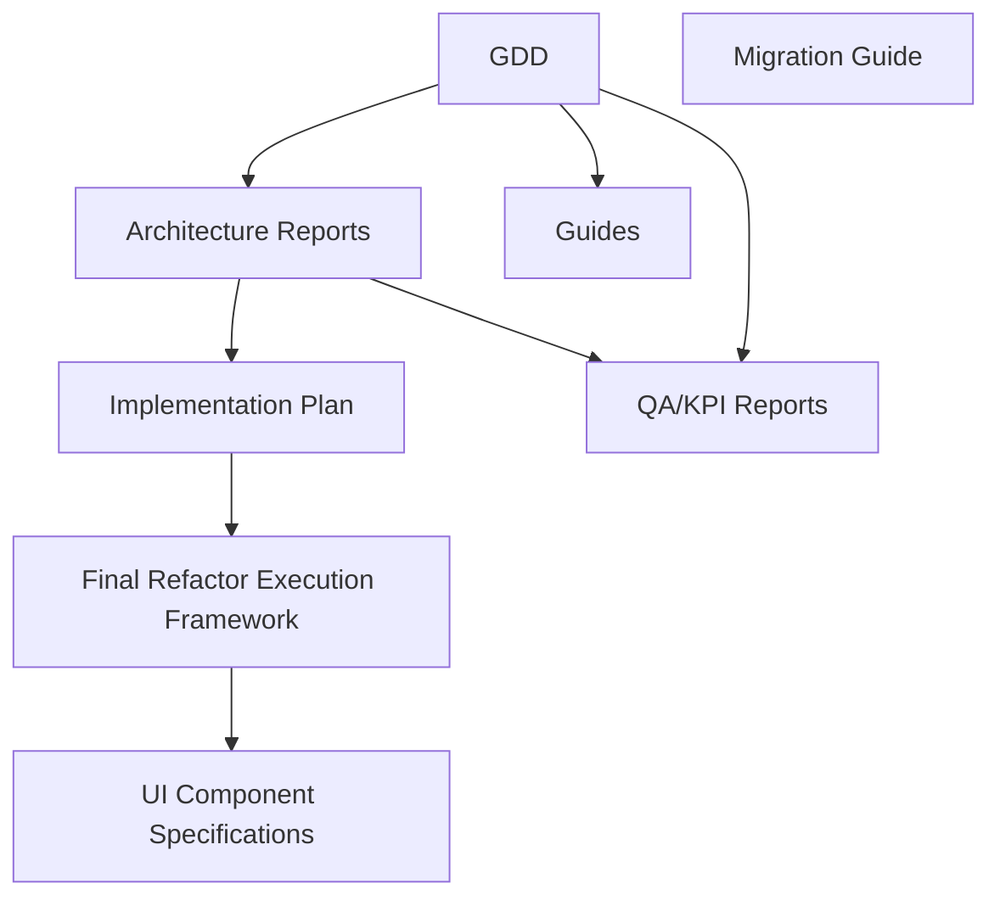

[No sources needed since this diagram shows conceptual workflow, not actual code structure]

## Detailed Component Analysis

### Game Design Document (GDD)
The GDD consolidates game mechanics, turn structure, board and combat systems, economy, and strategy profiles. It serves as the canonical reference for contributors and stakeholders.

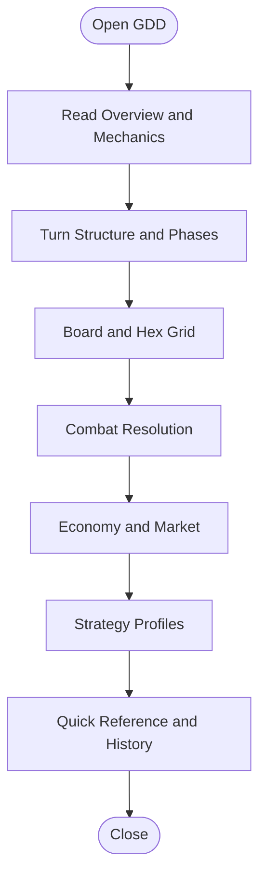

**Diagram sources**
- [Autochess_Hybrid_GDD_v06.md:9-30](file://docs/design/Autochess_Hybrid_GDD_v06.md#L9-L30)
- [AUTOCHESS_HYBRID_FINAL_GDD.md:9-28](file://AUTOCHESS_HYBRID_FINAL_GDD.md#L9-L28)

**Section sources**
- [Autochess_Hybrid_GDD_v06.md:1-30](file://docs/design/Autochess_Hybrid_GDD_v06.md#L1-L30)
- [AUTOCHESS_HYBRID_FINAL_GDD.md:1-30](file://AUTOCHESS_HYBRID_FINAL_GDD.md#L1-L30)

### Architecture Reports
These reports provide executive summaries, deep technical analysis, and senior architect findings. They identify critical and strategic issues, propose remedies, and define risks and priorities.

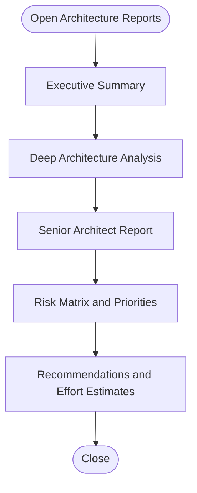

**Diagram sources**
- [ARCHITECT_REPORT_EXECUTIVE_SUMMARY.md:1-15](file://ARCHITECT_REPORT_EXECUTIVE_SUMMARY.md#L1-L15)
- [CODEBASE_ARCHITECTURE_ANALYSIS.md:1-15](file://CODEBASE_ARCHITECTURE_ANALYSIS.md#L1-L15)
- [SENIOR_ARCHITECT_REPORT.md:1-15](file://SENIOR_ARCHITECT_REPORT.md#L1-L15)

**Section sources**
- [ARCHITECT_REPORT_EXECUTIVE_SUMMARY.md:1-15](file://ARCHITECT_REPORT_EXECUTIVE_SUMMARY.md#L1-L15)
- [CODEBASE_ARCHITECTURE_ANALYSIS.md:1-15](file://CODEBASE_ARCHITECTURE_ANALYSIS.md#L1-L15)
- [SENIOR_ARCHITECT_REPORT.md:1-15](file://SENIOR_ARCHITECT_REPORT.md#L1-L15)

### Final Refactor Execution Framework
The Final Refactor Execution Framework establishes comprehensive governance, single sources of truth, and execution standards for refactoring projects. It includes master backlog management, governance gates, and standardized execution protocols.

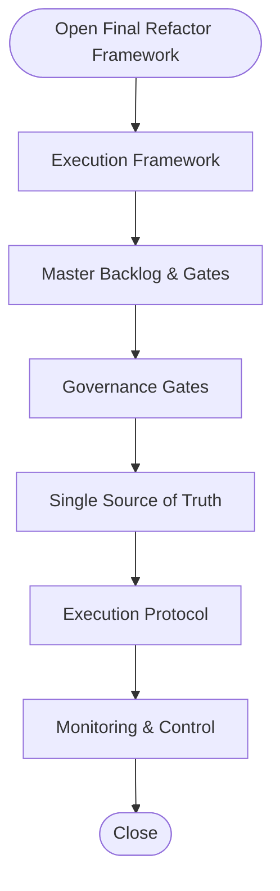

**Diagram sources**
- [FINAL_REFACTOR_EXECUTION/README.md:1-361](file://FINAL_REFACTOR_EXECUTION/README.md#L1-L361)
- [MASTER_BACKLOG_AND_GATES.md:1-256](file://MASTER_BACKLOG_AND_GATES.md#L1-L256)
- [ANALYSIS_EXECUTION_RESULT.md:1-114](file://ANALYSIS_EXECUTION_RESULT.md#L1-L114)

**Section sources**
- [FINAL_REFACTOR_EXECUTION/README.md:1-361](file://FINAL_REFACTOR_EXECUTION/README.md#L1-L361)
- [MASTER_BACKLOG_AND_GATES.md:1-256](file://MASTER_BACKLOG_AND_GATES.md#L1-L256)
- [ANALYSIS_EXECUTION_RESULT.md:1-114](file://ANALYSIS_EXECUTION_RESULT.md#L1-L114)

### UI Component Specifications
UI Component Specifications provide detailed design implementations for user interface components, establishing design-to-code traceability and quality standards.

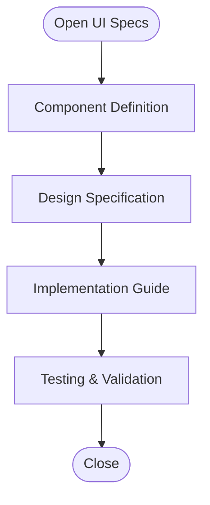

**Diagram sources**
- [figma_lobby_panel_spec.md:1-476](file://figma_lobby_panel_spec.md#L1-L476)

**Section sources**
- [figma_lobby_panel_spec.md:1-476](file://figma_lobby_panel_spec.md#L1-L476)

### Implementation Plan (Executable)
The implementation plan translates architecture recommendations into actionable tasks, timelines, and acceptance criteria. It prioritizes critical fixes and outlines strategic refactors.

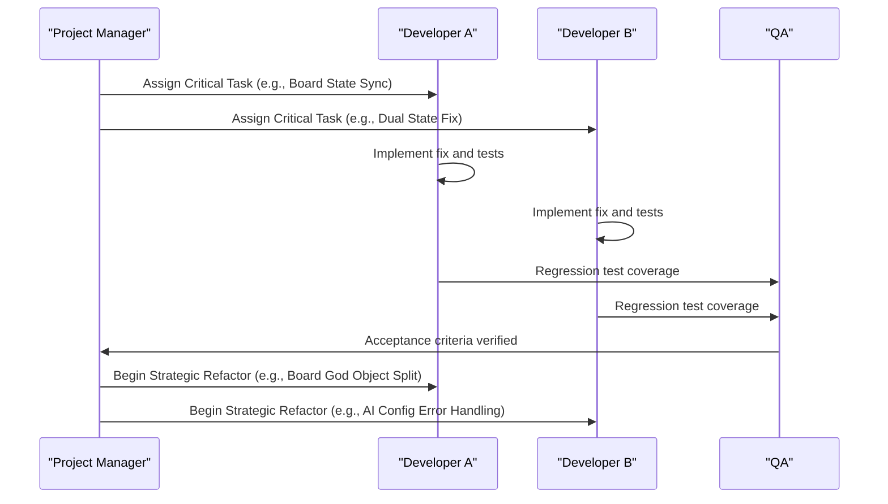

**Diagram sources**
- [IMPLEMENTATION_PLAN_EXECUTABLE.md:53-100](file://IMPLEMENTATION_PLAN_EXECUTABLE.md#L53-L100)
- [IMPLEMENTATION_PLAN_EXECUTABLE.md:211-265](file://IMPLEMENTATION_PLAN_EXECUTABLE.md#L211-L265)
- [IMPLEMENTATION_PLAN_EXECUTABLE.md:371-477](file://IMPLEMENTATION_PLAN_EXECUTABLE.md#L371-L477)

**Section sources**
- [IMPLEMENTATION_PLAN_EXECUTABLE.md:1-10](file://IMPLEMENTATION_PLAN_EXECUTABLE.md#L1-L10)
- [IMPLEMENTATION_PLAN_EXECUTABLE.md:53-100](file://IMPLEMENTATION_PLAN_EXECUTABLE.md#L53-L100)
- [IMPLEMENTATION_PLAN_EXECUTABLE.md:211-265](file://IMPLEMENTATION_PLAN_EXECUTABLE.md#L211-L265)
- [IMPLEMENTATION_PLAN_EXECUTABLE.md:371-477](file://IMPLEMENTATION_PLAN_EXECUTABLE.md#L371-L477)

### Migration Guide
The migration guide documents the transition from the legacy architecture to the modern scene-based architecture, including functional requirements, design gaps, and implementation tasks.

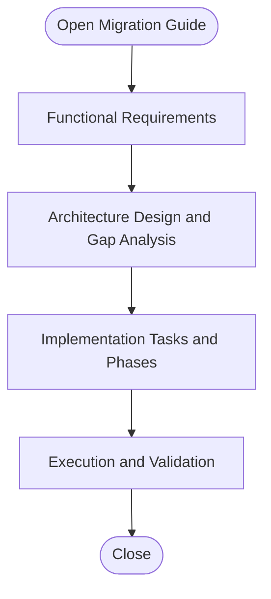

**Diagram sources**
- [MIGRATION.md](file://archive_legacy/MIGRATION.md)

**Section sources**
- [MIGRATION.md](file://archive_legacy/MIGRATION.md)

### Usage Guides and Contribution Workflows
Usage guides explain how to run simulations, interpret results, and contribute to the project. They provide practical examples for documentation structure, contribution workflows, and maintenance procedures.

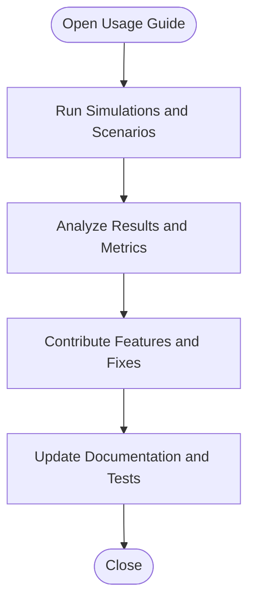

**Diagram sources**
- [CURSOR_BASLANGIC.md:19-33](file://docs/guides/CURSOR_BASLANGIC.md#L19-L33)
- [README.md:102-129](file://README.md#L102-L129)

**Section sources**
- [CURSOR_BASLANGIC.md:1-15](file://docs/guides/CURSOR_BASLANGIC.md#L1-L15)
- [README.md:102-129](file://README.md#L102-L129)

### QA and KPI Reports
QA and KPI reports provide metrics, balance analysis, and refactoring outcomes. They support quality assurance and continuous improvement.

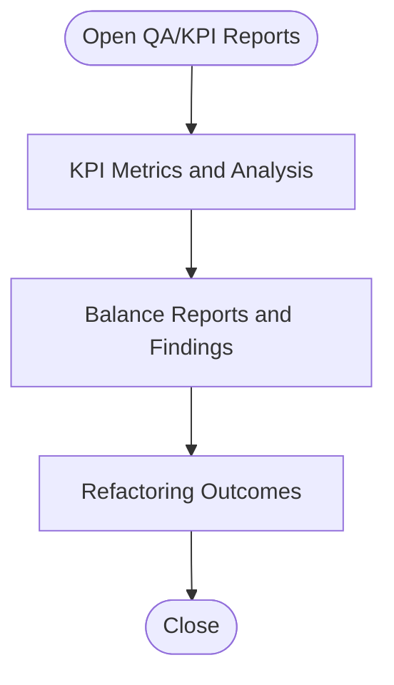

**Diagram sources**
- [phase4_delivery_strategy.md:144-211](file://docs/phase4_delivery_strategy.md#L144-L211)
- [ARCHITECTURE_REFACTORING.md:139-169](file://docs/reports/ARCHITECTURE_REFACTORING.md#L139-L169)

**Section sources**
- [phase4_delivery_strategy.md:144-211](file://docs/phase4_delivery_strategy.md#L144-L211)
- [ARCHITECTURE_REFACTORING.md:139-169](file://docs/reports/ARCHITECTURE_REFACTORING.md#L139-L169)

## Dependency Analysis
The documentation ecosystem exhibits clear dependencies with enhanced execution governance:
- GDD informs architecture reports and implementation plans
- Architecture reports drive executable implementation plans
- Final Refactor Execution Framework provides governance and single sources of truth
- UI Component Specifications bridge design and implementation
- Migration guides depend on architecture reports and implementation plans
- Guides and QA/KPI reports support contributor onboarding and quality assurance

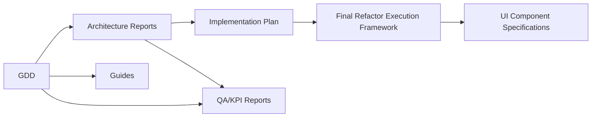

[No sources needed since this diagram shows conceptual relationships, not specific code structure]

## Performance Considerations
Performance considerations are addressed in architecture reports, implementation plans, and execution frameworks:
- Synergy BFS optimization and caching strategies
- State synchronization and cache invalidation patterns
- Error handling improvements for debugging and reliability
- Memory-bound log rotation to prevent leaks
- Execution framework performance monitoring and optimization

Practical recommendations:
- Implement board hashing and caching for synergy computations
- Ensure state mutations invalidate caches promptly
- Replace silent failures with descriptive exceptions
- Bound logs and telemetry to prevent memory growth
- Establish performance baselines in execution framework

**Section sources**
- [CODEBASE_ARCHITECTURE_ANALYSIS.md:348-454](file://CODEBASE_ARCHITECTURE_ANALYSIS.md#L348-L454)
- [SENIOR_ARCHITECT_REPORT.md:418-477](file://SENIOR_ARCHITECT_REPORT.md#L418-L477)
- [IMPLEMENTATION_PLAN_EXECUTABLE.md:310-343](file://IMPLEMENTATION_PLAN_EXECUTABLE.md#L310-L343)
- [FINAL_REFACTOR_EXECUTION/README.md:137-172](file://FINAL_REFACTOR_EXECUTION/README.md#L137-L172)

## Troubleshooting Guide
Common issues and resolutions derived from architecture reports, implementation plans, and execution frameworks:
- Board state desynchronization: hook board mutations and invalidate caches
- Synergy BFS duplication: unify to a single source of truth
- Parallel state maintenance: consolidate dual sources into a single source
- Error handling: replace shim returns with descriptive exceptions
- Memory leaks: rotate logs with bounded sizes
- Execution framework conflicts: resolve using master backlog and governance gates
- UI component inconsistencies: validate against design specifications

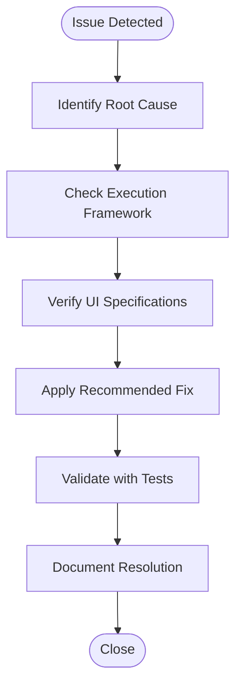

**Diagram sources**
- [SENIOR_ARCHITECT_REPORT.md:21-115](file://SENIOR_ARCHITECT_REPORT.md#L21-L115)
- [CODEBASE_ARCHITECTURE_ANALYSIS.md:529-586](file://CODEBASE_ARCHITECTURE_ANALYSIS.md#L529-L586)
- [IMPLEMENTATION_PLAN_EXECUTABLE.md:104-130](file://IMPLEMENTATION_PLAN_EXECUTABLE.md#L104-L130)
- [MASTER_BACKLOG_AND_GATES.md:62-69](file://MASTER_BACKLOG_AND_GATES.md#L62-L69)
- [figma_lobby_panel_spec.md:374-388](file://figma_lobby_panel_spec.md#L374-L388)

**Section sources**
- [SENIOR_ARCHITECT_REPORT.md:21-115](file://SENIOR_ARCHITECT_REPORT.md#L21-L115)
- [CODEBASE_ARCHITECTURE_ANALYSIS.md:529-586](file://CODEBASE_ARCHITECTURE_ANALYSIS.md#L529-L586)
- [IMPLEMENTATION_PLAN_EXECUTABLE.md:104-130](file://IMPLEMENTATION_PLAN_EXECUTABLE.md#L104-L130)
- [MASTER_BACKLOG_AND_GATES.md:62-69](file://MASTER_BACKLOG_AND_GATES.md#L62-L69)
- [figma_lobby_panel_spec.md:374-388](file://figma_lobby_panel_spec.md#L374-L388)

## Conclusion
The Documentation and Design ecosystem for Autochess Hybrid integrates the GDD, architecture reports, implementation plans, migration guides, usage guides, QA/KPI reports, and the newly established Final Refactor Execution Framework into a comprehensive governance system. The addition of master backlog management, single sources of truth, and UI component specifications creates a robust framework for managing complex refactoring projects while maintaining quality and performance standards.

[No sources needed since this section summarizes without analyzing specific files]

## Appendices

### Practical Examples: Documentation Structure and Contribution Workflows
- Example: GDD structure and navigation
  - See [Autochess_Hybrid_GDD_v06.md:9-30](file://docs/design/Autochess_Hybrid_GDD_v06.md#L9-L30) and [AUTOCHESS_HYBRID_FINAL_GDD.md:9-28](file://AUTOCHESS_HYBRID_FINAL_GDD.md#L9-L28)
- Example: Architecture report executive summary
  - See [ARCHITECT_REPORT_EXECUTIVE_SUMMARY.md:1-15](file://ARCHITECT_REPORT_EXECUTIVE_SUMMARY.md#L1-L15)
- Example: Final Refactor Execution Framework
  - See [FINAL_REFACTOR_EXECUTION/README.md:1-361](file://FINAL_REFACTOR_EXECUTION/README.md#L1-L361)
- Example: Master Backlog and Governance
  - See [MASTER_BACKLOG_AND_GATES.md:1-256](file://MASTER_BACKLOG_AND_GATES.md#L1-L256)
- Example: Analysis Execution Result
  - See [ANALYSIS_EXECUTION_RESULT.md:1-114](file://ANALYSIS_EXECUTION_RESULT.md#L1-L114)
- Example: UI Component Specification
  - See [figma_lobby_panel_spec.md:1-476](file://figma_lobby_panel_spec.md#L1-L476)
- Example: Implementation plan weekly breakdown
  - See [FINAL_REFACTOR_EXECUTION/PLAN_QUICK_REFERENCE.md:1-305](file://FINAL_REFACTOR_EXECUTION/PLAN_QUICK_REFERENCE.md#L1-L305)
- Example: Migration guide scope and tasks
  - See [MIGRATION.md](file://archive_legacy/MIGRATION.md)
- Example: Usage guide commands and scenarios
  - See [CURSOR_BASLANGIC.md:19-33](file://docs/guides/CURSOR_BASLANGIC.md#L19-L33)
- Example: QA sandbox and contract tests
  - See [phase4_delivery_strategy.md:34-60](file://docs/phase4_delivery_strategy.md#L34-L60)

**Section sources**
- [Autochess_Hybrid_GDD_v06.md:9-30](file://docs/design/Autochess_Hybrid_GDD_v06.md#L9-L30)
- [AUTOCHESS_HYBRID_FINAL_GDD.md:9-28](file://AUTOCHESS_HYBRID_FINAL_GDD.md#L9-L28)
- [ARCHITECT_REPORT_EXECUTIVE_SUMMARY.md:1-15](file://ARCHITECT_REPORT_EXECUTIVE_SUMMARY.md#L1-L15)
- [FINAL_REFACTOR_EXECUTION/README.md:1-361](file://FINAL_REFACTOR_EXECUTION/README.md#L1-L361)
- [MASTER_BACKLOG_AND_GATES.md:1-256](file://MASTER_BACKLOG_AND_GATES.md#L1-L256)
- [ANALYSIS_EXECUTION_RESULT.md:1-114](file://ANALYSIS_EXECUTION_RESULT.md#L1-L114)
- [figma_lobby_panel_spec.md:1-476](file://figma_lobby_panel_spec.md#L1-L476)
- [FINAL_REFACTOR_EXECUTION/PLAN_QUICK_REFERENCE.md:1-305](file://FINAL_REFACTOR_EXECUTION/PLAN_QUICK_REFERENCE.md#L1-L305)
- [MIGRATION.md](file://archive_legacy/MIGRATION.md)
- [CURSOR_BASLANGIC.md:19-33](file://docs/guides/CURSOR_BASLANGIC.md#L19-L33)
- [phase4_delivery_strategy.md:34-60](file://docs/phase4_delivery_strategy.md#L34-L60)

### Documentation Standards, Review Processes, and Quality Assurance
- Standards
  - Use clear headings, consistent terminology ("GDD," "architecture report," "migration guide," "final refactor execution framework")
  - Link to source files and line ranges for traceability
  - Provide diagrams that map to actual source files
  - Establish single sources of truth for execution frameworks
  - Maintain design-to-code traceability for UI components
- Review processes
  - Require production diff and test diff together
  - Enforce hard stops after deliverables and risk notes
  - Validate scene transitions and score semantics
  - Implement governance gates for execution framework changes
  - Establish conflict resolution protocols for framework documents
- Quality assurance
  - Maintain bounded logs and telemetry
  - Replace silent failures with descriptive exceptions
  - Implement caching and hashing for performance-sensitive computations
  - Validate UI components against design specifications
  - Monitor execution framework performance and adherence

**Section sources**
- [phase4_delivery_strategy.md:313-325](file://docs/phase4_delivery_strategy.md#L313-L325)
- [CODEBASE_ARCHITECTURE_ANALYSIS.md:529-586](file://CODEBASE_ARCHITECTURE_ANALYSIS.md#L529-L586)
- [IMPLEMENTATION_PLAN_EXECUTABLE.md:371-477](file://IMPLEMENTATION_PLAN_EXECUTABLE.md#L371-L477)
- [MASTER_BACKLOG_AND_GATES.md:62-69](file://MASTER_BACKLOG_AND_GATES.md#L62-L69)
- [figma_lobby_panel_spec.md:374-388](file://figma_lobby_panel_spec.md#L374-L388)