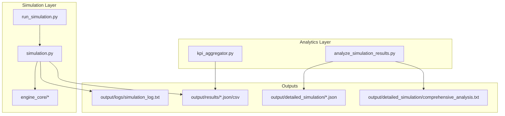
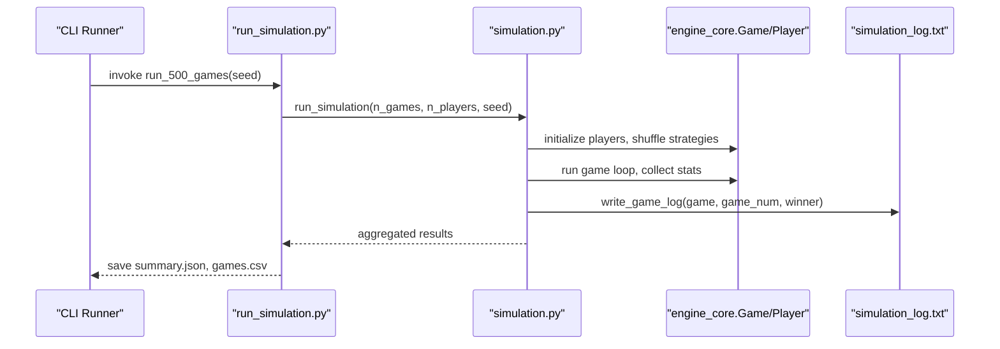
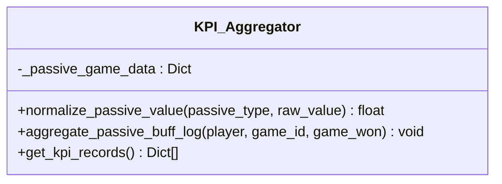
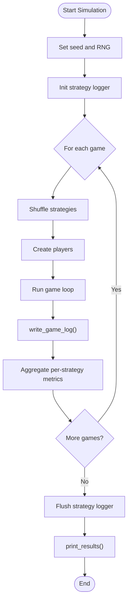
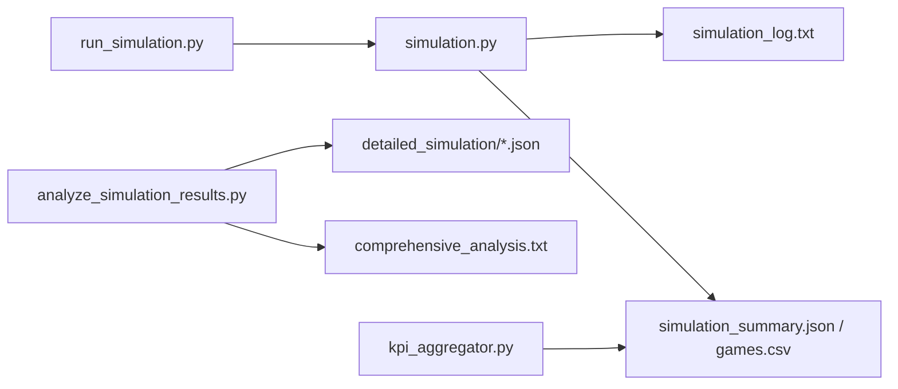

# Performance KPI and Analytics

<cite>
**Referenced Files in This Document**
- [KPI_FINAL_REPORT.txt](file://docs/kpi/KPI_FINAL_REPORT.txt)
- [KPI_SIMULATION_SUMMARY.md](file://docs/kpi/KPI_SIMULATION_SUMMARY.md)
- [SIMULATION_1000_GAMES_REPORT.md](file://docs/reports/SIMULATION_1000_GAMES_REPORT.md)
- [SIMULATION_2000_GAMES_BALANCE_ANALYSIS.md](file://docs/reports/SIMULATION_2000_GAMES_BALANCE_ANALYSIS.md)
- [SIMULATION_5000_GAMES_REPORT.md](file://docs/reports/SIMULATION_5000_GAMES_REPORT.md)
- [BALANCE_OZET_TR.md](file://docs/reports/BALANCE_OZET_TR.md)
- [kpi_aggregator.py](file://engine_core/kpi_aggregator.py)
- [simulation.py](file://engine_core/simulation.py)
- [run_simulation.py](file://scripts/simulation/run_simulation.py)
- [bench_sim.py](file://scripts/simulation/bench_sim.py)
- [analyze_simulation_results.py](file://tools/analyze_simulation_results.py)
</cite>

## Table of Contents
1. [Introduction](#introduction)
2. [Project Structure](#project-structure)
3. [Core Components](#core-components)
4. [Architecture Overview](#architecture-overview)
5. [Detailed Component Analysis](#detailed-component-analysis)
6. [Dependency Analysis](#dependency-analysis)
7. [Performance Considerations](#performance-considerations)
8. [Troubleshooting Guide](#troubleshooting-guide)
9. [Conclusion](#conclusion)
10. [Appendices](#appendices)

## Introduction
This document presents the Performance KPI and Analytics framework used to evaluate AutoChess Hybrid’s strategic balance and economic systems. It covers:
- Key Performance Indicators (KPI) across board metrics, economy, combo/synergy, combat/win conditions, evolution/copies, luck/market, and momentum
- Simulation report outcomes for 1000, 2000, and 5000 games
- KPI final report for comprehensive performance evaluation
- Analytics framework, data collection methodology, and reporting standards
- Practical examples for benchmarking, strategy comparison, and optimization opportunities
- Guidelines for performance monitoring, trend analysis, and capacity planning

## Project Structure
The performance analytics pipeline integrates engine-level simulation, deterministic logging, and post-run analysis:
- Simulation runners collect per-game and per-strategy statistics
- Logs capture detailed event streams for passive triggers, combat outcomes, and card survival
- Aggregation utilities normalize and compute KPI efficiency scores
- Reporting tools produce strategy summaries, card rankings, and balance recommendations

**Diagram sources**
- [run_simulation.py:1-269](file://scripts/simulation/run_simulation.py#L1-L269)
- [simulation.py:1-284](file://engine_core/simulation.py#L1-L284)
- [kpi_aggregator.py:1-161](file://engine_core/kpi_aggregator.py#L1-L161)
- [analyze_simulation_results.py:1-278](file://tools/analyze_simulation_results.py#L1-L278)

**Section sources**
- [run_simulation.py:1-269](file://scripts/simulation/run_simulation.py#L1-L269)
- [simulation.py:1-284](file://engine_core/simulation.py#L1-L284)
- [analyze_simulation_results.py:1-278](file://tools/analyze_simulation_results.py#L1-L278)

## Core Components
- KPI Aggregator: Normalizes raw passive effect deltas across categories (economy, combat, combo, copy, synergy, survival) and computes efficiency scores per card/passive type per strategy.
- Simulation Runner: Executes N games, shuffles strategies per game, collects per-player stats, writes structured logs, and prints summarized results.
- Analysis Tools: Parse JSON/CSV outputs to generate strategy match-ups, card performance, and comprehensive reports.

Key KPI groups captured across simulations:
- Board metrics: board power averages/max, unit counts, card power stats
- Economy: gold per turn, reserves, market rolls, float turns
- Combo & Synergy: trigger counts, efficiency, active turns, trigger counts
- Combat & Win Condition: total combats, draw rate, win streaks, wins by kill/combo/synergy
- Evolution & Copies: created copies, evolution counts, power gains, trigger turns
- Luck & Market: rare cards seen/bought, high/low roll turns
- Momentum: first lead turn, lead changes, final/min HP, HP difference over time

**Section sources**
- [KPI_SIMULATION_SUMMARY.md:44-87](file://docs/kpi/KPI_SIMULATION_SUMMARY.md#L44-L87)
- [KPI_FINAL_REPORT.txt:69-118](file://docs/kpi/KPI_FINAL_REPORT.txt#L69-L118)
- [kpi_aggregator.py:31-71](file://engine_core/kpi_aggregator.py#L31-L71)

## Architecture Overview
The analytics architecture separates concerns:
- Deterministic simulation with controlled seeds
- Structured logging per game and per-card passive triggers
- Aggregation and normalization for cross-category comparability
- Automated batched reporting and strategy-level summaries

**Diagram sources**
- [run_simulation.py:65-211](file://scripts/simulation/run_simulation.py#L65-L211)
- [simulation.py:113-218](file://engine_core/simulation.py#L113-L218)

## Detailed Component Analysis

### KPI Aggregator
The aggregator normalizes raw passive deltas into comparable units across effect types, enabling cross-strategy and cross-card KPI efficiency scoring. It accumulates trigger counts, raw values, and normalized values per (game_id, strategy, card_name, passive_type), and computes an efficiency score per record.

**Diagram sources**
- [kpi_aggregator.py:11-161](file://engine_core/kpi_aggregator.py#L11-L161)

**Section sources**
- [kpi_aggregator.py:31-71](file://engine_core/kpi_aggregator.py#L31-L71)
- [kpi_aggregator.py:72-123](file://engine_core/kpi_aggregator.py#L72-L123)
- [kpi_aggregator.py:124-161](file://engine_core/kpi_aggregator.py#L124-L161)

### Simulation Runner and Logging
The simulation runner:
- Initializes strategy logger when enabled
- Shuffles strategies per game to avoid bias
- Runs the game loop and collects per-player stats
- Writes structured game logs with evolution summaries, opponent board checks, passive triggers, combat win rates, and card survival
- Flushes strategy logs and prints formatted results

**Diagram sources**
- [simulation.py:113-218](file://engine_core/simulation.py#L113-L218)
- [simulation.py:32-107](file://engine_core/simulation.py#L32-L107)

**Section sources**
- [simulation.py:113-218](file://engine_core/simulation.py#L113-L218)
- [simulation.py:32-107](file://engine_core/simulation.py#L32-L107)

### Multi-Game Simulation Reports

#### 1000-Game Simulation Report
- Applied critical fixes for passive triggers, board coordinate tracking, evolution copy reset, and win streak calculation
- Generated a 15.8 MB simulation log with detailed per-game records
- Reported top combat performers and longest-lived cards by strategy
- Encoded special characters safely and validated pool management

**Section sources**
- [SIMULATION_1000_GAMES_REPORT.md:1-97](file://docs/reports/SIMULATION_1000_GAMES_REPORT.md#L1-L97)

#### 2000-Game Balance Analysis Report
- Executive summary highlights Tempo dominance (47.7%) and Builder viability (29.2%), with late-game strategies underperforming
- Found average game length of 27.8 turns, with draws totaling 19,901
- Provided strategy performance metrics (damage dealt, kills, final HP), economy efficiency, and synergy analysis
- Recommended prioritized balance adjustments: nerf Tempo, buff late-game strategies, rebalance top/bottom cards, and extend game length

**Section sources**
- [SIMULATION_2000_GAMES_BALANCE_ANALYSIS.md:1-338](file://docs/reports/SIMULATION_2000_GAMES_BALANCE_ANALYSIS.md#L1-L338)
- [BALANCE_OZET_TR.md:1-160](file://docs/reports/BALANCE_OZET_TR.md#L1-L160)

#### 5000-Game Detailed Simulation Report
- Comprehensive dataset across 5000 matches with 4 players per match
- Builder dominates (55.7% win rate), while Evolver and Balancer remain weak (<15%)
- Created structured outputs: game_results.json, strategy_performance.json/csv, card_performance.json, and detailed analysis
- Provided actionable balance recommendations: reduce Builder dominance, strengthen Evolver/Balancer, and adjust overpowered cards

**Section sources**
- [SIMULATION_5000_GAMES_REPORT.md:1-176](file://docs/reports/SIMULATION_5000_GAMES_REPORT.md#L1-L176)

### KPI Final Report
- Summarizes a 500-game deterministic run with 10.90 games/sec throughput
- Provides strategy win rates, batch-wise performance, and KPI metric coverage
- Documents file organization, quality assurance, and next steps for balance tuning and system improvements

**Section sources**
- [KPI_FINAL_REPORT.txt:1-269](file://docs/kpi/KPI_FINAL_REPORT.txt#L1-L269)
- [KPI_SIMULATION_SUMMARY.md:1-210](file://docs/kpi/KPI_SIMULATION_SUMMARY.md#L1-L210)

### Analytics Framework and Data Collection Methodology
- Deterministic runs with fixed seeds for reproducibility
- Structured logging per game with passive trigger counts, combat ratios, and card survival
- Aggregated strategy-level KPIs and normalized efficiency scores
- Automated batched outputs for downstream analysis

**Section sources**
- [run_simulation.py:34-62](file://scripts/simulation/run_simulation.py#L34-L62)
- [run_simulation.py:65-211](file://scripts/simulation/run_simulation.py#L65-L211)
- [simulation.py:32-107](file://engine_core/simulation.py#L32-L107)
- [kpi_aggregator.py:31-71](file://engine_core/kpi_aggregator.py#L31-L71)

### Reporting Standards
- Standardized file naming and batched outputs
- Consistent UTF-8 encoding and plain-text formats for easy parsing
- Strategy summaries, card rankings, and comprehensive analysis reports
- JSONL event logs for granular event stream analysis

**Section sources**
- [KPI_SIMULATION_SUMMARY.md:135-210](file://docs/kpi/KPI_SIMULATION_SUMMARY.md#L135-L210)
- [SIMULATION_5000_GAMES_REPORT.md:121-135](file://docs/reports/SIMULATION_5000_GAMES_REPORT.md#L121-L135)

## Dependency Analysis
The analytics stack exhibits clear separation of concerns:
- Scripts orchestrate simulation and produce structured artifacts
- Engine core encapsulates game logic and logging
- Aggregation utilities transform raw logs into normalized KPI records
- Analysis tools consume JSON outputs to generate reports

**Diagram sources**
- [run_simulation.py:1-269](file://scripts/simulation/run_simulation.py#L1-L269)
- [simulation.py:1-284](file://engine_core/simulation.py#L1-L284)
- [analyze_simulation_results.py:1-278](file://tools/analyze_simulation_results.py#L1-L278)
- [kpi_aggregator.py:1-161](file://engine_core/kpi_aggregator.py#L1-L161)

**Section sources**
- [run_simulation.py:1-269](file://scripts/simulation/run_simulation.py#L1-L269)
- [simulation.py:1-284](file://engine_core/simulation.py#L1-L284)
- [analyze_simulation_results.py:1-278](file://tools/analyze_simulation_results.py#L1-L278)
- [kpi_aggregator.py:1-161](file://engine_core/kpi_aggregator.py#L1-L161)

## Performance Considerations
- Throughput: Benchmarks indicate ~10–11 games/second for 4-player matches; 8-player configurations scale accordingly
- Determinism: Fixed seeds and controlled RNG ensure reproducible results across runs
- Logging overhead: Structured logs are written per game; consider rotating or compressing for very large batches
- Memory footprint: Aggregation and normalization are in-memory; ensure adequate RAM for 5000+ matches

Practical examples:
- Benchmarking: Use the benchmark script to measure average time and games-per-second across repeated runs
- Strategy comparison: Compare normalized KPI efficiency scores across strategies to identify underperforming mechanics
- Optimization opportunities: Adjust early-game caps, economy mechanics, and synergy thresholds to flatten the performance curve

**Section sources**
- [bench_sim.py:1-24](file://scripts/simulation/bench_sim.py#L1-L24)
- [KPI_SIMULATION_SUMMARY.md:163-183](file://docs/kpi/KPI_SIMULATION_SUMMARY.md#L163-L183)
- [SIMULATION_2000_GAMES_BALANCE_ANALYSIS.md:179-245](file://docs/reports/SIMULATION_2000_GAMES_BALANCE_ANALYSIS.md#L179-L245)

## Troubleshooting Guide
Common issues and resolutions:
- Non-determinism: Verify seed usage and RNG initialization; re-run determinism checks to compare first 10 games across runs
- Missing outputs: Confirm output directories exist and permissions allow writing; ensure scripts clean and recreate files as needed
- Log parsing: Use UTF-8 encoding and handle special characters carefully; validate JSON/CSV parsers for missing fields
- Large logs: For 5000+ matches, consider splitting logs by time windows or rotating archives

**Section sources**
- [run_simulation.py:34-62](file://scripts/simulation/run_simulation.py#L34-L62)
- [run_simulation.py:229-269](file://scripts/simulation/run_simulation.py#L229-L269)
- [SIMULATION_1000_GAMES_REPORT.md:74-87](file://docs/reports/SIMULATION_1000_GAMES_REPORT.md#L74-L87)

## Conclusion
The Performance KPI and Analytics framework provides a robust foundation for evaluating AutoChess Hybrid’s strategic balance and economic dynamics. With deterministic simulations, structured logging, and automated analysis, stakeholders can monitor trends, compare strategies, and guide targeted balance updates. The multi-game reports (1000, 2000, 5000) offer both high-level insights and detailed statistical support for optimization decisions.

## Appendices

### Practical Examples

- Performance benchmarking
  - Run the benchmark script to measure average time and games-per-second
  - Example path: [bench_sim.py:1-24](file://scripts/simulation/bench_sim.py#L1-L24)

- Strategy comparison
  - Use normalized KPI efficiency scores from the aggregator to compare strategies
  - Example path: [kpi_aggregator.py:124-161](file://engine_core/kpi_aggregator.py#L124-L161)

- Optimization opportunities
  - Review balance recommendations from the 2000-game report and apply incremental changes
  - Example path: [SIMULATION_2000_GAMES_BALANCE_ANALYSIS.md:179-245](file://docs/reports/SIMULATION_2000_GAMES_BALANCE_ANALYSIS.md#L179-L245)

- Trend analysis and capacity planning
  - Monitor strategy win rates and economy efficiency over time using structured outputs
  - Example paths:
    - [run_simulation.py:192-211](file://scripts/simulation/run_simulation.py#L192-L211)
    - [analyze_simulation_results.py:49-252](file://tools/analyze_simulation_results.py#L49-L252)