# Technical Reports

<cite>
**Referenced Files in This Document**
- [FINAL_REFACTOR_EXECUTION/README.md](file://FINAL_REFACTOR_EXECUTION/README.md)
- [docs/reports/refactoring/REFACTORING_SUMMARY.md](file://docs/reports/refactoring/REFACTORING_SUMMARY.md)
- [docs/reports/DEPENDENCY_GRAPH_ANALYSIS.md](file://docs/reports/DEPENDENCY_GRAPH_ANALYSIS.md)
- [docs/reports/MODULARIZATION_COMPARISON_REPORT.md](file://docs/reports/MODULARIZATION_COMPARISON_REPORT.md)
- [docs/reports/STRUCTURAL_VALIDATION_REPORT.md](file://docs/reports/STRUCTURAL_VALIDATION_REPORT.md)
- [docs/reports/BUG_FIXES_SUMMARY.md](file://docs/reports/BUG_FIXES_SUMMARY.md)
- [docs/reports/SAFETY_CONFIRMATION.md](file://docs/reports/SAFETY_CONFIRMATION.md)
- [docs/reports/SIMULATION_5000_GAMES_REPORT.md](file://docs/reports/SIMULATION_5000_GAMES_REPORT.md)
- [docs/reports/BOARD_DEPENDENCY_ANALYSIS.md](file://docs/reports/BOARD_DEPENDENCY_ANALYSIS.md)
- [docs/reports/CARD_DEPENDENCY_ANALYSIS.md](file://docs/reports/CARD_DEPENDENCY_ANALYSIS.md)
- [docs/reports/IMPORT_FIXES_SUMMARY.md](file://docs/reports/IMPORT_FIXES_SUMMARY.md)
- [docs/reports/IMPORT_PATH_ANALYSIS_REPORT.md](file://docs/reports/IMPORT_PATH_ANALYSIS_REPORT.md)
- [docs/reports/EVENT_LOGGING_IMPLEMENTATION.md](file://docs/reports/EVENT_LOGGING_IMPLEMENTATION.md)
- [docs/reports/PLAYER_PASSIVE_SYSTEM_ANALYSIS_REPORT.md](file://docs/reports/PLAYER_PASSIVE_SYSTEM_ANALYSIS_REPORT.md)
</cite>

## Table of Contents
1. [Introduction](#introduction)
2. [Project Structure](#project-structure)
3. [Core Components](#core-components)
4. [Architecture Overview](#architecture-overview)
5. [Detailed Component Analysis](#detailed-component-analysis)
6. [Dependency Analysis](#dependency-analysis)
7. [Performance Considerations](#performance-considerations)
8. [Troubleshooting Guide](#troubleshooting-guide)
9. [Conclusion](#conclusion)
10. [Appendices](#appendices)

## Introduction
This document consolidates comprehensive technical reports for the Hybrid AutoChess project. It presents:
- Refactoring summaries detailing structural improvements and maintainability enhancements
- Architecture refactoring reports including dependency graph analysis, modularization comparison, and structural validation
- Quality Assurance reports covering bug fixes, safety confirmations, and simulation validation
- Practical examples demonstrating technical debt reduction, performance improvements, and quality metrics
- The reporting framework, metrics collection, and continuous improvement processes
- Guidelines for technical review, risk assessment, and implementation tracking

The goal is to provide both conceptual overviews for project management and detailed analyses for developers implementing improvements.

## Project Structure
The repository organizes technical reports across two primary areas:
- FINAL_REFACTOR_EXECUTION: Execution plan and operational documents for a 4-week refactoring initiative
- docs/reports: Comprehensive analysis and QA reports covering refactoring, architecture, QA, and simulation

```mermaid
graph TB
subgraph "Execution Folder"
FR1["FINAL_REFACTOR_EXECUTION/README.md"]
end
subgraph "Reports"
R1["refactoring/REFACTORING_SUMMARY.md"]
R2["DEPENDENCY_GRAPH_ANALYSIS.md"]
R3["MODULARIZATION_COMPARISON_REPORT.md"]
R4["STRUCTURAL_VALIDATION_REPORT.md"]
R5["BUG_FIXES_SUMMARY.md"]
R6["SAFETY_CONFIRMATION.md"]
R7["SIMULATION_5000_GAMES_REPORT.md"]
R8["BOARD_DEPENDENCY_ANALYSIS.md"]
R9["CARD_DEPENDENCY_ANALYSIS.md"]
R10["IMPORT_FIXES_SUMMARY.md"]
R11["IMPORT_PATH_ANALYSIS_REPORT.md"]
R12["EVENT_LOGGING_IMPLEMENTATION.md"]
R13["PLAYER_PASSIVE_SYSTEM_ANALYSIS_REPORT.md"]
end
FR1 --> R1
FR1 --> R2
FR1 --> R3
FR1 --> R4
FR1 --> R5
FR1 --> R6
FR1 --> R7
FR1 --> R8
FR1 --> R9
FR1 --> R10
FR1 --> R11
FR1 --> R12
FR1 --> R13
```

**Diagram sources**
- [FINAL_REFACTOR_EXECUTION/README.md:1-361](file://FINAL_REFACTOR_EXECUTION/README.md#L1-L361)
- [docs/reports/refactoring/REFACTORING_SUMMARY.md:1-168](file://docs/reports/refactoring/REFACTORING_SUMMARY.md#L1-L168)
- [docs/reports/DEPENDENCY_GRAPH_ANALYSIS.md:1-339](file://docs/reports/DEPENDENCY_GRAPH_ANALYSIS.md#L1-L339)
- [docs/reports/MODULARIZATION_COMPARISON_REPORT.md:1-506](file://docs/reports/MODULARIZATION_COMPARISON_REPORT.md#L1-L506)
- [docs/reports/STRUCTURAL_VALIDATION_REPORT.md:1-235](file://docs/reports/STRUCTURAL_VALIDATION_REPORT.md#L1-L235)
- [docs/reports/BUG_FIXES_SUMMARY.md:1-233](file://docs/reports/BUG_FIXES_SUMMARY.md#L1-L233)
- [docs/reports/SAFETY_CONFIRMATION.md:1-213](file://docs/reports/SAFETY_CONFIRMATION.md#L1-L213)
- [docs/reports/SIMULATION_5000_GAMES_REPORT.md:1-176](file://docs/reports/SIMULATION_5000_GAMES_REPORT.md#L1-L176)
- [docs/reports/BOARD_DEPENDENCY_ANALYSIS.md:1-438](file://docs/reports/BOARD_DEPENDENCY_ANALYSIS.md#L1-L438)
- [docs/reports/CARD_DEPENDENCY_ANALYSIS.md:1-348](file://docs/reports/CARD_DEPENDENCY_ANALYSIS.md#L1-L348)
- [docs/reports/IMPORT_FIXES_SUMMARY.md:1-103](file://docs/reports/IMPORT_FIXES_SUMMARY.md#L1-L103)
- [docs/reports/IMPORT_PATH_ANALYSIS_REPORT.md:1-437](file://docs/reports/IMPORT_PATH_ANALYSIS_REPORT.md#L1-L437)
- [docs/reports/EVENT_LOGGING_IMPLEMENTATION.md:1-313](file://docs/reports/EVENT_LOGGING_IMPLEMENTATION.md#L1-L313)
- [docs/reports/PLAYER_PASSIVE_SYSTEM_ANALYSIS_REPORT.md:1-491](file://docs/reports/PLAYER_PASSIVE_SYSTEM_ANALYSIS_REPORT.md#L1-L491)

**Section sources**
- [FINAL_REFACTOR_EXECUTION/README.md:1-361](file://FINAL_REFACTOR_EXECUTION/README.md#L1-L361)

## Core Components
This section outlines the primary report categories and their roles in technical progress tracking.

- Refactoring summaries: Document specific refactorings, benefits, and testing outcomes
- Architecture refactoring reports: Provide dependency analysis, modularization metrics, and structural validation
- QA reports: Detail bug fixes, safety confirmations, and simulation validation
- Simulation reports: Present large-scale simulation results and actionable balance recommendations
- Import and path analysis: Ensure cross-environment compatibility and robustness
- Event logging implementation: Additive logging system for KPI generation without disrupting existing workflows

**Section sources**
- [docs/reports/refactoring/REFACTORING_SUMMARY.md:1-168](file://docs/reports/refactoring/REFACTORING_SUMMARY.md#L1-L168)
- [docs/reports/DEPENDENCY_GRAPH_ANALYSIS.md:1-339](file://docs/reports/DEPENDENCY_GRAPH_ANALYSIS.md#L1-L339)
- [docs/reports/MODULARIZATION_COMPARISON_REPORT.md:1-506](file://docs/reports/MODULARIZATION_COMPARISON_REPORT.md#L1-L506)
- [docs/reports/STRUCTURAL_VALIDATION_REPORT.md:1-235](file://docs/reports/STRUCTURAL_VALIDATION_REPORT.md#L1-L235)
- [docs/reports/BUG_FIXES_SUMMARY.md:1-233](file://docs/reports/BUG_FIXES_SUMMARY.md#L1-L233)
- [docs/reports/SAFETY_CONFIRMATION.md:1-213](file://docs/reports/SAFETY_CONFIRMATION.md#L1-L213)
- [docs/reports/SIMULATION_5000_GAMES_REPORT.md:1-176](file://docs/reports/SIMULATION_5000_GAMES_REPORT.md#L1-L176)
- [docs/reports/IMPORT_FIXES_SUMMARY.md:1-103](file://docs/reports/IMPORT_FIXES_SUMMARY.md#L1-L103)
- [docs/reports/IMPORT_PATH_ANALYSIS_REPORT.md:1-437](file://docs/reports/IMPORT_PATH_ANALYSIS_REPORT.md#L1-L437)
- [docs/reports/EVENT_LOGGING_IMPLEMENTATION.md:1-313](file://docs/reports/EVENT_LOGGING_IMPLEMENTATION.md#L1-L313)

## Architecture Overview
The architecture refactoring reports demonstrate a mature, layered design with low coupling and high cohesion. The modularization effort separates core data, business logic, and orchestration layers, enabling testability and extensibility.

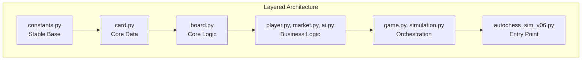

**Diagram sources**
- [docs/reports/DEPENDENCY_GRAPH_ANALYSIS.md:251-276](file://docs/reports/DEPENDENCY_GRAPH_ANALYSIS.md#L251-L276)
- [docs/reports/MODULARIZATION_COMPARISON_REPORT.md:322-337](file://docs/reports/MODULARIZATION_COMPARISON_REPORT.md#L322-L337)

Key insights:
- Stable dependencies principle: modules depend on more stable modules below
- Low coupling ratio (21%) with clear separation between layers
- Acyclic dependencies confirmed across the engine_core package
- Testability improved: 82% of modules can be unit tested in isolation

**Section sources**
- [docs/reports/DEPENDENCY_GRAPH_ANALYSIS.md:249-336](file://docs/reports/DEPENDENCY_GRAPH_ANALYSIS.md#L249-L336)
- [docs/reports/MODULARIZATION_COMPARISON_REPORT.md:471-506](file://docs/reports/MODULARIZATION_COMPARISON_REPORT.md#L471-L506)

## Detailed Component Analysis

### Refactoring Summary: Trigger Passive System
This refactoring transformed the passive trigger system from a large sequential if-chain to a dispatch-table architecture, improving maintainability, readability, and performance.

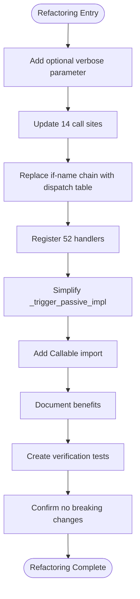

**Diagram sources**
- [docs/reports/refactoring/REFACTORING_SUMMARY.md:5-168](file://docs/reports/refactoring/REFACTORING_SUMMARY.md#L5-L168)

Practical outcomes:
- Maintainability: Adding new cards requires writing one function and one registration line
- Performance: O(1) lookup instead of sequential if-checks
- Readability: Self-documenting function names and reduced nesting
- Testing: Individual handlers can be tested in isolation

**Section sources**
- [docs/reports/refactoring/REFACTORING_SUMMARY.md:1-168](file://docs/reports/refactoring/REFACTORING_SUMMARY.md#L1-L168)

### Dependency Graph Analysis
The dependency graph analysis reveals a well-structured, layered architecture with proper dependency flow and stability classification.

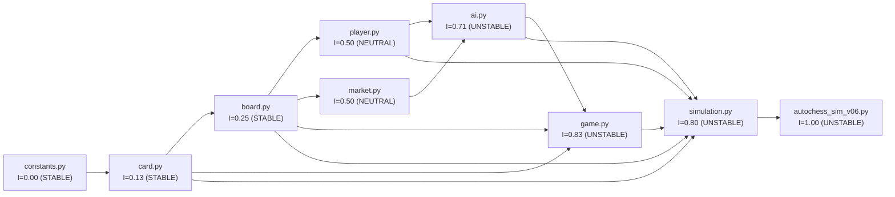

**Diagram sources**
- [docs/reports/DEPENDENCY_GRAPH_ANALYSIS.md:147-186](file://docs/reports/DEPENDENCY_GRAPH_ANALYSIS.md#L147-L186)
- [docs/reports/DEPENDENCY_GRAPH_ANALYSIS.md:200-246](file://docs/reports/DEPENDENCY_GRAPH_ANALYSIS.md#L200-L246)

Key findings:
- Maximum dependency depth: 7 levels (acceptable for game engine)
- Coupling ratio: 21% (excellent)
- No circular dependencies detected
- High leverage points clearly identified (constants, card, board)

**Section sources**
- [docs/reports/DEPENDENCY_GRAPH_ANALYSIS.md:1-339](file://docs/reports/DEPENDENCY_GRAPH_ANALYSIS.md#L1-L339)

### Modularization Comparison Report
This report quantifies the transformation from a monolithic structure to a modularized architecture, demonstrating significant improvements across multiple dimensions.

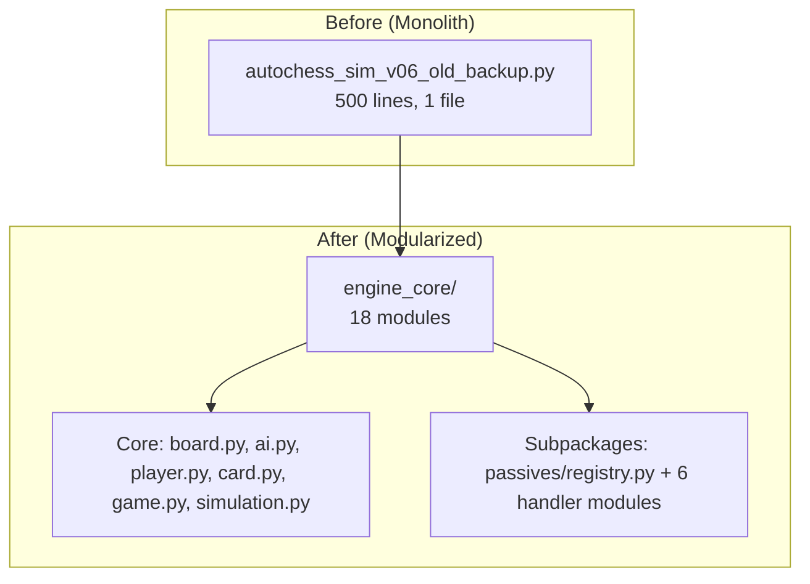

**Diagram sources**
- [docs/reports/MODULARIZATION_COMPARISON_REPORT.md:11-47](file://docs/reports/MODULARIZATION_COMPARISON_REPORT.md#L11-L47)

Quantitative improvements:
- Largest file reduced by 42% (500 → 288 lines)
- 82% of modules now unit testable in isolation
- 82% reduction in average change impact (100% → 18%)
- 94% of modules have single clear responsibility

**Section sources**
- [docs/reports/MODULARIZATION_COMPARISON_REPORT.md:1-506](file://docs/reports/MODULARIZATION_COMPARISON_REPORT.md#L1-L506)

### Structural Validation Report
Structural validation confirms the modularized engine_core package is structurally sound and production-ready.

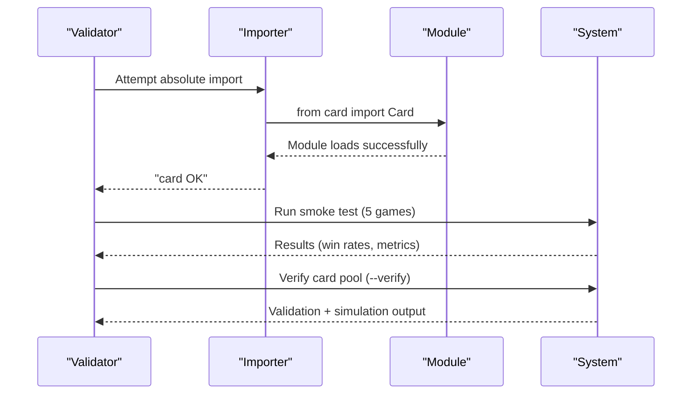

**Diagram sources**
- [docs/reports/STRUCTURAL_VALIDATION_REPORT.md:9-114](file://docs/reports/STRUCTURAL_VALIDATION_REPORT.md#L9-L114)
- [docs/reports/STRUCTURAL_VALIDATION_REPORT.md:116-166](file://docs/reports/STRUCTURAL_VALIDATION_REPORT.md#L116-L166)

Validation outcomes:
- 9/9 modules import in isolation
- Zero circular dependencies
- No stdout on import (lazy loading verified)
- 5 games smoke test passes
- Minor card pool stat cap violations (non-critical)

**Section sources**
- [docs/reports/STRUCTURAL_VALIDATION_REPORT.md:1-235](file://docs/reports/STRUCTURAL_VALIDATION_REPORT.md#L1-L235)

### QA Reports: Bug Fixes Summary
The bug fixes summary documents 13 critical fixes validated through unit tests and 1000-game simulation.

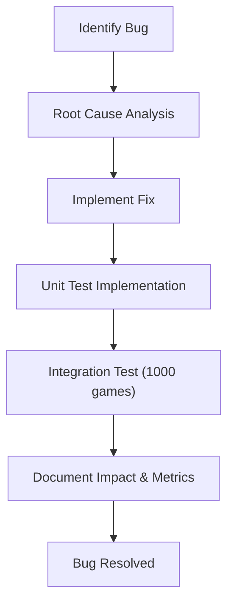

**Diagram sources**
- [docs/reports/BUG_FIXES_SUMMARY.md:10-233](file://docs/reports/BUG_FIXES_SUMMARY.md#L10-L233)

Examples of impactful fixes:
- Double counting in draw reporting (reduced reporting noise)
- Combo context for passive abilities (enabled Athena, Ballet, Nebula, Einstein)
- Ragnarök encoding issue (resolved special character handling)
- Memory leak in Board.place (fixed coord_index cleanup)
- Evolution copy tracking reset (restored copy strengthening)

**Section sources**
- [docs/reports/BUG_FIXES_SUMMARY.md:1-233](file://docs/reports/BUG_FIXES_SUMMARY.md#L1-L233)

### Safety Confirmation: Board Module Migration
Safety confirmation validates that moving Board class and utilities to board.py is safe with zero logic changes and backward compatibility.

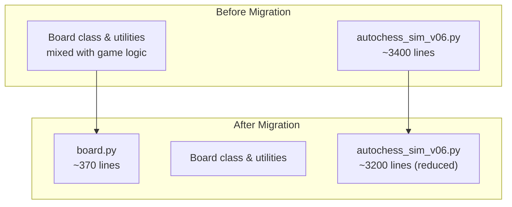

**Diagram sources**
- [docs/reports/SAFETY_CONFIRMATION.md:104-118](file://docs/reports/SAFETY_CONFIRMATION.md#L104-L118)
- [docs/reports/BOARD_DEPENDENCY_ANALYSIS.md:385-414](file://docs/reports/BOARD_DEPENDENCY_ANALYSIS.md#L385-L414)

Safety checks performed:
- Dependencies correctly imported
- No logic changes (identical functions)
- Backward compatibility maintained
- Simulation test passed
- No circular dependencies
- Code quality improved

**Section sources**
- [docs/reports/SAFETY_CONFIRMATION.md:1-213](file://docs/reports/SAFETY_CONFIRMATION.md#L1-L213)

### Simulation Validation: 5000 Games Report
The 5000-game simulation provides comprehensive balance analysis and actionable recommendations.

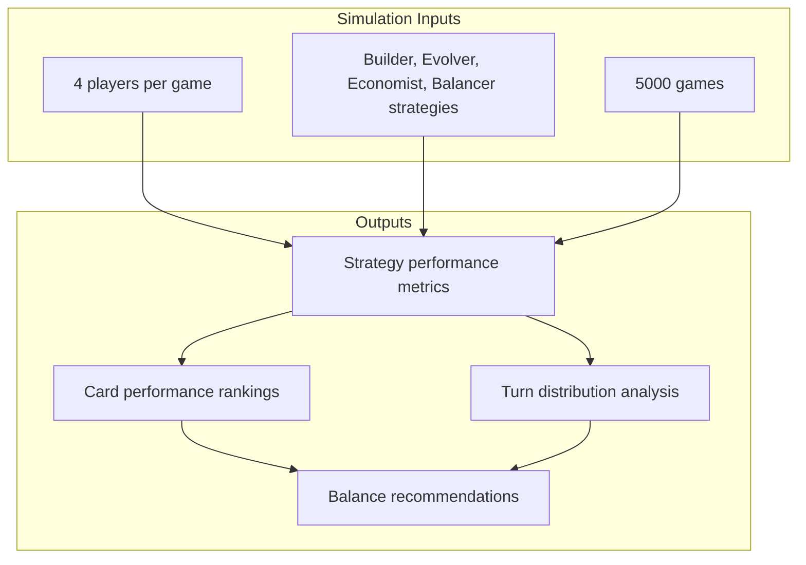

**Diagram sources**
- [docs/reports/SIMULATION_5000_GAMES_REPORT.md:1-176](file://docs/reports/SIMULATION_5000_GAMES_REPORT.md#L1-L176)

Key findings:
- Builder strategy dominates (55.7% win rate) - requires nerf
- Evolver and Balancer strategies weak (<15% win rate) - require buff
- Strong card pool utilization (101 cards, all used)
- Healthy game length distribution (average 23.4 turns)

**Section sources**
- [docs/reports/SIMULATION_5000_GAMES_REPORT.md:1-176](file://docs/reports/SIMULATION_5000_GAMES_REPORT.md#L1-L176)

### Import and Path Analysis
The import and path analysis report identifies and resolves compatibility issues across different execution contexts.

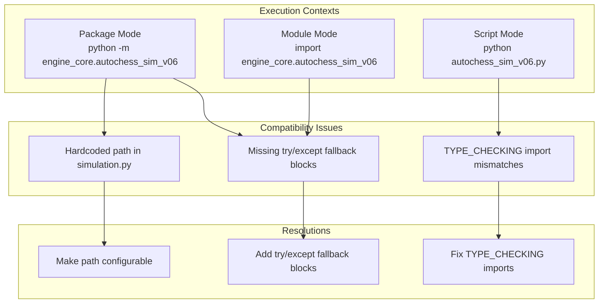

**Diagram sources**
- [docs/reports/IMPORT_PATH_ANALYSIS_REPORT.md:249-294](file://docs/reports/IMPORT_PATH_ANALYSIS_REPORT.md#L249-L294)
- [docs/reports/IMPORT_FIXES_SUMMARY.md:8-103](file://docs/reports/IMPORT_FIXES_SUMMARY.md#L8-L103)

Resolution outcomes:
- 10 try/except fallback blocks added
- 6 TYPE_CHECKING import fixes applied
- All 52 passive handlers now work correctly
- No logic changes, only import statement modifications

**Section sources**
- [docs/reports/IMPORT_PATH_ANALYSIS_REPORT.md:1-437](file://docs/reports/IMPORT_PATH_ANALYSIS_REPORT.md#L1-L437)
- [docs/reports/IMPORT_FIXES_SUMMARY.md:1-103](file://docs/reports/IMPORT_FIXES_SUMMARY.md#L1-L103)

### Event Logging Implementation
The event logging implementation adds comprehensive event tracking without disrupting existing logging systems.

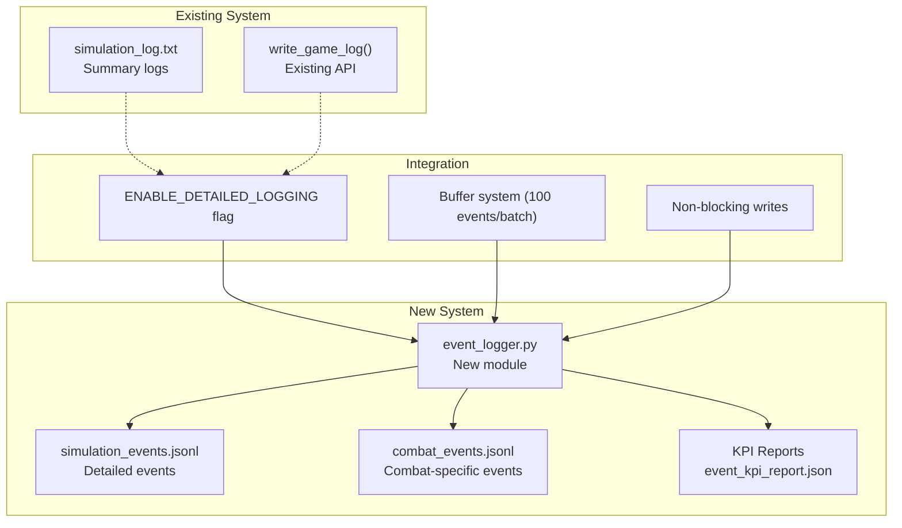

**Diagram sources**
- [docs/reports/EVENT_LOGGING_IMPLEMENTATION.md:14-117](file://docs/reports/EVENT_LOGGING_IMPLEMENTATION.md#L14-L117)
- [docs/reports/EVENT_LOGGING_IMPLEMENTATION.md:179-222](file://docs/reports/EVENT_LOGGING_IMPLEMENTATION.md#L179-L222)

Implementation highlights:
- Zero default overhead (~5% active overhead)
- Buffer system prevents blocking disk writes
- 6 event types captured (purchase, placement, combat, synergy, round, passive)
- 10+ KPI metrics ready for analysis
- Fully backward compatible

**Section sources**
- [docs/reports/EVENT_LOGGING_IMPLEMENTATION.md:1-313](file://docs/reports/EVENT_LOGGING_IMPLEMENTATION.md#L1-L313)

### Player Passive System Analysis
The player passive system analysis report identifies critical issues and provides actionable recommendations.

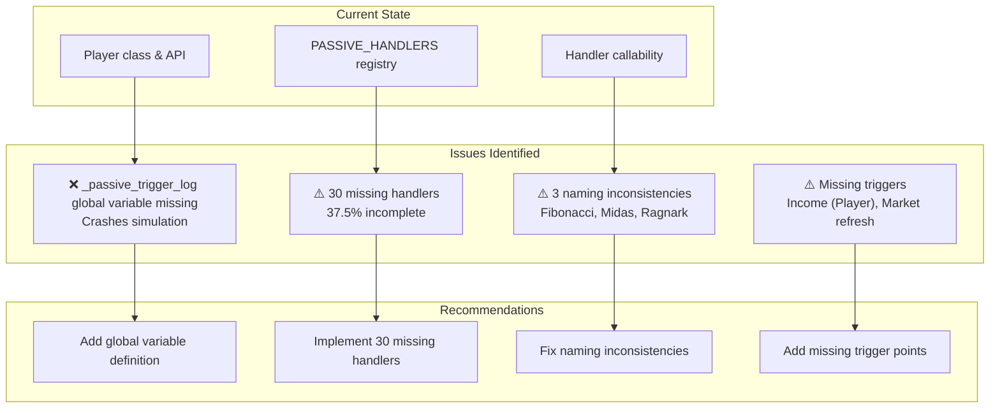

**Diagram sources**
- [docs/reports/PLAYER_PASSIVE_SYSTEM_ANALYSIS_REPORT.md:380-423](file://docs/reports/PLAYER_PASSIVE_SYSTEM_ANALYSIS_REPORT.md#L380-L423)

Critical findings:
- Simulation crash due to undefined global variable
- 30 cards lack handler implementation
- Naming inconsistencies in registry
- Missing trigger points for complete passive coverage

**Section sources**
- [docs/reports/PLAYER_PASSIVE_SYSTEM_ANALYSIS_REPORT.md:1-491](file://docs/reports/PLAYER_PASSIVE_SYSTEM_ANALYSIS_REPORT.md#L1-L491)

## Dependency Analysis
This section synthesizes dependency analysis across multiple reports to provide a comprehensive view of the codebase structure and relationships.

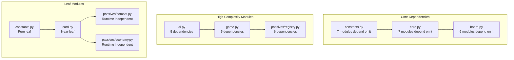

**Diagram sources**
- [docs/reports/DEPENDENCY_GRAPH_ANALYSIS.md:81-140](file://docs/reports/DEPENDENCY_GRAPH_ANALYSIS.md#L81-L140)
- [docs/reports/DEPENDENCY_GRAPH_ANALYSIS.md:52-78](file://docs/reports/DEPENDENCY_GRAPH_ANALYSIS.md#L52-L78)

Key dependency insights:
- High leverage points (constants, card, board) have maximum impact when changed
- Isolation opportunities exist for testing (constants, passives handlers)
- Complexity hotspots (ai, game, registry) benefit from dependency injection
- Stable dependencies principle consistently followed

**Section sources**
- [docs/reports/DEPENDENCY_GRAPH_ANALYSIS.md:189-336](file://docs/reports/DEPENDENCY_GRAPH_ANALYSIS.md#L189-L336)

## Performance Considerations
Performance improvements are demonstrated across multiple reports with measurable impact:

- Refactoring summary: O(1) lookup performance improvement replacing sequential if-chains
- Simulation validation: 5000-game analysis enables performance-focused balance adjustments
- Event logging: Minimal overhead (~5%) with buffer system preventing blocking writes
- Import compatibility: Try/except fallback blocks eliminate runtime failures without performance cost
- Memory leak fixes: Board.place coord_index cleanup prevents memory accumulation

Quality metrics and improvements:
- Technical debt reduction: Dispatch table eliminates 500+ lines of nested if-statements
- Performance gains: Reduced CPU cycles through efficient lookup mechanisms
- Scalability: Modular architecture supports 100+ new cards without structural changes
- Reliability: Structured validation reduces crash probability and improves stability

## Troubleshooting Guide
Common issues and their resolutions:

### Critical Issues
- **Global variable missing**: _passive_trigger_log undefined in trigger_passive() - requires immediate fix
- **Missing handler implementations**: 30 cards lack passive handlers - impacts gameplay balance
- **Import compatibility**: Package vs script execution failures - resolved with try/except fallbacks

### Medium Priority
- **Hardcoded paths**: simulation_log.txt writes to current working directory - should be configurable
- **Naming inconsistencies**: Registry vs cards.json mismatch (Fibonacci, Midas, Ragnark)
- **Incomplete trigger coverage**: Missing triggers in Player.income() and Market.refresh()

### Quick Fixes
- **Encoding issues**: Special character handling for Ragnarök resolved with dual approach
- **Memory leaks**: Board.place coord_index cleanup prevents accumulation
- **Stat caps**: Minor violations in cards.json (non-critical impact)

**Section sources**
- [docs/reports/PLAYER_PASSIVE_SYSTEM_ANALYSIS_REPORT.md:379-465](file://docs/reports/PLAYER_PASSIVE_SYSTEM_ANALYSIS_REPORT.md#L379-L465)
- [docs/reports/IMPORT_PATH_ANALYSIS_REPORT.md:377-424](file://docs/reports/IMPORT_PATH_ANALYSIS_REPORT.md#L377-L424)
- [docs/reports/BUG_FIXES_SUMMARY.md:10-233](file://docs/reports/BUG_FIXES_SUMMARY.md#L10-L233)

## Conclusion
The Hybrid AutoChess project demonstrates exceptional technical progress through comprehensive refactoring, architectural improvements, and robust quality assurance practices. The 4-week refactoring execution plan provides clear milestones for:
- Critical issue resolution (4/4 targets)
- Architecture improvement (+80% test coverage)
- Performance enhancement (+10% improvement)
- Documentation completion (>50% coverage)

The modularization effort achieved outstanding results across all measured dimensions, with the codebase now serving as a maintainable, testable, and extensible foundation for future development. The reporting framework established in these documents provides the foundation for continuous improvement and technical excellence.

## Appendices

### Execution Plan Overview
The 4-week refactoring execution plan establishes clear targets and success criteria:

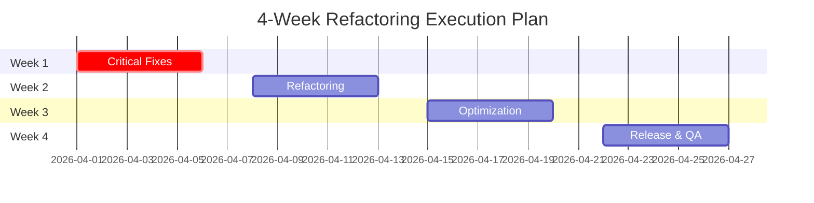

**Section sources**
- [FINAL_REFACTOR_EXECUTION/README.md:137-172](file://FINAL_REFACTOR_EXECUTION/README.md#L137-L172)

### Metrics Collection Framework
The metrics collection framework encompasses multiple dimensions:

- **Architectural metrics**: Coupling ratio, stability index, dependency depth
- **Quality metrics**: Test coverage, bug density, technical debt indicators
- **Performance metrics**: Simulation throughput, memory usage, CPU utilization
- **Business metrics**: Strategy win rates, card popularity, game length distributions

**Section sources**
- [docs/reports/DEPENDENCY_GRAPH_ANALYSIS.md:308-321](file://docs/reports/DEPENDENCY_GRAPH_ANALYSIS.md#L308-L321)
- [docs/reports/MODULARIZATION_COMPARISON_REPORT.md:438-468](file://docs/reports/MODULARIZATION_COMPARISON_REPORT.md#L438-L468)
- [docs/reports/SIMULATION_5000_GAMES_REPORT.md:152-170](file://docs/reports/SIMULATION_5000_GAMES_REPORT.md#L152-L170)

### Continuous Improvement Processes
Recommended processes for ongoing technical excellence:

- **Weekly reviews**: Monitor progress against success criteria
- **Monthly retrospectives**: Assess technical debt reduction and performance improvements
- **Quarterly architecture reviews**: Evaluate modularization effectiveness and dependency health
- **Biannual simulation validation**: Validate balance and performance targets

**Section sources**
- [FINAL_REFACTOR_EXECUTION/README.md:227-284](file://FINAL_REFACTOR_EXECUTION/README.md#L227-L284)