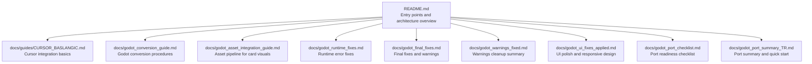
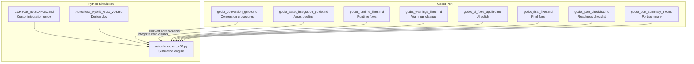
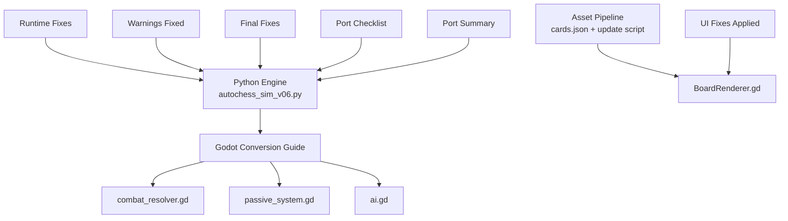

# Usage Guides

<cite>
**Referenced Files in This Document**
- [CURSOR_BASLANGIC.md](file://docs/guides/CURSOR_BASLANGIC.md)
- [godot_conversion_guide.md](file://docs/godot_conversion_guide.md)
- [godot_asset_integration_guide.md](file://docs/godot_asset_integration_guide.md)
- [godot_runtime_fixes.md](file://docs/godot_runtime_fixes.md)
- [godot_final_fixes.md](file://docs/godot_final_fixes.md)
- [godot_warnings_fixed.md](file://docs/godot_warnings_fixed.md)
- [godot_ui_fixes_applied.md](file://docs/godot_ui_fixes_applied.md)
- [godot_port_checklist.md](file://docs/godot_port_checklist.md)
- [godot_port_summary_TR.md](file://docs/godot_port_summary_TR.md)
- [README.md](file://README.md)
</cite>

## Table of Contents
1. [Introduction](#introduction)
2. [Project Structure](#project-structure)
3. [Core Components](#core-components)
4. [Architecture Overview](#architecture-overview)
5. [Detailed Component Analysis](#detailed-component-analysis)
6. [Dependency Analysis](#dependency-analysis)
7. [Performance Considerations](#performance-considerations)
8. [Troubleshooting Guide](#troubleshooting-guide)
9. [Conclusion](#conclusion)
10. [Appendices](#appendices)

## Introduction
This Usage Guides section provides practical, step-by-step instructions for integrating Cursor into development workflows, converting the Python engine to Godot (Godot port), and managing the asset pipeline for card visuals. It consolidates guidance from the repository’s official documentation into a single, accessible resource. Topics include:
- Cursor integration tutorial for onboarding and prompt-driven assistance
- Godot conversion procedures for core systems, passive abilities, and AI
- Asset integration workflows for card front/back visuals and automated metadata updates
- Runtime fixes, UI polish, and error handling for a smooth Godot port
- Advanced configuration options, troubleshooting, and best practices

## Project Structure
The repository organizes usage-related guidance under the docs/ directory, with dedicated guides for Cursor, Godot conversion, asset integration, runtime fixes, and port summaries. The top-level README outlines the project’s scope and entry points for both Python simulation and Godot port.

**Diagram sources**
- [README.md:131-142](file://README.md#L131-L142)
- [CURSOR_BASLANGIC.md:1-177](file://docs/guides/CURSOR_BASLANGIC.md#L1-L177)
- [godot_conversion_guide.md:1-600](file://docs/godot_conversion_guide.md#L1-L600)
- [godot_asset_integration_guide.md:1-377](file://docs/godot_asset_integration_guide.md#L1-L377)
- [godot_runtime_fixes.md:1-118](file://docs/godot_runtime_fixes.md#L1-L118)
- [godot_final_fixes.md:1-287](file://docs/godot_final_fixes.md#L1-L287)
- [godot_warnings_fixed.md:1-297](file://docs/godot_warnings_fixed.md#L1-L297)
- [godot_ui_fixes_applied.md:1-288](file://docs/godot_ui_fixes_applied.md#L1-L288)
- [godot_port_checklist.md:1-282](file://docs/godot_port_checklist.md#L1-L282)
- [godot_port_summary_TR.md:1-201](file://docs/godot_port_summary_TR.md#L1-L201)

**Section sources**
- [README.md:1-233](file://README.md#L1-L233)

## Core Components
This section highlights the primary usage workflows and their supporting documents:
- CURSOR_BASLANGIC.md: Provides a cursor integration tutorial, initial setup, and basic usage patterns for the Python engine.
- godot_conversion_guide.md: Outlines conversion procedures for combat, passive, and AI systems to GDScript.
- godot_asset_integration_guide.md: Documents the asset pipeline for card visuals, including naming conventions, metadata updates, and testing.
- godot_runtime_fixes.md, godot_final_fixes.md, godot_warnings_fixed.md, godot_ui_fixes_applied.md: Detail runtime fixes, warnings cleanup, UI polish, and responsive design adjustments.
- godot_port_checklist.md, godot_port_summary_TR.md: Summarize port readiness, completion status, and quick-start guidance.

Practical outcomes:
- Cursor integration streamlines onboarding and prompt-driven development.
- Godot conversion enables porting core systems while preserving engine logic.
- Asset pipeline ensures consistent card visuals and metadata synchronization.
- Runtime and UI fixes guarantee stability and polished presentation.

**Section sources**
- [CURSOR_BASLANGIC.md:1-177](file://docs/guides/CURSOR_BASLANGIC.md#L1-L177)
- [godot_conversion_guide.md:1-600](file://docs/godot_conversion_guide.md#L1-L600)
- [godot_asset_integration_guide.md:1-377](file://docs/godot_asset_integration_guide.md#L1-L377)
- [godot_runtime_fixes.md:1-118](file://docs/godot_runtime_fixes.md#L1-L118)
- [godot_final_fixes.md:1-287](file://docs/godot_final_fixes.md#L1-L287)
- [godot_warnings_fixed.md:1-297](file://docs/godot_warnings_fixed.md#L1-L297)
- [godot_ui_fixes_applied.md:1-288](file://docs/godot_ui_fixes_applied.md#L1-L288)
- [godot_port_checklist.md:1-282](file://docs/godot_port_checklist.md#L1-L282)
- [godot_port_summary_TR.md:1-201](file://docs/godot_port_summary_TR.md#L1-L201)

## Architecture Overview
The usage guides align with the project’s dual-mode architecture:
- Python simulation engine for rapid iteration and testing
- Godot port for interactive gameplay and polished UI

**Diagram sources**
- [CURSOR_BASLANGIC.md:1-177](file://docs/guides/CURSOR_BASLANGIC.md#L1-L177)
- [godot_conversion_guide.md:1-600](file://docs/godot_conversion_guide.md#L1-L600)
- [godot_asset_integration_guide.md:1-377](file://docs/godot_asset_integration_guide.md#L1-L377)
- [godot_runtime_fixes.md:1-118](file://docs/godot_runtime_fixes.md#L1-L118)
- [godot_warnings_fixed.md:1-297](file://docs/godot_warnings_fixed.md#L1-L297)
- [godot_ui_fixes_applied.md:1-288](file://docs/godot_ui_fixes_applied.md#L1-L288)
- [godot_final_fixes.md:1-287](file://docs/godot_final_fixes.md#L1-L287)
- [godot_port_checklist.md:1-282](file://docs/godot_port_checklist.md#L1-L282)
- [godot_port_summary_TR.md:1-201](file://docs/godot_port_summary_TR.md#L1-L201)

## Detailed Component Analysis

### CURSOR_BASLANGIC: Cursor Integration Tutorial
This guide introduces cursor integration for onboarding and daily development tasks. It covers:
- Project orientation and key files
- Running simulations with configurable parameters
- Current status and prioritized development tasks
- Code architecture overview and important constants
- Cursor chat prompt examples for targeted assistance

Practical steps:
- Open the guide in Cursor and follow the “@CURSOR_BASLANGIC.md dosyasını oku, projeyi anla” instruction
- Explore the simulation runner with different game counts, player counts, verbosity, and verification modes
- Review the architecture diagram and constants to understand engine mechanics
- Use the provided Cursor chat prompts to request targeted changes or analysis

Best practices:
- Keep prompts focused on specific functions or files
- Reference the GDD for design-consistent changes
- Validate changes with the verification mode

**Section sources**
- [CURSOR_BASLANGIC.md:1-177](file://docs/guides/CURSOR_BASLANGIC.md#L1-L177)

### Godot Conversion Procedures
This guide documents the conversion of Python engine systems to GDScript for the Godot port. It includes:
- Already completed systems (market and game loop)
- Missing systems requiring connection points (combat resolver, passive system, AI)
- Conversion of core functions and GDScript structure
- Key differences between Python and GDScript
- Integration steps and next steps

Conversion workflow:
- Create the three GDScript files: combat_resolver.gd, passive_system.gd, ai.gd
- Update game.gd to instantiate and reference the new systems
- Test each system independently, then run integrated tests
- Iterate on missing features (edge-by-edge comparison, combo bonuses, group advantage)

Advanced configuration:
- Use FuncRef for callback-style integration
- Parameterize AI strategies and thresholds
- Maintain type safety and explicit casting for numeric operations

**Section sources**
- [godot_conversion_guide.md:1-600](file://docs/godot_conversion_guide.md#L1-L600)

### Asset Integration Workflows
This guide explains the asset pipeline for card visuals:
- Folder structure for fronts and backs
- Naming conventions and Turkish character normalization
- Automated metadata updates via Python script
- Manual fallback and placeholder generation
- Board rendering flow and texture caching

Workflow:
- Prepare PNG assets (512x512 or 1024x1024) with transparency
- Copy front/back images to respective folders
- Run the update script to synchronize cards.json
- Test in Godot and verify rendering and performance

Quality and performance tips:
- Use mipmaps and compression for large sets
- Cache textures to maintain 60 FPS with 74 cards on screen
- Normalize names to ASCII equivalents for cross-platform compatibility

**Section sources**
- [godot_asset_integration_guide.md:1-377](file://docs/godot_asset_integration_guide.md#L1-L377)

### Runtime Fixes and Compatibility
Multiple documents detail runtime fixes and compatibility improvements:
- Runtime fixes: address icon.svg warnings, swiss_pairs comparison function, and missing market.return_one
- Final fixes: resolve parse errors (pivot_offset), integer division warnings, and autoload static method warnings
- Warnings cleanup: eliminate shadowed variables, unused parameters, and global identifier conflicts
- UI fixes: responsive board, dynamic HEX_SIZE, board centering, and improved shop/hand visuals

Compatibility requirements:
- GDScript 4 type safety and explicit casting
- Correct node types (Node2D vs Control) for positioning and pivoting
- Autoload singleton patterns and warning suppression for false positives

**Section sources**
- [godot_runtime_fixes.md:1-118](file://docs/godot_runtime_fixes.md#L1-L118)
- [godot_final_fixes.md:1-287](file://docs/godot_final_fixes.md#L1-L287)
- [godot_warnings_fixed.md:1-297](file://docs/godot_warnings_fixed.md#L1-L297)
- [godot_ui_fixes_applied.md:1-288](file://docs/godot_ui_fixes_applied.md#L1-L288)

### Integration Frameworks and Port Readiness
The port readiness framework consolidates completion status and next steps:
- Core systems: 100% complete (Card, Board, Player, Market, Game, Combat, Passive, AI)
- UI systems: 100% complete (responsive board, hex renderer, shop window, hand management)
- Error handling: 100% cleaned (warnings, parse errors, runtime errors)
- Asset system: ready for PNG assets with documentation and tools

Checklist highlights:
- Add card assets and run the update script
- Conduct full game tests across strategies and systems
- Optional polish: animations, sound effects, UI enhancements, multiplayer groundwork

**Section sources**
- [godot_port_checklist.md:1-282](file://docs/godot_port_checklist.md#L1-L282)
- [godot_port_summary_TR.md:1-201](file://docs/godot_port_summary_TR.md#L1-L201)

## Dependency Analysis
The usage guides illustrate dependencies among components during conversion and integration:

**Diagram sources**
- [godot_conversion_guide.md:1-600](file://docs/godot_conversion_guide.md#L1-L600)
- [godot_asset_integration_guide.md:1-377](file://docs/godot_asset_integration_guide.md#L1-L377)
- [godot_ui_fixes_applied.md:1-288](file://docs/godot_ui_fixes_applied.md#L1-L288)
- [godot_runtime_fixes.md:1-118](file://docs/godot_runtime_fixes.md#L1-L118)
- [godot_warnings_fixed.md:1-297](file://docs/godot_warnings_fixed.md#L1-L297)
- [godot_final_fixes.md:1-287](file://docs/godot_final_fixes.md#L1-L287)
- [godot_port_checklist.md:1-282](file://docs/godot_port_checklist.md#L1-L282)
- [godot_port_summary_TR.md:1-201](file://docs/godot_port_summary_TR.md#L1-L201)

## Performance Considerations
- Texture caching: Maintain a texture cache to reduce load overhead and sustain 60 FPS with 74 cards on screen
- Dynamic scaling: Use viewport-aware calculations for HEX_SIZE and board centering to preserve performance across resolutions
- Integer division: Ensure explicit float casting to prevent warnings and maintain predictable numeric behavior
- UI optimization: Cache style boxes and minimize redundant style creation for shop and hand visuals

[No sources needed since this section provides general guidance]

## Troubleshooting Guide
Common issues and resolutions:
- Runtime errors
  - swiss_pairs comparison function: precompute jitter values to ensure consistent ordering
  - market.return_one missing: add the function to restore hand overflow behavior
- Parse errors
  - pivot_offset not declared: use Node2D-compatible positioning (position) instead of Control-only pivot_offset
- Warnings
  - INTEGER_DIVISION: cast operands to float before integer conversion
  - SHADOWED_VARIABLE_BASE_CLASS: rename conflicting parameter names (e.g., owner → card_owner)
  - UNUSED_PARAMETER: prefix unused parameters with _
  - STATIC_CALLED_ON_INSTANCE: suppress warnings for autoload singletons or call via type reference
- UI problems
  - Board misalignment: adjust HEX_SIZE dynamically and center via ORIGIN and position
  - Shop/hand visuals: set modulate to white, add rarity borders, and implement hover effects

Validation steps:
- Compile and run tests to confirm zero warnings and parse errors
- Verify board responsiveness across resolutions
- Confirm shop and hand visuals render correctly with rarity indicators
- Test combat results and AI strategies end-to-end

**Section sources**
- [godot_runtime_fixes.md:1-118](file://docs/godot_runtime_fixes.md#L1-L118)
- [godot_final_fixes.md:1-287](file://docs/godot_final_fixes.md#L1-L287)
- [godot_warnings_fixed.md:1-297](file://docs/godot_warnings_fixed.md#L1-L297)
- [godot_ui_fixes_applied.md:1-288](file://docs/godot_ui_fixes_applied.md#L1-L288)

## Conclusion
The Usage Guides consolidate essential workflows for cursor integration, Godot conversion, and asset pipeline management. By following the step-by-step instructions, leveraging the provided checklists and summaries, and applying the troubleshooting and performance recommendations, contributors can efficiently onboard, iterate, and ship a polished Godot port while maintaining alignment with the Python simulation engine.

[No sources needed since this section summarizes without analyzing specific files]

## Appendices

### Beginner-Friendly Quick Start
- Cursor integration: Open CURSOR_BASLANGIC.md in Cursor and follow the onboarding prompt
- Simulation: Use the provided commands to run simulations with different configurations
- Godot port: Start with the conversion guide and implement combat_resolver.gd, passive_system.gd, and ai.gd
- Assets: Prepare PNGs, normalize names, run the update script, and test in Godot

**Section sources**
- [CURSOR_BASLANGIC.md:1-177](file://docs/guides/CURSOR_BASLANGIC.md#L1-L177)
- [godot_conversion_guide.md:1-600](file://docs/godot_conversion_guide.md#L1-L600)
- [godot_asset_integration_guide.md:1-377](file://docs/godot_asset_integration_guide.md#L1-L377)

### Advanced Configuration Options
- Cursor prompts: Reference specific functions and files for targeted assistance
- Godot conversion: Use FuncRef callbacks, parameterize AI strategies, and maintain type safety
- Asset pipeline: Automate metadata updates, manage placeholders, and optimize texture caching

**Section sources**
- [CURSOR_BASLANGIC.md:156-177](file://docs/guides/CURSOR_BASLANGIC.md#L156-L177)
- [godot_conversion_guide.md:558-600](file://docs/godot_conversion_guide.md#L558-L600)
- [godot_asset_integration_guide.md:220-377](file://docs/godot_asset_integration_guide.md#L220-L377)

### Migration Strategies and Best Practices
- Incremental conversion: Port core systems first, then UI and assets
- Validation: Compare results against the Python engine to ensure parity
- Documentation: Keep usage guides synchronized with code changes
- Community support: Use the repository’s issue-based communication for questions

**Section sources**
- [godot_conversion_guide.md:558-600](file://docs/godot_conversion_guide.md#L558-L600)
- [godot_port_checklist.md:254-282](file://docs/godot_port_checklist.md#L254-L282)
- [README.md:230-233](file://README.md#L230-L233)