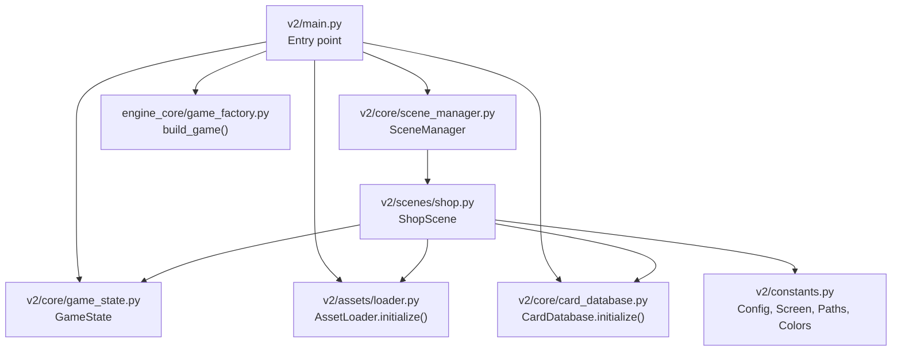
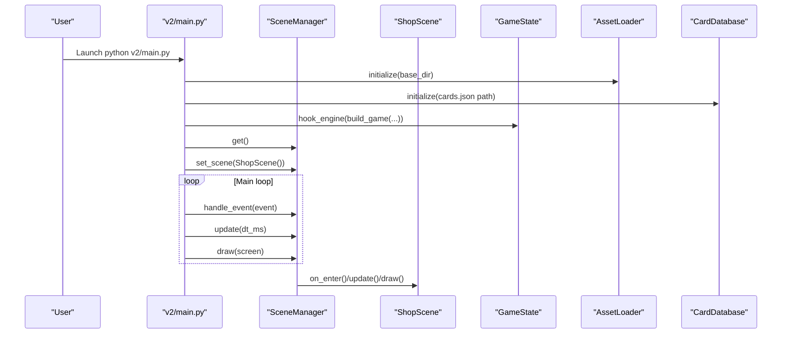
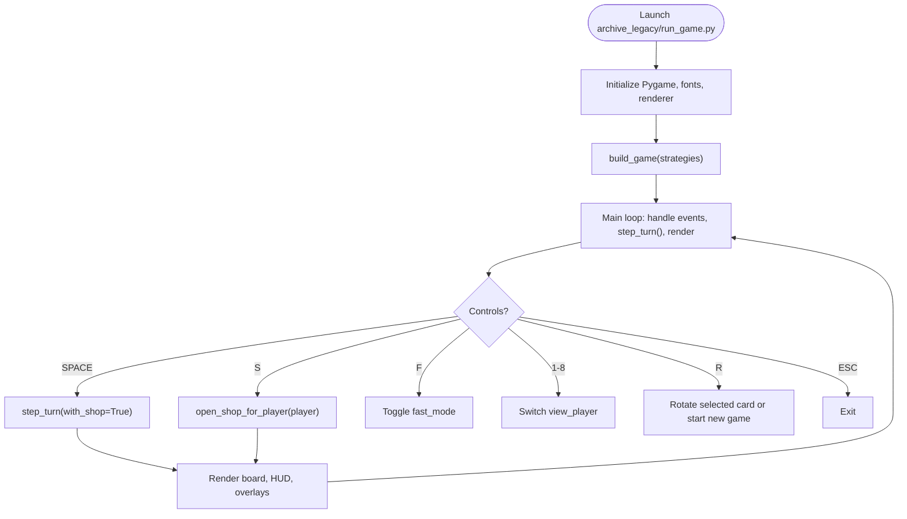
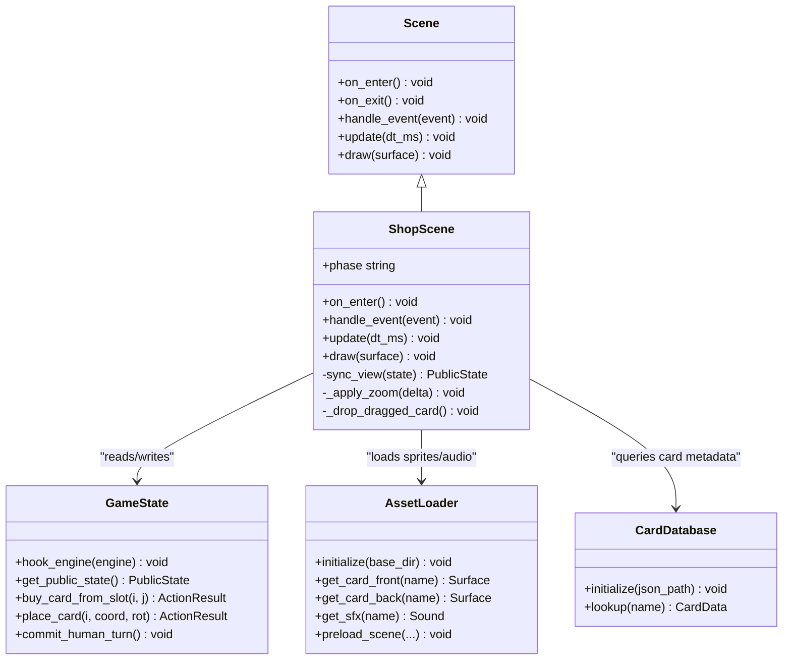
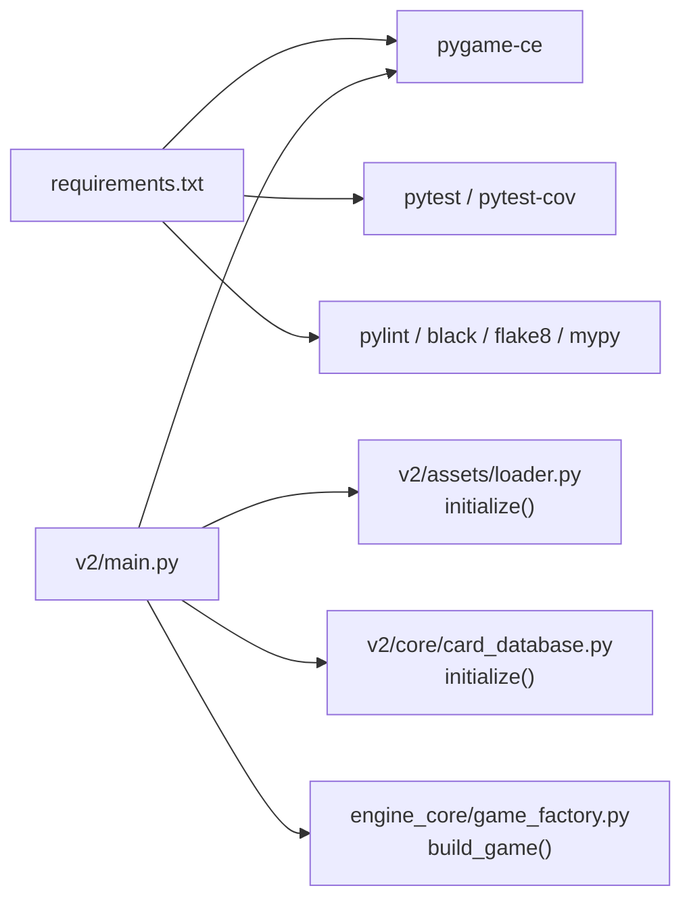

# Getting Started

<cite>
**Referenced Files in This Document**
- [README.md](file://README.md)
- [requirements.txt](file://requirements.txt)
- [v2/main.py](file://v2/main.py)
- [v2/core/scene_manager.py](file://v2/core/scene_manager.py)
- [v2/scenes/shop.py](file://v2/scenes/shop.py)
- [v2/constants.py](file://v2/constants.py)
- [v2/core/game_state.py](file://v2/core/game_state.py)
- [v2/core/card_database.py](file://v2/core/card_database.py)
- [v2/assets/loader.py](file://v2/assets/loader.py)
- [engine_core/game_factory.py](file://engine_core/game_factory.py)
- [archive_legacy/run_game.py](file://archive_legacy/run_game.py)
</cite>

## Table of Contents
1. [Introduction](#introduction)
2. [Project Structure](#project-structure)
3. [Core Components](#core-components)
4. [Architecture Overview](#architecture-overview)
5. [Detailed Component Analysis](#detailed-component-analysis)
6. [Dependency Analysis](#dependency-analysis)
7. [Performance Considerations](#performance-considerations)
8. [Troubleshooting Guide](#troubleshooting-guide)
9. [Conclusion](#conclusion)

## Introduction
Autochess Hybrid is a hex-grid based autochess simulation engine supporting 8-player matches with a 101-card pool. It features a modern scene-based architecture for modular gameplay stages and a legacy monolithic entry point for backward compatibility. This guide helps you install, configure, and run the game, and explains the differences between the modern and legacy entry points.

## Project Structure
At a high level, the project is organized into:
- Engine core: simulation logic and game mechanics
- v2: modern scene-based UI and orchestration
- assets: data and media for cards, fonts, and audio
- scripts and tools: simulations, validations, and developer utilities
- docs: design documents and reports
- tests: unit, integration, and QA suites
- archive_legacy: legacy entry point and related artifacts

Key entry points:
- Modern scene-based: v2/main.py
- Legacy monolithic: archive_legacy/run_game.py

System requirements:
- Python 3.14+
- pip

Installation steps:
- Create and activate a virtual environment
- Install dependencies from requirements.txt

Usage highlights:
- Run the modern scene-based entry point
- Controls include keyboard shortcuts for turn progression, shop access, rotation, and camera navigation
- Simulations and tests are available via scripts and pytest

**Section sources**
- [README.md:60-129](file://README.md#L60-L129)

## Core Components
- v2/main.py: Initializes Pygame, bootstraps assets and engine, wires the SceneManager to the ShopScene, and runs the main loop.
- v2/core/scene_manager.py: Manages scenes with fade transitions, event routing, and drawing.
- v2/scenes/shop.py: Implements the ShopScene with panels, overlays, drag-and-drop placement, and phase machine integration.
- v2/core/game_state.py: Provides a single access point for engine mutations and cached public state for UI reads.
- v2/core/card_database.py: Loads and exposes card metadata from assets/data/cards.json.
- v2/assets/loader.py: Centralized asset loading for sprites, fonts, SFX, and music.
- engine_core/game_factory.py: Builds a Game instance with players, RNG, and callbacks.
- archive_legacy/run_game.py: Legacy entry point with integrated screens and controls.

**Section sources**
- [v2/main.py:14-74](file://v2/main.py#L14-L74)
- [v2/core/scene_manager.py:28-156](file://v2/core/scene_manager.py#L28-L156)
- [v2/scenes/shop.py:23-682](file://v2/scenes/shop.py#L23-L682)
- [v2/core/game_state.py:14-173](file://v2/core/game_state.py#L14-L173)
- [v2/core/card_database.py:69-145](file://v2/core/card_database.py#L69-L145)
- [v2/assets/loader.py:14-122](file://v2/assets/loader.py#L14-L122)
- [engine_core/game_factory.py:30-70](file://engine_core/game_factory.py#L30-L70)
- [archive_legacy/run_game.py:155-565](file://archive_legacy/run_game.py#L155-L565)

## Architecture Overview
Modern scene-based architecture organizes gameplay into discrete scenes managed by a SceneManager. The ShopScene coordinates UI panels, overlays, and engine actions through GameState hooks. Assets and card data are initialized early and reused across scenes.

**Diagram sources**
- [v2/main.py:14-47](file://v2/main.py#L14-L47)
- [v2/core/scene_manager.py:28-156](file://v2/core/scene_manager.py#L28-L156)
- [v2/scenes/shop.py:23-71](file://v2/scenes/shop.py#L23-L71)
- [v2/core/game_state.py:37-40](file://v2/core/game_state.py#L37-L40)
- [v2/core/card_database.py:84-108](file://v2/core/card_database.py#L84-L108)
- [v2/assets/loader.py:31-35](file://v2/assets/loader.py#L31-L35)
- [engine_core/game_factory.py:30-69](file://engine_core/game_factory.py#L30-L69)

## Detailed Component Analysis

### Scene-Based Entry Point (Recommended)
- Initializes Pygame, sets up screen and clock
- Bootstraps AssetLoader and CardDatabase
- Builds a Game via engine_core/game_factory and hooks it into GameState
- Starts SceneManager with ShopScene as the initial scene
- Handles events, updates, and draws per frame

**Diagram sources**
- [v2/main.py:37-69](file://v2/main.py#L37-L69)
- [v2/core/scene_manager.py:64-142](file://v2/core/scene_manager.py#L64-L142)
- [v2/scenes/shop.py:76-98](file://v2/scenes/shop.py#L76-L98)
- [v2/core/game_state.py:37-40](file://v2/core/game_state.py#L37-L40)
- [v2/assets/loader.py:31-35](file://v2/assets/loader.py#L31-L35)
- [v2/core/card_database.py:84-108](file://v2/core/card_database.py#L84-L108)

**Section sources**
- [v2/main.py:14-74](file://v2/main.py#L14-L74)
- [v2/core/scene_manager.py:28-156](file://v2/core/scene_manager.py#L28-L156)
- [v2/scenes/shop.py:23-71](file://v2/scenes/shop.py#L23-L71)

### Legacy Entry Point (Deprecated)
- Monolithic initialization with integrated screens and rendering
- Keyboard and mouse controls for shop, placement, and turn progression
- Fast mode bypasses shop screens and automates turns
- Provides a direct path to run the old architecture

**Diagram sources**
- [archive_legacy/run_game.py:155-565](file://archive_legacy/run_game.py#L155-L565)

**Section sources**
- [archive_legacy/run_game.py:11-34](file://archive_legacy/run_game.py#L11-L34)
- [archive_legacy/run_game.py:155-565](file://archive_legacy/run_game.py#L155-L565)

### ShopScene: Drag-and-Drop Placement and Overlays
- Manages ShopPanel, HandPanel, PlayerHub, SynergyHUD, MinimapHUD, and overlays
- Integrates a PhaseMachine to coordinate STATE_PREPARATION, STATE_VERSUS, STATE_COMBAT, STATE_ENDGAME
- Handles keyboard and mouse events for camera, rotation, dragging, and shop actions
- Syncs UI with GameState and renders floating text and synergy previews

**Diagram sources**
- [v2/core/scene_manager.py:4-26](file://v2/core/scene_manager.py#L4-L26)
- [v2/scenes/shop.py:23-71](file://v2/scenes/shop.py#L23-L71)
- [v2/core/game_state.py:59-173](file://v2/core/game_state.py#L59-L173)
- [v2/assets/loader.py:31-114](file://v2/assets/loader.py#L31-L114)
- [v2/core/card_database.py:84-133](file://v2/core/card_database.py#L84-L133)

**Section sources**
- [v2/scenes/shop.py:23-682](file://v2/scenes/shop.py#L23-L682)
- [v2/core/game_state.py:59-173](file://v2/core/game_state.py#L59-L173)
- [v2/assets/loader.py:31-114](file://v2/assets/loader.py#L31-L114)
- [v2/core/card_database.py:84-133](file://v2/core/card_database.py#L84-L133)

## Dependency Analysis
- Python 3.14+ and pip are required.
- Core runtime depends on pygame-ce for rendering and input.
- Testing and quality tools include pytest, pytest-cov, pylint, black, flake8, and mypy.
- The modern entry point initializes AssetLoader and CardDatabase before building the engine via engine_core/game_factory.

**Diagram sources**
- [requirements.txt:1-20](file://requirements.txt#L1-L20)
- [v2/main.py:23-34](file://v2/main.py#L23-L34)
- [v2/assets/loader.py:31-35](file://v2/assets/loader.py#L31-L35)
- [v2/core/card_database.py:84-108](file://v2/core/card_database.py#L84-L108)
- [engine_core/game_factory.py:30-69](file://engine_core/game_factory.py#L30-L69)

**Section sources**
- [requirements.txt:1-20](file://requirements.txt#L1-L20)
- [v2/main.py:23-34](file://v2/main.py#L23-L34)

## Performance Considerations
- Use the cached public state in GameState to avoid expensive recomputation per frame.
- Preload scene audio assets to reduce latency during transitions.
- Keep asset caches minimal and clear when appropriate to manage memory.
- Tune FPS and VSYNC via environment variables exposed in v2/constants.py.

[No sources needed since this section provides general guidance]

## Troubleshooting Guide
Common setup and runtime issues:
- Missing Python version: Ensure Python 3.14+ is installed and selected by your environment.
- Virtual environment activation: Activate the venv before installing dependencies and running the game.
- Missing assets: Confirm cards.json exists at the expected path and that asset directories are present.
- Audio errors: Verify SFX and music files exist under v2/assets; AssetLoader raises explicit exceptions when missing.
- Legacy entry point: Prefer v2/main.py for new development; run_game.py remains for historical reference.

Environment configuration tips:
- Set DEBUG_MODE, VSYNC, and FPS via environment variables; constants load from .env if present.
- Adjust Paths for assets and Fonts if you move directories.

Dependency management:
- Reinstall dependencies after updating requirements.txt.
- Resolve linter and formatter warnings to maintain consistency.

**Section sources**
- [v2/constants.py:3-16](file://v2/constants.py#L3-L16)
- [v2/assets/loader.py:82-103](file://v2/assets/loader.py#L82-L103)
- [v2/core/card_database.py:89-90](file://v2/core/card_database.py#L89-L90)
- [README.md:60-80](file://README.md#L60-L80)

## Conclusion
You now have the essentials to install, configure, and run Autochess Hybrid using the modern scene-based architecture. Use v2/main.py for development and production, and refer to the legacy entry point for historical context. Explore the ShopScene, GameState, and asset loaders to extend functionality and integrate new features.