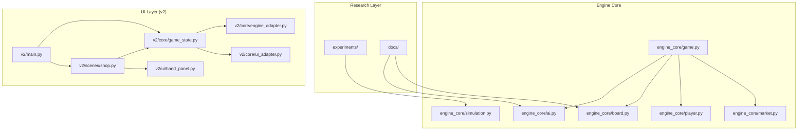
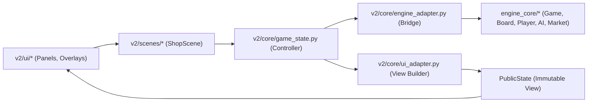
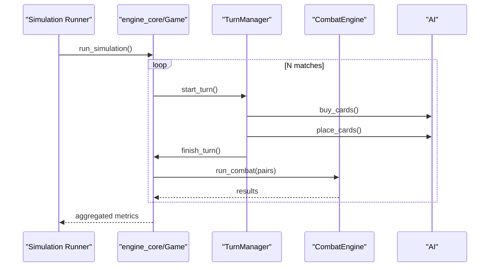
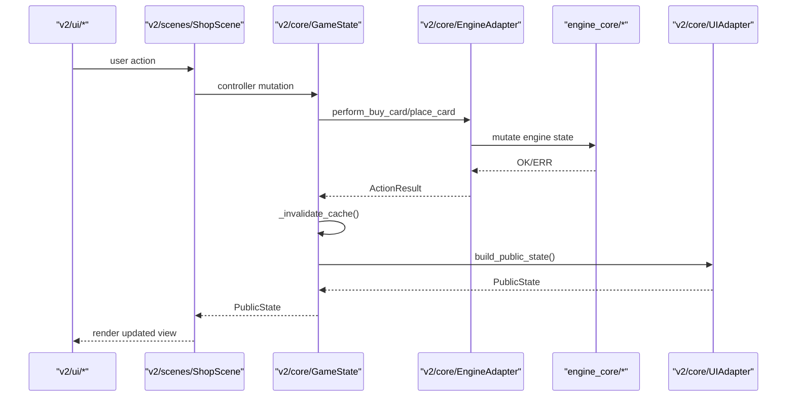
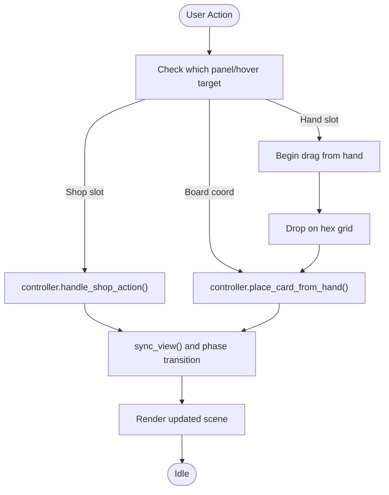
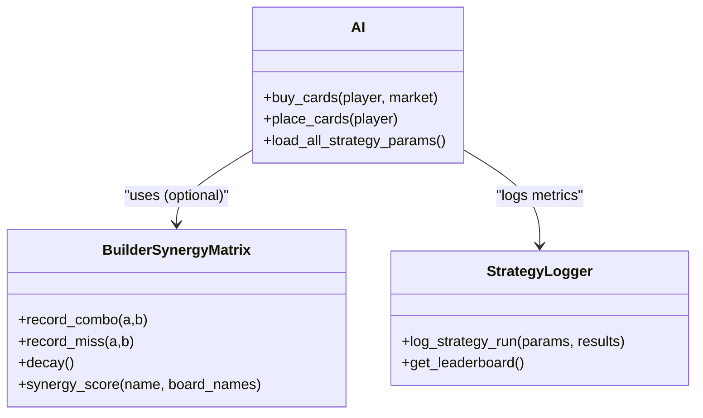
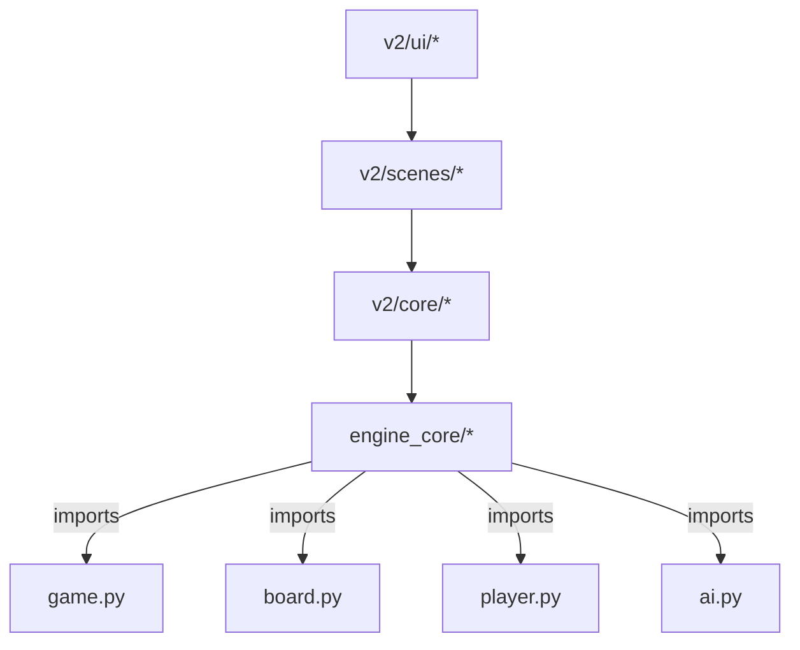

# Architecture and Positioning

<cite>
**Referenced Files in This Document**
- [AUTOCHESS_HYBRID_FINAL_GDD.md](file://AUTOCHESS_HYBRID_FINAL_GDD.md)
- [CODEBASE_ARCHITECTURE_ANALYSIS.md](file://CODEBASE_ARCHITECTURE_ANALYSIS.md)
- [SENIOR_ARCHITECT_REPORT.md](file://SENIOR_ARCHITECT_REPORT.md)
- [ARCHITECT_REPORT_EXECUTIVE_SUMMARY.md](file://ARCHITECT_REPORT_EXECUTIVE_SUMMARY.md)
- [IMPLEMENTATION_PLAN_EXECUTABLE.md](file://IMPLEMENTATION_PLAN_EXECUTABLE.md)
- [engine_core/__init__.py](file://engine_core/__init__.py)
- [v2/main.py](file://v2/main.py)
- [engine_core/game.py](file://engine_core/game.py)
- [v2/core/game_state.py](file://v2/core/game_state.py)
- [v2/core/engine_adapter.py](file://v2/core/engine_adapter.py)
- [v2/core/ui_adapter.py](file://v2/core/ui_adapter.py)
- [engine_core/ai.py](file://engine_core/ai.py)
- [v2/scenes/shop.py](file://v2/scenes/shop.py)
- [v2/ui/hand_panel.py](file://v2/ui/hand_panel.py)
</cite>

## Table of Contents
1. [Introduction](#introduction)
2. [Project Structure](#project-structure)
3. [Core Components](#core-components)
4. [Architecture Overview](#architecture-overview)
5. [Detailed Component Analysis](#detailed-component-analysis)
6. [Dependency Analysis](#dependency-analysis)
7. [Performance Considerations](#performance-considerations)
8. [Troubleshooting Guide](#troubleshooting-guide)
9. [Conclusion](#conclusion)
10. [Appendices](#appendices)

## Introduction
This document describes the Autochess Hybrid architecture and its positioning within the gaming AI research landscape. The project is in transition from a legacy monolithic design to a modern scene-based architecture. The current state combines a pure game engine (engine_core) with a UI layer (v2) that bridges to the engine via adapters and state management. The architecture supports both research-grade simulation and UI-driven gameplay, enabling experimentation with AI strategies, simulation benchmarking, and competitive analysis. The document explains the evolution, design principles, extensibility, and technical positioning for both research and potential commercial use.

## Project Structure
The repository is organized into distinct layers:
- engine_core: Pure game engine with no UI dependencies, containing core game logic, AI, combat, and simulation facilities.
- v2: Modern UI layer built on Pygame, including scenes, panels, and state adapters that consume engine_core.
- docs and experiments: Research artifacts, strategy registries, and simulation harnesses.
- assets/data: Card database and configuration assets.

**Diagram sources**
- [v2/main.py:14-35](file://v2/main.py#L14-L35)
- [engine_core/game.py:35-96](file://engine_core/game.py#L35-L96)
- [v2/core/game_state.py:37-53](file://v2/core/game_state.py#L37-L53)
- [v2/core/engine_adapter.py:38-46](file://v2/core/engine_adapter.py#L38-L46)
- [v2/core/ui_adapter.py:24-21](file://v2/core/ui_adapter.py#L24-L21)
- [v2/scenes/shop.py:23-41](file://v2/scenes/shop.py#L23-L41)
- [v2/ui/hand_panel.py:25-90](file://v2/ui/hand_panel.py#L25-L90)

**Section sources**
- [v2/main.py:14-35](file://v2/main.py#L14-L35)
- [engine_core/__init__.py:17-43](file://engine_core/__init__.py#L17-L43)

## Core Components
- Engine Core (engine_core): Provides the authoritative game state and logic, including Game orchestration, Player/Economy/Board/Card subsystems, Market, AI strategies, combat resolution, and simulation runner. It is UI-agnostic and designed for research-grade determinism and benchmarking.
- v2 State Management: GameState orchestrates engine mutations and caches immutable PublicState snapshots for UI consumption. It attaches hooks to board mutations to maintain synchronization.
- v2 Engine Adapter: A bridge that exposes a controlled API to the UI, encapsulating engine access and translating UI actions into engine mutations.
- v2 UI Adapter: Builds immutable UI-facing views from engine state, including active player view, shop, hand, HUD, synergy, and combat state.
- v2 Scenes and Panels: Scene-driven UI (ShopScene) with panels (HandPanel, ShopPanel, SynergyHUD) that render and accept user input, delegating actions to the controller (GameState + EngineAdapter).
- AI Strategies: Parameterized strategies with trained parameters and a session-level synergy memory for the builder AI, enabling research-grade strategy experimentation and tuning.

**Section sources**
- [engine_core/game.py:35-96](file://engine_core/game.py#L35-L96)
- [v2/core/game_state.py:14-65](file://v2/core/game_state.py#L14-L65)
- [v2/core/engine_adapter.py:38-114](file://v2/core/engine_adapter.py#L38-L114)
- [v2/core/ui_adapter.py:97-121](file://v2/core/ui_adapter.py#L97-L121)
- [engine_core/ai.py:78-114](file://engine_core/ai.py#L78-L114)
- [v2/scenes/shop.py:23-71](file://v2/scenes/shop.py#L23-L71)
- [v2/ui/hand_panel.py:25-90](file://v2/ui/hand_panel.py#L25-L90)

## Architecture Overview
The architecture follows a layered, unidirectional dependency model:
- engine_core is the single source of truth for game logic and state.
- v2/core depends on engine_core to read/write state via adapters and controllers.
- v2/ui renders the state and translates user interactions into controller actions.

**Diagram sources**
- [v2/core/game_state.py:37-53](file://v2/core/game_state.py#L37-L53)
- [v2/core/engine_adapter.py:38-46](file://v2/core/engine_adapter.py#L38-L46)
- [v2/core/ui_adapter.py:97-121](file://v2/core/ui_adapter.py#L97-L121)
- [engine_core/game.py:35-96](file://engine_core/game.py#L35-L96)

## Detailed Component Analysis

### Engine Core Orchestration and Simulation
- Game class centralizes turn orchestration, delegates preparation and combat phases to TurnManager and CombatEngine, and coordinates AI and market mechanics.
- Simulation runner enables multi-game runs for benchmarking and strategy evaluation.
- AI module encapsulates multiple strategies with trained parameters and a synergy memory for learning-based play.

**Diagram sources**
- [engine_core/game.py:157-200](file://engine_core/game.py#L157-L200)
- [engine_core/ai.py:78-114](file://engine_core/ai.py#L78-L114)

**Section sources**
- [engine_core/game.py:35-96](file://engine_core/game.py#L35-L96)
- [engine_core/ai.py:78-114](file://engine_core/ai.py#L78-L114)

### v2 State Management and UI Bridge
- GameState holds EngineAdapter and caches PublicState snapshots. It invalidates cache on mutations and rebuilds views via UIAdapter.
- EngineAdapter shields UI from engine internals, returning ActionResult codes and handling error paths.
- UIAdapter constructs immutable view models for shop, hand, HUD, synergy, and combat.

**Diagram sources**
- [v2/core/game_state.py:92-136](file://v2/core/game_state.py#L92-L136)
- [v2/core/engine_adapter.py:81-114](file://v2/core/engine_adapter.py#L81-L114)
- [v2/core/ui_adapter.py:97-121](file://v2/core/ui_adapter.py#L97-L121)

**Section sources**
- [v2/core/game_state.py:14-65](file://v2/core/game_state.py#L14-L65)
- [v2/core/engine_adapter.py:38-114](file://v2/core/engine_adapter.py#L38-L114)
- [v2/core/ui_adapter.py:24-21](file://v2/core/ui_adapter.py#L24-L21)

### ShopScene and HandPanel Interaction
- ShopScene coordinates panels, overlays, and phase transitions. It requests actions from the controller and updates visuals accordingly.
- HandPanel renders hand cards, handles hover/drag feedback, and integrates with the scene’s drag-and-drop placement flow.

**Diagram sources**
- [v2/scenes/shop.py:153-251](file://v2/scenes/shop.py#L153-L251)
- [v2/ui/hand_panel.py:173-192](file://v2/ui/hand_panel.py#L173-L192)

**Section sources**
- [v2/scenes/shop.py:23-71](file://v2/scenes/shop.py#L23-L71)
- [v2/ui/hand_panel.py:25-90](file://v2/ui/hand_panel.py#L25-L90)

### AI Strategy System and Strategy Logging
- AI strategies are parameterized and loaded from JSON or defaults. The system supports trained parameters and a session-level synergy memory for the builder AI.
- StrategyLogger tracks strategy performance for research and tuning.

**Diagram sources**
- [engine_core/ai.py:135-200](file://engine_core/ai.py#L135-L200)
- [engine_core/ai.py:78-114](file://engine_core/ai.py#L78-L114)

**Section sources**
- [engine_core/ai.py:78-114](file://engine_core/ai.py#L78-L114)
- [engine_core/ai.py:135-200](file://engine_core/ai.py#L135-L200)

## Dependency Analysis
- Unidirectional dependencies: v2/core and v2/ui depend on engine_core; engine_core is UI-agnostic.
- Controlled coupling: EngineAdapter and UIAdapter encapsulate engine access and view construction respectively.
- Risk areas: Parallel state maintenance, tight coupling in data classes, and god-object responsibilities in Board.

**Diagram sources**
- [engine_core/game.py:22-28](file://engine_core/game.py#L22-L28)
- [engine_core/board.py:198-241](file://engine_core/board.py#L198-L241)
- [engine_core/player.py:7-50](file://engine_core/player.py#L7-L50)
- [engine_core/ai.py:63-75](file://engine_core/ai.py#L63-L75)

**Section sources**
- [CODEBASE_ARCHITECTURE_ANALYSIS.md:62-93](file://CODEBASE_ARCHITECTURE_ANALYSIS.md#L62-L93)
- [SENIOR_ARCHITECT_REPORT.md:318-414](file://SENIOR_ARCHITECT_REPORT.md#L318-L414)

## Performance Considerations
- Synergy BFS performance: The UI performs BFS computations on every frame, leading to O(n²) complexity. Mitigations include caching and hashing the board state to avoid recomputation.
- Logging and memory: Game logs can grow unbounded; a bounded deque is recommended for production.
- Defensive copying: Iterating over engine state creates defensive copies; optimizing iteration patterns can reduce overhead.
- Error handling: Silent failures degrade debugging; structured exceptions improve observability.

[No sources needed since this section provides general guidance]

## Troubleshooting Guide
Common issues and remedies:
- Board state desynchronization: Attach mutation hooks to board operations and invalidate cached state on changes.
- Synergy BFS duplication: Consolidate to a single source of truth and redirect all consumers to the canonical implementation.
- Parallel state corruption: Merge dual-counting fields into a single source with computed properties.
- Silent error handling: Replace None returns with descriptive exceptions and add logging context.
- UI performance regressions: Add board-hash-based caching for synergy computations.

**Section sources**
- [SENIOR_ARCHITECT_REPORT.md:19-68](file://SENIOR_ARCHITECT_REPORT.md#L19-L68)
- [SENIOR_ARCHITECT_REPORT.md:71-115](file://SENIOR_ARCHITECT_REPORT.md#L71-L115)
- [SENIOR_ARCHITECT_REPORT.md:118-188](file://SENIOR_ARCHITECT_REPORT.md#L118-L188)
- [SENIOR_ARCHITECT_REPORT.md:255-314](file://SENIOR_ARCHITECT_REPORT.md#L255-L314)
- [IMPLEMENTATION_PLAN_EXECUTABLE.md:53-207](file://IMPLEMENTATION_PLAN_EXECUTABLE.md#L53-L207)

## Conclusion
Autochess Hybrid is evolving from a monolithic architecture to a scene-based design that cleanly separates engine logic from UI rendering. The engine_core remains the authoritative source of truth, while v2 provides a robust adapter layer for state synchronization and view building. The project is positioned to support AI strategy research, simulation benchmarking, and competitive analysis. Current risks around state synchronization, algorithm duplication, and error handling are being addressed through a focused implementation plan, enabling both research rigor and future extensibility for new strategies, UI components, and simulation scenarios.

[No sources needed since this section summarizes without analyzing specific files]

## Appendices

### Positioning Within Gaming AI Research
- Research focus: Strategy parameterization, synergy learning, and simulation throughput.
- Benchmarking: Multi-game runners and strategy logging enable comparative analysis.
- Competitive analysis: Deterministic runs and controlled environments support reproducible evaluations.

**Section sources**
- [engine_core/ai.py:78-114](file://engine_core/ai.py#L78-L114)
- [engine_core/game.py:157-200](file://engine_core/game.py#L157-L200)

### Technical Positioning for Commercial Use
- Modular design enables incremental feature delivery and UI customization.
- Controlled adapter boundaries reduce coupling and facilitate testing.
- Performance optimizations (caching, bounded logs) prepare for scalable deployments.

**Section sources**
- [v2/core/engine_adapter.py:38-114](file://v2/core/engine_adapter.py#L38-L114)
- [v2/core/ui_adapter.py:97-121](file://v2/core/ui_adapter.py#L97-L121)
- [IMPLEMENTATION_PLAN_EXECUTABLE.md:371-477](file://IMPLEMENTATION_PLAN_EXECUTABLE.md#L371-L477)