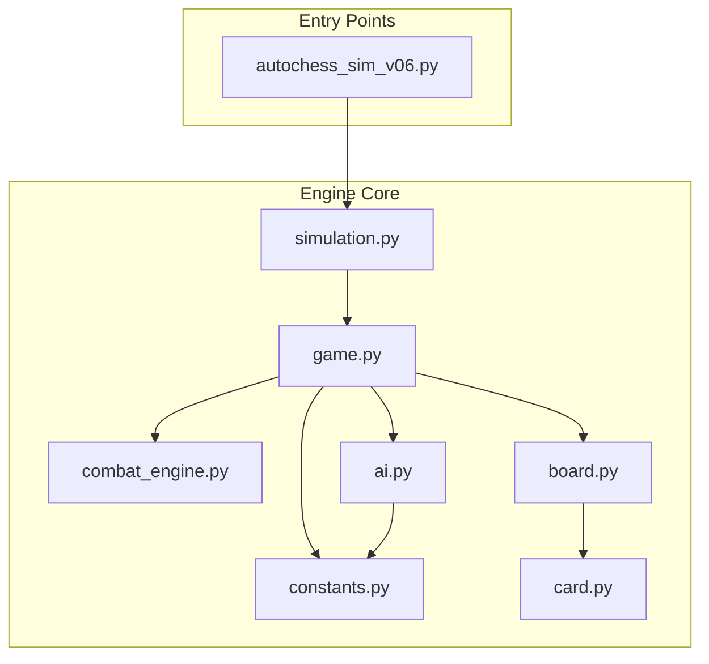
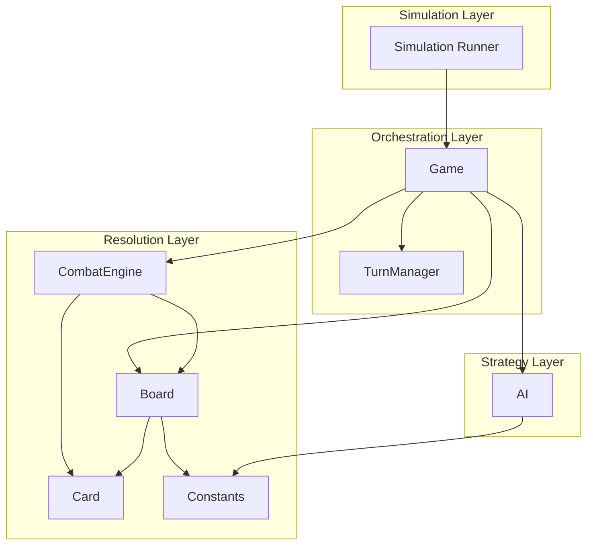
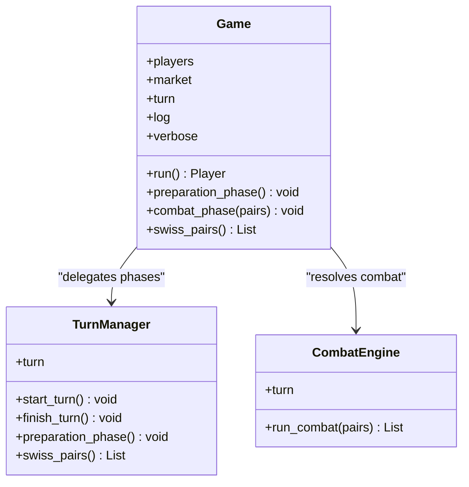
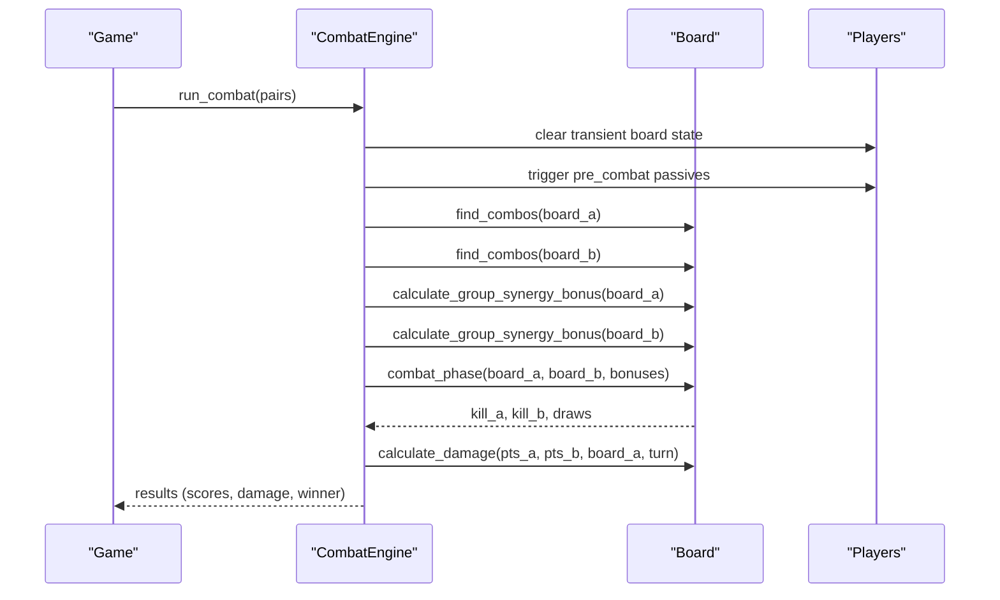
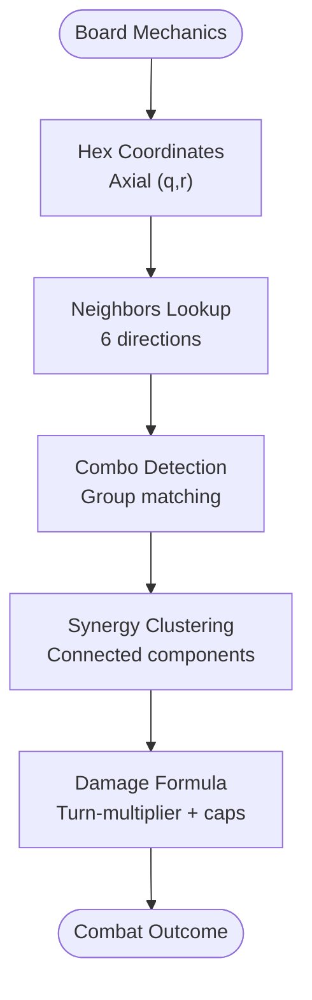
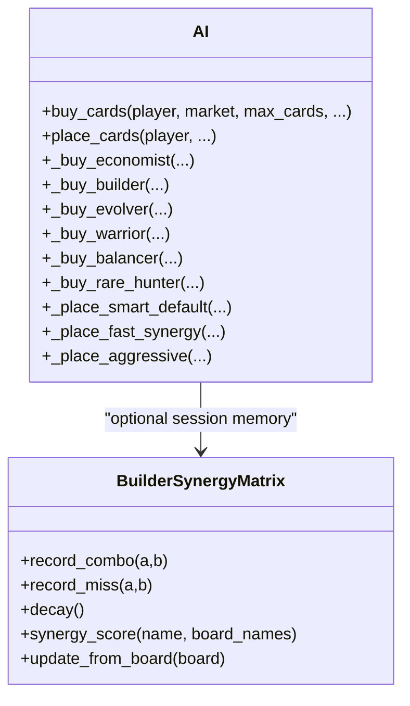
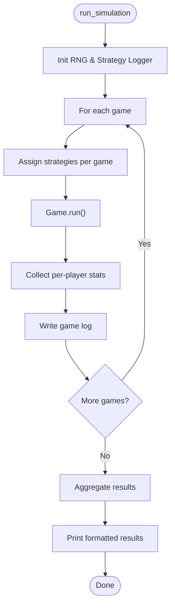
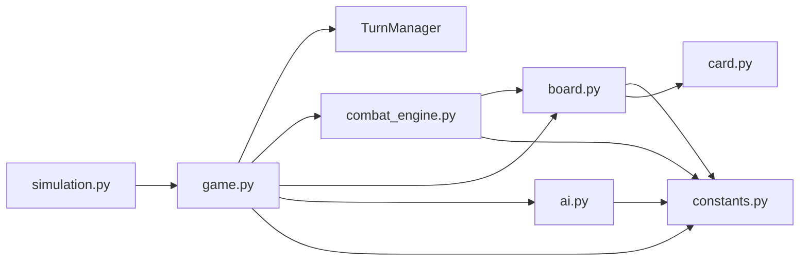

# Introduction and Purpose

<cite>
**Referenced Files in This Document**
- [README.md](file://README.md)
- [AUTOCHESS_HYBRID_FINAL_GDD.md](file://AUTOCHESS_HYBRID_FINAL_GDD.md)
- [engine_core/autochess_sim_v06.py](file://engine_core/autochess_sim_v06.py)
- [engine_core/game.py](file://engine_core/game.py)
- [engine_core/combat_engine.py](file://engine_core/combat_engine.py)
- [engine_core/board.py](file://engine_core/board.py)
- [engine_core/ai.py](file://engine_core/ai.py)
- [engine_core/simulation.py](file://engine_core/simulation.py)
- [engine_core/constants.py](file://engine_core/constants.py)
- [engine_core/card.py](file://engine_core/card.py)
</cite>

## Table of Contents
1. [Introduction](#introduction)
2. [Project Structure](#project-structure)
3. [Core Components](#core-components)
4. [Architecture Overview](#architecture-overview)
5. [Detailed Component Analysis](#detailed-component-analysis)
6. [Dependency Analysis](#dependency-analysis)
7. [Performance Considerations](#performance-considerations)
8. [Troubleshooting Guide](#troubleshooting-guide)
9. [Conclusion](#conclusion)

## Introduction
Autochess Hybrid is a hex-grid based autochess simulation engine designed to automate 8-player strategic combat resolution. Its mission is to advance gaming AI research by providing a production-ready framework that resolves turn-based autochess battles through deterministic combat resolution, while enabling AI strategy experimentation and evaluation. The project bridges academic exploration of strategy game mechanics with practical simulation needs, offering both research-grade benchmarking and commercial-ready automation for competitive balance analysis, AI tuning, and gameplay research.

Key terminology from the codebase:
- autochess: The genre and core gameplay loop
- hex-grid: The board topology underlying placement and adjacency
- combat resolution: The deterministic process that computes outcomes between opposing cards
- AI strategy: Automated decision-making systems for buying and placing cards

Positioning within the broader gaming AI ecosystem:
- Research: The engine supports controlled experiments on AI strategies, synergy mechanics, and economic models, with extensive logging and KPI aggregation.
- Education: The modular design and documented mechanics make it suitable for teaching strategy game simulation and AI decision-making.
- Commercial: The simulation framework can power competitive balance analysis, card power evaluation, and automated tournament scheduling.

Evolution from experimental AI research to production-ready simulation:
- The project began as an experimental AI research effort and evolved into a robust simulation framework with a dedicated Game orchestration layer, TurnManager separation, and a dedicated CombatEngine for combat resolution.
- The engine now supports automated batch simulations, strategy parameterization, and detailed analytics, transitioning from proof-of-concept to a production-grade tool for AI strategy research and balance validation.

Academic and commercial applications:
- Academic: Investigate emergent strategies, evaluate AI decision policies, and study the interplay between synergy, combo, and economy systems.
- Commercial: Drive competitive balance, tune card pools, and automate large-scale tournaments or live-event simulations.

**Section sources**
- [README.md:1-233](file://README.md#L1-L233)
- [AUTOCHESS_HYBRID_FINAL_GDD.md:32-47](file://AUTOCHESS_HYBRID_FINAL_GDD.md#L32-L47)
- [engine_core/autochess_sim_v06.py:31-36](file://engine_core/autochess_sim_v06.py#L31-L36)

## Project Structure
The project is organized around a simulation engine core, AI strategies, and auxiliary modules for combat resolution, board mechanics, and economy. The structure supports both interactive scenes and automated simulations.

**Diagram sources**
- [engine_core/game.py:35-96](file://engine_core/game.py#L35-L96)
- [engine_core/combat_engine.py:22-44](file://engine_core/combat_engine.py#L22-L44)
- [engine_core/board.py:54-107](file://engine_core/board.py#L54-L107)
- [engine_core/ai.py:214-233](file://engine_core/ai.py#L214-L233)
- [engine_core/simulation.py:113-130](file://engine_core/simulation.py#L113-L130)
- [engine_core/constants.py:14-145](file://engine_core/constants.py#L14-L145)
- [engine_core/card.py:48-120](file://engine_core/card.py#L48-L120)
- [engine_core/autochess_sim_v06.py:78-107](file://engine_core/autochess_sim_v06.py#L78-L107)

**Section sources**
- [README.md:7-58](file://README.md#L7-L58)
- [engine_core/game.py:35-96](file://engine_core/game.py#L35-L96)

## Core Components
- Game orchestrator: Manages the overall game loop, delegates preparation and combat phases, and integrates TurnManager and CombatEngine.
- CombatEngine: Centralized combat resolution pipeline, including pre-combat passives, combo detection, synergy scoring, and damage computation.
- Board: Hex-grid representation with neighbor queries, combo detection, synergy clustering, and damage formula.
- AI strategies: Parameterized AI implementations for buying and placing cards, including economy-aware phases and synergy targeting.
- Simulation runner: Executes multiple games, aggregates statistics, and writes detailed logs for analysis.
- Constants and card model: Defines stat groups, board geometry, economy rules, and card metadata/state.

These components collectively enable automated 8-player autochess simulations with deterministic combat resolution and rich AI strategy experimentation.

**Section sources**
- [engine_core/game.py:35-224](file://engine_core/game.py#L35-L224)
- [engine_core/combat_engine.py:22-271](file://engine_core/combat_engine.py#L22-L271)
- [engine_core/board.py:54-449](file://engine_core/board.py#L54-L449)
- [engine_core/ai.py:214-800](file://engine_core/ai.py#L214-L800)
- [engine_core/simulation.py:113-284](file://engine_core/simulation.py#L113-L284)
- [engine_core/constants.py:14-145](file://engine_core/constants.py#L14-L145)
- [engine_core/card.py:48-316](file://engine_core/card.py#L48-L316)

## Architecture Overview
The engine separates concerns across layers:
- Orchestration: Game and TurnManager handle turn lifecycle and phase sequencing.
- Simulation: Simulation runner coordinates multiple games and collects metrics.
- Resolution: Board and CombatEngine implement deterministic combat resolution and scoring.
- Strategy: AI module encapsulates decision-making logic and parameterization.
- Data: Card and constants define game state and rules.

**Diagram sources**
- [engine_core/game.py:35-224](file://engine_core/game.py#L35-L224)
- [engine_core/combat_engine.py:22-271](file://engine_core/combat_engine.py#L22-L271)
- [engine_core/board.py:54-449](file://engine_core/board.py#L54-L449)
- [engine_core/ai.py:214-800](file://engine_core/ai.py#L214-L800)
- [engine_core/simulation.py:113-284](file://engine_core/simulation.py#L113-L284)
- [engine_core/constants.py:14-145](file://engine_core/constants.py#L14-L145)
- [engine_core/card.py:48-316](file://engine_core/card.py#L48-L316)

## Detailed Component Analysis

### Game Orchestration and Turn Management
The Game class orchestrates the full match flow, delegating preparation and combat phases to TurnManager and CombatEngine respectively. It initializes players, markets, RNG, and logging, and exposes properties for turn synchronization.

**Diagram sources**
- [engine_core/game.py:35-224](file://engine_core/game.py#L35-L224)
- [engine_core/combat_engine.py:22-106](file://engine_core/combat_engine.py#L22-L106)

**Section sources**
- [engine_core/game.py:35-224](file://engine_core/game.py#L35-L224)

### Combat Resolution Pipeline
CombatEngine drives the combat resolution process, including pre-combat passives, combo detection, synergy scoring, and damage computation. Board provides the hex-grid utilities and scoring functions.

**Diagram sources**
- [engine_core/combat_engine.py:106-271](file://engine_core/combat_engine.py#L106-L271)
- [engine_core/board.py:393-449](file://engine_core/board.py#L393-L449)

**Section sources**
- [engine_core/combat_engine.py:106-271](file://engine_core/combat_engine.py#L106-L271)
- [engine_core/board.py:393-449](file://engine_core/board.py#L393-L449)

### Hex-Grid and Board Mechanics
The Board module defines the hex-grid coordinate system, neighbor queries, combo detection, synergy scoring, and damage calculation. It centralizes the geometric and adjacency logic used by combat resolution.

**Diagram sources**
- [engine_core/board.py:28-449](file://engine_core/board.py#L28-L449)
- [engine_core/constants.py:65-101](file://engine_core/constants.py#L65-L101)

**Section sources**
- [engine_core/board.py:28-449](file://engine_core/board.py#L28-L449)
- [engine_core/constants.py:65-101](file://engine_core/constants.py#L65-L101)

### AI Strategy Decision-Making
The AI module encapsulates multiple strategies for buying and placing cards, including economy-aware phases, combo targeting, and synergy matrix learning. It supports parameterized strategies for research and tuning.

**Diagram sources**
- [engine_core/ai.py:214-800](file://engine_core/ai.py#L214-L800)
- [engine_core/ai.py:135-210](file://engine_core/ai.py#L135-L210)

**Section sources**
- [engine_core/ai.py:214-800](file://engine_core/ai.py#L214-L800)

### Simulation Runner and Metrics
The simulation runner executes multiple games, assigns strategies, and aggregates statistics such as win rates, average damage, kills, final HP, synergy averages, and economy efficiency. It writes detailed logs for post-run analysis.

**Diagram sources**
- [engine_core/simulation.py:113-284](file://engine_core/simulation.py#L113-L284)

**Section sources**
- [engine_core/simulation.py:113-284](file://engine_core/simulation.py#L113-L284)

## Dependency Analysis
The engine exhibits clear layering and low coupling:
- Game depends on TurnManager, CombatEngine, Board, AI, and constants.
- CombatEngine depends on Board and constants for scoring and damage.
- Board depends on constants for geometry and stat mappings.
- AI depends on constants for scoring and economy rules.
- Simulation depends on Game and constants for orchestration and metrics.

**Diagram sources**
- [engine_core/simulation.py:20-26](file://engine_core/simulation.py#L20-L26)
- [engine_core/game.py:22-28](file://engine_core/game.py#L22-L28)
- [engine_core/combat_engine.py:18-20](file://engine_core/combat_engine.py#L18-L20)
- [engine_core/board.py:18-21](file://engine_core/board.py#L18-L21)
- [engine_core/ai.py:72-75](file://engine_core/ai.py#L72-L75)
- [engine_core/constants.py:11-12](file://engine_core/constants.py#L11-L12)
- [engine_core/card.py:18-21](file://engine_core/card.py#L18-L21)

**Section sources**
- [engine_core/simulation.py:20-26](file://engine_core/simulation.py#L20-L26)
- [engine_core/game.py:22-28](file://engine_core/game.py#L22-L28)
- [engine_core/combat_engine.py:18-20](file://engine_core/combat_engine.py#L18-L20)
- [engine_core/board.py:18-21](file://engine_core/board.py#L18-L21)
- [engine_core/ai.py:72-75](file://engine_core/ai.py#L72-L75)
- [engine_core/constants.py:11-12](file://engine_core/constants.py#L11-L12)
- [engine_core/card.py:18-21](file://engine_core/card.py#L18-L21)

## Performance Considerations
- Deterministic combat resolution: The engine computes outcomes deterministically, enabling reproducible experiments and fast batch runs.
- Modular design: Separation of concerns reduces coupling and improves maintainability, aiding performance tuning.
- Parameterized AI: Strategy parameters allow rapid policy iteration without changing core logic.
- Logging and metrics: Strategy and passive logs enable targeted optimization without runtime overhead unless enabled.

[No sources needed since this section provides general guidance]

## Troubleshooting Guide
Common issues and resolutions:
- Simulation hangs or infinite loops: Verify turn guards and game termination conditions in the main loop.
- Strategy parameter loading failures: Ensure trained_params.json is valid and accessible; the AI module includes crash-proof loading.
- Card pool validation errors: Use the card pool validator to detect power cap violations or incorrect stat counts.
- Combat imbalance: Review synergy caps, combo modifiers, and damage formulas; adjust parameters accordingly.

**Section sources**
- [engine_core/autochess_sim_v06.py:53-72](file://engine_core/autochess_sim_v06.py#L53-L72)
- [engine_core/ai.py:78-114](file://engine_core/ai.py#L78-L114)
- [engine_core/game.py:203-224](file://engine_core/game.py#L203-L224)

## Conclusion
Autochess Hybrid advances gaming AI research by providing a hex-grid based autochess simulation engine capable of automated 8-player combat resolution. Its layered architecture, deterministic combat pipeline, and parameterized AI strategies enable both academic investigation and commercial automation. The project’s evolution from experimental research to a production-ready framework demonstrates its practical value for competitive balance, AI tuning, and strategy game simulation research.

[No sources needed since this section summarizes without analyzing specific files]