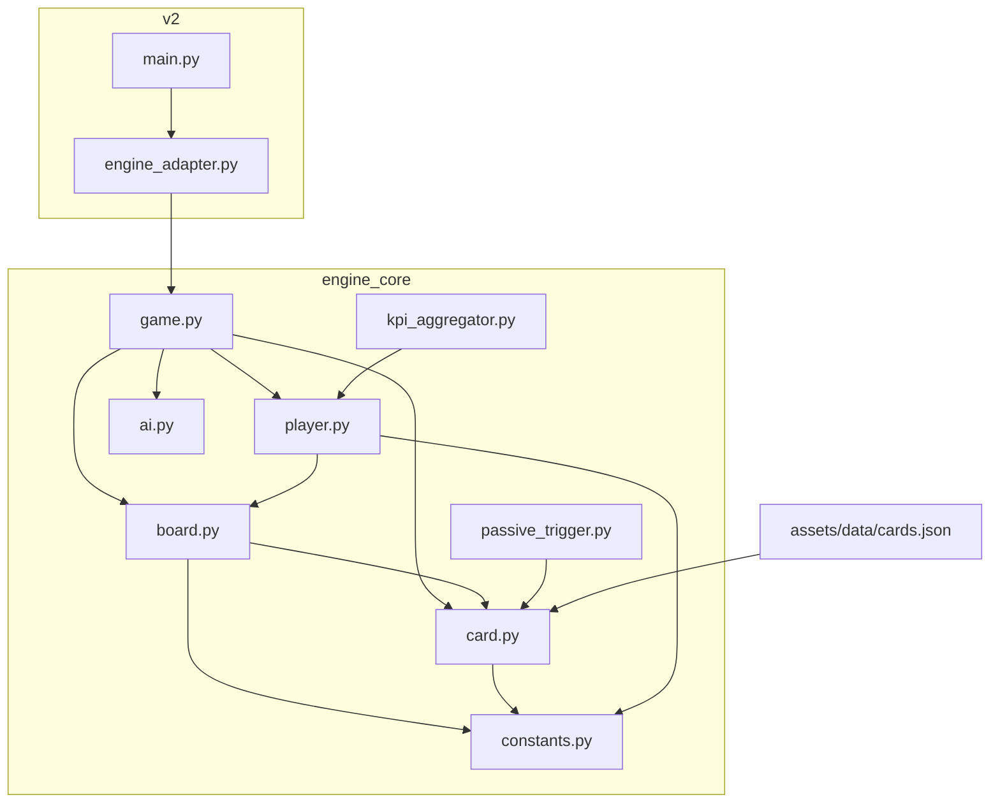
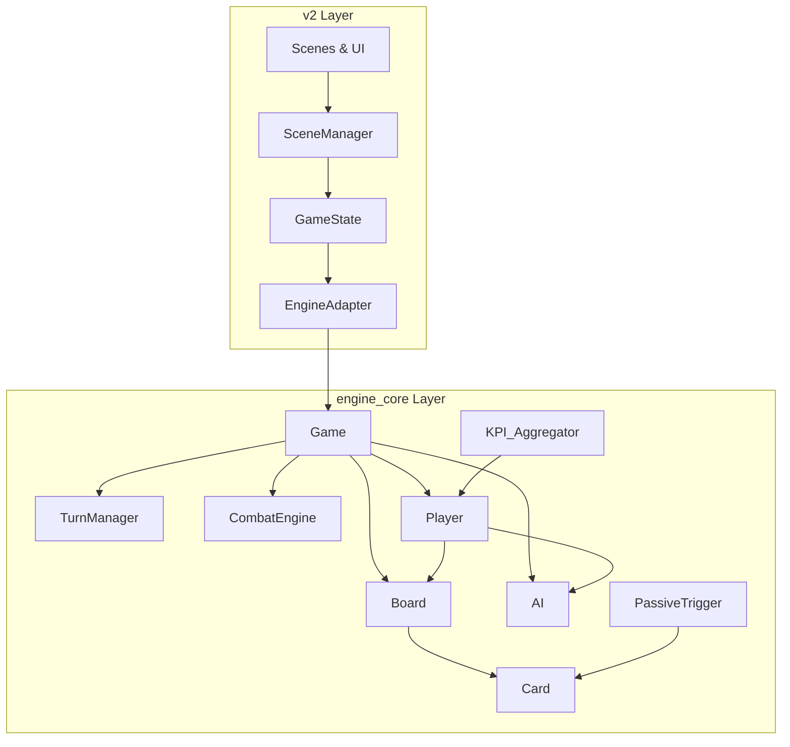
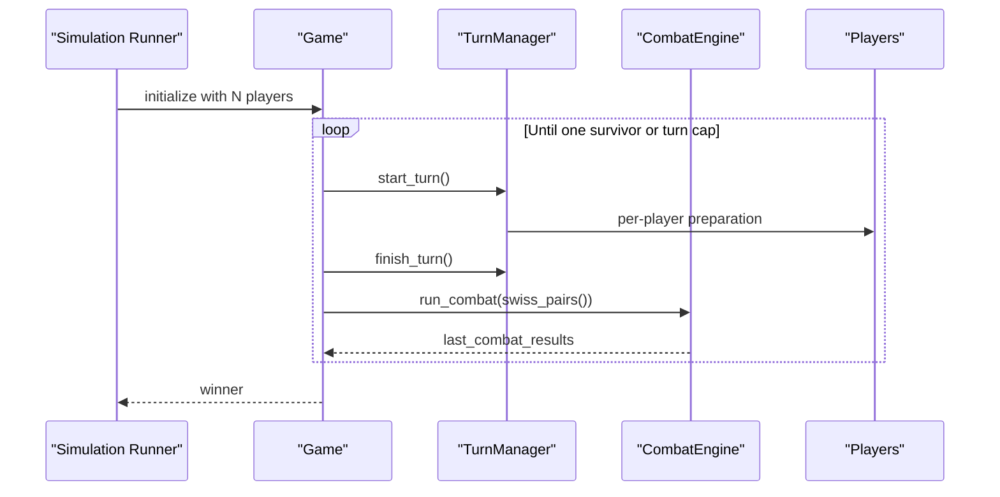
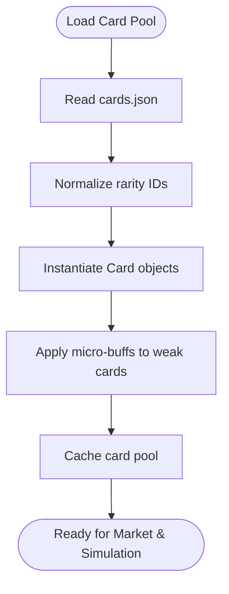
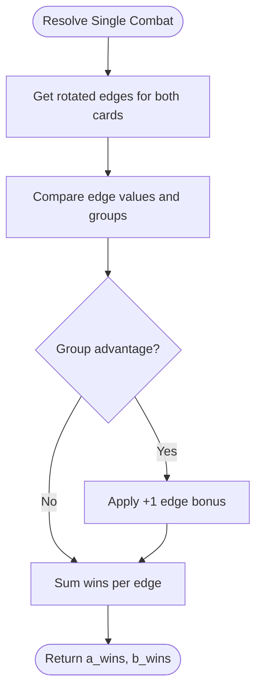
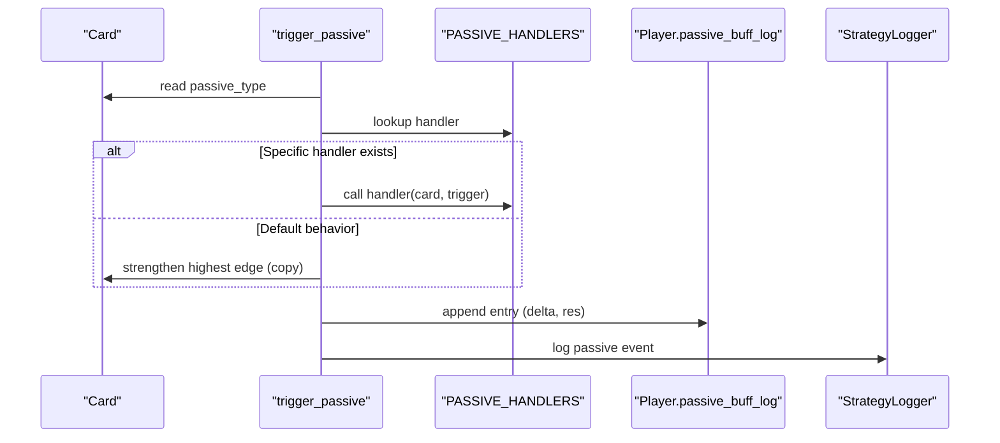
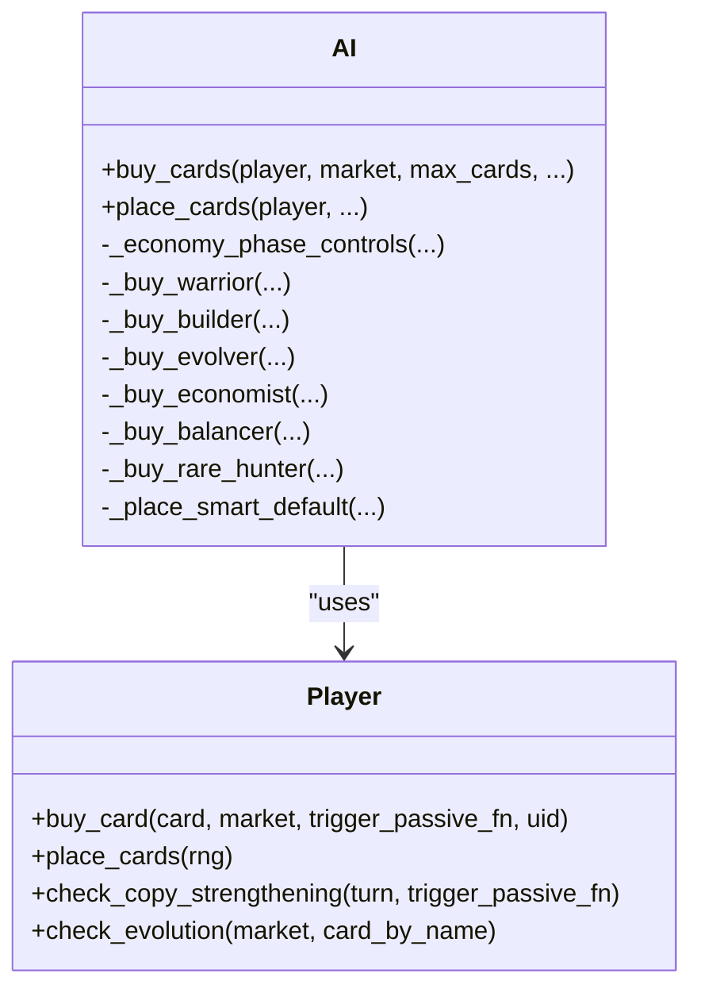
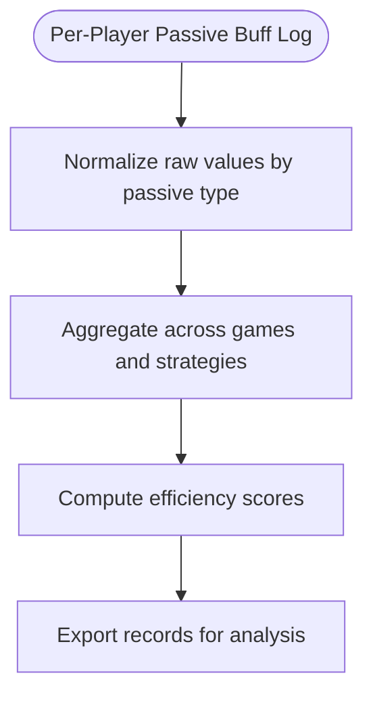
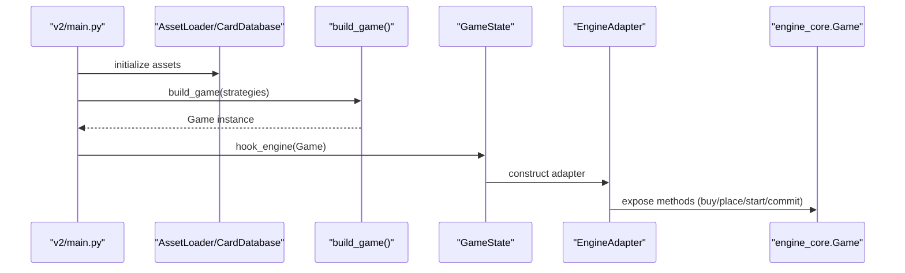
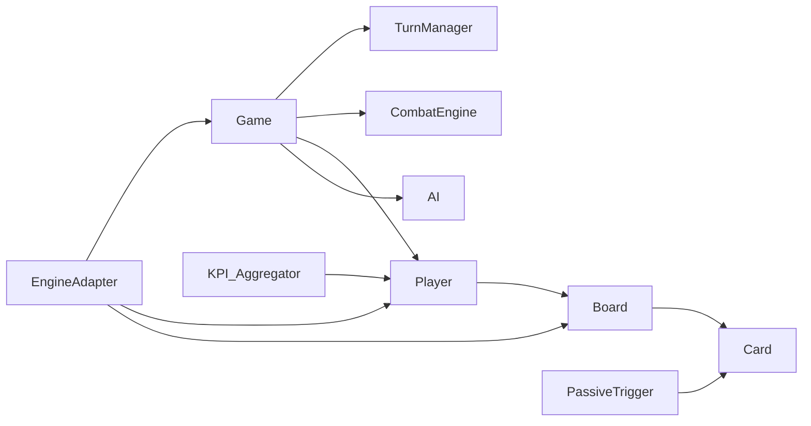

# Key Features Overview

<cite>
**Referenced Files in This Document**
- [autochess_sim_v06.py](file://engine_core/autochess_sim_v06.py)
- [simulation.py](file://engine_core/simulation.py)
- [game.py](file://engine_core/game.py)
- [board.py](file://engine_core/board.py)
- [card.py](file://engine_core/card.py)
- [player.py](file://engine_core/player.py)
- [constants.py](file://engine_core/constants.py)
- [passive_trigger.py](file://engine_core/passive_trigger.py)
- [ai.py](file://engine_core/ai.py)
- [kpi_aggregator.py](file://engine_core/kpi_aggregator.py)
- [registry.py](file://engine_core/passives/registry.py)
- [engine_adapter.py](file://v2/core/engine_adapter.py)
- [main.py](file://v2/main.py)
- [AUTOCHESS_HYBRID_FINAL_GDD.md](file://AUTOCHESS_HYBRID_FINAL_GDD.md)
- [CODEBASE_ARCHITECTURE_ANALYSIS.md](file://CODEBASE_ARCHITECTURE_ANALYSIS.md)
- [ARCHITECT_REPORT_EXECUTIVE_SUMMARY.md](file://FINAL_REFACTOR_EXECUTION/ARCHITECT_REPORT_EXECUTIVE_SUMMARY.md)
</cite>

## Table of Contents
1. [Introduction](#introduction)
2. [Project Structure](#project-structure)
3. [Core Components](#core-components)
4. [Architecture Overview](#architecture-overview)
5. [Detailed Component Analysis](#detailed-component-analysis)
6. [Dependency Analysis](#dependency-analysis)
7. [Performance Considerations](#performance-considerations)
8. [Troubleshooting Guide](#troubleshooting-guide)
9. [Conclusion](#conclusion)
10. [Appendices](#appendices)

## Introduction
This document presents the Autochess Hybrid key features overview, focusing on the simulation framework’s core capabilities: 8-player autochess simulation, the 101-card pool system, hex-grid combat mechanics, the passive ability system, AI strategy implementations, and KPI tracking/analytics. It explains how each feature contributes to the research and development goals, highlights the transition from a legacy monolithic architecture to a modern scene-based architecture, and outlines technical specifications, interdependencies, and planned enhancements.

## Project Structure
The project is organized into:
- engine_core: Pure game engine with no UI dependencies, containing the simulation kernel, board mechanics, card system, AI strategies, passives, and analytics.
- v2: Scene-based UI layer that bridges to engine_core via an adapter, enabling interactive gameplay and state synchronization.
- assets/data: Centralized card database and passive definitions.
- docs: Design documents and architecture analyses.

**Diagram sources**
- [main.py:14-35](file://v2/main.py#L14-L35)
- [engine_adapter.py:38-301](file://v2/core/engine_adapter.py#L38-L301)
- [game.py:35-224](file://engine_core/game.py#L35-L224)
- [board.py:54-449](file://engine_core/board.py#L54-L449)
- [card.py:48-316](file://engine_core/card.py#L48-L316)
- [player.py:22-250](file://engine_core/player.py#L22-L250)
- [ai.py:214-800](file://engine_core/ai.py#L214-L800)
- [passive_trigger.py:21-138](file://engine_core/passive_trigger.py#L21-L138)
- [kpi_aggregator.py:11-161](file://engine_core/kpi_aggregator.py#L11-L161)
- [constants.py:14-145](file://engine_core/constants.py#L14-L145)

**Section sources**
- [CODEBASE_ARCHITECTURE_ANALYSIS.md:23-98](file://CODEBASE_ARCHITECTURE_ANALYSIS.md#L23-L98)
- [AUTOCHESS_HYBRID_FINAL_GDD.md:1-200](file://AUTOCHESS_HYBRID_FINAL_GDD.md#L1-L200)

## Core Components
- Simulation Runner: orchestrates multiple games, manages strategy logging, and aggregates results.
- Game Engine: encapsulates turn flow, Swiss pairing, preparation and combat phases, and player lifecycle.
- Board and Hex Grid: axial coordinate system, neighbor queries, combo detection, synergy scoring, and damage calculation.
- Card System: stat pipeline, edge rotation, passive tagging, evolution scaling, and micro-buff normalization.
- Player Model: economy, inventory, progression, and board management with strategy-specific behaviors.
- AI Strategies: parameterized economic phases, combo-focused builders, evolution targeting, and randomized placements.
- Passive System: trigger registry, handler dispatch, and passive efficiency logging.
- Analytics: KPI aggregator for normalized passive efficiency and strategy performance metrics.

**Section sources**
- [simulation.py:113-218](file://engine_core/simulation.py#L113-L218)
- [game.py:35-224](file://engine_core/game.py#L35-L224)
- [board.py:54-449](file://engine_core/board.py#L54-L449)
- [card.py:48-316](file://engine_core/card.py#L48-L316)
- [player.py:22-250](file://engine_core/player.py#L22-L250)
- [ai.py:214-800](file://engine_core/ai.py#L214-L800)
- [passive_trigger.py:21-138](file://engine_core/passive_trigger.py#L21-L138)
- [kpi_aggregator.py:11-161](file://engine_core/kpi_aggregator.py#L11-L161)

## Architecture Overview
The system follows a layered architecture:
- engine_core: pure logic, no UI dependencies, single source of truth for game state.
- v2: scene-based UI layer with an adapter that exposes engine state to the UI and translates user actions into engine commands.
- Assets: centralized card database and passive definitions.

**Diagram sources**
- [main.py:37-74](file://v2/main.py#L37-L74)
- [engine_adapter.py:38-301](file://v2/core/engine_adapter.py#L38-L301)
- [game.py:35-224](file://engine_core/game.py#L35-L224)
- [board.py:54-449](file://engine_core/board.py#L54-L449)
- [card.py:48-316](file://engine_core/card.py#L48-L316)
- [player.py:22-250](file://engine_core/player.py#L22-L250)
- [ai.py:214-800](file://engine_core/ai.py#L214-L800)
- [passive_trigger.py:21-138](file://engine_core/passive_trigger.py#L21-L138)
- [kpi_aggregator.py:11-161](file://engine_core/kpi_aggregator.py#L11-L161)

## Detailed Component Analysis

### 8-Player Autochess Simulation
- Purpose: Automated N-player matches using Swiss pairing to ensure balanced competition.
- Implementation:
  - Game.run() alternates preparation and combat phases until one player remains or turn cap reached.
  - Swiss pairing sorts alive players by HP with jitter and pairs nearest opponents.
  - TurnManager coordinates market windows, income, interest, and AI actions.
- Interdependencies:
  - Game depends on TurnManager, CombatEngine, Players, and Market.
  - CombatEngine depends on Board, passive triggers, and synergy calculations.
- Research impact: Enables large-scale strategy comparisons and balance tuning across 8 strategies.

**Diagram sources**
- [simulation.py:113-218](file://engine_core/simulation.py#L113-L218)
- [game.py:157-224](file://engine_core/game.py#L157-L224)
- [board.py:393-449](file://engine_core/board.py#L393-L449)

**Section sources**
- [game.py:203-224](file://engine_core/game.py#L203-L224)
- [simulation.py:113-218](file://engine_core/simulation.py#L113-L218)
- [AUTOCHESS_HYBRID_FINAL_GDD.md:99-190](file://AUTOCHESS_HYBRID_FINAL_GDD.md#L99-L190)

### 101-Card Pool System
- Purpose: Centralized card database with stats, categories, and passive tags; supports micro-buffs and evolution scaling.
- Implementation:
  - Card class stores base stats and meta, with an effect pipeline for dynamic stat changes.
  - Card pool loaded from assets/data/cards.json, normalized to internal rarity IDs.
  - Micro-buff normalizes weak cards; evolved cards scale to target totals per rarity.
- Interdependencies:
  - Game and Player rely on get_card_pool() for market generation.
  - Passive system references card names and passive types.
- Research impact: Enables controlled balance experiments and passive coverage analysis.

**Diagram sources**
- [card.py:246-316](file://engine_core/card.py#L246-L316)
- [constants.py:28-58](file://engine_core/constants.py#L28-L58)

**Section sources**
- [card.py:237-316](file://engine_core/card.py#L237-L316)
- [constants.py:28-58](file://engine_core/constants.py#L28-L58)
- [autochess_sim_v06.py:53-71](file://engine_core/autochess_sim_v06.py#L53-L71)

### Hex-Grid Combat Mechanics
- Purpose: Axial hex coordinate system with neighbor queries, edge-based combat, combo detection, and synergy scoring.
- Implementation:
  - Board.grid maps axial coordinates to cards; coord_index enables O(1) reverse lookup.
  - resolve_single_combat compares rotated edges, applies group advantage, and distributes combat bonuses.
  - find_combos detects matching edges for micro-combat bonuses; calculate_group_synergy_bonus computes connected cluster tiers and internal line bonuses.
  - calculate_damage balances score gaps, board presence, rarity contributions, and turn-multipliers with early-game caps.
- Interdependencies:
  - Board depends on Card, constants, and passive triggers.
  - CombatEngine composes Board and passive triggers.
- Research impact: Provides precise tactical analysis and synergy quantification.

**Diagram sources**
- [board.py:142-186](file://engine_core/board.py#L142-L186)

**Section sources**
- [board.py:28-449](file://engine_core/board.py#L28-L449)
- [constants.py:65-101](file://engine_core/constants.py#L65-L101)

### Passive Ability System
- Purpose: Tag-based passive triggers with handler registration and logging for analytics.
- Implementation:
  - trigger_passive dispatches by card name/type, logs deltas and results, and integrates with strategy logging.
  - PASSIVE_HANDLERS registry auto-discovers handlers from passives modules.
  - Default behaviors for passive types (e.g., copy strengthening) ensure robustness.
- Interdependencies:
  - Card passive_type drives trigger_passive; passive handlers mutate Card state.
  - KPI_Aggregator consumes passive_buff_log for normalized efficiency metrics.
- Research impact: Enables passive coverage and efficiency analysis across strategies.

**Diagram sources**
- [passive_trigger.py:21-96](file://engine_core/passive_trigger.py#L21-L96)
- [registry.py:13-17](file://engine_core/passives/registry.py#L13-L17)

**Section sources**
- [passive_trigger.py:21-138](file://engine_core/passive_trigger.py#L21-L138)
- [registry.py:13-17](file://engine_core/passives/registry.py#L13-L17)

### AI Strategy Implementations
- Purpose: Parameterized AI strategies for buying and placement decisions under phase-aware economies.
- Implementation:
  - AI strategies include random, warrior, builder, evolver, economist, balancer, rare_hunter, and tempo.
  - Economist model defines three phases (GREED → SPIKE → CONVERT) with thresholds and buy caps.
  - Builder combines combo scoring with phase controls and optional synergy matrix memory.
  - Placement logic optimizes combo proximity and center bias depending on strategy.
- Interdependencies:
  - AI.buy_cards and AI.place_cards integrate with Player, Market, and passive triggers.
  - Strategy parameters loaded from JSON for reproducible tuning.
- Research impact: Supports strategy benchmarking, parameter tuning, and behavioral analysis.

**Diagram sources**
- [ai.py:214-800](file://engine_core/ai.py#L214-L800)
- [player.py:124-241](file://engine_core/player.py#L124-L241)

**Section sources**
- [ai.py:78-123](file://engine_core/ai.py#L78-L123)
- [ai.py:235-348](file://engine_core/ai.py#L235-L348)
- [ai.py:415-520](file://engine_core/ai.py#L415-L520)
- [ai.py:522-574](file://engine_core/ai.py#L522-L574)
- [ai.py:576-616](file://engine_core/ai.py#L576-L616)
- [ai.py:618-643](file://engine_core/ai.py#L618-L643)
- [ai.py:646-686](file://engine_core/ai.py#L646-L686)
- [player.py:124-241](file://engine_core/player.py#L124-L241)

### KPI Tracking and Analytics
- Purpose: Aggregate passive efficiency and strategy performance for research insights.
- Implementation:
  - KPI_Aggregator normalizes raw passive values using conversion factors and computes efficiency scores.
  - Simulation writes per-game logs and prints summarized statistics including win rates, averages, and synergy/economy ratios.
  - StrategyLogger captures per-event analytics for advanced analysis.
- Interdependencies:
  - KPI_Aggregator reads Player.passive_buff_log; Simulation orchestrates logging and summaries.
- Research impact: Quantifies passive effectiveness and strategy viability across thousands of simulations.

**Diagram sources**
- [kpi_aggregator.py:31-161](file://engine_core/kpi_aggregator.py#L31-L161)
- [simulation.py:32-107](file://engine_core/simulation.py#L32-L107)

**Section sources**
- [kpi_aggregator.py:11-161](file://engine_core/kpi_aggregator.py#L11-L161)
- [simulation.py:113-218](file://engine_core/simulation.py#L113-L218)

### Transition from Legacy Monolithic to Modern Scene-Based Architecture
- Legacy: engine_core contained UI-dependent scenes and modal integrations, complicating state separation and scalability.
- Modern: v2 introduces a scene-based UI layer with an adapter that exposes engine state and translates user actions into engine commands.
- Benefits:
  - Clear separation: engine_core remains pure logic; v2 handles rendering and user interaction.
  - Adapter pattern: EngineAdapter shields UI from engine internals and provides safe accessors.
  - Bootstrap flow: v2/main.py initializes assets, builds the engine, and hooks GameState.
- Risks and mitigations:
  - Parallel state maintenance risks (e.g., board cache desync) identified and documented; immediate fixes planned.
  - Error handling improvements and single-source-of-truth consolidation underway.

**Diagram sources**
- [main.py:14-35](file://v2/main.py#L14-L35)
- [engine_adapter.py:38-301](file://v2/core/engine_adapter.py#L38-L301)

**Section sources**
- [CODEBASE_ARCHITECTURE_ANALYSIS.md:101-183](file://CODEBASE_ARCHITECTURE_ANALYSIS.md#L101-L183)
- [ARCHITECT_REPORT_EXECUTIVE_SUMMARY.md:14-40](file://FINAL_REFACTOR_EXECUTION/ARCHITECT_REPORT_EXECUTIVE_SUMMARY.md#L14-L40)
- [main.py:14-35](file://v2/main.py#L14-L35)

## Dependency Analysis
- engine_core dependencies:
  - Game depends on TurnManager, CombatEngine, Player, Board, Market, and AI.
  - Board depends on Card, constants, and passive triggers.
  - Player composes Economy, Inventory, Progression, and Board.
- v2-to-engine_core dependencies:
  - EngineAdapter depends on Game, Player, Board, constants, and ActionResult.
  - GameState depends on EngineAdapter and UI adapters/formatters.
- No circular imports detected; unidirectional dependencies ensure stability.

**Diagram sources**
- [game.py:75-96](file://engine_core/game.py#L75-L96)
- [board.py:16-22](file://engine_core/board.py#L16-L22)
- [card.py:18-21](file://engine_core/card.py#L18-L21)
- [passive_trigger.py:14-15](file://engine_core/passive_trigger.py#L14-L15)
- [kpi_aggregator.py:22-29](file://engine_core/kpi_aggregator.py#L22-L29)
- [engine_adapter.py:44-46](file://v2/core/engine_adapter.py#L44-L46)

**Section sources**
- [CODEBASE_ARCHITECTURE_ANALYSIS.md:62-98](file://CODEBASE_ARCHITECTURE_ANALYSIS.md#L62-L98)

## Performance Considerations
- Turn-based scaling: combat damage caps and early-game multipliers reduce snowball effects and stabilize matches.
- Synergy computation: connected cluster scoring runs per combat; optimize by caching board snapshots and limiting BFS scope.
- Card pipeline: effect pipeline updates are O(1) per stat; ensure minimal allocations during combat loops.
- Logging overhead: per-game logs and strategy logs should be buffered and flushed periodically to avoid memory pressure.

[No sources needed since this section provides general guidance]

## Troubleshooting Guide
- Silent failures in EngineAdapter: ensure proper error handling and logging for invalid indices, insufficient gold, and engine exceptions.
- Passive efficiency anomalies: verify normalized value conversions and that passive_buff_log entries are well-formed.
- State desync risks: monitor board cache updates and ensure mutation hooks invalidate caches promptly.
- Strategy parameter loading: handle missing JSON gracefully and provide fallback defaults.

**Section sources**
- [engine_adapter.py:108-114](file://v2/core/engine_adapter.py#L108-L114)
- [engine_adapter.py:226-228](file://v2/core/engine_adapter.py#L226-L228)
- [kpi_aggregator.py:120-122](file://engine_core/kpi_aggregator.py#L120-L122)
- [ARCHITECT_REPORT_EXECUTIVE_SUMMARY.md:36-39](file://FINAL_REFACTOR_EXECUTION/ARCHITECT_REPORT_EXECUTIVE_SUMMARY.md#L36-L39)

## Conclusion
Autochess Hybrid integrates a robust simulation framework with a modern scene-based UI, enabling scalable research and development. The 8-player simulation, 101-card pool, hex-grid mechanics, passive system, AI strategies, and KPI analytics collectively support rigorous balance tuning and strategy analysis. The ongoing refactor addresses critical state synchronization and extensibility concerns, laying the groundwork for future enhancements such as expanded synergy types and combat mechanics.

[No sources needed since this section summarizes without analyzing specific files]

## Appendices

### Technical Specifications and Interdependencies
- Simulation Runner
  - run_simulation: orchestrates N games, shuffles strategies, logs per-game results, and prints aggregated statistics.
  - Interacts with Game, Player, constants, and strategy logger.
- Game Engine
  - Game.run(): alternates preparation and combat phases; Swiss pairing ensures balanced matchups.
  - Interacts with TurnManager, CombatEngine, Players, and Market.
- Board and Hex Grid
  - Axial coordinates, neighbor queries, combo detection, synergy scoring, and damage calculation.
  - Depends on Card, constants, and passive triggers.
- Card System
  - Effect pipeline, edge rotation, passive tagging, evolution scaling, and micro-buff normalization.
  - Consumed by Board, Player, and passive handlers.
- AI Strategies
  - Parameterized strategies with phase-aware economies and placement heuristics.
  - Integrates with Player, Market, and passive triggers.
- Passive System
  - Tag-based triggers, handler registry, and logging for analytics.
  - Drives Card mutations and feeds KPI aggregator.
- Analytics
  - KPI_Aggregator normalizes passive values and computes efficiency scores.
  - Simulation writes per-game logs and prints summaries.

**Section sources**
- [simulation.py:113-284](file://engine_core/simulation.py#L113-L284)
- [game.py:203-224](file://engine_core/game.py#L203-L224)
- [board.py:28-449](file://engine_core/board.py#L28-L449)
- [card.py:48-316](file://engine_core/card.py#L48-L316)
- [ai.py:214-800](file://engine_core/ai.py#L214-L800)
- [passive_trigger.py:21-138](file://engine_core/passive_trigger.py#L21-L138)
- [kpi_aggregator.py:11-161](file://engine_core/kpi_aggregator.py#L11-L161)